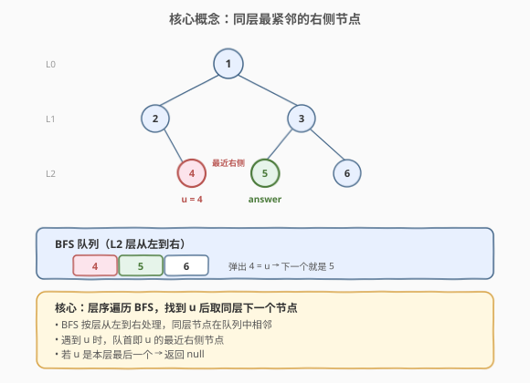
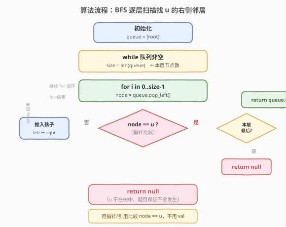
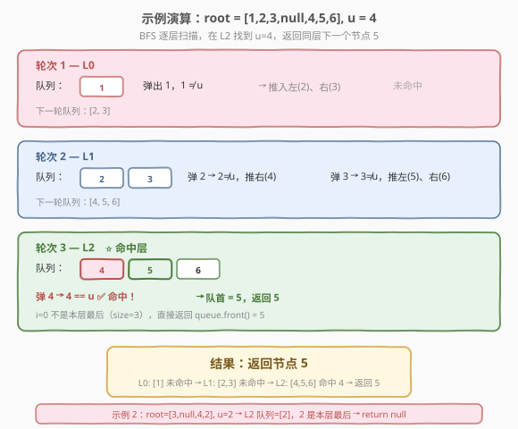

# 找到二叉树中最近的右侧节点

- **题目名称**：找到二叉树中最近的右侧节点
- **链接**：[1602. 找到二叉树中最近的右侧节点](https://leetcode.cn/problems/find-nearest-right-node-in-binary-tree/)
- **难度**：中等
- **标签**：树、二叉树、广度优先搜索（BFS）、深度优先搜索（DFS）

## 1. 题目概述

给定一棵二叉树的根节点 `root` 和树中的某个节点 `u`，返回 `u` 在**同一层**中**紧邻其右侧**的节点。若 `u` 已经是本层最右节点，则返回 `null`。

> 💡 直白理解：做一次层序遍历，在同一层从左到右找到 `u`，它右边挨着的那个节点就是答案。没有右邻居就返回 `null`。

**示例 1**：

```text
输入：root = [1,2,3,null,4,5,6], u = 4
输出：5

解释：
        1
       / \
      2   3
       \  / \
       4 5  6

节点 4 在第 2 层，该层从左到右为 [4, 5, 6]。
4 的最近右侧节点是 5。
```

**示例 2**：

```text
输入：root = [3,null,4,2], u = 2
输出：null

解释：
        3
         \
          4
         /
        2

节点 2 在第 2 层，该层只有 [2] 一个节点。
2 已是本层最右节点，没有右侧邻居，返回 null。
```

**约束条件**：

- 树中节点数目范围 `[1, 10^5]`
- `1 <= Node.val <= 10^5`
- 树中所有节点值**互不相同**
- `root` 和 `u` 均为树中存在的节点

> ⚠️ 本题是 **Plus 会员专享题**。题目要求按**节点引用**比较（`node == u`），而非按值比较——因为值唯一，实际两种比较等价，但语义上应理解为「找到 `u` 这个节点本身」。

---

## 2. 解题思路

### 2.1 暴力思路：DFS 收集每层节点列表

做一次完整遍历（DFS 或 BFS），把每一层的节点按从左到右的顺序存入二维数组 `levels[depth]`。然后在 `u` 所在层 `levels[d]` 中找到 `u` 的下标 `j`，返回 `levels[d][j+1]`（若 `j+1` 越界则返回 `null`）。

简单直观，但需要 $O(n)$ 额外空间存储所有层，且需要先找到 `u` 的深度再查表，两遍遍历。

### 2.2 核心观察：BFS 逐层扫描——找到 u 即取队首



关键想法来自 [102. 二叉树的层序遍历](../0101-0200/102_二叉树的层序遍历.md) 的 **BFS `while + for(size)` 模板**——逐层处理，同层节点在队列中**从左到右相邻排列**。因此：

- 在处理某一层时，逐个弹出节点；
- 若弹出的节点**等于 `u`**，则此时**队列的队首**就是 `u` 的最近右侧节点；
- 若 `u` 是本层最后一个（弹出后队列为空或已进入下一层），返回 `null`。

> 💡 **核心不变量**：BFS 按层处理，每层用 `for (i = 0; i < size; i++)` 限定范围。当 `for` 循环中弹出 `node == u` 时，队列中剩余的本层节点（若有）正好是 `u` 右侧的同层节点，**队首即最近右侧**。这是因为 BFS 的入队顺序是「左孩子先、右孩子后」，同层节点天然按从左到右排列。

### 2.3 算法流程图



**完整步骤**：

1. **特判**：`root == null` 返回 `null`（题目保证至少 1 节点）。
2. **初始化**：队列 `q = [root]`。
3. **while 队列非空**（每轮处理一整层）：
   - `size = q.size()`；
   - `for i in 0..size-1`：
     - `node = q.pop_front()`；
     - 若 `node == u`：
       - 若 `i == size - 1`（本层最后），返回 `null`；
       - 否则返回 `q.front()`（队首即 `u` 的右侧邻居）；
     - 若 `node` 有左/右孩子，按序推入队列。
4. 遍历结束未找到 `u`，返回 `null`（题目保证 `u` 在树中，此分支不可达）。

### 2.4 示例演算

以 `root = [1,2,3,null,4,5,6]`, `u = 4` 为例，BFS 共 3 轮：



| 轮次 | 层 | 队列（左→右） | 弹出节点 | 命中 u？ | 操作 |
|------|----|---------------|----------|----------|------|
| 1 | L0 | [1] | 1 | 否 | 推入 2, 3 |
| 2 | L1 | [2, 3] | 2, 3 | 否 | 2→推右(4)；3→推左(5)、右(6) |
| 3 | L2 | [4, 5, 6] | 4 | **是** ⭐ | `i=0 ≠ size-1=2` → 返回 `q.front() = 5` |

> 💡 **步骤 3 最关键**：弹出 4 时发现 `4 == u`，此时队列中还剩 `[5, 6]`（本层），队首 5 就是答案。注意孩子节点的推入发生在 `node == u` 判断**之后**——但此时已 `return`，不会推入 4 的孩子（4 是叶子，本就没有孩子），所以不影响结果。即便 4 有孩子，提前 `return` 也保证了正确性——我们只需要 `u` 的右侧邻居，不关心 `u` 的子树。

---

## 3. 参考代码

### 方法一：BFS 逐层扫描（主解，$O(n)$ 时间 / $O(n)$ 空间）

### C++

```cpp
#include <queue>
using namespace std;

struct TreeNode {
    int val;
    TreeNode* left;
    TreeNode* right;
    TreeNode() : val(0), left(nullptr), right(nullptr) {}
    TreeNode(int x) : val(x), left(nullptr), right(nullptr) {}
    TreeNode(int x, TreeNode* l, TreeNode* r) : val(x), left(l), right(r) {}
};

class Solution {
  public:
    TreeNode* findNearestRightNode(TreeNode* root, TreeNode* u) {
        if (!root || !u) return nullptr;
        queue<TreeNode*> q;
        q.push(root);
        while (!q.empty()) {
            int size = q.size();
            for (int i = 0; i < size; ++i) {
                TreeNode* node = q.front();
                q.pop();
                if (node == u) {
                    // u 是本层最后 → 无右侧邻居
                    if (i == size - 1) return nullptr;
                    return q.front(); // 队首即最近右侧节点
                }
                if (node->left)  q.push(node->left);
                if (node->right) q.push(node->right);
            }
        }
        return nullptr; // u 不在树中（题目保证不会发生）
    }
};
```

### Python

```python
from collections import deque
from typing import Optional


class Solution:
    def findNearestRightNode(self, root: Optional[TreeNode], u: Optional[TreeNode]) -> Optional[TreeNode]:
        if not root or not u:
            return None
        q = deque([root])
        while q:
            size = len(q)
            for i in range(size):
                node = q.popleft()
                if node == u:
                    if i == size - 1:
                        return None
                    return q[0]
                if node.left:
                    q.append(node.left)
                if node.right:
                    q.append(node.right)
        return None
```

> ⚠️ **易错点**：
> - **用指针比较 `node == u`，而非 `node->val == u->val`**。虽然题目保证值唯一使两者等价，但语义上应比较节点引用。若未来题目去掉「值唯一」约束，值比较会出错。
> - **`i == size - 1` 判断不可省**。若 `u` 是本层最后一个，弹出后队列中是**下一层**的节点，`q.front()` 取到的不是同层节点。必须先判 `i == size - 1` 返回 `null`，再取 `q.front()`。
> - **孩子推入在 `node == u` 判断之后**。即使 `u` 有孩子，`return` 后也不会推入，不影响正确性——我们只关心 `u` 的右侧邻居。

### 方法二：DFS 前序遍历（变体，$O(n)$ 时间 / $O(h)$ 空间）

### C++

```cpp
class Solution {
    TreeNode* target = nullptr;
    int targetDepth = -1;

    void dfs(TreeNode* node, int depth) {
        if (!node || target) return;       // 已找到答案，剪枝
        if (depth == targetDepth && node != u) {
            target = node;                 // 同层且在 u 之后（前序保证左→右）
            return;
        }
        if (node == u) {
            targetDepth = depth;           // 记录 u 的深度
            return;
        }
        dfs(node->left, depth + 1);
        dfs(node->right, depth + 1);
    }
    TreeNode* u;
  public:
    TreeNode* findNearestRightNode(TreeNode* root, TreeNode* u) {
        this->u = u;
        dfs(root, 0);
        return target;
    }
};
```

### Python

```python
class Solution:
    def findNearestRightNode(self, root: Optional[TreeNode], u: Optional[TreeNode]) -> Optional[TreeNode]:
        self.target = None
        self.target_depth = -1

        def dfs(node: Optional[TreeNode], depth: int) -> None:
            if not node or self.target:
                return
            if depth == self.target_depth and node is not u:
                self.target = node
                return
            if node is u:
                self.target_depth = depth
                return
            dfs(node.left, depth + 1)
            dfs(node.right, depth + 1)

        dfs(root, 0)
        return self.target
```

> 💡 **DFS 前序的正确性**：前序遍历（根→左→右）天然按**从左到右**的顺序访问同层节点。当遍历到 `u` 时记录其深度 `targetDepth`，此后遇到的第一个**同深度**节点必定是 `u` 的右侧邻居（因为前序从左到右，`u` 之后的同层节点都在其右侧）。找到后立即 `return` 剪枝，不再遍历剩余子树。

---

## 4. 复杂度分析

| 维度 | 方法一（BFS） | 方法二（DFS 前序） |
|------|---------------|---------------------|
| **时间复杂度** | $O(n)$ | $O(n)$（最坏）；找到后剪枝可提前终止 |
| **空间复杂度** | $O(n)$（队列最大存一层，最宽层 $\leq n/2$） | $O(h)$（递归栈深度，$h$ 为树高） |
| **提前终止** | 找到 `u` 即 `return`，不处理后续层 | 找到目标即 `return`，不遍历剩余子树 |

> 💡 **BFS vs DFS 空间对比**：BFS 队列空间取决于**最宽层**的节点数，最坏 $O(n)$（满二叉树底层 $\approx n/2$）；DFS 递归栈取决于**树高**，最坏 $O(n)$（退化成链），平衡树 $O(\log n)$。若树很深但很窄（如链状），DFS 更省空间；若树很宽但很浅（如满二叉树），BFS 队列较大但 DFS 栈浅。实际中两者均可 AC，BFS 更直观。

> ⚠️ **提前终止的优势**：若 `u` 在浅层，BFS 可在数轮内找到并返回，无需遍历整棵树。DFS 前序同样可以——一旦找到 `u` 的右侧邻居就剪枝。最坏情况（`u` 在最右下角）两者都需遍历 $O(n)$。

---

## 5. 扩展：BFS 与 DFS 的对比及变体

### 5.1 BFS vs DFS 对比

| 维度 | BFS（方法一） | DFS 前序（方法二） |
|------|---------------|---------------------|
| **遍历顺序** | 逐层从上到下，同层从左到右 | 前序根→左→右，同层天然从左到右 |
| **找 `u` 的方式** | 逐层弹队，逐个比较 | 递归深入，记录深度 |
| **找右侧邻居** | 队首即右侧邻居 | 下一个同深度节点 |
| **空间** | $O(n)$（队列） | $O(h)$（递归栈） |
| **代码直观度** | ⭐⭐⭐ 层序模板直接套 | ⭐⭐ 需理解「前序 = 从左到右」 |
| **提前终止** | `return` 后不再处理 | `self.target` 非空即剪枝 |

### 5.2 变体：记录每层末节点

若题目改为「批量查询多个节点的右侧邻居」，可以一次 BFS 预处理：对每层记录节点列表，查询时二分查找。但本题单次查询，BFS 直接找即可。

### 5.3 变体：迭代 DFS

DFS 也可用栈迭代实现，避免递归栈溢出（$n = 10^5$ 时递归深度可能超限）。用栈模拟前序，栈中存 `(node, depth)`，弹出时检查是否为 `u` 的右侧邻居。逻辑与递归版相同，只是手动管理栈。

---

## 6. 面试要点

1. **为什么 BFS 找到 `u` 后队首就是右侧邻居？**

   > BFS 按层处理，每层用 `for (i = 0; i < size; i++)` 限定范围。同层节点按从左到右入队（左孩子先、右孩子后），所以队列中同层节点从左到右排列。弹出 `u` 后，队列中剩余的本层节点都在 `u` 右侧，队首是最近的一个。

2. **`i == size - 1` 的判断为什么不能省？**

   > 若 `u` 是本层最后一个节点，弹出后队列中是**下一层**的节点（`u` 的孩子及后续节点的孩子已被推入）。此时 `q.front()` 取到的是下一层节点，不是同层节点。必须先判 `i == size - 1` 返回 `null`。

3. **BFS 和 DFS 两种解法怎么选？**

   > 两者时间都是 $O(n)$。BFS 空间 $O(n)$（队列存最宽层），DFS 空间 $O(h)$（递归栈）。若树深而窄（链状），DFS 更省；若树宽而浅（满二叉树），BFS 队列大但栈浅。面试中先讲 BFS（层序模板直观），再提 DFS 作为 $O(h)$ 空间优化。

4. **DFS 前序为什么能保证「从左到右」？**

   > 前序遍历的顺序是「根→左→右」。对于同一层的节点，左子树的节点总比右子树的节点先被访问（因为先递归 `left` 再递归 `right`）。因此前序遍历中，同层节点按从左到右出现。`u` 之后第一个同深度节点就是其右侧邻居。

5. **用值比较 `node->val == u->val` 行不行？**

   > 本题可以，因为题目保证所有节点值互不相同。但语义上应比较**节点引用** `node == u`——若题目去掉「值唯一」约束，值比较会匹配到错误的节点。面试中应说明这一点，体现对边界条件的考量。

> 💡 **一句话总结**：1602 的核心是「**BFS 逐层扫描，找到 `u` 取队首**」。难点不在 BFS 骨架，而在理解「同层节点在队列中相邻排列」这一不变量——弹出 `u` 后，队首天然就是其右侧邻居。配合 `i == size - 1` 判断处理 `u` 为本层末尾的边界，即可正确求解。

---

## 7. 同类练习题

- [102. 二叉树的层序遍历](https://leetcode.cn/problems/binary-tree-level-order-traversal/)（[题解](../0101-0200/102_二叉树的层序遍历.md)）：BFS `while + for(size)` 模板的母题，本题骨架来源
- [199. 二叉树的右视图](https://leetcode.cn/problems/binary-tree-right-side-view/)（[题解](../0101-0200/199_二叉树的右视图.md)）：BFS 每层取最右节点，与本题「找右侧邻居」思想互补
- [662. 二叉树最大宽度](https://leetcode.cn/problems/maximum-width-of-binary-tree/)（[题解](../0601-0700/662_二叉树最大宽度.md)）：BFS 逐层 + 节点编号，同属层序遍历应用
- [116. 填充每个节点的下一个右侧节点指针](https://leetcode.cn/problems/populating-next-right-pointers-in-each-node/)：BFS 逐层建立 `next` 指针，本题的「批量版」——给所有节点都连上右侧邻居
- [958. 二叉树的完全性检验](https://leetcode.cn/problems/check-completeness-of-a-binary-tree/)：层序遍历判空节点位置，同属 BFS 在树上的应用
