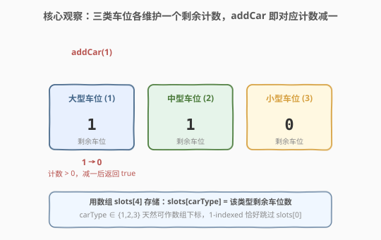
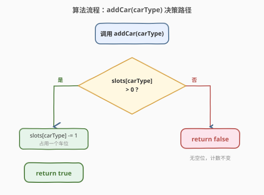
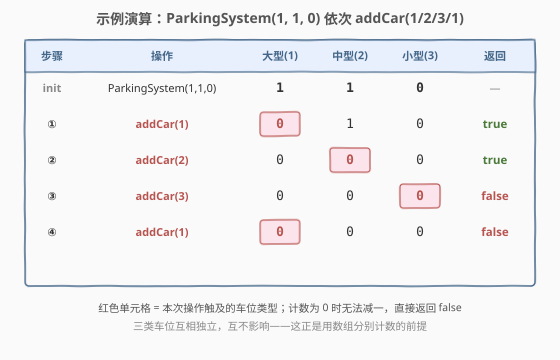

# 设计停车系统

- **题目名称**：设计停车系统
- **链接**：[1603. 设计停车系统](https://leetcode.cn/problems/design-parking-system/)
- **难度**：简单
- **标签**：设计、数组、模拟

## 1. 题目概述

给一个停车场设计停车系统。停车场有**三种**大小的停车位：大、中、小，每种大小的车位数量固定。实现 `ParkingSystem` 类：

- `ParkingSystem(int big, int medium, int small)`：初始化对象，三种车位的数量由参数给出。
- `bool addCar(int carType)`：检查是否有 `carType` 对应的空车位。车只能停入**对应类型**的车位。`carType` 取值：`1` = 大、`2` = 中、`3` = 小。若有空位则停入（该车位数**减一**）并返回 `true`，否则返回 `false`。

**示例 1**：

```text
输入：
["ParkingSystem", "addCar", "addCar", "addCar", "addCar"]
[[1, 1, 0], [1], [2], [3], [1]]
输出：
[null, true, true, false, false]

解释：
ParkingSystem ps = new ParkingSystem(1, 1, 0);
ps.addCar(1); // 返回 true，有 1 个可用大车位，停入后剩余 0
ps.addCar(2); // 返回 true，有 1 个可用中车位，停入后剩余 0
ps.addCar(3); // 返回 false，无可用小车位（初始即为 0）
ps.addCar(1); // 返回 false，大车位已被占满
```

**约束条件**：

- `0 <= big, medium, small <= 1000`
- `carType` 取值为 `1`、`2` 或 `3`
- `addCar` 最多调用 `1000` 次

> 💡 题目本质是**三个独立计数器**的维护：每种车位互不干扰，`addCar` 只需查对应那一个计数器，够就减一返回 `true`，不够返回 `false`。没有跨类型借用、没有动态扩容——是一道纯粹的"用基本结构封装状态"的设计题。

---

## 2. 解题思路

### 2.1 直观思路：用对象/哈希表记录每类剩余车位

最直观的写法是用一个对象（Python `dict`、C++ `map`/`unordered_map`）把 `carType → 剩余数量`存起来：

```text
slots = {1: big, 2: medium, 3: small}
addCar(carType):
    if slots[carType] > 0:
        slots[carType] -= 1
        return true
    return false
```

这样写完全正确，但对**只有 3 个固定键**的场景而言，哈希表是"杀鸡用牛刀"——哈希计算、动态分配、内存开销都无收益。更贴合题意的设计是利用 `carType` 本身就是连续小整数这一特点，用一个**定长数组**直接索引。

### 2.2 核心观察：carType 天然是数组下标



关键洞察：`carType ∈ {1, 2, 3}` 是连续的正整数，**天然可作为数组下标**。开一个长度为 4 的数组 `slots[4]`，令 `slots[1] = big`、`slots[2] = medium`、`slots[3] = small`（`slots[0]` 留空不用，正好对应 1-indexed 的 `carType`）。

于是 `addCar(carType)` 退化为一行：

- 判 `slots[carType] > 0`：是则 `--slots[carType]` 并返回 `true`；否则返回 `false`。

> 💡 **为什么用数组而非哈希表？**
> - **O(1) 且无常数开销**：数组下标访问是直接地址运算，比哈希表省去哈希函数 + 冲突处理。
> - **空间确定**：固定 4 个 `int`，不随操作增长，编译期即可确定大小。
> - **1-indexed 巧合**：`carType` 从 1 开始，恰好让 `slots[0]` 闲置，无需做 `carType - 1` 的偏移修正——读到 `slots[carType]` 就对。

> ⚠️ 如果 `carType` 取值从 0 开始，则需要用 `slots[carType]` 直接索引但语义不同；或做 `-1` 偏移。本题是 1-indexed，与数组 0-indexed 错开一位，留 `slots[0]` 不用是最省心的做法。

### 2.3 算法流程图



流程极简：查 `slots[carType]` 是否为正——是则减一返回 `true`，否则原样返回 `false`。决策只走一岔，无循环、无回溯。

### 2.4 示例演算



以 `ParkingSystem(1, 1, 0)` 为例，初始 `slots = [_, 1, 1, 0]`（下划线表示 `slots[0]` 不用）：

| 步骤 | 操作 | slots[1] 大型 | slots[2] 中型 | slots[3] 小型 | 返回 |
|------|------|--------------|--------------|--------------|------|
| init | `ParkingSystem(1,1,0)` | 1 | 1 | 0 | — |
| ① | `addCar(1)` | **1→0** | 1 | 0 | `true` |
| ② | `addCar(2)` | 0 | **1→0** | 0 | `true` |
| ③ | `addCar(3)` | 0 | 0 | 0（已为 0） | `false` |
| ④ | `addCar(1)` | 0（已为 0） | 0 | 0 | `false` |

> 💡 **观察要点**：① ② 命中后对应计数减一；③ ④ 触及的计数已为 0，**不减一、直接返回 `false`**。三类车位互相独立——这正是"用数组分别计数"成立的前提。

---

## 3. 参考代码

### C++

```cpp
class ParkingSystem {
    int slots[4];

  public:
    ParkingSystem(int big, int medium, int small) {
        slots[1] = big;
        slots[2] = medium;
        slots[3] = small;
    }

    bool addCar(int carType) {
        if (slots[carType] > 0) {
            --slots[carType];
            return true;
        }
        return false;
    }
};
```

### Python

```python
class ParkingSystem:
    def __init__(self, big: int, medium: int, small: int):
        self.slots = [0, big, medium, small]

    def addCar(self, carType: int) -> bool:
        if self.slots[carType] > 0:
            self.slots[carType] -= 1
            return True
        return False
```

> 💡 **写法细节**：
> - 数组开成长度 4（下标 `0..3`），`slots[0]` 留空，让 `carType` 直接当下标用，免去 `-1` 偏移。
> - C++ 用原生数组 `int slots[4]` 即可，无需 `vector`——大小编译期固定，栈上分配最省。
> - Python 用列表 `[0, big, medium, small]`，首位 `0` 同样是占位。

---

## 4. 复杂度分析

| 维度 | 复杂度 | 说明 |
|------|--------|------|
| 时间复杂度（单次 `addCar`） | $O(1)$ | 一次数组下标比较 + 至多一次自减，均为常数操作 |
| 时间复杂度（构造函数） | $O(1)$ | 三个赋值，常数 |
| 空间复杂度 | $O(1)$ | 固定长度 4 的数组，不随操作数增长 |

> 💡 本题规模极小（`addCar` 最多 1000 次、车位最多 1000 个），任何合理实现都能 AC。复杂度分析的真正价值在于**确认没有引入不必要的开销**——比如误用 `unordered_map` 虽也是 $O(1)$，但常数与内存都大于定长数组。

---

## 5. 面试要点

1. **为什么用数组而不用哈希表？**

   - `carType` 只有 3 个连续正整数取值，定长数组直接索引比哈希表更省：无哈希函数开销、无冲突处理、内存连续、大小编译期确定。哈希表适合键稀疏或动态增长的场景，本题键集固定且密集，数组是更贴合的选择。

2. **`slots[0]` 为什么要留空？**

   - `carType` 是 1-indexed（`1/2/3`），而数组是 0-indexed。开长度 4 的数组、让 `slots[0]` 闲置，使得 `slots[carType]` 直接命中正确车位，省去 `slots[carType - 1]` 的偏移修正，代码更不易错。另一种写法是开长度 3、访问时 `-1`，等价但多一次运算。

3. **如果题目要求"大车位可以停中/小车"该怎么做？**

   - 贪心：小车优先找小车专属位，再退到中、大位；中车退到大位。用从窄到宽的匹配顺序保证大位不被小车无谓占用。这把"独立计数器"升级为"带优先级的资源分配"，是本题的自然扩展方向。

4. **`addCar` 是线程安全的吗？如何改造？**

   - 不是。`--slots[carType]` 与判空之间有 TOCTOU 窗口，并发下可能超卖。C++ 可用 `std::atomic<int>` 或在临界区加锁；Python 可用 `threading.Lock` 或 `itertools` 的原子操作。本题单线程无需考虑，但面试时点出并发隐患是加分项。

5. **能否把构造和 `addCar` 合并成更紧凑的写法？**

   - Python 可一行返回 `self.slots[carType] > 0 and (self.slots.__setitem__(carType, self.slots[carType]-1) or True)`，但牺牲可读性。设计题应优先**清晰**而非技巧——面试官看重的是状态定义是否合理、边界是否处理干净，而非代码行数。

---

## 6. 同类练习题

- [705. 设计哈希集合](https://leetcode.cn/problems/design-hashset/)（[题解](../0701-0800/705_设计哈希集合.md)）：纯设计题，用数组维护布尔状态，体会"按值域选底层结构"
- [706. 设计哈希映射](https://leetcode.cn/problems/design-hashmap/)（[题解](../0701-0800/706_设计哈希映射.md)）：与 705 对称，数组存键值，对照本题用数组存计数
- [933. 最近的请求次数](https://leetcode.cn/problems/number-of-recent-calls/)（[题解](../0901-1000/933_最近的请求次数.md)）：设计类，队列维护时间窗口，体会"按操作语义选数据结构"
- [232. 用栈实现队列](https://leetcode.cn/problems/implement-queue-using-stacks/)（[题解](../0201-0300/232_用栈实现队列.md)）：设计题模板，用基本结构封装新结构，对照本题"用数组封装计数状态"
- [146. LRU 缓存](https://leetcode.cn/problems/lru-cache/)（[题解](../0101-0200/146_LRU缓存.md)）：设计题进阶，哈希 + 双向链表，是本题"数组计数"思路的复杂度升级版
