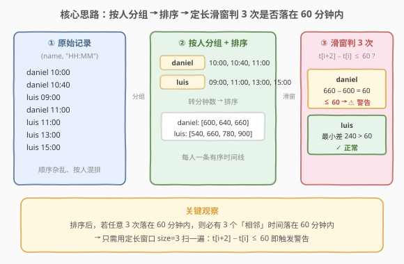
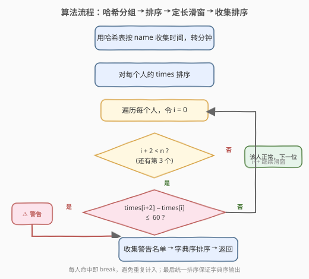
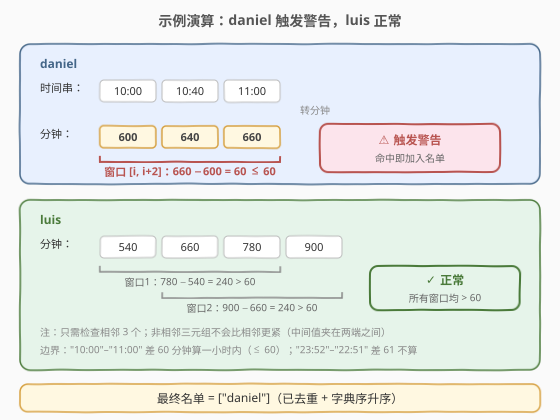

# 警告一小时内使用相同员工卡大于等于三次的人

- **题目名称**：警告一小时内使用相同员工卡大于等于三次的人
- **链接**：[1604. 警告一小时内使用相同员工卡大于等于三次的人](https://leetcode.cn/problems/alert-using-same-key-card-three-or-more-times-in-a-one-hour-period/)
- **难度**：中等
- **标签**：数组、哈希表、排序、滑动窗口

## 1. 题目概述

力扣员工用员工卡开门，安保系统记录**名字**和**使用时间**。若一个员工在**一小时**内使用员工卡**大于等于三次**，系统自动发布**警告**。

给定字符串数组 `keyName` 和 `keyTime`，其中 `[keyName[i], keyTime[i]]` 表示某员工某一天的一次刷卡记录，时间格式为 24 小时制 `"HH:MM"`。返回**去重后**收到警告的员工名字，按**字典序升序**排序。

> ⚠️ **一小时范围的边界**：`"10:00"` - `"11:00"` 视为一小时范围内（差恰好 60 分钟算入），而 `"22:51"` - `"23:52"` 不算（差 61 分钟）。即「第 3 次与第 1 次的时间差 $\le 60$ 分钟」算命中。

**示例 1**：

```text
输入：keyName = ["daniel","daniel","daniel","luis","luis","luis","luis"],
     keyTime = ["10:00","10:40","11:00","09:00","11:00","13:00","15:00"]
输出：["daniel"]
解释："daniel" 在一小时内使用了 3 次员工卡（"10:00"，"10:40"，"11:00"）。
      daniel 三次时间差 = 11:00 − 10:00 = 60 分钟 ≤ 60，触发警告。
```

**示例 2**：

```text
输入：keyName = ["alice","alice","alice","bob","bob","bob","bob"],
     keyTime = ["12:01","12:00","18:00","21:00","21:20","21:30","23:00"]
输出：["bob"]
解释："bob" 在一小时内使用了 3 次员工卡（"21:00"，"21:20"，"21:30"）。
      21:30 − 21:00 = 30 分钟 ≤ 60，触发警告。alice 的三次跨度 6 小时，正常。
```

**约束条件**：

- $1 \le \text{keyName.length} = \text{keyTime.length} \le 10^5$
- `keyTime` 格式为 `"HH:MM"`
- `[keyName[i], keyTime[i]]` 形成的二元对**互不相同**
- $1 \le \text{keyName[i].length} \le 10$，只含小写英文字母

---

## 2. 解题思路

### 2.1 暴力思路：枚举每个人的所有三元组

对每个员工，枚举其所有刷卡记录中选 3 条的组合 $C(m, 3)$，逐一判断首尾时间差是否 $\le 60$ 分钟。最坏一个人有 $m = 10^5$ 条记录，组合数约 $m^3$ 量级——完全不可行。

> 💡 转换视角：刷卡记录本质是一条**时间线**。把每个人的时间**排序**后，「能否在一小时内凑出 3 次」就变成了一个**定长滑动窗口**问题。

### 2.2 核心观察：排序 + 定长滑窗



分三步：

1. **按人分组**：用哈希表 `name -> list[时间]` 收集每个人的所有刷卡时间，并把 `"HH:MM"` 转成**当天的分钟数** `H * 60 + M`，便于做差。
2. **排序**：对每个人的时间列表升序排序，得到一条有序时间线。
3. **定长滑窗判 3 次**：在有序时间线上，用大小为 3 的窗口滑动，检查 `times[i+2] - times[i] <= 60`。一旦命中，该员工即被警告，**立即 break**（同一人只需计入一次）。

> 💡 **关键观察——只需检查相邻 3 个**：若存在**任意** 3 次刷卡落在 60 分钟内，则**必然存在 3 个相邻**（在有序序列中下标为 `i, i+1, i+2`）的刷卡也落在 60 分钟内。
>
> **证明**：设排序后 $t_a \le t_b \le t_c$（$a < b < c$）满足 $t_c - t_a \le 60$。取 $c$ 往前数两个相邻下标 $c-2, c-1, c$，因 $a \le c-2$，有 $t_{c-2} \le t_a$，故 $t_c - t_{c-2} \le t_c - t_a \le 60$。所以**相邻三元组**也命中。于是只需扫一遍相邻三元组即可，无需枚举所有组合。

### 2.3 算法流程图



### 2.4 示例演算

以示例 1 为例，daniel 与 luis 的时间线演算如下：



| 员工 | 排序后分钟数 | 窗口检查 | 结论 |
|------|-------------|----------|------|
| daniel | [600, 640, 660] | 窗口 [600, 640, 660]：$660 - 600 = 60 \le 60$ ✅ | ⚠ 警告 |
| luis | [540, 660, 780, 900] | 窗口1 $780-540=240$；窗口2 $900-660=240$，均 $> 60$ | ✓ 正常 |

> 💡 daniel 的时间差恰好为 60 分钟（`10:00` 到 `11:00`），按题意 $\le 60$ 算入一小时范围，故触发警告。这与 `"22:51"`–`"23:52"` 差 61 分钟**不算**形成对照——边界判定用 `<= 60` 而非 `< 60`。

最终名单收集后按字典序排序（本题只有 daniel），返回 `["daniel"]`。

---

## 3. 参考代码

### C++

```cpp
class Solution {
  public:
    vector<string> alertNames(vector<string>& keyName, vector<string>& keyTime) {
        unordered_map<string, vector<int>> mp;
        int n = keyName.size();
        for (int i = 0; i < n; ++i) {
            int h = stoi(keyTime[i].substr(0, 2));
            int m = stoi(keyTime[i].substr(3, 2));
            mp[keyName[i]].push_back(h * 60 + m);
        }

        vector<string> ans;
        for (auto& [name, times] : mp) {
            sort(times.begin(), times.end());
            for (int i = 0; i + 2 < (int)times.size(); ++i) {
                if (times[i + 2] - times[i] <= 60) {
                    ans.push_back(name);
                    break;                  // 同一人命中一次即可
                }
            }
        }

        sort(ans.begin(), ans.end());       // 字典序升序
        return ans;
    }
};
```

### Python

```python
class Solution:
    def alertNames(self, keyName: List[str], keyTime: List[str]) -> List[str]:
        from collections import defaultdict
        mp = defaultdict(list)
        for name, t in zip(keyName, keyTime):
            h, m = t.split(":")
            mp[name].append(int(h) * 60 + int(m))

        ans = []
        for name, times in mp.items():
            times.sort()
            for i in range(len(times) - 2):
                if times[i + 2] - times[i] <= 60:
                    ans.append(name)
                    break
        ans.sort()
        return ans
```

> 💡 **实现细节**：
> - 时间转分钟用 `H * 60 + M`，避免字符串逐位比较的坑（`"9:00"` 与 `"10:00"` 字典序会出错，但本题格式固定两位 `HH:MM`，转分钟最稳妥）。
> - `break` 保证每人只被计入一次，天然**去重**。
> - 最后统一 `sort` 满足字典序要求，无需在分组阶段维护顺序。

---

## 4. 复杂度分析

| 维度 | 复杂度 | 说明 |
|------|--------|------|
| 时间复杂度 | $O(n \log n)$ | 设总记录数为 $n$。分组转分钟 $O(n)$；每个人的时间排序之和不超过 $O(n \log n)$（最坏所有记录属于同一人）；滑窗扫描每人 $O(m)$，总和 $O(n)$；结果排序 $O(k \log k)$，$k \le n$ |
| 空间复杂度 | $O(n)$ | 哈希表存储所有人的时间列表，共 $n$ 条记录 |

> ⚠️ 滑窗扫描总和是 $O(n)$ 而非 $O(n^2)$：虽然外层遍历每个人、内层扫该人的 $m$ 条记录，但**所有人的 $m$ 加起来等于 $n$**，所以总扫描代价线性。

---

## 5. 扩展：边界与变种讨论

### 5.1 为什么不是滑动窗口求「最长」？

本题只需判定「是否存在」3 次落在 60 分钟内，是**存在性判定**，故命中即 `break`。若改成「求一小时内刷卡最多能达多少次」，则需用**可变滑窗**：维护窗口 `[l, r]` 使 `times[r] - times[l] <= 60`，记录窗口最大长度。本题是定长窗口的存在性版，更简单。

### 5.2 跨天怎么办？

题目保证每条记录是「某一天」且格式为 `HH:MM`，所有人都在同一天内比较，不存在跨天。若数据带日期（如 `"2024-01-01 23:58"` 与 `"2024-01-02 00:05"`），需把时间统一转成**绝对时间戳**再做差，排序逻辑不变。

### 5.3 时间格式不固定两位

若 `HH` 可能是单位数（如 `"9:00"`），`stoi(keyTime[i].substr(0, 2))` 会因分隔符位置漂移出错。更鲁棒的写法是按 `':'` 切分：

```cpp
int p = keyTime[i].find(':');
int h = stoi(keyTime[i].substr(0, p));
int m = stoi(keyTime[i].substr(p + 1));
```

本题约定 `HH:MM` 两位，直接 `substr(0,2)` / `substr(3,2)` 即可。

---

## 6. 面试要点

1. **为什么排序后只需检查相邻 3 个？**

   - 排序后，若任意 3 次落在 60 分钟内，取这 3 次中最大的那个下标 $c$，往前数两个相邻下标 $c-2, c-1$，因 $t_{c-2} \le t_a$（$a$ 是那 3 次里最小的下标），有 $t_c - t_{c-2} \le t_c - t_a \le 60$。所以相邻三元组必然也命中，扫一遍相邻三元组即可覆盖所有情况。

2. **一小时边界用 `<= 60` 还是 `< 60`？**

   - 题目明确 `"10:00"`–`"11:00"` 算一小时范围内（差恰 60 分钟），`"22:51"`–`"23:52"` 不算（差 61 分钟）。故用 `times[i+2] - times[i] <= 60`。

3. **为什么要去重？怎么实现的？**

   - 同一员工可能有多组三元组都满足条件，但名单里只需出现一次。实现上每人命中后立即 `break`，自然只加入一次；最后统一排序即得去重且字典序的结果。

4. **时间为什么转成分钟数而不是直接字符串比较？**

   - 字符串字典序只在格式严格对齐时才等价于数值序。虽然本题 `HH:MM` 两位对齐时字典序恰好等于时间序，但转分钟做差是**最不易出错**的写法——直接得到数值差，便于和 60 比较，也便于未来扩展带日期的场景。

5. **复杂度瓶颈在哪？**

   - 排序。最坏所有 $n$ 条记录属于同一人，排序代价 $O(n \log n)$；滑窗扫描总和线性。整体 $O(n \log n)$，对 $n = 10^5$ 完全够用。

---

## 7. 同类练习题

- [219. 存在重复元素 II](https://leetcode.cn/problems/contains-duplicate-ii/)：哈希表判「索引差 $\le k$」内是否有重复，与本题「时间差 $\le 60$」结构同构（一个判空间索引差，一个判时间差）
- [220. 存在重复元素 III](https://leetcode.cn/problems/contains-duplicate-iii/)：桶分桶 + 滑动窗口近似查重，219 的值域升级版，承接本题的滑窗判定思想
- [56. 合并区间](https://leetcode.cn/problems/merge-intervals/)：排序后线性扫描处理区间，与本题「先排序再线性扫窗口」同属排序后贪心范式
- [438. 找到字符串中所有字母异位词](https://leetcode.cn/problems/find-all-anagrams-in-a-string/)：定长滑动窗口模板，定长窗口 + 条件判定的经典练习
