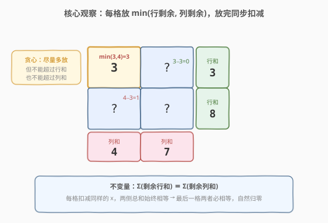
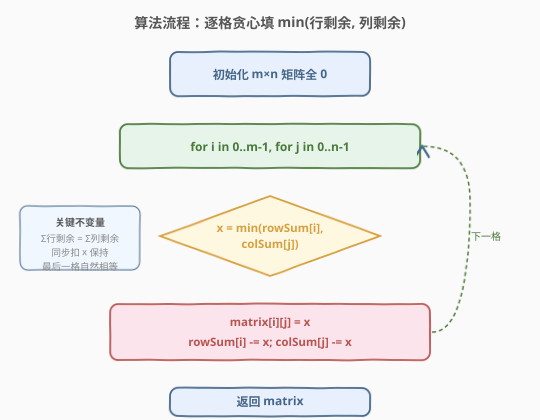

# 给定行和列的和求可行矩阵

- **题目名称**：给定行和列的和求可行矩阵
- **链接**：[1605. 给定行和列的和求可行矩阵](https://leetcode.cn/problems/find-valid-matrix-given-row-and-column-sums/)
- **难度**：中等
- **标签**：贪心、数组、矩阵

## 1. 题目概述

给定两个非负整数数组 `rowSum` 和 `colSum`，其中 `rowSum[i]` 是一个 $m \times n$ 矩阵第 $i$ 行的元素之和，`colSum[j]` 是第 $j$ 列的元素之和。换言之，你不知道矩阵里的具体数字，但知道每一行、每一列的和。

要求返回任意一个**元素均为非负整数**的 $m \times n$ 矩阵，使其满足给定的行和与列和。题目保证至少存在一个可行矩阵。

**示例 1**：

```text
输入：rowSum = [3,8], colSum = [4,7]
输出：[[3,0],
      [1,7]]
解释：第 0 行 3+0=3，第 1 行 1+7=8；第 0 列 3+1=4，第 1 列 0+7=7。均满足。
     [[0,3],
      [4,5]] 也是一组合法解。
```

**示例 2**：

```text
输入：rowSum = [5,7,10], colSum = [8,6,8]
输出：[[0,5,0],
      [6,1,0],
      [2,0,8]]
解释：行和 5/7/10，列和 8/6/8，元素均非负，是一组合法解。
```

**约束条件**：

- $m = \text{rowSum.length}$，$n = \text{colSum.length}$
- $1 \le m, n \le 500$
- $0 \le \text{rowSum}[i], \text{colSum}[j] \le 10^8$
- $\sum \text{rowSum} = \sum \text{colSum}$（题目保证）

> 💡 题目本质是一个**可行解构造**问题：不需要找最优，只需构造一个满足行列和约束、且元素非负的矩阵。关键在于「每格放多少」的贪心策略——只要保证每次填入后剩余的行和、列和都非负，且最终能全部归零即可。

---

## 2. 解题思路

### 2.1 暴力思路：搜索/回溯

最朴素的思路是对每个格子枚举可能的取值 $0, 1, 2, \dots$，用回溯尝试填充，配合「当前行剩余和」「当前列剩余和」剪枝。但这条路完全不可行：

- 单格取值上限可达 $10^8$，分支因子极大；
- 矩阵最多 $500 \times 500 = 2.5 \times 10^5$ 格，搜索空间是天文数字。

事实上题目**保证存在解**，我们只需找到一种**确定性构造方式**，无需搜索。

### 2.2 核心观察：逐格贪心，放 $\min(\text{行剩余}, \text{列剩余})$



关键洞察：按任意固定顺序（如行优先）遍历每个格子 $(i, j)$，在当前位置**尽可能多放**，但不能超过该行剩余和与该列剩余和的较小者：

$$\text{matrix}[i][j] = x = \min(\text{rowSum}[i],\ \text{colSum}[j])$$

放完后，把 $x$ 从 `rowSum[i]` 和 `colSum[j]` 中**同步扣减**。这等价于「这一格已经定下来了，剩下的行列和需要由后续格子分担」。

> 💡 **为什么取 $\min$ 而不是更大的值？**
> - 不能超过 `rowSum[i]`：否则该行之和会超标；
> - 不能超过 `colSum[j]`：否则该列之和会超标；
> - 取 $\min$ 是**合法范围内能放的最大值**——尽量在当前格「消耗掉」一个约束（行或列），让后续更轻松。

> ⚠️ **为什么这样一定能构造出解？** 核心是一个**不变量**：每次扣减时，从行侧和列侧减去的是**同一个 $x$**，因此 $\sum(\text{剩余行和})$ 与 $\sum(\text{剩余列和})$ 始终保持相等。初始时题目保证 $\sum \text{rowSum} = \sum \text{colSum}$，所以这个等式从头到尾成立。走到最后一格时，行剩余和列剩余必相等，直接填入即可让两者同时归零。

### 2.3 算法流程图



流程非常简洁：

1. 初始化 $m \times n$ 矩阵全 0；
2. 行优先遍历每个格子 $(i, j)$；
3. 计算 $x = \min(\text{rowSum}[i], \text{colSum}[j])$；
4. 令 $\text{matrix}[i][j] = x$，并执行 $\text{rowSum}[i] \mathrel{-}= x$、$\text{colSum}[j] \mathrel{-}= x$；
5. 全部填完返回 `matrix`。

整个过程**无回溯、无分支决策**，一趟扫描即可完成。

### 2.4 示例演算

![示例演算：rowSum=[3,8], colSum=[4,7]](../images/1605_example_walkthrough.svg)

以 `rowSum = [3, 8]`、`colSum = [4, 7]` 为例，逐格填充：

| 步骤 | 格子 | $\min(\text{行}, \text{列})$ | 填入 | 行剩余 | 列剩余 |
|------|------|------------------------------|------|--------|--------|
| ① | (0,0) | $\min(3, 4) = 3$ | 3 | [**0**, 8] | [**1**, 7] |
| ② | (0,1) | $\min(0, 7) = 0$ | 0 | [0, 8] | [1, 7] |
| ③ | (1,0) | $\min(8, 1) = 1$ | 1 | [0, **7**] | [**0**, 7] |
| ④ | (1,1) | $\min(7, 7) = 7$ | 7 | [0, **0**] | [0, **0**] |

> 💡 **观察要点**：
> - 步骤 ① 取 $\min(3,4)=3$，行剩余先归零（3 那侧被「消耗」），列剩余 4→1；
> - 步骤 ② 行剩余已是 0，$\min=0$，该格自然填 0；
> - 步骤 ③ 取 $\min(8,1)=1$，列剩余归零，行剩余 8→7；
> - 步骤 ④ 最后一格 $\min(7,7)=7$，**行剩余与列剩余相等**，直接填入后双双归零——这正是不变量保证的结果。

最终矩阵 $\begin{bmatrix}3 & 0 \\ 1 & 7\end{bmatrix}$，行和 $3/8$、列和 $4/7$，全部满足。

---

## 3. 参考代码

### C++

```cpp
class Solution {
public:
    vector<vector<int>> restoreMatrix(vector<int>& rowSum, vector<int>& colSum) {
        int m = rowSum.size(), n = colSum.size();
        vector<vector<int>> matrix(m, vector<int>(n, 0));
        for (int i = 0; i < m; ++i) {
            for (int j = 0; j < n; ++j) {
                int x = min(rowSum[i], colSum[j]);
                matrix[i][j] = x;
                rowSum[i] -= x;
                colSum[j] -= x;
            }
        }
        return matrix;
    }
};
```

### Python

```python
class Solution:
    def restoreMatrix(self, rowSum: List[int], colSum: List[int]) -> List[List[int]]:
        m, n = len(rowSum), len(colSum)
        matrix = [[0] * n for _ in range(m)]
        for i in range(m):
            for j in range(n):
                x = min(rowSum[i], colSum[j])
                matrix[i][j] = x
                rowSum[i] -= x
                colSum[j] -= x
        return matrix
```

> 💡 **写法细节**：
> - 直接在传入的 `rowSum`/`colSum` 上原地扣减，无需额外开「剩余和」数组——题目不要求保留原始值，原址修改最省空间。
> - 矩阵初始化为全 0，即便某些格子最终填 0（行或列剩余已为 0 时），也无需特殊处理，$\min$ 自然给出 0。
> - 遍历顺序不影响正确性（行优先、列优先均可），但行优先的缓存局部性更好。

---

## 4. 复杂度分析

| 维度 | 复杂度 | 说明 |
|------|--------|------|
| 时间复杂度 | $O(m \times n)$ | 每格一次 $\min$ + 两次减法 + 一次赋值，共 $mn$ 格 |
| 空间复杂度 | $O(m \times n)$ | 返回的矩阵本身；除输出外仅 $O(1)$ 额外空间（原地扣减） |

> 💡 本题时间已是理论下界——必须填满 $mn$ 个格子，每格至少 $O(1)$ 工作。额外空间 $O(1)$（不计输出矩阵）已是最优。

---

## 5. 扩展：行列和不等时如何判定无解

题目保证了 $\sum \text{rowSum} = \sum \text{colSum}$，所以一定有解。若去掉这个保证，只需在开始前**校验总和是否相等**：不等则直接返回空矩阵表示无解。这把「构造题」前置一个「可行性判定」。

进一步，若还要求矩阵元素为**非负整数**，则贪心过程本身已经保证——因为 $x = \min(\text{rowSum}[i], \text{colSum}[j]) \ge 0$（初始值非负，扣减后也不会变负：扣到 0 时 $\min$ 必为 0）。所以只要总和相等且初始值非负，贪心必然构造出合法解。

---

## 6. 面试要点

1. **为什么贪心取 $\min$ 一定能构造出解？**

   - 核心是不变量：每次同步扣减同一个 $x$，使 $\sum(\text{剩余行和}) = \sum(\text{剩余列和})$ 始终成立。初始由题目保证，过程中每次扣减 $x$ 使两侧总和各减 $x$，等式保持。因此到最后一格时，行剩余必等于列剩余，填入后全部归零。此外 $x = \min \ge 0$ 保证元素非负。

2. **如果遍历顺序不同，得到的解会一样吗？**

   - 不一定。行优先和列优先、甚至任意格序，都能得到合法解，但具体数值分布不同。本题只要返回任意一组合法解，故顺序不影响正确性。行优先因缓存友好而更快。

3. **能否用其他方法解？比如网络流？**

   - 可以建模为**二分图流**：行节点连源点（容量 = 行和），列节点连汇点（容量 = 列和），行到列的边容量无穷。任意一个可行流就是一组合法矩阵。但贪心 $O(mn)$ 远比最大流算法简单高效，面试中应优先给出贪心解。

4. **如果要求矩阵元素有上界（比如每格 $\le K$）怎么办？**

   - 贪心不再直接适用：取 $\min$ 可能导致某格需要放超过 $K$ 的值。这时需要更细致的分配，可建模为带容量约束的流问题。面试中点出「加约束后升级为流模型」即可。

5. **原地修改 `rowSum`/`colSum` 会有问题吗？**

   - 题目不要求保留入参，原地扣减省去额外 $O(m+n)$ 空间。若调用方需要保留原值，应在函数入口拷贝一份。面试时可主动说明这一权衡。

---

## 7. 同类练习题

- [1253. 重构 2 行二进制矩阵](https://leetcode.cn/problems/reconstruct-a-2-row-binary-matrix/)：同样是给定行和/列和重构矩阵，但限制元素为 0/1 且只有两行，贪心策略更特殊
- [985. 查询后的偶数和](https://leetcode.cn/problems/sum-of-even-numbers-after-queries/)：维护「和」并按操作增量更新，体会「总量扣减」的增量思维
- [733. 图像渲染](https://leetcode.cn/problems/flood-fill/)：矩阵填充类问题，DFS/BFS 遍历改值，对照本题的贪心填充
- [54. 螺旋矩阵](https://leetcode.cn/problems/spiral-matrix/)：矩阵按特定顺序遍历，对照本题「行优先遍历填值」的顺序选择
- [73. 矩阵置零](https://leetcode.cn/problems/set-matrix-zeroes/)：矩阵原地修改 + 用行列标记记录状态，对照本题用行/列剩余和驱动填值
