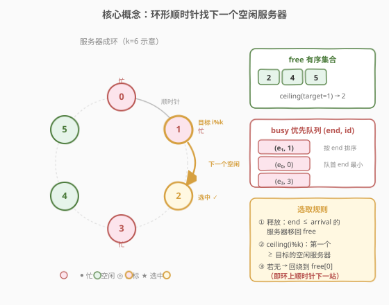
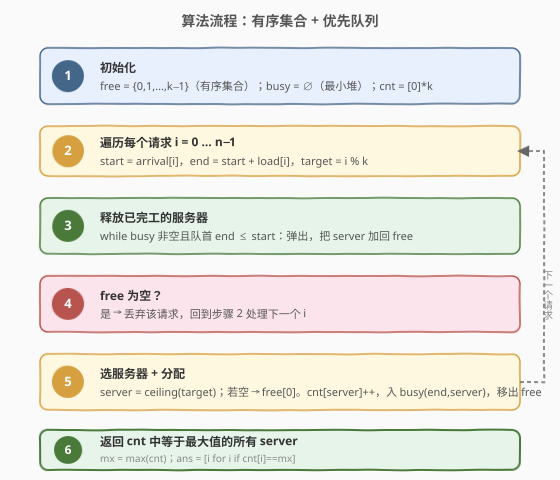
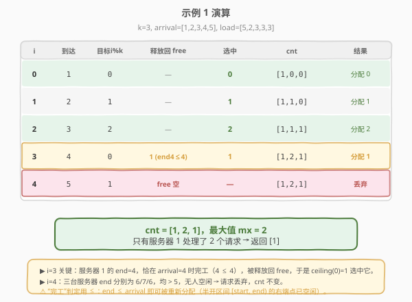

# 找到处理最多请求的服务器

- **题目名称**：找到处理最多请求的服务器
- **链接**：[1606. 找到处理最多请求的服务器](https://leetcode.cn/problems/find-servers-that-handled-most-number-of-requests/)
- **难度**：困难
- **标签**：数组、有序集合、模拟、堆（优先队列）

## 1. 题目概述

有 `k` 个服务器，编号 `0` 到 `k-1`，每个服务器计算能力无穷但**同一时刻只能处理一个请求**。第 `i` 个请求在 `arrival[i]` 时刻到达，需要 `load[i]` 的时间来完成。请求分配规则：

1. 第 `i` 个请求到达时，若所有服务器都在忙，则**丢弃**该请求。
2. 若第 `i % k` 号服务器空闲，则由它处理。
3. 否则，从 `i % k` 开始**沿环顺时针**找下一个空闲的服务器（必要时从 0 号继续找）。
4. 服务器完成请求的时刻为「开始时刻 + `load[i]`」，此后重新空闲。

`arrival` **严格递增**。要求返回**最繁忙服务器**的编号列表（处理请求数最多的所有服务器，顺序任意）。

**示例 1**：

```text
输入：k = 3, arrival = [1,2,3,4,5], load = [5,2,3,3,3]
输出：[1]
解释：前 3 个请求依次由 0/1/2 处理；请求 3 到达时 0 号在忙，顺时针找到空闲的 1 号；
      请求 4 到达时所有服务器都在忙，被丢弃。cnt = [1,2,1]，服务器 1 最忙。
```

**示例 2**：

```text
输入：k = 3, arrival = [1,2,3,4], load = [1,2,1,2]
输出：[0]
解释：请求 3 到达时 0 号恰好空闲，由 0 号处理。cnt = [2,1,1]，服务器 0 最忙。
```

**示例 3**：

```text
输入：k = 3, arrival = [1,2,3], load = [10,12,11]
输出：[0,1,2]
解释：每台服务器各处理 1 个，全部并列最忙。
```

**约束条件**：

- `1 <= k <= 10^5`
- `1 <= arrival.length, load.length <= 10^5`
- `arrival.length == load.length`
- `1 <= arrival[i], load[i] <= 10^9`
- `arrival` 严格递增

---

## 2. 解题思路

### 2.1 暴力思路：逐请求线性扫描

对每个请求 `i`，从 `i % k` 起逐个检查 `k` 台服务器是否空闲（`busy_until[j] <= arrival[i]`），找到第一个空闲者。最坏每个请求扫 `k` 台，总复杂度 $O(n \cdot k)$。当 $n, k \le 10^5$ 时高达 $10^{10}$，必然超时。

> 💡 瓶颈在于「找下一个空闲服务器」这一步是线性扫描。若把**空闲服务器集合维护成有序结构**，就能用二分在 $O(\log k)$ 内定位「环上顺时针下一个空闲者」。

### 2.2 核心观察：有序集合 + 优先队列



用两个结构分别维护两类服务器：

- **`free`（有序集合）**：当前空闲的服务器编号，保持升序。支持 $O(\log k)$ 的插入/删除/二分。
- **`busy`（最小堆）**：正在工作的 `(结束时刻 end, 服务器编号 id)`，按 `end` 升序，堆顶是最先完工者。
- **`cnt`（数组）**：每台服务器累计处理的请求数。

对第 `i` 个请求（到达 `start = arrival[i]`，工期 `t = load[i]`，目标 `target = i % k`）：

1. **释放**：只要堆顶 `end <= start`，说明该服务器已完工，弹出并加回 `free`。
2. **判空**：若 `free` 为空，丢弃请求。
3. **选服务器**：在 `free` 中找 `ceiling(target)`——即第一个 `>= target` 的空闲编号；若不存在（`target` 之后全忙），则**回绕**到 `free` 的首元素（编号最小者），等价于环上顺时针的下一站。
4. **分配**：`cnt[server]++`，把 `(start + t, server)` 入堆，从 `free` 移除 `server`。

> 💡 **为什么 `ceiling` 或回绕到首元素 = 顺时针下一个空闲？** 服务器编号 `0…k-1` 排成环。从 `target` 顺时针走，先经过 `target, target+1, …, k-1`，再绕回 `0, 1, …, target-1`。`ceiling(target)` 给出 `[target, k-1]` 段的第一个空闲者；若这段全忙，环上下一个空闲必在 `[0, target-1]` 段，即 `free` 的首元素。两步合起来正是「顺时针下一个空闲服务器」。

> ⚠️ **边界 `<=`**：服务器在 `end` 时刻即重新空闲（忙区间为半开 $[\text{start}, \text{end})$）。因此 `end <= start` 就可被新请求复用——示例 1 中请求 3 到达于 `arrival=4`，服务器 1 的 `end=2+2=4` 满足 `4 <= 4` 被释放，正是本题的关键拐点。

### 2.3 算法流程图



### 2.4 示例演算

以示例 1 `k=3, arrival=[1,2,3,4,5], load=[5,2,3,3,3]` 为例：



| 步骤 | 到达 | 目标 i%k | 释放回 free | 选中 server | cnt | 结果 |
|------|------|----------|-------------|-------------|-----|------|
| i=0 | 1 | 0 | — | ceiling(0)=0 | [1,0,0] | 分配 0，busy=(6,0) |
| i=1 | 2 | 1 | — | ceiling(1)=1 | [1,1,0] | 分配 1，busy=(4,1) |
| i=2 | 3 | 2 | — | ceiling(2)=2 | [1,1,1] | 分配 2，busy=(6,2) |
| i=3 | 4 | 0 | 1（end4≤4） | ceiling(0)=1 | [1,2,1] | 分配 1，busy=(7,1) |
| i=4 | 5 | 1 | 无（全 >5） | free 空 | [1,2,1] | 丢弃 |

最终 `cnt = [1,2,1]`，`mx = 2`，仅服务器 1 达到最大 → 返回 `[1]`。

> 💡 **i=3 是全题关键**：服务器 1 在 `arrival=4` 恰好完工（`end=4 <= 4`），被释放回 `free`，于是 `ceiling(0)` 命中 1 号而非跳到更后者。若误用严格 `<`，1 号不会被释放，`free` 为空，请求 3 被丢弃，`cnt` 变成 `[1,1,1]` 得出错误答案 `[0,1,2]`——这正是本题最常见的踩坑点。

---

## 3. 参考代码

### 方法一：有序集合 + 优先队列（推荐，$O(n \log k)$）

### C++

```cpp
class Solution {
public:
    vector<int> busiestServers(int k, vector<int>& arrival, vector<int>& load) {
        set<int> free;                       // 空闲服务器（升序）
        for (int i = 0; i < k; ++i) free.insert(i);
        // busy: (end, server)，按 end 升序的最小堆
        priority_queue<pair<int,int>, vector<pair<int,int>>, greater<>> busy;
        vector<int> cnt(k, 0);

        for (int i = 0; i < (int)arrival.size(); ++i) {
            int start = arrival[i], end = start + load[i];
            // ① 释放已完工的服务器
            while (!busy.empty() && busy.top().first <= start) {
                free.insert(busy.top().second);
                busy.pop();
            }
            if (free.empty()) continue;      // ② 全忙，丢弃
            // ③ ceiling(target)；不存在则回绕到首元素
            auto it = free.lower_bound(i % k);
            if (it == free.end()) it = free.begin();
            int server = *it;
            // ④ 分配
            ++cnt[server];
            busy.emplace(end, server);
            free.erase(it);
        }

        int mx = *max_element(cnt.begin(), cnt.end());
        vector<int> ans;
        for (int i = 0; i < k; ++i)
            if (cnt[i] == mx) ans.push_back(i);
        return ans;
    }
};
```

### Python

```python
from sortedcontainers import SortedList
import heapq

class Solution:
    def busiestServers(self, k: int, arrival: List[int], load: List[int]) -> List[int]:
        free = SortedList(range(k))   # 空闲服务器（升序）
        busy = []                     # (end, server) 最小堆
        cnt = [0] * k

        for i, start in enumerate(arrival):
            end = start + load[i]
            # ① 释放已完工的服务器
            while busy and busy[0][0] <= start:
                free.add(busy[0][1])
                heapq.heappop(busy)
            if not free:              # ② 全忙，丢弃
                continue
            # ③ bisect_left 给出第一个 >= target 的位置
            j = free.bisect_left(i % k)
            if j == len(free):        # target 之后全忙 → 回绕到首元素
                j = 0
            server = free[j]
            # ④ 分配
            cnt[server] += 1
            heapq.heappush(busy, (end, server))
            free.remove(server)

        mx = max(cnt)
        return [i for i, v in enumerate(cnt) if v == mx]
```

> 💡 LeetCode Python 环境自带 `sortedcontainers`。若评测机不支持，可用下节「有序集合的等价替代」中的双堆/线段树方案，逻辑同构。

---

## 4. 复杂度分析

| 维度 | 复杂度 | 说明 |
|------|--------|------|
| 时间复杂度 | $O(n \log k)$ | 共 $n$ 个请求，每个做常数次堆操作与有序集合操作，均为 $O(\log k)$；释放总量不超过 $n$ 次，摊还 $O(\log k)$ |
| 空间复杂度 | $O(k)$ | `free` + `busy` 合计至多存放 $k$ 个服务器；`cnt` 数组 $O(k)$ |

> ⚠️ 关键于 $n, k \le 10^5$：$n \log k \approx 10^5 \times 17 \approx 1.7 \times 10^6$，远在时限内。暴力 $O(nk) = 10^{10}$ 必超时。

---

## 5. 扩展：有序集合的等价替代

### 5.1 为什么需要有序集合

本题的「环上顺时针找下一个空闲」本质是一次**有序序列上的二分**（`ceiling`）。`set`/`SortedList`/`TreeSet` 提供了 $O(\log k)$ 的 `lower_bound`/`ceiling`/`bisect_left`，是最自然的工具。若环境没有平衡树，可按下法替代。

### 5.2 C++ 不用 `set`：并查集合并相邻空闲段

把「找下一个空闲」视为「跳过连续的忙段」。用并查集 `nxt[x]` 指向 `x` 之后首个可能空闲的位置（占用时 `nxt[x] = find(x+1)`，并查到 `k` 表示无解则回绕到 `find(0)`）。每个服务器被占用/释放时更新并查集，均摊 $O(\alpha(k))$。实现略复杂但避免平衡树依赖，适合受限环境。

### 5.3 用线段树维护「区间是否有空闲」

建一棵长度 $k$ 的线段树，叶节点 `1` 表示空闲。查询「`[target, k-1]` 是否有空闲」用区间最大值；有则在右段二分定位最左空闲点，否则在 `[0, target-1]` 找全局最左空闲点。单次 $O(\log k)$。与有序集合同阶，常数略大。

### 5.4 各语言 API 速查

| 语言 | 有序集合 | `ceiling` 操作 | 回绕到最小 |
|------|----------|----------------|------------|
| C++ | `std::set<int>` | `lower_bound(x)` | `begin()` |
| Java | `TreeSet<Integer>` | `ceiling(x)` | `first()` |
| Python | `SortedList` | `bisect_left(x)` | `[0]` |
| Go | `redblacktree` | `Ceiling(x)` | `Left()` |

---

## 6. 面试要点

1. **分配规则的核心是什么？**

   - 先看 `i % k` 号是否空闲，是则直接用；否则从 `i % k` 起**沿环顺时针**找下一个空闲者；全忙则丢弃。注意「顺时针下一个」不是「距离最近」——只往一个方向走，不比较两侧距离。

2. **为什么用 `ceiling` + 回绕就能模拟顺时针查找？**

   - 环上从 `target` 顺时针的顺序是 `target, target+1, …, k-1, 0, 1, …, target-1`。`ceiling(target)` 取 `[target, k-1]` 段首个空闲；该段全忙时，下一个空闲必落在 `[0, target-1]`，即 `free` 的首元素。两段拼接正是顺时针序列。

3. **释放时为什么用 `<=` 而非 `<`？**

   - 服务器在 `end = start + load` 时刻完工即重获空闲（忙区间半开 $[\text{start}, \text{end})$）。新请求若恰在 `end` 时刻到达，该服务器可被立即复用。示例 1 的请求 3 依赖 `4 <= 4` 才能命中 1 号——这是最常见的边界踩坑点。

4. **`arrival` 严格递增有什么用？**

   - 保证按请求下标顺序处理时，时间单调推进，堆中 `end` 的释放判断只需不断弹堆顶即可（无需回看历史），让「释放」步骤成为干净的 $O(\text{释放次数})$ 摊还操作。

5. **复杂度为什么是 $O(n \log k)$ 而不是 $O(n \log n)$？**

   - 有序集合与堆的规模上界是服务器数 $k$（同一时刻至多 $k$ 个服务器在 `free+busy` 中流转），与请求数 $n$ 无关。即便 $n \gg k$，单次操作仍是 $O(\log k)$。

---

## 7. 同类练习题

- [1882. 使用服务器处理任务](https://leetcode.cn/problems/process-tasks-using-servers/)：同为「空闲集合 + 忙堆」模拟调度，区别在选取规则按 `(权重, 编号)` 而非环形顺时针，是本题的最佳姊妹题
- [1834. 单线程 CPU](https://leetcode.cn/problems/single-threaded-cpu/)：堆模拟任务调度，按时间推进 + 优先队列选下一任务，骨架与本题的「释放 + 选优」同构
- [1353. 最多可以参加的会议数目](https://leetcode.cn/problems/maximum-number-of-events-that-can-be-attended/)：按时间排序 + 最小堆贪心选可用会议，模拟调度的另一经典形态
- [1801. 积压订单中的订单总数](https://leetcode.cn/problems/number-of-orders-in-the-backlog/)：双堆模拟买卖订单撮合，体现「按事件时间驱动 + 堆维护候选」的通用范式
- [1500. 设计文件分享系统](https://leetcode.cn/problems/design-a-file-sharing-system/)：可用编号集合 + 优先队列管理用户释放/复用，`ceiling` 式选取的最小编号思路与本题相通
