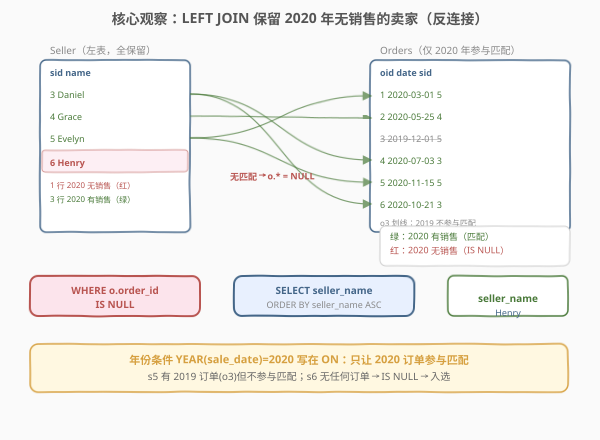
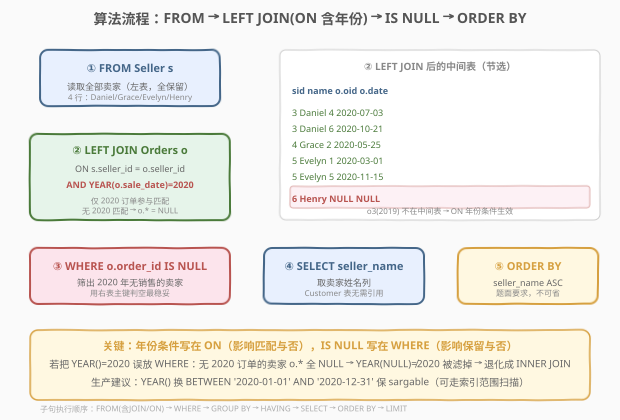
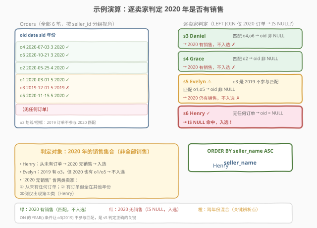

# LeetCode 没有卖出的卖家 题解

## 1. 题目概述

- **标题 / 题号**：没有卖出的卖家（#1607，medium）
- **链接**：https://leetcode.cn/problems/find-sellers-with-no-sales/
- **难度**：中等
- **标签**：数据库、SQL、`LEFT JOIN`、反连接（anti-join）、`IS NULL`、`NOT EXISTS`、`NOT IN` 的 NULL 陷阱、`YEAR()` vs `BETWEEN` 的可索引性（sargable）、`ORDER BY`

**题意**：给定 `Customer`（顾客）、`Orders`（订单）、`Seller`（卖家）三张表，编写 SQL 查询，找出**在 2020 年没有任何销售记录**的卖家的名字。结果按 `seller_name` **升序**返回。

**表结构**：

```text
Table: Customer
+--------------+---------+
| Column Name  | Type    |
+--------------+---------+
| customer_id  | int     |  ← 主键
| customer_name| varchar |
+--------------+---------+
每位顾客的姓名。

Table: Orders
+----------------+---------+
| Column Name    | Type    |
+----------------+---------+
| order_id       | int     |  ← 主键
| sale_date      | date    |
| order_quantity | int     |
| customer_id    | int     |  ← 外键 → Customer
| seller_id      | int     |  ← 外键 → Seller
+----------------+---------+
每笔订单的日期、数量、涉及的顾客与卖家。

Table: Seller
+--------------+---------+
| Column Name  | Type    |
+--------------+---------+
| seller_id    | int     |  ← 主键
| seller_name  | varchar |
+--------------+---------+
每位卖家的姓名。
```

**示例 1**：

```text
输入：
Customer 表:
+-------------+---------------+
| customer_id | customer_name |
+-------------+---------------+
| 1           | Alice         |
| 2           | Bob           |
| 3           | Charlie       |
+-------------+---------------+

Orders 表:
+----------+------------+----------------+-------------+-----------+
| order_id | sale_date  | order_quantity | customer_id | seller_id |
+----------+------------+----------------+-------------+-----------+
| 1        | 2020-03-01 | 15             | 2           | 5         |
| 2        | 2020-05-25 | 2              | 1           | 4         |
| 3        | 2019-12-01 | 12             | 3           | 5         |
| 4        | 2020-07-03 | 22             | 3           | 3         |
| 5        | 2020-11-15 | 30             | 2           | 5         |
| 6        | 2020-10-21 | 10             | 3           | 3         |
+----------+------------+----------------+-------------+-----------+

Seller 表:
+-----------+-------------+
| seller_id | seller_name |
+-----------+-------------+
| 3         | Daniel      |
| 4         | Grace       |
| 5         | Evelyn      |
| 6         | Henry       |
+-----------+-------------+

输出:
+-------------+
| seller_name |
+-------------+
| Henry       |
+-------------+
```

**解释**：

| seller_id | seller_name | 2020 年订单 | 是否入选 |
|-----------|-------------|------------|----------|
| 3 | Daniel | o4（2020-07-03）、o6（2020-10-21） | ✗ 有 2020 销售 |
| 4 | Grace | o2（2020-05-25） | ✗ 有 2020 销售 |
| 5 | Evelyn | o1（2020-03-01）、o5（2020-11-15）；o3 是 2019 | ✗ 有 2020 销售 |
| 6 | Henry | —（无任何订单） | ✓ 2020 无销售 |

> 💡 注意 Evelyn（s5）：她在 **2019** 有一笔订单（o3），但 2020 年也有两笔（o1、o5）——只要 2020 年有**至少一笔**销售就不入选。Henry 则从未有过任何订单，自然 2020 年也没有销售，是唯一入选者。这揭示了一个关键点——**判定对象是「2020 年的销售集合」，而非「全部销售」**：一个卖家可能在其他年份有销售、但 2020 年没有，依然入选。

**约束**：

- `customer_id` 是 `Customer` 表主键
- `order_id` 是 `Orders` 表主键
- `seller_id` 是 `Seller` 表主键
- 结果按 `seller_name` **升序**排列

> 💡 本题是 SQL **"带年份过滤的反连接"**——在 1581「进店却未进行过交易的顾客」的 `LEFT JOIN + IS NULL` 骨架上，多了一层「先按 `sale_date` 筛 2020 年」的时间维度。难点有二：① 反连接的右表不是整个 `Orders`，而是「2020 年的订单」这一**子集**；② 在 `sale_date` 上做年份判断时，`YEAR(sale_date) = 2020` 与 `sale_date BETWEEN '2020-01-01' AND '2020-12-31'` 的可索引性差异。另外 `Customer` 表是**干扰信息**，本题查询无需用到。

## 2. 解题思路

### 2.1 暴力思路：逐卖家查 2020 订单

最直觉的过程式思路：遍历每一位卖家，去 `Orders` 表里查是否存在 `seller_id` 相同且 `sale_date` 在 2020 年的订单，若不存在则把该卖家名字收入结果。伪代码：

```text
result = []
for s in Seller:
    has_2020_sale = any(
        o.seller_id == s.seller_id and YEAR(o.sale_date) == 2020
        for o in Orders
    )
    if not has_2020_sale:
        result.append(s.seller_name)
result.sort()  # 按 seller_name 升序
```

但**纯 SQL 没有显式逐行循环**——"左表每行去右表（的某子集）找匹配，找不到则保留"需换成集合式表达。这正是 `LEFT JOIN` 的语义：保留左表全部行，右表无匹配时右表列填 `NULL`。关键是把"右表"限定为「2020 年的订单」——这可以通过在 `ON` 子句附加年份条件实现。

### 2.2 核心观察：LEFT JOIN 反连接 + 年份条件放 ON



**问题拆解为三个子问题**：

1. **关联卖家与「2020 年订单」**：`Seller s LEFT JOIN Orders o ON s.seller_id = o.seller_id AND YEAR(o.sale_date) = 2020`。这里有两点要害：
   - **`LEFT JOIN`** 保留左表（`Seller`）的全部行——即使某卖家在 2020 年没有订单，该卖家行依然出现在结果中，只是右表（`o.*`）被填为 `NULL`。
   - **年份条件 `YEAR(o.sale_date) = 2020` 写在 `ON` 而非 `WHERE`**：这是本题最易错点！若写在 `WHERE`，会先把 `Orders` 筛成只剩 2020 年的行，再去做 `LEFT JOIN`——看似合理，但 `LEFT JOIN` 的"保留左表全部行"语义会被破坏：对 2020 年无订单的卖家，`o.*` 仍填 `NULL`（这部分正确），可对「有订单但都在 2019 年」的卖家，`WHERE` 会先滤掉其 2019 行，导致 `LEFT JOIN` 找不到匹配 → `o.*` 为 `NULL` → 被当成"无 2020 销售"。**结果碰巧也对**，但语义混乱且性能更差（先过滤再连接 vs 连接时同步判定）。更清晰的写法是把年份条件放 `ON`，让它只决定"匹配与否"：2020 年的订单才参与匹配，非 2020 的订单根本不参与连接。

2. **筛出无 2020 销售的卖家**：`WHERE o.order_id IS NULL`。`LEFT JOIN` 后，2020 年无订单的卖家行其 `o.order_id`（右表主键，原表非空）变为 `NULL`——`IS NULL` 即等价于"该卖家 2020 年没有销售"。用主键列 `order_id` 判空最稳妥。

3. **选名字并排序**：`SELECT seller_name ... ORDER BY seller_name ASC`。题面明确要求按名字升序，不能省略 `ORDER BY`（SQL 不保证默认顺序）。

> ⚠️ **为何用 `o.order_id IS NULL` 而非 `o.sale_date IS NULL`**：`order_id` 是 `Orders` 表的主键、保证非空，它在结果中为 `NULL` **当且仅当** `LEFT JOIN` 无匹配。而 `sale_date` 虽在此题也非空，但用主键判空是反连接的通用最佳实践——主键必非空且唯一，`NULL` 只能来自 `LEFT JOIN` 无匹配。**判反连接一律用右表主键列**。

> 💡 **`ON` vs `WHERE` 的微妙之处**：本题把年份条件 `YEAR(o.sale_date) = 2020` 放 `ON`——它**只影响右表哪些行参与匹配**，不影响左表行的保留。这样 `LEFT JOIN` 仍保留全部 `Seller`，只是对每个卖家只尝试用 2020 年的订单去匹配；匹配不上（含"只有 2019 订单"和"完全没有订单"两种情况）则 `o.*` 填 `NULL`。若把年份条件放 `WHERE`，等价于先 `INNER JOIN` 出 2020 年的卖家-订单对，再 `LEFT JOIN` 回 `Seller`——多一次连接且语义绕。详见第 5 节扩展。

### 2.3 算法流程图



**逻辑执行步骤**：

| 步骤 | 子句 | 作用 |
|------|------|------|
| ① | `FROM Seller s` | 读取全部卖家（左表，全保留） |
| ② | `LEFT JOIN Orders o ON s.seller_id = o.seller_id AND YEAR(o.sale_date) = 2020` | 只用 2020 年订单匹配；无 2020 订单则 `o.*` 填 `NULL` |
| ③ | `WHERE o.order_id IS NULL` | 筛出 2020 年无销售的卖家（反连接） |
| ④ | `SELECT seller_name` | 取卖家姓名 |
| ⑤ | `ORDER BY seller_name ASC` | 按名字升序 |

> 💡 **SQL 子句执行顺序**：`FROM`（含 `JOIN`/`ON`）→ `WHERE` → `GROUP BY` → `HAVING` → `SELECT` → `ORDER BY` → `LIMIT`。`LEFT JOIN` 在 `FROM` 阶段完成（`ON` 同时生效，生成含 `NULL` 的中间表），`WHERE` 在其上过滤 `IS NULL`，最后 `ORDER BY` 排序输出。

### 2.4 示例演算

以示例 1 的 4 位卖家、6 笔订单（其中 5 笔在 2020、1 笔在 2019）为例，观察「`LEFT JOIN`（仅 2020 订单参与）→ `IS NULL` 筛选 → 排序」的逐步过程：



**步骤 ①②：LEFT JOIN（ON 含年份条件，仅 2020 订单参与匹配）**

| seller_id | seller_name | 匹配的 2020 订单 | o.order_id | 保留? |
|-----------|-------------|-----------------|-----------|-------|
| 3 | Daniel | o4、o6（两行展开） | 4 / 6 | ✗（非 NULL，有 2020 销售） |
| 4 | Grace | o2 | 2 | ✗ |
| 5 | Evelyn | o1、o5（两行展开）；o3 是 2019 **不参与匹配** | 1 / 5 | ✗ |
| 6 | Henry | —（无任何订单） | NULL | ✓ |

> ⚠️ **s5（Evelyn）的关键**：她有 3 笔订单，但 o3 在 2019，因 `ON` 中的 `YEAR(o.sale_date) = 2020` **不参与匹配**——只有 o1、o5 两行展开。两行的 `o.order_id` 都非 `NULL`，全被 `WHERE IS NULL` 过滤掉。这正是"判定对象是 2020 年销售集合"的体现：Evelyn 在 2019 有销售，但 2020 也有，故不入选。若误把年份条件放 `WHERE` 而非 `ON`，o3 会被先滤掉再连接，碰巧结果相同，但若题目改为"统计 2020 无销售卖家的 2019 订单数"，`WHERE` 写法就会出错（见第 5 节）。

**步骤 ③：WHERE o.order_id IS NULL**

仅保留 s6（Henry）1 行。

**步骤 ④⑤：SELECT seller_name + ORDER BY**

| seller_name |
|-------------|
| Henry |

> 💡 **`ORDER BY` 不可省**：题面要求按 `seller_name` 升序。SQL 标准不保证结果顺序，依赖 `ORDER BY` 才能确定输出顺序。本题仅 1 行看似无所谓，但多行场景（如 Henry 外还有 Ivan、Anna 等）必须排序。

## 3. 参考代码

### SQL（解法 A：`LEFT JOIN` + `IS NULL`，推荐）

```sql
SELECT s.seller_name AS seller_name
FROM Seller s
LEFT JOIN Orders o
    ON s.seller_id = o.seller_id
    AND YEAR(o.sale_date) = 2020
WHERE o.order_id IS NULL
ORDER BY s.seller_name ASC;
```

> 💡 **写法要点**：
> - **`LEFT JOIN`**：保留 `Seller` 全部行，2020 年无订单时 `o.*` 填 `NULL`。这是反连接的核心——必须用 `LEFT` 而非 `INNER`。
> - **年份条件 `AND YEAR(o.sale_date) = 2020` 写在 `ON`**：只让 2020 年的订单参与匹配。写在 `WHERE` 会破坏 `LEFT JOIN` 语义（详见 2.2 与第 5 节）。
> - **`WHERE o.order_id IS NULL`**：筛出无 2020 销售的卖家。用右表主键 `order_id` 判空最稳妥。
> - **`ORDER BY s.seller_name ASC`**：题面要求升序，不可省。
> - ✓ **最推荐**：语义清晰、`NULL` 安全、标准 SQL 通用。

### SQL（解法 B：`NOT EXISTS` 相关子查询，`NULL` 安全）

```sql
SELECT s.seller_name AS seller_name
FROM Seller s
WHERE NOT EXISTS (
    SELECT 1
    FROM Orders o
    WHERE o.seller_id = s.seller_id
      AND YEAR(o.sale_date) = 2020
)
ORDER BY s.seller_name ASC;
```

> 💡 **解法 B 的思路**：对每位卖家 `s`，检查「**不存在**任何 `Orders` 中 `seller_id` 相同且 `sale_date` 在 2020 年的行」（`NOT EXISTS`）。若无任何 2020 销售行匹配，说明该卖家 2020 年没销售——保留其名字。
>
> **与解法 A 的关系**：`LEFT JOIN ... WHERE o.pk IS NULL` 与 `NOT EXISTS` 是反连接的两种等价表达。`NOT EXISTS` 天然 `NULL` 安全，且无需纠结年份条件该放 `ON` 还是 `WHERE`——子查询里直接 `AND YEAR(o.sale_date) = 2020` 限定即可，语义自文档化。多数现代优化器会将其优化为与解法 A 相同的反连接执行计划。
>
> **性能**：相关子查询对每行卖家执行一次；若 `Orders(seller_id)` 上有索引，子查询走索引查找降到 $O(n \cdot \log m)$。

### SQL（解法 C：`NOT IN` 子查询，注意 NULL 陷阱）

```sql
SELECT seller_name AS seller_name
FROM Seller
WHERE seller_id NOT IN (
    SELECT seller_id
    FROM Orders
    WHERE YEAR(sale_date) = 2020
      AND seller_id IS NOT NULL
)
ORDER BY seller_name ASC;
```

> 💡 **解法 C 的思路**：子查询取出所有"在 2020 年有过销售"的 `seller_id`，外层用 `NOT IN` 筛出不在其中的卖家——即 2020 年无销售的卖家。
>
> ⚠️ **`NOT IN` 的 NULL 陷阱**：若子查询结果集含 `NULL`，则 `x NOT IN (1, 2, NULL)` 等价于 `x <> 1 AND x <> 2 AND x <> NULL`，而 `x <> NULL` 的结果是 `UNKNOWN`，整个 `AND` 链为 `UNKNOWN`——**一行都不返回**！故必须加 `AND seller_id IS NOT NULL` 排除子查询中的 `NULL`。本题 `Orders.seller_id` 作为外键理论上非空，但加 `IS NOT NULL` 是防御性的好习惯。
>
> **三法对比**：解法 A（`LEFT JOIN`）和解法 B（`NOT EXISTS`）都天然 `NULL` 安全；解法 C（`NOT IN`）有 `NULL` 陷阱需手动防御。优先选 A/B。

### SQL（解法 D：`LEFT JOIN` + `BETWEEN` 可索引写法）

```sql
SELECT s.seller_name AS seller_name
FROM Seller s
LEFT JOIN Orders o
    ON s.seller_id = o.seller_id
    AND o.sale_date BETWEEN '2020-01-01' AND '2020-12-31'
WHERE o.order_id IS NULL
ORDER BY s.seller_name ASC;
```

> 💡 **解法 D 与解法 A 的唯一区别**：用 `o.sale_date BETWEEN '2020-01-01' AND '2020-12-31'` 替代 `YEAR(o.sale_date) = 2020`。二者逻辑等价，但**可索引性不同**——详见第 5 节。生产环境推荐 D（sargable，能走索引范围扫描）。

### Python（pandas）

```python
import pandas as pd

def find_sellers_with_no_sales(
    customer: pd.DataFrame, orders: pd.DataFrame, seller: pd.DataFrame
) -> pd.DataFrame:
    orders_2020 = orders[orders['sale_date'].dt.year == 2020]
    sellers_with_2020 = set(orders_2020['seller_id'])
    no_sale = seller[~seller['seller_id'].isin(sellers_with_2020)]
    result = no_sale[['seller_name']].sort_values('seller_name').reset_index(drop=True)
    return result
```

> 💡 **pandas 对照**：
> - `orders['sale_date'].dt.year == 2020` 对应 `WHERE YEAR(sale_date) = 2020`——先筛出 2020 年订单子集。
> - `set(orders_2020['seller_id'])` 取出 2020 年有销售的 `seller_id` 集合，对应子查询 `SELECT seller_id FROM Orders WHERE YEAR(sale_date) = 2020`。
> - `~seller['seller_id'].isin(...)` 对应 `NOT IN`（或 `LEFT JOIN ... IS NULL`）——布尔索引取反筛出 2020 无销售的卖家。`.isin()` 对 `NULL`/`NaN` 安全，无 SQL 的 `NOT IN` 陷阱。
> - `.sort_values('seller_name')` 对应 `ORDER BY seller_name ASC`。
> - 注意 `sale_date` 列需为 `datetime` 类型才能用 `.dt.year`，pandas 读入日期字符串后需 `pd.to_datetime` 转换。

## 4. 复杂度分析

| 维度 | 解法 A（`LEFT JOIN`） | 解法 B（`NOT EXISTS`） | 解法 C（`NOT IN`） | pandas |
|------|----------------------|------------------------|--------------------|--------|
| **时间** | $O(n + m)$（哈希连接） | $O(n \log m)$（有索引）/ $O(nm)$（无索引） | $O(n + m)$（哈希半连接） | $O(n + m)$ |
| **空间** | $O(n + m)$ | $O(m)$（子查询结果） | $O(m)$ | $O(n + m)$ |
| **NULL 安全** | ✓ 天然 | ✓ 天然 | ✗ 需手动 `IS NOT NULL` | ✓ `isin` 安全 |
| **可索引性** | `ON` 含 `YEAR()` 不可索引；用 `BETWEEN`（解法 D）可索引 | 子查询含 `YEAR()` 不可索引；改 `BETWEEN` 可索引 | 同 A/B | — |
| **推荐度** | ✓ **首选**（配 `BETWEEN` 更佳） | ✓ 语义对照 | ✓ 需谨慎 | ✓ 验证用 |

> - $n$ = `Seller` 表行数，$m$ = `Orders` 表行数
> - **时间**：解法 A 现代优化器通常用哈希连接，$O(n + m)$ 一次扫描完成；解法 B 的 `NOT EXISTS` 相关子查询，若 `Orders(seller_id, sale_date)` 上有索引则每次查找 $O(\log m)$，总计 $O(n \log m)$，无索引则退化为 $O(nm)$；解法 C 的 `NOT IN` 通常被优化为哈希半连接 $O(n + m)$。
> - **空间**：解法 A 需 $O(n + m)$ 存连接中间表（哈希表）；解法 B/C 需 $O(m)$ 存子查询的 `seller_id` 集合；pandas 需 $O(n + m)$ 存 DataFrame。
> - **索引优化**：在 `Orders(seller_id, sale_date)` 上建复合索引可让解法 B 的相关子查询走索引查找；解法 A 的哈希连接对索引依赖较小。**关键**：若用 `YEAR(sale_date) = 2020`，函数包裹列导致索引失效；改 `BETWEEN '2020-01-01' AND '2020-12-31'` 可走索引范围扫描（见第 5 节）。

## 5. 扩展：`YEAR()` vs `BETWEEN` 可索引性 + 反连接三法

### 5.1 sargable：可索引谓词

`sargable`（Search Argument ABLE）是 SQL 优化术语，指**谓词能利用索引进行范围扫描**。对列施加函数会破坏 sargable 性：

| 写法 | 是否 sargable | 原因 |
|------|--------------|------|
| `YEAR(sale_date) = 2020` | ✗ 否 | `YEAR()` 函数包裹列，优化器无法用 `sale_date` 索引直接定位范围，必须对每行调用函数 |
| `sale_date BETWEEN '2020-01-01' AND '2020-12-31'` | ✓ 是 | 列与常量区间比较，优化器可走索引范围扫描，直接定位 2020 区间 |
| `sale_date >= '2020-01-01' AND sale_date < '2021-01-01'` | ✓ 是 | 同上，半开区间写法（推荐，避免 `BETWEEN` 闭区间的边界歧义） |

> 💡 **通用规则**：**谓词中列必须"裸露"——不裹函数、不做运算**。常见反例：`UPPER(name) = 'ALICE'`、`salary * 1.1 > 5000`、`DATE(sale_date) = '2020-03-01'`。可索引等价改写：`name = 'ALICE'`（若排序规则不区分大小写）、`salary > 5000/1.1`、`sale_date >= '2020-03-01' AND sale_date < '2020-03-02'`。
>
> 本题数据量小（示例级），`YEAR()` 与 `BETWEEN` 性能无差异。但**生产环境养成用 `BETWEEN`/半开区间的习惯**，能在数据量大时让索引生效——这是面试加分点。

### 5.2 反连接的三种写法对照

反连接（anti-join）——"找出左表中在右表（某子集）无匹配的行"——是 SQL 的经典模式。本题"2020 年无销售的卖家"即带子集限定的反连接。标准写法有三种：

| 写法 | 模板 | NULL 安全 | 子集限定方式 |
|------|------|-----------|--------------|
| **A. `LEFT JOIN` + `IS NULL`** | `L LEFT JOIN R ON L.k=R.k AND <R子集条件> WHERE R.pk IS NULL` | ✓ | 子集条件放 `ON` |
| **B. `NOT EXISTS`** | `WHERE NOT EXISTS (SELECT 1 FROM R WHERE R.k=L.k AND <R子集条件>)` | ✓ | 子集条件放子查询 `WHERE` |
| **C. `NOT IN`** | `WHERE L.k NOT IN (SELECT k FROM R WHERE <R子集条件> AND k IS NOT NULL)` | ✗（需 `IS NOT NULL`） | 子集条件放子查询 `WHERE` |

> 💡 **A 与 B 永远等价**：`LEFT JOIN ... WHERE R.pk IS NULL` 与 `NOT EXISTS` 在逻辑上完全等价。现代优化器（MySQL 8.0+、PostgreSQL）会将两者优化为相同的反连接执行计划。**优先选 A**（更直观）或 **B**（`NULL` 安全且语义自文档化，子集条件放子查询 `WHERE` 不易和"保留左表"语义混淆）。

### 5.3 `ON` 与 `WHERE` 在 `LEFT JOIN` 中的区别（本题核心坑点）

本题年份条件 `YEAR(o.sale_date) = 2020` 必须写在 `ON`。若误写在 `WHERE` 会怎样？

```sql
-- 错误写法：年份条件写在 WHERE（看似结果对，实则语义混乱、性能更差）
SELECT s.seller_name
FROM Seller s
LEFT JOIN Orders o ON s.seller_id = o.seller_id
WHERE YEAR(o.sale_date) = 2020 OR o.order_id IS NULL;
```

> ⚠️ **为何这种 `WHERE` 写法是错的**：`LEFT JOIN` 先保留全部 `Seller`，对每位卖家尝试用**全部** `Orders` 匹配（含 2019 行）。然后 `WHERE` 筛选——这里必须用 `OR o.order_id IS NULL` 来同时保留"2020 有订单的行"和"无匹配的行"，否则 `YEAR(o.sale_date) = 2020` 会把无匹配行（`sale_date` 为 `NULL`，`YEAR(NULL)` 为 `NULL`，不等于 2020）过滤掉，导致 2020 无销售的卖家被丢掉。
>
> 更隐蔽的错误是直接写 `WHERE YEAR(o.sale_date) = 2020` 不加 `OR`——这会把 `LEFT JOIN` 退化成 `INNER JOIN`，只保留 2020 有销售的卖家，结果为空（与题意完全相反）。
>
> **规则**：**`LEFT JOIN` 中，筛右表子集的条件放 `ON`（影响匹配与否），筛最终行的条件放 `WHERE`（影响保留与否）**。本题要保留"无 2020 匹配"的卖家行，年份条件是"匹配与否"的限定，必须放 `ON`；`IS NULL` 是"保留与否"的判定，放 `WHERE`。解法 B（`NOT EXISTS`）把年份条件放子查询 `WHERE`，天然规避了这个纠结——这也是 `NOT EXISTS` 更不易出错的原因。

### 5.4 `NOT IN` 的 NULL 陷阱详解

`NOT IN` 的陷阱源于三值逻辑（TRUE / FALSE / UNKNOWN）。设子查询结果集 $S = \{3, 4, 5, \text{NULL}\}$：

| 表达式 | 等价展开 | 结果 |
|--------|----------|------|
| `6 NOT IN (3, 4, 5, NULL)` | `6<>3 AND 6<>4 AND 6<>5 AND 6<>NULL` → `T AND T AND T AND UNKNOWN` | **UNKNOWN**（被 WHERE 视为假，**不返回**） |
| `3 NOT IN (3, 4, 5, NULL)` | `3<>3 AND ...` → `FALSE AND ...` | FALSE（不返回） |

可见只要子查询结果含 `NULL`，`NOT IN` 对**任何**左表值都返回 UNKNOWN 或 FALSE——**整个查询返回空集**！这是 SQL 最经典的坑之一。

**防御方法**：子查询加 `AND seller_id IS NOT NULL` 排除 `NULL`，或改用 `NOT EXISTS`（天然不受影响——`EXISTS` 只判断行是否存在，不比较值与 `NULL`）。

## 6. 面试要点

1. **为什么年份条件 `YEAR(o.sale_date) = 2020` 要写在 `ON` 而非 `WHERE`？**

   > `LEFT JOIN` 中，`ON` 决定**右表哪些行参与匹配**，`WHERE` 决定**最终保留哪些行**。本题要保留"2020 年无销售"的卖家——年份条件是"匹配与否"的限定（只让 2020 订单参与匹配），必须放 `ON`；若放 `WHERE`，无 2020 订单的卖家其 `o.*` 为 `NULL`，`YEAR(NULL)` 不等于 2020 会被过滤掉，要么退化成 `INNER JOIN`（结果为空），要么得加 `OR o.order_id IS NULL` 凑出等价逻辑（语义混乱且性能差）。一句话：**筛右表子集放 `ON`，筛最终行放 `WHERE`**。

2. **`YEAR(sale_date) = 2020` 和 `sale_date BETWEEN ... AND ...` 有何区别？**

   > 逻辑等价，但**可索引性不同**。`YEAR(sale_date)` 对列施加函数，破坏 sargable 性，索引失效，必须全表扫描逐行调用函数；`BETWEEN '2020-01-01' AND '2020-12-31'`（或半开区间 `>= '2020-01-01' AND < '2021-01-01'`）列裸露，可走索引范围扫描。数据量小时无差异，生产环境推荐 `BETWEEN`/半开区间。这是 "sargable 谓词" 的经典考点。

3. **`NOT IN` 有什么陷阱？如何避免？**

   > 若子查询结果含 `NULL`，`x NOT IN (..., NULL)` 等价于 `... AND x <> NULL`，而 `x <> NULL` 为 UNKNOWN，导致整个条件为 UNKNOWN——查询返回空集。避免方法：① 子查询加 `AND seller_id IS NOT NULL` 排除 `NULL`；② 改用 `NOT EXISTS`（天然 `NULL` 安全）；③ 改用 `LEFT JOIN ... IS NULL`。生产环境推荐 `NOT EXISTS` 或 `LEFT JOIN`。

4. **为什么 `Customer` 表在本题没用？**

   > 题目要找"2020 年无销售的卖家"，判定依据是 `Seller` 与 `Orders`（按 `seller_id` 关联、按 `sale_date` 限年份）的反连接。`Customer` 表存的是顾客信息，与"卖家是否有销售"无关——它是**干扰信息**，考察的是能否从多表中识别出真正需要的表。SQL 查询应只 `FROM` 必需的表，避免无谓的连接开销。

5. **Evelyn 在 2019 有订单，为何不入选？**

   > 判定对象是「2020 年的销售集合」，而非「全部销售」。Evelyn（s5）在 2019 有一笔订单（o3），但 2020 年也有两笔（o1、o5）——只要 2020 年有至少一笔销售就不入选。"无 2020 销售"包含两种卖家：① 从未有任何订单；② 有订单但全在其他年份。Evelyn 属于"2020 有销售"，Henry 属于"从未有订单"，二者在"2020 无销售"这一判定上不同。

> 💡 **一句话总结**：1607 是 **"带年份过滤的反连接"** 招牌题——核心模板「`Seller LEFT JOIN Orders ON seller_id AND YEAR(sale_date)=2020` → `WHERE o.order_id IS NULL` → `ORDER BY seller_name`」。最大要点：**年份条件必须放 `ON`（禁 `WHERE`），判空用右表主键，结果必须 `ORDER BY`**；生产环境把 `YEAR()` 换 `BETWEEN` 保 sargable。与 1581「进店却未交易的顾客」同为反连接经典，但 1607 多了"右表子集限定"维度（年份过滤）。

## 同类练习题

| # | 题目 | 与本题的关联 |
|---|------|-------------|
| 1581 | [进店却未进行过交易的顾客](https://leetcode.cn/problems/customer-who-visited-but-did-not-make-any-transactions/)（[题解](../1501-1600/1581_进店却未进行过交易的顾客.md)） | 反连接**最经典母题**——`Visits LEFT JOIN Transactions WHERE t.transaction_id IS NULL` 找无交易访问并按顾客计数，与 1607 共享 `LEFT JOIN + IS NULL` 骨架，但 1581 右表是全部 `Transactions`、1607 右表是「2020 年订单」子集 |
| 183 | [从不订购的客户](https://leetcode.cn/problems/customers-who-never-order/)（[题解](../0101-0200/183_从不订购的客户.md)） | 反连接**入门招牌题**——`Customers LEFT JOIN Orders WHERE o.id IS NULL` 找从未订购的客户，1607 的简化版（无年份过滤、无排序要求） |
| 197 | [上升的温度](https://leetcode.cn/problems/rising-temperature/)（[题解](../0101-0200/197_上升的温度.md)） | `LEFT JOIN`/`NOT EXISTS` 做跨行比较（找比昨天温度高的日期），反连接思想用于自连接判定，巩固 `ON` 条件写法 |
| 570 | [至少有 5 名直接下属的经理](https://leetcode.cn/problems/managers-with-at-least-5-direct-reports/)（[题解](../0501-0600/570_至少有5名直接下属的经理.md)） | `JOIN` + `GROUP BY` + `HAVING COUNT(*) >= 5`，与 1607 形成"保留匹配 vs 保留无匹配"对照——前者 `INNER JOIN` 留有下属的经理，后者 `LEFT JOIN` 留无 2020 销售的卖家 |
| 1068 | [产品销售分析 I](https://leetcode.cn/problems/product-sales-analysis-i/) | `INNER JOIN` 关联 + 分组聚合，与 1607 形成对照——保留匹配行用 `INNER`，保留无匹配行用 `LEFT`；含 `sale_date` 字段可练习 `YEAR()` vs `BETWEEN` 的可索引性 |
