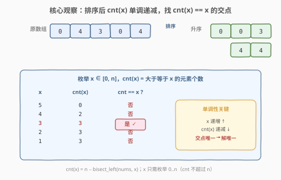
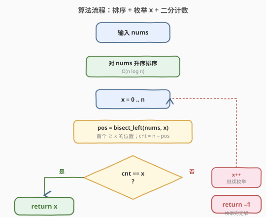

# 特殊数组的特征值

- **题目名称**：特殊数组的特征值
- **链接**：[1608. 特殊数组的特征值](https://leetcode.cn/problems/special-array-with-x-elements-greater-than-or-equal-x/)
- **难度**：简单
- **标签**：数组、排序、二分查找

## 1. 题目概述

给定一个非负整数数组 `nums`。如果存在一个数 `x`，使得 `nums` 中**恰好**有 `x` 个元素**大于或等于** `x`，则称 `nums` 是一个**特殊数组**，`x` 是该数组的**特征值**。

注意：`x` **不必**是 `nums` 中的元素。如果 `nums` 是特殊数组，返回特征值 `x`；否则返回 `-1`。可以证明，若 `nums` 是特殊数组，其特征值 `x` 是**唯一**的。

**示例 1**：

```text
输入：nums = [3,5]
输出：2
解释：有 2 个元素（3 和 5）大于或等于 2。
```

**示例 2**：

```text
输入：nums = [0,0]
输出：-1
解释：没有满足题目要求的特殊数组。
x = 0 时应有 0 个元素 ≥ 0，但实际有 2 个；
x = 1 时应有 1 个元素 ≥ 1，但实际有 0 个；
x = 2 时应有 2 个元素 ≥ 2，但实际有 0 个。
x 不能更大，因为数组只有 2 个元素。
```

**示例 3**：

```text
输入：nums = [0,4,3,0,4]
输出：3
解释：有 3 个元素大于或等于 3。
```

**示例 4**：

```text
输入：nums = [3,6,7,7,0]
输出：-1
```

**约束条件**：

- `1 <= nums.length <= 100`
- `0 <= nums[i] <= 1000`

> 💡 题目本质是寻找一个**自指计数**的不动点：让"阈值 `x`"与"达到该阈值的元素个数"恰好相等。由于元素个数最多为 `n`，候选 `x` 只需在 `[0, n]` 范围内枚举，搜索空间很小。

---

## 2. 解题思路

### 2.1 暴力思路：枚举 x 逐一计数

最直接的思路：`x` 的取值范围是 `0` 到 `n`（因为"≥ x 的元素个数"不可能超过 `n`）。对每个候选 `x`，线性扫描 `nums` 数一下有多少元素 `≥ x`，若恰好等于 `x` 就返回。

```text
for x in 0..n:
    cnt = 0
    for v in nums:
        if v >= x: cnt += 1
    if cnt == x: return x
return -1
```

这样写完全正确，时间复杂度 $O(n^2)$。但每次计数都是一次 $O(n)$ 的独立扫描，存在大量重复比较。**排序后可以让计数变成 $O(\log n)$**。

### 2.2 核心观察：排序后 cnt(x) 单调递减，二分计数



关键洞察有两层：

**第一层——排序暴露单调性。** 将 `nums` 升序排序后，定义计数函数 $\text{cnt}(x) = |\{v \in \text{nums} : v \geq x\}|$。当 `x` 递增时，满足 `v ≥ x` 的元素只会减少不会增多，所以 $\text{cnt}(x)$ **单调不增**。而 $x$ 本身严格递增，于是 $\text{cnt}(x) - x$ **严格递减**——这意味着 `cnt(x) == x` 的交点**至多一个**，与题目"特征值唯一"的结论吻合。

**第二层——二分把计数降到 $O(\log n)$。** 排序后，$\text{cnt}(x) = n - \text{pos}(x)$，其中 $\text{pos}(x)$ 是升序数组中**第一个 `≥ x` 的位置**（即 `bisect_left` / `lower_bound`）。一次二分即可拿到 $\text{pos}(x)$，于是 $\text{cnt}(x)$ 在 $O(\log n)$ 时间内算出。

> 💡 **为什么 x 只枚举 0..n？** $\text{cnt}(x) \leq n$ 恒成立（元素总数就是上限）。若 $\text{cnt}(x) = x$，则 $x \leq n$。所以候选 `x` 只需在 $[0, n]$ 内，搜索空间仅 $n+1$ 个值。

> ⚠️ `x` 不必是 `nums` 中的元素（示例 1 的 `x = 2` 就不在 `[3,5]` 中）。因此不能只拿数组元素当候选，必须把整个 $[0, n]$ 区间的整数都纳入枚举。

### 2.3 算法流程图



流程分三步：(1) 升序排序；(2) 枚举 `x = 0..n`，每次用 `bisect_left` 求首个 `≥ x` 的位置 `pos`，得 $\text{cnt} = n - \text{pos}$；(3) 若 $\text{cnt} = x$ 立即返回，枚举完毕仍无解则返回 `-1`。

### 2.4 示例演算

![示例演算：nums = [0,4,3,0,4]，排序后逐 x 计数](../images/special_array_walkthrough.svg)

以示例 3 `nums = [0,4,3,0,4]` 为例，排序后为 `[0,0,3,4,4]`，$n = 5$：

| $x$ | $\text{pos}(x)$（首个 `≥ x`） | $\text{cnt} = 5 - \text{pos}$ | $\text{cnt} == x$？ |
|-----|------------------------------|------------------------------|---------------------|
| 5   | 5                            | 0                            | 否                  |
| 4   | 3                            | 2                            | 否                  |
| **3** | **2**                      | **3**                        | **是 ✓**            |
| 2   | 2                            | 3                            | 否                  |
| 1   | 2                            | 3                            | 否                  |
| 0   | 0                            | 5                            | 否                  |

`x = 3` 时，`pos = 2`（下标 2 的元素 `3` 是首个 `≥ 3` 的），`cnt = 5 − 2 = 3 = x`，命中。即排序后下标 2、3、4 共 3 个元素（`3, 4, 4`）`≥ 3`，返回 `3`。

> 💡 **观察要点**：`cnt(x)` 从 5 递减到 0，`x` 从 0 递增到 5，二者单调相向而行——交点 `x = 3` 唯一。这正是单调性保证"至多一个解"的直观体现。

---

## 3. 参考代码

### C++

```cpp
#include <algorithm>
#include <vector>
using namespace std;

class Solution {
public:
    int specialArray(vector<int>& nums) {
        sort(nums.begin(), nums.end());
        int n = nums.size();
        for (int x = 0; x <= n; ++x) {
            int pos = lower_bound(nums.begin(), nums.end(), x) - nums.begin();
            int cnt = n - pos;
            if (cnt == x) return x;
        }
        return -1;
    }
};
```

### Python

```python
from bisect import bisect_left

class Solution:
    def specialArray(self, nums: list[int]) -> int:
        nums.sort()
        n = len(nums)
        for x in range(n + 1):
            pos = bisect_left(nums, x)
            cnt = n - pos
            if cnt == x:
                return x
        return -1
```

> 💡 **写法细节**：
> - C++ 用 `std::lower_bound` 返回迭代器，减去 `begin()` 得下标；Python 用 `bisect.bisect_left` 直接返回下标。
> - `x` 枚举范围 `0..n`（含两端），`range(n + 1)` 恰好覆盖。
> - 排序后 `cnt = n - pos` 一行算出，无需再开循环计数。

---

## 4. 复杂度分析

| 维度 | 复杂度 | 说明 |
|------|--------|------|
| 时间复杂度 | $O(n \log n)$ | 排序 $O(n \log n)$ + 枚举 $n+1$ 个 `x` 每次二分 $O(\log n)$，共 $O(n \log n)$ |
| 空间复杂度 | $O(\log n)$ | 排序的栈空间（C++ `std::sort` 内省排序 / Python Timsort），不计输出 |

> 💡 本题 $n \leq 100$，$O(n^2)$ 暴力同样能 AC。但排序 + 二分展示了**用单调性把重复计数降维**的通用思路，在 $n$ 更大时收益明显（如 $n = 10^5$ 时 $O(n \log n)$ vs $O(n^2)$ 差三个数量级）。

---

## 5. 扩展：排序后单趟扫描 $O(n)$

排序后其实无需对每个 `x` 都做二分——可以利用"位置 `i` 直接对应候选 `x = n - i`"的关系一趟扫完：

> 升序排序后，从左到右枚举下标 `i`（`0..n-1`），令候选 `x = n - i`（即从 `i` 到末尾的元素个数）。若 `nums[i] >= x` **且**（`i == 0` 或 `nums[i-1] < x`），则恰好有 `x` 个元素 `≥ x`（下标 `i..n-1`），返回 `x`。

第二个条件 `nums[i-1] < x` 保证 `i` 是**首个** `≥ x` 的位置——若 `nums[i-1]` 也 `≥ x`，则实际 `cnt(x) > n - i = x`，不算命中。

```python
class Solution:
    def specialArray(self, nums: list[int]) -> int:
        nums.sort()
        n = len(nums)
        for i in range(n):
            x = n - i
            if nums[i] >= x and (i == 0 or nums[i-1] < x):
                return x
        return -1
```

排序仍占 $O(n \log n)$，但扫描部分降到 $O(n)$。两法等价，二分版更直观地展示了"计数函数单调"的思想；单趟版更紧凑，是面试中"能不能再优化"的常见追问方向。

---

## 6. 面试要点

1. **为什么 x 的枚举范围是 0..n 而不是 0..max(nums)？**

   - 因为 $\text{cnt}(x) \leq n$ 恒成立。若 $\text{cnt}(x) = x$，则 $x \leq n$。所以任何 `> n` 的 `x` 都不可能满足（$\text{cnt}$ 最多 `n`，永远 `< x`）。把上界收到 `n` 能避免无意义的枚举。

2. **如何证明特征值 x 至多一个？**

   - 排序后 $\text{cnt}(x)$ 随 `x` 递增单调不增，而 `x` 严格递增，故 $\text{cnt}(x) - x$ 严格递减。严格递减的函数至多有一个零点，即 $\text{cnt}(x) = x$ 至多一解。这与题目"特征值唯一"的保证一致。

3. **x 不在数组中时怎么办？**

   - 完全不影响。$\text{cnt}(x) = n - \text{bisect\_left}(\text{nums}, x)$ 对任意 `x` 都成立，无论 `x` 是否在数组中。`bisect_left` 返回的是"该插入的位置"，天然处理了 `x` 不在数组中的情况（如示例 1 的 `x = 2` 不在 `[3,5]` 中，`pos = 0`，`cnt = 2`）。

4. **暴力 $O(n^2)$ 和排序 + 二分 $O(n \log n)$ 在本题数据规模下差异大吗？**

   - $n \leq 100$ 时差异可忽略，两者都能 0ms AC。但面试官追问"数据量到 $10^5$ 怎么办"时，$O(n \log n)$ 仍稳过，$O(n^2)$ 会超时。展示排序 + 二分体现的是**识别单调性、用预处理换取重复查询效率**的工程意识。

5. **能否用计数排序把整体降到 $O(n + V)$？**

   - 可以。`nums[i]` 值域 $[0, 1000]$，可开一个值域数组统计频次并求后缀和（$\text{suf}[v] = $ 值 `≥ v` 的元素数）。枚举 `x = 0..n` 时 $\text{cnt}(x) = \text{suf}[x]$，$O(1)$ 查询。总体 $O(n + V)$，$V = 1001$。在值域远小于 $n \log n$ 时比排序更优，是"值域小用计数、值域大用排序"的典型抉择。

---

## 7. 同类练习题

- [1365. 有多少小于当前数字的数字](https://leetcode.cn/problems/how-many-numbers-are-smaller-than-the-current-number/)：排序 / 计数排序求"小于 v 的个数"，与本题"大于等于 x 的个数"对称，同为排序后计数家族
- [34. 在排序数组中查找元素的第一个和最后一个位置](https://leetcode.cn/problems/find-first-and-last-position-of-element-in-sorted-array/)：`bisect_left` / `lower_bound` 的母题，本题计数依赖的"首个 ≥ x 位置"即此模板
- [275. H 指数 II](https://leetcode.cn/problems/h-index-ii/)：求最大的 h 使至少 h 篇论文被引 ≥ h 次，与本题"恰好 x 个 ≥ x"结构高度同源，已排序版直接二分
- [274. H 指数](https://leetcode.cn/problems/h-index/)：275 的未排序版，需先排序或计数排序，对照本题"先排序再计数"的两段式
- [704. 二分查找](https://leetcode.cn/problems/binary-search/)（[题解](../0701-0800/704_二分查找.md)）：二分模板题，巩固 `bisect_left` 区间语义，本题二分计数的基石
