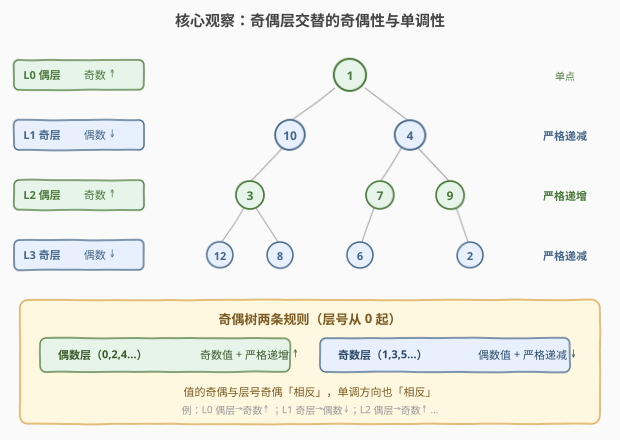
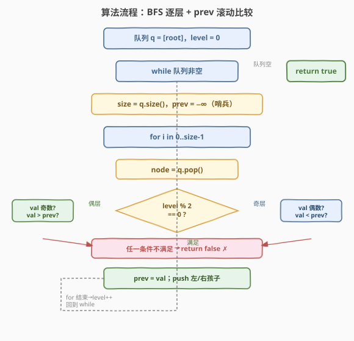
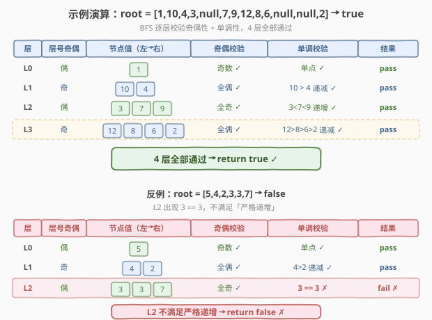

# LeetCode 奇偶树 题解

## 1. 题目概述

- **标题 / 题号**：奇偶树（#1609，medium）
- **链接**：https://leetcode.cn/problems/even-odd-tree/
- **难度**：中等
- **标签**：树、二叉树、广度优先搜索（BFS）

**题意**：给定一棵二叉树的根节点 `root`，判断它是否是一棵**奇偶树**（Even-Odd Tree）。奇偶树的定义如下（层号从 `0` 开始）：

- **偶数层**（第 `0, 2, 4, …` 层）：所有节点的值为**奇数**，且从左到右**严格递增**；
- **奇数层**（第 `1, 3, 5, …` 层）：所有节点的值为**偶数**，且从左到右**严格递减**。

> 💡 直白理解：值的奇偶性与层号的奇偶性「相反」——偶数层放奇数、奇数层放偶数；单调方向也「相反」——偶数层递增、奇数层递减。每个条件都必须**严格**满足（相等即不合法）。

**示例 1**：

```text
输入：root = [1,10,4,3,null,7,9,12,8,6,null,null,2]
输出：true

解释：
            1               L0: [1]        偶层 → 奇数 + 严格递增
          /    \
        10      4           L1: [10, 4]    奇层 → 偶数 + 严格递减
       /       / \
      3       7   9         L2: [3, 7, 9]  偶层 → 奇数 + 严格递增
     / \     /   / \
    12  8   6   ∅   2       L3: [12, 8, 6, 2]  奇层 → 偶数 + 严格递减

4 层全部满足规则 → true。
```

**示例 2**：

```text
输入：root = [5,4,2,3,3,7]
输出：false

解释：
        5
       / \
      4   2             L1: [4, 2]  奇层 → 偶数 + 递减 ✓
     / \  /
    3  3 7              L2: [3, 3, 7]  出现 3 == 3，不满足「严格递增」→ false
```

**示例 3**：

```text
输入：root = [5,9,1,3,5,7]
输出：false

解释：
        5
       / \
      9   1             L1: [9, 1]  奇层应为偶数，但 9 是奇数 → false
```

**约束**：

- 树中节点数目在范围 `[1, 10^5]` 内
- `1 <= Node.val <= 10^6`

> 💡 本题是 [102. 二叉树的层序遍历](../0101-0200/102_二叉树的层序遍历.md) 模板的直接延伸——把「逐层收集」升级为「逐层校验」。难点不在 BFS 骨架，而在理解奇偶层规则是对称的，并用一个 `prev` 滚动变量完成单调性比较。

## 2. 解题思路

### 2.1 暴力思路：DFS 收集每层值列表，再逐层校验

做一次 DFS（或 BFS），把每一层的节点值按从左到右的顺序存入二维数组 `levels[depth]`。遍历结束后，对每一层 `d` 单独校验两条规则：

1. 奇偶性：`d` 偶层则所有值奇数，`d` 奇层则所有值偶数；
2. 单调性：`d` 偶层则 `levels[d]` 严格递增，`d` 奇层则严格递减。

简单直观，但需要 $O(n)$ 额外空间存储所有层的值列表，且要**两遍**处理（先收集再校验）。

> ⚠️ 「先收集再校验」把遍历和判定割裂成两个阶段，空间和代码都偏重。其实校验可以在遍历中**边走边判**——每弹出一个节点就立即检查，不合格立刻返回 `false`，无需缓存整层。

### 2.2 核心观察：BFS 逐层边遍历边校验，prev 滚动比较



关键想法来自 [102. 二叉树的层序遍历](../0101-0200/102_二叉树的层序遍历.md) 的 **BFS `while + for(size)` 模板**——逐层处理，同层节点在队列中**从左到右相邻排列**。因此可以在 `for(size)` 循环内**逐个**校验：

- 维护一个 `prev` 变量记录当前层**前一个**节点的值；
- 每弹出一个节点，根据 `level` 的奇偶性检查两条：
  - **值奇偶性**：偶层→值必须奇数；奇层→值必须偶数；
  - **单调性**：偶层→`val > prev`（严格递增）；奇层→`val < prev`（严格递减）；
- 任一条件不满足，立即 `return false`；
- 每层开始时把 `prev` 重置为哨兵（偶层设 $-\infty$ 保证首个值必大于它；奇层设 $+\infty$ 保证首个值必小于它）。

> 💡 **核心不变量**：BFS 的 `for(size)` 锁定一层范围，同层节点按从左到右出队。`prev` 始终是「本层当前节点左侧紧邻的节点值」，因此 `val` 与 `prev` 的比较就是相邻两个同层节点的单调性判定。每层结束时 `level++` 切换奇偶规则，`prev` 重置为对应方向的哨兵。

> ⚠️ **「严格」二字的陷阱**：题目要求**严格**递增/递减，即相邻值不能相等。比较时用 `>` / `<` 而非 `>=` / `<=`。示例 2 中 `3 == 3` 正是因此被拒。

### 2.3 算法流程图



**完整步骤**：

1. **特判**：`root == null` 返回 `false`（题目保证至少 1 节点，此分支一般不可达）。
2. **初始化**：队列 `q = [root]`，`level = 0`。
3. **while 队列非空**（每轮处理一整层）：
   - `size = q.size()`；
   - `prev = 哨兵`（偶层 $-\infty$，奇层 $+\infty$）；
   - `for i in 0..size-1`：
     - `node = q.pop_front()`，`val = node.val`；
     - **偶层**（`level % 2 == 0`）：
       - 若 `val` 是偶数 → `return false`；
       - 若 `val <= prev` → `return false`；
     - **奇层**（`level % 2 == 1`）：
       - 若 `val` 是奇数 → `return false`；
       - 若 `val >= prev` → `return false`；
     - `prev = val`；
     - 若 `node` 有左/右孩子，按序推入队列；
   - `level++`。
4. 遍历完所有层未返回 → `return true`。

### 2.4 示例演算

以示例 1 `root = [1,10,4,3,null,7,9,12,8,6,null,null,2]` 为例，BFS 共 4 轮：



| 层 | 层号奇偶 | 节点值（左→右） | 奇偶校验 | 单调校验 | 结果 |
|----|----------|-----------------|----------|----------|------|
| L0 | 偶 | [1] | 奇数 ✓ | 单点 ✓ | pass |
| L1 | 奇 | [10, 4] | 全偶 ✓ | 10 > 4 递减 ✓ | pass |
| L2 | 偶 | [3, 7, 9] | 全奇 ✓ | 3 < 7 < 9 递增 ✓ | pass |
| L3 | 奇 | [12, 8, 6, 2] | 全偶 ✓ | 12 > 8 > 6 > 2 递减 ✓ | pass |

4 层全部通过 → `return true`。

> 💡 **对比反例** `[5,4,2,3,3,7]`：L2 节点值为 `[3, 3, 7]`，第二个 `3` 与前一个 `3` 比较 `3 <= 3`（不满足严格递增 `val > prev`）→ 立即 `return false`。校验在遍历中**当场**完成，无需先存完整层再判。

## 3. 参考代码

### 方法一：BFS 逐层校验（主解，$O(n)$ 时间 / $O(n)$ 空间）

### C++

```cpp
#include <climits>
#include <queue>
using namespace std;

struct TreeNode {
    int val;
    TreeNode* left;
    TreeNode* right;
    TreeNode() : val(0), left(nullptr), right(nullptr) {}
    TreeNode(int x) : val(x), left(nullptr), right(nullptr) {}
    TreeNode(int x, TreeNode* l, TreeNode* r) : val(x), left(l), right(r) {}
};

class Solution {
  public:
    bool isEvenOddTree(TreeNode* root) {
        if (!root) return false;
        queue<TreeNode*> q;
        q.push(root);
        int level = 0;
        while (!q.empty()) {
            int size = q.size();
            int prev = (level % 2 == 0) ? INT_MIN : INT_MAX; // 哨兵
            for (int i = 0; i < size; ++i) {
                TreeNode* node = q.front();
                q.pop();
                int val = node->val;
                if (level % 2 == 0) {            // 偶层：奇数 + 严格递增
                    if (val % 2 == 0) return false;
                    if (val <= prev) return false;
                } else {                         // 奇层：偶数 + 严格递减
                    if (val % 2 == 1) return false;
                    if (val >= prev) return false;
                }
                prev = val;
                if (node->left)  q.push(node->left);
                if (node->right) q.push(node->right);
            }
            ++level;
        }
        return true;
    }
};
```

### Python

```python
from collections import deque
from typing import Optional


class Solution:
    def isEvenOddTree(self, root: Optional[TreeNode]) -> bool:
        if not root:
            return False
        q = deque([root])
        level = 0
        while q:
            size = len(q)
            prev = float("-inf") if level % 2 == 0 else float("inf")  # 哨兵
            for _ in range(size):
                node = q.popleft()
                val = node.val
                if level % 2 == 0:            # 偶层：奇数 + 严格递增
                    if val % 2 == 0:
                        return False
                    if val <= prev:
                        return False
                else:                         # 奇层：偶数 + 严格递减
                    if val % 2 == 1:
                        return False
                    if val >= prev:
                        return False
                prev = val
                if node.left:
                    q.append(node.left)
                if node.right:
                    q.append(node.right)
            level += 1
        return True
```

> ⚠️ **易错点**：
> - **哨兵方向的选择**：偶层要求 `val > prev`，哨兵设 $-\infty$ 使首个值必通过；奇层要求 `val < prev`，哨兵设 $+\infty$。方向反了会导致首个节点被误判。C++ 中 `val` 上界 $10^6$，用 `INT_MIN/MAX`（来自 `<climits>`）即可安全覆盖（`INT_MIN` 远小于任何 `val`）。
> - **严格比较用 `<=` / `>=` 判失败**，而非 `<` / `>`。`val <= prev` 涵盖了「相等」与「逆序」两种违规，对应「严格递增」的否定。
> - **`prev` 必须在每层开头重置**，不能跨层复用——不同层单调方向相反，跨层比较无意义。
> - **奇偶判定用 `val % 2`**：C++ 中负数取模可能为负，但本题 `val >= 1`，`val % 2` 结果为 `0`（偶）或 `1`（奇），安全。

### 方法二：DFS 前序收集层列表，再统一校验（变体，$O(n)$ 时间 / $O(n)$ 空间）

### C++

```cpp
#include <vector>
using namespace std;

class Solution {
    vector<vector<int>> levels;
    void dfs(TreeNode* node, int depth) {
        if (!node) return;
        if (depth >= (int)levels.size()) levels.resize(depth + 1);
        levels[depth].push_back(node->val);
        dfs(node->left, depth + 1);
        dfs(node->right, depth + 1);
    }
  public:
    bool isEvenOddTree(TreeNode* root) {
        levels.clear();
        dfs(root, 0);
        for (int d = 0; d < (int)levels.size(); ++d) {
            const auto& row = levels[d];
            for (int i = 0; i < (int)row.size(); ++i) {
                if (d % 2 == 0) {                       // 偶层：奇数 + 严格递增
                    if (row[i] % 2 == 0) return false;
                    if (i > 0 && row[i] <= row[i - 1]) return false;
                } else {                                // 奇层：偶数 + 严格递减
                    if (row[i] % 2 == 1) return false;
                    if (i > 0 && row[i] >= row[i - 1]) return false;
                }
            }
        }
        return true;
    }
};
```

### Python

```python
from typing import Optional


class Solution:
    def isEvenOddTree(self, root: Optional[TreeNode]) -> bool:
        levels: list[list[int]] = []

        def dfs(node: Optional[TreeNode], depth: int) -> None:
            if not node:
                return
            if depth >= len(levels):
                levels.append([])
            levels[depth].append(node.val)
            dfs(node.left, depth + 1)
            dfs(node.right, depth + 1)

        dfs(root, 0)
        for d, row in enumerate(levels):
            for i, val in enumerate(row):
                if d % 2 == 0:                       # 偶层：奇数 + 严格递增
                    if val % 2 == 0:
                        return False
                    if i > 0 and val <= row[i - 1]:
                        return False
                else:                                # 奇层：偶数 + 严格递减
                    if val % 2 == 1:
                        return False
                    if i > 0 and val >= row[i - 1]:
                        return False
        return True
```

> 💡 **DFS 版的特点**：前序遍历（根→左→右）天然按从左到右访问同层节点，所以 `levels[d]` 中值的顺序就是从左到右。校验时比较 `row[i]` 与 `row[i-1]` 即相邻同层节点。空间 $O(n)$ 存全部层，比 BFS 主解多一倍（BFS 只存队列），但代码逻辑分两段更清晰——适合面试时先写出来再优化为 BFS 边走边判。

## 4. 复杂度分析

| 维度 | 方法一（BFS 边走边判） | 方法二（DFS 收集再校验） |
|------|------------------------|--------------------------|
| **时间复杂度** | $O(n)$ | $O(n)$ |
| **空间复杂度** | $O(n)$（队列最大存一层） | $O(n)$（存全部层值 + 递归栈） |
| **提前终止** | 不合格立即 `return false` | 收集阶段无法提前终止，校验阶段可 |
| **代码量** | 较短，遍历与校验合一 | 较长，分收集与校验两段 |

> 💡 **BFS 主解的空间优势**：队列只存「当前层 + 下一层」的节点，最宽层约 $n/2$（满二叉树底层），量级 $O(n)$ 但常数小于 DFS 存全部层。DFS 还需递归栈 $O(h)$，最坏退化成链时 $O(n)$。

> ⚠️ **$n = 10^5$ 时的栈溢出风险**：C++ 递归 DFS 在树退化成链时递归深度达 $10^5$，可能栈溢出。BFS 用队列无此问题。Python 默认递归上限 `1000`，深树必栈溢出——这也是 BFS 作为主解的理由之一。

## 5. 扩展：规则的对称性与哨兵技巧

### 5.1 奇偶层规则的对称性

本题的规则在偶层与奇层间是**完美对称**的——只需把「奇/偶」与「递增/递减」同时取反：

| 层号 | 值奇偶性 | 单调方向 | 哨兵 |
|------|----------|----------|------|
| 偶层 | 奇数 | 严格递增 `val > prev` | $-\infty$ |
| 奇层 | 偶数 | 严格递减 `val < prev` | $+\infty$ |

> 💡 利用对称性可以把偶层与奇层的校验写成**统一公式**：令 `parity = level % 2`（期望的值奇偶性），`sign = level % 2 == 0 ? +1 : -1`（单调方向系数），则校验可统一为 `val % 2 != parity` 且 `(val - prev) * sign > 0`。但实际代码中 `if/else` 两分支更直观可读，统一公式适合追求代码极简的场景。

### 5.2 哨兵的替代：首节点特判

除了用 $\pm\infty$ 哨兵，也可在每层 `for` 循环中特判 `i == 0`（首个节点只查奇偶性、跳过单调比较）：

```python
for i in range(size):
    val = q.popleft().val
    if level % 2 == 0:
        if val % 2 == 0: return False
        if i > 0 and val <= prev: return False
    else:
        if val % 2 == 1: return False
        if i > 0 and val >= prev: return False
    prev = val
```

两种写法等价。哨兵法省去 `i > 0` 判断、代码更短；首节点特判法不依赖无穷大常量、可移植性更好。面试中任选其一即可。

### 5.3 变体：若规则改为「非严格」递增/递减

若题目改为「非严格」（允许相等），只需把 `val <= prev` 改为 `val < prev`、`val >= prev` 改为 `val > prev`。对称地，哨兵也要调整——但通常这类变体会同时去掉「严格」二字，使 `val == prev` 合法。

## 6. 面试要点

1. **为什么用 BFS 而不是 DFS 作为主解？**

   > 本题的校验是**逐层**的——同一层内比较相邻节点的单调性。BFS 的 `while + for(size)` 天然按层处理，同层节点在队列中从左到右排列，`prev` 滚动比较即可。DFS 虽然前序也能保证同层从左到右，但需要额外存全部层才能比较相邻值，空间更大。此外 BFS 无递归栈溢出风险，适合 $n = 10^5$ 的深树。

2. **`prev` 哨兵为什么偶层设 $-\infty$、奇层设 $+\infty$？**

   > 偶层要求 `val > prev`（严格递增），首个节点没有「前一个」可比，设 $-\infty$ 使 `val > -∞` 恒成立，相当于跳过首节点的单调校验。奇层要求 `val < prev`（严格递减），设 $+\infty$ 同理。哨兵的方向必须与单调方向一致——递增用下界、递减用上界。

3. **「严格」递增/递减在代码里如何体现？**

   > 用 `val <= prev` 判失败（偶层）和 `val >= prev` 判失败（奇层）。`<=` 涵盖了「相等」和「逆序」两种违规，正是「严格递增」的否定。若误写成 `val < prev`，则 `val == prev` 会通过——示例 2 的 `3 == 3` 就会被漏判。

4. **`prev` 为什么要每层重置？**

   > 不同层的单调方向相反——偶层递增、奇层递减。若跨层复用 `prev`，会把上一层末尾值与下一层首个值比较，方向可能相反导致误判。每层开头重置 `prev` 为对应方向的哨兵，确保只在本层内比较。

5. **值的奇偶性怎么判？负数有坑吗？**

   > 用 `val % 2`：结果 `0` 为偶、`1` 为奇。本题 `val >= 1` 无负数问题。但 C++ 中负数取模结果可能为负（如 `-3 % 2 == -1`），若题目允许负值，应改用 `(val % 2 + 2) % 2` 或 `val & 1`（位运算结果非负）。

> 💡 **一句话总结**：1609 的核心是「**BFS 逐层 + prev 滚动比较**」。把奇偶树的对称规则拆成「值奇偶」与「单调性」两组校验，在 `for(size)` 循环内逐节点当场判定，不合格立即返回。哨兵技巧优雅地处理了每层首节点的边界。

## 同类练习题

| # | 题目 | 与本题的关联 |
|---|------|-------------|
| 102 | [二叉树的层序遍历](https://leetcode.cn/problems/binary-tree-level-order-traversal/)（[题解](../0101-0200/102_二叉树的层序遍历.md)） | BFS `while + for(size)` 模板的母题，本题骨架来源 |
| 958 | [二叉树的完全性检验](https://leetcode.cn/problems/check-completeness-of-a-binary-tree/)（[题解](../0901-1000/958_二叉树的完全性检验.md)） | 层序遍历做结构校验，与本题同为「BFS 从遍历走向校验」的典型 |
| 103 | [二叉树的锯齿形层序遍历](https://leetcode.cn/problems/binary-tree-zigzag-level-order-traversal/)（[题解](../0101-0200/103_二叉树的锯齿形层序遍历.md)） | BFS + 奇偶层反向，与本题「奇偶层规则不同」思想同源 |
| 662 | [二叉树最大宽度](https://leetcode.cn/problems/maximum-width-of-binary-tree/)（[题解](../0601-0700/662_二叉树最大宽度.md)） | BFS 逐层 + 节点编号，同属层序遍历应用 |
| 199 | [二叉树的右视图](https://leetcode.cn/problems/binary-tree-right-side-view/)（[题解](../0101-0200/199_二叉树的右视图.md)） | BFS 每层取最右节点，模板同源 |
