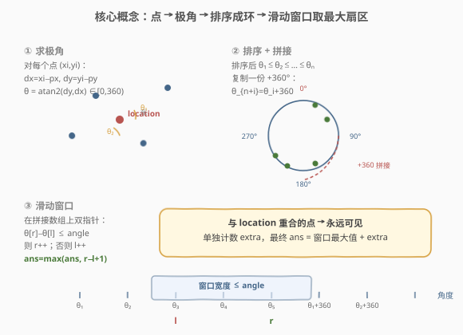
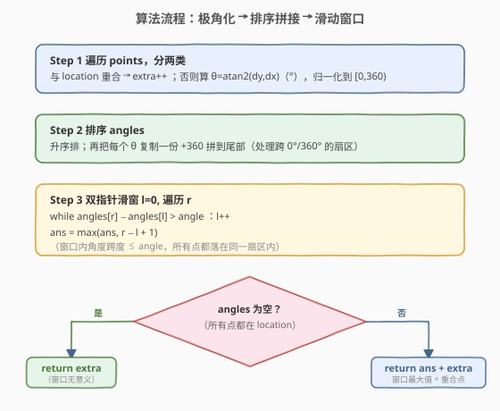
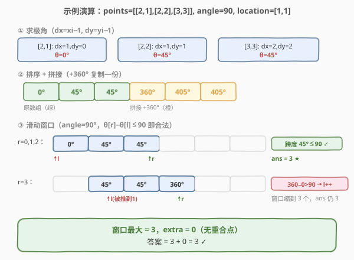

# 可见点的最大数目

- **题目名称**：可见点的最大数目
- **链接**：[1610. 可见点的最大数目](https://leetcode.cn/problems/maximum-number-of-visible-points/)
- **难度**：困难
- **标签**：几何、排序、滑动窗口、双指针

## 1. 题目概述

给定平面上一组点 `points`、一个视野角度 `angle` 和你的位置 `location`。你**不能移动**，但可以**自转**调整观测方向。初始面向**东方**（x 轴正方向）。设自转角度为 $d$，则视野范围是 $[d - \text{angle}/2,\ d + \text{angle}/2]$。一个点若相对你的位置与东方方向所成的角落在该范围内，则可见。**与 `location` 重合的点无论怎么旋转都能看到**，且点之间互不遮挡。返回能看到的最大点数。

**示例 1**：

```text
输入：points = [[2,1],[2,2],[3,3]], angle = 90, location = [1,1]
输出：3
解释：三个点都在 90° 扇区内（θ 分别为 0°、45°、45°），全部可见。
```

**示例 2**：

```text
输入：points = [[2,1],[2,2],[3,4],[1,1]], angle = 90, location = [1,1]
输出：4
解释：[1,1] 与 location 重合，永远可见（extra=1）；另三点 θ∈{0°,45°,45°} 在同一扇区，
      ans = 3 + 1 = 4。
```

**示例 3**：

```text
输入：points = [[1,0],[2,1]], angle = 13, location = [1,1]
输出：1
解释：两点 θ 分别为 270° 与 0°，跨度 90° 远大于 13°，无法同框，最多见 1。
```

**约束条件**：

- $1 \le \text{points.length} \le 10^5$
- $\text{points}[i].\text{length} == 2$，$\text{location.length} == 2$
- $0 \le \text{angle} < 360$
- $0 \le \text{posx, posy, xi, yi} \le 100$

> 💡 **几何降维**：每个点相对 `location` 的"可见性"只取决于它所在的方向（极角），而与距离无关。把所有点转成极角后，问题立刻退化为——**在一条首尾相接的角度环上，找一个跨度不超过 `angle` 的窗口，使其覆盖点数最多**。这是典型的「排序 + 环形滑动窗口」。

---

## 2. 解题思路

### 2.1 暴力思路：枚举每个点作为视野中心

对每个点 $p$，以其极角 $\theta_p$ 为视野中心，扫描所有点统计落在 $[\theta_p - \text{angle}/2,\ \theta_p + \text{angle}/2]$ 内的数量，取最大。单次 $O(n)$，总 $O(n^2)$。$n = 10^5$ 时约 $10^{10}$，超时。

> 💡 **瓶颈**：每个点都做一次全扫描，重复严重。角度是一维有序量——先排序，就能用双指针把"窗口内计数"做到均摊 $O(1)$。

### 2.2 核心观察：极角化 + 排序 + 环形拼接 + 滑动窗口



**第一步：极角化。** 对每个点 $(x_i, y_i)$ 计算 $dx = x_i - \text{posx}$、$dy = y_i - \text{posy}$。若 $dx = dy = 0$，该点与 `location` 重合，单独记入 `extra`（永远可见）。否则用 `atan2(dy, dx)` 求极角（弧度），转成度数并归一化到 $[0, 360)$。

**第二步：排序。** 把所有极角升序排列，得到有序数组 `angles`。

**第三步：环形拼接。** 视野可能跨过 $0°$/$360°$ 边界（如扇区从 $350°$ 延伸到 $80°$）。为用线性滑动窗口处理这种"跨边界"情况，把 `angles` 复制一份、每个加 $360°$ 拼到尾部：`angles[i+n] = angles[i] + 360`。这样任何跨边界的窗口都能在一个线性区间里被覆盖到。

**第四步：滑动窗口。** 双指针 $l, r$ 在拼接数组上滑动：

- 固定右端 $r$，当 $\text{angles}[r] - \text{angles}[l] > \text{angle}$ 时，$l \mathrel{+}= 1$。
- 此时窗口 $[l, r]$ 内所有点角度跨度 $\le \text{angle}$，均落在同一扇区。
- $\text{ans} = \max(\text{ans},\ r - l + 1)$。

> ⚠️ **为什么窗口只取到 $r < 2n$？** 拼接后长度 $2n$，任何宽度 $\le 360°$ 的合法窗口都必然能被某个长度 $\le n$ 的区间覆盖（因为窗口里"原"角度不会重复出现超过一轮）。所以 $r$ 遍历到 $2n-1$ 即可保证不漏解。

> ⚠️ **浮点精度**：`atan2` 返回浮点，比较 $\text{angles}[r] - \text{angles}[l] > \text{angle}$ 时无需额外 eps——`angle` 是整数、差值不会贴着边界产生歧义（同一点可重复，$\le$ 与 $<$ 在整数 angle 下等价于"恰好等于 angle 也算可见"，题目用闭区间 $[d-\text{angle}/2, d+\text{angle}/2]$，故用 `>` 推左指针即可）。

### 2.3 算法流程图



流程要点：

1. **分两类**：重合点 $\to$ `extra`；其余 $\to$ 算极角入 `angles`。
2. **排序 + 拼接**：`angles` 升序，尾部追加 `angles[i] + 360`。
3. **双指针滑窗**：右端 $r$ 从 $0$ 遍历到 $2n-1$，左端 $l$ 按需右推，维护窗口跨度 $\le \text{angle}$，记录最大窗口。
4. **结果合并**：若 `angles` 为空（所有点都重合），直接返回 `extra`；否则返回 `窗口最大值 + extra`。

### 2.4 示例演算

以 `points = [[2,1],[2,2],[3,3]], angle = 90, location = [1,1]` 为例（预期 `3`）：



| 步 | 阶段 | angles（拼接后） | 窗口 | 跨度 | ans |
|----|------|------------------|------|------|-----|
| ① | 求极角 | $[0°, 45°, 45°]$ | — | — | — |
| ② | 排序+拼接 | $[0, 45, 45,\ 360, 405, 405]$ | — | — | — |
| ③ | $r=0,1,2$ | — | $[0°, 45°, 45°]$ | $45° \le 90°$ | **3** |
| ④ | $r=3$（$360°$） | — | $360° - 0° = 360° > 90°$，$l$ 推到 1 | — | 3 |

> 💡 **关键看第 ③ 步**：前三个原始角度 $0°/45°/45°$ 跨度仅 $45°$，全在 $90°$ 扇区内，窗口一次性覆盖 3 个点。第 ④ 步 $r$ 走到拼接的 $360°$ 时，$360° - 0° = 360° > 90°$，左指针被推到 $1$，窗口缩成 3 个，`ans` 仍为 3。`extra = 0`，最终 $3 + 0 = 3$。

> 💡 **跨边界场景**：若两点的角度为 $350°$ 和 $10°$，原始数组跨度 $340°$ 看似不合法；但拼接后 $[350, 370]$（$10+360$）跨度仅 $20°$，窗口能正确覆盖——这就是"拼接 +360"处理的跨边界扇区。

---

## 3. 参考代码

### C++

```cpp
class Solution {
public:
    int visiblePoints(vector<vector<int>>& points, int angle, vector<int>& location) {
        int px = location[0], py = location[1];
        vector<double> angles;
        int extra = 0;
        for (auto& p : points) {
            int dx = p[0] - px, dy = p[1] - py;
            if (dx == 0 && dy == 0) { extra++; continue; }
            double deg = atan2(dy, dx) * 180.0 / M_PI;  // (-180, 180]
            if (deg < 0) deg += 360.0;                   // 归一到 [0, 360)
            angles.push_back(deg);
        }
        sort(angles.begin(), angles.end());
        int n = angles.size();
        for (int i = 0; i < n; ++i) angles.push_back(angles[i] + 360.0);  // 环形拼接

        int ans = 0;
        for (int r = 0, l = 0; r < 2 * n; ++r) {
            while (angles[r] - angles[l] > angle + 1e-9) l++;
            ans = max(ans, r - l + 1);
        }
        return ans + extra;
    }
};
```

### Python

```python
class Solution:
    def visiblePoints(self, points: List[List[int]], angle: int, location: List[int]) -> int:
        px, py = location
        angles = []
        extra = 0
        for x, y in points:
            dx, dy = x - px, y - py
            if dx == 0 and dy == 0:
                extra += 1
                continue
            deg = math.degrees(math.atan2(dy, dx))  # (-180, 180]
            if deg < 0:
                deg += 360.0                         # 归一到 [0, 360)
            angles.append(deg)
        angles.sort()
        n = len(angles)
        angles += [a + 360.0 for a in angles]        # 环形拼接

        ans = 0
        l = 0
        for r in range(2 * n):
            while angles[r] - angles[l] > angle + 1e-9:
                l += 1
            ans = max(ans, r - l + 1)
        return ans + extra
```

> 💡 **写法细节**：
> - `atan2(dy, dx)` 返回 $(-\pi, \pi]$，转度后落在 $(-180, 180]$，对负值 $+360°$ 归一到 $[0, 360)$。
> - 比较时加 `1e-9` 的 eps 防止浮点抖动把恰好等于 `angle` 的合法窗口误判为越界（题目是闭区间）。
> - C++ 用 `M_PI`（`<cmath>` 自带）；Python 用 `math.degrees` / `math.atan2`。
> - 拼接后数组长度 $2n$，$r$ 遍历到 $2n-1$ 即可覆盖所有可能的扇区。

---

## 4. 复杂度分析

| 维度 | 复杂度 | 说明 |
|------|--------|------|
| 时间复杂度 | $O(n \log n)$ | 求极角 $O(n)$ + 排序 $O(n \log n)$ + 滑窗 $O(n)$（$l, r$ 各最多走 $2n$ 步） |
| 空间复杂度 | $O(n)$ | `angles` 数组（拼接后 $2n$） |

> 💡 $n = 10^5$ 时，$n \log n \approx 1.7 \times 10^6$，滑窗 $2n = 2 \times 10^5$，总体轻松通过。瓶颈在排序，而非滑窗。

---

## 5. 扩展：不用拼接的环形滑窗

拼接法直观但多用了 $O(n)$ 空间。也可用**取模法**实现原地环形滑窗：右端 $r$ 在 $[0, 2n)$ 遍历，访问 `angles[r % n] + (r >= n ? 360 : 0)`，左端 $l$ 同理。逻辑等价，省去拼接数组。但可读性略降，面试中推荐拼接法——**先写对，再优化**。

另一种思路是**二分**：对每个 $l$，在拼接数组上二分找最大的 `angles[r] - angles[l] <= angle` 的 $r$，窗口大小 $r - l + 1$。复杂度同为 $O(n \log n)$，但常数比滑窗大。滑窗的优势在于 $l, r$ 都单调不减，均摊 $O(1)$ 移动。

| 方法 | 时间 | 空间 | 特点 |
|------|------|------|------|
| 排序 + 拼接 + 滑窗 | $O(n \log n)$ | $O(n)$ | 推荐：直观、常数小 |
| 排序 + 取模环形滑窗 | $O(n \log n)$ | $O(n)$（仅原数组） | 省拼接空间，可读性略降 |
| 排序 + 二分 | $O(n \log n)$ | $O(n)$ | 每个左端二分找右端，常数稍大 |

---

## 6. 面试要点

1. **为什么要把角度归一化到 $[0, 360)$ 再拼接 +360，而不是直接在 $[-180, 180]$ 上做？**

   - `atan2` 原始范围 $(-180, 180]$ 是一条**断开的线段**——$-179°$ 和 $+179°$ 在数值上相距 $358°$，但在圆周上只差 $2°$。直接在这条线上滑窗会错误地把"跨 $180°$ 边界"的窗口判定为不合法。归一化到 $[0, 360)$ 后是一个**闭合的环**，再拼接 +360 把环展开成可线性扫描的数组，所有跨边界扇区都能被一段连续区间覆盖。

2. **`extra` 为什么要单独计数，不能直接当作 $\theta = 0°$ 的点塞进 `angles`？**

   - 与 `location` 重合的点**没有确定的方向**（$dx = dy = 0$，`atan2(0,0)` 无定义），它**始终在视野内**，与扇区朝向无关。若强行赋某个角度塞进 `angles`，会让该点只在一个特定扇区里被计数，漏掉其他朝向的窗口，导致答案偏小。单独计入 `extra` 是唯一正确的处理。

3. **滑动窗口为什么是 $O(n)$ 而不是 $O(n^2)$？**

   - 双指针 $l, r$ 都**单调不减**。内层 `while` 每次 $l \mathrel{+}= 1$，而 $l$ 在整个循环中最多从 $0$ 走到 $2n-1$，故内层总执行次数 $\le 2n$。外层 $r$ 遍历 $2n$ 次。总步数 $\le 4n$，均摊每步 $O(1)$。这是「单调队列/滑窗」范式成立的核心——**指针不回头**。

4. **浮点比较为什么加 `1e-9`？不加会怎样？**

   - `atan2` 与角度运算引入浮点误差，原本恰好 $\text{angles}[r] - \text{angles}[l] = \text{angle}$（合法）的窗口，可能被算成 $\text{angle} + 10^{-13}$ 而被误判越界。加一个小 eps 让 `>` 比较在"恰好等于"时判定为合法（对应闭区间）。不加通常也能 AC（LeetCode 数据不易卡这个边界），但加 eps 是稳妥的工程习惯。

5. **如果 `angle = 360` 怎么办？**

   - 视野覆盖整圆，所有非重合点都可见。滑窗中 $\text{angles}[r] - \text{angles}[l] \le 360$ 恒成立（拼接后最大跨度 $< 720°$，但窗口只需 $< n$ 个原角度），$l$ 不会被推到超过 $r$，窗口会覆盖全部 $n$ 个非重合点。最终 `ans = n + extra`，与直觉一致。代码无需特判。

---

## 7. 同类练习题

- [3. 无重复字符的最长子串](https://leetcode.cn/problems/longest-substring-without-repeating-characters/)（[题解](../0001-0100/3_无重复字符的最长子串.md)）：滑动窗口母题，体会"双指针单调不回头"的范式
- [209. 长度最小的子数组](https://leetcode.cn/problems/minimum-size-subarray-sum/)（[题解](../0201-0300/209_长度最小的子数组.md)）：正数单调性上的滑窗，对照本题"角度有序"上的滑窗
- [435. 无重叠区间](https://leetcode.cn/problems/non-overlapping-intervals/)（[题解](../0401-0500/435_无重叠区间.md)）：区间排序 + 贪心，与本题"角度排序后取最大不越界窗口"同源
- [149. 直线上最多的点数](https://leetcode.cn/problems/max-points-on-a-line/)（[题解](../0001-0100/149_直线上最多的点数.md)）：几何哈希题，对照本题把几何关系转成一维有序量的思路
- [424. 替换后的最长重复字符](https://leetcode.cn/problems/longest-repeating-character-replacement/)：滑动窗口 + 计数维护，窗口内维护"满足某约束的最大长度"，与本题"窗口跨度 ≤ angle"结构同构
