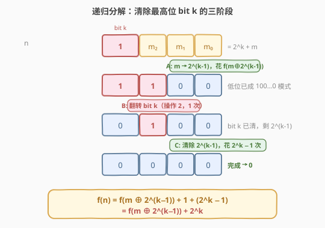
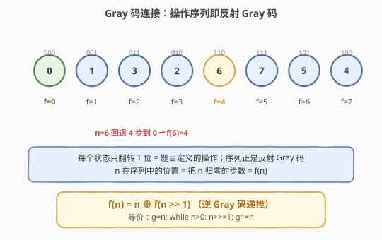
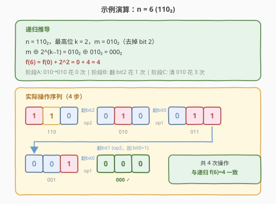

# LeetCode 使整数变为 0 的最少操作次数 题解

## 1. 题目概述

- **标题 / 题号**：使整数变为 0 的最少操作次数（#1611，hard）
- **链接**：https://leetcode.cn/problems/minimum-one-bit-operations-to-make-integers-zero/
- **难度**：困难
- **标签**：位运算、递归、数学、Gray 码

**题意**：给定一个整数 `n`，可以执行两种操作将其二进制表示中的某些位翻转，目标是把 `n` 变成 `0`，求**最少操作次数**：

- **操作 1**：翻转最右侧位（第 `0` 位）。任何时候都能用。
- **操作 2**：翻转第 `i` 位（`i ≥ 1`），前提是第 `(i−1)` 位为 `1`，且从第 `(i−2)` 位到第 `0` 位**全为 `0`**。即低位必须呈 `100…0` 的模式。

**示例 1**：

```text
输入：n = 3
输出：2
解释：3 = "11"
"11" -> "01"  （操作 2 翻 bit 1，因 bit 0 = 1）
"01" -> "00"  （操作 1 翻 bit 0）
```

**示例 2**：

```text
输入：n = 6
输出：4
解释：6 = "110"
"110" -> "010"  （操作 2 翻 bit 2，因 bit 1=1, bit 0=0）
"010" -> "011"  （操作 1 翻 bit 0）
"011" -> "001"  （操作 2 翻 bit 1，因 bit 0=1）
"001" -> "000"  （操作 1 翻 bit 0）
```

**约束**：

- `0 <= n <= 10^9`

## 2. 解题思路

### 2.1 暴力思路：BFS

最朴素的想法是把每个整数看成图中的一个节点，两种操作对应两条出边，从 `n` 出发 BFS 找到 `0` 的最短路径。但 `n` 可达 $10^9$（约 30 位），状态空间巨大，BFS 既存不下也跑不完。必须挖掘操作的结构。

### 2.2 核心观察：递归分解——清除最高位

关键直觉是**从最高位往下逐位清零**。设 `n` 的最高有效位为第 `k` 位（即 $n = 2^k + m$，其中 $m$ 是低 $k$ 位）。要把 `n` 变成 `0`，必须想办法**翻转 bit `k`**。而操作 2 翻 bit `k` 的前提是：低 $k$ 位恰好为 $2^{k-1}$（即 bit $k-1=1$，更低全 $0$）。

于是整个过程天然分成**三阶段**：



1. **阶段 A**：把低 $k$ 位从 $m$ 变成 $2^{k-1}$（排成 `100…0` 模式）。
2. **阶段 B**：翻转 bit $k$（操作 2，**1 次**）。此时 bit $k$ 已清零，低位剩 $2^{k-1}$。
3. **阶段 C**：把低位剩下的 $2^{k-1}$ 清成 `0`。

**两个关键量化**：

- **阶段 C 的代价是固定的**：清除一个孤立的 $2^{k-1}$（只有 bit $k-1$ 为 1）需要 $2^k - 1$ 次操作。记 $g(j) = 2^{j+1} - 1$ 为清除孤立位 $2^j$ 的代价，则阶段 C 花费 $g(k-1) = 2^k - 1$。
  - 推导：清除 $2^j$ 需先排好低位 $2^{j-1}$（代价 $g(j-1)$）、翻 bit $j$（1 次）、再清 $2^{j-1}$（代价 $g(j-1)$），故 $g(j) = 2g(j-1)+1$，结合 $g(0)=1$ 解得 $g(j)=2^{j+1}-1$。
- **阶段 A 的代价 = `f(m ⊕ 2^(k-1))`**：把状态 $m$ 变成目标 $2^{k-1}$，等价于把"差值" $m \oplus 2^{k-1}$ 变成 `0`。因为操作图在 XOR 下是顶点传递的——从 $a$ 到 $b$ 的最小操作数恰等于从 $a \oplus b$ 到 `0` 的最小操作数 `f(a ⊕ b)`。

> 💡 **操作的 XOR 对称性**：每个合法操作"翻转某一位"在 XOR 意义下是可交换的。把"当前态"与"目标态"作 XOR 差值，差值的演变遵循完全相同的操作规则，到达目标 ⟺ 差值归零。因此 `dist(a, b) = f(a ⊕ b)`。

把三阶段相加：

$$f(n) = f\!\left(m \oplus 2^{k-1}\right) + 1 + \left(2^k - 1\right) = f\!\left(m \oplus 2^{k-1}\right) + 2^k$$

其中 $k$ 为 `n` 最高位，$m = n \oplus 2^k$（清掉最高位）。每次递归 `n` 的位数严格减少，复杂度 $O(\log n)$。

### 2.3 算法流程图



递归流程：

1. 若 $n = 0$，返回 $0$（基准）。
2. 若 $n = 1$（即 $k = 0$），返回 $1 = g(0)$。
3. 否则取 $k = \lfloor \log_2 n \rfloor$，$m = n \oplus 2^k$，递归返回 $f(m \oplus 2^{k-1}) + 2^k$。

### 2.4 示例演算

以 `n = 6`（`110₂`）为例，$k = 2$，$m = 010₂$：

- $m \oplus 2^{k-1} = 010_2 \oplus 010_2 = 000_2$，故 $f(6) = f(0) + 2^2 = 0 + 4 = 4$。
- 对应实际操作序列共 4 步，与递归结果一致。



| 步骤 | 操作 | 状态变化 | 说明 |
|------|------|----------|------|
| 1 | 操作 2 翻 bit 2 | `110` → `010` | bit 1=1, bit 0=0，满足条件 |
| 2 | 操作 1 翻 bit 0 | `010` → `011` | 任意时刻可翻 bit 0 |
| 3 | 操作 2 翻 bit 1 | `011` → `001` | bit 0=1，满足条件 |
| 4 | 操作 1 翻 bit 0 | `001` → `000` | 完成 |

## 3. 参考代码

### 方法一：递归（按最高位分解，直接由三阶段推导）

### C++

```cpp
class Solution {
  public:
    int minimumOneBitOperations(int n) {
        if (n == 0) return 0;
        int k = 31 - __builtin_clz(n);   // 最高有效位下标
        if (k == 0) return 1;            // n == 1，即 g(0) = 1
        int m = n ^ (1 << k);            // 清掉最高位
        return minimumOneBitOperations(m ^ (1 << (k - 1))) + (1 << k);
    }
};
```

### Python

```python
class Solution:
    def minimumOneBitOperations(self, n: int) -> int:
        if n == 0:
            return 0
        k = n.bit_length() - 1          # 最高有效位下标
        if k == 0:
            return 1                    # n == 1
        m = n ^ (1 << k)                # 清掉最高位
        return self.minimumOneBitOperations(m ^ (1 << (k - 1))) + (1 << k)
```

### 方法二：迭代 / 递归——逆 Gray 码（一行核心）

把上面的递归展开，会发现 $f(n)$ 恰好等于 `n` 的**反射 Gray 码的逆**：把 `n` 不断右移并异或累加即可。推导来自 $f(n) = n \oplus f(n \gg 1)$（可由上式归纳证明）。

### C++

```cpp
class Solution {
  public:
    int minimumOneBitOperations(int n) {
        int g = n;
        while (n > 0) {
            n >>= 1;
            g ^= n;
        }
        return g;
    }
};
```

### Python

```python
class Solution:
    def minimumOneBitOperations(self, n: int) -> int:
        g = n
        while n:
            n >>= 1
            g ^= n
        return g
```

> 💡 也可以写成递归一行：`return 0 if n == 0 else n ^ self.minimumOneBitOperations(n >> 1)`，但迭代版本无栈开销、更稳。

## 4. 复杂度分析

| 维度 | 方法 | 复杂度 | 说明 |
|------|------|--------|------|
| 时间复杂度 | 递归（最高位分解） | $O(\log n)$ | 每次递归位数减 1，共约 30 层 |
| 空间复杂度 | 递归（最高位分解） | $O(\log n)$ | 递归栈深度 |
| 时间复杂度 | 迭代（逆 Gray 码） | $O(\log n)$ | 循环次数 = `n` 的位数 |
| 空间复杂度 | 迭代（逆 Gray 码） | $O(1)$ | 仅常数变量 |

> ⚠️ `n ≤ 10^9` 约 30 位，两种方法都只需约 30 次运算，效率极高。关键是想到递归分解与 Gray 码视角，而非真的去模拟操作。

## 5. 扩展：Gray 码视角

这道题本质是**反射 Gray 码**的逆变换。Gray 码 $G(n) = n \oplus (n \gg 1)$ 把自然数映射成一串相邻只差一位的序列：

$$0, 1, 3, 2, 6, 7, 5, 4, 12, 13, \dots$$

题目定义的两种操作恰好能生成这条序列上相邻状态之间的转移（每次只翻一位）。因此"把 $n$ 归零的最少步数" = "$n$ 在 Gray 码序列中的位置" = **Gray 码的逆** $G^{-1}(n)$，即本题答案。

逆 Gray 码的两种等价写法：

- **迭代累异或**：$g = n;\ \text{while } n > 0:\ n \gg= 1;\ g \oplus= n$。原理是 Gray 码的逆满足 $G^{-1}(n) = n \oplus G^{-1}(n \gg 1)$，展开后即逐位异或。
- **递归**：$f(n) = n \oplus f(n \gg 1)$，基准 $f(0) = 0$。

这解释了为何方法一的三阶段递归与方法二的逆 Gray 码给出完全相同的结果——它们是同一事物的两种描述。

## 6. 面试要点

1. **为什么不能直接 BFS？**
   - `n` 可达 $10^9$，状态空间是 $10^9$ 量级，BFS 的显式队列与访问表都存不下；必须利用操作的结构性，转向递归/位运算。

2. **为什么阶段 A 的代价是 `f(m ⊕ 2^(k-1))` 而不是 `f(m)`？**
   - 阶段 A 是"把 $m$ 变成目标 $2^{k-1}$"，不是"把 $m$ 变成 0"。利用操作的 XOR 对称性，`dist(a, b) = f(a ⊕ b)`，代入 $a=m,\ b=2^{k-1}$ 即得。

3. **如何证明清除孤立位 $2^j$ 的代价是 $2^{j+1}-1$？**
   - 递归 $g(j) = 2g(j-1) + 1$（排低位 + 翻当前位 + 清低位），$g(0)=1$，解得 $g(j) = 2^{j+1}-1$。这与 Gray 码长度 $2^{j+1}$ 减 1 吻合。

4. **方法一和方法二为什么结果一致？**
   - 它们分别是"按操作结构递归"和"逆 Gray 码"两种视角；展开方法一的递归即得到 $f(n) = n \oplus f(n \gg 1)$，正是逆 Gray 码递推。

5. **如果题目把操作 2 的条件改成别的形式怎么办？**
   - 关键看操作图是否仍具 XOR 对称性。若仍是"翻转某一位、前提只依赖当前位模式"，则 dist = f(差值) 的论证往往仍成立，可尝试类似的递归分解。

## 同类练习题

| # | 题目 | 与本题的关联 |
|---|------|-------------|
| 89 | [格雷编码](https://leetcode.cn/problems/gray-code/)（[题解](../0001-0100/89_格雷编码.md)） | 反射 Gray 码的构造，本题的"正向"姊妹题 |
| 231 | [2 的幂](https://leetcode.cn/problems/power-of-two/)（[题解](../0001-0100/231_2的幂.md)） | `n & (n-1)` 判单 1，位运算基础 |
| 371 | [两整数之和](https://leetcode.cn/problems/sum-of-two-integers/)（[题解](../0001-0100/371_两整数之和.md)） | 位运算模拟加法，同为位运算递归思维 |
| 190 | [颠倒二进制位](https://leetcode.cn/problems/reverse-bits/) | 位运算逐位处理，训练位级直觉 |
