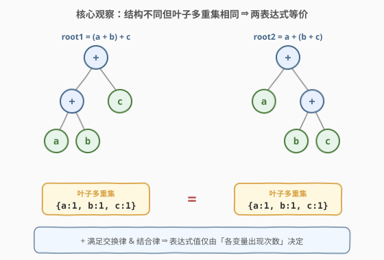
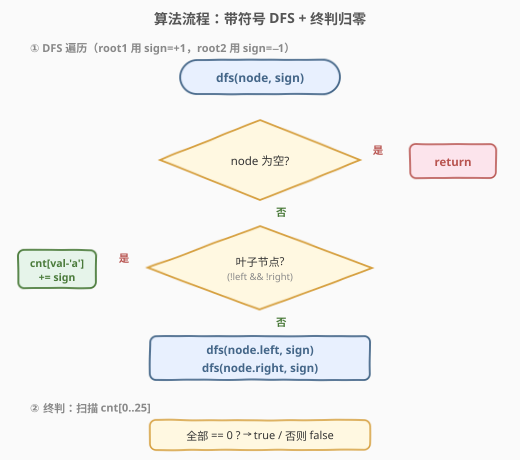
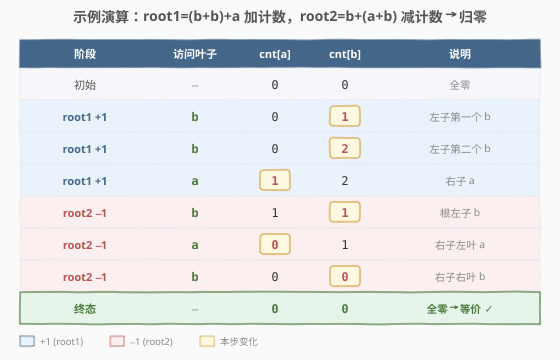

# LeetCode 检查两棵二叉表达式树是否等价 题解

## 1. 题目概述

- **标题 / 题号**：检查两棵二叉表达式树是否等价（#1612，medium）
- **链接**：https://leetcode.cn/problems/check-if-two-expression-trees-are-equivalent/
- **难度**：中等
- **标签**：树、深度优先搜索、哈希表、二叉树、计数

**题意**：**二叉表达式树**是一种用来表示算术表达式的二叉树：每个节点要么有 **0 个**子节点（叶子，即操作数），要么有 **2 个**子节点（内部节点，即运算符）。本题中**唯一的运算符是 `+`**，操作数为小写字母 `'a'` 到 `'z'`（代表变量）。

给定两棵这样的表达式树的根节点 `root1` 与 `root2`，判断二者是否**等价**：即**对变量的任意取值**，两棵树求值结果都相同。

> 💡 **等价的本质**：因为 `+` 满足**交换律**（$a+b = b+a$）与**结合律**（$(a+b)+c = a+(b+c)$），括号与顺序都不影响求值结果。于是两表达式等价 **当且仅当** 它们包含的**叶子变量多重集相同**——只要每种变量出现次数一致，无论怎么"凑"都相等。

**示例 1**：

```text
root1:     +            root2:     +
          / \                      / \
         +   c                    a   +
        / \                          / \
       a   b                        b   c

root1 = (a + b) + c
root2 = a + (b + c)
两棵树叶子多重集均为 {a:1, b:1, c:1} → 等价，返回 true
```

**示例 2**：

```text
root1:     +            root2:     +
          / \                      / \
         a   b                    a   c

root1 = a + b
root2 = a + c
多重集 {a:1, b:1} ≠ {a:1, c:1} → 不等价，返回 false
```

**示例 3**（含重复变量）：

```text
root1:     +            root2:     +
          / \                      / \
         +   a                    b   +
        / \                          / \
       b   b                        a   b

root1 = (b + b) + a = a + 2b
root2 = b + (a + b) = a + 2b
两棵树叶子多重集均为 {a:1, b:2} → 等价，返回 true
```

**约束**：

- 每棵树的节点数在 `[1, 5000]` 范围内
- `node.val` 为 `'+'` 或小写字母 `'a'`–`'z'`
- 树是合法的二叉表达式树（节点要么 0 个、要么 2 个孩子）

> ⚠️ 题目给出 `Node` 类定义（含 `val`、`left`、`right`），叶子节点的 `left`/`right` 均为空。

## 2. 解题思路

### 2.1 直观思路：中序遍历得表达式字符串？

最直白的想法：对两棵树做**中序遍历**，把表达式拍成字符串（如 `a+b+c`），再比较字符串是否相同。

但这立刻失败：示例 1 中 `root1` 中序为 `a+b+c`、`root2` 中序也是 `a+b+c`——恰好相同；可一旦结构不对称（如 `(a+b)+(c+d)` 与 `(a+c)+(b+d)`），中序字符串虽同为 `a+b+c+d`，但**任何按"出现顺序"比较的方法都会因顺序无关性而失效**，而真正决定等价的是**多重集**。

退一步的可行做法：DFS 收集**所有叶子变量**到列表，**排序后逐位比较**。这正确，但排序带来 $O(n \log n)$ 时间、$O(n)$ 空间，且没有利用"变量只有 26 种"这一关键约束。

### 2.2 核心观察：`+` 的交换律 + 结合律 ⇒ 只数叶子频次



关键洞察分两层：

1. **运算性质决定等价判据**：`+` 同时满足交换律与结合律，因此表达式的值**只取决于每个变量出现的总次数**，与运算顺序、括号结构无关。两树等价 $\iff$ 叶子变量频次表相同。
2. **变量域极小**：操作数只有 `'a'`–`'z'` 共 **26 种**，频次表可用一个长度 26 的定长数组承载——$O(1)$ 额外空间。

进一步，为避免维护两张频次表再逐位比较，可采用**"一加一减、最终归零"**的抵消法：

- 遍历 `root1`：遇到叶子变量 `ch`，`cnt[ch-'a'] += 1`；
- 遍历 `root2`：遇到叶子变量 `ch`，`cnt[ch-'a'] -= 1`；
- 最终若 `cnt` 全为 0，则两树叶子多重集相同 → 等价。

> 💡 **为什么抵消法可行？** `cnt[i]` 最终为 0，当且仅当树 1 中变量 `i` 的出现次数等于树 2 中的出现次数。全 0 即两张频次表完全一致。这把"比较两表"压缩为"维护一表"，常数更小、代码更短。

> ⚠️ 内部 `'+'` 节点无需任何处理——它不贡献变量，只负责"把左右子树的变量都算进来"，DFS 递归天然完成这件事。

### 2.3 算法流程图



流程是一个标准的"带符号 DFS"：

- 入口：`dfs(root1, +1)` 后 `dfs(root2, -1)`；
- 对每个节点：若是叶子（`left`、`right` 均空），按 `sign` 更新 `cnt[val-'a']`；若是 `'+'`，递归左、右子树（`sign` 透传）；
- 两趟 DFS 结束后，扫描 `cnt[0..25]`，全 0 返回 `true`，否则 `false`。

### 2.4 示例演算



以示例 3 为例，`root1 = (b+b)+a`、`root2 = b+(a+b)`。设 `cnt` 初值全 0，按 DFS 访问顺序：

| 阶段 | 访问叶子 | cnt[a] | cnt[b] | cnt[c..z] | 说明 |
|------|---------|--------|--------|-----------|------|
| 初始 | — | 0 | 0 | 0 | 全零 |
| `root1` sign=+1 | `b` | 0 | **1** | 0 | 左子树第一个 b |
| `root1` sign=+1 | `b` | 0 | **2** | 0 | 左子树第二个 b |
| `root1` sign=+1 | `a` | **1** | 2 | 0 | 右子树 a |
| `root2` sign=−1 | `b` | 1 | **1** | 0 | 根左子 b |
| `root2` sign=−1 | `a` | **0** | 1 | 0 | 右子树左叶 a |
| `root2` sign=−1 | `b` | 0 | **0** | 0 | 右子树右叶 b |
| 终态 | — | 0 | 0 | 0 | 全零 → 等价 |

> 💡 **观察要点**：`root1` 三次加法把 `cnt` 推到 `[a:1, b:2]`；`root2` 三次减法精确抵消回零。每加一次必有一次等量减法对应——这正是"多重集相同"的数值体现。

## 3. 参考代码

### C++

```cpp
/**
 * Definition for a binary expression tree node.
 * class Node {
 * public:
 *     char val;
 *     Node* left;
 *     Node* right;
 *     Node() : val(' '), left(nullptr), right(nullptr) {}
 *     Node(char _val) : val(_val), left(nullptr), right(nullptr) {}
 *     Node(char _val, Node* _left, Node* _right) : val(_val), left(_left), right(_right) {}
 * };
 */
class Solution {
  public:
    bool checkEquivalence(Node* root1, Node* root2) {
        int cnt[26] = {0};
        dfs(root1, cnt, +1);
        dfs(root2, cnt, -1);
        for (int i = 0; i < 26; ++i)
            if (cnt[i] != 0) return false;
        return true;
    }

  private:
    void dfs(Node* node, int cnt[], int sign) {
        if (!node) return;
        if (!node->left && !node->right) {
            cnt[node->val - 'a'] += sign;
            return;
        }
        dfs(node->left, cnt, sign);
        dfs(node->right, cnt, sign);
    }
};
```

### Python

```python
class Solution:
    def checkEquivalence(self, root1: 'Node', root2: 'Node') -> bool:
        cnt = [0] * 26

        def dfs(node: 'Node', sign: int) -> None:
            if not node:
                return
            if not node.left and not node.right:
                cnt[ord(node.val) - ord('a')] += sign
                return
            dfs(node.left, sign)
            dfs(node.right, sign)

        dfs(root1, +1)
        dfs(root2, -1)
        return all(c == 0 for c in cnt)
```

> 💡 **写法细节**：
> - 用 `sign ∈ {+1, -1}` 把"加树 1 / 减树 2"统一为同一个 `dfs`，避免写两份几乎相同的遍历代码。
> - 叶子判定用 `!left && !right`（题目保证节点有 0 或 2 个孩子，只判 `!left` 也等价，但双判更稳健、自说明）。
> - `cnt` 开成定长 26 数组而非哈希表：变量域仅 26 个小写字母，数组下标 `val-'a'` 是 $O(1)$ 且常数极小的直接寻址，比 `unordered_map` 更省。

## 4. 复杂度分析

| 维度 | 复杂度 | 说明 |
|------|--------|------|
| 时间复杂度 | $O(n_1 + n_2)$ | 两棵树各遍历一次，每个节点常数工作；末尾扫描 26 槽为 $O(1)$ |
| 空间复杂度（额外） | $O(1)$ | `cnt` 固定 26 个 `int`，不随节点数增长 |
| 空间复杂度（递归栈） | $O(h)$ | $h$ 为树高，最坏退化链 $O(n)$，平衡时 $O(\log n)$ |

> 💡 本题节点数上限 5000，即便递归栈最坏 $O(n)$ 也完全安全。真正值得留意的是**额外空间做到 $O(1)$**——这依赖"变量域只有 26 种"这一约束；若变量改为任意字符串，则退化为 $O(k)$（$k$ 为不同变量数）的哈希表。

## 5. 扩展：运算符不止 `+` 时怎么办？

本题之所以能简化为"数叶子频次"，根本原因是 `+` **既交换又结合**。一旦运算符集合扩展，等价判定难度骤升：

| 运算符性质 | 等价判据 | 思路 |
|-----------|---------|------|
| 仅 `+`（本题） | 叶子多重集相同 | 26 槽计数，$O(n)$ |
| `+` 与 `*` | 多项式系数相同 | 把表达式展开为变量乘积项的系数映射（如 $a+2b$ vs $2b+a$），DFS 递归合并同类项 |
| 含 `-`（非交换） | 表达式树同构 / 规范化 | 需化为规范型（如按字典序排序子项、消去 $a-a$），甚至要判定多项式恒等，难度跳升 |
| 含 `/` | 一般不可交换 | 表达式等价问题可能不可判定或需符号计算 |

**通用思路**：把表达式转成**规范多项式形式**——每个变量视为不定元，`+`/`-` 贡献正负系数，`*` 做乘法展开，最终比较两组"单项式 → 系数"映射是否一致。这其实是一道小型**符号计算**题。

> ⚠️ 若只加 `*` 不加 `-`：因 `*` 也交换且结合，仍可展开为单项式系数比较，但单项式数量可能指数膨胀（如 `a*(b+c*(d+e*...))`），需注意复杂度。

## 6. 面试要点

1. **为什么只数叶子就够了？内部 `+` 节点不需要处理吗？**

   - `+` 节点不引入任何新变量，它只是"声明左右子树的变量都要计入"。DFS 递归遍历左右子树时，叶子变量自然被累加进来，`+` 节点本身无需任何操作——它的作用是**结构性的**（决定哪些叶子属于同一表达式），而非**数值性的**。

2. **"一加一减"抵消法相比维护两张频次表再比较，优势在哪？**

   - 三点优势：① 只用一个数组，空间常数减半；② 末尾只需一次"全零扫描"，省去两两比较；③ 代码更短、更不易错（不存在"两表大小不同"的边界）。本质是把"集合相等"转化为"对称差为空"，是处理频次比较的通用技巧。

3. **如果变量可以是任意字符串（非单字母），如何改造？**

   - 把定长数组换成哈希表（C++ `unordered_map<string,int>`、Python `dict`），DFS 时按变量字符串增减计数，最后检查 map 是否全零。时间仍 $O(n)$（均摊），空间 $O(k)$，$k$ 为不同变量数。抵消法逻辑完全不变。

4. **能否做到不递归（迭代）？复杂度如何？**

   - 可以。用显式栈做后序/前序遍历，每个节点压栈时携带 `sign`，弹出时若是叶子则更新 `cnt`。时间 $O(n)$，额外空间 $O(h)$（栈）。在树退化成链时递归与迭代栈深相同；迭代的好处是避免极端深递归的栈溢出，但 5000 节点规模下递归完全安全。

5. **如果两树规模差异巨大（如 1 vs 5000），算法还高效吗？**

   - 仍 $O(n_1+n_2)$，无法只看小树就判定——即便小树只有一个变量 `a`，也得遍历大树确认它没有别的变量。但有一个**早停优化**：边遍历 `root2` 边检查，若某变量 `cnt[i]` 被减到负数，说明 `root2` 含 `root1` 没有的变量，可立即返回 `false`。最坏仍 $O(n_2)$，平均可更快。

## 同类练习题

| # | 题目 | 与本题的关联 |
|---|------|-------------|
| 144 | [二叉树的前序遍历](https://leetcode.cn/problems/binary-tree-preorder-traversal/) | DFS 遍历二叉树的基础模板，本题 DFS 即其变体（按叶子/内部分支处理） |
| 94 | [二叉树的中序遍历](https://leetcode.cn/problems/binary-tree-inorder-traversal/) | 表达式树中序遍历即得中缀表达式，理解为何"中序字符串比较"不能判定等价 |
| 100 | [相同的树](https://leetcode.cn/problems/same-tree/) | 判定两树**结构**相同；对照本题判定两树**语义**等价但结构可不同 |
| 572 | [另一棵树的子树](https://leetcode.cn/problems/subtree-of-another-tree/) | 树上模式匹配，对照本题"不关心结构只关心叶子集合"的更弱判据 |
| 242 | [有效的字母异位词](https://leetcode.cn/problems/valid-anagram/) | 完全同构的"频次抵消法"——两字符串字母频次表相减归零即异位词，与本题叶子频次抵消是同一套思路 |
