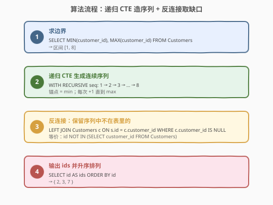
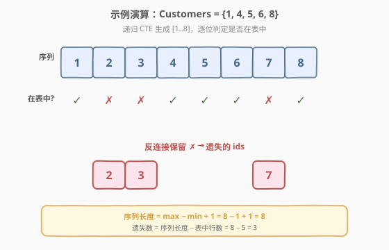

# LeetCode 找到遗失的ID 题解

## 1. 题目概述

- **标题 / 题号**：找到遗失的ID（#1613，medium）
- **链接**：https://leetcode.cn/problems/find-the-missing-ids/
- **难度**：中等
- **标签**：SQL、递归 CTE、序列生成、反连接（LEFT JOIN ... IS NULL）/ NOT IN

**题意**：给定一张 `Customers` 表，其主键 `customer_id` **不连续**。请编写 SQL 查询，找出所有"遗失的 ID"——即位于 `[MIN(customer_id), MAX(customer_id)]` 区间内、但**不存在于表中**的整数。

结果表只含一列 `ids`，按**升序**返回。

**表结构**：

```text
Table: Customers
+---------------+---------+
| Column Name   | Type    |
+---------------+---------+
| customer_id   | int     |  ← 主键
| customer_name | varchar |
+---------------+---------+
```

**示例 1**：

```text
输入：
Customers 表:
+-------------+---------------+
| customer_id | customer_name |
+-------------+---------------+
| 1           | Anna          |
| 4           | Jonathan      |
| 5           | Tom           |
| 6           | John          |
| 8           | Will          |
+-------------+---------------+

输出：
+-----+
| ids |
+-----+
| 2   |
| 3   |
| 7   |
+-----+
```

**解释**：

| 区间 | MIN | MAX | 连续区间 | 已存在 | 遗失 |
|------|-----|-----|----------|--------|------|
| [1, 8] | 1 | 8 | {1,2,3,4,5,6,7,8} | {1,4,5,6,8} | {2,3,7} |

**约束**：

- `customer_id` 是 `Customers` 表的主键（非空、唯一）。
- `customer_name` 长度范围 `[1, 100]`。
- 题目为 Plus 会员专享题；返回结果顺序为 `ids` 升序。

> 💡 本题是 SQL **"序列生成 + 反连接"招牌题**——核心难点不在过滤本身，而在**SQL 没有内置的连续整数序列**。要找"缺失"，必须先造出一个完整的参照区间 `[min, max]`，再用反连接剔除已存在的，缺口自然浮现。`WITH RECURSIVE` 是构造该参照区间的标准工具。

## 2. 解题思路

### 2.1 暴力思路：应用层循环

最直觉的过程式思路：在宿主语言里取回所有 `customer_id`，然后从 `min` 到 `max` 逐个比对：

```text
ids = SELECT customer_id FROM Customers
lo, hi = MIN(ids), MAX(ids)
result = [x for x in range(lo, hi+1) if x not in set(ids)]
```

逻辑正确，但**把"集合差集"这层数据库天然擅长的工作甩给了应用层**——既要全量拉取数据，又放弃了 SQL 引擎的索引与谓词下推能力。更关键的是，它**回避了"如何在纯 SQL 中生成连续序列"这一真正考点**。

> ⚠️ 暴力思路的根本问题：**没有正面解决"SQL 如何造序列"**。下文的核心解法用递归 CTE 在数据库内一次性生成区间，再用反连接完成差集——全程一条 SQL，无需往返传输。

### 2.2 核心观察：递归 CTE 造区间 + 反连接取缺口

![核心观察：补全 [min, max] 连续区间，缺口即答案](../images/fmi_concept.svg)

解题分两步，对应两个独立的子问题：

| 子问题 | 工具 | 产出 |
|--------|------|------|
| ① 造出完整的连续参照区间 | `WITH RECURSIVE` 递归 CTE | 序列 `{min, min+1, …, max}` |
| ② 从区间中剔除已存在的 | 反连接 `LEFT JOIN … IS NULL`（或 `NOT IN`） | 缺口 `{2, 3, 7}` |

**递归 CTE 的结构**：

- **锚点成员**（anchor）：`SELECT MIN(customer_id) …` —— 序列的起点。
- **递归成员**（recursive）：`SELECT id + 1 … FROM seq WHERE id < mx` —— 每次加 1，直到抵达 `max`。
- `UNION ALL` 把锚点与每一轮递归结果拼接，最终得到完整区间。

> 💡 **关键技巧：把 `MAX(customer_id)` 一起带进 CTE 行**，而非在递归成员里再写 `WHERE id < (SELECT MAX …)`。后者会让递归的**每一轮**都重新扫描表求 `MAX`（虽多数优化器会缓存，但语义上易误、可读性差）；前者在锚点一次性算好 `mx`，随每一行携带，递归条件退化为简单的 `id < mx`——均摊 $O(1)$。

> ⚠️ **反连接的两种写法与 NULL 陷阱**：
> - `LEFT JOIN Customers c ON s.id = c.customer_id WHERE c.customer_id IS NULL`：通用、不受 NULL 影响，推荐。
> - `id NOT IN (SELECT customer_id FROM Customers)`：仅当子查询结果**不含 NULL** 时安全。本题 `customer_id` 是主键、非空，故两种等价。若列可空，`NOT IN` 遇 NULL 会**整体返回空集**（`x NOT IN (1, NULL)` 恒为 UNKNOWN），此时必须用反连接或 `NOT EXISTS`。

### 2.3 算法流程图



四步流水线：求边界 → 递归生成序列 → 反连接取缺口 → 升序输出。

### 2.4 示例演算



以 `Customers = {1, 4, 5, 6, 8}` 为例：

| 步骤 | 阶段 | 产出 |
|------|------|------|
| ① 求 `MIN/MAX` | 锚点 | `min=1, max=8` |
| ② 递归 +1 | CTE `seq` | `1,2,3,4,5,6,7,8`（共 $8-1+1=8$ 行） |
| ③ 逐位反连接 | `LEFT JOIN … IS NULL` | `1✓ 2✗ 3✗ 4✓ 5✓ 6✓ 7✗ 8✓` → 缺口 `{2,3,7}` |
| ④ 排序输出 | `ORDER BY id` | `ids = 2, 3, 7` |

> 💡 **不变量校验**：序列长度 $= \max - \min + 1 = 8$；遗失数 $=$ 序列长度 $-$ 表中行数 $= 8 - 5 = 3$，与结果 `{2,3,7}` 数量一致。这是手算验证的快速心法。

## 3. 参考代码

### SQL（解法 A：`WITH RECURSIVE` + `LEFT JOIN … IS NULL`，推荐）

```sql
WITH RECURSIVE seq AS (
    SELECT MIN(customer_id) AS id,
           MAX(customer_id) AS mx
    FROM Customers
    UNION ALL
    SELECT id + 1, mx
    FROM seq
    WHERE id < mx
)
SELECT s.id AS ids
FROM seq s
LEFT JOIN Customers c ON s.id = c.customer_id
WHERE c.customer_id IS NULL
ORDER BY s.id;
```

> 💡 **写法要点**：
> - **`WITH RECURSIVE`**：MySQL 8.0+ / PostgreSQL / SQLite 均支持。关键字 `RECURSIVE` 紧跟 `WITH` 之后（MySQL 要求即使只有一个 CTE 也写 `RECURSIVE`）。
> - **锚点** `SELECT MIN(customer_id), MAX(customer_id)`：起点与终点一次求出，`mx` 随行携带。
> - **递归成员** `SELECT id + 1, mx FROM seq WHERE id < mx`：自引用 `seq`，每次 `+1`，抵达 `mx` 即停。
> - **`UNION ALL`**（非 `UNION`）：序列本就无重复，用 `ALL` 省去去重开销。
> - **反连接** `LEFT JOIN … WHERE c.customer_id IS NULL`：保留序列中未匹配到表行的 id，即缺口。
> - ✓ **最推荐**：一次算好边界、通用抗 NULL、可读性最佳。

### SQL（解法 B：`NOT IN`，主键非空时安全）

```sql
WITH RECURSIVE seq AS (
    SELECT MIN(customer_id) AS id,
           MAX(customer_id) AS mx
    FROM Customers
    UNION ALL
    SELECT id + 1, mx FROM seq WHERE id < mx
)
SELECT id AS ids
FROM seq
WHERE id NOT IN (SELECT customer_id FROM Customers)
ORDER BY id;
```

> 💡 **与解法 A 的区别**：用 `NOT IN` 替代反连接，语义更直白（"序列里的 id 不在客户表里"）。**前提**是 `customer_id` 列非空——本题它是主键，天然满足。若该列可空，`NOT IN` 会因 NULL 语义返回空集，必须改用解法 A 或 `NOT EXISTS`。

### SQL（解法 C：`NOT EXISTS`，最通用抗 NULL）

```sql
WITH RECURSIVE seq AS (
    SELECT MIN(customer_id) AS id,
           MAX(customer_id) AS mx
    FROM Customers
    UNION ALL
    SELECT id + 1, mx FROM seq WHERE id < mx
)
SELECT s.id AS ids
FROM seq s
WHERE NOT EXISTS (
    SELECT 1 FROM Customers c WHERE c.customer_id = s.id
)
ORDER BY s.id;
```

> 💡 **`NOT EXISTS` 的优势**：不受子查询 NULL 影响（与 `LEFT JOIN … IS NULL` 同为"半连接反连接"语义），且优化器通常将其优化为与反连接等价的执行计划。三种子查询写法（`NOT IN` / `LEFT JOIN … IS NULL` / `NOT EXISTS`）在主键非空时**结果完全一致**，选哪个看团队风格；面试时点出 NULL 差异即可。

### Python（pandas）

```python
import pandas as pd

def find_missing_ids(customers: pd.DataFrame) -> pd.DataFrame:
    if customers.empty:
        return pd.DataFrame({'ids': pd.Series(dtype=int)})
    lo = customers['customer_id'].min()
    hi = customers['customer_id'].max()
    full = set(range(lo, hi + 1))
    have = set(customers['customer_id'])
    return pd.DataFrame({'ids': sorted(full - have)})
```

> 💡 **pandas 写法要点**：
> - **`range(lo, hi + 1)`**：Python 内置生成连续区间，对应 SQL 的递归 CTE。
> - **集合差集 `full - have`**：一步完成"区间剔除已存在"，对应反连接。
> - **`sorted(...)`**：保证升序输出，对应 `ORDER BY id`。
> - **空表守卫**：`customers.empty` 时 `MIN/MAX` 为 `NaN`，直接返回空 `DataFrame`，避免 `range(NaN, …)` 报错——对应 SQL 中空表导致 `MIN` 为 `NULL` 的边界。

## 4. 复杂度分析

记 $n$ = `Customers` 表行数，$R = \max - \min + 1$ = 连续区间长度，$k$ = 遗失 ID 数（输出大小）。

| 维度 | 复杂度 | 说明 |
|------|--------|------|
| 时间复杂度 | $O(R \log n + R \log R)$ | 递归 CTE 生成 $R$ 行 $O(R)$；反连接在 `customer_id` 主键索引上每行 $O(\log n)$ 共 $O(R \log n)$；最终 `ORDER BY` $O(R \log R)$（序列已有序时优化器可省） |
| 空间复杂度 | $O(R + k)$ | CTE 物化 $R$ 行；输出结果集 $k$ 行 |

> ⚠️ **递归深度**：MySQL 对递归 CTE 默认有 `cte_max_recursion_depth = 1000` 的限制；PostgreSQL 无硬上限但受 `work_mem` 约束。若区间 $R$ 很大（如 `max - min` 达百万级），需调大 `cte_max_recursion_depth`，或改用预生成的 `numbers` 辅助表一次性 `JOIN`——见第 5 节扩展。

> 💡 **`NOT IN` vs `LEFT JOIN … IS NULL` 的性能**：在 `customer_id` 为主键（有 B+ 树索引）时，优化器将三种写法都编译为**半连接（Semi-Join）反连接**，执行计划几乎相同。差异主要在 NULL 语义与可读性，而非性能。

## 5. 扩展：超长区间与"数字辅助表"

当 `max - min` 极大（百万级），递归 CTE 的深度与物化成本变高。工程上常用一张**预生成的数字辅助表** `numbers(n)`（一次性建好 0…N），用静态 `JOIN` 替代递归：

```sql
-- 假设已有辅助表 numbers(n INT PRIMARY KEY)，覆盖足够大的范围
SELECT n AS ids
FROM numbers n
CROSS JOIN (SELECT MIN(customer_id) AS lo, MAX(customer_id) AS hi FROM Customers) b
WHERE n.n BETWEEN b.lo AND b.hi
  AND n.n NOT IN (SELECT customer_id FROM Customers)
ORDER BY n.n;
```

> 💡 **辅助表 vs 递归 CTE**：辅助表是"空间换时间"——预存序列，查询时纯索引扫描，无递归开销，适合高频查询；递归 CTE 是"按需生成"——无需预建表、范围精确到 `[min,max]`，适合一次性查询或区间较小的场景。面试中先给递归 CTE（体现对 SQL 标准的掌握），再点出辅助表作为大区间的工程优化，是加分路径。

## 6. 面试要点

1. **为什么不能直接用 `WHERE` 过滤出缺失的 ID？**

   > `WHERE` 只能在**已有行**上过滤。缺失的 ID 根本不在 `Customers` 表里，没有行可供过滤——必须先**造出**完整的参照区间，再剔除已存在的。"造序列"是本题的核心考点，`WHERE` 无法替代。

2. **递归 CTE 的锚点和递归成员分别是什么？终止条件如何设置？**

   > 锚点 = `SELECT MIN(customer_id), MAX(customer_id) FROM Customers`，给出起点 `min` 与终点 `mx`；递归成员 = `SELECT id + 1, mx FROM seq WHERE id < mx`，自引用上一轮结果加 1。终止条件 `id < mx` 为假（即 `id == mx`）时不再生成新行，递归自然结束。`UNION ALL` 拼接所有轮次得到 `[min, max]` 完整序列。

3. **`NOT IN`、`LEFT JOIN … IS NULL`、`NOT EXISTS` 三者有何区别？**

   > - **`NOT IN (subquery)`**：子查询结果含 `NULL` 时整体返回空集（`x NOT IN (1, NULL)` 恒为 UNKNOWN）。仅当列非空时安全——本题 `customer_id` 是主键，可用。
   > - **`LEFT JOIN … WHERE c.id IS NULL`**：反连接，不受 NULL 影响，最通用。
   > - **`NOT EXISTS (SELECT 1 … WHERE c.id = s.id)`**：半连接反连接，同样抗 NULL，优化器常编译为与反连接等价的计划。
   > 三者在主键非空时结果一致；区别在 NULL 语义与可读性。面试首选 `LEFT JOIN … IS NULL` 或 `NOT EXISTS`。

4. **为什么把 `MAX(customer_id)` 带进 CTE 行而不是在递归里重算？**

   > 若递归成员写 `WHERE id < (SELECT MAX(customer_id) FROM Customers)`，语义上每一轮递归都要重新求 `MAX`（虽然多数优化器会缓存，但不可依赖）。把 `mx` 在锚点一次求好、随行携带，递归条件退化为 `id < mx` 的纯整数比较，均摊 $O(1)$，既高效又清晰。

5. **空 `Customers` 表会怎样？如何处理？**

   > 空表时 `MIN/MAX` 返回 `NULL`，锚点产生一行 `(NULL, NULL)`，递归条件 `NULL < NULL` 为 UNKNOWN 不生成新行，但锚点那行 `NULL` 会进入最终查询，可能输出一个 `ids = NULL` 的脏行。正确做法是在最外层加 `WHERE s.id IS NOT NULL` 守卫，或在 pandas 版本里先判 `empty` 直接返回空集。

6. **区间之外的 ID（比 `min` 更小或比 `max` 更大）算遗失吗？**

   > 不算。题目明确只关心 `[MIN(customer_id), MAX(customer_id)]` 之间的缺口。`min` 之前、`max` 之后没有"参照系"——它们既无上界也无下界，无法定义"缺失"。递归 CTE 的 `[min, max]` 闭区间正是这一语义的精确表达。

## 同类练习题

| # | 题目 | 与本题的关联 |
|---|------|-------------|
| 183 | [从不订购的客户](https://leetcode.cn/problems/customers-who-never-order/) | 反连接 `LEFT JOIN … IS NULL` 招牌题，对照本题反连接取缺口，体会"找不存在"的通用范式 |
| 1581 | [访问却未下单的顾客](https://leetcode.cn/problems/customer-who-visited-but-did-not-make-any-transactions/) | 反连接找"未下单"的访问记录，同为 `LEFT JOIN … IS NULL`，巩固反连接骨架 |
| 1965 | [失踪信息](https://leetcode.cn/problems/employees-with-missing-information/) | `UNION` 找缺失信息的员工行，同为"找缺失"主题，对照"行级缺失"与"ID 级缺失" |
| 180 | [连续出现的数字](https://leetcode.cn/problems/consecutive-numbers/) | 自连接找连续 `id`，对照本题"造连续序列"的逆向——一个用序列找缺口，一个用连续性找模式 |
| 178 | [分数排名](https://leetcode.cn/problems/rank-scores/) | 窗口函数 / 自连接生成名次序列，对照"SQL 中如何生成序列"的另一类应用 |
