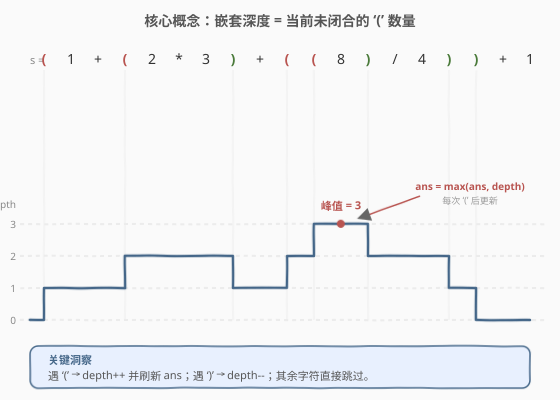
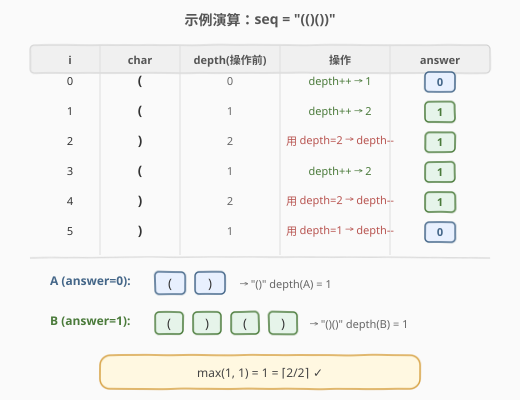

# 括号嵌套的最大深度

- **题目名称**：括号嵌套的最大深度
- **链接**：[1614. 括号嵌套的最大深度](https://leetcode.cn/problems/maximum-nesting-depth-of-the-parentheses/)
- **难度**：简单
- **标签**：栈、字符串

## 1. 题目概述

给定一个**有效括号字符串**（VPS）`s`，返回该字符串的**嵌套深度**。其中 `s` 由数字 `0-9` 与运算符 `+ - * /`、括号 `( )` 组成，括号本身保证合法配对。

有效括号字符串（VPS）与深度的递归定义：

- 空串 `""`，或单个非括号字符 `C`，都是 VPS，深度为 `0`；
- 若 `A`、`B` 是 VPS，则 `AB`（拼接）也是 VPS，深度为 $\max(\text{depth}(A), \text{depth}(B))$；
- 若 `A` 是 VPS，则 `(A)` 是 VPS，深度为 $\text{depth}(A) + 1$。

> 💡 直觉：从左到右扫描，**当前还没闭合的 `(` 个数**就是此刻的嵌套深度；整个过程深度的最大值即为答案。数字与运算符只是"装饰"，不影响深度。

**示例 1**：

```text
输入：s = "(1+(2*3)+((8)/4))+1"
输出：3
解释：数字 8 被三层括号包裹，是最深的位置。
```

**示例 2**：

```text
输入：s = "(1)+((2))+(((3)))"
输出：3
解释：数字 3 被三层括号包裹。
```

**示例 3**：

```text
输入：s = "1+(2*3)/(2-1)"
输出：1
解释：最深只有一层括号。
```

**示例 4**：

```text
输入：s = "1"
输出：0
解释：没有括号，深度为 0。
```

**约束条件**：

- `1 <= s.length <= 100`
- `s` 由数字 `0-9` 和 `+ - * / ( )` 组成
- `s` 是有效括号字符串

## 2. 解题思路

### 2.1 暴力思路：递归解析 VPS

严格按照 VPS 的递归定义写一个解析器：识别 `(A)` 形式时递归求 `A` 的深度再加 1，识别 `AB` 拼接时取两侧深度的最大值。正确但实现繁琐，且需要处理子串切分与括号匹配定位，时间空间都偏高——**这道题根本不需要把结构真正解析出来**。

### 2.2 核心观察：单趟扫描 + 计数器



关键观察：**嵌套深度 ≡ 此刻尚未闭合的 `(` 个数**。

- 遇到 `(`：深度 `+1`（打开一层嵌套），并顺手刷新答案 `ans = max(ans, depth)`；
- 遇到 `)`：深度 `-1`（闭合一层嵌套）；
- 遇到数字 / 运算符：什么都不做。

由于括号保证合法，扫描过程中 `depth` 永远非负，且最终回到 `0`。我们**只关心它在上升瞬间能达到的最大值**，因此无需栈、无需递归——一个计数器足矣。

> ⚠️ 为什么 `ans` 只在 `(` 时刷新？因为深度只在 `(` 处上升，最大值必然出现在某个 `(` 处。在 `)` 或其他字符处刷新虽然不影响正确性（值没变大），但纯属多余操作。

### 2.3 算法流程图


```
1. depth = 0, ans = 0
2. 逐字符扫描 s：
   a. c == '(' → depth++, ans = max(ans, depth)
   b. c == ')' → depth--
   c. 其他      → 跳过
3. 返回 ans
```

### 2.4 示例演算



以 `s = "(1+(2*3)+((8)/4))+1"`（示例 1）为例，只列出括号事件：

| 序号 | 字符 | 动作 | depth（处理后） | ans |
|------|------|------|-----------------|-----|
| 1 | `(` | depth++ | 1 | 1 |
| 2 | `(` | depth++ | 2 | 2 |
| 3 | `)` | depth-- | 1 | 2 |
| 4 | `(` | depth++ | 2 | 2 |
| 5 | `(` | depth++ | **3** | **3** ← 峰值 |
| 6 | `)` | depth-- | 2 | 3 |
| 7 | `)` | depth-- | 1 | 3 |
| 8 | `)` | depth-- | 0 | 3 |

数字 `1 2 3 8 4 1` 与运算符 `+ * + / +` 全部跳过。扫描结束返回 `ans = 3` ✓。

## 3. 参考代码

### C++

```cpp
class Solution {
public:
    int maxDepth(string s) {
        int depth = 0, ans = 0;
        for (char c : s) {
            if (c == '(') {
                ++depth;
                ans = max(ans, depth);
            } else if (c == ')') {
                --depth;
            }
        }
        return ans;
    }
};
```

### Python

```python
class Solution:
    def maxDepth(self, s: str) -> int:
        depth = ans = 0
        for c in s:
            if c == '(':
                depth += 1
                ans = max(ans, depth)
            elif c == ')':
                depth -= 1
        return ans
```

> 💡 由于题目保证 `s` 是有效括号串，`depth` 不会变为负数也无需校验合法性。若输入可能非法，则需在 `)` 分支加 `depth >= 0` 的校验（本题不需要）。

## 4. 复杂度分析

| 维度 | 复杂度 | 说明 |
|------|--------|------|
| 时间复杂度 | $O(n)$ | 单趟扫描，每个字符 `O(1)` 分支判断 |
| 空间复杂度 | $O(1)$ | 仅用 `depth`、`ans` 两个整型变量 |

> 💡 对 $n = 100$ 的约束，$O(n)$ 远远够用。即便 $n$ 放大到 $10^5$，本解法仍是最优。

## 5. 扩展：用栈实现的等价写法

计数器本质上是"退化的栈"——因为本题只有一种括号 `()`，栈里存的全是 `(`，**栈的 `size()` 就等于 `depth`**。用显式栈实现逻辑等价，但空间升为 $O(n)$，面试中作为"也能用栈想"的对照即可：

```cpp
class Solution {
public:
    int maxDepth(string s) {
        stack<char> st;
        int ans = 0;
        for (char c : s) {
            if (c == '(') {
                st.push('(');
                ans = max(ans, (int)st.size());
            } else if (c == ')') {
                st.pop();
            }
        }
        return ans;
    }
};
```

> 💡 **何时退化计数器、何时保留栈？** 只有一种括号且只关心"个数/深度"→计数器；多种括号（`()[]{}`）需要类型匹配→必须用栈（见 [20. 有效括号](../0001-0100/20_有效括号.md)）。本题属于前者，计数器是更优解。

## 6. 面试要点

**Q1：为什么不需要真正解析表达式结构？**
> 深度的递归定义里，`(A)` 贡献 `+1`、`AB` 取 `max`。但从左到右扫描时，"当前未闭合的 `(` 个数"恰好同时编码了这两条规则——遇到 `(` 加 1、遇到 `)` 减 1，扫描轨迹的峰值就是整体最大嵌套深度。无需关心 `A`、`B` 的边界。

**Q2：`ans` 什么时候刷新？为什么不在 `)` 处刷新？**
> 只在 `(` 处刷新。深度只在 `(` 时上升，最大值必然出现在某个 `(` 处；`)` 处深度下降，不可能产生新最大值。在 `)` 处刷新虽不致错（值没变大），但属冗余。

**Q3：计数器法与栈法的关系？**
> 计数器是栈的退化形式。本题只有 `(` 一种左括号，栈中元素全部相同，`stack.size()` 即 `depth`。退化为单变量后空间从 $O(n)$ 降到 $O(1)$。

**Q4：如果输入括号可能不合法怎么办？**
> 需在 `)` 分支校验 `depth > 0`（或栈非空）才能 `--`/`pop`，否则返回非法；扫完还需确认 `depth == 0`。本题约束保证合法，故省略。

**Q5：和"表达式求值"类题目的区别？**
> 表达式求值（如 [224. 基本计算器](../0201-0300/224_基本计算器.md)、[227. 基本计算器 II](../0201-0300/227_基本计算器II.md)）需要真正按运算符计算结果，必须用栈维护运算符与操作数；本题只问"括号嵌几层"，运算符和数字都是干扰项，直接跳过即可。

## 7. 同类练习题

- [20. 有效括号](https://leetcode.cn/problems/valid-parentheses/)（[题解](../0001-0100/20_有效括号.md)）：多类型括号匹配的栈模板，本题是其"只问深度"的退化版
- [1541. 平衡括号字符串的最少插入次数](https://leetcode.cn/problems/minimum-insertions-to-balance-a-parentheses-string/)（[题解](../1501-1600/1541_平衡括号字符串的最少插入次数.md)）：同样是单趟扫描 + 计数器处理括号，但规则升级为 1:2 配对并求最少插入
- [921. 使括号有效的最少添加](https://leetcode.cn/problems/minimum-add-to-make-parentheses-valid/)：1:1 配对的最少插入，计数器贪心的入门版
- [1111. 有效括号的嵌套深度](https://leetcode.cn/problems/maximum-nesting-depth-of-two-valid-parentheses-strings/)：把一组括号按嵌套深度分成两组各自合法，是本题"求深度"的下一步应用
- [224. 基本计算器](https://leetcode.cn/problems/basic-calculator/)（[题解](../0201-0300/224_基本计算器.md)）：需要用栈真正处理括号与运算，对比理解"何时该用栈、何时计数器即可"
