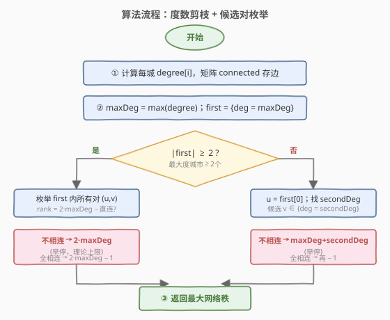
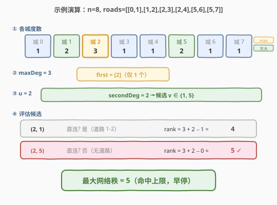

# LeetCode 最大网络秩 题解

## 1. 题目概述

- **标题 / 题号**：最大网络秩（#1615，medium）
- **链接**：https://leetcode.cn/problems/maximal-network-rank/
- **难度**：中等
- **标签**：图、贪心、枚举

**题意**：给定 `n` 座城市与若干双向道路 `roads`，每条 `roads[i] = [ai, bi]` 表示城市 `ai` 与 `bi` 之间有一条双向道路。两座不同城市 `(u, v)` 的**网络秩**定义为与这两座城市直接相连的道路总数；若 `u`、`v` 之间本身有道路，该道路只算**一次**。返回所有不同城市对中**最大的网络秩**。

> 💡 直觉：城市对 `(u, v)` 的网络秩 ≈ `degree[u] + degree[v]`，只是当 `u`、`v` 直连时要把它们之间的那条边从"算两次"修正为"算一次"，即减 1。

**示例 1**：

```text
输入：n = 4, roads = [[0,1],[0,3],[1,2],[1,3]]
输出：4
解释：城市 0 和 1 的网络秩为 4（与 0 或 1 相连的道路共 4 条，0↔1 那条只算一次）。
```

**示例 2**：

```text
输入：n = 5, roads = [[0,1],[0,3],[1,2],[1,3],[2,3],[2,4]]
输出：5
解释：城市 1 和 2 的网络秩为 5。
```

**示例 3**：

```text
输入：n = 8, roads = [[0,1],[1,2],[2,3],[2,4],[5,6],[5,7]]
输出：5
解释：城市 2 和 5 的网络秩为 5（图不必连通）。
```

**约束**：

- `2 <= n <= 100`
- `0 <= roads.length <= n * (n - 1) / 2`
- `0 <= ai, bi <= n - 1`，`ai != bi`
- 每对城市之间最多一条道路

## 2. 解题思路

### 2.1 暴力思路：枚举所有城市对

最直接的做法：预处理每座城市的**度数** `degree[i]`（与之相连的道路数），并用一个邻接矩阵 / 哈希集合记录"哪两座城市直连"，然后枚举所有 $\binom{n}{2}$ 个城市对 `(u, v)`，按公式

$$\text{rank}(u, v) = \text{degree}[u] + \text{degree}[v] - \mathbf{1}[\,u \leftrightarrow v\,]$$

逐个计算取最大值。$n \le 100$ 时 $\binom{n}{2} \le 4950$，完全可接受。

> ⚠️ 关键细节：直连的那条边在 `degree[u]` 和 `degree[v]` 里各被算了一次，共两次；但题目要求只算一次，所以直连时要减 1。

### 2.2 核心观察：最大秩必来自度数最高的城市

![核心概念：网络秩 = deg(u)+deg(v)−[u↔v 直连?]](../images/maxnetrank_concept.svg)

暴力法虽然够快，但有一个**关键剪枝观察**可以让候选对大幅减少：

**最大网络秩一定由度数最大的城市参与。** 理由很简单——若某城市对的度数和为 $S$，而存在另一座城市度数更高，把它替换进来度数和只会更大（至多再减 1 的直连修正，不会让总和下降超过 1）。

因此只需关注两类候选：

1. **度数等于最大值 `maxDeg` 的城市集合 `first`**：
   - 若 `|first| >= 2`：只在 `first` 内部两两配对。每对的秩为 $2 \cdot \text{maxDeg}$ 或 $2 \cdot \text{maxDeg} - 1$（取决于是否直连）。只要找到一对**不直连**的，答案就是 $2 \cdot \text{maxDeg}$（理论上限，立即可停）；若 `first` 内部所有对都直连，答案为 $2 \cdot \text{maxDeg} - 1$。
   - 若 `|first| == 1`（唯一最大度城市 `u`）：`u` 必在最优对中，搭档应取**次大度数** `secondDeg` 的城市，秩为 $\text{maxDeg} + \text{secondDeg}$ 或 $-1$。
2. **次大度数城市**：仅在 `|first| == 1` 时需要考察。

> 💡 为什么 `|first| >= 2` 时不需要看次大度城市？因为 $\text{secondDeg} \le \text{maxDeg} - 1$，所以 $\text{maxDeg} + \text{secondDeg} \le 2 \cdot \text{maxDeg} - 1$；而 `first` 内部不直连对就能达到 $2 \cdot \text{maxDeg}$，即便全部直连也有 $2 \cdot \text{maxDeg} - 1$，已不劣于任何含次大度城市的对。

### 2.3 算法流程图



```text
1. 计算 degree[i] 与直连关系 connected[u][v]
2. maxDeg = max(degree)；first = {i : degree[i] == maxDeg}
3. 若 |first| >= 2：
     枚举 first 内所有对 (u,v)
       rank = 2*maxDeg - (connected[u][v] ? 1 : 0)
       若 rank == 2*maxDeg → 立即返回（无法更优）
   否则 (|first| == 1)：
     u = first[0]；secondDeg = max(degree[v], v != u)
     枚举 degree[v] == secondDeg 的 v：
       rank = maxDeg + secondDeg - (connected[u][v] ? 1 : 0)
       若 rank == maxDeg + secondDeg → 立即返回
4. 返回最大秩
```

### 2.4 示例演算



以**示例 3**（`n=8, roads=[[0,1],[1,2],[2,3],[2,4],[5,6],[5,7]]`）为例，图分为两个连通分量：

| 步骤 | 内容 | 结果 |
|------|------|------|
| ① 算度数 | 逐条边累加 | `deg = [1,2,3,1,1,2,1,1]` |
| ② 找 maxDeg | 最大度数 | `maxDeg = 3`，`first = [2]` |
| ③ 仅 1 个 max | `u = 2`，找次大度 | `secondDeg = 2`，候选 `v ∈ {1, 5}` |
| ④ 评估 (2,1) | `1↔2` 直连 | `3 + 2 − 1 = 4` |
| ④ 评估 (2,5) | `2↔5` 不直连 | `3 + 2 − 0 = 5` ✓ |

`5` 即为理论可达上界 $\text{maxDeg} + \text{secondDeg}$，立即返回。最终答案 **5** ✓。

## 3. 参考代码

### C++

```cpp
class Solution {
public:
    int maximalNetworkRank(int n, vector<vector<int>>& roads) {
        vector<int> degree(n, 0);
        vector<vector<bool>> connected(n, vector<bool>(n, false));
        for (auto& r : roads) {
            int u = r[0], v = r[1];
            degree[u]++; degree[v]++;
            connected[u][v] = connected[v][u] = true;
        }
        int maxDeg = *max_element(degree.begin(), degree.end());
        vector<int> first;
        for (int i = 0; i < n; i++)
            if (degree[i] == maxDeg) first.push_back(i);

        int ans = 0;
        if (first.size() >= 2) {
            for (int i = 0; i < (int)first.size(); i++)
                for (int j = i + 1; j < (int)first.size(); j++) {
                    int u = first[i], v = first[j];
                    int rank = 2 * maxDeg - (connected[u][v] ? 1 : 0);
                    ans = max(ans, rank);
                    if (ans == 2 * maxDeg) return ans;
                }
        } else {
            int u = first[0];
            int secondDeg = 0;
            for (int i = 0; i < n; i++)
                if (i != u) secondDeg = max(secondDeg, degree[i]);
            for (int v = 0; v < n; v++) {
                if (v == u || degree[v] != secondDeg) continue;
                int rank = maxDeg + secondDeg - (connected[u][v] ? 1 : 0);
                ans = max(ans, rank);
                if (ans == maxDeg + secondDeg) return ans;
            }
        }
        return ans;
    }
};
```

### Python

```python
class Solution:
    def maximalNetworkRank(self, n: int, roads: List[List[int]]) -> int:
        degree = [0] * n
        connected = [[False] * n for _ in range(n)]
        for u, v in roads:
            degree[u] += 1
            degree[v] += 1
            connected[u][v] = connected[v][u] = True

        max_deg = max(degree)
        first = [i for i in range(n) if degree[i] == max_deg]
        ans = 0
        if len(first) >= 2:
            for i in range(len(first)):
                for j in range(i + 1, len(first)):
                    u, v = first[i], first[j]
                    rank = 2 * max_deg - (1 if connected[u][v] else 0)
                    ans = max(ans, rank)
                    if ans == 2 * max_deg:
                        return ans
        else:
            u = first[0]
            second_deg = max(degree[i] for i in range(n) if i != u)
            for v in range(n):
                if v == u or degree[v] != second_deg:
                    continue
                rank = max_deg + second_deg - (1 if connected[u][v] else 0)
                ans = max(ans, rank)
                if ans == max_deg + second_deg:
                    return ans
        return ans
```

> 💡 直连判定用了 $n \times n$ 的 `bool` 矩阵，$n \le 100$ 时仅约 10 KB，查询 $O(1)$ 且实现简洁。若 $n$ 很大而边数很少，可改用 `unordered_set` 邻接表以省空间。

## 4. 复杂度分析

| 维度 | 复杂度 | 说明 |
|------|--------|------|
| 时间复杂度 | $O(n + m + k^2)$ | 建度数与邻接 $O(n+m)$；$k = |\text{first}|$ 为最大度城市数，枚举候选对 $O(k^2)$；最坏 $k = n$（所有城市同度）退化为 $O(n^2)$ |
| 空间复杂度 | $O(n^2)$ | `connected` 矩阵；改用哈希集合可降至 $O(n + m)$ |

> 💡 暴力枚举法的时间也是 $O(n^2 + m)$，与剪枝法最坏同阶。剪枝的优势在 $k \ll n$（最大度城市很少）时体现——常见情况下 $k$ 只有 1～2 个，近乎 $O(n + m)$。$n \le 100$ 时两种写法性能无实质差异，按面试偏好选择即可。

## 5. 扩展：暴力枚举的等价写法

$O(n^2)$ 的暴力法实现更短、常数更小，$n \le 100$ 下完全够用。若面试官不要求剪枝，直接交这版最稳妥：

```cpp
class Solution {
public:
    int maximalNetworkRank(int n, vector<vector<int>>& roads) {
        vector<int> degree(n, 0);
        vector<vector<bool>> connected(n, vector<bool>(n, false));
        for (auto& r : roads) {
            degree[r[0]]++; degree[r[1]]++;
            connected[r[0]][r[1]] = connected[r[1]][r[0]] = true;
        }
        int ans = 0;
        for (int i = 0; i < n; i++)
            for (int j = i + 1; j < n; j++)
                ans = max(ans, degree[i] + degree[j] - (connected[i][j] ? 1 : 0));
        return ans;
    }
};
```

> 💡 **何时用剪枝版？** 当 $n$ 放大到 $10^4$ 甚至更大、而最大度城市很少时，$O(n^2)$ 会超时，剪枝版可在 $O(n + m)$ 内解决。本题约束 $n \le 100$，两版均可。

## 6. 面试要点

**Q1：为什么直连的城市对要减 1？**
> `degree[u]` 和 `degree[v]` 各把 `u↔v` 这条边算了一次，合计两次；题目要求该边只算一次，故直连时减 1。不直连时无需修正。

**Q2：为什么最大秩一定由最大度城市参与？**
> 反证：若最优对 `(a, b)` 中 `degree[a] < maxDeg`，存在城市 `c` 使 `degree[c] = maxDeg > degree[a]`。把 `a` 换成 `c` 后度数和至少 $+1$；即便 `c↔b` 直连需减 1，净变化也 $\ge 0$，不会让秩变小。故总存在一个含最大度城市的最优对。

**Q3：`|first| >= 2` 时为什么不用看次大度城市？**
> $\text{secondDeg} \le \text{maxDeg} - 1$，所以 $\text{maxDeg} + \text{secondDeg} \le 2 \cdot \text{maxDeg} - 1$；而 `first` 内部即使全直连也有 $2 \cdot \text{maxDeg} - 1$，不劣于任何含次大度城市的对。若 `first` 内有不直连对，直接达 $2 \cdot \text{maxDeg}$ 上界。

**Q4：早停条件 `ans == 2 * maxDeg` 为什么安全？**
> $2 \cdot \text{maxDeg}$ 是所有城市对秩的理论上限（两座城市度数都不超过 `maxDeg`，减项最多 1 但此时不减即已达上界）。一旦命中即可返回，不可能有更大值。

**Q5：邻接矩阵 vs 哈希集合怎么选？**
> $n$ 小（$\le 500$）用 `bool` 矩阵，查询快、实现简；$n$ 大而边稀疏时用 `unordered_set`，空间 $O(n+m)$ 更省。本题 $n \le 100$，矩阵首选。

## 同类练习题

| # | 题目 | 与本题的关联 |
|---|------|-------------|
| 1791 | [找出星型图的中心节点](https://leetcode.cn/problems/find-center-of-star-graph/) | 同样靠度数观察——星型图中心度数为 $n-1$，一次扫描即定 |
| 1557 | [可以到达所有节点的最少顶点数目](https://leetcode.cn/problems/minimum-number-of-vertices-to-reach-all-nodes/)（[题解](../1501-1600/1557_可以到达所有节点的最少顶点数目.md)） | 用入度为 0 来选最小起点集合，度数思维在 DAG 上的应用 |
| 2316 | [统计无向图中无法互相到达的点对数](https://leetcode.cn/problems/count-unreachable-pairs-of-nodes-in-an-undirected-graph/) | 无向图连通分量计数，与本题同属"图结构统计"类 |
| 1584 | [连接所有点的最小费用](https://leetcode.cn/problems/min-cost-to-connect-all-points/)（[题解](../1501-1600/1584_连接所有点的最小费用.md)） | 图论最小生成树，对比理解"度数/邻接"与"边权/连通"两类图问题 |
| 1971 | [寻找图中是否存在路径](https://leetcode.cn/problems/find-if-path-exists-in-graph/) | 图遍历基础，建立对邻接表 / BFS / 并查集的直觉 |
