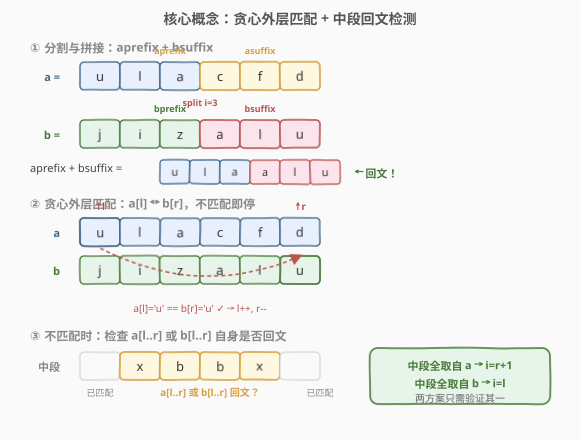
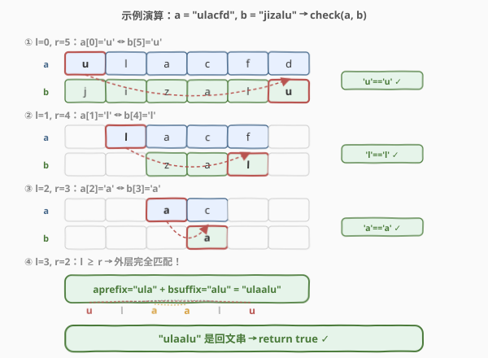

# LeetCode 分割两个字符串得到回文串 题解

## 1. 题目概述

- **标题 / 题号**：分割两个字符串得到回文串（#1616，medium）
- **链接**：https://leetcode.cn/problems/split-two-strings-to-make-palindrome/
- **难度**：中等
- **标签**：双指针、贪心、字符串、回文

**题意**：给定两个**长度相同**的字符串 `a` 和 `b`，选择一个下标 `i`，将两个字符串在**同一位置**分割：

- `a = aprefix + asuffix`，其中 `aprefix = a[0:i]`，`asuffix = a[i:n]`
- `b = bprefix + bsuffix`，其中 `bprefix = b[0:i]`，`bsuffix = b[i:n]`

判断 `aprefix + bsuffix` **或** `bprefix + asuffix` 能否构成回文串。分割点 `i` 可取 `0` 到 `n`（含两端），即前缀或后缀可以为空。

> 💡 直觉：两个字符串各贡献一段拼成回文——一个贡献"左半"，另一个贡献"右半"。关键是找到那个分割点，使得拼接结果关于中心对称。

**示例 1**：

```text
输入：a = "x", b = "y"
输出：true
解释：单字符本身是回文，取 aprefix="" + bsuffix="y" = "y" 即可。
```

**示例 2**：

```text
输入：a = "xbdef", b = "xecab"
输出：false
```

**示例 3**：

```text
输入：a = "ulacfd", b = "jizalu"
输出：true
解释：在下标 i=3 处分割：
  aprefix = "ula", bsuffix = "alu"
  aprefix + bsuffix = "ulaalu" 是回文串。
```

**约束**：

- `1 <= a.length, b.length <= 10^5`
- `a.length == b.length`
- `a` 和 `b` 只包含小写英文字母

## 2. 解题思路

### 2.1 暴力思路：枚举分割点

对每个分割点 `i ∈ [0, n]`，构造 `aprefix + bsuffix` 和 `bprefix + asuffix`，逐一验证是否回文。共有 $O(n)$ 个分割点，每次验证 $O(n)$，总复杂度 $O(n^2)$，对 $n = 10^5$ 的数据量会超时。

### 2.2 核心观察：贪心外层匹配 + 中段回文检测



关键观察：**回文串的对称性决定了外层字符必须一一配对**。对于 `aprefix + bsuffix`，其第 `l` 位（来自 `a`）必须等于第 `r` 位（来自 `b` 的对称位置），即 `a[l] == b[n-1-l]`。

因此采用**双指针贪心**：

1. 令 `l = 0`，`r = n - 1`，从两端向内匹配 `a[l]` 与 `b[r]`。
2. 只要 `a[l] == b[r]`，就 `l++`、`r--`，继续匹配。
3. 当 `a[l] != b[r]` **或** `l >= r` 时停止：
   - 若 `l >= r`：外层已完全匹配，整体就是回文，返回 `true`。
   - 若 `a[l] != b[r]`：剩余中段 `[l, r]` 必须全部取自 `a` 或全部取自 `b`（分割点落在 `l` 或 `r+1` 处），只需检查 `a[l..r]` 或 `b[l..r]` **自身是否为回文串**。

> ⚠️ 为什么中段不能"a、b 各取一部分"？假设分割点 `i` 落在 `(l, r+1)` 开区间内，则中段为 `a[l..i-1] + b[i..r]`，其首字符 `a[l]` 必须等于尾字符 `b[r]`——但贪心循环正是因为 `a[l] != b[r]` 才停下的，矛盾。因此中段只能**全取 a**（`i = r+1`）或**全取 b**（`i = l`）。

对 `aprefix + bsuffix` 调用一次 `check(a, b)`，对 `bprefix + asuffix` 调用一次 `check(b, a)`，两者取或即为答案。

### 2.3 算法流程图


```
checkPalindromeFormation(a, b):
  1. return check(a, b) OR check(b, a)

check(s₁, s₂):
  1. l = 0, r = n − 1
  2. while l < r and s₁[l] == s₂[r]:
       l++, r−−
  3. if l >= r: return true
  4. return isPalindrome(s₁, l, r) OR isPalindrome(s₂, l, r)

isPalindrome(s, l, r):
  1. while l < r:
       if s[l] != s[r]: return false
       l++, r−−
  2. return true
```

### 2.4 示例演算



以 `a = "ulacfd"`，`b = "jizalu"`（示例 3）为例，调用 `check(a, b)`：

| 步骤 | l | r | a[l] | b[r] | 匹配？ | 动作 |
|------|---|---|------|------|--------|------|
| ① | 0 | 5 | `u` | `u` | ✓ | l++, r−− |
| ② | 1 | 4 | `l` | `l` | ✓ | l++, r−− |
| ③ | 2 | 3 | `a` | `a` | ✓ | l++, r−− |
| ④ | 3 | 2 | — | — | l ≥ r | 返回 true |

外层完全匹配，分割点 `i = 3`：`aprefix = "ula"`，`bsuffix = "alu"`，拼接得 `"ulaalu"`，首尾对称，是回文串 ✓。

> 💡 如果 `check(a, b)` 在某步停下且 `a[l] != b[r]`，则需额外检查 `a[l..r]` 或 `b[l..r]` 是否回文。例如 `a = "zabz"`、`b = "zbbz"`：匹配 `a[0]='z' == b[3]='z'` 后，`a[1]='a' != b[2]='b'` 停下，但 `b[1..2] = "bb"` 自身回文，取 `i=1` 得 `"z" + "bbz" = "zbbz"` ✓。

## 3. 参考代码

### C++

```cpp
class Solution {
public:
    bool checkPalindromeFormation(string a, string b) {
        return check(a, b) || check(b, a);
    }

private:
    bool check(const string& a, const string& b) {
        int l = 0, r = a.size() - 1;
        while (l < r && a[l] == b[r]) {
            ++l;
            --r;
        }
        if (l >= r) return true;
        return isPalindrome(a, l, r) || isPalindrome(b, l, r);
    }

    bool isPalindrome(const string& s, int l, int r) {
        while (l < r) {
            if (s[l] != s[r]) return false;
            ++l;
            --r;
        }
        return true;
    }
};
```

### Python

```python
class Solution:
    def checkPalindromeFormation(self, a: str, b: str) -> bool:
        def is_pal(s: str, l: int, r: int) -> bool:
            while l < r:
                if s[l] != s[r]:
                    return False
                l += 1
                r -= 1
            return True

        def check(s1: str, s2: str) -> bool:
            l, r = 0, len(s1) - 1
            while l < r and s1[l] == s2[r]:
                l += 1
                r -= 1
            if l >= r:
                return True
            return is_pal(s1, l, r) or is_pal(s2, l, r)

        return check(a, b) or check(b, a)
```

> 💡 `check(a, b)` 检查 `aprefix + bsuffix`，`check(b, a)` 检查 `bprefix + asuffix`，两者对称。核心函数 `isPalindrome` 是标准的区间回文判定，与 [125. 验证回文串](../0101-0200/125_验证回文串.md) 同源。

## 4. 复杂度分析

| 维度 | 复杂度 | 说明 |
|------|--------|------|
| 时间复杂度 | $O(n)$ | `check` 单趟贪心扫描 $O(n)$，最坏再做两次 `isPalindrome` 各 $O(n)$，总计常数趟 $O(n)$；调用两次 `check` 仍为 $O(n)$ |
| 空间复杂度 | $O(1)$ | 仅用 `l`、`r` 两个指针，原地比较无需额外空间 |

> 💡 对 $n = 10^5$ 的约束，$O(n)$ 远远够用。暴力 $O(n^2)$ 会超时。

## 5. 扩展：与 680 验证回文串 II 的对比

本题与 [680. 验证回文串 II](../0601-0700/680_验证回文串II.md) 共享同一个算法范式——**贪心外层匹配 + 中段容错检测**：

| 维度 | 680 验证回文串 II | 1616 本题 |
|------|-------------------|-----------|
| 问题 | 单串 `s`，最多删 1 个字符能否成回文 | 双串 `a`、`b`，选分割点拼接能否成回文 |
| 外层匹配 | `s[l] == s[r]` | `a[l] == b[r]`（跨串对称） |
| 中段容错 | 删 `s[l]` 或删 `s[r]`，跳过 1 个继续匹配 | 中段全取 `a[l..r]` 或全取 `b[l..r]` |
| 容错次数 | 至多 1 次 | 至多 1 次（切换到单串回文判定） |

二者的本质都是：**回文的对称性约束了外层必须严格匹配，一旦失配只需在"两种容错方案"中验证其一即可**。这种"贪心到失配点 + 局部验证"的模式在回文类题目中非常通用。

## 6. 面试要点

**Q1：为什么贪心匹配到第一个失配点就可以停？后面可能有更优的分割点吗？**
> 回文要求从外到内逐对对称。贪心匹配的每一步都是"必须满足"的约束——如果 `a[l] != b[r]`，则任何包含 `a[l]` 在左、`b[r]` 在右的分割方案都无法构成回文。继续向内匹配没有意义，因为外层已经不满足。唯一的出路是让分割点落在 `[l, r]` 内，使中段全部来自同一个串。

**Q2：为什么中段只需检查 `a[l..r]` 和 `b[l..r]` 两种，而不需要枚举所有分割点？**
> 失配后 `a[l] != b[r]`。若分割点 `i` 严格在 `(l, r+1)` 内，则中段首字符 `a[l]` 和尾字符 `b[r]` 来自不同串且不等，不可能回文。只有 `i = l`（中段全取 `b`）或 `i = r+1`（中段全取 `a`）才可能成立，故只需检查这两种。

**Q3：为什么要调用 `check(a, b)` 和 `check(b, a)` 两次？**
> 题目允许 `aprefix + bsuffix` 或 `bprefix + asuffix` 两种拼接方式。前者是 `a` 贡献左半、`b` 贡献右半，后者反过来。两种方案的对称结构不同，必须分别验证。两次调用各自独立 $O(n)$，总复杂度仍为 $O(n)$。

**Q4：`isPalindrome` 函数能否省掉，复用 `check` 的逻辑？**
> 不能直接复用。`check` 是跨串匹配（`a[l]` 对 `b[r]`），而 `isPalindrome` 是同串匹配（`s[l]` 对 `s[r]`）。但可以将 `isPalindrome` 看作 `check(s, s)` 的特例——当两个参数相同时，贪心外层匹配退化为普通回文判定。

**Q5：如果题目改为"恰好分割成两个非空部分"，算法需要怎么改？**
> 只需限制分割点 `i ∈ [1, n-1]`，排除 `i = 0`（前缀为空）和 `i = n`（后缀为空）两种边界情况。在 `check` 中，若贪心匹配后 `l >= r` 但对应分割点落在边界，则需要回退检查。不过本题允许空串，无需此限制。

## 同类练习题

| # | 题目 | 与本题的关联 |
|---|------|-------------|
| 680 | [验证回文串 II](https://leetcode.cn/problems/valid-palindrome-ii/)（[题解](../0601-0700/680_验证回文串II.md)） | 同范式的鼻祖——贪心外层匹配 + 失配后至多删 1 字符容错，本题是其"双串拼接"变体 |
| 125 | [验证回文串](https://leetcode.cn/problems/valid-palindrome/)（[题解](../0101-0200/125_验证回文串.md)） | 最基础的双指针回文判定，`isPalindrome` 子函数的直接来源 |
| 5 | [最长回文子串](https://leetcode.cn/problems/longest-palindromic-substring/)（[题解](../0001-0100/5_最长回文子串.md)） | 回文类题目的母题，中心扩展法理解回文对称性 |
| 214 | [最短回文串](https://leetcode.cn/problems/shortest-palindrome/)（[题解](../0201-0300/214_最短回文串.md)） | 在字符串前添加字符使其成为回文，KMP 求最长回文前缀，另一种回文构造视角 |
| 131 | [分割回文串](https://leetcode.cn/problems/palindrome-partitioning/)（[题解](../0101-0200/131_分割回文串.md)） | 将字符串分割成若干回文子串，回溯 + 回文判定，对比理解"分割"的不同含义 |
