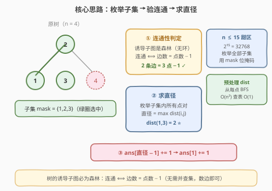
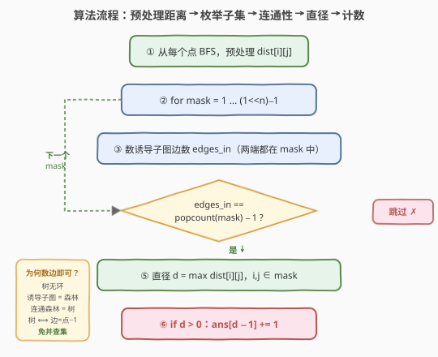
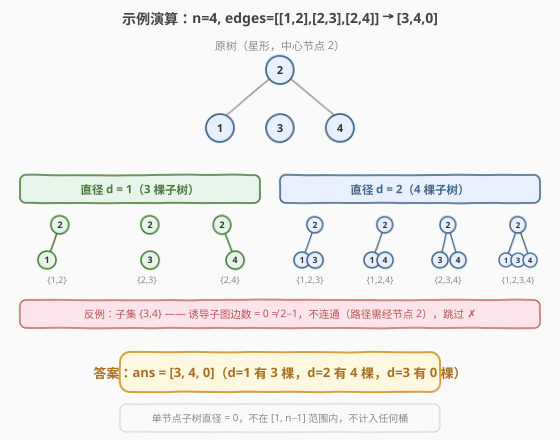

# 统计子树中城市之间最大距离

- **题目名称**：统计子树中城市之间最大距离
- **链接**：[1617. 统计子树中城市之间最大距离](https://leetcode.cn/problems/count-subtrees-with-max-distance-between-cities/)
- **难度**：困难
- **标签**：位运算、状态压缩、树、枚举

## 1. 题目概述

给定 `n` 个城市（编号 `1` 到 `n`）与 `n-1` 条双向边 `edges`，所有城市构成一棵**树**（任意两城市间路径唯一）。一棵**子树**是城市的一个子集，且子集中任意城市之间可以通过**子集内的**其他城市和边互相到达（即诱导子图连通）。

对于 $d$ 从 $1$ 到 $n-1$，求城市间**最大距离**（直径）恰好为 $d$ 的子树数目，返回长度为 $n-1$ 的数组（下标从 1 开始）。两城市间距离 = 它们之间经过的边数。

**示例 1**：

```text
输入：n = 4, edges = [[1,2],[2,3],[2,4]]
输出：[3,4,0]
解释：树形如 2 为中心，连向 1、3、4。
  子树 {1,2}、{2,3}、{2,4} 最大距离为 1（共 3 棵）；
  子树 {1,2,3}、{1,2,4}、{2,3,4}、{1,2,3,4} 最大距离为 2（共 4 棵）；
  不存在最大距离为 3 的子树。
```

**示例 2**：

```text
输入：n = 2, edges = [[1,2]]
输出：[1]
解释：唯一的非平凡子树 {1,2} 最大距离为 1。
```

**示例 3**：

```text
输入：n = 3, edges = [[1,2],[2,3]]
输出：[2,1]
解释：{1,2}、{2,3} 直径为 1；{1,2,3} 直径为 2。
```

**约束条件**：

- `2 <= n <= 15`
- `edges.length == n-1`
- `1 <= ui, vi <= n`，边互不相同，保证是一棵树

> ⚠️ **关键信号**：`n ≤ 15` 是**状压枚举**的标志性范围——$2^{15} = 32768$ 个子集可以全部枚举。配合「子集选/不选」+「树的诱导子图必为森林」的结构，本题天然适合「枚举子集 + 数边判连通 + 查表求直径」的套路。

## 2. 解题思路

### 2.1 暴力思路

枚举城市集合的所有子集（共 $2^n$ 个），对每个子集：

1. 用并查集或 BFS 判断诱导子图是否连通；
2. 若连通，对子集内每个点做 BFS 求最远距离，取最大值作为直径；
3. 按直径分桶计数。

正确但每次判定都要重建图、跑 BFS，常数偏大。能否把「连通判定」和「直径计算」都简化？

### 2.2 核心观察：数边判连通 + 预处理距离表



三个关键观察把暴力优化到清爽的实现：

**观察一：树的诱导子图必为森林（无环）**。树本身无环，从中挑一些点和「两端都在子集里」的边，得到的诱导子图自然也无环——它是森林。而**森林连通 ⟺ 它是一棵树 ⟺ 边数 = 点数 − 1**。因此只需「数一下诱导子图里有几条边」，与 `popcount(mask) − 1` 比较即可判定连通，**无需并查集、无需 BFS 重建图**。

**观察二：距离可以预处理成表**。先从每个节点出发做一次 BFS，得到全源最短距离矩阵 `dist[i][j]`（树是无权图，BFS 即最短路）。之后查询任意两点距离都是 $O(1)$ 查表。

**观察三：直径 = 子集内最大点对距离**。子集（子树）的直径就是其中距离最远的两个节点间的距离。枚举子集内所有点对取 `max` 即可。

> 💡 **为何数边比并查集更优？** 树的诱导子图无环这条性质是「免费」的——它保证 `edges_in ≤ nodes_in − 1` 恒成立，于是 `edges_in == nodes_in − 1` 就是连通的充要条件。并查集要建并查集、要 union、要查根；数边只需扫一遍 `edges` 数组统计两端都在 `mask` 中的边数，逻辑极简。

### 2.3 算法流程图



```text
1. 建邻接表；从每个节点 i 做 BFS，填 dist[i][j] 全源距离矩阵
2. for mask = 1 .. (1<<n) - 1:
   a. edges_in = 统计 edges 中两端都在 mask 里的边数
   b. nodes_in = popcount(mask)
   c. if edges_in != nodes_in - 1: continue   // 不连通，跳过
   d. d = 0
      for i, j in mask (i < j): d = max(d, dist[i][j])
   e. if d > 0: ans[d - 1] += 1               // 单点子树 d=0 不计入
3. 返回 ans
```

> ⚠️ **为何 `d > 0` 才计数？** 单节点子树（`nodes_in == 1`）也满足 `edges_in == 0 == 1 − 1`，是「连通」的，但其直径为 0，不在 $[1, n-1]$ 范围内，不参与任何桶的计数。用 `d > 0` 自然过滤。

### 2.4 示例演算



以示例 1（`n=4, edges=[[1,2],[2,3],[2,4]]`，星形树，中心为节点 2）为例，预处理距离矩阵 `dist`：

| 点对 | 距离 | 点对 | 距离 |
|------|------|------|------|
| (1,2) | 1 | (2,4) | 1 |
| (2,3) | 1 | (3,4) | 2 |
| (1,3) | 2 | (1,4) | 2 |

枚举所有 $2^4 - 1 = 15$ 个非空子集，按「数边判连通」筛选：

| 子集 | nodes_in | edges_in | 连通? | 直径 d | 桶 |
|------|----------|----------|-------|--------|----|
| {1} / {2} / {3} / {4} | 1 | 0 | ✓ | 0 | 跳过 |
| {1,2} | 2 | 1 | ✓ | 1 | ans[0]++ |
| {2,3} | 2 | 1 | ✓ | 1 | ans[0]++ |
| {2,4} | 2 | 1 | ✓ | 1 | ans[0]++ |
| {1,3} | 2 | 0 | ✗（0≠1） | — | 跳过 |
| {1,4} | 2 | 0 | ✗ | — | 跳过 |
| {3,4} | 2 | 0 | ✗ | — | 跳过 |
| {1,2,3} | 3 | 2 | ✓ | dist(1,3)=2 | ans[1]++ |
| {1,2,4} | 3 | 2 | ✓ | dist(1,4)=2 | ans[1]++ |
| {2,3,4} | 3 | 2 | ✓ | dist(3,4)=2 | ans[1]++ |
| {1,3,4} | 3 | 0 | ✗（0≠2） | — | 跳过 |
| {1,2,3,4} | 4 | 3 | ✓ | 2 | ans[1]++ |

最终 `ans = [3, 4, 0]` ✓。注意 `{3,4}` 虽然两点都在树中，但它们之间的路径要经过节点 2（不在子集里），诱导子图无边，故不连通——这正是「子树要求子集内可达」的体现。

## 3. 参考代码

### C++

```cpp
class Solution {
public:
    vector<int> countSubgraphsForEachDiameter(int n, vector<vector<int>>& edges) {
        // 邻接表
        vector<vector<int>> adj(n);
        for (auto& e : edges) {
            adj[e[0] - 1].push_back(e[1] - 1);
            adj[e[1] - 1].push_back(e[0] - 1);
        }

        // 预处理全源距离：从每个点 BFS
        vector<vector<int>> dist(n, vector<int>(n, 0));
        for (int s = 0; s < n; ++s) {
            vector<int>& d = dist[s];
            d.assign(n, -1);
            d[s] = 0;
            queue<int> q;
            q.push(s);
            while (!q.empty()) {
                int u = q.front(); q.pop();
                for (int v : adj[u]) {
                    if (d[v] < 0) {
                        d[v] = d[u] + 1;
                        q.push(v);
                    }
                }
            }
        }

        vector<int> ans(n - 1, 0);
        int full = (1 << n) - 1;

        for (int mask = 1; mask <= full; ++mask) {
            // 数诱导子图的边数
            int edges_in = 0;
            for (auto& e : edges) {
                int u = e[0] - 1, v = e[1] - 1;
                if ((mask & (1 << u)) && (mask & (1 << v))) ++edges_in;
            }
            int nodes_in = __builtin_popcount(mask);
            // 森林连通 ⟺ 边数 = 点数 - 1
            if (edges_in != nodes_in - 1) continue;

            // 直径 = 子集内最大点对距离
            int diameter = 0;
            for (int i = 0; i < n; ++i) {
                if (!(mask & (1 << i))) continue;
                for (int j = i + 1; j < n; ++j) {
                    if (!(mask & (1 << j))) continue;
                    diameter = max(diameter, dist[i][j]);
                }
            }
            if (diameter > 0) ++ans[diameter - 1];
        }
        return ans;
    }
};
```

### Python

```python
class Solution:
    def countSubgraphsForEachDiameter(self, n: int, edges: List[List[int]]) -> List[int]:
        from collections import deque

        adj = [[] for _ in range(n)]
        for u, v in edges:
            adj[u - 1].append(v - 1)
            adj[v - 1].append(u - 1)

        # 预处理全源距离
        dist = [[0] * n for _ in range(n)]
        for s in range(n):
            d = [-1] * n
            d[s] = 0
            q = deque([s])
            while q:
                u = q.popleft()
                for v in adj[u]:
                    if d[v] < 0:
                        d[v] = d[u] + 1
                        q.append(v)
            dist[s] = d

        ans = [0] * (n - 1)
        for mask in range(1, 1 << n):
            # 数诱导子图的边数
            edges_in = sum(
                1 for u, v in edges
                if (mask & (1 << (u - 1))) and (mask & (1 << (v - 1)))
            )
            nodes_in = mask.bit_count()
            if edges_in != nodes_in - 1:
                continue

            # 直径 = 子集内最大点对距离
            diameter = 0
            for i in range(n):
                if not (mask & (1 << i)):
                    continue
                for j in range(i + 1, n):
                    if mask & (1 << j):
                        diameter = max(diameter, dist[i][j])
            if diameter > 0:
                ans[diameter - 1] += 1
        return ans
```

> 💡 **小技巧**：`__builtin_popcount` / `int.bit_count()` 是 CPU 单指令 popcount，比手写循环数 1 更快。距离矩阵只在预处理阶段建一次，枚举子集时全部 $O(1)$ 查表。

## 4. 复杂度分析

| 维度 | 复杂度 | 说明 |
|------|--------|------|
| 时间复杂度 | $O(2^n \cdot n^2)$ | $2^n$ 个子集，每个子集数边 $O(n)$ + 求直径 $O(n^2)$；预处理 $O(n^2)$ 可忽略 |
| 空间复杂度 | $O(n^2)$ | 距离矩阵 `dist`；答案数组 $O(n)$ |

$n = 15$ 时约 $32768 \times 225 \approx 7.4 \times 10^6$ 次操作，毫秒级完成。求直径的内层点对循环实际只遍历子集内的点，平均远小于 $n^2$。

## 5. 扩展：树形 DP 求直径（单棵树 O(n)）

本题对每个子集单独求直径，用「最大点对距离」最直接。若只需求**单棵树**的直径，有更优的**树形 DP**：以任意点为根 DFS，每个节点维护「经过该节点的最长链 = 子树最深 + 次深」，直径 = 所有节点最长链的最大值，整体 $O(n)$。等价的另一种写法是「两次 BFS」：任选一点 BFS 找最远点 $u$，再从 $u$ BFS 找最远点 $v$，$\text{dist}(u,v)$ 即直径。

本题不能直接套用，因为子集枚举要把所有 $2^n$ 棵诱导子树都过一遍，单棵 $O(n)$ 反而总开销 $O(2^n \cdot n)$ 看似更优，但「两次 BFS」要为每个子集重建图、跑两趟 BFS，常数远大于查表；而树形 DP 要在每个子集上跑 DFS 并处理「子集外节点」的剪枝，实现复杂。**预处理距离表 + 查表求 max** 在本题是最清爽的权衡。

> 💡 **何时用哪种？** 单棵树求直径 → 树形 DP / 两次 BFS；枚举大量子树求直径 → 预处理距离表 + 查表。

## 6. 面试要点

**Q1：为什么 `n ≤ 15` 提示用子集枚举？**
> $2^{15} = 32768$，配合每个子集 $O(n^2)$ 的处理，总量约 $10^6$ 级，完全可承受。一般 `n ≤ 20` 的「选/不选 + 计数/判定」问题都应优先考虑状压枚举，这是面试中识别该套路的经验阈值。

**Q2：为什么「数边」就能判连通，不需要并查集？**
> 树无环，其诱导子图必为森林（也无环）。森林里「边数 = 点数 − 连通分量数」恒成立；当且仅当只有一个分量（连通）时边数 = 点数 − 1。所以只需统计两端都在子集里的边数，与 `popcount(mask) − 1` 比较。并查集适用于一般图的连通判定，对树的诱导子图是杀鸡用牛刀。

**Q3：单节点子树怎么处理？**
> `nodes_in == 1` 时 `edges_in == 0 == 1 − 1`，通过连通判定，但直径为 0（没有点对），不满足 `d > 0`，不计入任何桶。题目只统计 $d \in [1, n-1]$，单节点天然被 `diameter > 0` 过滤掉。

**Q4：为什么用预处理距离表而不是每次 BFS？**
> 枚举 $2^n$ 个子集，若每个都跑 BFS 判连通 + 求直径，单次 $O(n)$ 但常数大（建图、入队出队）。预处理一次 `dist` 矩阵后，所有距离查询 $O(1)$，把「判连通」简化成数边、把「求直径」简化成查表取 max，整体更清爽、常数更小。

**Q5：能优化求直径那一步吗？**
> 当前对每个子集枚举点对 $O(n^2)$。可改为「子集内任选一点 BFS 找最远点 $u$，再从 $u$ BFS 找最远点 $v$」的两点法，单子集 $O(n)$。但需在诱导子图上 BFS（只走子集内节点），实现稍繁。$n \le 15$ 时 $O(2^n \cdot n^2)$ 已足够快，查表法更简洁，面试中推荐先写查表版。

## 7. 同类练习题

- [526. 优美的排列](https://leetcode.cn/problems/beautiful-arrangement/)（[站内题解](../0501-0600/526_优美的排列.md)）：同样是 `n ≤ 15` 的状压枚举，`mask` 表示已选元素集合，本题把状压用到「树的子集枚举」上
- [1519. 带给定标签的二叉树中的节点数](https://leetcode.cn/problems/number-of-nodes-in-the-sub-tree-with-the-same-label/)（[站内题解](../1501-1600/1519_带给定标签的二叉树中的节点数.md)）：树形 DFS 求子树统计，对比理解「单棵子树统计」与「枚举所有子树」的视角差异
- [310. 最小高度树](https://leetcode.cn/problems/minimum-height-trees/)：树形 DP / 拓扑剥叶求树的中心，用到「树的直径端点」性质（直径中点即高度最小的根），是树直径应用的经典题
- [124. 二叉树中的最大路径和](https://leetcode.cn/problems/binary-tree-maximum-path-sum/)：树形 DP 求「最长链」，与「树形 DP 求直径」同构，把距离换成路径和
- [2246. 相邻字符不同的最长路径](https://leetcode.cn/problems/longest-path-with-different-adjacent-characters/)：树形 DP 维护「子树最深/次深」求最长链，与求直径的 DP 写法一致，只是加了相邻字符约束
