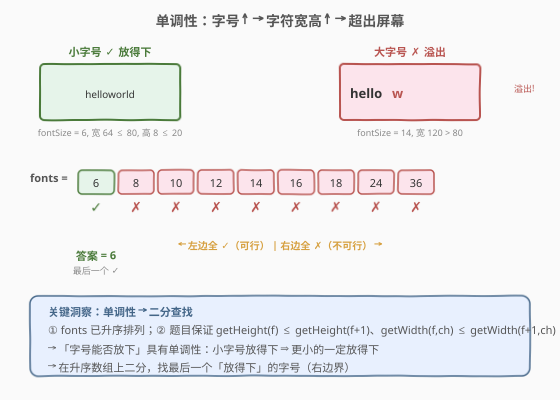
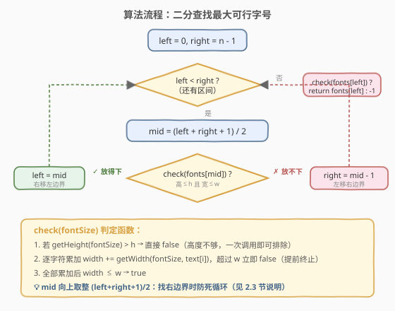
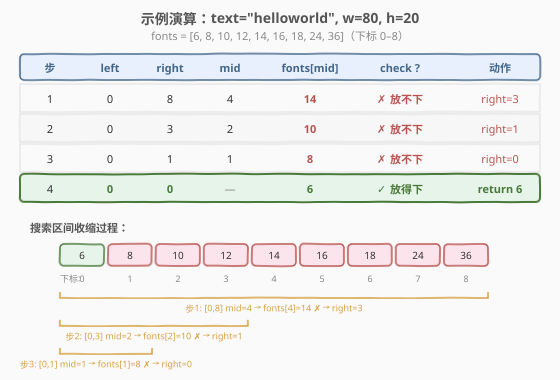

# LeetCode 找出适应屏幕的最大字号 题解

## 1. 题目概述

- **标题 / 题号**：找出适应屏幕的最大字号（#1618，medium）
- **链接**：https://leetcode.cn/problems/maximum-font-to-fit-a-sentence-in-a-screen/
- **难度**：中等
- **标签**：数组、字符串、二分查找、交互

**题意**：给定一个字符串 `text`，要在**宽为 `w`、高为 `h`** 的屏幕上显示该文本（**只能排一排**，不换行）。字体数组 `fonts` 按升序排列，可从中任选一个字号。

通过 `FontInfo` 接口查询字符尺寸：

```text
interface FontInfo {
    int getWidth(int fontSize, char ch);   // 字符 ch 在 fontSize 下的像素宽度，O(1)
    int getHeight(int fontSize);            // 该字号下任意字符的像素高度（同字号等高），O(1)
}
```

- **文本宽度** = 所有字符 `getWidth(fontSize, text[i])` 之和；
- **文本高度** = `getHeight(fontSize)`；
- **放得下** 当且仅当 `宽度 ≤ w` 且 `高度 ≤ h`。

题目保证单调性：对任意字号和字符，`getHeight(f) ≤ getHeight(f+1)`、`getWidth(f, ch) ≤ getWidth(f+1, ch)`。

返回能放下的**最大字号**；若所有字号都放不下，返回 `-1`。

**示例 1**：

```text
输入：text = "helloworld", w = 80, h = 20, fonts = [6,8,10,12,14,16,18,24,36]
输出：6
解释：字号 6 时宽度 64 ≤ 80、高度 8 ≤ 20，放得下；字号 8 起宽度超出 80，放不下。
```

**示例 2**：

```text
输入：text = "leetcode", w = 1000, h = 50, fonts = [1,2,4]
输出：4
解释：最大字号 4 也能放下。
```

**示例 3**：

```text
输入：text = "easyquestion", w = 100, h = 100, fonts = [10,15,20,25]
输出：-1
解释：即使最小字号 10 也放不下。
```

**约束**：

- `1 <= text.length <= 50000`
- `text` 只包含小写字母
- `1 <= w <= 10^7`
- `1 <= h <= 10^4`
- `1 <= fonts.length <= 10^5`
- `1 <= fonts[i] <= 10^5`
- `fonts` 已按升序排序，不含重复项

## 2. 解题思路

### 2.1 暴力思路：线性扫描每个字号

从大到小遍历 `fonts`，对每个字号调用 `check()`：先查 `getHeight` 是否超限，再逐字符累加 `getWidth` 判断宽度。首个放得下的即为答案。

问题：`fonts` 长度达 $10^5$、`text` 长度达 $5 \times 10^4$，最坏需 $5 \times 10^9$ 次 `getWidth` 调用——远超交互题的调用上限，必然 TLE。

### 2.2 核心观察：单调性 → 二分查找



关键观察：**「字号能否放下」具有单调性**。

- `fonts` 升序排列；
- 题目保证字号越大、字符宽高只增不减；
- 因此如果字号 $f$ 放得下，所有 $\leq f$ 的字号也放得下；如果 $f$ 放不下，所有 $\geq f$ 的也放不下。

这构成了一个经典的**「在有序数组上找最后一个 true」**问题——二分查找右边界：

- `check(fonts[mid])` 为 `true` → 答案 $\geq \text{mid}$，收缩左边界 `left = mid`；
- `check(fonts[mid])` 为 `false` → 答案 $< \text{mid}$，收缩右边界 `right = mid - 1`。

> ⚠️ **mid 取上整**：找右边界时 `mid = (left + right + 1) / 2`（向上取整），否则当 `left = 0, right = 1` 时 `mid` 恒为 `0`，若 `check` 为 `true` 则 `left` 不变，陷入死循环。这是「找最后一个满足条件」模板的标准写法，与 [704. 二分查找](../0701-0800/704_二分查找.md) 的闭区间母题一脉相承。

### 2.3 算法流程图



```
1. left = 0, right = len(fonts) - 1
2. while left < right:
   a. mid = (left + right + 1) / 2     ← 向上取整防死循环
   b. if check(fonts[mid]):
         left = mid                     ← 放得下，尝试更大
      else:
         right = mid - 1                ← 放不下，排除 mid 及以右
3. return check(fonts[left]) ? fonts[left] : -1

check(fontSize):
   1. if getHeight(fontSize) > h: return false    ← 先查高度，一次调用排除
   2. width = 0
   3. for ch in text:
        width += getWidth(fontSize, ch)
        if width > w: return false               ← 提前终止
   4. return true
```

> 💡 `check` 内部先判高度（1 次 `getHeight`），再逐字符累加宽度并**超限即返回**（提前终止）。这两步剪枝大幅减少不必要的 `getWidth` 调用。

### 2.4 示例演算



以示例 1 为例，`fonts = [6,8,10,12,14,16,18,24,36]`（下标 0–8），`w=80, h=20`：

| 步 | left | right | mid | fonts[mid] | check | 动作 |
|----|------|-------|-----|------------|-------|------|
| 1  | 0    | 8     | 4   | 14         | ✗ 放不下 | right = 3 |
| 2  | 0    | 3     | 2   | 10         | ✗ 放不下 | right = 1 |
| 3  | 0    | 1     | 1   | 8          | ✗ 放不下 | right = 0 |
| 4  | 0    | 0     | —   | 6          | ✓ 放得下 | **return 6** |

`left == right` 时退出循环，验证 `fonts[0] = 6` 确实放得下，返回 `6` ✓。共 $\lceil\log_2 9\rceil = 4$ 次二分，远优于线性扫描的 9 次。

## 3. 参考代码

### C++

```cpp
/**
 * // This is the FontInfo's API interface.
 * // You should not implement it, or speculate about its implementation
 * class FontInfo {
 *   public:
 *     int getWidth(int fontSize, char ch);
 *     int getHeight(int fontSize);
 * };
 */
class Solution {
public:
    int maxFont(string text, int w, int h, vector<int>& fonts, FontInfo fontInfo) {
        auto check = [&](int size) -> bool {
            if (fontInfo.getHeight(size) > h) return false;
            int width = 0;
            for (char c : text) {
                width += fontInfo.getWidth(size, c);
                if (width > w) return false;
            }
            return true;
        };
        int left = 0, right = (int)fonts.size() - 1;
        while (left < right) {
            int mid = (left + right + 1) >> 1;
            if (check(fonts[mid])) {
                left = mid;
            } else {
                right = mid - 1;
            }
        }
        return check(fonts[left]) ? fonts[left] : -1;
    }
};
```

### Python

```python
# """
# This is FontInfo's API interface.
# You should not implement it, or speculate about its implementation
# """
# class FontInfo(object):
#     def getWidth(self, fontSize, ch):
#     def getHeight(self, fontSize):
#
class Solution(object):
    def maxFont(self, text, w, h, fonts, fontInfo):
        def check(size):
            if fontInfo.getHeight(size) > h:
                return False
            width = 0
            for c in text:
                width += fontInfo.getWidth(size, c)
                if width > w:
                    return False
            return True

        left, right = 0, len(fonts) - 1
        while left < right:
            mid = (left + right + 1) >> 1
            if check(fonts[mid]):
                left = mid
            else:
                right = mid - 1
        return fonts[left] if check(fonts[left]) else -1
```

> 💡 退出循环后必须再做一次 `check(fonts[left])`：当所有字号都放不下时（如示例 3），`left` 会收敛到 `0` 但 `check` 仍为 `false`，此时应返回 `-1` 而非 `fonts[0]`。

## 4. 复杂度分析

| 维度 | 复杂度 | 说明 |
|------|--------|------|
| 时间复杂度 | $O(\log n \cdot m)$ | $n = \text{len(fonts)}$，$m = \text{len(text)}$；二分 $\log n$ 轮，每轮最坏扫描全部 $m$ 个字符 |
| 空间复杂度 | $O(1)$ | 仅用 `left`、`right`、`mid`、`width` 等常数变量 |
| API 调用 | getHeight $\leq \log n + 1$ 次；getWidth $\leq (\log n + 1) \cdot m$ 次 | 提前终止使实际调用数远小于上界 |

> 💡 对 $n = 10^5$、$m = 5 \times 10^4$ 的极端约束，$\log_2 10^5 \approx 17$，最坏约 $8.5 \times 10^5$ 次 `getWidth`。若题目对调用次数有更严格限制，可用第 5 节的缓存优化进一步压缩。

## 5. 扩展：缓存字符宽度，压缩 API 调用

`text` 只含小写字母（至多 26 种字符），但同一个字符在 `text` 中可能重复出现很多次。每次 `check` 都对同一字符重复调用 `getWidth(fontSize, ch)` 是浪费——可以**按字号缓存每个字符的宽度**，将每次 `check` 的 `getWidth` 调用数从 $O(m)$ 降到 $O(\min(m, 26))$。

```cpp
class Solution {
public:
    int maxFont(string text, int w, int h, vector<int>& fonts, FontInfo fontInfo) {
        // 预统计 text 中出现的去重字符
        vector<char> chars(text.begin(), text.end());
        sort(chars.begin(), chars.end());
        chars.erase(unique(chars.begin(), chars.end()), chars.end());

        // 按字号缓存每个字符的宽度：cache[size][ch]
        unordered_map<int, unordered_map<char, int>> cache;
        auto getWidth = [&](int size, char c) -> int {
            auto it = cache.find(size);
            if (it != cache.end() && it->second.count(c))
                return it->second[c];
            int val = fontInfo.getWidth(size, c);
            cache[size][c] = val;
            return val;
        };

        // 预统计每个字符出现次数
        int cnt[26] = {};
        for (char c : text) cnt[c - 'a']++;

        auto check = [&](int size) -> bool {
            if (fontInfo.getHeight(size) > h) return false;
            long long width = 0;
            for (char c : chars) {
                width += (long long)getWidth(size, c) * cnt[c - 'a'];
                if (width > w) return false;
            }
            return width <= w;
        };

        int left = 0, right = (int)fonts.size() - 1;
        while (left < right) {
            int mid = (left + right + 1) >> 1;
            if (check(fonts[mid])) left = mid;
            else right = mid - 1;
        }
        return check(fonts[left]) ? fonts[left] : -1;
    }
};
```

优化效果：

| 策略 | 每次 check 的 getWidth 调用数 | $\log n$ 轮总调用数 |
|------|------------------------------|---------------------|
| 逐字符调用 | $O(m)$（最坏 $5 \times 10^4$） | $\approx 8.5 \times 10^5$ |
| 缓存去重字符 | $O(\min(m, 26))$（至多 26） | $\approx 17 \times 26 = 442$ |

> ⚠️ 缓存版用 `long long` 累加宽度，避免 $m \times \text{width}$ 溢出（单字符宽度可达 $10^5$，$5 \times 10^4$ 个字符累加可达 $5 \times 10^9$，超出 `int` 范围）。

## 6. 面试要点

**Q1：为什么用二分而不是从大到小线性扫描？**
> 字号能否放下具有单调性（题目显式保证宽高随字号递增不减），且 `fonts` 已升序。线性扫描最坏 $O(n \cdot m)$ 次调用，二分降至 $O(\log n \cdot m)$，对 $n = 10^5$ 的约束从 $10^9$ 量级降到 $10^5$ 量级。

**Q2：为什么 mid 向上取整 `(left+right+1)/2`？**
> 找右边界（最后一个 `true`）时，若 `check` 为 `true` 执行 `left = mid`。若 `mid` 向下取整，当 `left = 0, right = 1` 时 `mid = 0`，`check` 为 `true` 后 `left` 仍为 `0`，区间不收缩 → 死循环。向上取整让 `mid = 1`，保证每步都缩小范围。

**Q3：退出循环后为什么还要 `check` 一次？**
> 当所有字号都放不下（如示例 3），二分过程会让 `right` 不断左移直到 `left = right = 0`，但 `fonts[0]` 本身也放不下。循环只保证找到了「分界点」，不保证 `fonts[left]` 一定可行——必须验证后决定返回 `fonts[left]` 还是 `-1`。

**Q4：check 函数内先查高度有什么好处？**
> `getHeight` 只需 1 次调用即可判定高度是否超标。先查高度可以在高度超限时直接返回 `false`，完全跳过 $O(m)$ 次 `getWidth` 调用。对交互题（API 调用有上限）这是关键剪枝。

**Q5：如何进一步减少 getWidth 调用次数？**
> `text` 只含小写字母（至多 26 种），同一字符可能重复出现。按字号缓存每个字符的宽度，再乘以出现次数累加，可将每次 `check` 的 `getWidth` 调用从 $O(m)$ 降到 $O(26)$，总调用从 $\sim 10^6$ 降到 $\sim 500$（见第 5 节）。

## 同类练习题

| # | 题目 | 与本题的关联 |
|---|------|-------------|
| 704 | [二分查找](https://leetcode.cn/problems/binary-search/)（[题解](../0701-0800/704_二分查找.md)） | 一切二分的母题，本题是其「找最后一个满足条件」变体 |
| 875 | [爱吃香蕉的珂珂](https://leetcode.cn/problems/koko-eating-bananas/)（[题解](../0801-0900/875_爱吃香蕉的珂珂.md)） | 二分答案 + $O(n)$ 验证函数，结构与本题高度一致（二分找最小可行速度） |
| 1011 | [在 D 天内送达包裹的能力](https://leetcode.cn/problems/capacity-to-ship-packages-within-d-days/)（[题解](../1001-1100/1011_在D天内送达包裹的能力.md)） | 二分答案 + 贪心验证，单调性来自「容量越大越容易满足」 |
| 410 | [分割数组的最大值](https://leetcode.cn/problems/split-array-largest-sum/)（[题解](../0401-0500/410_分割数组的最大值.md)） | 二分答案 + 贪心划分验证，找最小可行最大段和，与本题「找最大可行字号」方向相反但套路相同 |
| 278 | [第一个错误的版本](https://leetcode.cn/problems/first-bad-version/)（[题解](../0201-0300/278_第一个错误的版本.md)） | 单调布尔序列上二分找首个 `true`，与本题「找最后一个 `true`」互为镜像 |
