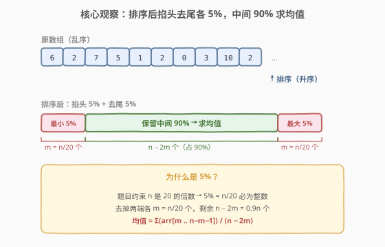
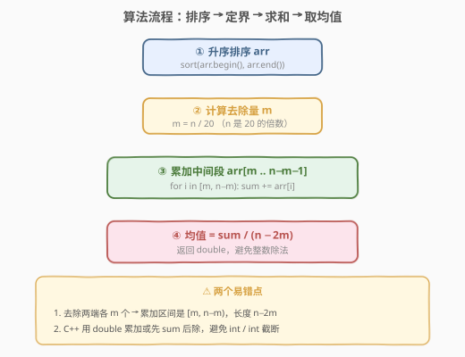
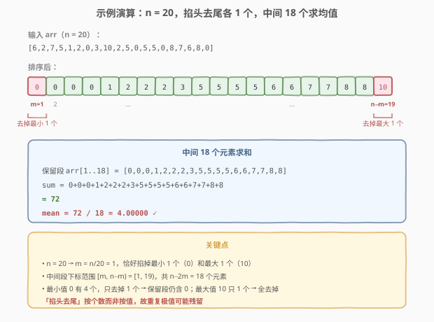

# 删掉某些元素后的数组均值

- **题目名称**：删掉某些元素后的数组均值
- **链接**：[1619. 删掉某些元素后的数组均值](https://leetcode.cn/problems/mean-of-array-after-removing-some-elements/)
- **难度**：简单
- **标签**：数组、排序

## 1. 题目概述

给定一个整数数组 `arr`，返回**删掉最小 5% 的元素和最大 5% 的元素后**，剩余整数的**均值**。

- 数组长度 `n` 是 `20` 的倍数，因此 `5% × n = n/20` 必为整数，两端各掐掉 `m = n/20` 个元素后剩余 `n − 2m = 0.9n` 个。
- 答案与真实值的误差在 $10^{-5}$ 以内即视为正确。

**示例 1**：

```text
输入：arr = [1,2,2,2,2,2,2,2,2,2,2,2,2,2,2,2,2,2,2,3]
输出：2.00000
解释：n = 20，掐掉最小 1 个（1）和最大 1 个（3），中间 18 个全为 2，均值 = 2。
```

**示例 2**：

```text
输入：arr = [6,2,7,5,1,2,0,3,10,2,5,0,5,5,0,8,7,6,8,0]
输出：4.00000
解释：排序后 [0,0,0,0,1,2,2,2,3,5,5,5,5,6,6,7,7,8,8,10]，
      掐掉 1 个最小（0）和 1 个最大（10），中间 18 个和为 72，均值 = 72/18 = 4。
```

**示例 3**：

```text
输入：arr = [6,0,7,0,7,5,7,8,3,4,0,7,8,1,6,8,1,1,2,4,8,1,9,5,4,3,8,5,10,8,6,7,5,6,7,7,7,6,9,1]
输出：4.77778
解释：n = 40，两端各掐掉 2 个，剩余 36 个的均值约 4.77778。
```

**约束条件**：

- $20 \leq \text{arr.length} \leq 1000$
- `arr.length` 是 `20` 的倍数
- $0 \leq \text{arr}[i] \leq 10^5$

> 💡 题目本质是**截尾均值（trimmed mean）**——统计学中抗离群值的经典估计量。排序后掐掉两端各 5% 的极值，再用中间部分求平均，能避免少数极端数拉偏均值。

## 2. 解题思路

### 2.1 暴力思路：每次找最值并删除

模拟"删除最小 5% 和最大 5%"的字面过程：循环 `m = n/20` 次，每次线性扫一遍找当前最小（最大）并删掉。正确但时间复杂度 $O(m \cdot n) = O(n^2/20)$，且删除操作若用 `vector::erase` 还要 $O(n)$ 搬移，常数偏大——**完全没必要这么麻烦**。

> ⚠️ 关键误区：以为"删除最小 5%"要逐个挑出来删。其实排序后**最小的 5% 恰好是前 m 个、最大的 5% 恰好是后 m 个**，一次排序就把它们整齐归位到两端，无需逐次删除。

### 2.2 核心观察：排序后掐头去尾各 m 个



关键洞察：**排序把极值聚到两端**。

- 升序排序后，前 `m = n/20` 个就是最小的 5%，后 `m` 个就是最大的 5%；
- 中间下标区间 `[m, n − m)` 共 `n − 2m = 0.9n` 个元素即为所求；
- 对这一段累加求和，再除以 `n − 2m` 得均值。

> 💡 **为什么约束保证 `n` 是 20 的倍数？** 这样 `5% × n = n/20` 必为整数，免去处理"非整数个数"的歧义（统计学的截尾均值在非整数比例时需用插值，本题刻意规避）。

> ⚠️ **「按个数」而非「按值」**：掐掉的是两端各 `m` **个**元素，不是"小于某阈值的所有元素"。因此当最小值有重复时（如示例 2 中 0 出现 4 次），只掐掉其中 1 个，剩余 3 个 0 仍在保留段内。这一点务必在循环边界上体现清楚。

### 2.3 算法流程图



四步走，每步 $O(n)$ 或 $O(n \log n)$，整体由排序主导：

```
1. 升序排序 arr
2. m = n / 20
3. sum = Σ arr[i], i ∈ [m, n − m)
4. return sum / (n − 2m)
```

> ⚠️ 第 4 步在 C++ 中务必用浮点除法：`sum` 若是 `int`，`(double)sum / (n − 2m)` 或先转 `double` 累加，避免 `int / int` 截断为整数。Python 的 `/` 天然返回浮点，无此坑。

### 2.4 示例演算



以示例 2 `arr = [6,2,7,5,1,2,0,3,10,2,5,0,5,5,0,8,7,6,8,0]`（$n = 20$）为例：

1. **排序**后：`[0,0,0,0,1,2,2,2,3,5,5,5,5,6,6,7,7,8,8,10]`
2. **定界**：$m = 20/20 = 1$，保留下标 `[1, 19)`，即去掉下标 0 的 `0` 和下标 19 的 `10`
3. **求和**：保留段 `[0,0,0,1,2,2,2,3,5,5,5,5,6,6,7,7,8,8]`，共 18 个

| 步骤 | 值 |
|------|----|
| 保留段和 `sum` | $0+0+0+1+2+2+2+3+5+5+5+5+6+6+7+7+8+8 = 72$ |
| 保留段长度 `n − 2m` | $20 − 2 = 18$ |
| 均值 | $72 / 18 = 4.00000$ ✓ |

> 💡 **注意重复极值的处理**：最小值 `0` 在排序后占下标 0–3 共 4 个，我们只掐掉下标 0 这 1 个，剩余 3 个 `0` 仍在保留段内参与求和。最大值 `10` 只有 1 个，恰好被完全掐掉。这正是"按个数掐"而非"按值掐"的体现。

## 3. 参考代码

### C++

```cpp
#include <algorithm>
#include <numeric>
#include <vector>
using namespace std;

class Solution {
public:
    double trimMean(vector<int>& arr) {
        sort(arr.begin(), arr.end());
        int n = arr.size();
        int m = n / 20;
        double sum = 0;
        for (int i = m; i < n - m; ++i) {
            sum += arr[i];
        }
        return sum / (n - 2 * m);
    }
};
```

> 💡 也可用 `std::accumulate(arr.begin() + m, arr.end() - m, 0.0)` 一行求和，第三个参数 `0.0` 指定累加类型为 `double`，自动避免整数溢出与截断。

### Python

```python
class Solution:
    def trimMean(self, arr: list[int]) -> float:
        arr.sort()
        n = len(arr)
        m = n // 20
        return sum(arr[m:n - m]) / (n - 2 * m)
```

> 💡 Python 的切片 `arr[m:n-m]` 直接取中间段，`sum()` 配合 `/` 天然返回浮点，无需额外类型转换。`n - 2*m` 必为正整数（$n \geq 20, m = n/20$，故 $n - 2m = 0.9n \geq 18$）。

## 4. 复杂度分析

| 维度 | 复杂度 | 说明 |
|------|--------|------|
| 时间复杂度 | $O(n \log n)$ | 排序主导 $O(n \log n)$；求和 $O(n)$，总体由排序决定 |
| 空间复杂度 | $O(\log n)$ | 排序的栈空间（C++ 内省排序 / Python Timsort），不计输出 |

> 💡 本题 $n \leq 1000$，$O(n \log n)$ 远远够用。即便 $n$ 放大到 $10^6$，排序仍是瓶颈但可接受；若值域较小（如 $[0, 10^5]$），可用计数排序把整体降到 $O(n + V)$，但本题规模无此必要。

## 5. 扩展：截尾均值的统计意义

**截尾均值（trimmed mean）** 是统计学中抗离群值的稳健估计量。普通算术均值对极端值非常敏感——一个 $10^5$ 的离群值能把均值拉高一大截；而截尾均值通过掐掉两端各 $p\%$，把离群值直接排除在计算之外，得到对"主体分布"更公允的中心估计。

- **$p = 25\%$** 的截尾均值即**四分位均值（interquartile mean, IQM）**，常用于评分系统（如去掉最高最低分后取平均）；
- **$p = 50\%$** 退化到只剩中位数；
- 本题 $p = 5\%$ 是温和截尾，适合"大多数数据正常但偶有噪声"的场景。

> 💡 在比赛中（如体操、跳水），"去掉一个最高分、去掉一个最低分"就是 $p = 1/n$ 的截尾均值——本质是用排序后掐头去尾的思路压制裁判主观偏差。

### 非整数比例时的处理

当 $p \times n$ 不是整数时（本题用"n 是 20 的倍数"规避了此情况），标准做法是**加权截尾**：在截断边界处，靠近保留段的那个元素按其"露出比例"加权计入。例如 $n = 10, p = 5\%$ 时 $m = 0.5$，需把最小元素按 0.5 权重、最大元素按 0.5 权重计入，分母为 $n - 2m = 9$。本题无需考虑此细节。

## 6. 面试要点

**Q1：为什么排序后最小的 5% 一定在前 m 个？**

> 升序排序后数组单调不降，前 $m$ 个元素 $\leq$ 第 $m+1$ 个元素 $\leq$ 后续所有元素。因此前 $m$ 个就是全集最小的 $m$ 个（含并列情况下的任意一种归位），恰好对应"最小 5%"。最大 5% 同理在末尾 $m$ 个。

**Q2：如果最小值有重复，只掐掉一部分会出错吗？**

> 不会，这正是题意。"删除最小 5%"指的是按**个数**删除最小的 $m$ 个，而非删除所有等于最小值的元素。排序后前 $m$ 个位置就是这 $m$ 个元素，无论它们取值是否相同。示例 2 中 0 有 4 个、只掐 1 个，剩余 3 个 0 仍参与求和，结果正确。

**Q3：C++ 中 `sum / (n - 2*m)` 为什么可能出错？**

> 若 `sum` 声明为 `int`，`int / int` 在 C++ 中执行整数除法，会截断小数部分（如 $72 / 18 = 4$ 碰巧正确，但 $5 / 2 = 2$ 就错了）。解法：要么 `sum` 用 `double` 累加，要么显式转换 `(double)sum / (n - 2*m)`。用 `std::accumulate(..., 0.0)` 让初值是 `double` 是最优雅的写法。

**Q4：能否不排序，用 quickselect 找到第 m 小和第 n−m 小的元素？**

> 可以。用 `nth_element` 把第 $m$ 小和第 $n-m$ 小的元素归位，则中间段 `[m, n-m)` 内的元素即为保留段，再求和。整体 $O(n)$ 平均时间，优于排序的 $O(n \log n)$。但实现上需调用两次 `nth_element` 并对中间段求和，常数不小，且 $n \leq 1000$ 时排序已足够快，工程上排序版更简洁可读。

**Q5：题目为什么约束 n 是 20 的倍数？**

> 让 $m = n/20$ 必为整数，避免"非整数个元素"的歧义。统计学的截尾均值在非整数比例时需在截断边界做加权插值（见第 5 节扩展），实现繁琐且容易出错。题目用数据约束把这部分复杂度挡在门外，让解法聚焦于"排序 + 掐头去尾"的核心思路。

## 7. 同类练习题

- [561. 数组拆分](https://leetcode.cn/problems/array-partition/)：排序后按下标奇偶分组取最小求和，同样是"排序后按位置取段"的思路
- [912. 排序数组](https://leetcode.cn/problems/sort-an-array/)（[题解](../0901-1000/912_排序数组.md)）：排序的母题，本题与一切"排序后定界"题的基石
- [896. 单调数列](https://leetcode.cn/problems/monotonic-array/)：判断数组是否已排序，与本题"排序后利用单调性定位极值段"互为正反对照
- [215. 数组中的第K个最大元素](https://leetcode.cn/problems/kth-largest-element-in-an-array/)（[题解](../0201-0300/215_数组中的第K个最大元素.md)）：quickselect 找第 k 大，是本题扩展节中"不排序定位极值"的母题
- [704. 二分查找](https://leetcode.cn/problems/binary-search/)（[题解](../0701-0800/704_二分查找.md)）：二分模板，巩固"有序数组上按位置定位元素"的基本功
