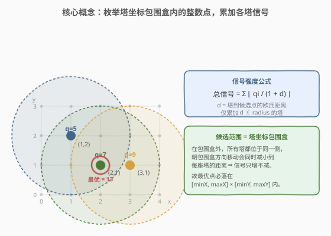
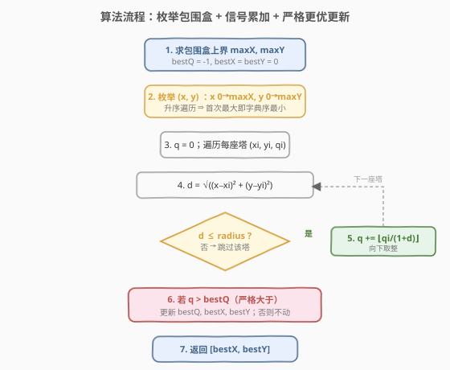
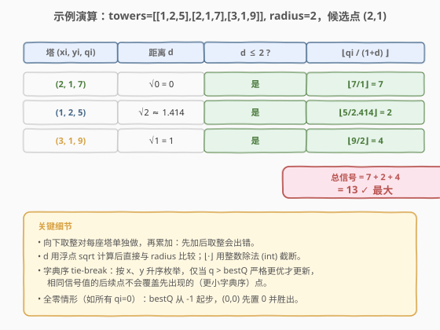

# LeetCode 网络信号最好的坐标 题解

## 1. 题目概述

- **标题 / 题号**：网络信号最好的坐标（#1620，medium）
- **链接**：https://leetcode.cn/problems/coordinate-with-maximum-network-quality/
- **难度**：中等
- **标签**：数组、枚举、几何

**题意**：给定数组 `towers` 和整数 `radius`，其中 `towers[i] = [xi, yi, qi]` 表示第 `i` 座信号塔位于整数坐标 `(xi, yi)`、信号强度参数为 `qi`。两坐标间距离按**欧几里得距离**计算。

整数 `radius` 表示一座塔能到达的**最远距离**：若某坐标到塔的距离 `d ≤ radius`，则该塔可到达此坐标；否则不能到达。可达时，该塔在此坐标的信号为 $\lfloor q_i / (1 + d) \rfloor$（向下取整）；一个坐标的**信号强度**为所有可达塔信号之和。

返回信号强度最大的**整数**坐标 `[cx, cy]`；若并列，返回**字典序最小**的**非负**坐标（先比 `x`，再比 `y`）。

> 💡 字典序：`x1 < x2`，或 `x1 == x2` 且 `y1 < y2`，则 `(x1,y1)` 更小。

**示例 1**：

```text
输入：towers = [[1,2,5],[2,1,7],[3,1,9]], radius = 2
输出：[2,1]
解释：坐标 (2,1) 的信号强度之和为 13
  - 塔 (2,1,7)：⌊7 / (1+0)⌋ = 7
  - 塔 (1,2,5)：⌊5 / (1+√2)⌋ = ⌊2.07⌋ = 2
  - 塔 (3,1,9)：⌊9 / (1+1)⌋ = ⌊4.5⌋ = 4
没有别的坐标信号更大。
```

**示例 2**：

```text
输入：towers = [[23,11,21]], radius = 9
输出：[23,11]
解释：仅一座塔，塔自身位置信号最大（d=0，信号=qi）。
```

**示例 3**：

```text
输入：towers = [[1,2,13],[2,1,7],[0,1,9]], radius = 2
输出：[1,2]
解释：坐标 (1,2) 的信号强度最大。
```

**约束**：

- `1 <= towers.length <= 50`
- `towers[i].length == 3`
- `0 <= xi, yi, qi <= 50`
- `1 <= radius <= 50`

## 2. 解题思路

### 2.1 暴力思路：枚举所有候选点

最直接的思路：对每个可能的整数坐标 `(x, y)`，遍历所有塔，按公式累加可达塔的信号，记录最大值与对应坐标。难点只剩一个——**候选坐标的范围有多大？**

塔坐标与 `radius` 都不超过 50，朴素可枚举 `[0, 50 + radius] × [0, 50 + radius]`，约 `101 × 101 ≈ 10⁴` 个点，每点扫 50 座塔，约 `5 × 10⁵` 次运算，完全可接受。但范围其实还能**进一步收紧**，这正是本题的核心观察。

### 2.2 核心观察：候选范围 = 塔坐标包围盒



**关键洞察**：信号最大的整数点**必落在塔坐标的包围盒** $[\min x_i, \max x_i] \times [\min y_i, \max y_i]$ 之内，无需按 `radius` 外扩。

理由：考虑某个位于包围盒**外侧**的点，比如 `x > \max x_i`。此时**所有塔**的横坐标都 `≤ \max x_i < x`，即所有塔都在该点的同一侧（左侧）。把候选点向左移（减小 `x` 朝 `\max x_i` 靠拢），到**每一座塔**的横向距离 `|x - x_i| = x - x_i` 都会减小，因而欧氏距离 `d` 不增、信号 $\lfloor q_i/(1+d) \rfloor$ 不减。换言之——**向外移动只会让信号变弱，向包围盒靠拢只会让信号变强或不变**。

因此最优点不会停在包围盒之外，必在 $[\min x_i, \max x_i] \times [\min y_i, \max y_i]$ 内。又因坐标非负、`x_i, y_i ≥ 0`，从 `0` 起枚举到 `\max x_i / \max y_i` 即可：

- 覆盖整个包围盒（`\min ≥ 0`）；
- 同时覆盖 `(0, 0)`，用于处理"最大信号为 0"（如所有 `q_i = 0`）时字典序最小的并列点。

> ⚠️ **为何不能用 `q ≥ bestQ` 更新？** 题目要求并列时取**字典序最小**。若用 `≥`，后续更靠后的点会覆盖先出现的更小字典序点。正确做法：按 `x`、`y` **升序**枚举，仅当 `q > bestQ` **严格更优**才更新——这样首次出现的最大值（即字典序最小者）会被保留，并列点不再覆盖。

### 2.3 算法流程图



```text
1. maxX = max(xi), maxY = max(yi)；bestQ = -1, bestX = bestY = 0
2. for x = 0 .. maxX:                    // 升序 ⇒ 首次最大即字典序最小
     for y = 0 .. maxY:
       q = 0
       for each tower (xi, yi, qi):
         d = sqrt((x-xi)^2 + (y-yi)^2)
         if d <= radius:
           q += floor(qi / (1 + d))      // 每塔单独取整再累加
       if q > bestQ:                     // 严格大于才更新
         bestQ, bestX, bestY = q, x, y
3. 返回 [bestX, bestY]
```

### 2.4 示例演算



以示例 1 的 `(2,1)` 为例，逐塔计算（先取整、后累加）：

| 塔 `(xi, yi, qi)` | 距离 `d` | `d ≤ 2 ?` | `⌊qi / (1+d)⌋` |
|-------------------|----------|-----------|-----------------|
| `(2, 1, 7)` | `√0 = 0` | 是 | `⌊7/1⌋ = 7` |
| `(1, 2, 5)` | `√2 ≈ 1.414` | 是 | `⌊5/2.414⌋ = 2` |
| `(3, 1, 9)` | `√1 = 1` | 是 | `⌊9/2⌋ = 4` |

总信号 `= 7 + 2 + 4 = 13`，为全局最大，返回 `[2,1]` ✓。

> 💡 注意每座塔**各自向下取整后再相加**，而非先求和再取整——两种结果可能不同。

## 3. 参考代码

### C++

```cpp
class Solution {
public:
    vector<int> bestCoordinate(vector<vector<int>>& towers, int radius) {
        int maxX = 0, maxY = 0;
        for (const auto& t : towers) {
            maxX = max(maxX, t[0]);
            maxY = max(maxY, t[1]);
        }
        int bestX = 0, bestY = 0, bestQ = -1;
        for (int x = 0; x <= maxX; ++x) {
            for (int y = 0; y <= maxY; ++y) {
                int q = 0;
                for (const auto& t : towers) {
                    double dx = x - t[0], dy = y - t[1];
                    double d = sqrt(dx * dx + dy * dy);
                    if (d <= radius) q += (int)(t[2] / (1.0 + d));
                }
                if (q > bestQ) {
                    bestQ = q;
                    bestX = x;
                    bestY = y;
                }
            }
        }
        return {bestX, bestY};
    }
};
```

### Python

```python
import math
from typing import List

class Solution:
    def bestCoordinate(self, towers: List[List[int]], radius: int) -> List[int]:
        max_x = max(t[0] for t in towers)
        max_y = max(t[1] for t in towers)
        best_x = best_y = 0
        best_q = -1
        for x in range(max_x + 1):
            for y in range(max_y + 1):
                q = 0
                for xi, yi, qi in towers:
                    d = math.hypot(x - xi, y - yi)
                    if d <= radius:
                        q += int(qi / (1 + d))
                if q > best_q:
                    best_q = q
                    best_x, best_y = x, y
        return [best_x, best_y]
```

> 💡 `int(qi / (1 + d))` 在 Python 中对正数即向下取整，等价于 `math.floor`。`math.hypot(dx, dy)` 比 `sqrt(dx*dx+dy*dy)` 更稳健（避免大数溢出），本题数值小两者皆可。

## 4. 复杂度分析

| 维度 | 复杂度 | 说明 |
|------|--------|------|
| 时间复杂度 | $O(n \cdot X \cdot Y)$ | 候选点数 $X \cdot Y \le 51 \times 51$，每点扫 $n \le 50$ 座塔；最坏约 $1.3 \times 10^5$ 次 |
| 空间复杂度 | $O(1)$ | 仅维护 `bestQ/bestX/bestY` 与累加器，不随输入规模增长 |

> 💡 若朴素外扩到 `[0, 50+radius]`，最坏 $101^2 \times 50 \approx 5 \times 10^5$，仍轻松通过。收紧到包围盒只是常数优化与更清晰的正确性论证。

## 5. 扩展：为何不外扩 radius？为何不必离散化更细？

一个常见误区是"候选范围要按 `radius` 向外扩"。如 2.2 所证：包围盒外的点向包围盒靠拢时，**所有塔**的距离同时减小，信号单调不降，故最优解不可能落在外面。这与"单塔自身位置信号最大（`d=0`）"是同一直觉的推广——多塔情形下，最优点在它们的包围盒之内。

另一个延伸：本题只考察**整数**坐标。若放宽为任意实数坐标，最优位置可能在塔之间的非整点上（类似连续选址问题），需用梯度/几何方法而非枚举。整数约束正是让"枚举网格点"成为最优解法的关键条件。

## 6. 面试要点

**Q1：为什么候选范围只需塔坐标包围盒，不用乘上 `radius`？**
> 在包围盒外侧，所有塔都在候选点的同一侧，朝包围盒方向移动会**同时减小**到每座塔的距离，每座塔的信号都不减。故信号最大点不可能停在外侧，必在 $[\min x_i, \max x_i] \times [\min y_i, \max y_i]$ 内。

**Q2：并列时如何保证返回字典序最小的非负坐标？**
> 按 `x`、`y` 升序遍历，更新条件用**严格大于** `q > bestQ`。这样首次出现的最大值被保留，后续等值点不会覆盖。`bestQ` 初值取 `-1`，保证 `(0,0)`（信号可能为 0）能被纳入并胜出全零情形。

**Q3：为什么每座塔要单独取整再累加，不能先求和再取整？**
> $\lfloor a \rfloor + \lfloor b \rfloor$ 与 $\lfloor a + b \rfloor$ 一般不相等（如 `⌊2.7⌋+⌊2.7⌋=2+2=4`，而 `⌊5.4⌋=5`）。题目定义每座塔的贡献是 $\lfloor q_i/(1+d) \rfloor$，再对贡献求和，故必须逐塔取整。

**Q4：浮点距离比较 `d ≤ radius` 会有精度问题吗？**
> 本题坐标与 `radius` 都是 `≤ 50` 的整数，`d` 由整数平方根得到，`double` 精度远足够，不会出现临界误判。若规模放大到 `10^9`，可改用整数平方比较 `dx²+dy² ≤ radius²` 规避浮点。

**Q5：时间复杂度能否进一步优化？**
> 本题规模小，$O(nXY)$ 已是最简且足够。理论可做"对每座塔标记其覆盖的网格点、再做二维差分前缀和"降到接近 $O(n \cdot r^2 + XY)$，但实现复杂、常数未必更优，面试中枚举法是预期解。

## 同类练习题

| # | 题目 | 与本题的关联 |
|---|------|-------------|
| 1030 | [距离顺序排列矩阵单元格](https://leetcode.cn/problems/matrix-cells-in-distance-order/)（[题解](../1001-1100/1030_距离顺序排列矩阵单元格.md)） | 同样在整数网格上枚举点并按欧氏距离处理，对比本题的"取最大"与那题的"按距离排序" |
| 1266 | [访问所有点的最小时间](https://leetcode.cn/problems/minimum-time-visiting-all-points/)（[题解](../1201-1300/1266_访问所有点的最小时间.md)） | 网格点间距离度量（切比雪夫 vs 欧氏），对比不同距离定义对结果的影响 |
| 1401 | [圆和矩形是否有重叠](https://leetcode.cn/problems/circle-and-rectangle-overlapping/)（[题解](../1401-1500/1401_圆和矩形是否有重叠.md)） | 判定圆覆盖区域与几何体相交，与本题"塔的半径覆盖范围"相关 |
| 149 | [直线上最多的点数](https://leetcode.cn/problems/max-points-on-a-line/)（[题解](../0101-0200/149_直线上最多的点数.md)） | 点集上的几何 + 哈希处理，对比本题的几何 + 枚举法 |
