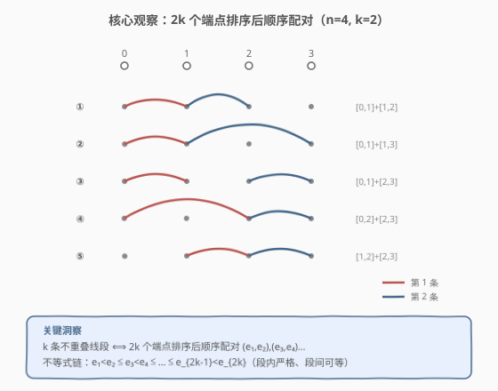
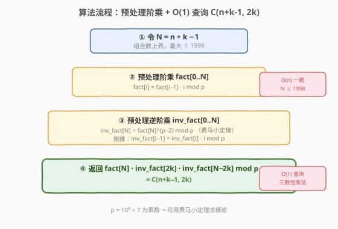
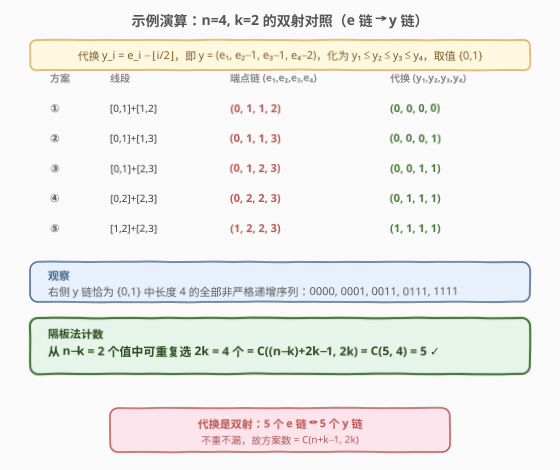
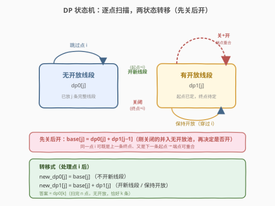

# LeetCode 大小为 K 的不重叠线段的数目 题解

## 1. 题目概述

- **标题 / 题号**：大小为 K 的不重叠线段的数目（#1621，medium）
- **链接**：https://leetcode.cn/problems/number-of-sets-of-k-non-overlapping-line-segments/
- **难度**：中等
- **标签**：数学、组合计数、动态规划、隔板法

**题意**：一维数轴上有 $n$ 个点，编号 $0$ 到 $n-1$，第 $i$ 个点位于 $x=i$。求**恰好** $k$ 条**不重叠**线段的方案数，要求：

- 每条线段两端点都是整数坐标，且**至少覆盖两个点**（即端点 $a < b$）；
- $k$ 条线段**互不重叠**，但端点**可以重合**（相邻线段可共享一个端点）；
- 不要求覆盖所有 $n$ 个点。

结果对 $10^9+7$ 取余。

**示例 1**：

```text
输入：n = 4, k = 2
输出：5
解释：5 种方案为
  {(0,2),(2,3)}，{(0,1),(1,3)}，{(0,1),(2,3)}，{(1,2),(2,3)}，{(0,1),(1,2)}
```

**示例 2**：

```text
输入：n = 3, k = 1
输出：3
解释：{(0,1)}, {(0,2)}, {(1,2)}
```

**示例 3**：

```text
输入：n = 30, k = 7
输出：796297179
解释：总方案数 3796297200，对 10^9+7 取余得 796297179。
```

**示例 4**：

```text
输入：n = 5, k = 3
输出：7
```

**示例 5**：

```text
输入：n = 3, k = 2
输出：1
解释：{(0,1),(1,2)}
```

**约束**：

- $2 \le n \le 1000$
- $1 \le k \le n-1$

> 💡 关键信号：$n \le 1000$ 很小，$O(nk)$ 的 DP 完全够用；但题目的"计数"本质 + "可共享端点"的不重叠条件，强烈暗示存在**组合封闭形式**。下文先推出组合公式 $O(n)$ 解法，再给等价的 DP 作为构造性佐证。

## 2. 解题思路

### 2.1 暴力思路：枚举所有线段组合

从所有 $\binom{n}{2}$ 条可能线段中选 $k$ 条，检查是否两两不重叠。组合数高达 $\binom{\binom{1000}{2}}{k}$，指数级爆炸，不可行。

### 2.2 核心观察：端点排序 + 隔板法化简



**第一步：把"选 k 条线段"翻译成"选 2k 个端点"。**

每条线段由两个端点 $(a,b),\ a<b$ 唯一确定。把 $k$ 条线段的 $2k$ 个端点**从小到大排序**：

$$e_1 \le e_2 \le e_3 \le \ldots \le e_{2k}$$

> ⚠️ **配对方式必须是"顺序配对"**：$(e_1,e_2),(e_3,e_4),\ldots,(e_{2k-1},e_{2k})$。若采用交叉配对（如 $(e_1,e_4),(e_2,e_3)$），所得线段必然重叠——因为 $e_2,e_3$ 落在 $[e_1,e_4]$ 内部。因此**合法的不重叠方案 ⟺ 顺序配对**，这是一一对应。

**第二步：把不重叠条件写成端点链上的不等式。**

顺序配对后，"每条线段至少覆盖两点"要求段内严格 $e_{2i-1} < e_{2i}$；"相邻线段可共享端点"要求段间非严格 $e_{2i} \le e_{2i+1}$。于是得到**混合严格/非严格**不等式链：

$$e_1 < e_2 \le e_3 < e_4 \le \ldots \le e_{2k-1} < e_{2k}, \quad e_i \in \{0,1,\ldots,n-1\}$$

共 $k$ 个严格（段内）与 $k-1$ 个非严格（段间）关系。

**第三步：用代换把"混合链"化为"全非严格链"，再套隔板法。**

这是计数组合的经典技巧：**遇到混合严格/非严格的不等式链，做平移代换消去所有严格关系**。令 $t_i$ 表示位置 $i$ **之前**的严格关系个数，本题为 $t_i = \lfloor i/2 \rfloor$。定义：

$$y_i = e_i - t_i = e_i - \lfloor i/2 \rfloor$$

逐一验证每个关系都变成 $\le$：

- 段内 $e_{2i-1} < e_{2i}$（严格）：$y_{2i} - y_{2i-1} = (e_{2i}-i) - (e_{2i-1}-(i-1)) = e_{2i}-e_{2i-1}-1 \ge 0$ ✓
- 段间 $e_{2i} \le e_{2i+1}$（非严格）：$y_{2i+1}-y_{2i} = (e_{2i+1}-i)-(e_{2i}-i) = e_{2i+1}-e_{2i} \ge 0$ ✓

代换后得到**全非严格**链 $y_1 \le y_2 \le \ldots \le y_{2k}$，且取值范围为 $y_1 = e_1 \ge 0$，$y_{2k} = e_{2k}-k \le (n-1)-k = n-1-k$，即 $y_i \in \{0,1,\ldots,n-1-k\}$，共 $n-k$ 个可选值。

**隔板法**：从 $n-k$ 个值中可重复地选 $2k$ 个（非严格递增），方案数为：

$$\binom{(n-k) + 2k - 1}{2k} = \binom{n+k-1}{2k}$$

> 💡 这就是本题的**封闭形式答案**：$\boxed{\binom{n+k-1}{2k}}$。代换是**双射**（一一对应且可逆），故不重不漏。

**快速验证**：

| $(n,k)$ | $\binom{n+k-1}{2k}$ | 期望 |
|---------|---------------------|------|
| $(4,2)$ | $\binom{5}{4}=5$ | 5 ✓ |
| $(3,1)$ | $\binom{3}{2}=3$ | 3 ✓ |
| $(5,3)$ | $\binom{7}{6}=7$ | 7 ✓ |
| $(3,2)$ | $\binom{4}{4}=1$ | 1 ✓ |
| $(30,7)$ | $\binom{36}{14}=3796297200$ | $796297179$ ✓（取余后） |

### 2.3 算法流程图



```
1. N = n + k - 1                      // 组合数上界，最大 ≤ 1998
2. 预处理 fact[0..N]：fact[i] = fact[i-1] * i mod p
3. 预处理 inv_fact[0..N]：inv_fact[N] = fact[N]^(p-2) mod p（费马小定理）
                       inv_fact[i-1] = inv_fact[i] * i mod p（倒推）
4. 返回 fact[N] * inv_fact[2k] * inv_fact[N-2k] mod p
```

> 💡 $n \le 1000,\ k \le n-1$，故 $N = n+k-1 \le 1998$，阶乘表长度不超过 2000，预处理 $O(n)$，单次查询 $O(1)$。

### 2.4 示例演算



以 $n=4,\ k=2$ 为例，端点链 $e_1 < e_2 \le e_3 < e_4$，取值 $\{0,1,2,3\}$。代换 $y_i = e_i - \lfloor i/2\rfloor$，即 $y=(e_1,\ e_2-1,\ e_3-1,\ e_4-2)$，化为 $y_1 \le y_2 \le y_3 \le y_4$，取值 $\{0,1\}$（共 $n-k=2$ 个值）。

| 方案 | 线段 | 端点链 $(e_1,e_2,e_3,e_4)$ | 代换后 $(y_1,y_2,y_3,y_4)$ |
|------|------|----------------------------|---------------------------|
| 1 | [0,1],[1,2] | (0,1,1,2) | (0,0,0,0) |
| 2 | [0,1],[1,3] | (0,1,1,3) | (0,0,0,1) |
| 3 | [0,1],[2,3] | (0,1,2,3) | (0,0,1,1) |
| 4 | [0,2],[2,3] | (0,2,2,3) | (0,1,1,1) |
| 5 | [1,2],[2,3] | (1,2,2,3) | (1,1,1,1) |

代换后恰好是 $\{0,1\}$ 中长度 4 的**全部非严格递增序列**，共 $\binom{2+4-1}{4}=\binom{5}{4}=5$ 个，与 5 种方案一一对应 ✓。

## 3. 参考代码

### C++

```cpp
const int MOD = 1e9 + 7;

class Solution {
public:
    int numberOfSets(int n, int k) {
        int N = n + k - 1;                  // C(N, 2k)
        vector<long long> fact(N + 1), invFact(N + 1);
        fact[0] = 1;
        for (int i = 1; i <= N; ++i)
            fact[i] = fact[i - 1] * i % MOD;
        invFact[N] = qpow(fact[N], MOD - 2);
        for (int i = N; i >= 1; --i)
            invFact[i - 1] = invFact[i] * i % MOD;
        return fact[N] * invFact[2 * k] % MOD * invFact[N - 2 * k] % MOD;
    }
private:
    long long qpow(long long a, int b) {
        long long r = 1;
        for (; b; b >>= 1, a = a * a % MOD)
            if (b & 1) r = r * a % MOD;
        return r;
    }
};
```

### Python

```python
class Solution:
    def numberOfSets(self, n: int, k: int) -> int:
        MOD = 10**9 + 7
        N = n + k - 1                       # C(N, 2k)
        fact = [1] * (N + 1)
        for i in range(1, N + 1):
            fact[i] = fact[i - 1] * i % MOD
        inv_fact = [1] * (N + 1)
        inv_fact[N] = pow(fact[N], MOD - 2, MOD)
        for i in range(N, 0, -1):
            inv_fact[i - 1] = inv_fact[i] * i % MOD
        return fact[N] * inv_fact[2 * k] % MOD * inv_fact[N - 2 * k] % MOD
```

> 💡 Python 内置 `pow(x, MOD-2, MOD)` 直接给模逆，无需手写快速幂；C++ 需手写 `qpow`。两种语言都用"倒推"求整张逆阶乘表——比逐个求逆快一个 $O(\log p)$ 因子。

## 4. 复杂度分析

| 维度 | 复杂度 | 说明 |
|------|--------|------|
| 时间复杂度 | $O(n)$ | 预处理阶乘/逆阶乘各一趟，$N \le 1998$；查询 $O(1)$ |
| 空间复杂度 | $O(n)$ | 存 `fact`、`inv_fact` 两个长度 $N+1$ 的数组 |

> 💡 即便 $n$ 放大到 $10^6$，$O(n)$ 预处理依然轻松；本题 $n \le 1000$ 更是绰绰有余。

## 5. 扩展：DP 状态机解法（构造性推导）

组合公式虽优雅，但"想到"它需要经验。更稳的构造路径是**动态规划**：从左到右扫描 $n$ 个点，用一个"是否有一条线段正开着"的状态机计数。

### 5.1 状态定义

- `dp0[j]`：已扫描若干点，已放好 $j$ 条完整线段，**当前无开放线段**；
- `dp1[j]`：已放好 $j$ 条完整线段，**当前有一条开放线段**（起点已定在某更左的点，终点待定）。

### 5.2 状态转移



处理点 $i$ 时，**先处理"关闭"，再处理"开启"**——因为同一点既可以作为上一条线段的终点（关闭），又可作为下一条线段的起点（开启），二者可同时发生（端点重合）：

记 $\text{base}[j] = \text{dp0}[j] + \text{dp1}[j-1]$（"无开放"池 = 原本无开放 + 刚关闭一条），则

$$\text{new\_dp0}[j] = \text{base}[j] \quad(\text{不在此点开新线段})$$
$$\text{new\_dp1}[j] = \text{base}[j] + \text{dp1}[j] \quad(\text{在此点开新线段，或保持已有开放线段穿过})$$

> ⚠️ **关键细节**："保持开放"（$\text{dp1}[j]$ 传给 $\text{new\_dp1}[j]$）表示开放线段**穿过**点 $i$ 但不在 $i$ 关闭，留待更右的点关闭；"关闭"（$\text{dp1}[j-1]$ 并入 base）则把线段终点钉在 $i$。同一点允许"关一条 + 开一条"，这正是端点可重合的体现。若禁止端点重合，则 base 中不能含刚关闭的 $\text{dp1}[j-1]$，答案会变为 $\binom{n-1}{2k}$。

### 5.3 参考代码

```cpp
class Solution {
public:
    int numberOfSets(int n, int k) {
        const int MOD = 1e9 + 7;
        vector<int> dp0(k + 1, 0), dp1(k + 1, 0);
        dp0[0] = 1;
        for (int i = 0; i < n; ++i) {
            vector<int> ndp0(k + 1, 0), ndp1(k + 1, 0);
            for (int j = 0; j <= k; ++j) {
                int base = dp0[j];
                if (j > 0) base = (base + dp1[j - 1]) % MOD;      // 关闭一条，并入无开放池
                ndp0[j] = base;                                   // 不开新线段
                ndp1[j] = (base + dp1[j]) % MOD;                  // 开新线段 / 保持开放
            }
            dp0 = move(ndp0); dp1 = move(ndp1);
        }
        return dp0[k];                                             // 无开放 + 恰好 k 条
    }
};
```

```python
class Solution:
    def numberOfSets(self, n: int, k: int) -> int:
        MOD = 10**9 + 7
        dp0 = [0] * (k + 1)   # 无开放线段
        dp1 = [0] * (k + 1)   # 有一条开放线段
        dp0[0] = 1
        for _ in range(n):
            ndp0 = [0] * (k + 1)
            ndp1 = [0] * (k + 1)
            for j in range(k + 1):
                base = dp0[j] + (dp1[j - 1] if j > 0 else 0)
                ndp0[j] = base % MOD              # 不开新线段
                ndp1[j] = (base + dp1[j]) % MOD   # 开新线段 / 保持开放
            dp0, dp1 = ndp0, ndp1
        return dp0[k]
```

| 维度 | 复杂度 | 说明 |
|------|--------|------|
| 时间复杂度 | $O(nk)$ | $n$ 个点 × $k+1$ 种线段数 |
| 空间复杂度 | $O(k)$ | 滚动两个长度 $k+1$ 的数组 |

> 💡 **DP 与组合公式殊途同归**：这个 DP 递推式的闭式解恰为 $\binom{n+k-1}{2k}$。当 $n,k$ 很大时组合公式 $O(n)$ 占优；DP 的优势在于**不依赖"看出"公式**，且易扩展到带额外限制的变体（如禁止端点重合、限制线段最大长度等）。

## 6. 面试要点

**Q1：为什么端点排序后必须"顺序配对"？交叉配对不行吗？**
> 若 $e_1 \le e_2 \le e_3 \le e_4$ 而配成 $(e_1,e_4),(e_2,e_3)$，则 $e_2,e_3$ 都落在 $[e_1,e_4]$ 内部，两条线段必然重叠。只有顺序配对 $(e_1,e_2),(e_3,e_4)$ 才能保证"前一条的右端 $\le$ 后一条的左端"。因此合法方案与"顺序配对的端点链"一一对应。

**Q2：平移代换 $y_i = e_i - \lfloor i/2\rfloor$ 为什么能消去所有严格关系？**
> 严格关系 $e_{2i-1}<e_{2i}$ 意味着 $e_{2i}-e_{2i-1}\ge 1$。代换让 $y_{2i}$ 比 $e_{2i}$ 多减 1（相对 $y_{2i-1}$），正好吸收这个"≥1"，使其退化为 $\ge 0$；非严格关系本就 $\ge 0$，两端减相同量仍 $\ge 0$。关键是每个严格关系让"右侧多减 1"，故 $t_i$ 取位置 $i$ 之前的严格关系数 $\lfloor i/2\rfloor$。

**Q3：答案为什么是 $\binom{n+k-1}{2k}$ 而不是 $\binom{n}{2k}$？**
> $\binom{n}{2k}$ 是"端点互不相同"（禁止端点重合）的情形，对应代换后值域大小仍为 $n$、共 $n$ 个可选值，得 $\binom{n+2k-1}{2k}$……实际上禁止重合时端点严格递增 $e_1<e_2<\ldots<e_{2k}$，方案数为 $\binom{n}{2k}$。本题**允许端点重合**，代换后值域缩为 $n-k$ 个值，多出来的 $k$ 个"空位"使上界从 $n-1$ 变 $n+k-1$，故为 $\binom{n+k-1}{2k}$。

**Q4：DP 里"先关后开"的顺序为什么重要？**
> 同一点 $i$ 可同时是上一条线段的终点和下一条的起点（端点重合）。若先开再关，刚开的线段会被立即关掉，形成 $a=b$ 的退化线段（违反"至少覆盖两点"）；若把开启和关闭写成互斥分支，则会漏掉所有"端点重合"方案。正确做法是先关闭（产生"无开放"池），再从该池决定是否开启，二者可叠加。

**Q5：组合公式与 DP 何时各取所长？**
> 单次查询、$n$ 不大 → 两者皆可，DP 更易想到。多次查询或 $n$ 极大（如 $10^9$）→ 组合公式用 Lucas 定理处理，DP 不可行。带附加约束（限制长度、禁止重合、染色）→ DP 更易改造，组合公式往往需重新推导。

## 同类练习题

| # | 题目 | 与本题的关联 |
|---|------|-------------|
| 62 | [不同路径](https://leetcode.cn/problems/unique-paths/)（[题解](../0001-0100/62_不同路径.md)） | 同为"组合化简"套路，网格路径数直接等于 $\binom{m+n-2}{m-1}$，体会隔板法的普适性 |
| 96 | [不同的二叉搜索树](https://leetcode.cn/problems/unique-binary-search-trees/)（[题解](../0001-0100/96_不同的二叉搜索树.md)） | Catalan 数计数 DP，另一类"计数问题有封闭形式"的经典，对比本题的组合数封闭形式 |
| 435 | [无重叠区间](https://leetcode.cn/problems/non-overlapping-intervals/)（[题解](../0401-0500/435_无重叠区间.md)） | 同为"不重叠线段/区间"主题，但求**最少删除**（贪心区间调度），对照"计数型"与"最优化型"的思路差异 |
| 377 | [组合总和 IV](https://leetcode.cn/problems/combination-sum-iv/)（[题解](../0301-0400/377_组合总和IV.md)） | 完全背包求排列数，另一种"计数 DP"，对比"组合封闭形式"与"递推计数"两条路线 |
