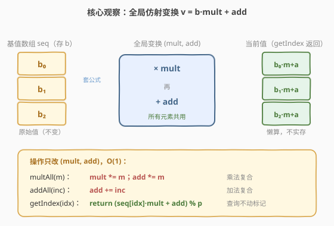
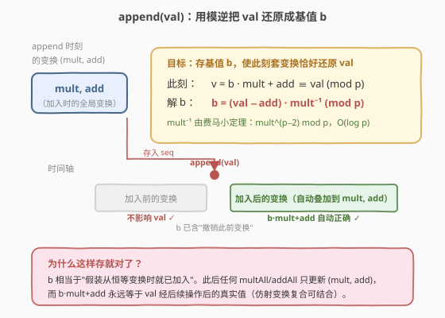
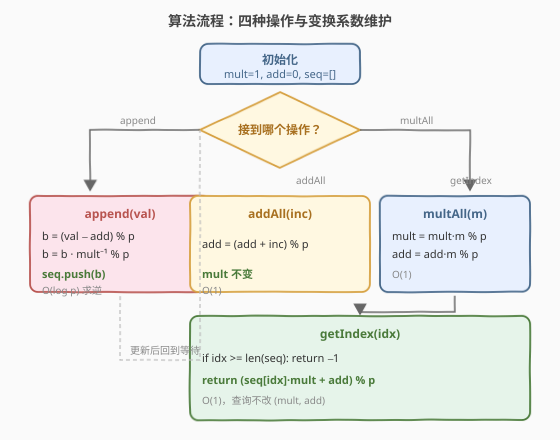
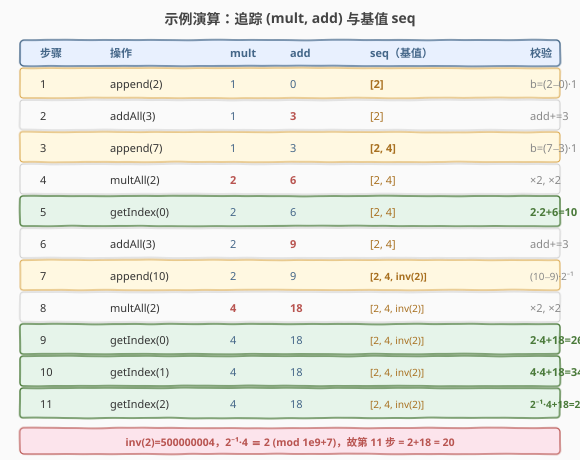

# 奇妙序列

- **题目名称**：奇妙序列
- **链接**：[1622. 奇妙序列](https://leetcode.cn/problems/fancy-sequence/)
- **难度**：困难
- **标签**：设计、数学、线段更新、模逆、仿射变换

## 1. 题目概述

实现一个 `Fancy` 类，维护一个动态序列，支持四种操作：

- `append(val)`：把整数 `val` 追加到序列末尾。
- `addAll(inc)`：把序列中**所有现有元素**都加上 `inc`。
- `multAll(m)`：把序列中**所有现有元素**都乘以 `m`。
- `getIndex(idx)`：返回下标 `idx` 处的当前值，结果对 $10^9+7$ 取余；若 `idx >= 序列长度` 返回 `-1`。

**示例**：

```text
输入：
["Fancy","append","addAll","append","multAll","getIndex","addAll","append","multAll","getIndex","getIndex","getIndex"]
[[],[2],[3],[7],[2],[0],[3],[10],[2],[0],[1],[2]]
输出：
[null,null,null,null,null,10,null,null,null,26,34,20]

解释：
append(2)   -> 序列 [2]
addAll(3)   -> 序列 [5]          （2+3）
append(7)   -> 序列 [5, 7]
multAll(2)  -> 序列 [10, 14]     （5*2, 7*2）
getIndex(0) -> 10
addAll(3)   -> 序列 [13, 17]     （10+3, 14+3）
append(10)  -> 序列 [13, 17, 10]
multAll(2)  -> 序列 [26, 34, 20]
getIndex(0) -> 26
getIndex(1) -> 34
getIndex(2) -> 20
```

**约束条件**：

- $1 \le \text{val, inc, m} \le 100$
- $0 \le \text{idx} \le 10^5$
- `append`、`addAll`、`multAll`、`getIndex` 的总调用次数最多 $10^5$ 次。

---

## 2. 解题思路

### 2.1 暴力思路：直接维护序列

最直观的做法是用一个数组直接存当前值，`append` 末尾追加，`addAll`/`multAll` 遍历所有元素逐个修改，`getIndex` 直接取值取模。

但 `addAll`/`multAll` 每次都是 $O(n)$，而调用总数可达 $10^5$，最坏 $O(n^2) = 10^{10}$，**超时**。关键瓶颈是"整体加 / 整体乘"需要对每个元素动手，而这些操作对**所有现存元素一视同仁**——这正是**懒标记（lazy propagation）**的典型信号。

### 2.2 核心观察：全局仿射变换——懒标记

观察到 `addAll` 和 `multAll` 作用在**全部现存元素**上，且加法和乘法复合后仍是一个"先乘后加"的**仿射变换**（affine transform）。设任意时刻序列中每个元素的"当前值" $v$ 与它被 `append` 时的"原始值" $b$ 之间满足：

$$v = b \cdot \text{mult} + \text{add} \pmod{p}$$

其中 $p = 10^9+7$，`(mult, add)` 是一个**全局共享的变换系数**，初始 `mult=1, add=0`（恒等变换）。这样我们只需 $O(1)$ 维护 `(mult, add)`，而**不必真的去改每个元素**。



三种操作的变换系数如何演变（设旧变换为 `v = b·mult + add`）：

| 操作 | 对每个当前值 $v$ 的影响 | 新变换系数 |
|------|------------------------|-----------|
| `multAll(m)` | $v \cdot m = b \cdot (\text{mult}\cdot m) + (\text{add}\cdot m)$ | `mult *= m; add *= m` |
| `addAll(inc)` | $v + \text{inc} = b \cdot \text{mult} + (\text{add}+\text{inc})$ | `add += inc` |
| `getIndex(idx)` | 直接套公式：$b_{\text{idx}}\cdot\text{mult}+\text{add}$ | 不变 |

`multAll`/`addAll`/`getIndex` 都已 $O(1)$，**唯一难点是 `append`**：新加入的 `val` 不应被"加入之前"的变换影响（它当时还不存在），但**要被"加入之后"的变换**正常作用。

### 2.3 关键难点：append 与模逆

`append(val)` 时，当前全局变换为 `(mult, add)`。我们希望存一个"基值" $b$，使得：

- **此刻**套用当前变换恰好还原成 `val`：$b\cdot\text{mult}+\text{add} \equiv \text{val} \pmod{p}$；
- **未来**变换继续叠加在 `(mult, add)` 上时，$b$ 自动得到正确的新值。

解出 $b$：

$$b \equiv (\text{val}-\text{add})\cdot \text{mult}^{-1} \pmod{p}$$

这里 $\text{mult}^{-1}$ 是 $\text{mult}$ 在模 $p$ 下的**乘法逆元**。



> 💡 **为什么这样存就对了？** 把 `val` "倒推"成 $b$ 后，$b$ 相当于"假装从一开始（恒等变换时）就被加入了"。此后任何 `multAll`/`addAll` 都只更新 `(mult, add)`，而 $b\cdot\text{mult}+\text{add}$ 永远等于 `val` 经过这些后续操作后的真实值——因为仿射变换的复合是结合的。

> ⚠️ **`mult` 一定可逆吗？** 一定。$p=10^9+7$ 是素数，而 $\text{mult}$ 是若干个 $[1,100]$ 内整数之积模 $p$，$p \gg 100$，故 $\text{mult} \not\equiv 0 \pmod{p}$，由费马小定理 $\text{mult}^{-1} \equiv \text{mult}^{p-2} \pmod{p}$，用快速幂 $O(\log p)$ 求得。

### 2.4 算法流程图



1. **初始化**：`mult = 1, add = 0, seq = []`（`seq` 存基值 $b$）。
2. **`append(val)`**：$b = (\text{val}-\text{add})\cdot\text{mult}^{-1}\bmod p$，`seq.push(b)`。
3. **`addAll(inc)`**：`add = (add + inc) % p`。
4. **`multAll(m)`**：`mult = mult * m % p; add = add * m % p`。
5. **`getIndex(idx)`**：若 `idx >= len(seq)` 返回 `-1`；否则返回 `(seq[idx]*mult + add) % p`。

### 2.5 示例演算

以官方示例追踪 `(mult, add)` 与基值数组 `seq` 的演变（$p=10^9+7$，$\text{inv}(2)=500000004$）：



| 步骤 | 操作 | mult | add | seq（基值） | 说明 |
|------|------|------|-----|------------|------|
| 1 | `append(2)` | 1 | 0 | `[2]` | $b=(2-0)\cdot 1=2$ |
| 2 | `addAll(3)` | 1 | 3 | `[2]` | add += 3 |
| 3 | `append(7)` | 1 | 3 | `[2, 4]` | $b=(7-3)\cdot 1=4$ |
| 4 | `multAll(2)` | 2 | 6 | `[2, 4]` | mult×2, add×2 |
| 5 | `getIndex(0)` | 2 | 6 | `[2, 4]` | $2\cdot2+6=10$ ✓ |
| 6 | `addAll(3)` | 2 | 9 | `[2, 4]` | add += 3 |
| 7 | `append(10)` | 2 | 9 | `[2, 4, 500000004]` | $b=(10-9)\cdot\text{inv}(2)=500000004$ |
| 8 | `multAll(2)` | 4 | 18 | `[2, 4, 500000004]` | mult×2, add×2 |
| 9 | `getIndex(0)` | 4 | 18 | — | $2\cdot4+18=26$ ✓ |
| 10 | `getIndex(1)` | 4 | 18 | — | $4\cdot4+18=34$ ✓ |
| 11 | `getIndex(2)` | 4 | 18 | — | $500000004\cdot4+18\equiv 2+18=20$ ✓ |

验证第 11 步：$500000004\cdot4 = 2000000016 \equiv 2 \pmod{10^9+7}$（因为 $500000004 \equiv 2^{-1}$，乘 4 得 $2$），再加 18 得 20，与期望一致。

---

## 3. 参考代码

### C++

```cpp
class Fancy {
    static constexpr long long MOD = 1000000007LL;
    vector<long long> seq;   // 存基值 b
    long long mult = 1, add = 0;

    long long power(long long a, long long e, long long m) {
        long long r = 1 % m;
        a %= m;
        while (e > 0) {
            if (e & 1) r = r * a % m;
            a = a * a % m;
            e >>= 1;
        }
        return r;
    }
public:
    void append(int val) {
        // b = (val - add) * mult^{-1} (mod MOD)
        long long b = ((val - add) % MOD + MOD) % MOD;
        b = b * power(mult, MOD - 2, MOD) % MOD;
        seq.push_back(b);
    }
    void addAll(int inc) {
        add = (add + inc) % MOD;
    }
    void multAll(int m) {
        mult = mult * m % MOD;
        add = add * m % MOD;
    }
    int getIndex(int idx) {
        if (idx >= (int)seq.size()) return -1;
        return (int)((seq[idx] * mult % MOD + add) % MOD);
    }
};
```

### Python

```python
class Fancy:
    MOD = 10**9 + 7

    def __init__(self):
        self.seq = []          # 存基值 b
        self.mult = 1
        self.add = 0

    def append(self, val: int) -> None:
        # b = (val - add) * mult^{-1} (mod MOD)
        b = (val - self.add) % self.MOD
        b = b * pow(self.mult, self.MOD - 2, self.MOD) % self.MOD
        self.seq.append(b)

    def addAll(self, inc: int) -> None:
        self.add = (self.add + inc) % self.MOD

    def multAll(self, m: int) -> None:
        self.mult = self.mult * m % self.MOD
        self.add = self.add * m % self.MOD

    def getIndex(self, idx: int) -> int:
        if idx >= len(self.seq):
            return -1
        return (self.seq[idx] * self.mult + self.add) % self.MOD
```

> 💡 Python 的内置 `pow(a, -1, m)`（3.8+）或 `pow(a, p-2, p)` 都能求模逆，这里用费马小定理写法与 C++ 对齐，便于面试时手写。

---

## 4. 复杂度分析

| 维度 | 操作 | 复杂度 | 说明 |
|------|------|--------|------|
| 时间 | `append` | $O(\log p)$ | 一次快速幂求模逆，$p=10^9+7$，约 30 次乘法 |
| 时间 | `addAll` | $O(1)$ | 仅更新 `add` |
| 时间 | `multAll` | $O(1)$ | 仅更新 `mult`、`add` |
| 时间 | `getIndex` | $O(1)$ | 一次乘加取模 |
| 空间 | 整体 | $O(n)$ | `seq` 存 $n$ 个基值，$n \le 10^5$ |

> ⚠️ 若不用模逆，`append` 要么暴力 $O(n)$ 回滚变换、要么对每个新元素单独记变换对，都会退化。模逆是本题把 $O(n)$ 压到 $O(\log p)$ 的关键。

---

## 5. 扩展：用线段树 / 差分思路行不行？

本题的"整体加 / 整体乘"对所有元素**一视同仁**，因此一个标量对 `(mult, add)` 就够了，**不需要线段树**。线段树适合"区间加 / 区间乘"（只对某段操作），此时懒标记要下沉到子区间，复杂度 $O(\log n)$。

本题可视为线段树"整段操作"的退化特例：当操作恒作用于全集时，懒标记永远不必下放，只需维护根节点的 `(mult, add)`，于是退化为 $O(1)$。理解这点有助于把"全局懒标记"思想迁移到区间版本（如 [区间加 / 区间乘](https://leetcode.cn/problems/range-addition/) 类问题）。

> 💡 另一个等价视角是**差分数组 / 前缀变换**：把每次 `addAll`/`multAll` 视作在时间轴上叠加一个仿射变换，`getIndex` 时把"append 时刻的变换"到"当前时刻的变换"做差。由于仿射变换非交换，差分要用逆元左除，最终公式与上面一致。

---

## 6. 面试要点

1. **为什么不能用数组直接维护当前值？**
   - `addAll`/`multAll` 每次遍历全数组 $O(n)$，总调用 $10^5$ 次，最坏 $O(n^2)=10^{10}$ 必超时。需要懒标记把整体操作 $O(1)$ 化。

2. **为什么变换可以只用 `(mult, add)` 两个量表示？**
   - 加法和乘法复合后仍是"先乘后加"的仿射变换。`multAll(m)` 后 $v\cdot m = b\cdot(\text{mult}\cdot m)+(\text{add}\cdot m)$；`addAll(inc)` 后 $v+\text{inc}=b\cdot\text{mult}+(\text{add}+\text{inc})$。两种操作都在同一对 `(mult, add)` 上闭合。

3. **`append` 为什么需要模逆？**
   - 新元素 `val` 不应受"加入前"的变换影响。要存一个基值 $b$ 使 $b\cdot\text{mult}+\text{add}=\text{val}$，解 $b$ 必须左乘 $\text{mult}^{-1}$。这样 $b$ 相当于"假装从一开始就在序列里"，后续变换自动正确叠加。

4. **模逆怎么求？为什么一定存在？**
   - $p=10^9+7$ 是素数，用费马小定理 $\text{mult}^{-1}\equiv\text{mult}^{p-2}\pmod{p}$，快速幂 $O(\log p)$。$\text{mult}$ 是 $[1,100]$ 整数之积模 $p$，$p\gg100$ 故 $\text{mult}\not\equiv0$，必可逆。

5. **如果 `getIndex` 调用极少而 `addAll`/`multAll` 极多，还能更优吗？**
   - 可以把模逆延后到 `getIndex` 时算：`append` 只存 `(val, 当前mult, 当前add)` 三元组，`getIndex` 时再算 $\text{val}\cdot\text{mult}^{-1}_{\text{append}}$。但本题三者调用均衡，直接在 `append` 算逆更简洁，且 `getIndex` 严格 $O(1)$。

---

## 7. 同类练习题

- [1850. 邻位交换的最小次数](https://leetcode.cn/problems/minimum-adjacent-swaps-to-reach-the-kth-smallest-number/)：模运算与逆序计数，训练模意义下的思维
- [1739. 放置盒子](https://leetcode.cn/problems/building-boxes/)：数学推导 + 取模，同为"找公式而非模拟"的困难题
- [307. 区域和检索 - 数组可修改](https://leetcode.cn/problems/range-sum-query-mutable/)：线段树 / 树状数组入门，对照本题"全集操作退化"场景
- [326. 区域和检索 - 数组可变](https://leetcode.cn/problems/range-sum-query-mutable/)：分块 / 线段树懒标记，区间版加法乘法标记下放
