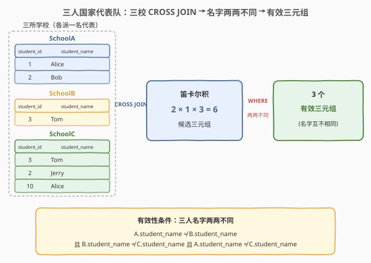
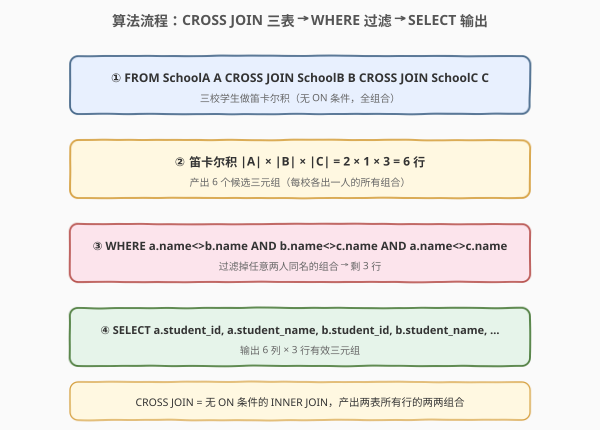
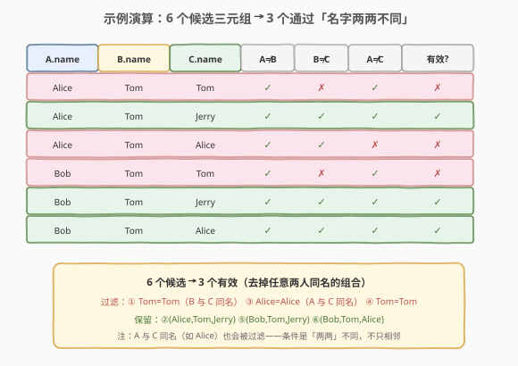

# 三人国家代表队

- **题目名称**：三人国家代表队
- **链接**：[1623. 三人国家代表队](https://leetcode.cn/problems/all-valid-triplets-that-can-represent-a-country/)
- **难度**：简单
- **标签**：SQL、CROSS JOIN、笛卡尔积、多表连接、不等连接

> ⚠️ 本题为 LeetCode **Plus 会员专享题**，官方题面需会员查看。下方题意按公开的表结构与样例用例重构：一个国家有三所学校，各派一名学生组成三人代表队，**当且仅当三名学生姓名两两不同**时该三元组有效。非会员无法在平台提交，但「多表笛卡尔积 + 不等连接」是 SQL 经典套路，值得掌握。

## 1. 题目概述

一个国家由三所学校 `SchoolA`、`SchoolB`、`SchoolC` 组成，每所学校各自一张表。编写 SQL 查询，找出所有**有效三元组** (A, B, C)：A 来自 `SchoolA`、B 来自 `SchoolB`、C 来自 `SchoolC`，且**三人姓名两两不同**（A.name ≠ B.name 且 B.name ≠ C.name 且 A.name ≠ C.name）。

**表结构**（三张表结构相同）：

```text
Table: SchoolA / SchoolB / SchoolC
+--------------+------------+
| Column Name  | Type       |
+--------------+------------+
| student_id   | int        |  ← 主键
| student_name | varchar    |
+--------------+------------+
```

> 💡 **关键约束**：`student_id` 是各表的主键（同表内唯一），但**三张表互相独立**——不同表可能出现相同 `student_id` 或相同 `student_name`（例如 `SchoolB` 和 `SchoolC` 都有 `id=3, name=Tom`）。题目要的是「每校各出一人」的所有组合中，**三人姓名互不相同**的那些。

**示例 1**：

```text
输入：
SchoolA 表:          SchoolB 表:        SchoolC 表:
+------------+-----+  +------------+---+  +------------+------+
| student_id | name|  | student_id | n |  | student_id | name |
+------------+-----+  +------------+---+  +------------+------+
| 1          |Alice|  | 3          |Tom|  | 3          |Tom   |
| 2          |Bob  |  +------------+---+  | 2          |Jerry |
|            |     |                       | 10         |Alice |
|            |     |                       +------------+------+
+------------+-----+

输出：
+-----+-----+-----+-----+-----+------+
| a_id| a_n | b_id| b_n | c_id| c_n  |
+-----+-----+-----+-----+-----+------+
| 1   |Alice| 3   |Tom  | 2   |Jerry |
| 2   |Bob  | 3   |Tom  | 2   |Jerry |
| 2   |Bob  | 3   |Tom  | 10  |Alice |
+-----+-----+-----+-----+-----+------+
（列名见下方说明，缩写仅为排版）
```

**解释**：

三校各出一人的全组合共 $2 \times 1 \times 3 = 6$ 个候选三元组，逐个检查「姓名两两不同」：

| # | A | B | C | 命中？ | 原因 |
|---|------|-----|-------|--------|------|
| ① | Alice | Tom | **Tom** | ✗ | B 与 C 同名（Tom=Tom） |
| ② | Alice | Tom | Jerry | ✓ | 三人互不相同 |
| ③ | Alice | Tom | **Alice** | ✗ | A 与 C 同名（Alice=Alice） |
| ④ | Bob | Tom | **Tom** | ✗ | B 与 C 同名 |
| ⑤ | Bob | Tom | Jerry | ✓ | 三人互不相同 |
| ⑥ | Bob | Tom | Alice | ✓ | 三人互不相同 |

最终保留 ②⑤⑥ 三行。注意 ③ 被过滤说明条件是「**两两**不同」而非「相邻不同」——A 与 C 即使不相邻，同名也要剔除。

**约束条件**：

- 每张表 `student_id` 为主键。
- 结果可按任意顺序返回。
- 输出 6 列，建议列名：`school_a_student_id, school_a_student_name, school_b_student_id, school_b_student_name, school_c_student_id, school_c_student_name`。

> 💡 本题是 SQL **多表笛卡尔积 + 不等连接**的入门母题——核心套路：`CROSS JOIN` 把三表全组合展开，再用 `WHERE` 三个 `<>` 不等条件过滤「姓名两两不同」。掌握「不等连接」这一范式，所有「在组合中排除同名/同值」类问题都能秒迁移。

---

## 2. 解题思路

### 2.1 暴力思路：过程式三重循环枚举

最直觉的做法是用过程式语言三重循环：外层遍历 `SchoolA`，中层遍历 `SchoolB`，内层遍历 `SchoolC`，对每个 (A, B, C) 组合检查三个姓名是否两两不同，是则输出。伪代码如下：

```text
for a in SchoolA:
    for b in SchoolB:
        for c in SchoolC:
            if a.name != b.name and b.name != c.name and a.name != c.name:
                emit (a.id, a.name, b.id, b.name, c.id, c.name)
```

但**纯 SQL 没有显式循环语句**——SQL 的思维是「集合操作」。上述「三表全组合 + 条件过滤」的模式，在 SQL 里有一个一一对应的语法：**`CROSS JOIN`（笛卡尔积）+ `WHERE` 不等条件**。

> ⚠️ 关键转换：把「三重循环枚举所有组合」翻译成 `SchoolA CROSS JOIN SchoolB CROSS JOIN SchoolC`（笛卡尔积，产出 $|A| \times |B| \times |C|$ 行）；把「检查姓名两两不同」翻译成 `WHERE a.name <> b.name AND b.name <> c.name AND a.name <> c.name`（三个不等条件 AND）。这是 SQL 思维方式与过程式思维方式的根本差异——**声明「要什么」而非「怎么做」**。

### 2.2 核心观察：CROSS JOIN + 三个不等条件



**两步合一**：

1. **`CROSS JOIN`**：把 `SchoolA`、`SchoolB`、`SchoolC` 三张表做笛卡尔积——每一行都是「三校各出一人」的一种组合，共 $|A| \times |B| \times |C|$ 行候选三元组。`CROSS JOIN` 不带 `ON` 条件，意味着「无条件配对」，即两表所有行的两两组合。
2. **`WHERE` 三个 `<>`**：在候选集上过滤，保留三人姓名两两不同的行。

$$\text{valid}(a,b,c) \iff (a.\text{name} \ne b.\text{name}) \land (b.\text{name} \ne c.\text{name}) \land (a.\text{name} \ne c.\text{name})$$

> 💡 **为什么需要三个不等式而不是两个？** 直觉上「相邻不同」(A≠B 且 B≠C) 似乎够了，但这样 A 与 C 仍可能同名（如示例 ③ Alice-Tom-Alice）。三人代表队要求**两两不同**，必须额外加 A≠C。这是本题最易踩的坑——少写一个条件就会多输出 A 与 C 同名的行。

> ⚠️ **`<>` vs `!=`**：SQL 标准的不等运算符是 `<>`；`!=` 虽被 MySQL/PostgreSQL 等广泛支持，但并非标准。面试与生产环境建议统一用 `<>`。

### 2.3 算法流程图



**逻辑执行顺序**（与书写顺序不同，是 SQL 初学者最易混淆的点）：

| 步骤 | 子句 | 作用 | 本题对应 |
|------|------|------|----------|
| ① | `FROM ... CROSS JOIN ...` | 确定数据源 + 笛卡尔积 | 三表全组合 → 6 行候选 |
| ② | `WHERE` | 行级过滤 | 三个 `<>` → 剩 3 行 |
| ③ | `SELECT` | 选输出列 | 输出 6 列（id+name × 3） |

> 💡 本题没有 `GROUP BY`/`HAVING`/`ORDER BY`。核心在于理解 `CROSS JOIN` 先把三表全组合展开，`WHERE` 再在不等条件上过滤——「先展开后过滤」是不等连接的固定骨架。

### 2.4 示例演算

以示例数据为例，观察 6 个候选三元组如何被三个不等条件逐一筛除：



| 候选 | A.name | B.name | C.name | A≠B | B≠C | A≠C | 有效? |
|------|--------|--------|--------|-----|-----|-----|-------|
| ① | Alice | Tom | Tom | ✓ | ✗ | ✓ | ✗ |
| ② | Alice | Tom | Jerry | ✓ | ✓ | ✓ | ✓ |
| ③ | Alice | Tom | Alice | ✓ | ✓ | ✗ | ✗ |
| ④ | Bob | Tom | Tom | ✓ | ✗ | ✓ | ✗ |
| ⑤ | Bob | Tom | Jerry | ✓ | ✓ | ✓ | ✓ |
| ⑥ | Bob | Tom | Alice | ✓ | ✓ | ✓ | ✓ |

> 💡 注意 ①④ 因 `B.name = C.name`（Tom=Tom）被过滤，③ 因 `A.name = C.name`（Alice=Alice）被过滤——三种「两两同名」情况各覆盖到。最终 6 → 3，与概念图一致。`A≠B` 列全为 ✓ 是因为示例里 `SchoolA` 没有 Tom，A 永远不等于 B；若 `SchoolA` 也有 Tom，则 `A≠B` 也会筛掉对应行。

---

## 3. 参考代码

### SQL（解法 A：CROSS JOIN + WHERE，推荐）

```sql
SELECT a.student_id   AS school_a_student_id,
       a.student_name AS school_a_student_name,
       b.student_id   AS school_b_student_id,
       b.student_name AS school_b_student_name,
       c.student_id   AS school_c_student_id,
       c.student_name AS school_c_student_name
FROM SchoolA a
CROSS JOIN SchoolB b
CROSS JOIN SchoolC c
WHERE a.student_name <> b.student_name
  AND b.student_name <> c.student_name
  AND a.student_name <> c.student_name;
```

> 💡 **写法要点**：
> - `CROSS JOIN` 不带 `ON`，产出三表笛卡尔积 $|A| \times |B| \times |C|$ 行候选。
> - 三个 `<>` 用 `AND` 连接，等价于「两两不同」。**少任一个都会出错**（见 2.2）。
> - 列别名 `school_a_student_id` 等用于消除三表同名列歧义——`student_id`/`student_name` 三表都有，`SELECT` 必须加表别名前缀（`a.student_id`）并在输出时重命名。
> - `FROM SchoolA a, SchoolB b, SchoolC c`（逗号连接）是 `CROSS JOIN` 的旧写法，语义等价但可读性差，现代 SQL 推荐显式 `CROSS JOIN`。

### SQL（解法 B：INNER JOIN … ON 直接带不等条件）

```sql
SELECT a.student_id   AS school_a_student_id,
       a.student_name AS school_a_student_name,
       b.student_id   AS school_b_student_id,
       b.student_name AS school_b_student_name,
       c.student_id   AS school_c_student_id,
       c.student_name AS school_c_student_name
FROM SchoolA a
JOIN SchoolB b  ON a.student_name <> b.student_name
JOIN SchoolC c  ON a.student_name <> c.student_name
               AND b.student_name <> c.student_name;
```

> 💡 **与解法 A 的区别**：把三个不等条件从 `WHERE` 搬进 `JOIN ... ON`，逻辑结果完全相同，但语义上是「**边连接边过滤**」——优化器可在生成连接结果时直接丢弃不满足 `ON` 的组合，无需先物化完整笛卡尔积再过滤。对大表能显著降低中间结果规模。`JOIN` 默认即 `INNER JOIN`。详见第 5.2 节。

### Python（pandas）

```python
import pandas as pd

def valid_triplets(school_a: pd.DataFrame, school_b: pd.DataFrame, school_c: pd.DataFrame) -> pd.DataFrame:
    a = school_a.rename(columns={'student_id': 'a_id', 'student_name': 'a_name'})
    b = school_b.rename(columns={'student_id': 'b_id', 'student_name': 'b_name'})
    c = school_c.rename(columns={'student_id': 'c_id', 'student_name': 'c_name'})
    df = a.merge(b, how='cross').merge(c, how='cross')
    mask = (
        (df['a_name'] != df['b_name'])
        & (df['b_name'] != df['c_name'])
        & (df['a_name'] != df['c_name'])
    )
    return (
        df[mask]
        .rename(columns={
            'a_id': 'school_a_student_id', 'a_name': 'school_a_student_name',
            'b_id': 'school_b_student_id', 'b_name': 'school_b_student_name',
            'c_id': 'school_c_student_id', 'c_name': 'school_c_student_name',
        })
        [['school_a_student_id', 'school_a_student_name',
          'school_b_student_id', 'school_b_student_name',
          'school_c_student_id', 'school_c_student_name']]
    )
```

> 💡 **pandas 对照**：`merge(how='cross')` 对应 SQL 的 `CROSS JOIN`（笛卡尔积，需 pandas ≥ 1.2）；预先 `rename` 把三表的同名列改成 `a_name/b_name/c_name` 避免合并后列名冲突（对应 SQL 的表别名前缀 `a.student_name`）；布尔掩码 `&` 串联三个 `!=` 对应 `WHERE ... AND ... AND ...`。

---

## 4. 复杂度分析

| 维度 | 复杂度 | 说明 |
|------|--------|------|
| **时间（解法 A）** | $O(|A| \cdot |B| \cdot |C|)$ | 笛卡尔积需生成全部 $N = |A| \times |B| \times |C|$ 行候选，每行 $O(1)$ 三个不等比较。无索引可加速 `<>` 比较，只能全扫 |
| **时间（解法 B）** | $O(|A| \cdot |B| \cdot |C|)$ 最坏 | 把不等条件推入 `ON`，优化器可边连接边丢弃，中间结果更小；但 `<>` 仍无法用 B 树索引，最坏仍是全组合 |
| **空间** | $O(N)$ | 解法 A 需物化完整笛卡尔积中间结果；解法 B 中间结果更小。输出 $O(k)$，$k$ = 有效三元组数 |
| **结果行数** | $O(k)$，$0 \le k \le N$ | $k$ = 姓名两两不同的三元组数，上界为 $N = |A| \times |B| \times |C|$ |

> ⚠️ **笛卡尔积爆炸风险**：行数为三表行数的**乘积**——若三表各 $10^3$ 行，候选集达 $10^9$ 行，内存与时间都不可接受。本题约束规模小，安全；生产环境对大表做笛卡尔积前，务必先用等值/范围条件缩小各表，或把过滤条件推入 `JOIN ON`（解法 B）。`<>` 不等条件**无法用 B 树索引加速**，这点与等值连接（`=`）截然不同（见第 5.3 节）。

---

## 5. 扩展

### 5.1 CROSS JOIN 的三种等价写法

```sql
-- 写法 1：显式 CROSS JOIN（推荐，语义最清晰）
SELECT ... FROM SchoolA a CROSS JOIN SchoolB b CROSS JOIN SchoolC c;

-- 写法 2：逗号连接（旧式 SQL，等价但易与漏写 WHERE 混淆）
SELECT ... FROM SchoolA a, SchoolB b, SchoolC c;

-- 写法 3：INNER JOIN ... ON TRUE（用恒真 ON 把 INNER JOIN 退化为笛卡尔积）
SELECT ... FROM SchoolA a JOIN SchoolB b ON TRUE JOIN SchoolC c ON TRUE;
```

> 💡 三者结果相同。`CROSS JOIN` 是「无 `ON`」的 `INNER JOIN`；`INNER JOIN ... ON TRUE` 是显式写一个恒真条件让 `INNER JOIN` 无过滤。现代 SQL 推荐**写法 1**——`CROSS JOIN` 关键字自带「我就是要笛卡尔积」的语义，避免读者误以为漏写了 `ON`。

### 5.2 WHERE 里过滤 vs ON 里过滤：解法 A vs 解法 B

`INNER JOIN` 的 `ON` 条件与 `WHERE` 条件在**内连接**下逻辑等价——最终结果集相同。但物理执行有别：

| 维度 | 解法 A（`CROSS JOIN` + `WHERE`） | 解法 B（`JOIN ON` 带不等） |
|------|----------------------------------|---------------------------|
| 语义 | 先物化完整笛卡尔积，再过滤 | 边连接边过滤，连接时即丢弃不满足 `ON` 的行 |
| 中间结果 | $O(|A| \times |B| \times |C|)$ 全量 | 可远小于全量（取决于 `ON` 选择性） |
| 优化器 | 现代优化器通常会自动把 `WHERE` 谓词下推到连接，使两者执行计划趋同 | 显式表达「连接谓词」，意图更清晰 |
| 可读性 | 「先展开后过滤」概念直观 | 谓词与连接绑定，更接近关系代数 |

> 💡 对 `<>` 这类**非选择性强**的谓词（命中率高，过滤率低），两种写法实际中间结果差异不大；但养成「连接条件进 `ON`、过滤行进 `WHERE`」的习惯，对大表与高选择性谓词收益明显。本题因规模小，两者皆可。

### 5.3 弱条件 vs 强条件：「不全同名」≠「两两不同」

易混淆的两种约束：

| 条件 | SQL 表达 | 排除情况 | 示例 ③ (Alice,Tom,Alice) |
|------|----------|----------|---------------------------|
| **两两不同**（本题） | `a<>b AND b<>c AND a<>c` | 任意两人同名都排除 | ✗ 排除（A=C） |
| **不全同名**（弱条件） | `NOT(a=b AND b=c)` | 仅排除三人全同名 | ✓ 保留（允许两人同名） |

> ⚠️ `NOT(a=b AND b=c)` 只在三人姓名**完全相同**时才过滤——若两人同名、第三人不同则放行。这与本题「两两不同」语义不同，会多输出 ①③④ 三行。面试时务必听清题目要求的是「两两不同」还是「不全相同」，差一个条件答案全变。

### 5.4 不等连接 vs 等值连接：索引能用吗？

| 连接类型 | 谓词 | B 树索引加速 | 典型题 |
|----------|------|--------------|--------|
| 等值连接 | `a.id = b.id` | ✓ 可走索引查找 | 175. 组合两个表 |
| 不等连接 | `a.name <> b.name` | ✗ 无法用索引（需全扫） | **本题**、197. 上升的温度 |
| 范围连接 | `a.date > b.date` | △ 可用索引范围扫 | 197. 上升的温度 |

> 💡 `<>` 对索引极不友好——B 树索引擅长等值与范围定位，对「不等于」只能全表扫描（因为匹配行散布全表）。本题三表规模小无所谓；若大表上做不等连接，需重新设计（如先 `GROUP BY` 名字、用反连接排除同名对）以避免 $O(N^2)$ 笛卡尔积。

---

## 6. 面试要点

1. **`CROSS JOIN` 和 `INNER JOIN` 有什么关系？**

   - `CROSS JOIN` 是「不带 `ON` 条件」的连接，产出两表所有行的两两组合（笛卡尔积），共 $|A| \times |B|$ 行。`INNER JOIN ... ON cond` 只保留满足 `cond` 的组合。当 `ON` 为恒真（`ON TRUE`）时 `INNER JOIN` 退化为 `CROSS JOIN`。本题三表无天然关联键，需用 `CROSS JOIN` 先展开全组合。

2. **为什么需要三个 `<>` 条件，两个不行吗？**

   - 「两两不同」要求任意两人姓名都不相同。`A≠B` 且 `B≠C` 只保证相邻不同，A 与 C 仍可能同名（如示例 ③ Alice-Tom-Alice）。必须再加 `A≠C` 才能排除「非相邻同名」。这是本题最常踩的坑——漏写 `A<>C` 会多输出 A、C 同名的行。

3. **`<>` 和 `!=` 有区别吗？该用哪个？**

   - 语义相同（都表示不等于）。`<>` 是 SQL 标准运算符；`!=` 是非标准但被 MySQL、PostgreSQL 等广泛支持的扩展。面试与跨数据库的生产代码建议用 `<>` 以保证可移植性；SQL Server、Oracle 也都支持 `<>`。

4. **解法 A 的 `WHERE` 和解法 B 的 `ON` 在内连接下等价吗？**

   - 对 `INNER JOIN`，`ON` 与 `WHERE` 的过滤逻辑等价——最终结果集相同。区别在语义与执行：`ON` 是「连接谓词」（边连接边过滤），`WHERE` 是「行过滤」（先连接再过滤）。现代优化器通常会把 `WHERE` 谓词下推到连接算子，使两者执行计划趋同。但对 `LEFT JOIN` 两者**不等价**——`ON` 只影响右表匹配（不匹配则右表填 NULL），`WHERE` 会过滤掉整行。

5. **笛卡尔积在大表上有什么风险？如何缓解？**

   - 行数是各表行数的**乘积**，三表各 $10^4$ 行即 $10^{12}$ 行，内存与时间都不可接受。缓解：① 把过滤谓词推入 `JOIN ON`，边连接边丢弃（解法 B）；② 先对各表用等值/范围条件缩小（子查询过滤后再连接）；③ `<>` 不等条件无法用 B 树索引，必要时改用反连接（`LEFT JOIN ... WHERE右表.id IS NULL`）或先 `GROUP BY` 名字排除同名对，避免 $O(N^2)$ 全组合。

> 💡 **一句话总结**：1623 是 SQL **多表笛卡尔积 + 不等连接**的入门母题——核心就 `CROSS JOIN` 三表展开全组合、`WHERE` 三个 `<>` 过滤「姓名两两不同」。最大要点：**三个不等条件一个不能少**（尤其易漏 `A<>C`），且 `<>` 不等连接无法用索引、大表慎用笛卡尔积。

---

## 7. 同类练习题

- [197. 上升的温度](https://leetcode.cn/problems/rising-temperature/)：自连接 + 不等条件 `a.temperature > b.temperature`，不等连接的经典入门题，与 1623 同属「`<>`/`>` 连接」家族
- [175. 组合两个表](https://leetcode.cn/problems/combine-two-tables/)：最基础的两表 `LEFT JOIN`，对照 1623 理解「等值连接（带 `ON`）」与「笛卡尔积（无 `ON`）」的区别
- [1581. 进店却未进行过交易的顾客](https://leetcode.cn/problems/customer-who-visited-but-did-not-make-any-transactions/)：多表 `LEFT JOIN` + `IS NULL` 反连接，另一种「在组合中排除匹配」的范式
- [196. 删除重复的电子邮箱](https://leetcode.cn/problems/delete-duplicate-emails/)：自连接 + 不等条件 `a.email = b.email AND a.id > b.id` 处理同名重复，对照 1623 的「排除同名」思路
- [607. 销售员](https://leetcode.cn/problems/sales-person/)：多表 `JOIN` + `NOT IN` 排除特定组合，与 1623 同为「组合 + 过滤」的多表查询范式
