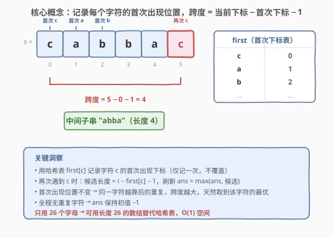
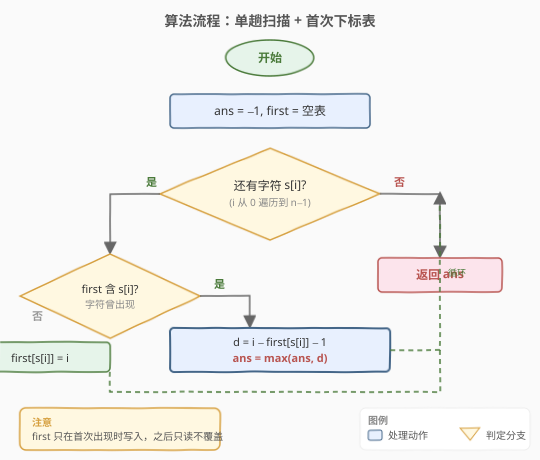
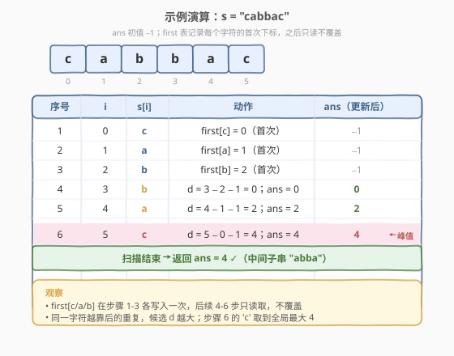

# 两个相同字符之间的最长子字符串

- **题目名称**：两个相同字符之间的最长子字符串
- **链接**：[1624. 两个相同字符之间的最长子字符串](https://leetcode.cn/problems/largest-substring-between-two-equal-characters/)
- **难度**：简单
- **标签**：哈希表、字符串

## 1. 题目概述

给你一个字符串 `s`，请你返回 **两个相同字符之间的最长子字符串的长度**，计算长度时**不含这两个字符**。如果不存在这样的子字符串，返回 `-1`。

**子字符串**是字符串中的一个连续字符序列。

**示例 1**：

```text
输入：s = "aa"
输出：0
解释：最优的子字符串是两个 'a' 之间的空子字符串。
```

**示例 2**：

```text
输入：s = "abca"
输出：2
解释：最优的子字符串是 "bc"。
```

**示例 3**：

```text
输入：s = "cbzxy"
输出：-1
解释：s 中不存在出现两次的字符，所以返回 -1。
```

**示例 4**：

```text
输入：s = "cabbac"
输出：4
解释：最优的子字符串是 "abba"，其他的非最优解包括 "bb" 和 ""。
```

**约束条件**：

- `1 <= s.length <= 300`
- `s` 只含小写英文字母

## 2. 解题思路

### 2.1 暴力思路：枚举所有相同字符对

对每一对下标 `(i, j)`（`i < j`），若 `s[i] == s[j]`，则中间子串长度为 `j - i - 1`，取所有这些长度的最大值。双重循环 $O(n^2)$，对 $n = 300$ 完全可过，但**没有利用"同一字符只需关心最远一对"这一结构**。

### 2.2 核心观察：首次下标表 + 单趟扫描



关键观察：**对同一个字符 `c`，跨度 `j - i - 1` 在 `i` 取最小（首次出现）、`j` 取最大（最后一次出现）时达到最大**。因此只需：

- 用一个表 `first` 记录每个字符的**首次**出现下标（之后**只读不覆盖**）；
- 扫描时若 `s[i]` 已在 `first` 中，说明它是重复出现，候选长度 `d = i - first[s[i]] - 1`，刷新 `ans = max(ans, d)`。

> 💡 为什么 `first` 不覆盖？因为首次下标越小，`i - first - 1` 越大。保留最早的那次，后续每次重复都能算出"以当前为右端点、以最早那次为左端点"的跨度——这正是该字符截至目前的最大跨度。扫到末尾时自然取到全局最优。

> ⚠️ 若全程没有任何字符重复，`ans` 保持初值 `-1`，直接返回即可（对应示例 3）。

### 2.3 算法流程图



```text
1. ans = -1, first = 空表
2. 逐字符扫描 s[i]（i 从 0 到 n-1）：
   a. 若 s[i] 已在 first 中：
      d = i - first[s[i]] - 1
      ans = max(ans, d)
   b. 否则：
      first[s[i]] = i          # 仅首次写入
3. 返回 ans
```

### 2.4 示例演算



以 `s = "cabbac"`（示例 4）为例，初值 `ans = -1`：

| 序号 | i | s[i] | 动作 | ans（更新后） |
|------|---|------|------|---------------|
| 1 | 0 | `c` | `first[c] = 0`（首次） | -1 |
| 2 | 1 | `a` | `first[a] = 1`（首次） | -1 |
| 3 | 2 | `b` | `first[b] = 2`（首次） | -1 |
| 4 | 3 | `b` | `d = 3 - 2 - 1 = 0`；`ans = 0` | 0 |
| 5 | 4 | `a` | `d = 4 - 1 - 1 = 2`；`ans = 2` | 2 |
| 6 | 5 | `c` | `d = 5 - 0 - 1 = 4`；`ans = 4` | **4** ← 峰值 |

扫描结束返回 `ans = 4` ✓，对应中间子串 `"abba"`（下标 1 到 4）。

## 3. 参考代码

### C++

```cpp
class Solution {
public:
    int maxLengthBetweenEqualCharacters(string s) {
        int first[26];
        memset(first, -1, sizeof(first));
        int ans = -1;
        for (int i = 0; i < (int)s.size(); ++i) {
            int c = s[i] - 'a';
            if (first[c] != -1) {
                ans = max(ans, i - first[c] - 1);
            } else {
                first[c] = i;
            }
        }
        return ans;
    }
};
```

### Python

```python
class Solution:
    def maxLengthBetweenEqualCharacters(self, s: str) -> int:
        first = {}
        ans = -1
        for i, c in enumerate(s):
            if c in first:
                ans = max(ans, i - first[c] - 1)
            else:
                first[c] = i
        return ans
```

> 💡 题目限定 `s` 只含小写字母，故 C++ 用长度 26 的数组代替哈希表，`-1` 表示"未出现"。Python 直接用字典即可；若想统一为数组，可用 `[−1] * 26` 配 `ord(c) - 97` 下标。

## 4. 复杂度分析

| 维度 | 复杂度 | 说明 |
|------|--------|------|
| 时间复杂度 | $O(n)$ | 单趟扫描，每个字符 `O(1)` 查表/写表 |
| 空间复杂度 | $O(1)$ | `first` 表固定 26 个字母，与 `n` 无关 |

> 💡 对 $n = 300$ 的约束，$O(n)$ 绰绰有余；即便 $n$ 放大到 $10^7$，本解法仍是线性最优。

## 5. 扩展：记录首次与末次的等价写法

既然同一字符的最优跨度由"首次 + 末次"决定，也可一遍扫描同时记录每个字符的**首次**和**末次**下标，最后遍历 26 个字母取 `last[c] - first[c] - 1` 的最大值。逻辑等价，只是把"边扫边更新 ans"改成"扫完再统一取 max"：

```cpp
class Solution {
public:
    int maxLengthBetweenEqualCharacters(string s) {
        int first[26], last[26];
        memset(first, -1, sizeof(first));
        memset(last, -1, sizeof(last));
        for (int i = 0; i < (int)s.size(); ++i) {
            int c = s[i] - 'a';
            if (first[c] == -1) first[c] = i;
            last[c] = i;
        }
        int ans = -1;
        for (int c = 0; c < 26; ++c) {
            if (first[c] != -1 && last[c] != first[c]) {
                ans = max(ans, last[c] - first[c] - 1);
            }
        }
        return ans;
    }
};
```

> 💡 **两种写法如何选？** 边扫边更新只需一个 `first` 表、常数更小；首末表写法更直观地体现"最远一对"的几何含义。面试中两种都说明，体现你对同一结构的多种编码视角。

## 6. 面试要点

**Q1：为什么 `first` 表只写一次、之后不覆盖？**
> 跨度 `i - first - 1` 中，`first` 越小结果越大。首次出现下标是该字符能达到的最小左端点，覆盖它只会让后续计算的跨度变小。保留最早那次，每次重复都用"最早左端点 vs 当前右端点"，天然取到该字符的最大跨度。

**Q2：为什么暴力 $O(n^2)$ 也能过，还要写 $O(n)$？**
> $n = 300$ 时 $O(n^2)$ 约 $9 \times 10^4$ 次比较，确实可过。但本题的"首次下标"思想是哈希表降低重复查询的通用范式——一旦 `n` 放大或字符集变大（如 Unicode），$O(n)$ 解法的优势立刻显现。面试中应主动给出最优解并说明动机。

**Q3：用数组还是哈希表？**
> 字符集已知且小（26 个小写字母）→ 数组 `first[26]` 更快、更省内存，用 `-1` 哨兵表示"未出现"。字符集未知或很大（如任意 ASCII/Unicode）→ 哈希表 `unordered_map`/`dict`。两者本质相同，选型取决于字符集大小。

**Q4：`ans` 初值为什么是 `-1` 而不是 `0`？**
> 题目要求"不存在这样的子字符串时返回 `-1`"。若全程无字符重复，`ans` 不会被任何 `max` 更新，保持 `-1` 直接返回即符合题意。若初值用 `0`，则会把"无重复"与"两个相同字符相邻（如 `"aa"` 中间空串长度 0）"两种情况混淆，需额外标志位区分，不简洁。

**Q5：和"最长无重复子串"（[3. 无重复字符的最长子串](../0001-0100/3_无重复字符的最长子串.md)）的区别？**
> 第 3 题求的是"窗口内字符各不相同"的最长窗口，遇到重复要**收缩左端**并**更新左端到更靠后的位置**；本题求的是"两个相同字符之间"的最长跨度，遇到重复**不动首次下标**、只用它算跨度。两者都用哈希表记下标，但首次下标"是否覆盖"恰好相反——对比理解能加深对哈希表记录语义的把握。

## 7. 同类练习题

- [3. 无重复字符的最长子串](https://leetcode.cn/problems/longest-substring-without-repeating-characters/)（[题解](../0001-0100/3_无重复字符的最长子串.md)）：同样用哈希表记录字符下标，但首次下标需随窗口收缩而覆盖，对照"何时覆盖、何时不覆盖"
- [1. 两数之和](https://leetcode.cn/problems/two-sum/)（[题解](../0001-0100/1_两数之和.md)）：哈希表"边扫边查"的入门模板，本题是其"记录下标 + 单趟查询"思想的延伸
- [219. 存在重复元素 II](https://leetcode.cn/problems/contains-duplicate-ii/)：哈希表记录下标判定"相同元素间距 ≤ k"，与本题"求最大间距"互为镜像
- [242. 有效的字母异位词](https://leetcode.cn/problems/valid-anagram/)：用长度 26 的频次数组处理小写字母，体会"字符集小→数组替代哈希表"的选型
