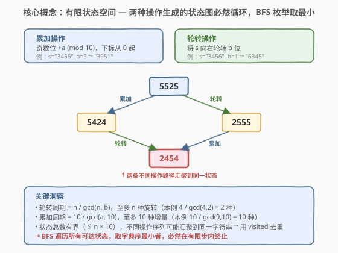
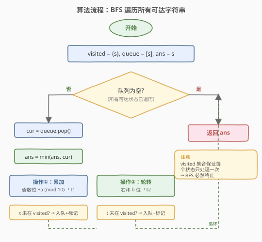
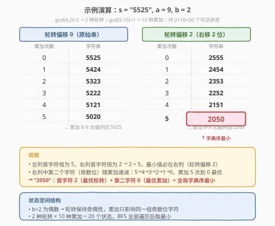

# 执行操作后字典序最小的字符串

- **题目名称**：执行操作后字典序最小的字符串
- **链接**：[1625. 执行操作后字典序最小的字符串](https://leetcode.cn/problems/lexicographically-smallest-string-after-applying-operations/)
- **难度**：中等
- **标签**：广度优先搜索、字符串、哈希表

## 1. 题目概述

给你一个字符串 `s` 以及两个整数 `a` 和 `b`。其中，字符串 `s` 的长度为偶数，且仅由数字 `0` 到 `9` 组成。

你可以在 `s` 上按任意顺序多次执行下面两个操作之一：

- **累加**：将 `a` 加到 `s` 中所有下标为奇数的元素上（下标从 0 开始）。当数字超过 `9` 时，从 `0` 重新循环计算。例如，`s = "3456"` 且 `a = 5`，则执行此操作后 `s` 变成 `"3951"`。
- **轮转**：将 `s` 向右轮转 `b` 位。例如，`s = "3456"` 且 `b = 1`，则执行此操作后 `s` 变成 `"6345"`。

请你返回在 `s` 上执行上述操作任意次后可以得到的**字典序最小**的字符串。

**示例 1**：

```text
输入：s = "5525", a = 9, b = 2
输出："2050"
解释：执行操作如下：
初态："5525" → 轮转："2555" → 累加："2454" → 累加："2353"
→ 轮转："5323" → 累加："5222" → 累加："5121" → 轮转："2151" → 累加："2050"
无法获得字典序小于 "2050" 的字符串。
```

**示例 2**：

```text
输入：s = "74", a = 5, b = 1
输出："24"
解释：初态 "74" → 轮转 "47" → 累加 "42" → 轮转 "24"
```

**示例 3**：

```text
输入：s = "0011", a = 4, b = 2
输出："0011"
解释：无法获得字典序小于 "0011" 的字符串。
```

**约束条件**：

- `2 <= s.length <= 100`
- `s.length` 是偶数
- `s` 仅由数字 `0` 到 `9` 组成
- `1 <= a <= 9`
- `1 <= b <= s.length - 1`

## 2. 解题思路

### 2.1 暴力思路：枚举操作序列

最朴素的思路是枚举所有可能的操作序列（累加/轮转的任意组合），对每个序列模拟执行后得到字符串，取字典序最小。但操作序列长度没有上限——可以执行任意多次操作，因此直接枚举序列是**不可行的**（搜索空间无限）。

关键问题在于：操作可以无限执行，但字符串状态是否会**重复**？如果能证明状态空间有限，就能用 BFS 遍历所有可达状态。

### 2.2 核心观察：有限状态空间上的 BFS



两种操作各自具有**循环性**，使得状态空间天然有界：

1. **轮转的周期**：将 `s` 向右轮转 `b` 位，连续轮转 $k$ 次等价于轮转 $kb \bmod n$ 位。轮转的周期为 $n / \gcd(n, b)$——轮转这么多次后回到原始排列。因此**至多产生 $n / \gcd(n, b) \le n$ 种不同的旋转**。

2. **累加的周期**：对奇数位加 $a$，连续累加 $k$ 次等价于加 $ka \bmod 10$。周期为 $10 / \gcd(a, 10)$——**至多产生 $10$ 种不同的增量**。

3. **状态的汇聚**：不同的操作序列可能到达**同一个字符串**（如先累加再轮转 vs 先轮转再累加可能殊途同归），因此需要 `visited` 集合去重。

> 💡 两种操作的组合状态总数有界：至多 $n \times 10 = 1000$ 种（$b$ 为偶数时）或 $n \times 10 \times 10 = 10000$ 种（$b$ 为奇数时，奇偶位可独立累加，详见第 5 节）。对 $n \le 100$，BFS 在有限步内必然遍历完所有可达状态。

> ⚠️ 关键在于不要把问题想成"枚举操作序列"（无限），而要转化为"枚举可达状态"（有限）。这正是 BFS + visited 去重的经典应用场景。

### 2.3 算法流程图



```text
1. 初始化：visited = {s}, queue = [s], ans = s
2. 当队列非空：
   a. cur = queue.pop()
   b. ans = min(ans, cur)
   c. 操作① 累加：对 cur 的奇数位各加 a (mod 10) → t1
      若 t1 ∉ visited：visited.add(t1), queue.push(t1)
   d. 操作② 轮转：cur 右移 b 位 → t2
      若 t2 ∉ visited：visited.add(t2), queue.push(t2)
3. 返回 ans
```

### 2.4 示例演算



以 `s = "5525", a = 9, b = 2` 为例（示例 1），分析状态空间结构：

- $n = 4, b = 2, \gcd(4, 2) = 2$ → 轮转周期 $= 4/2 = 2$，有 2 种旋转：偏移 0（`"5525"`）和偏移 2（`"2555"`）。
- $\gcd(9, 10) = 1$ → 累加周期 $= 10$，奇数位增量 $0, 9, 8, 7, 6, 5, 4, 3, 2, 1$（即 $k \times 9 \bmod 10$）。
- $b = 2$ 为偶数 → 轮转保持奇偶性，累加始终只影响同一组奇数位字符。

| 轮转偏移 | 累加次数 | 奇数位增量 | 字符串 |
|---------|---------|-----------|--------|
| 0 | 0 | +0 | `5525` |
| 0 | 1 | +9 | `5424` |
| 0 | 2 | +8 | `5323` |
| 0 | 3 | +7 | `5222` |
| 0 | 4 | +6 | `5121` |
| 0 | 5 | +5 | `5020` |
| 0 | 6–9 | … | `5929`…`5626`（循环回 `5525`） |
| **2** | 0 | +0 | `2555` |
| **2** | 1 | +9 | `2454` |
| **2** | 2 | +8 | `2353` |
| **2** | 3 | +7 | `2252` |
| **2** | 4 | +6 | `2151` |
| **2** | **5** | **+5** | **`2050`** ← 最小 |
| **2** | 6–9 | … | `2959`…`2656`（循环回 `2555`） |

**分析**：偏移 0 的首字符恒为 `5`，偏移 2 的首字符恒为 `2`。由于 $2 < 5$，最小值必在偏移 2 的轨道中。该轨道内第二个字符（奇数位）随累加递减 `5→4→3→2→1→0`，累加 5 次到 `0` 最优。因此 `"2050"` 是全局字典序最小。

## 3. 参考代码

### C++

```cpp
class Solution {
public:
    string findLexSmallestString(string s, int a, int b) {
        unordered_set<string> visited;
        queue<string> q;
        q.push(s);
        visited.insert(s);
        string ans = s;
        int n = s.size();
        while (!q.empty()) {
            string cur = q.front();
            q.pop();
            ans = min(ans, cur);
            // 操作①：累加 — 奇数位 +a (mod 10)
            string t1 = cur;
            for (int i = 1; i < n; i += 2) {
                t1[i] = '0' + (t1[i] - '0' + a) % 10;
            }
            if (!visited.count(t1)) {
                visited.insert(t1);
                q.push(t1);
            }
            // 操作②：轮转 — 右移 b 位
            string t2 = cur.substr(n - b) + cur.substr(0, n - b);
            if (!visited.count(t2)) {
                visited.insert(t2);
                q.push(t2);
            }
        }
        return ans;
    }
};
```

### Python

```python
class Solution:
    def findLexSmallestString(self, s: str, a: int, b: int) -> str:
        from collections import deque
        visited = {s}
        queue = deque([s])
        ans = s
        n = len(s)
        while queue:
            cur = queue.popleft()
            if cur < ans:
                ans = cur
            # 操作①：累加 — 奇数位 +a (mod 10)
            chars = list(cur)
            for i in range(1, n, 2):
                chars[i] = str((int(chars[i]) + a) % 10)
            t1 = ''.join(chars)
            if t1 not in visited:
                visited.add(t1)
                queue.append(t1)
            # 操作②：轮转 — 右移 b 位
            t2 = cur[-b:] + cur[:-b]
            if t2 not in visited:
                visited.add(t2)
                queue.append(t2)
        return ans
```

> 💡 **实现细节**：C++ 中 `substr(n-b)` 取末尾 `b` 个字符，`substr(0, n-b)` 取前 `n-b` 个字符，拼接即为右移 `b` 位。Python 中 `cur[-b:] + cur[:-b]` 更简洁。两者等价。

> ⚠️ 注意 `%` 运算：`(int(chars[i]) + a) % 10` 保证结果在 `0–9` 范围内。C++ 中 `int` 的 `%` 对正数无符号问题，直接用即可。

## 4. 复杂度分析

| 维度 | 复杂度 | 说明 |
|------|--------|------|
| 时间复杂度 | $O(n \cdot S)$ | $S$ 为可达状态数，每个状态需 $O(n)$ 构造两个后继字符串 |
| 空间复杂度 | $O(n \cdot S)$ | `visited` 集合存储所有可达字符串，每条 $O(n)$ |

其中 $S$ 的上界取决于 $b$ 的奇偶性：

- **$b$ 为偶数**（轮转保持奇偶性）：$S \le \dfrac{n}{\gcd(n, b)} \times \dfrac{10}{\gcd(a, 10)} \le n \times 10$。对 $n = 100$，$S \le 1000$。
- **$b$ 为奇数**（轮转交换奇偶性）：$S \le \dfrac{n}{\gcd(n, b)} \times \left(\dfrac{10}{\gcd(a, 10)}\right)^2 \le n \times 100$。对 $n = 100$，$S \le 10000$。

> 💡 即便最坏情况 $S = 10000$、$n = 100$，总操作量约 $10^6$，远在时间限制内。BFS 的优势在于**无需分析 $b$ 奇偶性等细节**，代码统一、正确性直观。

## 5. 扩展：按 $b$ 奇偶性分情况的直接枚举

BFS 是通解，无需区分情况。但若追求更优常数，可利用 $b$ 的奇偶性直接枚举所有候选字符串，跳过 BFS 的队列开销：

### 5.1 $b$ 为偶数：奇偶位独立

$b$ 为偶数时，轮转操作将偶数位映射到偶数位、奇数位映射到奇数位。因此**累加只影响同一组奇数位字符**，状态空间为"轮转偏移 × 奇数位增量"的二维网格：

- 枚举 $n / \gcd(n, b)$ 种轮转偏移；
- 对每种偏移，枚举 $10 / \gcd(a, 10)$ 种奇数位增量 $k \cdot a \bmod 10$；
- 对每个组合构造字符串，取最小。

### 5.2 $b$ 为奇数：奇偶位均可累加

$b$ 为奇数时，轮转会交换奇偶位——原偶数位字符可以移到奇数位被累加，反之亦然。因此**偶数位和奇数位各有独立的增量**，状态空间为"轮转偏移 × 偶数位增量 × 奇数位增量"的三维网格：

- 枚举 $n / \gcd(n, b)$ 种轮转偏移；
- 枚举偶数位增量 $k_1 \cdot a \bmod 10$（$10 / \gcd(a, 10)$ 种）；
- 枚举奇数位增量 $k_2 \cdot a \bmod 10$（$10 / \gcd(a, 10)$ 种）；
- 对每个组合构造字符串，取最小。

> 💡 **直觉解释**：$b$ 为奇数时，可以先累加（影响当前奇数位），再轮转一次（交换奇偶位），再累加（影响原偶数位），再轮转回来。如此一来，偶数位和奇数位的增量可以**独立控制**。

```cpp
class Solution {
public:
    string findLexSmallestString(string s, int a, int b) {
        int n = s.size();
        string ans = s;
        int g = gcd(n, b);
        int rotCount = n / g;          // 轮转偏移种数
        int addCount = 10 / gcd(a, 10); // 累加增量种数

        for (int r = 0; r < rotCount; ++r) {
            int offset = r * g;
            if (b % 2 == 0) {
                // b 偶：只累加奇数位
                for (int k = 0; k < addCount; ++k) {
                    int addOdd = k * a % 10;
                    string t = build(s, offset, 0, addOdd);
                    ans = min(ans, t);
                }
            } else {
                // b 奇：偶数位、奇数位均可独立累加
                for (int k1 = 0; k1 < addCount; ++k1) {
                    int addEven = k1 * a % 10;
                    for (int k2 = 0; k2 < addCount; ++k2) {
                        int addOdd = k2 * a % 10;
                        string t = build(s, offset, addEven, addOdd);
                        ans = min(ans, t);
                    }
                }
            }
        }
        return ans;
    }

private:
    string build(const string& s, int offset, int addEven, int addOdd) {
        int n = s.size();
        string t(n, '0');
        for (int i = 0; i < n; ++i) {
            int src = (i + offset) % n;   // 位置 i 的字符来自原位置 src
            int d = s[src] - '0';
            d += (i % 2 == 0) ? addEven : addOdd;
            t[i] = '0' + d % 10;
        }
        return t;
    }
};
```

> ⚠️ **如何选解法？** 面试中优先写 BFS——正确性直观、不区分 $b$ 奇偶性、代码简洁。若面试官追问"能否更优"或"状态空间多大"，再展开分情况分析，体现对问题结构的深入理解。

## 6. 面试要点

**Q1：为什么不能直接枚举操作序列？**
> 操作可以执行任意多次，操作序列的长度无上限，搜索空间无限。但不同操作序列可能到达同一个字符串（状态汇聚），因此**状态数**远小于**序列数**。关键转化：从"枚举序列"变为"枚举状态"——状态空间有限，BFS 可遍历。

**Q2：状态空间为什么是有限的？**
> 两种操作各有周期性：轮转的周期为 $n / \gcd(n, b)$，累加的周期为 $10 / \gcd(a, 10)$。组合后状态总数有界（$\le n \times 100$），BFS 配合 `visited` 集合必然在有限步内终止。

**Q3：BFS 和 DFS 都能遍历所有状态，为什么选 BFS？**
> 本题只需遍历所有可达状态取最小值，不关心到达顺序，BFS 和 DFS 都正确。选 BFS 是因为队列的迭代写法更直观，且不会栈溢出。实际上用 DFS（栈或递归 + visited）也能 AC，时间复杂度相同。

**Q4：$b$ 的奇偶性对状态空间有什么影响？**
> $b$ 为偶数时，轮转保持奇偶性，累加只影响同一组奇数位字符，状态数为"轮转数 × 累加数"（$\le n \times 10$）。$b$ 为奇数时，轮转交换奇偶性，偶数位和奇数位可被独立累加，状态数为"轮转数 × 累加数²"（$\le n \times 100$）。BFS 无需区分，但分情况枚举可减少常数。

**Q5：`visited` 集合为什么必须用？**
> 状态图中不同操作路径会汇聚到同一字符串（如"先累加再轮转"和"先轮转再累加"可能到达同一状态）。没有 `visited` 会导致重复入队、无限循环。`visited` 保证每个状态只处理一次，是 BFS 在有限图上正确终止的前提。

## 7. 同类练习题

- [752. 打开转盘锁](https://leetcode.cn/problems/open-the-lock/)：BFS + visited 遍历状态空间的经典题，每个状态有 8 个后继（4 位各 ±1），思路与本题"枚举可达状态取目标"完全一致
- [773. 滑动谜题](https://leetcode.cn/problems/sliding-puzzle/)：2×3 拼图的状态空间 BFS，将棋盘序列化为字符串作为 visited 键，与本题用字符串本身作为状态异曲同工
- [1654. 到 K 个目标的最少跳跃次数](https://leetcode.cn/problems/minimum-jumps-to-reach-home/)：BFS + visited 去重，状态为位置 × 方向，与本题"状态有界 → BFS"的范式相同，但需要剪枝上界
- [864. 获取所有钥匙的最短路径](https://leetcode.cn/problems/shortest-path-to-get-all-keys/)：BFS 状态压缩，状态为"位置 × 持有钥匙集合"，与本题"有限状态空间上 BFS"的思路一致但状态维度更复杂
