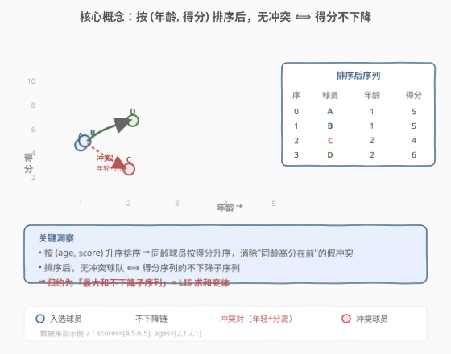
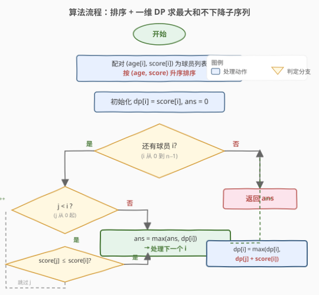

# LeetCode 无冲突的最佳球队 题解

## 1. 题目概述

- **标题 / 题号**：无冲突的最佳球队（#1626，medium）
- **链接**：https://leetcode.cn/problems/best-team-with-no-conflicts/
- **难度**：中等
- **标签**：动态规划、排序、最长递增子序列变体

**题意**：你是篮球球队的经理。给两个等长数组 `scores` 和 `ages`，其中 `scores[i]` 和 `ages[i]` 分别表示第 $i$ 名球员的得分和年龄。

**冲突规则**：一名球员与**比自己年轻**且**得分严格更高**的球员冲突。即若球员 $i$ 比 $j$ 年长（$ages[i] > ages[j]$）但 $scores[i] < scores[j]$，则二人冲突，不能同时入选。

**目标**：选出**无冲突**的球员子集，使其**总得分最大**，返回该最大总得分。

**示例 1**：

```text
输入：scores = [1,3,5,10,15], ages = [1,2,3,4,5]
输出：34
解释：所有球员得分随年龄递增，无冲突，全部入选：1+3+5+10+15 = 34。
```

**示例 2**：

```text
输入：scores = [4,5,6,5], ages = [2,1,2,1]
输出：16
解释：选得分 [5,5,6] 的三名球员（年龄 1,1,2），总得分 16。
```

**示例 3**：

```text
输入：scores = [1,2,3,5], ages = [8,9,10,1]
输出：6
解释：选得分 [1,2,3] 的三名球员（年龄 8,9,10），总得分 6。
  得分 5 的球员年龄仅 1，比其他人都年轻但得分更高，与所有人冲突。
```

**约束**：

- $1 \le scores.length \le 1000$
- $scores.length == ages.length$
- $1 \le scores[i] \le 10^6$
- $1 \le ages[i] \le 10^6$

> 💡 **关键信号**：$n \le 1000$ → $O(n^2)$ DP 完全够用。冲突规则的"年长但得分更低"结构，暗示排序后转化为**最大和不下降子序列**问题——经典 LIS（最长递增子序列）的求和变体。

## 2. 解题思路

### 2.1 暴力思路：枚举所有子集

枚举 $2^n$ 个球员子集，对每个子集检查所有球员对是否冲突。$n = 1000$ 时 $2^{1000}$ 完全不可行。

### 2.2 核心观察：排序归约为最大和不下降子序列



**第一步：理解冲突条件的等价形式。**

冲突发生在"年长 + 得分更低"对。若把所有球员按**年龄升序**排列，则排在前面的球员年龄 $\le$ 后面的。此时：

- 若 $age[j] < age[i]$（$j$ 在前），则要求 $score[j] \le score[i]$（否则冲突）；
- 若 $age[j] == age[i]$（同龄），**无冲突**，得分可任意。

**第二步：按 (年龄, 得分) 联合排序。**

关键技巧：按 `(age, score)` 升序排序。这样同龄球员按得分升序排列，使得"同龄可任意"自动满足——在排序后的序列中，同龄球员的得分也是不下降的。

> ⚠️ **为什么要按 score 做第二排序键？** 若两个球员同龄但得分不同（如 $score[j] > score[i]$，$age[j] == age[i]$），它们本无冲突。但如果排序后 $j$ 在 $i$ 前面，则 $score[j] > score[i]$ 会被误判为"冲突"。按 `(age, score)` 排序保证同龄球员中得分低的在前，消除这个假冲突。

**第三步：归约为最大和不下降子序列。**

排序后，**无冲突的球队 ⟺ 得分序列的一个不下降子序列**（即选出的球员在排序后位置递增、且得分不下降）。目标是使该子序列的得分之和最大。

这就是经典 **LIS（最长递增子序列）** 的"求和变体"：把"长度最长"换成"和最大"。

> 💡 **与经典 LIS 的对应**：
> - 经典 LIS：$dp[i] = 1 + \max\{dp[j] : j < i,\ a[j] < a[i]\}$，求最长长度
> - 本题：$dp[i] = score[i] + \max\{dp[j] : j < i,\ score[j] \le score[i]\}$，求最大和
>
> 区别仅在于：累加的是 $score[i]$ 而非 $1$，且用 $\le$（同龄同分可共存）而非 $<$。

### 2.3 算法流程图



```text
1. 把 (scores[i], ages[i]) 配对为球员列表
2. 按 (age, score) 升序排序
3. dp[i] = score[i] + max{ dp[j] : 0 <= j < i, score[j] <= score[i] }
   （若无可接的前驱，则 dp[i] = score[i]）
4. 返回 max(dp[i])
```

### 2.4 示例演算

![示例演算：scores = [4,5,6,5], ages = [2,1,2,1]](../images/1626_example_walkthrough.svg)

以**示例 2**（`scores = [4,5,6,5], ages = [2,1,2,1]`）为例：

**排序**：按 `(age, score)` 升序：

| 排序后序号 | 原下标 | 得分 | 年龄 |
|-----------|--------|------|------|
| 0 | 1 | 5 | 1 |
| 1 | 3 | 5 | 1 |
| 2 | 0 | 4 | 2 |
| 3 | 2 | 6 | 2 |

**DP 递推**（初值 `dp[i] = score[i]`，再尝试接前驱）：

| 序号 | 得分 | 可接前驱（j < i 且 score[j] ≤ score[i]） | dp[i] | 说明 |
|------|------|------------------------------------------|-------|------|
| 0 | 5 | 无 | 5 | 单选 |
| 1 | 5 | j=0（5 ≤ 5） | 5 + 5 = **10** | 同龄同分，接上 |
| 2 | 4 | 无（5 > 4，不可接） | 4 | score=4 比前面低，只能单选 |
| 3 | 6 | j=0(5), j=1(10), j=2(4) | 6 + 10 = **16** ← 峰值 | 接 dp[1]=10 最优 |

**答案**：$\max(5, 10, 4, 16) = 16$ ✓

对应球队：原下标 {1, 3, 2}，即得分 [5, 5, 6]，年龄 [1, 1, 2]。验证：
- 球员 1（age=1, score=5）vs 球员 3（age=1, score=5）：同龄，无冲突 ✓
- 球员 3（age=1, score=5）vs 球员 2（age=2, score=6）：年长得分低？不，球员 2 更年长且得分更高，无冲突 ✓

## 3. 参考代码

### C++

```cpp
class Solution {
public:
    int bestTeamScore(vector<int>& scores, vector<int>& ages) {
        int n = scores.size();
        vector<pair<int,int>> players(n);
        for (int i = 0; i < n; ++i)
            players[i] = {ages[i], scores[i]};
        sort(players.begin(), players.end());

        vector<int> dp(n);
        int ans = 0;
        for (int i = 0; i < n; ++i) {
            int s = players[i].second;
            dp[i] = s;
            for (int j = 0; j < i; ++j) {
                if (players[j].second <= s)
                    dp[i] = max(dp[i], dp[j] + s);
            }
            ans = max(ans, dp[i]);
        }
        return ans;
    }
};
```

### Python

```python
class Solution:
    def bestTeamScore(self, scores: List[int], ages: List[int]) -> int:
        players = sorted(zip(ages, scores))
        n = len(players)
        dp = [0] * n
        ans = 0
        for i in range(n):
            s = players[i][1]
            dp[i] = s
            for j in range(i):
                if players[j][1] <= s:
                    dp[i] = max(dp[i], dp[j] + s)
            ans = max(ans, dp[i])
        return ans
```

> 💡 **实现细节**：用 `pair(age, score)` 排序，`sort` 默认按第一关键字升序、第二关键字升序，正好满足需求。`players[j].second` 是排序后的得分，用它做不下降判定。`dp[i]` 初始化为 `score[i]`（单独成队），再扫描所有前驱尝试接上。

## 4. 复杂度分析

| 维度 | 复杂度 | 说明 |
|------|--------|------|
| 时间复杂度 | $O(n^2)$ | 排序 $O(n \log n)$ + 双重循环 DP $O(n^2)$，后者主导 |
| 空间复杂度 | $O(n)$ | `players` 数组与 `dp` 数组各 $O(n)$ |

> 💡 对 $n = 1000$，$O(n^2) = 10^6$ 完全在时限内。若 $n$ 放大到 $10^5$，需用树状数组优化到 $O(n \log n)$（见第 5 节）。

## 5. 扩展：树状数组优化至 $O(n \log n)$

$O(n^2)$ DP 的瓶颈在于"对每个 $i$，扫描所有 $j < i$ 找 $score[j] \le score[i]$ 的最大 $dp[j]$"。这本质是**前缀最大值查询 + 单点更新**，可用**树状数组（Fenwick Tree）**加速。

### 5.1 思路

- 以**得分**为下标建树状数组，`tree[s]` 维护"得分 $\le s$ 的最大 $dp$ 值"；
- 排序后逐个处理球员，对当前球员得分 $s$：
  1. **查询** `query(s)`：得到所有已处理球员中得分 $\le s$ 的最大 $dp$ 值；
  2. **更新** `update(s, dp[i])`：把当前 $dp[i] = query(s) + score[i]$ 写入树状数组。

### 5.2 参考代码

```cpp
class Solution {
public:
    int bestTeamScore(vector<int>& scores, vector<int>& ages) {
        int n = scores.size();
        vector<pair<int,int>> players(n);
        for (int i = 0; i < n; ++i)
            players[i] = {ages[i], scores[i]};
        sort(players.begin(), players.end());

        // 离散化得分
        vector<int> vals(scores.begin(), scores.end());
        sort(vals.begin(), vals.end());
        vals.erase(unique(vals.begin(), vals.end()), vals.end());
        int m = vals.size();

        vector<int> tree(m + 1, 0);
        int ans = 0;
        for (int i = 0; i < n; ++i) {
            int s = players[i].second;
            int idx = lower_bound(vals.begin(), vals.end(), s) - vals.begin() + 1;
            // query max dp for score <= s
            int best = 0;
            for (int j = idx; j > 0; j -= j & (-j))
                best = max(best, tree[j]);
            int dp = best + s;
            // update
            for (int j = idx; j <= m; j += j & (-j))
                tree[j] = max(tree[j], dp);
            ans = max(ans, dp);
        }
        return ans;
    }
};
```

```python
class Solution:
    def bestTeamScore(self, scores: List[int], ages: List[int]) -> int:
        players = sorted(zip(ages, scores))
        vals = sorted(set(scores))
        m = len(vals)
        tree = [0] * (m + 1)

        def query(idx):
            best = 0
            while idx > 0:
                best = max(best, tree[idx])
                idx -= idx & (-idx)
            return best

        def update(idx, val):
            while idx <= m:
                tree[idx] = max(tree[idx], val)
                idx += idx & (-idx)

        ans = 0
        for _, s in players:
            idx = bisect_left(vals, s) + 1
            dp = query(idx) + s
            update(idx, dp)
            ans = max(ans, dp)
        return ans
```

| 维度 | 复杂度 | 说明 |
|------|--------|------|
| 时间复杂度 | $O(n \log n)$ | 排序 + 每个球员一次查询 + 一次更新，各 $O(\log n)$ |
| 空间复杂度 | $O(n)$ | 树状数组 + 离散化数组 |

> 💡 **排序的隐藏陷阱**：当两个球员 `(age, score)` 完全相同时，它们的 `query` 都读到相同的前缀最大值，不影响正确性。但如果先 update 再 query 同分球员，会导致"同分球员互相接续"——这在本题是合法的（同龄同分无冲突），所以无妨。若题意改为"同分不可共存"，则需按 `score` 降序处理同分组（组内先 query 再统一 update）。

## 6. 面试要点

**Q1：为什么按 `(age, score)` 而不是只按 `age` 排序？**
> 若只按 `age` 排序，同龄球员的得分顺序不确定。若一个高得分球员排在低得分前面，DP 会把"高→低"误判为冲突（实际同龄无冲突）。按 `(age, score)` 联合排序保证同龄中低分在前，DP 的 $\le$ 判定自然包含同龄所有组合，不重不漏。

**Q2：本题与经典 LIS 的关系是什么？**
> 经典 LIS 求"最长递增子序列的长度"，$dp[i] = 1 + \max\{dp[j] : a[j] < a[i]\}$；本题求"不下降子序列的最大和"，$dp[i] = s_i + \max\{dp[j] : s_j \le s_i\}$。结构完全同构，只是把"累加 1"换成"累加 $s_i$"，把"严格递增"换成"不下降"。所有 LIS 的优化技巧（二分、树状数组）均可平移。

**Q3：$O(n^2)$ 何时不够，何时该上树状数组？**
> $n \le 1000$ 时 $O(n^2)$ 完全够用（$10^6$ 次操作）。若 $n$ 放大到 $10^5$，需 $O(n \log n)$ 的树状数组或线段树优化。面试中先给 $O(n^2)$ 讲清思路，再主动提"可优化到 $O(n \log n)$"，展示对 LIS 优化范式的掌握。

**Q4：树状数组中为什么要离散化得分？**
> 得分可达 $10^6$，若直接以得分为下标建树状数组，空间 $O(10^6)$ 虽可行但浪费。离散化（排序去重 + 二分映射）把得分压缩到 $[1, n]$，空间降为 $O(n)$。这是值域大但元素少时的标准技巧。

**Q5：如果冲突规则改为"同龄也冲突"（即严格递增），怎么改？**
> 把 DP 转移条件从 $score[j] \le score[i]$ 改为 $score[j] < score[i]$ 即可。排序时按 `(age, score)` 不变，但同分球员之间不再可接续。树状数组版本中，同分组需"先统一 query、再统一 update"避免组内互相接续。

## 同类练习题

| # | 题目 | 与本题的关联 |
|---|------|-------------|
| 300 | [最长递增子序列](https://leetcode.cn/problems/longest-increasing-subsequence/)（[题解](../0201-0300/300_最长递增子序列.md)） | 经典 LIS 模板，求最长长度；本题是其"求和变体"，对比 DP 状态定义与转移的差异 |
| 354 | [俄罗斯套娃信封问题](https://leetcode.cn/problems/russian-doll-envelopes/) | 二维 LIS 变体，按一维排序后在另一维上做 LIS，思路与本题"按年龄排序后在得分上做不下降子序列"完全同构 |
| 1691 | [堆叠长方体的最大高度](https://leetcode.cn/problems/maximum-height-by-stacking-cuboids/) | 多维排序 + DP 求最大和，同为本题"排序归约 + 一维 DP"范式 |
| 960 | [删列造序 III](https://leetcode.cn/problems/delete-columns-to-make-sorted-iii/) | LIS 变体求最大保留列数，体会"最长/最大子序列"DP 模板的泛化能力 |
