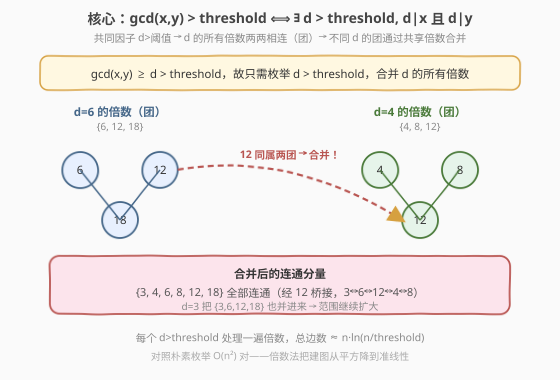
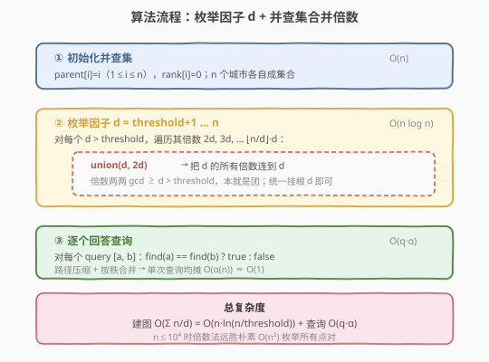
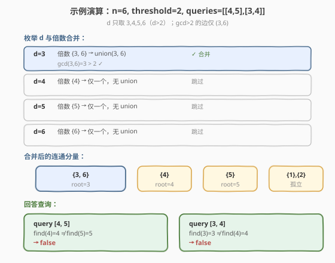

# LeetCode 带阈值的图连通性 题解

## 1. 题目概述

- **标题 / 题号**：带阈值的图连通性（#1627，hard）
- **链接**：https://leetcode.cn/problems/graph-connectivity-with-threshold/
- **难度**：困难
- **标签**：并查集、数学、数论、图

**题意**：有 `n` 座城市，编号 `1` 到 `n`。给定一个整数 `threshold`，按如下规则构造无向图：当且仅当 `x != y` 且 $\gcd(x, y) > \text{threshold}$ 时，城市 `x` 与 `y` 之间有一条边。

再给定若干查询 `queries`，每个查询 `[a, b]` 问：城市 `a` 与 `b` 在该图中是否连通（直接相连或经若干中转间接相连）？返回每个查询的布尔结果。

**示例 1**：

```text
输入：n = 6, threshold = 2, queries = [[4,5],[3,4]]
输出：[false, false]
解释：gcd > 2 的边只有 (3,6)（gcd=3）。4 与 5、3 与 4 均无路径相连。
```

**示例 2**：

```text
输入：n = 6, threshold = 0, queries = [[4,5],[3,4]]
输出：[true, true]
解释：threshold=0 时任意两不同数的 gcd ≥ 1 > 0，全图连通。
```

**示例 3**：

```text
输入：n = 5, threshold = 1, queries = [[4,5],[4,3]]
输出：[false, false]
解释：gcd > 1 的边只有 (2,4)（gcd=2）。4 与 5、4 与 3 均无路径。
```

**约束**：

- $2 \le n \le 10^4$
- $0 \le \text{threshold} \le n$
- $1 \le \text{queries.length} \le 10^5$
- $1 \le a, b \le n$，$a \ne b$

> 💡 关键信号：$n \le 10^4$ 时朴素枚举所有 $\binom{n}{2} \approx 5 \times 10^7$ 对求 gcd 勉强可建图，但配合 $10^5$ 次查询会偏慢。真正的问题是「**何时两点连边**」取决于 $\gcd$，而 gcd 与**公约数**等价——这把建图从「点对维度」降到「因子维度」。

## 2. 解题思路

### 2.1 暴力思路：枚举所有点对建图

对每个点对 $(x, y),\ x < y$ 计算 $\gcd(x, y)$，若 $> \text{threshold}$ 就在并查集里 `union(x, y)`。建图后每个查询 $O(\alpha)$ 回答。

问题：点对数 $\binom{n}{2} \approx 5 \times 10^7$，每组求 gcd $O(\log n)$，总计约 $5 \times 10^8$ 次操作，超时风险大。需要换一个建图角度。

### 2.2 核心观察：gcd > threshold ⟺ 存在大于 threshold 的公约数



**关键等价**：

$$\gcd(x, y) > \text{threshold} \iff \exists\, d > \text{threshold},\ d \mid x \text{ 且 } d \mid y$$

- **正向**：若 $\gcd(x,y)=g > \text{threshold}$，取 $d=g$ 即可。
- **反向**：若存在 $d > \text{threshold}$ 整除 $x$ 和 $y$，则 $d \mid \gcd(x,y)$，故 $\gcd(x,y) \ge d > \text{threshold}$。

> ⚠️ 注意：这里的「连通」是**传递闭包**意义上的。$x$ 与 $y$ 直接连边只要求**存在**某个 $d > \text{threshold}$ 同时整除二者；而查询问的是任意长度的中转路径。并查集天然处理传递闭包，所以只需把所有「直连边」加进去即可。

**把建图从「点对」转到「因子」**：对每个 $d > \text{threshold}$，$d$ 的所有倍数 $\{d, 2d, 3d, \ldots\}$ **两两之间都有连边**（它们的 gcd 至少为 $d$）。这是一个**团**（clique）。把一个团并进并查集，只需把 $d$ 与它的每个倍数 `union` 一次（$d$ 作枢纽，$\text{union}(d, kd)$），共 $\lfloor n/d \rfloor - 1$ 次合并——无需枚举团内所有 $\binom{\cdot}{2}$ 对。

不同 $d$ 对应的团会**通过共享的倍数自然合并**。例如 $d=6$ 的倍数 $\{6,12,18\}$ 与 $d=4$ 的倍数 $\{4,8,12\}$ 共享 $12$，于是 $\{3,4,6,8,12,18\}$（再并入 $d=3$ 的团）全部连通。

### 2.3 算法流程图



```text
1. 初始化并查集：parent[i]=i, rank[i]=0 (1≤i≤n)
2. for d = threshold+1 … n:
     for k = 2 … ⌊n/d⌋:
       union(d, k*d)              // 把倍数挂到 d 上
3. 对每个查询 [a, b]:
     ans = (find(a) == find(b))
```

> 💡 **为什么只枚举 $d > \text{threshold}$？** 若 $d \le \text{threshold}$，即使 $x, y$ 都是 $d$ 的倍数，也只能保证 $\gcd(x,y) \ge d$，未必 $> \text{threshold}$。例如 $\text{threshold}=2$、$d=2$：$\gcd(2,4)=2$ 并不 $> 2$，不能连边。故必须从 $\text{threshold}+1$ 起。

**复杂度估计**：建图阶段合并次数为

$$\sum_{d=\text{threshold}+1}^{n} \left(\left\lfloor \frac{n}{d} \right\rfloor - 1\right) \le \sum_{d=1}^{n} \frac{n}{d} = n \cdot H_n \approx n \ln n$$

$n=10^4$ 时约 $9.2 \times 10^4$ 次合并，远优于朴素 $5 \times 10^7$。查询 $10^5$ 次各 $O(\alpha)$，总计 $O(q)$。

### 2.4 示例演算



以**示例 1**（$n=6,\ \text{threshold}=2$）为例，$d$ 取值 $\{3,4,5,6\}$：

| 步骤 | $d$ | 倍数（$\le 6$） | 操作 | 结果 |
|------|-----|-----------------|------|------|
| ① | 3 | $\{3, 6\}$ | `union(3, 6)` | $\{3,6\}$ 合并 |
| ② | 4 | $\{4\}$ | 仅一个，跳过 | — |
| ③ | 5 | $\{5\}$ | 仅一个，跳过 | — |
| ④ | 6 | $\{6\}$ | 仅一个，跳过 | — |

合并后的连通分量：$\{3,6\}$、$\{1\}$、$\{2\}$、$\{4\}$、$\{5\}$。验证连边：$\gcd(3,6)=3>2$ ✓，其余点对 $\gcd \le 2$，无连边 ✓。

| 查询 | `find` 比较 | 结果 |
|------|------------|------|
| `[4,5]` | `find(4)=4 ≠ find(5)=5` | `false` |
| `[3,4]` | `find(3)=3 ≠ find(4)=4` | `false` |

最终答案 `[false, false]` ✓。

## 3. 参考代码

### C++

```cpp
class Solution {
public:
    vector<bool> areConnected(int n, int threshold, vector<vector<int>>& queries) {
        parent.resize(n + 1);
        rank.resize(n + 1, 0);
        for (int i = 0; i <= n; ++i) parent[i] = i;

        // 枚举因子 d > threshold，合并 d 的所有倍数
        for (int d = threshold + 1; d <= n; ++d) {
            for (int m = 2 * d; m <= n; m += d) {
                unite(d, m);
            }
        }

        vector<bool> ans;
        ans.reserve(queries.size());
        for (auto& q : queries) {
            ans.push_back(find(q[0]) == find(q[1]));
        }
        return ans;
    }
private:
    vector<int> parent, rank;
    int find(int x) {
        if (parent[x] != x) parent[x] = find(parent[x]);   // 路径压缩
        return parent[x];
    }
    void unite(int x, int y) {
        int rx = find(x), ry = find(y);
        if (rx == ry) return;
        if (rank[rx] < rank[ry]) swap(rx, ry);              // 按秩合并
        parent[ry] = rx;
        if (rank[rx] == rank[ry]) rank[rx]++;
    }
};
```

### Python

```python
class Solution:
    def areConnected(self, n: int, threshold: int, queries: List[List[int]]) -> List[bool]:
        parent = list(range(n + 1))
        rank = [0] * (n + 1)

        def find(x: int) -> int:
            while parent[x] != x:
                parent[x] = parent[parent[x]]               # 路径压缩（迭代版）
                x = parent[x]
            return x

        def union(x: int, y: int) -> None:
            rx, ry = find(x), find(y)
            if rx == ry:
                return
            if rank[rx] < rank[ry]:
                rx, ry = ry, rx                              # 按秩合并
            parent[ry] = rx
            if rank[rx] == rank[ry]:
                rank[rx] += 1

        for d in range(threshold + 1, n + 1):
            for m in range(d * 2, n + 1, d):
                union(d, m)

        return [find(a) == find(b) for a, b in queries]
```

> 💡 **实现细节**：(1) 城市编号 1-based，并查集数组大小 $n+1$；(2) 内层 `m` 从 $2d$ 起步（$d$ 本身已是根候选），步长 $d$ 枚举倍数；(3) Python 用迭代版 `find` 配 `parent[x] = parent[parent[x]]` 隔代压缩，规避递归栈深度风险。

## 4. 复杂度分析

| 维度 | 复杂度 | 说明 |
|------|--------|------|
| 时间复杂度 | $O(n \log n + q\,\alpha)$ | 建图 $\sum_{d>t}^{n} \lfloor n/d \rfloor = O(n \ln n)$；每次 `union/find` 均摊 $O(\alpha(n))$，$\alpha < 5$ 视为常数 |
| 空间复杂度 | $O(n)$ | `parent`、`rank` 两个长度 $n+1$ 的数组 |

> 💡 当 $\text{threshold}$ 较大时（接近 $n$），有效的 $d$ 很少，建图几乎为 $O(n)$；$\text{threshold}=0$ 时 $d$ 从 1 开始，$d=1$ 一步把所有城市并成一团，建图退化为 $O(n)$。两种极端都很快，瓶颈始终在查询数 $q$。

## 5. 扩展：埃氏筛思想的类比

「枚举因子再遍历倍数」本质是**埃拉托斯特尼筛法**的思路迁移：

- **筛质数**（204 题）：对每个质数 $p$，划掉它的所有倍数 $2p, 3p, \ldots$，从 $p^2$ 起避免重复。
- **本题**：对每个 $d > \text{threshold}$，把它的所有倍数并进同一集合。

二者共享「**外层枚举因子、内层步长跳倍数**」的骨架，总工作量都是调和级数 $O(n \ln n)$。区别在于：筛法标记「是否质数」，本题标记「是否同属一连通分量」。

> ⚠️ 本题**不需要**从 $d^2$ 起步（筛法那样去重），因为并查集的 `union` 对已同根的点对是 $O(1)$ 早退的，重复合并无害。直接从 $2d$ 起即可，实现更简洁。

## 6. 面试要点

**Q1：为什么「$\gcd(x,y) > \text{threshold}$」能等价成「存在 $d > \text{threshold}$ 整除 $x,y$」？**
> 由 gcd 定义，$\gcd(x,y)$ 是 $x,y$ 的**最大**公约数；若它 $> \text{threshold}$，取 $d=\gcd(x,y)$ 即满足。反之若有任意 $d > \text{threshold}$ 整除二者，则 $d \mid \gcd(x,y)$，故 $\gcd(x,y) \ge d > \text{threshold}$。两个方向闭合成等价。

**Q2：把倍数都 `union` 到 $d$ 上，会不会漏掉团内某些直连边？**
> 不会。设倍数集 $\{d, 2d, \ldots, kd\}$，任意两个倍数 $id, jd$ 的 $\gcd \ge d > \text{threshold}$，本就该连边。把它们都挂到 $d$ 上后，任意两点经 $d$ 中转即在同一集合——传递闭包等价于直接连边的团。并查集只关心「是否同集合」，不关心路径长短。

**Q3：为什么 $d$ 从 $\text{threshold}+1$ 而不是从 1 开始？**
> $d \le \text{threshold}$ 时，即使 $x,y$ 都被 $d$ 整除，也只能推出 $\gcd(x,y) \ge d$，**未必** $> \text{threshold}$。例如 $\text{threshold}=2$、$d=2$，$\gcd(2,4)=2$ 不大于 2，不该连边。从 $\text{threshold}+1$ 起才能保证 $d$ 本身已超过阈值。

**Q4：朴素 $O(n^2)$ 枚举点对 vs 倍数法 $O(n \log n)$，何时选哪个？**
> $n \le 1000$ 时两者皆可，朴素法实现更直白；$n \ge 10^4$ 时倍数法显著占优（$10^5$ vs $10^8$）。本题 $n \le 10^4$，倍数法是安全选择。若 $n$ 进一步放大到 $10^6$，倍数法 $O(n \log n)$ 仍可接受，朴素法则不可行。

**Q5：`threshold = 0` 时为什么全图连通？**
> 任意两个不同正整数 $\gcd \ge 1 > 0$，故所有点对都有边，整图是一个团。算法上 $d=1$ 的倍数遍历 $\{1,2,\ldots,n\}$ 一步把所有城市并成一集合，之后所有查询恒为 `true`。

## 同类练习题

| # | 题目 | 与本题的关联 |
|---|------|-------------|
| 547 | [省份数量](https://leetcode.cn/problems/number-of-provinces/)（[题解](../0501-0600/547_省份数量.md)） | 并查集基础模板，理解 `find`/`union`/路径压缩/按秩合并，是本题的前置 |
| 684 | [冗余连接](https://leetcode.cn/problems/redundant-connection/)（[题解](../0601-0700/684_冗余连接.md)） | 并查集判环，`union` 失败即冗余边，对比本题「`union` 成功即建边」 |
| 1579 | [保证图可完全遍历](https://leetcode.cn/problems/remove-max-number-of-edges-to-keep-graph-fully-traversable/)（[题解](../1501-1600/1579_保证图可完全遍历.md)） | 并查集 + 贪心删边，Alice/Bob 双图连通性维护，并查集在「动态加边」场景的进阶 |
| 204 | [计数质数](https://leetcode.cn/problems/count-primes/)（[题解](../0201-0300/204_计数质数.md)） | 埃氏筛模板，与本题「枚举因子 + 遍历倍数」同构，体会数论筛法的迁移 |
| 952 | [按公因数计算最大组件大小](https://leetcode.cn/problems/largest-component-size-by-common-factor/) | 同样用「因子→倍数」建并查集，但元素是数组值而非编号，难度更高，可作本题进阶挑战 |
