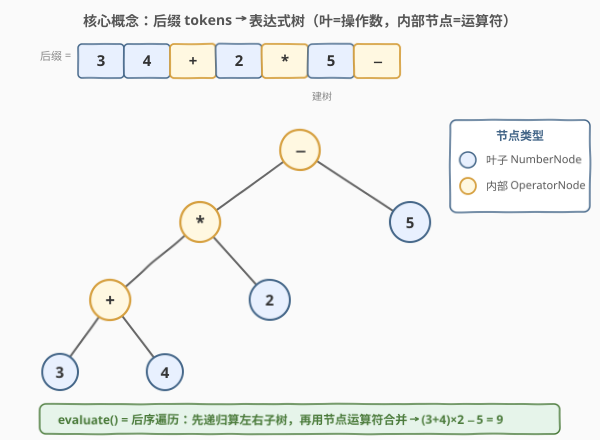
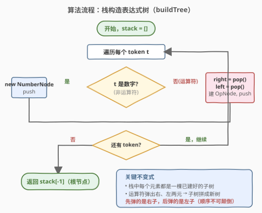

# LeetCode 设计带解析函数的表达式树 题解

## 1. 题目概述

- **标题 / 题号**：设计带解析函数的表达式树（#1628，medium）
- **链接**：https://leetcode.cn/problems/design-an-expression-tree-with-evaluate-function/
- **难度**：中等
- **标签**：栈、树、设计、递归

**题意**：给定一个算术表达式的**后缀表达式**（逆波兰表示）`postfix`，其中只含整数与二元运算符 `+`、`-`、`*`、`/`（除法**向零截断**）。请设计一棵**表达式树**并实现其求值接口：

- 抽象基类 `Node` 暴露一个方法 `evaluate()`，返回该子树代表的表达式的整数值。
- 类 `TreeBuilder` 的方法 `buildTree(postfix)` 接收后缀 token 数组，返回表达式树的**根节点**。
- 调用根节点的 `evaluate()` 应得到整个表达式的值。

> ⚠️ 本题为 LeetCode **Plus 会员专享题**。表达式树是一棵二叉树：**叶子节点是操作数，内部节点是运算符**；每个运算符节点的左/右子树分别是它的左/右操作数。后缀表达式的天然结构正好对应一棵表达式树的后序遍历。

**示例 1**：

```text
输入：postfix = ["3","4","+","2","*","5","-"]
输出：9
解释：对应中缀表达式为 ((3 + 4) * 2) - 5 = 9。
```

**示例 2**：

```text
输入：postfix = ["4","5","7","2","+","-","-"]
输出：8
解释：7 2 + → 9；5 9 - → -4；4 (-4) - → 8。
      对应中缀为 4 - (5 - (7 + 2)) = 8。
```

**示例 3**：

```text
输入：postfix = ["-10","-4","/"]
输出：2
解释：-10 / -4 = 2.5，向零截断为 2。
```

**约束**：

- `1 <= postfix.length <= 100`
- `postfix[i]` 是整数或 `+`、`-`、`*`、`/` 之一（整数可能是负数，如 `"-11"`）
- 输入保证是合法的后缀表达式，结果在 32 位整数范围内

## 2. 解题思路

### 2.1 朴素思路：直接后缀求值（不建树）

最直接的做法是套用 [150. 逆波兰表达式求值](../0101-0200/150_逆波兰表达式求值.md) 的栈模板：遇数压栈，遇算子弹两元算出结果再压栈，最后栈顶即答案。$O(n)$ 时间、$O(n)$ 空间，逻辑无误。

但这种做法**只产出最终数值，不保留表达式结构**——题目要求返回一个**可调用 `evaluate()` 的树根节点**，且表达式树结构本身在很多场景（重复求值、变量替换、符号化简、等价判定，见 [1612. 检查两棵二叉表达式树是否等价](../1601-1700/1612_检查两棵二叉表达式树是否等价.md)）中是有用的。因此核心要解决的是「如何把后缀序列**物化**成一棵带求值能力的对象树」。

### 2.2 核心观察：表达式树 + 多态 evaluate



关键观察有两层：

**结构层**：后缀表达式恰好是表达式树的**后序遍历序列**（左子树 → 右子树 → 根）。因此可以用**栈**在线性时间内重建树：

- 遇**操作数** → 包成叶子节点 `NumberNode` 压栈；
- 遇**运算符** → 从栈顶弹出**右**操作数、再弹出**左**操作数，拼成一个内部节点 `OperatorNode(left, op, right)` 压栈。

> 💡 为什么后缀能这样建树？后缀序列中，每个运算符紧挨在它的两个操作数之后；这两个操作数本身可能已是合并好的子树（在栈顶）。栈顶始终维护「当前已处理前缀所对应的若干棵完整子树」，这正是**调度场/后缀求值**的不变式从「数值」推广到「节点对象」。

**求值层**：用**多态**把「如何求值」下沉到每个节点自身——

- `NumberNode.evaluate()` 直接返回存储的数值；
- `OperatorNode.evaluate()` 先**递归**调用左右子树的 `evaluate()`，再用自身运算符合并。

这样根节点的 `evaluate()` 自然触发一次**后序遍历**，整棵树自底向上算出结果。结构构建与求值计算**解耦**：建树 $O(n)$ 一次，之后可对同一棵树**多次**调用 `evaluate()` 而无需重建。

> ⚠️ **左右顺序不可颠倒**：栈是 LIFO，后压入的先弹出。后缀中运算符前两个操作数的顺序是「左、右」，因此压栈时左先右后，弹出时**先弹的是右、后弹的是左**。对减法、除法这种**非交换**运算，顺序错了结果就错了（如 `4 5 -` 应得 `−1` 而非 `1`）。

### 2.3 算法流程图



```text
buildTree(postfix):
  stack = []
  for t in postfix:
    if t 是运算符 (+ - * /):
      right = stack.pop()      # 先弹右
      left  = stack.pop()      # 再弹左
      stack.push(OperatorNode(t, left, right))
    else:                      # 操作数
      stack.push(NumberNode(int(t)))
  return stack[-1]             # 栈中唯一元素即根
```

### 2.4 示例演算

![示例演算：后缀 [3, 4, +, 2, *, 5, −] 的栈构造过程](../images/1628_example_walkthrough.svg)

以 `postfix = ["3","4","+","2","*","5","-"]` 为例，下表逐步展示栈的演化（栈底→栈顶，新建/新压元素加粗）：

| 步 | token | 动作 | 栈状态（底→顶） |
|----|-------|------|------------------|
| 1 | `3` | 压 NumberNode(3) | **3** |
| 2 | `4` | 压 NumberNode(4) | 3, **4** |
| 3 | `+` | 弹 4、3 → 建 +(3,4) | **(3+4)** |
| 4 | `2` | 压 NumberNode(2) | (3+4), **2** |
| 5 | `*` | 弹 2、(3+4) → 建 * | **((3+4)×2)** |
| 6 | `5` | 压 NumberNode(5) | ((3+4)×2), **5** |
| 7 | `−` | 弹 5、((3+4)×2) → 建 − | **((3+4)×2−5)** ← 根 |

栈仅剩一个元素即根节点。调用 `root.evaluate()` 触发后序递归：

- `+(3,4).evaluate()` = 3 + 4 = **7**
- `*((3+4),2).evaluate()` = 7 × 2 = **14**
- `−((3+4)×2, 5).evaluate()` = 14 − 5 = **9** ✓

## 3. 参考代码

> 💡 LeetCode 的代码模板已提供抽象基类 `Node`（含纯虚 `evaluate`）。下方代码展示完整定义以便理解；提交时只需保留你新增的子类与 `TreeBuilder`，`Node` 接口按题目给定的签名实现即可。

### C++

```cpp
/**
 * 抽象基类：题目给定的接口（提交时按模板提供，此处给出完整定义以便理解）。
 */
class Node {
public:
    virtual ~Node() {}
    virtual int evaluate() const = 0;
};

// 叶子节点：操作数
class NumberNode : public Node {
    int val;
public:
    NumberNode(int v) : val(v) {}
    int evaluate() const override { return val; }
};

// 内部节点：二元运算符
class OperatorNode : public Node {
    char op;
    Node* left;
    Node* right;
public:
    OperatorNode(char op, Node* l, Node* r) : op(op), left(l), right(r) {}
    int evaluate() const override {
        int l = left->evaluate(), r = right->evaluate();
        switch (op) {
            case '+': return l + r;
            case '-': return l - r;
            case '*': return l * r;
            case '/': return l / r;   // C++11 起整数除法向零截断
        }
        return 0;
    }
};

class TreeBuilder {
public:
    Node* buildTree(vector<string>& postfix) {
        stack<Node*> st;
        for (const string& t : postfix) {
            // 单字符且是运算符 → 内部节点（排除 "-11" 这类多字符负数）
            if (t.size() == 1 && string("+-*/").find(t[0]) != string::npos) {
                Node* r = st.top(); st.pop();   // 先弹右
                Node* l = st.top(); st.pop();   // 再弹左
                st.push(new OperatorNode(t[0], l, r));
            } else {
                st.push(new NumberNode(stoi(t)));
            }
        }
        return st.top();
    }
};
```

### Python

```python
class Node:
    def evaluate(self) -> int:
        raise NotImplementedError


class NumberNode(Node):
    def __init__(self, val: int):
        self.val = val

    def evaluate(self) -> int:
        return self.val


class OperatorNode(Node):
    def __init__(self, op: str, left: "Node", right: "Node"):
        self.op = op
        self.left = left
        self.right = right

    def evaluate(self) -> int:
        l, r = self.left.evaluate(), self.right.evaluate()
        if self.op == '+':
            return l + r
        if self.op == '-':
            return l - r
        if self.op == '*':
            return l * r
        return int(l / r)   # int() 截断向零，区别于 // 的向 −∞ 取整


class TreeBuilder:
    def buildTree(self, postfix: List[str]) -> "Node":
        st: List[Node] = []
        ops = {'+', '-', '*', '/'}
        for t in postfix:
            if t in ops:
                r = st.pop()                 # 先弹右
                l = st.pop()                 # 再弹左
                st.append(OperatorNode(t, l, r))
            else:
                st.append(NumberNode(int(t)))
        return st[-1]
```

> ⚠️ **Python 除法陷阱**：`//` 对负数向 $-\infty$ 取整（如 $-10 \ // \ 4 = -3$），而题目要求**向零截断**（应为 $-2$）。用 `int(l / r)` 借助浮点截断可解决；若担心大整数精度，可改写为 `q = abs(l) // abs(r); -q if (l < 0) ^ (r < 0) else q`。本题数值在 32 位范围内，`int(l / r)` 安全。

## 4. 复杂度分析

| 维度 | 复杂度 | 说明 |
|------|--------|------|
| `buildTree` 时间 | $O(n)$ | 遍历 $n$ 个 token 各一次，每次压/弹栈 $O(1)$ |
| `buildTree` 空间 | $O(n)$ | 栈最深存约 $n/2$ 棵子树；最终整棵树共 $n$ 个节点 |
| `evaluate` 时间 | $O(n)$ | 后序遍历每个节点访问一次 |
| `evaluate` 空间 | $O(h)$ | 递归调用栈深度 = 树高 $h$，最坏 $O(n)$（退化为链），平均 $O(\log n)$ |

> 💡 建树与求值都是线性。相比朴素栈求值，本方案多用了一份**树结构**的内存，换来的是「结构可复用、可重组、可被外部遍历」的能力——这正是设计题考察的工程取舍。

## 5. 扩展：变体与延伸

- **中序还原中缀表达式**：对表达式树做**中序遍历**，按运算符优先级适时加括号，即可输出带最少括号的中缀式。`OperatorNode` 可新增 `inorder()` 方法递归输出。
- **变量替换 / 重复求值**：把 `NumberNode` 换成 `VarNode(name)` + 一张变量绑定表，`evaluate(env)` 即可在不同环境下重复求值而无需重建树——这是「建树一次、求值多次」的典型收益。
- **等价判定**：两棵表达式树等价 ⟺ 它们的某种规范序（如中序 + 分配律化简，或 AST 哈希）相同。见 [1612. 检查两棵二叉表达式树是否等价](../1601-1700/1612_检查两棵二叉表达式树是否等价.md)。
- **前缀/中缀 → 树**：前缀表达式（波兰式）可类似用栈**从右向左**扫描建树；中缀则需调度场算法（双栈）先转后缀，或直接递归下降构造。

## 6. 面试要点

**Q1：为什么用多态/虚函数，而不是在 `OperatorNode` 里用一个大 `switch`？**
> 多态把「每种节点如何求值」封装到各自类中，`evaluate()` 调用者无需关心节点类型——这样新增运算符（如 `^`、`%`）只需加一个子类或扩展 `OperatorNode` 的 switch，**调用侧零改动**。若用 `switch` 散落在多处，每加一种运算符都要改多处，违背开闭原则。本题 `OperatorNode` 内部用 `switch` 是因为只差一个字符，复用同一类更紧凑；更彻底的 OOP 做法是为每种运算符单独建子类（`AddNode`/`SubNode`…）。

**Q2：栈弹出左右操作数的顺序为什么是「先右后左」？**
> 后缀序列中运算符前的两个操作数顺序为「左、右」，建树时左先压栈、右后压栈。栈 LIFO，故弹出顺序相反：**先弹的是右、后弹的是左**。对 `+`、`*` 这种交换律运算无影响，但对 `-`、`/` 必须严格保证——这是本题最易踩的坑。

**Q3：如何区分负数 token `"-11"` 与减号 `"-"`？**
> 减号是**单字符**且属于运算符集合；负数 token 至少 2 个字符。用 `t.size() == 1 && in "+-*/"` 判定即可。更稳健的写法是先判断 `t` 是否在运算符集合中（精确字符串匹配），不在则一律当作操作数解析。

**Q4：C++ 整数除法向零截断，Python `//` 不向零截断，怎么统一？**
> C++11 起整数除法 `a / b` 商向零截断、余数与被除数同号，直接用即可。Python `//` 向 $-\infty$ 取整，需用 `int(a / b)` 或手写按符号修正的截断除法。Go、Java 的整数除法与 C++ 一致（向零截断），Java `Math.floorDiv` 则是向下取整，注意区分。

**Q5：表达式树与后缀求值的本质关系？**
> 后缀表达式 = 表达式树的**后序遍历序列**。栈求后缀的过程，等价于「边做后序遍历边折叠求值」；建表达式树的过程，等价于「边做后序遍历边重建结构」。前者把子树折叠成数值，后者把子树折叠成节点对象——同一个栈不变式，只是折叠目标不同。

## 同类练习题

| # | 题目 | 与本题的关联 |
|---|------|-------------|
| 150 | [逆波兰表达式求值](https://leetcode.cn/problems/evaluate-reverse-polish-notation/)（[题解](../0101-0200/150_逆波兰表达式求值.md)） | 同样的栈模板，但只求数值不建树——本题的「朴素版」，对照体会「折叠成数值 vs 折叠成节点」 |
| 1612 | [检查两棵二叉表达式树是否等价](https://leetcode.cn/problems/check-if-two-expression-trees-are-equivalent/)（[题解](../1601-1700/1612_检查两棵二叉表达式树是否等价.md)） | 同样是表达式树，考察中序遍历 + 哈希判定等价，结构复用 `OperatorNode` 思想 |
| 224 | [基本计算器](https://leetcode.cn/problems/basic-calculator/)（[题解](../0201-0300/224_基本计算器.md)） | 中缀 + 括号求值，调度场/双栈思路——对照「中缀直接求值」与「后缀建树」两种范式 |
| 227 | [基本计算器 II](https://leetcode.cn/problems/basic-calculator-ii/)（[题解](../0201-0300/227_基本计算器II.md)） | 中缀含四则运算求值，可先转后缀再建树，串联中缀→后缀→树→求值全链路 |
| 232 | [用栈实现队列](https://leetcode.cn/problems/implement-queue-using-stacks/) | 栈的 LIFO 特性与「弹出顺序反转」的范式题，巩固对「先弹右、后弹左」顺序的直觉 |
