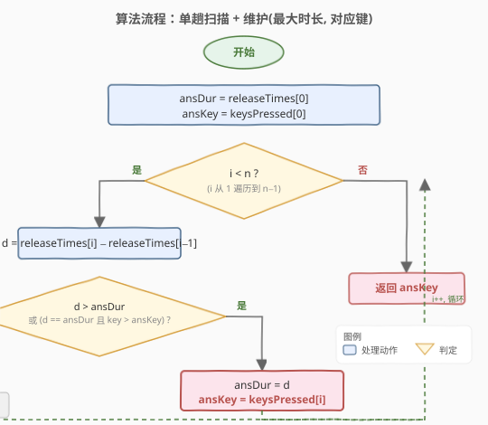

# 按键持续时间最长的键

- **题目名称**：按键持续时间最长的键
- **链接**：[1629. 按键持续时间最长的键](https://leetcode.cn/problems/slowest-key/)
- **难度**：简单
- **标签**：数组、字符串、遍历

## 1. 题目概述

LeetCode 设计了一款新式键盘，正在测试其可用性。测试人员会依次点击 $n$ 个键，每次一个。给定：

- `keysPressed`（长度为 $n$ 的字符串）：第 $i$ 个被按下的键；
- `releaseTimes`（长度为 $n$ 的**升序**整数列表）：第 $i$ 个键松开的时刻。

下标均从 0 开始。第 0 个键在时刻 0 被按下，之后每个键**恰好在前一个键松开时被按下**。第 $i$ 次按键的持续时间为：

$$
\text{duration}[i] =
\begin{cases}
\text{releaseTimes}[0], & i = 0 \\
\text{releaseTimes}[i] - \text{releaseTimes}[i-1], & i \ge 1
\end{cases}
$$

请返回**单次按键持续时间最长**的键；若有多个键的持续时间并列最长，返回**按字母顺序排列最大**的那个键。

> 💡 注意：同一个键可在不同时刻被多次按下，每次持续时间都可能不同。我们比的是"**单次**持续时间"，而非同一键各次持续时间之和。

**示例 1**：

```text
输入：releaseTimes = [9,29,49,50], keysPressed = "cbcd"
输出：'c'
解释：
  按 'c'，持续时间 9（0 按下，9 松开）
  按 'b'，持续时间 29 − 9 = 20
  按 'c'，持续时间 49 − 29 = 20
  按 'd'，持续时间 50 − 49 = 1
最长持续时间为 20，并列的是 'b' 与 'c'，'c' 字母序更大，故返回 'c'。
```

**示例 2**：

```text
输入：releaseTimes = [12,23,36,46,62], keysPressed = "spuda"
输出：'a'
解释：
  按 's'，持续时间 12
  按 'p'，持续时间 23 − 12 = 11
  按 'u'，持续时间 36 − 23 = 13
  按 'd'，持续时间 46 − 36 = 10
  按 'a'，持续时间 62 − 46 = 16
最长持续时间为 16，对应 'a'，返回 'a'。
```

**约束条件**：

- `releaseTimes.length == n`
- `keysPressed.length == n`
- $2 \le n \le 1000$
- $1 \le \text{releaseTimes}[i] \le 10^9$
- `releaseTimes` 严格升序：`releaseTimes[i] < releaseTimes[i+1]`
- `keysPressed` 仅由小写英文字母组成

## 2. 解题思路

### 2.1 暴力思路：算出所有持续时间再排序

先遍历一遍算出每个下标的持续时间 `duration[i]`，存入列表，再按 `(duration, key)` 降序排序，取首元素的 `key`。逻辑正确，但排序带来 $O(n \log n)$ 的时间和 $O(n)$ 的额外空间，且**没有利用"只需最大值、无需整体顺序"这一性质**——求最值本就该是线性一趟。

### 2.2 核心观察：单趟扫描 + 在线维护最值

![核心概念：第 i 次持续时间 = releaseTimes[i] − releaseTimes[i−1]，在线维护(最大时长, 对应键)](../images/slowest_key_concept.svg)

关键观察：**我们只需要"单次持续时间最大的那个键"，不需要所有持续时间的整体排序**。这是一个标准的"求最值"问题，可以在线一趟扫描解决：

- 维护两个变量 `ansDur`（当前见过的最大持续时间）与 `ansKey`（对应键）；
- 用第 0 个键作为初值：`ansDur = releaseTimes[0]`，`ansKey = keysPressed[0]`；
- 从 $i = 1$ 起扫描，对每个 $i$ 计算 $d = \text{releaseTimes}[i] - \text{releaseTimes}[i-1]$，**只有两种情况需要更新**：
  - $d > \text{ansDur}$：当前更长，覆盖时长与键；
  - $d == \text{ansDur}$ 且 $\text{keysPressed}[i] > \text{ansKey}$：时长并列，取字母序更大的键（仅换键，时长不变）。

> 💡 为什么把"并列时取字母序更大"合并进同一次比较？因为题目要求的是"最长且字母序最大"的键，二者可以用**字典序式的复合比较**一次判定：先比时长（大者优先），时长相等再比键（大者优先）。这等价于按 `(d, key)` 这个二元组取最大值。

> ⚠️ 容易踩的坑：把 `d == ansDur && keysPressed[i] > ansKey` 误写成 `d == ansDur && keysPressed[i] < ansKey`（取了字母序更小），或者漏掉等号写成 `d > ansDur || (d == ansDur && ...)` 之外的逻辑错乱。记住方向：**时长要大，键也要大**，两边都取 `>`。

### 2.3 算法流程图



```text
1. ansDur = releaseTimes[0]
2. ansKey = keysPressed[0]
3. for i = 1 to n−1:
   a. d = releaseTimes[i] − releaseTimes[i−1]
   b. 若 d > ansDur 或 (d == ansDur 且 keysPressed[i] > ansKey):
        ansDur = d
        ansKey = keysPressed[i]
4. 返回 ansKey
```

### 2.4 示例演算

![示例演算：releaseTimes = [9,29,49,50]，keysPressed = "cbcd"](../images/slowest_key_example_walkthrough.svg)

以示例 1 为例，初值 `ansDur = 9`、`ansKey = 'c'`：

| 步骤 | i | key | releaseTimes[i] | duration $d$ | ansDur（更新后） | ansKey（更新后） | 动作 |
|------|---|-----|-----------------|--------------|------------------|------------------|------|
| 1 | 0 | `c` | 9 | 9（初值） | 9 | `c` | 取第 0 键作初值 |
| 2 | 1 | `b` | 29 | $29-9=20$ | 20 | `b` | $d>\text{ansDur}$，时长更大 → 覆盖 |
| 3 | 2 | `c` | 49 | $49-29=20$ | 20 | `c` | $d==\text{ansDur}$，`c`>`b` → 仅换键 |
| 4 | 3 | `d` | 50 | $50-49=1$ | 20 | `c` | $d<\text{ansDur}$ → 跳过 |

扫描结束返回 `ansKey = 'c'` ✓。

再看示例 2（`releaseTimes = [12,23,36,46,62]`，`keysPressed = "spuda"`），初值 `ansDur = 12`、`ansKey = 's'`：

| i | key | $d$ | ansDur | ansKey | 动作 |
|---|-----|-----|--------|--------|------|
| 0 | `s` | 12 | 12 | `s` | 初值 |
| 1 | `p` | $23-12=11$ | 12 | `s` | $d<12$ → 跳过 |
| 2 | `u` | $36-23=13$ | 13 | `u` | $d>12$ → 覆盖 |
| 3 | `d` | $46-36=10$ | 13 | `u` | $d<13$ → 跳过 |
| 4 | `a` | $62-46=16$ | 16 | `a` | $d>13$ → 覆盖 |

最终返回 `ansKey = 'a'` ✓。

## 3. 参考代码

### C++

```cpp
class Solution {
public:
    char slowestKey(vector<int>& releaseTimes, string keysPressed) {
        int n = releaseTimes.size();
        int ansDur = releaseTimes[0];
        char ansKey = keysPressed[0];
        for (int i = 1; i < n; ++i) {
            int d = releaseTimes[i] - releaseTimes[i - 1];
            if (d > ansDur || (d == ansDur && keysPressed[i] > ansKey)) {
                ansDur = d;
                ansKey = keysPressed[i];
            }
        }
        return ansKey;
    }
};
```

### Python

```python
class Solution:
    def slowestKey(self, releaseTimes: List[int], keysPressed: str) -> str:
        ans_dur = releaseTimes[0]
        ans_key = keysPressed[0]
        for i in range(1, len(releaseTimes)):
            d = releaseTimes[i] - releaseTimes[i - 1]
            if d > ans_dur or (d == ans_dur and keysPressed[i] > ans_key):
                ans_dur = d
                ans_key = keysPressed[i]
        return ans_key
```

> 💡 **Python 的更紧凑写法**：利用元组按字典序比较的特性，把 `(d, key)` 作为待最大化的二元组，配合 `zip` 一次成型。`durations[i]` 由 `releaseTimes[i] - releaseTimes[i-1]` 给出，需补上第 0 项 `releaseTimes[0]`：
>
> ```python
> class Solution:
>     def slowestKey(self, releaseTimes: List[int], keysPressed: str) -> str:
>         durations = [releaseTimes[0]] + [
>             releaseTimes[i] - releaseTimes[i - 1]
>             for i in range(1, len(releaseTimes))
>         ]
>         return max(zip(durations, keysPressed))[1]
> ```
>
> `max(zip(durations, keysPressed))` 会先比 `durations`（时长），并列时再比 `keysPressed` 中的字符（字母序），恰好契合题意；`[1]` 取出字符。代价是多用了 $O(n)$ 空间存 `durations`，但代码极简，适合面试时作为"第二种写法"展示。

## 4. 复杂度分析

| 维度 | 复杂度 | 说明 |
|------|--------|------|
| 时间复杂度 | $O(n)$ | 单趟扫描，每个下标 $O(1)$：一次减法 + 一次比较 |
| 空间复杂度 | $O(1)$ | 仅 `ansDur`/`ansKey`/`d` 三个标量，与 $n$ 无关 |

> 💡 紧凑写法（预生成 `durations` 列表 + `max(zip(...))`）时间为 $O(n)$、空间为 $O(n)$。对 $n \le 1000$ 的约束毫无压力，但单趟在线维护的写法在空间上更优，且能体现"流式处理"思想——即便 $n$ 大到无法一次性载入内存，也能逐项读取求最值。

## 5. 扩展：复合比较与"二元组取最值"的通用范式

本题的"时长最大、并列时字母序最大"本质是**按二元组 `(duration, key)` 取字典序最大值**。这种"多关键字最值"在工程中极为常见，掌握几种写法能应对不同场景：

**① 显式分支判定**（本题主解）：清晰直观，分支可读性好，适合键数较少（2 个）的场景。

**② 元组字典序比较**：把多关键字打包成元组，利用语言内置的字典序比较。Python 的 `max(zip(...))` 即此思路。C++ 可用 `std::max` 配自定义比较器，或把 `(d, key)` 存入 `std::vector<pair<int,char>>` 再取 `max_element`，但会引入额外空间。

**③ 加权编码**（当各关键字值域可控时）：把多个关键字编码进一个整数。例如本题若键仅 a–z，可令 `score = d * 27 + (key - 'a')`，对 `score` 取最大即可一步到位。代价是要求值域不溢出、且编码方案可逆——本题 $d \le 10^9$，乘 27 后仍在 `long long` 范围内，可行但不如下面这种更自然。

> ⚠️ 加权法要保证低位关键字不会"溢出"到高位。`d * 27` 中的 27 必须大于键取值数（26），否则两个不同键可能产生相同 `score`，破坏正确性。本题用 27 是安全的，但若键集合扩大需相应放大基数。

**④ 流式在线维护**：当数据无法全量载入（流式到达）时，只能用方法 ① 边读边维护最值——这正是本题主解的形态，也是面试中最该首先给出的版本。

## 6. 面试要点

**Q1：为什么用第 0 个键作初值，而不是用 `INT_MIN` 之类的哨兵？**
> 第 0 次按键的持续时间 `releaseTimes[0]` 是真实数据的一部分，必须纳入比较。直接把它作为初值，从 $i=1$ 开始扫描，逻辑最干净、无遗漏。若用哨兵初值，循环内需特判"哨兵未初始化"分支，反而更易错。

**Q2：并列时为什么取字母序"更大"而不是"更小"？如何记牢方向？**
> 题目明确要求"按字母顺序排列最大"。一个简单的记忆法：**题目里凡是说"最大/最长/最高"的，比较方向一律是 `>`**——时长要 `>`，键也要 `>`，两边同向。把两个条件统一成"二元组 `(d, key)` 取最大"，方向就不会错。

**Q3：`releaseTimes` 严格升序这个条件用到了吗？如果它不升序会怎样？**
> 用到了。严格升序保证了 `releaseTimes[i] - releaseTimes[i-1] > 0`，即每次持续时间都为正，无需处理负值或零值的边界。若不升序，题目语义本身（"前一个键松开时按下下一个"）就不成立，需重新定义持续时间计算方式。

**Q4：题目要求的是"单次"最长，而不是同一键各次之和。如何区分这两类问题？**
> "单次最长"是求 `max(duration[i])`，对每次按键独立比较，是本题；"各次之和最长"则需先按键分组求和再取最大（类似用长度 26 的数组累加每个键的总时长再 argmax）。审题时抓住"单次"二字，避免误用累加逻辑。两者都是 $O(n)$，但状态定义不同。

**Q5：能否不用减法、直接用 `releaseTimes[i]` 找最值？**
> 不能。`releaseTimes[i]` 是绝对松开时刻，第 0 键在时刻 `releaseTimes[0]` 松开但其持续时间就是 `releaseTimes[0]`，而后续键的持续时间是相邻差分。直接比 `releaseTimes[i]` 会偏向"按得晚"的键而非"按得久"的键。差分才是"持续时间"的正确度量。

## 7. 同类练习题

- [1338. 数组大小减半](https://leetcode.cn/problems/reduce-array-size-to-the-half/)：求频次最值 + 贪心选取，体会"按值排序取最值"与本题"在线维护最值"的对照
- [347. 前 K 个高频元素](https://leetcode.cn/problems/top-k-frequent-elements/)：频次统计 + Top-K，是本题"单最值"扩展到"前 K 最值"的自然延伸
- [414. 第三大的数](https://leetcode.cn/problems/third-maximum-number/)：在线维护多个最值（前三），思路是本题"维护一个最值"的升级版，且同样需处理并列去重
- [605. 种花问题](https://leetcode.cn/problems/can-place-flowers/)：单趟扫描 + 局部判定，对照体会"线性遍历 + 在线判定"这一通用模板
- [1281. 整数的各位积和之差](https://leetcode.cn/problems/subtract-the-product-and-sum-of-digits-of-an-integer/)：一次遍历做差分类计算，体会"差分/累积"的简单线性应用
