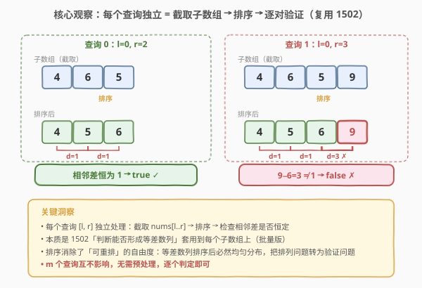
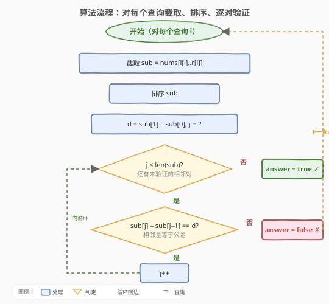

# 等差子数组

- **题目名称**：等差子数组
- **链接**：[1630. 等差子数组](https://leetcode.cn/problems/arithmetic-subarrays/)
- **难度**：中等
- **标签**：数组、排序、枚举

## 1. 题目概述

如果一个数列由至少两个元素组成，且任意相邻两项之差恒为同一个常数，则称该数列为**等差数列**。更形式化地，序列 $s$ 为等差数列当且仅当 $s[i+1] - s[i] = s[1] - s[0]$ 对所有合法 $i$ 成立。

给定长度为 $n$ 的整数数组 `nums`，以及 $m$ 个查询，每个查询由 `l` 和 `r` 两个数组描述：第 $i$ 个查询对应子数组 `nums[l[i]..r[i]]`（闭区间）。对每个查询，判断该子数组**能否重新排列成等差数列**，返回布尔列表 `answer`。

**示例 1**：

```text
输入：nums = [4,6,5,9,3,7], l = [0,0,2], r = [2,3,5]
输出：[true,false,true]
解释：
- 查询 0：nums[0..2] = [4,6,5]，排序得 [4,5,6]，相邻差 1,1 → true
- 查询 1：nums[0..3] = [4,6,5,9]，排序得 [4,5,6,9]，相邻差 1,1,3 → false
- 查询 2：nums[2..5] = [5,9,3,7]，排序得 [3,5,7,9]，相邻差 2,2,2 → true
```

**示例 2**：

```text
输入：nums = [-12,-9,-3,-12,-6,15,20,-25,-20,-15,-10], l = [0,2,5,5,7,7], r = [4,4,9,8,10,9]
输出：[false,true,false,false,true,true]
```

**约束条件**：

- `n == nums.length`
- `m == l.length == r.length`
- `2 <= n <= 500`
- `1 <= m <= 500`
- `0 <= l[i] <= r[i] < n`
- 所有查询的子数组长度之和 $\leq 5000$

> 💡 本题本质是 [1502. 判断能否形成等差数列](../1501-1600/1502_判断能否形成等差数列.md) 的「批量版」：把单次数组判定套用到 $m$ 个子数组上。每个查询独立处理、互不影响，理解了 1502 本题便水到渠成。

---

## 2. 解题思路

### 2.1 暴力思路：枚举排列

对每个查询 $[l, r]$，枚举子数组的所有排列（共 $k!$ 种，$k = r - l + 1$），逐个检查是否为等差数列，一旦找到满足的排列即返回 `true`。最坏 $O(m \cdot k! \cdot k)$，当 $k$ 稍大（如 $k = 8$ 时 $8! = 40320$）就完全不可行。根本问题在于**没有利用等差数列的数学结构**——「可重排成等差数列」等价于「排序后即为等差数列」，根本无需枚举排列。

### 2.2 核心观察：排序 + 逐对验证（复用 1502）



关键直觉直接来自 1502：**若一个数组能重排成等差数列，则将其排序后得到的升序序列本身就是等差数列**（等差数列的元素集合确定，排序只是还原其升序形态）。因此每个查询只需三步：

1. **截取**子数组 `sub = nums[l[i]..r[i]]`。
2. **排序** `sub`。
3. 计算 $d = \text{sub}[1] - \text{sub}[0]$，检查所有相邻差 $\text{sub}[j] - \text{sub}[j-1]$ 是否都等于 $d$。

> 💡 **为什么排序一定行？** 等差数列的元素集合为 $\{a,\ a+d,\ \ldots,\ a+(k-1)d\}$，无论原数组如何打乱，排序后都还原为升序等差数列。所以「能否重排成等差数列」等价于「排序后是否为等差数列」，把排列问题转化为验证问题。

> ⚠️ **边界 $k = 2$**：子数组长度为 2 时任意两数都成等差数列（只有一个差值，天然恒定）。内层循环从 $j = 2$ 开始，$k = 2$ 时循环体不执行，自动返回 `true`，无需特判。

### 2.3 算法流程图



外层循环遍历 $m$ 个查询，内层循环从 $j = 2$ 验证相邻差；遇到首个不等于 $d$ 的差值立即判定 `false` 并跳出内层，全部通过则 `true`，然后处理下一查询。

### 2.4 示例演算

![示例演算：nums = [4,6,5,9,3,7] 的三个查询](../images/1630_example_walkthrough.svg)

以示例 1 为例，三个查询的处理过程如下：

| 查询 | [l, r] | 子数组 | 排序后 | 公差 $d$ | 逐对验证 | 结果 |
|------|--------|--------|--------|----------|----------|------|
| 0 | [0, 2] | [4,6,5] | [4,5,6] | 1 | 1, 1 ✓ | `true` |
| 1 | [0, 3] | [4,6,5,9] | [4,5,6,9] | 1 | 1, 1, **3 ✗** | `false` |
| 2 | [2, 5] | [5,9,3,7] | [3,5,7,9] | 2 | 2, 2, 2 ✓ | `true` |

查询 1 中，排序后 $9 - 6 = 3 \neq 1 = d$，故返回 `false`；查询 0、2 的相邻差恒定，返回 `true`。

---

## 3. 参考代码

### C++

```cpp
class Solution {
public:
    vector<bool> checkArithmeticSubarrays(vector<int>& nums, vector<int>& l, vector<int>& r) {
        int m = l.size();
        vector<bool> answer(m);
        for (int i = 0; i < m; ++i) {
            vector<int> sub(nums.begin() + l[i], nums.begin() + r[i] + 1);
            sort(sub.begin(), sub.end());
            int d = sub[1] - sub[0];
            bool ok = true;
            for (int j = 2; j < (int)sub.size(); ++j) {
                if (sub[j] - sub[j - 1] != d) {
                    ok = false;
                    break;
                }
            }
            answer[i] = ok;
        }
        return answer;
    }
};
```

### Python

```python
class Solution:
    def checkArithmeticSubarrays(self, nums: list[int], l: list[int], r: list[int]) -> list[bool]:
        answer = []
        for li, ri in zip(l, r):
            sub = sorted(nums[li:ri + 1])
            d = sub[1] - sub[0]
            ok = all(sub[j] - sub[j - 1] == d for j in range(2, len(sub)))
            answer.append(ok)
        return answer
```

> 💡 Python 用切片 + `sorted` 一行得到排序子数组，`all` 配合生成器表达式让逐对验证极简。注意切片 `nums[li:ri+1]` 右端 exclusive，要 `+1` 把 `r[i]` 包含进来。C++ 用迭代器区间构造 `vector` 同样需 `r[i] + 1`。

---

## 4. 复杂度分析

| 维度 | 复杂度 | 说明 |
|------|--------|------|
| 时间复杂度 | $O(m \cdot k \log k)$ | 每个查询排序 $O(k \log k)$ + 验证 $O(k)$，共 $m$ 个查询；$k$ 为子数组长度 |
| 空间复杂度 | $O(k)$ | 每个查询复制子数组 `sub`；若允许修改 `nums` 可原地排序降至 $O(1)$ 额外空间 |

> 💡 题目保证所有查询子数组长度之和 $\leq 5000$，故总排序开销有上界 $\sum k_i \log k_i$，远小于暴力枚举排列。$k$ 较小时排序常数极小，实际运行很快。

---

## 5. 扩展：$O(k)$ 单查询——最小最大值 + 哈希集合

若面试官要求每个查询 $O(k)$ 时间，可复用 1502 的扩展解法，避免排序：

1. 一次遍历子数组找 `minVal`、`maxVal`。
2. 若 $(\text{maxVal} - \text{minVal}) \% (k - 1) \neq 0$，公差非整数，返回 `false`。
3. $d = (\text{maxVal} - \text{minVal}) / (k - 1)$；$d = 0$ 则所有元素相等，返回 `true`。
4. 将子数组元素放入哈希集合，检查 $\text{minVal} + j \cdot d$（$j = 0, \ldots, k-1$）是否都在集合中。

```cpp
bool isArithmetic(const vector<int>& sub) {
    int k = sub.size();
    int minVal = *min_element(sub.begin(), sub.end());
    int maxVal = *max_element(sub.begin(), sub.end());
    if ((maxVal - minVal) % (k - 1) != 0) return false;
    int d = (maxVal - minVal) / (k - 1);
    if (d == 0) return true; // 所有元素相等
    unordered_set<int> s(sub.begin(), sub.end());
    for (int j = 0; j < k; ++j) {
        if (s.find(minVal + j * d) == s.end()) return false;
    }
    return true;
}

// 在主函数中：
// for (int i = 0; i < m; ++i) {
//     vector<int> sub(nums.begin() + l[i], nums.begin() + r[i] + 1);
//     answer[i] = isArithmetic(sub);
// }
```

| 维度 | 复杂度 | 说明 |
|------|--------|------|
| 时间复杂度 | $O(m \cdot k)$ | 每查询三次线性遍历，无排序 |
| 空间复杂度 | $O(k)$ | 哈希集合存储子数组元素 |

> ⚠️ **取舍**：$O(k)$ 解法用 $O(k)$ 哈希空间换掉排序时间，常数更大（哈希散列开销）。本题 $k$ 较小且总长度 $\leq 5000$，排序解法实际更快、实现更简洁。$O(k)$ 解法的价值在于展示对等差数列结构的深入理解，面试中作为进阶主动提及即可。

---

## 6. 面试要点

1. **本题和 1502 的关系？**

   - 1502 判断单个数组能否成等差数列，本题把同样的判定套到 $m$ 个子数组上。每个查询独立处理、互不影响，本质是「批量调用 1502 的判定逻辑」。先讲清 1502 的排序 + 验证思想，本题自然水到渠成。

2. **为什么排序后一定能判断？**

   - 等差数列元素集合确定 $\{a, a+d, \ldots, a+(k-1)d\}$，无论原数组如何打乱，排序后都还原为升序等差数列。「可重排成等差数列」等价于「排序后是等差数列」，把排列问题转化为验证问题。

3. **子数组长度为 2 时怎么处理？**

   - 两个数只有一个差值，天然恒定，返回 `true`。代码中内层循环从 $j = 2$ 开始，$k = 2$ 时循环不执行，自动返回 `true`，无需特判。

4. **能否做到每个查询 $O(k)$？**

   - 找 min/max 算公差 $d = (\text{max} - \text{min})/(k-1)$，用哈希集合验证每个期望值是否存在。需先检查整除性，$d = 0$ 时所有元素相等。代价是 $O(k)$ 哈希空间、常数也更大，小 $k$ 时未必比排序快。

5. **查询之间能否共享预处理？**

   - 本题查询区间任意、互不包含，难以用前缀和类结构加速等差判定——等差性依赖排序后的相邻差，非线性可加。故逐查询独立处理最自然。若查询极多且区间高度重叠，可考虑对区间排序结果做记忆化，但本题规模（$m \leq 500$、总长 $\leq 5000$）完全无需。

---

## 7. 同类练习题

- [1502. 判断能否形成等差数列](https://leetcode.cn/problems/can-make-arithmetic-progression-from-sequence/)（[题解](../1501-1600/1502_判断能否形成等差数列.md)）：本题的单数组版本，排序 + 逐对验证的母题，先做此题再看 1630 会非常自然
- [413. 等差数列划分](https://leetcode.cn/problems/arithmetic-slices/)：统计连续等差子数组个数，固定窗口 DP，对照「判定一个」与「统计所有」的差异
- [446. 等差数列划分 II - 子序列](https://leetcode.cn/problems/arithmetic-slices-ii-subsequence/)：统计等差子序列个数，DP + 哈希记录相同公差，难度更高，对照「子数组」与「子序列」
- [303. 区域和检索 - 数组不可变](https://leetcode.cn/problems/range-sum-query-immutable/)：批量查询子数组和，前缀和可预处理；对照「线性可加性质可预处理」vs「等差性不可预处理」的差异
