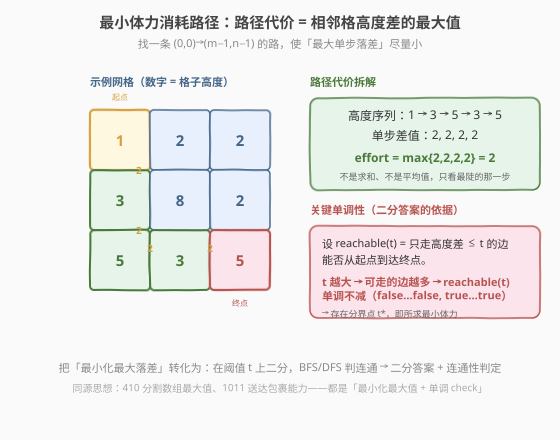
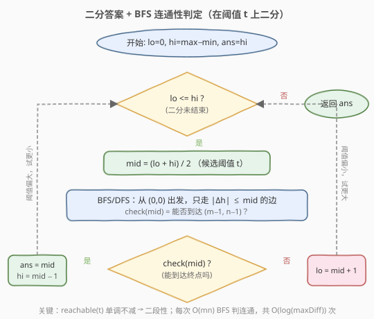

# 最小体力消耗路径

- **题目名称**：最小体力消耗路径
- **链接**：[1631. 最小体力消耗路径](https://leetcode.cn/problems/path-with-minimum-effort/)
- **难度**：中等
- **标签**：图、二分查找、广度优先搜索、并查集、堆（优先队列）

## 1. 题目概述

你准备徒步穿越一片地形。给定 $m \times n$ 的矩阵 `heights`，`heights[row][col]` 表示格子 $(row, col)$ 的高度。你从左上角 $(0, 0)$ 出发，希望到达右下角 $(m-1, n-1)$。每次只能**上、下、左、右**移动一格。

一条路径的**体力消耗**定义为该路径上**相邻两格高度差的绝对值的最大值**。返回从起点到终点的**最小体力消耗**。

**示例 1**：

```text
输入：heights = [[1,2,2],[3,8,2],[5,3,5]]
输出：2
解释：沿 (0,0)→(1,0)→(2,0)→(2,1)→(2,2) 走，
     高度序列 1→3→5→3→5，相邻差值 2,2,2,2，最大值 2。
```

**示例 2**：

```text
输入：heights = [[1,2,3],[3,8,4],[5,3,5]]
输出：1
解释：沿 (0,0)→(0,1)→(0,2)→(1,2)→(2,2) 走，
     高度序列 1→2→3→4→5，相邻差值均为 1。
```

**示例 3**：

```text
输入：heights = [[1,2,1,1,1],[1,2,1,2,1],[1,2,1,2,1],[1,2,1,2,1],[1,1,1,2,1]]
输出：0
解释：存在一条全程高度都为 1 的路径，最大差值 0。
```

**约束条件**：

- `m == heights.length`
- `n == heights[i].length`
- `1 <= m, n <= 100`
- $1 \le \text{heights}[i][j] \le 10^6$

---

## 2. 解题思路

### 2.1 暴力思路

枚举所有从 $(0,0)$ 到 $(m-1,n-1)$ 的路径，对每条路径取「相邻高度差的最大值」，再在所有路径中取最小。但网格上的路径数量是指数级的（每个格子最多 4 个方向，可反复经过时路径数趋于无穷；即使限定简单路径也远超时限）。需要换一个视角：**不要枚举路径，而去枚举「体力消耗的上限」**。

### 2.2 核心观察：二分答案 + 连通性判定



关键直觉是：**定义 `reachable(t)` = 只允许走高度差不超过 `t` 的边时，能否从起点走到终点**。则 `reachable(t)` 关于 `t` **单调不减**：

- `t` 越大，可走的边越多，连通范围只增不减；
- $t = 0$ 时只能走等高边（如示例 3），可能到不了；
- $t = \max - \min$ 时所有边都开放，必然可达。

于是存在一个**分界点** $t^*$：

```text
t < t* → reachable(t) = false   (落差卡住，到不了)
t >= t* → reachable(t) = true   (放得过去)
```

这正是二分查找所需的**二段性**。把「求最小体力消耗」转化为：在区间 $[0, \max - \min]$ 上二分阈值 `t`，每次用 BFS/DFS 判定 `reachable(mid)`，可行则去左半找更小的，不可行则去右半加大阈值。

> 💡 **识别信号**：题目求「最小的最大值」，且能用一次 `O(mn)` 的图遍历判定某个候选值是否合法 → 想「二分答案」。这与 [1011. 在 D 天内送达包裹的能力](../1001-1100/1011_在D天内送达包裹的能力.md)、[410. 分割数组的最大值](../0301-0400/410_分割数组的最大值.md) 是同一套「最小化最大值 + 单调 check」范式，只是 `check()` 从「贪心分段」换成了「BFS 判连通」。

> ⚠️ **上下界取值**：下界取 `0`（全部等高时答案为 0，如示例 3），不要取 `1`；上界取 $\max(\text{heights}) - \min(\text{heights})$（最陡单步落差的紧上界），比取 $10^6$ 更省几次二分。两端都满足二段性即可，取更紧的界只是常数优化。

### 2.3 算法流程图



注意判定为「可行」时**先记录 `ans = mid` 再收缩右界**（`hi = mid - 1`），保证最终保留的是「最小可行阈值」。`check(mid)` 用 BFS：从 $(0,0)$ 出发，只走满足 $|\text{heights}[u] - \text{heights}[v]| \le \text{mid}$ 的邻边，看能否到达 $(m-1, n-1)$。

### 2.4 示例演算

![示例演算：heights = [[1,2,2],[3,8,2],[5,3,5]]](../images/min_effort_example_walkthrough.svg)

以示例 1 为例，$\max = 8$、$\min = 1$，二分区间 $[0, 7]$：

- **第 1 轮** $[0,7]$，`mid=3`：落差 $\le 3$ 的边足够多，沿 `1→3→5→3→5` 即可到达 ✓ → 可行，记 `ans=3`，去左半 $[0,2]$。
- **第 2 轮** $[0,2]$，`mid=1`：落差 $\le 1$ 的边只能让起点连到上排 `1,2,2` 和右格 `2`，被中间的 `8`、下排的 `5,3` 切断，到不了终点 ✗ → 阈值太小，去右半 $[2,2]$。
- **第 3 轮** $[2,2]$，`mid=2`：落差 $\le 2$ 的边打通了 `1→3→5→3→5` 这条缓坡（仅 `8` 那格孤立），终点可达 ✓ → 可行，记 `ans=2`，`hi=1`。
- `lo=2 > hi=1`，循环结束，返回 `ans=2`。

> 💡 第 2、3 轮之间只有 `mid` 从 `1` 变到 `2`，但连通性发生了质变——`8` 与四周的落差都 $\ge 5$，始终是孤岛；而下排 `5,3,5` 之间的落差恰为 `2`，`mid=2` 时刚好把它们与起点连通。这正是单调分界点 $t^*=2$ 的几何含义。

---

## 3. 参考代码

### C++

```cpp
class Solution {
    static constexpr int dx[4] = {1, -1, 0, 0};
    static constexpr int dy[4] = {0, 0, 1, -1};

  public:
    int minimumEffortPath(vector<vector<int>>& heights) {
        int m = heights.size(), n = heights[0].size();

        int lo = 0;
        int hi = 0;
        int mn = heights[0][0], mx = heights[0][0];
        for (auto& row : heights)
            for (int v : row) {
                mn = min(mn, v);
                mx = max(mx, v);
            }
        hi = mx - mn;

        int ans = hi;
        while (lo <= hi) {
            int mid = lo + (hi - lo) / 2;
            if (canReach(heights, m, n, mid)) {
                ans = mid;          // 可行，尝试更小阈值
                hi = mid - 1;
            } else {
                lo = mid + 1;       // 到不了，加大阈值
            }
        }
        return ans;
    }

  private:
    // BFS：只走高度差 <= limit 的边，判定能否到达终点
    bool canReach(const vector<vector<int>>& h, int m, int n, int limit) {
        vector<vector<char>> vis(m, vector<char>(n, 0));
        queue<pair<int,int>> q;
        q.push({0, 0});
        vis[0][0] = 1;
        while (!q.empty()) {
            auto [x, y] = q.front(); q.pop();
            if (x == m - 1 && y == n - 1) return true;
            for (int k = 0; k < 4; ++k) {
                int nx = x + dx[k], ny = y + dy[k];
                if (nx < 0 || nx >= m || ny < 0 || ny >= n || vis[nx][ny]) continue;
                if (abs(h[x][y] - h[nx][ny]) <= limit) {
                    vis[nx][ny] = 1;
                    q.push({nx, ny});
                }
            }
        }
        return false;
    }
};
```

### Python

```python
class Solution:
    def minimumEffortPath(self, heights: List[List[int]]) -> int:
        m, n = len(heights), len(heights[0])
        flat = [v for row in heights for v in row]

        def can_reach(limit: int) -> bool:
            vis = [[False] * n for _ in range(m)]
            q = collections.deque([(0, 0)])
            vis[0][0] = True
            while q:
                x, y = q.popleft()
                if x == m - 1 and y == n - 1:
                    return True
                for nx, ny in (x+1, y), (x-1, y), (x, y+1), (x, y-1):
                    if 0 <= nx < m and 0 <= ny < n and not vis[nx][ny]:
                        if abs(heights[x][y] - heights[nx][ny]) <= limit:
                            vis[nx][ny] = True
                            q.append((nx, ny))
            return False

        lo, hi = 0, max(flat) - min(flat)
        ans = hi
        while lo <= hi:
            mid = (lo + hi) // 2
            if can_reach(mid):
                ans = mid          # 可行，尝试更小阈值
                hi = mid - 1
            else:
                lo = mid + 1       # 到不了，加大阈值
        return ans
```

> ⚠️ **三个易错点**：
> 1. **`check()` 终止条件放在出队时**：一旦弹出 $(m-1, n-1)$ 立即返回 `true`，不要等 BFS 跑完再扫一遍 `vis`，省一半时间。
> 2. **方向数组与边界检查**：四方向 `dx/dy` 别漏；越界和已访问都要 `continue`，否则会反复入队甚至死循环。
> 3. **上下界用全局极差而非 $10^6$**：`hi = max - min` 是「任一相邻边落差」的紧上界，比 $10^6$ 少约 10 次无效二分；下界用 `0` 覆盖全等高情况。

---

## 4. 复杂度分析

| 维度 | 复杂度 | 说明 |
|------|--------|------|
| 时间复杂度 | $O(mn \log D)$ | $D = \max - \min \le 10^6$；二分 $O(\log D)$ 次，每次 BFS $O(mn)$ |
| 空间复杂度 | $O(mn)$ | `vis` 数组 + BFS 队列 |

> 💡 $m,n \le 100$，$mn \le 10^4$，$\log D \approx 20$，总运算量约 $2 \times 10^5$，远低于时限。若把 `vis` 换成 `int` 数组复用（用 `visit_id` 标记而非每次清零）可进一步压常数，但本题无需。

---

## 5. 扩展：Dijkstra 变体与并查集

「二分答案 + BFS」之外，还有两种经典解法，思路不同但复杂度同级。

### 5.1 Dijkstra 变体（最小化路径上的最大边）

把 `dist[i][j]` 定义为「从起点到 $(i,j)$ 的所有路径中，最大单步落差的最小值」。松弛时不再累加边权，而是取**最大值**：

$$\text{dist}[v] = \min\bigl(\text{dist}[v],\ \max(\text{dist}[u],\ |\text{h}[u] - \text{h}[v]|)\bigr)$$

用最小堆按 `dist` 弹出，贪心正确性同样依赖「边权非负」（这里的"边权"是高度差，恒非负）。答案即 `dist[m-1][n-1]`。复杂度 $O(mn \log(mn))$。

> 💡 这与 [743. 网络延迟时间](../0701-0800/743_网络延迟时间.md) 的标准 Dijkstra 区别只在松弛算子：普通 Dijkstra 是「`dist[u] + w` 求和」，本题是「`max(dist[u], w)` 取大」。可看作**路径代价取 max-semiring** 上的最短路。

### 5.2 并查集（按边权排序增量连通）

把每对相邻格子看作一条边，边权 = 高度差。将所有边按权值升序排序，依次加入并查集；每加一条边就把两端点 union。当 $(0,0)$ 与 $(m-1,n-1)$ **首次连通**时，最后加入的那条边的权值即为答案——因为按升序加边，首次连通的瞬间，路径上最大边权恰好等于当前边权，且不可能更小。复杂度 $O(mn \log(mn))$（排序主导）。

> 💡 这与 [1584. 连接所有点的最小费用](../1501-1600/1584_连接所有点的最小费用.md) 的 Kruskal 同源：Kruskal 求 MST 时按边权升序加边，本题只需把终止条件从「连了 n-1 条边」换成「起终点连通」。本质都是**按权值从小到大解锁边，观察连通性首次满足的时刻**。

| 解法 | 核心思想 | 时间复杂度 | 适用场景 |
|------|----------|-----------|----------|
| **二分答案 + BFS**（本题主解） | 阈值单调，二分最小可行阈值 | $O(mn \log D)$ | 通用、易写，`check` 可换 DFS/并查集 |
| Dijkstra 变体 | 最小化路径最大边，堆取最小 | $O(mn \log(mn))$ | 求每个点到起点的「最大边最小值」时天然合适 |
| 并查集 + 排序 | 升序加边，首次连通即答案 | $O(mn \log(mn))$ | 只关心两点连通的临界权值 |

---

## 6. 面试要点

1. **为什么能二分？二段性体现在哪？**

   - `reachable(t)` 关于 `t` 单调不减：阈值越大，可走的边越多，连通范围只增不减。存在分界点 $t^*$，使 $t < t^*$ 时不可达、$t \ge t^*$ 时可达。这种「左不可行 / 右可行」的结构就是二段性。

2. **`check()` 用 BFS 还是 DFS？**

   - 两者都行，都是 $O(mn)$。BFS 用队列、迭代实现，不易爆栈，面试默认写 BFS；DFS 递归写法在 $m=n=100$ 时递归深度可达 $10^4$，部分语言栈可能溢出，需改迭代或显式栈。

3. **上下界为什么取 $0$ 和 $\max - \min$？**

   - 下界 `0`：全等高路径的体力为 0（如示例 3），取 `1` 会漏掉这种情况。上界 $\max - \min$：任意相邻边落差不会超过全局极差，故 $t = \max - \min$ 时所有边都开放，必然可达。取更松的上界（如 $10^6$）只多几次无效二分，不影响正确性。

4. **Dijkstra 变体的松弛算子为什么是 `max` 而不是 `+`？**

   - 路径代价定义为「最大单步落差」而非「落差之和」，故松弛时取 `max(dist[u], w)` 而非 `dist[u] + w`。这是 **max-semiring** 上的最短路：加法换成 max、乘法换成普通加法，Dijkstra 的贪心正确性依然成立（因为 max 满足单调性）。

5. **并查集解法为什么「首次连通」就是答案？**

   - 边按权值升序加入。首次让起终点连通的那一刻，连通路径上的最大边权就是最后加入的那条边的权值 $w_k$；由于之前的边权都 $\le w_k$，这条路径的体力恰为 $w_k$。又因升序，任何更小的阈值都会少加这条边而无法连通，故 $w_k$ 是最小值。

---

## 7. 同类练习题

- [1011. 在 D 天内送达包裹的能力](https://leetcode.cn/problems/capacity-to-ship-packages-within-d-days/)：同「二分答案 + 单调 check」范式，`check` 是贪心装船，求最小可行运力
- [410. 分割数组的最大值](https://leetcode.cn/problems/split-array-largest-sum/)：二分「最大子数组和」上限，`check` 贪心划分子数组，最小化最大值
- [778. 水位上升的泳池中游泳](https://leetcode.cn/problems/swim-in-rising-water/)：几乎与本题同构，二分水位 + BFS 判连通，或并查集升序加边
- [743. 网络延迟时间](https://leetcode.cn/problems/network-delay-time/)：堆优化 Dijkstra 模板，对照本题第 5 节的 max 松弛变体
- [1584. 连接所有点的最小费用](https://leetcode.cn/problems/min-cost-to-connect-all-points/)：Kruskal 最小生成树，对照本题并查集解法的「升序加边」思想
