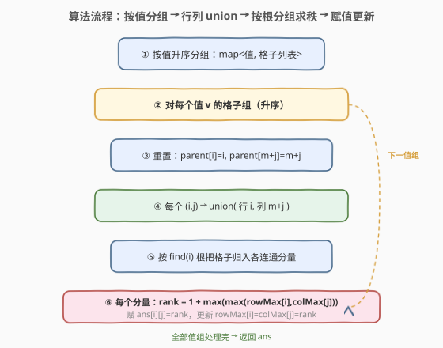

# 矩阵转换

- **题目名称**：矩阵转换
- **链接**：[1632. 矩阵转换](https://leetcode.cn/problems/rank-transform-of-a-matrix/)
- **难度**：困难
- **标签**：并查集、图、矩阵、排序

## 1. 题目概述

给定一个 $m \times n$ 的整数矩阵 `matrix`，将其中的每个元素替换为它的**秩**（rank）。秩是一个从 $1$ 开始的整数，需满足：

- 元素越大，秩越大；
- 若两个元素 $p$、$q$ 在**同一行或同一列**，则：
  - $p > q \Rightarrow \text{rank}(p) > \text{rank}(q)$；
  - $p = q \Rightarrow \text{rank}(p) = \text{rank}(q)$；
- 在满足上述约束的前提下，秩应**尽可能小**。

**示例 1**：

```text
输入：matrix = [[1,2],[3,4]]
输出：[[1,2],
       [2,3]]
解释：每行每列都严格递增，直接按相对大小赋秩即可。
```

**示例 2**：

```text
输入：matrix = [[7,7],[7,7]]
输出：[[1,1],
       [1,1]]
解释：四个 7 通过同行同列互相「传染」，必须取相同秩；又没有更小的元素，所以全为 1。
```

**约束条件**：

- $1 \le m, n \le 500$
- $-10^9 \le \text{matrix}[i][j] \le 10^9$

> 💡 题目核心是「**相对大小决定秩**」+「**等值元素在同行/同列时必须同秩**」。难点不在比较大小，而在等值元素会通过共享的行、列形成一张「约束图」——同一连通分量里的所有格子必须共用一个秩，而这个秩又要同时大于它们所在行/列中所有更小元素的秩。

---

## 2. 解题思路

### 2.1 暴力思路：枚举秩

最朴素的思路是对每个格子从 $1$ 开始枚举可能的秩，逐个校验是否满足同行同列的相对大小约束，不满足就加一。但完全不可行：

- 秩的上界可达 $mn$（$500\times500=2.5\times10^5$）；
- 校验涉及整行整列，每次 $O(m+n)$；
- 共 $mn$ 格，总复杂度天文数字，且等值元素之间的「同秩传染」让贪心增量法很容易顾此失彼。

> 💡 转换视角：不要「逐格赋秩」，而要**按值升序成批处理**——值小的先定秩，值大的据此递推。等值格子用并查集打包成「同秩连通分量」一次性赋值。

### 2.2 核心观察：行/列二分图并查集


关键观察分三层：

1. **按值升序处理**：值越小秩越小，先处理小值能为大值定下「下界」。处理某个值 $v$ 时，所有 $< v$ 的格子都已赋秩，其贡献记录在 `rowMax[i]`（第 $i$ 行已出现的最大秩）与 `colMax[j]`（第 $j$ 列已出现的最大秩）中。

2. **等值同秩传染**：若值同为 $v$ 的两个格子位于同一行或同一列，它们**必须同秩**；这种「同秩约束」还可能**传递**——$(r_1,c_1)$ 与 $(r_1,c_2)$ 同行同秩，$(r_1,c_2)$ 又与 $(r_2,c_2)$ 同列同秩，于是 $(r_1,c_1)$ 与 $(r_2,c_2)$ 也被绑定为同秩。这正是一张**约束图的连通分量**。

3. **二分图建模**：把每个**行号** $i$ 和每个**列号** $m{+}j$ 都作为并查集节点（共 $m{+}n$ 个）。对值 $v$ 的每个格子 $(i,j)$，做一次 `union(i, m+j)`——把「这一行」和「这一列」绑在一起。如此一来，凡是被等值格子串起来的行和列，都落在**同一个连通分量**里，必须共用一个秩。

> ⚠️ **为什么按值分组、每组独立重置并查集？** 同秩约束只在**值相等**的格子之间成立。不同值的格子之间是「大于/小于」关系，不属于同秩约束。因此每个值组内的 union 是独立的，处理完即可丢弃——下一组重置涉及节点的父指针即可。

> 💡 **秩的下界**：对值 $v$ 的某个连通分量，它涉及的每个行 $i$ 已有最大秩 `rowMax[i]`，每个列 $j$ 已有最大秩 `colMax[j]`。新秩必须**严格大于**这些已存在的更小元素的秩，因此取：
> $$\text{rank} = 1 + \max_{(i,j)\in\text{comp}}\big(\max(\text{rowMax}[i],\ \text{colMax}[j])\big)$$
> 这是在满足所有「同行同列更小元素」约束下的**最小可行秩**。

### 2.3 算法流程图



流程概括：

1. 用 `map` 按值升序收集所有格子（值 → 坐标列表）；
2. 对每个值 $v$ 的格子组：
   - **重置**：把涉及到的行节点 $i$、列节点 $m{+}j$ 的 `parent` 恢复为自身；
   - **union**：每个格子 $(i,j)$ 执行 `union(i, m+j)`，把同行同列的等值格子串成连通分量；
   - **分组求秩**：按 `find(i)` 的根把格子归入各分量，每个分量取 $\text{rank} = 1 + \max(\text{rowMax}[i], \text{colMax}[j])$；
   - **赋值并更新**：分量的所有格子写入 `ans[i][j] = rank`，并刷新 `rowMax[i] = colMax[j] = rank`；
3. 全部处理完返回 `ans`。

### 2.4 示例演算

![示例演算：matrix=[[2,2,5],[3,2,4]] 的逐值处理过程](../images/1632_example_walkthrough.svg)

以自定义例子 `matrix = [[2,2,5],[3,2,4]]`（$m=2, n=3$，列节点编号 $m{+}j = 2,3,4$）为例，按值升序逐组处理：

| 值 $v$ | 格子 | union 动作 | 连通分量 | $\max(\text{rowMax},\text{colMax})$ | 秩 | 更新后行/列最大秩 |
|--------|------|-----------|----------|--------------------------------------|----|-------------------|
| 2 | (0,0),(0,1),(1,1) | union(0,2),union(0,3),union(1,3) | {R0,R1,C0,C1}（三格同分量） | $\max(0,0,0,0)=0$ | 1 | rowMax=[1,1], colMax=[1,1,0] |
| 3 | (1,0) | union(1,2) | {R1,C0} | $\max(\text{rowMax}[1]=1,\text{colMax}[0]=1)=1$ | 2 | rowMax=[1,2], colMax=[2,1,0] |
| 4 | (1,2) | union(1,4) | {R1,C2} | $\max(\text{rowMax}[1]=2,\text{colMax}[2]=0)=2$ | 3 | rowMax=[1,3], colMax=[2,1,3] |
| 5 | (0,2) | union(0,4) | {R0,C2} | $\max(\text{rowMax}[0]=1,\text{colMax}[2]=3)=3$ | 4 | rowMax=[4,3], colMax=[2,1,4] |

最终结果：

```text
ans = [[1,1,4],
       [2,1,3]]
```

> 💡 **观察要点**：
> - 值 2 的三个格子中，(0,0) 与 (0,1) 同行(行 0)绑定，(0,1) 又与 (1,1) 同列(列 1)绑定，三者串成**一个分量**，共用秩 1；
> - 值 5 的格子 (0,2) 所在列 2 已被值 4 占到秩 3（`colMax[2]=3`），所以 5 的秩必须 $>3$，取 4；
> - 每组的秩都是「$1+\,$涉及行/列已有最大秩」，故为满足约束的**最小值**。

校验：行 0 中 $2{=}2{<}5 \Rightarrow 1{=}1{<}4$ ✓；列 0 中 $2{<}3 \Rightarrow 1{<}2$ ✓；列 2 中 $5{>}4 \Rightarrow 4{>}3$ ✓。全部成立。

---

## 3. 参考代码

### C++

```cpp
class Solution {
public:
    vector<vector<int>> matrixRankTransform(vector<vector<int>>& matrix) {
        int m = matrix.size(), n = matrix[0].size();
        vector<int> parent(m + n);
        iota(parent.begin(), parent.end(), 0);
        function<int(int)> find = [&](int x) {
            return parent[x] == x ? x : parent[x] = find(parent[x]);
        };

        map<int, vector<pair<int,int>>> valCells;
        for (int i = 0; i < m; ++i)
            for (int j = 0; j < n; ++j)
                valCells[matrix[i][j]].push_back({i, j});

        vector<int> rowMax(m, 0), colMax(n, 0);
        vector<vector<int>> ans(m, vector<int>(n, 0));

        for (auto& [v, cells] : valCells) {
            for (auto& [i, j] : cells) {
                parent[i] = i;
                parent[m + j] = m + j;
            }
            for (auto& [i, j] : cells) {
                int fi = find(i), fj = find(m + j);
                if (fi != fj) parent[fi] = fj;
            }
            unordered_map<int, vector<pair<int,int>>> comps;
            for (auto& [i, j] : cells)
                comps[find(i)].push_back({i, j});
            for (auto& [root, mem] : comps) {
                int rank = 0;
                for (auto& [i, j] : mem)
                    rank = max(rank, max(rowMax[i], colMax[j]));
                ++rank;
                for (auto& [i, j] : mem) {
                    ans[i][j] = rank;
                    rowMax[i] = rank;
                    colMax[j] = rank;
                }
            }
        }
        return ans;
    }
};
```

### Python

```python
class Solution:
    def matrixRankTransform(self, matrix: List[List[int]]) -> List[List[int]]:
        m, n = len(matrix), len(matrix[0])
        parent = list(range(m + n))

        def find(x):
            while parent[x] != x:
                parent[x] = parent[parent[x]]
                x = parent[x]
            return x

        from collections import defaultdict
        val_cells = defaultdict(list)
        for i in range(m):
            for j in range(n):
                val_cells[matrix[i][j]].append((i, j))

        row_max = [0] * m
        col_max = [0] * n
        ans = [[0] * n for _ in range(m)]

        for v in sorted(val_cells):
            cells = val_cells[v]
            for i, j in cells:
                parent[i] = i
                parent[m + j] = m + j
            for i, j in cells:
                fi, fj = find(i), find(m + j)
                if fi != fj:
                    parent[fi] = fj
            comps = defaultdict(list)
            for i, j in cells:
                comps[find(i)].append((i, j))
            for mem in comps.values():
                rank = 1 + max(max(row_max[i], col_max[j]) for i, j in mem)
                for i, j in mem:
                    ans[i][j] = rank
                    row_max[i] = rank
                    col_max[j] = rank
        return ans
```

> 💡 **写法细节**：
> - 并查集节点编号：行 $0 \sim m{-}1$，列 $m \sim m{+}n{-}1$，避免行列编号冲突；
> - `map` 自动按键（值）升序遍历，Python 用 `sorted(val_cells)` 显式排序；
> - 每组开头重置 `parent[i]`、`parent[m+j]` 为自身，是因为同秩约束**只在等值内部成立**，组间无继承；
> - 赋秩后立即更新 `rowMax`/`colMax`，为后续更大值提供下界。

---

## 4. 复杂度分析

| 维度 | 复杂度 | 说明 |
|------|--------|------|
| 时间复杂度 | $O\big(mn \cdot \log(mn) + mn \cdot \alpha(m{+}n)\big)$ | `map`/排序按键 $O(\log)$ 存取 $mn$ 个格子；每个格子常数次并查集操作，单次近 $O(\alpha)$ |
| 空间复杂度 | $O(m + n + mn)$ | 并查集 $O(m{+}n)$、`rowMax`/`colMax` 各 $O(m{+}n)$、答案矩阵 $O(mn)$（不计输出则 $O(m{+}n)$） |

> 💡 $m, n \le 500$，$mn \le 2.5\times10^5$，$\log(mn) \approx 18$，总操作约 $5\times10^6$ 量级，轻松通过。若值域较小可改用桶排序省去 $\log$ 因子，但本题值域达 $10^9$，比较排序最自然。

---

## 5. 扩展：为什么「按值分组独立重置」是正确的

并查集在传统用法里往往**全程共用**，而本题却**每组重置**。正确性源于两点：

1. **同秩约束的值相等前提**：只有值相等的格子才存在「必须同秩」的约束。值不同的格子之间是严格大小关系，不构成同秩绑定，因此上一组的连通结构对下一组**无意义**，丢弃不影响正确性。

2. **下界信息已外化**：上一组定下的秩已写入 `rowMax`/`colMax`，下一组求秩时直接读取这两个数组即可，**不依赖**并查集的连通结构。换言之，并查集只负责「组内同秩传染」，组间的「大于」关系由 `rowMax`/`colMax` 承载——职责分离，互不干扰。

| 做法 | 正确性 | 说明 |
|------|--------|------|
| 每组重置（本题） | ✅ | 组内同秩传染独立，组间靠 `rowMax`/`colMax` 传递下界 |
| 全程不重置 | ❌ | 不同值的格子会被错误地绑成同秩分量，破坏大小关系 |

> ⚠️ 若全程不重置，值 2 的格子把行 0、列 1 连上后，值 3 的格子若也落在行 0 或列 1，会被并入同一分量，从而被错误地赋成与值 2 **相同**的秩——直接违反「$3>2 \Rightarrow \text{rank}(3)>\text{rank}(2)$」。

---

## 6. 面试要点

1. **为什么要按值升序处理？**

   - 秩反映相对大小，值小的先定秩才能为大值提供下界。按值升序保证处理某个值时，所有比它小的元素已赋秩，其约束已固化在 `rowMax`/`colMax` 中，直接 $1+\max$ 即得最小可行秩。

2. **等值格子的「同秩传染」是如何建模的？**

   - 把行号和列号都作为并查集节点，每个等值格子 $(i,j)$ 执行 `union(行i, 列m+j)`。这样同行或同列的等值格子会把对应的行/列串进同一连通分量，分量内所有格子必须取相同秩——这就是「传染」的精确刻画。

3. **为什么每个值组要重置并查集？**

   - 同秩约束只在等值格子间成立。若不重置，不同值的格子会错误连通，被赋成相同秩，违反大小关系。组间的大小约束已由 `rowMax`/`colMax` 承载，与并查集职责分离，故重置不影响正确性。

4. **秩的公式 $1 + \max(\text{rowMax}[i], \text{colMax}[j])$ 为什么是最小值？**

   - $\text{rowMax}[i]$ 是第 $i$ 行已出现的最大秩（来自更小值的格子），新秩必须严格大于它；列同理。取两者最大值再加一，恰好满足「严格大于同行同列所有更小元素」的约束，且没有多余冗余，故为最小。

5. **能否不用并查集，用 DFS/BFS 求连通分量？**

   - 可以：对每个值组建图（同行/同列的等值格子连边），DFS 求连通分量。但建图需 $O(\text{组内格子数})$ 边数且实现更繁；并查集把「行/列」当节点，只需对每个格子做一次 union，代码更简洁、复杂度相同。

---

## 7. 同类练习题

- [684. 冗余连接](https://leetcode.cn/problems/redundant-connection/)：并查集判连通分量基础题，体会 union/find 的基本用法
- [547. 省份数量](https://leetcode.cn/problems/number-of-provinces/)：并查集数连通分量，对照本题「按根分组」的操作
- [952. 按公因数计算最大连通分量大小](https://leetcode.cn/problems/largest-component-size-by-common-factor/)：把数值映射到因子并查集，与本题「行列作节点」的建模思路异曲同工
- [1202. 交换字符串中的元素](https://leetcode.cn/problems/smallest-string-with-swaps/)：可交换位置用并查集连通后整体排序，与本题「同分量共享属性」的范式一致
- [721. 账户合并](https://leetcode.cn/problems/accounts-merge/)：公共邮箱把账户串成连通分量再合并，对照本题等值格子把行列串成同秩分量
