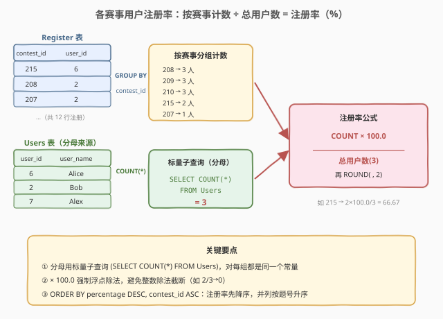
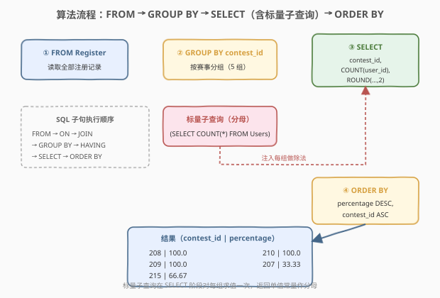
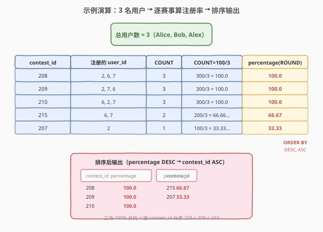

# 各赛事的用户注册率

- **题目名称**：各赛事的用户注册率
- **链接**：[1633. 各赛事的用户注册率](https://leetcode.cn/problems/percentage-of-users-attended-a-contest/)
- **难度**：简单
- **标签**：数据库、SQL、`GROUP BY`、`COUNT`、标量子查询、`ROUND`、整数除法陷阱、`ORDER BY` 多列排序

## 1. 题目概述

给定 `Users`（用户）和 `Register`（注册）两张表，编写 SQL 查询，统计**每个赛事**的**用户注册百分率**（注册该赛事的用户数 ÷ 总用户数 × 100），结果保留两位小数。返回结果按 `percentage` **降序**排序，若相同则按 `contest_id` **升序**排序。

**表结构**：

```text
Table: Users
+-------------+---------+
| Column Name | Type    |
+-------------+---------+
| user_id     | int     |  ← 主键
| user_name   | varchar |
+-------------+---------+
每位用户的 ID 与姓名。

Table: Register
+-------------+---------+
| Column Name | Type    |
+-------------+---------+
| contest_id  | int     |
| user_id     | int     |
+-------------+---------+
(contest_id, user_id) 是复合主键。
每行表示某用户注册了某赛事。
```

**示例 1**：

```text
输入：
Users 表:
+---------+-----------+
| user_id | user_name |
+---------+-----------+
| 6       | Alice     |
| 2       | Bob       |
| 7       | Alex      |
+---------+-----------+

Register 表:
+------------+---------+
| contest_id | user_id |
+------------+---------+
| 215        | 6       |
| 209        | 2       |
| 208        | 2       |
| 210        | 6       |
| 208        | 6       |
| 209        | 7       |
| 209        | 6       |
| 215        | 7       |
| 208        | 7       |
| 210        | 2       |
| 207        | 2       |
| 210        | 7       |
+------------+---------+

输出:
+------------+------------+
| contest_id | percentage |
+------------+------------+
| 208        | 100.0      |
| 209        | 100.0      |
| 210        | 100.0      |
| 215        | 66.67      |
| 207        | 33.33      |
+------------+------------+
```

**解释**：

| contest_id | 注册用户 | 注册数 | 计算 | percentage |
|------------|----------|--------|------|------------|
| 208 | Bob、Alice、Alex | 3 | $3 \div 3 \times 100$ | 100.0 |
| 209 | Bob、Alex、Alice | 3 | $3 \div 3 \times 100$ | 100.0 |
| 210 | Alice、Bob、Alex | 3 | $3 \div 3 \times 100$ | 100.0 |
| 215 | Alice、Alex | 2 | $2 \div 3 \times 100$ | 66.67 |
| 207 | Bob | 1 | $1 \div 3 \times 100$ | 33.33 |

三场赛事（208、209、210）所有用户都注册了，注册率 100% 并列，按 `contest_id` 升序排在前面；215 只有 Alice、Alex 注册（$2/3 \approx 66.67\%$）；207 只有 Bob 注册（$1/3 \approx 33.33\%$）。

**约束条件**：

- `user_id` 是 `Users` 表主键。
- `(contest_id, user_id)` 是 `Register` 表的复合主键——同一用户不会重复注册同一赛事。
- 结果按 `percentage` 降序、`contest_id` 升序排序。
- `percentage` 保留两位小数。

> 💡 本题是 SQL **"分组计数 + 标量分母求百分比"入门招牌题**——核心三步：① `GROUP BY contest_id` 按赛事分组；② `COUNT(user_id)` 算每组注册人数；③ 除以「总用户数」得百分比。难点有二：① **分母必须是 `Users` 表的总人数**（用标量子查询 `(SELECT COUNT(*) FROM Users)` 取得），而非 `Register` 中的去重用户数——因为有用户可能从未注册任何赛事，他们仍计入分母；② **`× 100.0` 强制浮点除法**，避免整数除法截断（如 `1/3` 被 truncate 成 `0`）。

---

## 2. 解题思路

### 2.1 暴力思路：逐赛事计数再除以总人数

最直觉的过程式思路：先数出 `Users` 表的总人数 $N$；再遍历每一个 `contest_id`，在 `Register` 表里数有多少行属于该赛事，得到注册数 $c$；最后计算 $c \times 100 / N$ 并保留两位小数。伪代码：

```text
N = COUNT(*) FROM Users           # 总用户数（常量分母）
result = []
for each contest_id in Register:  # 遍历每个赛事
    c = COUNT(*) FROM Register WHERE contest_id = cid
    pct = ROUND(c * 100.0 / N, 2)
    result.append((cid, pct))
result.sort(by percentage DESC, then contest_id ASC)
```

但**纯 SQL 没有显式逐行循环**——"按赛事分组 + 组内计数"需换成集合式表达：用 `GROUP BY contest_id` 把 `Register` 按赛事折叠成一行，再用聚合函数 `COUNT(user_id)` 一次性算出每组的注册人数。分母 $N$ 则用一个**标量子查询** `(SELECT COUNT(*) FROM Users)` 在 `SELECT` 列表中取得——它对每一组都返回同一个常量值。

### 2.2 核心观察：GROUP BY 计数 + 标量子查询取分母



**问题拆解为三个子问题**：

1. **按赛事分组计数**：`GROUP BY contest_id` + `COUNT(user_id)`。把 `Register` 的 12 行按 `contest_id` 折叠成 5 组（207、208、209、210、215），每组 `COUNT` 即该赛事的注册人数。
   - 因为 `(contest_id, user_id)` 是复合主键，同一赛事内不会有重复用户，故 `COUNT(user_id)` = `COUNT(*)` = `COUNT(DISTINCT user_id)`。若无此主键保证，应改用 `COUNT(DISTINCT user_id)` 防重复。

2. **取总用户数作分母**：`(SELECT COUNT(*) FROM Users)`。这是一个**标量子查询**——返回单行单列的值（本题中为 `3`）。它放在 `SELECT` 列表的除法表达式中，对每个分组都求值一次并返回同一个常量。
   - ⚠️ **分母必须是 `Users` 表的总人数，不是 `Register` 中的去重用户数**！`Register` 只记录"注册了某赛事的用户"，若有用户从未注册任何赛事，他不在 `Register` 里但仍计入总用户数。用 `COUNT(DISTINCT user_id) FROM Register` 会漏掉这些用户，导致分母偏小、百分比偏大。本题示例中三人都注册了至少一场，两种算法碰巧结果相同；但**题目语义明确要求分母是 `Users` 全部用户**。

3. **算百分比并保留两位小数**：`ROUND(COUNT(user_id) * 100.0 / (SELECT COUNT(*) FROM Users), 2)`。
   - `× 100.0` 把整数变成浮点数，强制走**浮点除法**。若写 `* 100 /`（整数），在 PostgreSQL/SQL Server 中 `整数/整数` 会截断小数（如 `200/3 = 66` 而非 `66.667`），导致 `ROUND(66, 2) = 66.00`——结果错误！MySQL 的 `/` 默认是 decimal 除法不会截断，但 `× 100.0` 是跨数据库通用的安全写法。
   - `ROUND(x, 2)` 四舍五入到两位小数。

> ⚠️ **整数除法陷阱**：SQL 标准中，两个整数相除的行为因数据库而异。MySQL 的 `/` 返回 DECIMAL（`1/3 = 0.3333`）；但 PostgreSQL、SQL Server 中 `int / int = int`（`1/3 = 0`，截断小数）。LeetCode 用 MySQL 不会踩坑，但**生产环境与跨数据库代码必须用 `× 100.0` 或 `CAST(... AS DECIMAL)` 强制浮点**。这是 SQL 求百分比的最常见坑点。

> 💡 **标量子查询 vs JOIN 取常量**：`(SELECT COUNT(*) FROM Users)` 是标量子查询写法——返回单值，直接嵌入表达式。另一种等价写法是 `CROSS JOIN (SELECT COUNT(*) AS cnt FROM Users) t` 把总人数作为一个单行派生表"广播"到每一行。两者逻辑等价，标量子查询更紧凑，CROSS JOIN 更显式（见第 3 节解法 B）。

### 2.3 算法流程图



**逻辑执行步骤**（注意 SQL 子句执行顺序与书写顺序不同）：

| 步骤 | 子句 | 作用 | 本题对应 |
|------|------|------|----------|
| ① | `FROM Register` | 确定数据源 | 读取全部 12 行注册记录 |
| ② | `GROUP BY contest_id` | 按赛事分组 | 折叠成 5 组（207/208/209/210/215） |
| ③ | `SELECT` | 选输出列 + 求值表达式 | `contest_id` + `ROUND(COUNT×100.0 / (标量子查询), 2)` |
| ④ | `ORDER BY percentage DESC, contest_id ASC` | 排序 | 注册率降序，并列按题号升序 |

> 💡 **SQL 子句执行顺序**：`FROM`（含 `JOIN`/`ON`）→ `WHERE` → `GROUP BY` → `HAVING` → `SELECT` → `ORDER BY` → `LIMIT`。本题没有 `WHERE`/`HAVING`。`GROUP BY` 先把行折叠成组，`SELECT` 阶段才对每组求值 `COUNT(user_id)` 和标量子查询。标量子查询 `(SELECT COUNT(*) FROM Users)` 不依赖外层的分组，对每组都返回同一个常量 `3`。

### 2.4 示例演算

以示例 1 的 3 名用户、12 行注册记录为例，观察「分组计数 → 除以总人数 3 → ROUND → 排序」的逐步过程：



**步骤 ①②：GROUP BY contest_id + COUNT(user_id)**

| contest_id | 组内行（user_id） | COUNT |
|------------|-------------------|-------|
| 207 | 2 | 1 |
| 208 | 2, 6, 7 | 3 |
| 209 | 2, 7, 6 | 3 |
| 210 | 6, 2, 7 | 3 |
| 215 | 6, 7 | 2 |

**步骤 ③：SELECT 求百分比（分母 = 标量子查询 = 3）**

$$\text{percentage} = \text{ROUND}\!\left(\frac{\text{COUNT} \times 100.0}{3},\ 2\right)$$

| contest_id | COUNT × 100.0 / 3 | ROUND(, 2) |
|------------|-------------------|------------|
| 208 | 300.0 / 3 = 100.0 | 100.0 |
| 209 | 300.0 / 3 = 100.0 | 100.0 |
| 210 | 300.0 / 3 = 100.0 | 100.0 |
| 215 | 200.0 / 3 = 66.666… | 66.67 |
| 207 | 100.0 / 3 = 33.333… | 33.33 |

**步骤 ④：ORDER BY percentage DESC, contest_id ASC**

三场 100% 并列 → 按 `contest_id` 升序：208 < 209 < 210；接着 66.67（215）；最后 33.33（207）。

| contest_id | percentage |
|------------|------------|
| 208 | 100.0 |
| 209 | 100.0 |
| 210 | 100.0 |
| 215 | 66.67 |
| 207 | 33.33 |

> 💡 **并列排序的要点**：`ORDER BY percentage DESC, contest_id ASC` 中逗号分隔的是**多级排序键**——先按 `percentage` 降序排，遇到相同值再按 `contest_id` 升序排。若只写 `ORDER BY percentage DESC`，三场 100% 的相对顺序不确定（SQL 不保证默认顺序），可能不符合题意。多级排序是"并列时打破平局"的标准手法。

---

## 3. 参考代码

### SQL（解法 A：标量子查询取分母，推荐）

```sql
SELECT contest_id,
       ROUND(COUNT(user_id) * 100.0 / (SELECT COUNT(*) FROM Users), 2) AS percentage
FROM Register
GROUP BY contest_id
ORDER BY percentage DESC, contest_id ASC;
```

> 💡 **写法要点**：
> - **`GROUP BY contest_id`**：按赛事分组，每组折叠成一行。
> - **`COUNT(user_id)`**：每组注册人数。因 `(contest_id, user_id)` 是主键，无组内重复，等价 `COUNT(*)`。
> - **`(SELECT COUNT(*) FROM Users)`**：标量子查询返回总用户数（单值常量），作分母。⚠️ 不能换成 `COUNT(DISTINCT user_id) FROM Register`——会漏掉未注册任何赛事的用户。
> - **`× 100.0`**：强制浮点除法，避免整数除法截断（跨数据库安全）。
> - **`ROUND(..., 2)`**：四舍五入到两位小数。
> - **`ORDER BY percentage DESC, contest_id ASC`**：注册率先降序，并列按题号升序。
> - ✓ **最推荐**：紧凑、语义清晰、标准 SQL 通用。

### SQL（解法 B：CROSS JOIN 派生表取分母）

```sql
SELECT r.contest_id,
       ROUND(COUNT(r.user_id) * 100.0 / t.total, 2) AS percentage
FROM Register r
CROSS JOIN (SELECT COUNT(*) AS total FROM Users) t
GROUP BY r.contest_id, t.total
ORDER BY percentage DESC, contest_id ASC;
```

> 💡 **解法 B 的思路**：把总用户数预先算成一个单行派生表 `t`，用 `CROSS JOIN`（笛卡尔积）"广播"到 `Register` 的每一行——`t.total` 成为每行都可引用的常量列。`GROUP BY` 时需把 `t.total` 也列入（SQL 标准要求非聚合列出现在 `GROUP BY` 中）。
>
> **与解法 A 的关系**：逻辑完全等价。解法 A 用标量子查询（隐式求值），解法 B 用 `CROSS JOIN` 派生表（显式提常量）。解法 B 的优势是分母只算一次、显式可见；劣势是 `GROUP BY` 要多写一个 `t.total`，稍显冗长。两者性能相同（优化器都会把总用户数计算提为常量扫描一次）。
>
> ⚠️ **为何 `GROUP BY` 要带 `t.total`**：`t.total` 是非聚合列（不在 `COUNT`/`ROUND` 内），SQL 标准要求它出现在 `GROUP BY` 中。MySQL 严格模式（`ONLY_FULL_GROUP_BY`，LeetCode 默认开启）会对此校验。由于 `t.total` 对所有行都是同一常量，把它列入 `GROUP BY` 不影响分组结果。

### Python（pandas）

```python
import pandas as pd

def percentage_of_users_attended_a_contest(
    users: pd.DataFrame, register: pd.DataFrame
) -> pd.DataFrame:
    total = len(users)
    cnt = register.groupby('contest_id')['user_id'].count().reset_index()
    cnt['percentage'] = (cnt['user_id'] * 100.0 / total).round(2)
    result = cnt[['contest_id', 'percentage']].sort_values(
        ['percentage', 'contest_id'], ascending=[False, True]
    )
    return result
```

> 💡 **pandas 对照**：
> - `len(users)` 对应 `(SELECT COUNT(*) FROM Users)`——取总用户数作分母（标量常量）。
> - `groupby('contest_id')['user_id'].count()` 对应 `GROUP BY contest_id` + `COUNT(user_id)`——按赛事分组计数。
> - `* 100.0 / total` 对应 `× 100.0 / 总用户数`——pandas 的 `/` 天然是浮点除法，无需额外处理。
> - `.round(2)` 对应 `ROUND(..., 2)`。
> - `.sort_values(['percentage', 'contest_id'], ascending=[False, True])` 对应 `ORDER BY percentage DESC, contest_id ASC`——多列排序，`ascending` 列表对应每列的方向。

---

## 4. 复杂度分析

| 维度 | 解法 A（标量子查询） | 解法 B（CROSS JOIN） | pandas |
|------|----------------------|----------------------|--------|
| **时间** | $O(n + m)$ | $O(n + m)$ | $O(n + m)$ |
| **空间** | $O(k)$ | $O(k)$ | $O(n + m)$ |
| **分母计算次数** | 1 次（优化器缓存） | 1 次（派生表物化） | 1 次（`len` 调用） |
| **可读性** | ✓ 紧凑 | ✓ 显式 | — |
| **推荐度** | ✓ **首选** | ✓ 备选 | ✓ 验证用 |

> - $n$ = `Register` 表行数，$m$ = `Users` 表行数，$k$ = 不同 `contest_id` 数（结果行数）。
> - **时间**：扫描 `Register` 一次 $O(n)$ 做 `GROUP BY` 计数；标量子查询扫描 `Users` 一次 $O(m)$ 取总人数。优化器通常把标量子查询视为常量只算一次，总计 $O(n + m)$。解法 B 的 `CROSS JOIN` 派生表也是单行，不增加笛卡尔积规模。
> - **空间**：`GROUP BY` 需 $O(k)$ 存每组的计数；解法 B 额外 $O(1)$ 存派生表单行；pandas 需 $O(n + m)$ 存 DataFrame。
> - **索引优化**：若 `Register(contest_id)` 上有索引，`GROUP BY contest_id` 可走索引有序扫描避免排序；标量子查询 `(SELECT COUNT(*) FROM Users)` 若 `Users` 表很小则全表扫描，若很大且只需计数可利用 `COUNT(*)` 走索引覆盖扫描（InnoDB 聚簇索引全扫）。

---

## 5. 扩展：整数除法陷阱 + 分母来源辨析

### 5.1 整数除法陷阱：为什么 `× 100.0`

SQL 求百分比时，分子 `COUNT(...)` 返回整数（MySQL 为 `BIGINT`）。两个整数相除的行为因数据库而异：

| 数据库 | `1 / 3` 的结果 | 类型 | 说明 |
|--------|----------------|------|------|
| MySQL | `0.3333` | DECIMAL | `/` 默认 decimal 除法，不截断 |
| PostgreSQL | `0` | INTEGER | `int / int = int`，截断小数 |
| SQL Server | `0` | INT | `int / int = int`，截断小数 |
| Oracle | `0.3333...` | NUMBER | 不截断 |

```sql
-- 陷阱写法（PostgreSQL/SQL Server 会出错）
SELECT ROUND(COUNT(user_id) * 100 / (SELECT COUNT(*) FROM Users), 2)
-- COUNT * 100 是整数，/ 整数 → 整数除法 → 200/3 = 66（截断）→ ROUND(66, 2) = 66.00 ❌

-- 安全写法（× 100.0 强制浮点）
SELECT ROUND(COUNT(user_id) * 100.0 / (SELECT COUNT(*) FROM Users), 2)
-- 100.0 是浮点，整个表达式提升为浮点 → 200.0/3 = 66.667 → ROUND = 66.67 ✓
```

> 💡 **通用规则**：**求百分比时分子或分母至少有一端是浮点数**。三种等价写法：① `× 100.0`（最简洁）；② `CAST(count AS DECIMAL)`；③ `* 100.0`。生产环境养成 `× 100.0` 的习惯，可避免跨数据库移植时的隐性 bug。这是 SQL 面试的高频考点。

### 5.2 分母来源：`Users` 总人数 vs `Register` 去重人数

本题分母必须是 `Users` 表的总用户数，而非 `Register` 中的去重用户数。两者区别在于**从未注册任何赛事的用户**：

| 分母来源 | SQL | 含义 | 本题是否正确 |
|----------|-----|------|--------------|
| `Users` 总人数 | `(SELECT COUNT(*) FROM Users)` | 全部用户（含未注册者） | ✓ 正确 |
| `Register` 去重人数 | `COUNT(DISTINCT user_id) FROM Register` | 至少注册一场的用户 | ✗ 偏小 |

> ⚠️ 若 `Users` 表有用户从未在 `Register` 出现（例如新增用户还没注册任何赛事），`COUNT(DISTINCT user_id) FROM Register` 会漏掉他，导致分母偏小、所有赛事百分比偏大。本题示例中 3 名用户都注册了至少一场，两种算法碰巧结果相同，但**题目语义要求分母是 `Users` 全部用户**——"注册率"的基准是全体用户，不是"活跃用户"。
>
> **辨析口诀**：分母是"被统计的总群体"，不是"参与统计的子群体"。本题总群体 = `Users` 全部用户，参与统计的子群体 = `Register` 出现过的用户。用错分母是求百分比题最隐蔽的逻辑错误。

### 5.3 `COUNT` 的三种形态

| 写法 | 语义 | 是否去重 | 本题适用 |
|------|------|----------|----------|
| `COUNT(*)` | 统计行数（含 NULL 行） | 否 | ✓（主键保证无重复） |
| `COUNT(user_id)` | 统计 `user_id` 非 NULL 的行数 | 否 | ✓（主键保证无重复） |
| `COUNT(DISTINCT user_id)` | 统计不同 `user_id` 数 | 是 | ✓（最严谨，但有主键时多余） |

> 💡 本题 `(contest_id, user_id)` 是复合主键，同一赛事内不会有重复 `user_id`，故三者结果相同。若题目无此主键保证（例如 `Register` 是日志表可能重复记录），必须用 `COUNT(DISTINCT user_id)` 防重复——否则一个用户重复注册多次会被多计。**有主键保证时 `COUNT(user_id)` 最简洁；无保证时 `COUNT(DISTINCT)` 最安全**。

### 5.4 多级排序：并列打破平局

`ORDER BY percentage DESC, contest_id ASC` 是多级排序：

| 排序键 | 方向 | 作用 |
|--------|------|------|
| `percentage` | `DESC`（降序） | 主键：注册率高的排前 |
| `contest_id` | `ASC`（升序） | 次键：注册率并列时按题号小的排前 |

```sql
-- ✗ 错误：只按 percentage 排序，并列时顺序不确定
ORDER BY percentage DESC;

-- ✓ 正确：并列时按 contest_id 升序打破平局
ORDER BY percentage DESC, contest_id ASC;
```

> 💡 **规则**：`ORDER BY` 用逗号分隔多个排序键，从前到后优先级递减。每个键可独立指定 `ASC`/`DESC`。SQL 标准不保证无 `ORDER BY` 列的顺序，故并列时必须显式指定次键，否则结果顺序不确定（可能因索引/执行计划不同而变化）。本题三场 100% 并列，靠 `contest_id ASC` 才稳定输出 `208 < 209 < 210`。

---

## 6. 面试要点

1. **分母为什么用 `(SELECT COUNT(*) FROM Users)` 而不是 `COUNT(DISTINCT user_id) FROM Register`？**

   > "注册率"的基准是 `Users` 表的全部用户，包括从未注册任何赛事的用户。`Register` 只记录注册了某赛事的用户，用 `COUNT(DISTINCT user_id) FROM Register` 会漏掉未注册者，导致分母偏小、百分比偏大。标量子查询 `(SELECT COUNT(*) FROM Users)` 取的是全体用户数，对每组都返回同一常量，是正确的分母。本题示例中所有用户都注册了至少一场，两种算法碰巧结果相同，但语义上必须用 `Users` 总人数。

2. **为什么 `× 100.0` 而不是 `× 100`？**

   > `COUNT(...)` 返回整数，`× 100` 仍是整数。在 PostgreSQL/SQL Server 中 `整数 / 整数` 做整数除法会截断小数（如 `200/3 = 66` 而非 `66.667`），导致 `ROUND(66, 2) = 66.00`——结果错误。`× 100.0` 把整数提升为浮点，强制走浮点除法。MySQL 的 `/` 默认返回 DECIMAL 不会截断，但 `× 100.0` 是跨数据库通用的安全写法，也是 SQL 面试高频考点。

3. **标量子查询和 `CROSS JOIN` 派生表有什么区别？**

   > 两者逻辑等价：标量子查询 `(SELECT COUNT(*) FROM Users)` 在 `SELECT` 列表中隐式求值返回单值；`CROSS JOIN (SELECT COUNT(*) AS total FROM Users) t` 把单行派生表广播到每行，`t.total` 成为可引用的常量列。性能相同（优化器都只算一次）。标量子查询更紧凑；`CROSS JOIN` 更显式但需在 `GROUP BY` 中补 `t.total`。本题推荐标量子查询。

4. **`COUNT(user_id)`、`COUNT(*)`、`COUNT(DISTINCT user_id)` 有何区别？本题该用哪个？**

   > `COUNT(*)` 统计行数（含 NULL）；`COUNT(user_id)` 统计该列非 NULL 的行数；`COUNT(DISTINCT user_id)` 统计该列不同值的个数（去重）。本题 `(contest_id, user_id)` 是复合主键，同一赛事内无重复用户，三者结果相同，用 `COUNT(user_id)` 最简洁。若无主键保证（日志表可能重复），必须用 `COUNT(DISTINCT user_id)` 防重复计数。

5. **`ORDER BY percentage DESC, contest_id ASC` 中逗号的作用？**

   > 逗号分隔多级排序键，优先级从左到右递减。先按 `percentage` 降序排，遇到相同值再按 `contest_id` 升序排打破平局。若只写 `ORDER BY percentage DESC`，三场 100% 并列的相对顺序不确定（SQL 不保证无 `ORDER BY` 列的顺序）。多级排序是"并列时稳定输出"的标准手法。

> 💡 **一句话总结**：1633 是 SQL **"分组计数 + 标量分母求百分比"入门招牌题**——核心模板「`GROUP BY contest_id` → `ROUND(COUNT(user_id) * 100.0 / (SELECT COUNT(*) FROM Users), 2)` → `ORDER BY percentage DESC, contest_id ASC`」。三大要点：**分母用 `Users` 总人数（禁 `Register` 去重数）、`× 100.0` 强制浮点（禁整数除法）、并列靠 `contest_id ASC` 打破平局**。

---

## 7. 同类练习题

- [1174. 即时食物配送 II](https://leetcode.cn/problems/immediate-food-delivery-ii/)（[题解](../1101-1200/1174_即时食物配送II.md)）：`GROUP BY` + `AVG`/百分比——按顾客分组算首次订单即配送的比例，与 1633 同为"分组后求百分比"骨架，分母是组内行数而非外部总表
- [1211. 查询结果的质量和占比](https://leetcode.cn/problems/queries-quality-and-percentage/)（[题解](../1201-1300/1211_查询结果的质量和占比.md)）：`GROUP BY` + `AVG` + `ROUND` + 百分比——按 `query_name` 分组算质量与劣质率，巩固"分组聚合 + 除法求比率"模板
- [597. 好友申请 I 总体通过率](https://leetcode.cn/problems/friend-requests-i-overall-acceptance-rate/)（[题解](../0501-0600/597_好友申请I总体通过率.md)）：`COUNT` + 除法求通过率——分子分母来自同一表的不同计数，与 1633 的"分母来自另一张表"形成对照，巩固"比率 = 子集计数 ÷ 全集计数"思想
- [511. 游戏玩法分析 I](https://leetcode.cn/problems/game-play-analysis-i/)（[题解](../0501-0600/511_游戏玩法分析I.md)）：`GROUP BY` + `MIN`——按玩家分组取首次登录日期，比 1633 更简单（无除法无百分比），巩固 `GROUP BY` + 聚合函数骨架
- [596. 超过 5 名学生的课](https://leetcode.cn/problems/classes-more-than-5-students/)（[题解](../0501-0600/596_超过5名学生的课.md)）：`GROUP BY` + `HAVING COUNT(*) >= 5`——分组计数后用 `HAVING` 筛组，与 1633 的"分组计数后不筛直接算比率"对照，体会 `GROUP BY` 后 `HAVING` vs `SELECT` 表达式的分工
