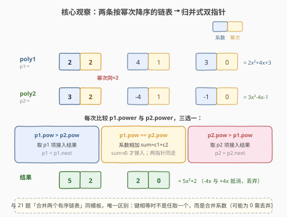
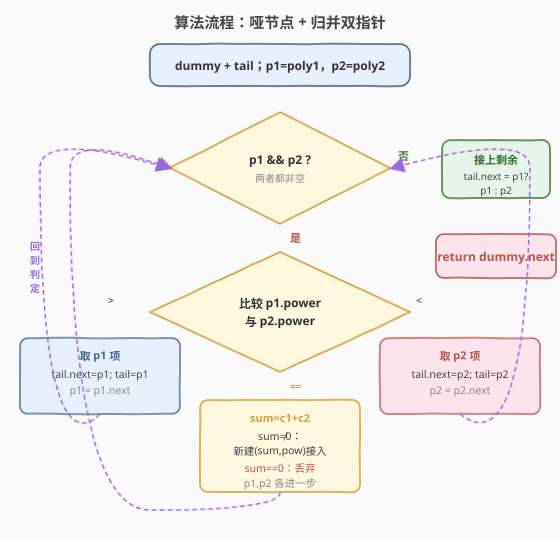
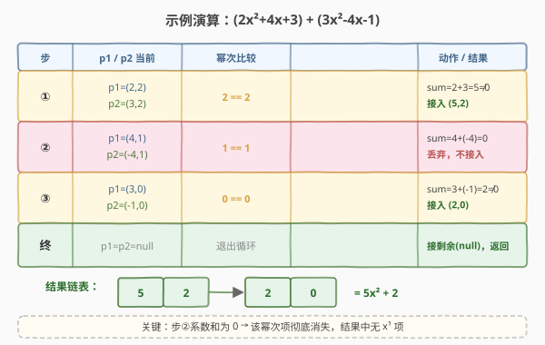

# LeetCode 求两个多项式链表的和 题解

## 1. 题目概述

- **标题 / 题号**：求两个多项式链表的和（#1634，medium）
- **链接**：https://leetcode.cn/problems/add-two-polynomials-represented-as-linked-lists/
- **难度**：中等
- **标签**：链表、双指针、归并

**题意**：**多项式链表**是一种特殊的单链表，每个节点表示多项式的一项，包含两个字段：

- `coefficient`：该项的**系数**
- `power`：该项的**幂次**（即 $x^{\text{power}}$ 的指数）

链表按 `power` **严格递减**排列。例如 `2x^2 + 4x + 3` 表示为：

```text
(2, 2) -> (4, 1) -> (3, 0)
```

给定两个多项式链表的头节点 `poly1` 与 `poly2`，返回它们**相加**后的多项式链表头节点。结果同样需按幂次严格递减排列；若相加后某项系数为 `0`，则该项**不出现**在结果中；若结果为零多项式，返回 `null`。

节点结构（C++）：

```cpp
struct PolyNode {
    int coefficient;
    int power;
    PolyNode *next;
};
```

**示例 1**：

```text
输入：poly1 = [[1,1]], poly2 = [[1,0]]
输出：[[1,1],[1,0]]
解释：poly1 = x，poly2 = 1，和为 x + 1
```

**示例 2**：

```text
输入：poly1 = [[2,2],[4,1],[3,0]], poly2 = [[3,2],[-4,1],[-1,0]]
输出：[[5,2],[2,0]]
解释：(2x²+4x+3) + (3x²-4x-1) = 5x² + 2
      幂次 1 的项系数 4+(-4)=0，丢弃
```

**示例 3**：

```text
输入：poly1 = [[1,1]], poly2 = [[-1,1]]
输出：[]
解释：x + (-x) = 0，零多项式返回 null
```

**约束**：

- `0 <= 节点数 <= 1000`
- `-1000 <= Node.coefficient <= 1000`
- `Node.power` 严格递减
- `0 <= Node.power <= 10^6`

> 💡 题目本质是**两条已按幂次降序排列的链表**做"按 key 归并"——这正是归并排序中合并两个有序序列的场景，与 [21. 合并两个有序链表](https://leetcode.cn/problems/merge-two-sorted-lists/) 同源，区别仅在于：key 相等时不是任取一个，而是**合并系数**（且合并后可能为 0 需丢弃）。

## 2. 解题思路

### 2.1 暴力思路：哈希表聚合 + 排序重建

最直白的做法是把两个链表都拆进一个哈希表 `power → coefficient`，遍历时把同幂次的系数累加；再按幂次降序取出非零项重建链表。

```text
for node in poly1:  table[node.power] += node.coefficient
for node in poly2:  table[node.power] += node.coefficient
按 power 降序排序，滤掉 coefficient==0 的项，重建链表
```

这样写完全正确，但付出了一次 $O((n+m)\log(n+m))$ 的排序和 $O(n+m)$ 的额外哈希空间。问题是：**输入链表本身已经按幂次有序**，排序是浪费——有序的输入应当用归并式双指针一次扫描完成合并。

### 2.2 核心观察：归并式双指针合并



关键洞察：`poly1` 与 `poly2` 都已按 `power` **严格递减**排列，这正是归并合并的输入条件。用双指针 `p1`、`p2` 同步遍历，**每轮比较当前两个节点的幂次**，三者必居其一：

| 情况 | 动作 |
|------|------|
| `p1.power > p2.power` | `p1` 的幂次更高、`poly2` 中没有同幂次项与之相加，直接把 `p1` 接入结果，`p1` 前进 |
| `p2.power > p1.power` | 对称地，把 `p2` 接入结果，`p2` 前进 |
| `p1.power == p2.power` | **同幂次项相加**：`sum = p1.c + p2.c`。若 `sum != 0` 才接入结果；无论是否为 0，`p1`、`p2` 同时前进 |

循环结束后，至多有一条链表还有剩余，直接拼到结果尾部即可。

> 💡 **为什么这是 $O(n+m)$？** 每轮循环 `p1` 或 `p2`（或两者）必至少前进一格，两指针各至多走完自身链表一次，总步数上界 $n+m$。

> ⚠️ **零系数项必须丢弃**：题目要求结果中不含系数为 0 的项。相等幂次相加后 `sum == 0` 时，既不接入结果、也不报错，直接跳过——这与示例 3（`x + (-x) = 0` 返回 `null`）一致。若所有项都相消，结果链表为空，`dummy.next` 自然为 `null`。

### 2.3 算法流程图



流程要点：

1. **哑节点 `dummy`** + 尾指针 `tail`：统一头节点与非头节点的拼接逻辑，免去"结果头是否为空"的特判，最后 `return dummy.next`。
2. **主循环** `while (p1 && p2)`：按幂次三选一，相等时合并系数、判断是否丢弃。
3. **收尾**：`tail->next = p1 ? p1 : p2`，把未耗尽的链表整段接上。
4. 返回 `dummy.next`。

### 2.4 示例演算



以 `poly1 = (2,2)→(4,1)→(3,0)`、`poly2 = (3,2)→(-4,1)→(-1,0)` 为例：

| 步 | p1 当前 | p2 当前 | 幂次比较 | 动作 | 结果（累加中） |
|----|---------|---------|----------|------|----------------|
| ① | (2,2) | (3,2) | 2 == 2 | sum=2+3=5≠0，接入 (5,2) | (5,2) |
| ② | (4,1) | (-4,1) | 1 == 1 | sum=4+(-4)=0，**丢弃** | (5,2) |
| ③ | (3,0) | (-1,0) | 0 == 0 | sum=3+(-1)=2≠0，接入 (2,0) | (5,2)→(2,0) |
| 终 | null | null | — | 退出循环，接剩余(null) | (5,2)→(2,0) = $5x^2+2$ |

> 💡 **观察要点**：步②是本题的精髓——同幂次相加为 0 时该项彻底消失，结果中既没有 $x^1$ 项、也不会留一个 (0,1) 的空壳节点。这正是"零系数丢弃"规则的体现。

## 3. 参考代码

### C++

```cpp
/**
 * Definition for polynomial singly-linked list.
 * struct PolyNode {
 *     int coefficient;
 *     int power;
 *     PolyNode *next;
 * };
 */
class Solution {
  public:
    PolyNode *addPoly(PolyNode *poly1, PolyNode *poly2) {
        PolyNode dummy;              // 哨兵，免去头节点特判
        PolyNode *tail = &dummy;
        PolyNode *p1 = poly1;
        PolyNode *p2 = poly2;

        while (p1 && p2) {
            if (p1->power > p2->power) {
                tail->next = p1;     // p1 幂次更高，直接 relink
                tail = p1;
                p1 = p1->next;
            } else if (p2->power > p1->power) {
                tail->next = p2;     // p2 幂次更高，直接 relink
                tail = p2;
                p2 = p2->next;
            } else {                 // 幂次相等：系数相加
                int sum = p1->coefficient + p2->coefficient;
                if (sum != 0) {      // 和为 0 丢弃，不接入
                    tail->next = new PolyNode(sum, p1->power);
                    tail = tail->next;
                }
                p1 = p1->next;
                p2 = p2->next;
            }
        }
        tail->next = p1 ? p1 : p2;   // 接上未耗尽的链表
        return dummy.next;
    }
};
```

### Python

```python
# Definition for polynomial singly-linked list.
# class PolyNode:
#     def __init__(self, x=0, y=0, next=None):
#         self.coefficient = x
#         self.power = y
#         self.next = next

class Solution:
    def addPoly(self, poly1: 'PolyNode', poly2: 'PolyNode') -> 'PolyNode':
        dummy = PolyNode()
        tail = dummy
        p1, p2 = poly1, poly2

        while p1 and p2:
            if p1.power > p2.power:
                tail.next = p1
                tail = p1
                p1 = p1.next
            elif p2.power > p1.power:
                tail.next = p2
                tail = p2
                p2 = p2.next
            else:
                s = p1.coefficient + p2.coefficient
                if s != 0:
                    tail.next = PolyNode(s, p1.power)
                    tail = tail.next
                p1 = p1.next
                p2 = p2.next

        tail.next = p1 if p1 else p2
        return dummy.next
```

> 💡 **写法细节**：
> - **非相等分支直接 `relink` 原节点**（`tail->next = p1; tail = p1; p1 = p1->next`）：这是 21 题合并有序链表的标准原地合并写法，$O(1)$ 额外空间，不新建节点、不改 coefficient。
> - **相等分支新建节点**（`new PolyNode(sum, power)`）：因为该幂次同时来自两条链表，复用任一方都需改写 coefficient、易引入"悬空 next 指针"的微妙问题，新建节点最清晰稳妥；新建节点数至多 $\min(n, m)$，且本就是结果的一部分，不计入额外空间。
> - **哑节点 `dummy`**：让"第一次拼接"与后续拼接走同一段代码，循环结束时 `tail->next` 一定是最后接入的节点，`return dummy.next` 一行收尾。

## 4. 复杂度分析

| 维度 | 复杂度 | 说明 |
|------|--------|------|
| 时间复杂度 | $O(n + m)$ | 每轮循环 `p1` 或 `p2`（或两者）至少前进一格，两指针各至多遍历自身链表一次 |
| 空间复杂度（额外） | $O(1)$ | 仅 `dummy`/`tail`/`p1`/`p2` 等指针；结果链表复用输入节点，相等项新建的节点本就是输出的一部分 |

> 💡 本题规模上限 1000 节点，任何 $O(n+m)$ 实现都能轻松 AC。复杂度分析的意义在于**确认没有引入不必要的排序或哈希开销**——暴力法的 $O((n+m)\log(n+m))$ 排序在本题的有序输入下纯属浪费。

## 5. 扩展：多项式乘法

把"加法"升级为"乘法"是本题最自然的延伸。多项式相乘 $P_1 \cdot P_2$ 可拆为：对 `poly1` 的每一项 $a_i x^{p_i}$，用它乘遍 `poly2` 整表，得到一条幂次降序的链表（每项系数乘 $a_i$、幂次加 $p_i$）。于是得到至多 $n$ 条各自有序的链表，再用 [23. 合并 K 个升序链表](https://leetcode.cn/problems/merge-k-sorted-lists/) 的最小堆 $K$ 路归并即可——合并时同样遇到"同幂次相加"的本题逻辑。

这是一个把"两路归并"推广到"K 路归并 + 合并同 key"的经典组合，体现归并模板的可组合性。

## 6. 面试要点

1. **为什么用归并双指针而不是哈希表聚合？**

   - 输入链表已按 `power` 严格递减，天然有序。双指针一次扫描 $O(n+m)$ 即可合并；哈希表需 $O(n+m)$ 额外空间、且要再排序重建，把"已有序"的免费信息丢掉了。**有序输入应优先用归并，而非打散重建。**

2. **系数和为 0 的项如何处理？零多项式返回什么？**

   - 相等幂次相加后 `sum == 0` 时，**不接入结果、不报错**，两指针照常前进。若所有项都相消，结果链表为空，`dummy.next` 自然为 `null`，即返回零多项式。题目要求结果不含零系数项，这一步是唯一需要显式处理"丢弃"的地方。

3. **哑节点 `dummy` 在这里解决什么问题？**

   - 统一头节点与非头节点的拼接：所有拼接都写成 `tail->next = x; tail = x`，无需特判"结果链表当前是否为空、是否首次插入"。循环结束直接 `return dummy.next`。这是链表构造类题目的通用起手式（21、2、88 都用）。

4. **相等幂次时为什么新建节点而不是复用 `p1` 的节点？**

   - 复用 `p1` 需改写 `p1->coefficient = sum`，且 `p1` 节点的 `next` 仍指向原 `poly1` 的下一节点——若紧接着遇到"丢弃"或"取 p2"分支，`tail->next` 会留下指向原链表的悬空指针，虽最终会被覆盖，但推理负担重、易写错。新建节点语义清晰：相等项的结果本就是"两系数之和"这个新值，用一个新节点表达最直接，且新建数 ≤ $\min(n,m)$，是输出的一部分、不算额外空间。

5. **与 21 题（合并两个有序链表）的异同？**

   - **同**：哑节点 + 双指针按 key 归并 + 收尾接剩余，模板完全一致。
   - **异**：21 题 key 相等时任取一个（链表稳定合并），本题 key 相等时**必须合并系数**，且合并后可能为 0 需丢弃——多了一个"计算 + 条件接入"的分支。可以理解为：21 题是"同 key 取其一"，本题是"同 key 取其和"。

## 同类练习题

| # | 题目 | 与本题的关联 |
|---|------|-------------|
| 21 | [合并两个有序链表](https://leetcode.cn/problems/merge-two-sorted-lists/)（[题解](../0001-0100/21_合并两个有序链表.md)） | 归并双指针 + 哑节点的母题，本题在其上增加"相等合并系数" |
| 2 | [两数相加](https://leetcode.cn/problems/add-two-numbers/)（[题解](../0001-0100/2_两数相加.md)） | 链表模拟算术，对照本题"按幂次合并"与"按位进位"的不同语义 |
| 1570 | [两个稀疏向量的点积](https://leetcode.cn/problems/dot-product-of-two-sparse-vectors/)（[题解](../1501-1600/1570_两个稀疏向量的点积.md)） | 稀疏表示 + 双指针对齐索引，乘积不合并 key，对照本题"相等合并" |
| 23 | [合并 K 个升序链表](https://leetcode.cn/problems/merge-k-sorted-lists/) | 归并的 K 路扩展，可用于多项式乘法后的多链表合并（见第 5 节扩展） |
| 88 | [合并两个有序数组](https://leetcode.cn/problems/merge-sorted-array/) | 归并双指针的数组版，对照链表版"relink vs 原地覆盖"的实现差异 |
