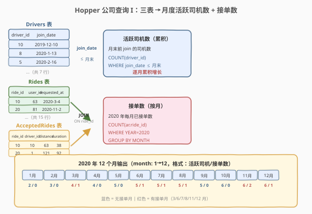
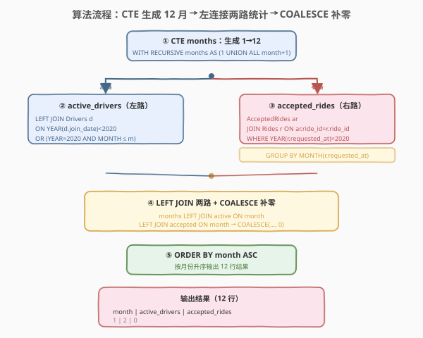
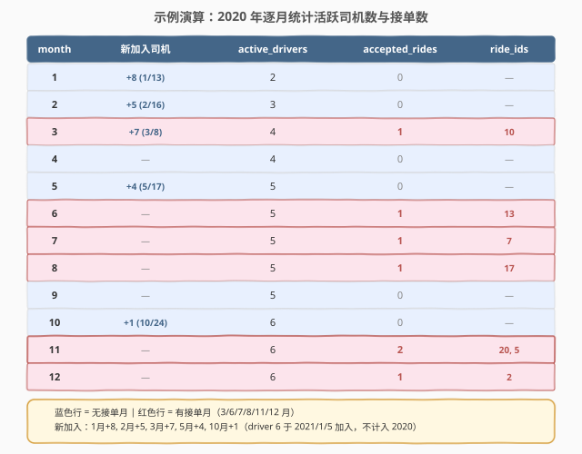

# LeetCode Hopper公司查询I 题解

## 1. 题目概述

- **标题 / 题号**：Hopper公司查询I（#1635，hard）
- **链接**：https://leetcode.com/problems/hopper-company-queries-i/
- **难度**：困难
- **标签**：数据库、SQL、`WITH RECURSIVE`、`LEFT JOIN`、`COALESCE`、累积计数、`GROUP BY`、`YEAR()`/`MONTH()`

**题意**：给定 `Drivers`（司机）、`Rides`（乘车请求）和 `AcceptedRides`（已接单）三张表，编写 SQL 查询，统计 **2020 年每个月**的两项指标：

1. **`active_drivers`**：截至该月底，**已加入** Hopper 公司的司机总数（`join_date` ≤ 该月末）。
2. **`accepted_rides`**：该月内**被接受**的乘车请求数（按 `Rides.requested_at` 的月份归属）。

结果按 `month` **升序**排列（1 月 = 1，2 月 = 2，…，12 月 = 12），需输出全部 12 个月（即使某月无数据也要输出 0）。

**表结构**：

```text
Table: Drivers
+-------------+---------+
| Column Name | Type    |
+-------------+---------+
| driver_id   | int     |  ← 主键
| join_date   | date    |
+-------------+---------+
每位司机的 ID 与加入日期。

Table: Rides
+--------------+---------+
| Column Name  | Type    |
+--------------+---------+
| ride_id      | int     |  ← 主键
| user_id      | int     |
| requested_at | date    |
+--------------+---------+
每行一条乘车请求（含未被接受的）。

Table: AcceptedRides
+---------------+---------+
| Column Name   | Type    |
+---------------+---------+
| ride_id       | int     |  ← 主键（引用 Rides.ride_id）
| driver_id     | int     |
| ride_distance | int     |
| ride_duration | int     |
+---------------+---------+
每行一条已接单记录，保证 ride_id 在 Rides 表中存在。
```

**示例 1**：

```text
Drivers 表:
+-----------+------------+
| driver_id | join_date  |
+-----------+------------+
| 10        | 2019-12-10 |
| 8         | 2020-1-13  |
| 5         | 2020-2-16  |
| 7         | 2020-3-8   |
| 4         | 2020-5-17  |
| 1         | 2020-10-24 |
| 6         | 2021-1-5   |
+-----------+------------+

Rides 表（2020 年部分）:
+---------+---------+--------------+
| ride_id | user_id | requested_at |
+---------+---------+--------------+
| 10      | 63      | 2020-3-4     |
| 19      | 39      | 2020-4-6     |
| 3       | 41      | 2020-6-3     |
| 13      | 52      | 2020-6-22    |
| 7       | 69      | 2020-7-16    |
| 17      | 70      | 2020-8-25    |
| 20      | 81      | 2020-11-2    |
| 5       | 57      | 2020-11-9    |
| 2       | 42      | 2020-12-9    |
+---------+---------+--------------+

AcceptedRides 表（2020 年部分）:
+---------+-----------+---------------+---------------+
| ride_id | driver_id | ride_distance | ride_duration |
+---------+-----------+---------------+---------------+
| 10      | 10        | 63            | 38            |
| 13      | 10        | 73            | 96            |
| 7       | 8         | 100           | 28            |
| 17      | 7         | 119           | 68            |
| 20      | 1         | 121           | 92            |
| 5       | 7         | 42            | 101           |
| 2       | 4         | 6             | 38            |
+---------+-----------+---------------+---------------+

输出:
+-------+----------------+----------------+
| month | active_drivers | accepted_rides |
+-------+----------------+----------------+
| 1     | 2              | 0              |
| 2     | 3              | 0              |
| 3     | 4              | 1              |
| 4     | 4              | 0              |
| 5     | 5              | 0              |
| 6     | 5              | 1              |
| 7     | 5              | 1              |
| 8     | 5              | 1              |
| 9     | 5              | 0              |
| 10    | 6              | 0              |
| 11    | 6              | 2              |
| 12    | 6              | 1              |
+-------+----------------+----------------+
```

**解释**：

| 月末 | 新加入司机 | active_drivers | accepted_rides | 说明 |
|------|-----------|----------------|----------------|------|
| 1 月 | driver 8 (1/13) | 2 (10, 8) | 0 | driver 10 去年已加入 |
| 2 月 | driver 5 (2/16) | 3 (10, 8, 5) | 0 | — |
| 3 月 | driver 7 (3/8) | 4 | 1 | ride 10 被接受 (3/4) |
| 4 月 | — | 4 | 0 | ride 19 请求但未被接受 |
| 5 月 | driver 4 (5/17) | 5 | 0 | — |
| 6 月 | — | 5 | 1 | ride 13 被接受 (6/22) |
| 7 月 | — | 5 | 1 | ride 7 被接受 (7/16) |
| 8 月 | — | 5 | 1 | ride 17 被接受 (8/25) |
| 9 月 | — | 5 | 0 | 无已接单 |
| 10 月 | driver 1 (10/24) | 6 | 0 | — |
| 11 月 | — | 6 | 2 | ride 20, 5 被接受 |
| 12 月 | — | 6 | 1 | ride 2 被接受 (12/9) |

> ⚠️ driver 6 的 `join_date` 为 `2021-1-5`，不在 2020 年范围内，因此 2020 年任何月份都不计入 `active_drivers`。

**约束**：

- `driver_id` 是 `Drivers` 表主键。
- `ride_id` 是 `Rides` 表和 `AcceptedRides` 表的主键。
- `AcceptedRides` 中的每条记录保证在 `Rides` 表中存在。
- 结果必须覆盖 2020 年全部 12 个月，按 `month` 升序排列。
- `active_drivers` 是**累积值**（截至月末已加入的司机总数），`accepted_rides` 是**当月值**（该月被接受的请求数）。

> 💡 本题是 SQL **"多表 JOIN + 递归生成序列 + 累积计数 + LEFT JOIN 补零"综合招牌题**——三大难点：① 用 `WITH RECURSIVE` 生成 1–12 月骨架；② `active_drivers` 按 `join_date ≤ 月末`做累积计数（非分组聚合，是 LEFT JOIN + 条件筛选）；③ `accepted_rides` 需 JOIN 两表后按月分组计数，再用 `LEFT JOIN + COALESCE` 把无接单月补零。

## 2. 解题思路

### 2.1 暴力思路：逐月查询拼接

最直觉的过程式思路：对 2020 年的每个月，分别执行两条子查询——一条数 `Drivers` 表中 `join_date ≤ 该月末`的行数，另一条数 `AcceptedRides JOIN Rides` 后 `requested_at` 落在该月的行数——然后用 `UNION ALL` 拼成 12 行。伪代码：

```text
for month m in 1..12:
    end_of_month = last_day(2020, m)
    active = COUNT(*) FROM Drivers WHERE join_date <= end_of_month
    rides  = COUNT(*) FROM AcceptedRides ar
             JOIN Rides r ON ar.ride_id = r.ride_id
             WHERE YEAR(r.requested_at) = 2020 AND MONTH(r.requested_at) = m
    output(m, active, rides)
```

但**SQL 没有显式 for 循环**——需要换用集合式表达。核心挑战有三：

1. **生成 12 行月份骨架**：即使某月无任何数据，也必须输出该月且 `accepted_rides = 0`。这需要一个"数字序列"作为 LEFT JOIN 的左表。
2. **`active_drivers` 是累积计数**：不是按月分组后 `COUNT`，而是"截至月末有多少司机的 `join_date` 在此前"——每个月的分母不同（只增不减）。
3. **`accepted_rides` 需要跨表 JOIN**：`AcceptedRides` 没有 `requested_at` 列，必须 JOIN `Rides` 表取请求日期，再按月分组。

### 2.2 核心观察：CTE 序列 + 双路 LEFT JOIN + COALESCE



**问题拆解为四个子问题**：

1. **生成 1–12 月序列**（CTE `months`）：

   ```sql
   WITH RECURSIVE months(month) AS (
       SELECT 1
       UNION ALL
       SELECT month + 1 FROM months WHERE month < 12
   )
   ```

   用 `WITH RECURSIVE` 生成 1→12 的 12 行骨架。这是"序列生成"的标准手法——MySQL 8.0+ 支持 `WITH RECURSIVE`，也可用 `VALUES (1),(2),...,(12)` 或 `JSON_TABLE` 等替代。**这 12 行是 LEFT JOIN 的左表，保证即使某月无数据也输出该月。**

   > ⚠️ **为什么需要序列生成？** SQL 是面向集合的，没有"遍历 1 到 12"的循环。若直接 `GROUP BY MONTH(requested_at)`，没有接单的月份不会出现在结果中（如 1、2、4、5、9、10 月），导致输出不足 12 行。用预生成的 12 行序列做 LEFT JOIN 的左表，是"确保输出行数固定"的标准模式。

2. **算 `active_drivers`**（累积计数）：

   对每个月 `m`，数 `Drivers` 表中 `join_date ≤ 2020 年 m 月最后一天`的司机数。关键：driver 6 的 `join_date` 为 `2021-1-5`，超过 2020 年范围，任何月份都不计入。

   判定条件：`YEAR(d.join_date) < 2020 OR (YEAR(d.join_date) = 2020 AND MONTH(d.join_date) <= m)`

   - `YEAR < 2020`：去年或更早加入的司机（如 driver 10，2019-12-10 加入），每月都计入。
   - `YEAR = 2020 AND MONTH ≤ m`：2020 年内加入的司机，只有加入月 ≤ 当前月才计入。

   用 `LEFT JOIN` 把 `months` 和 `Drivers` 连起来，再 `GROUP BY month` 做 `COUNT(driver_id)`：

   ```sql
   SELECT m.month, COUNT(d.driver_id) AS active_drivers
   FROM months m
   LEFT JOIN Drivers d
     ON YEAR(d.join_date) < 2020
     OR (YEAR(d.join_date) = 2020 AND MONTH(d.join_date) <= m.month)
   GROUP BY m.month
   ```

   > 💡 **`LEFT JOIN` + `COUNT(列名)` 的配合**：`COUNT(d.driver_id)` 只计非 NULL 的行。若某月没有任何已加入司机（理论上不会发生，因为 driver 10 去年就加入了），`LEFT JOIN` 产生 NULL，`COUNT` 返回 0。用 `COUNT(*)` 会把 NULL 行也算成 1，导致结果错误。

3. **算 `accepted_rides`**（按月分组计数）：

   `AcceptedRides` 没有 `requested_at`，需 JOIN `Rides` 取请求日期。然后筛选 2020 年的记录，按月分组计数：

   ```sql
   SELECT MONTH(r.requested_at) AS month, COUNT(ar.ride_id) AS accepted_rides
   FROM AcceptedRides ar
   JOIN Rides r ON ar.ride_id = r.ride_id
   WHERE YEAR(r.requested_at) = 2020
   GROUP BY MONTH(r.requested_at)
   ```

   此 CTE 只返回有接单的月份（3、6、7、8、11、12 月共 6 行），其余 6 个月不出现。

4. **合并两路 + COALESCE 补零**：

   将 `months` LEFT JOIN `active_drivers` CTE 和 `accepted_rides` CTE，用 `COALESCE` 把 NULL 填为 0：

   ```sql
   SELECT m.month,
          a.active_drivers,
          COALESCE(ar.accepted_rides, 0) AS accepted_rides
   FROM months m
   LEFT JOIN active_cte a ON m.month = a.month
   LEFT JOIN accepted_cte ar ON m.month = ar.month
   ORDER BY m.month
   ```

   > 💡 **`COALESCE` 的作用**：`accepted_rides` CTE 只有 6 行（有接单的月份），LEFT JOIN 后其余 6 个月的 `accepted_rides` 为 NULL。`COALESCE(NULL, 0)` 把 NULL 转成 0。这是"LEFT JOIN 补零"的标准收尾。`active_drivers` 理论上每月都有值（driver 10 从 1 月起就在），但用 `COALESCE` 保险也无妨。

### 2.3 算法流程图



**逻辑执行步骤**：

| 步骤 | CTE / 子句 | 作用 | 输出行数 |
|------|-----------|------|----------|
| ① | `WITH RECURSIVE months` | 生成 1→12 月骨架 | 12 行 |
| ② | `active_drivers` CTE | LEFT JOIN Drivers + 累积计数 | 12 行 |
| ③ | `accepted_rides` CTE | AcceptedRides JOIN Rides + 按月分组 | 6 行（仅有接单月） |
| ④ | 主查询 | months LEFT JOIN ②③ + COALESCE | 12 行 |
| ⑤ | `ORDER BY month` | 按月升序排列 | 12 行 |

> 💡 **执行顺序**：`WITH RECURSIVE` 先递归生成 `months` CTE → 两个子 CTE 分别计算 `active_drivers` 和 `accepted_rides` → 主查询把三者 LEFT JOIN 起来 → `COALESCE` 补零 → `ORDER BY` 排序。CTE 之间可以引用前面的 CTE，形成流水线。

### 2.4 示例演算

以示例 1 的数据为例，观察逐月统计过程：



**步骤 ①②：active_drivers 累积计数**

| month | LEFT JOIN 条件 | 匹配到的 driver_id | COUNT |
|-------|---------------|-------------------|-------|
| 1 | join ≤ 2020-1-31 | 10, 8 | 2 |
| 2 | join ≤ 2020-2-29 | 10, 8, 5 | 3 |
| 3 | join ≤ 2020-3-31 | 10, 8, 5, 7 | 4 |
| 4 | join ≤ 2020-4-30 | 10, 8, 5, 7 | 4 |
| 5 | join ≤ 2020-5-31 | 10, 8, 5, 7, 4 | 5 |
| 6–9 | join ≤ 月末 | 10, 8, 5, 7, 4 | 5 |
| 10 | join ≤ 2020-10-31 | 10, 8, 5, 7, 4, 1 | 6 |
| 11–12 | join ≤ 月末 | 10, 8, 5, 7, 4, 1 | 6 |

> driver 6（`join_date = 2021-1-5`）在所有 12 个月的 LEFT JOIN 中都不满足条件，不计入。

**步骤 ③：accepted_rides 按月分组**

| ride_id | requested_at | month | 是否在 AcceptedRides |
|---------|-------------|-------|---------------------|
| 10 | 2020-3-4 | 3 | ✓ |
| 19 | 2020-4-6 | 4 | ✗（未被接受） |
| 3 | 2020-6-3 | 6 | ✗ |
| 13 | 2020-6-22 | 6 | ✓ |
| 7 | 2020-7-16 | 7 | ✓ |
| 17 | 2020-8-25 | 8 | ✓ |
| 20 | 2020-11-2 | 11 | ✓ |
| 5 | 2020-11-9 | 11 | ✓ |
| 2 | 2020-12-9 | 12 | ✓ |

分组后 `accepted_rides` CTE 只返回 6 行：

| month | accepted_rides |
|-------|----------------|
| 3 | 1 |
| 6 | 1 |
| 7 | 1 |
| 8 | 1 |
| 11 | 2 |
| 12 | 1 |

**步骤 ④：LEFT JOIN + COALESCE 合并**

| month | active_drivers | accepted_rides (原始) | COALESCE 后 |
|-------|----------------|----------------------|-------------|
| 1 | 2 | NULL → | 0 |
| 2 | 3 | NULL → | 0 |
| 3 | 4 | 1 | 1 |
| 4 | 4 | NULL → | 0 |
| 5 | 5 | NULL → | 0 |
| 6 | 5 | 1 | 1 |
| 7 | 5 | 1 | 1 |
| 8 | 5 | 1 | 1 |
| 9 | 5 | NULL → | 0 |
| 10 | 6 | NULL → | 0 |
| 11 | 6 | 2 | 2 |
| 12 | 6 | 1 | 1 |

> 💡 **关键对比**：`active_drivers` 是**单调递增**的累积值（只增不减，因为司机加入后不会退出）；`accepted_rides` 是**按月独立**的当月值（每月各自计数，互不影响）。两类指标的计算逻辑完全不同——前者用 LEFT JOIN + 条件筛选 + COUNT，后者用 INNER JOIN + GROUP BY + COUNT。

## 3. 参考代码

### SQL（解法 A：WITH RECURSIVE + 双路 LEFT JOIN，推荐）

```sql
WITH RECURSIVE months(month) AS (
    SELECT 1
    UNION ALL
    SELECT month + 1 FROM months WHERE month < 12
),
active_drivers_cte AS (
    SELECT m.month, COUNT(d.driver_id) AS active_drivers
    FROM months m
    LEFT JOIN Drivers d
        ON YEAR(d.join_date) < 2020
        OR (YEAR(d.join_date) = 2020 AND MONTH(d.join_date) <= m.month)
    GROUP BY m.month
),
accepted_rides_cte AS (
    SELECT MONTH(r.requested_at) AS month, COUNT(ar.ride_id) AS accepted_rides
    FROM AcceptedRides ar
    JOIN Rides r ON ar.ride_id = r.ride_id
    WHERE YEAR(r.requested_at) = 2020
    GROUP BY MONTH(r.requested_at)
)
SELECT m.month,
       a.active_drivers,
       COALESCE(ar.accepted_rides, 0) AS accepted_rides
FROM months m
LEFT JOIN active_drivers_cte a ON m.month = a.month
LEFT JOIN accepted_rides_cte ar ON m.month = ar.month
ORDER BY m.month;
```

> 💡 **写法要点**：
> - **`WITH RECURSIVE months`**：递归 CTE 生成 1→12 的 12 行序列，是保证输出行数的骨架。基准 `SELECT 1` + 递推 `month + 1 WHERE month < 12`，终止于 12。
> - **`active_drivers_cte`**：`LEFT JOIN Drivers` 时 ON 条件用 `YEAR < 2020 OR (YEAR = 2020 AND MONTH ≤ m)` 判定"截至月末已加入"。`COUNT(d.driver_id)` 只计非 NULL 行（LEFT JOIN 不匹配时 driver_id 为 NULL，COUNT 跳过）。
> - **`accepted_rides_cte`**：`AcceptedRides JOIN Rides` 取 `requested_at`，`WHERE YEAR = 2020` 筛选年份，`GROUP BY MONTH` 按月分组计数。只返回有接单的月份。
> - **主查询**：`months LEFT JOIN` 两路 CTE，`COALESCE(ar.accepted_rides, 0)` 把无接单月的 NULL 补零。
> - ✓ **最推荐**：逻辑清晰、标准 SQL 通用、CTE 分层可读性强。

### SQL（解法 B：子查询 + CROSS JOIN，无递归）

```sql
SELECT m.month,
       (SELECT COUNT(*) FROM Drivers d
        WHERE d.join_date <= DATE_FORMAT(CONCAT('2020-', LPAD(m.month, 2, '0'), '-31'), '%Y-%m-%d')
              AND d.join_date < '2021-01-01') AS active_drivers,
       (SELECT COUNT(*) FROM AcceptedRides ar
        JOIN Rides r ON ar.ride_id = r.ride_id
        WHERE YEAR(r.requested_at) = 2020 AND MONTH(r.requested_at) = m.month) AS accepted_rides
FROM (SELECT 1 AS month UNION ALL SELECT 2 UNION ALL SELECT 3 UNION ALL
      SELECT 4 UNION ALL SELECT 5 UNION ALL SELECT 6 UNION ALL
      SELECT 7 UNION ALL SELECT 8 UNION ALL SELECT 9 UNION ALL
      SELECT 10 UNION ALL SELECT 11 UNION ALL SELECT 12) m
ORDER BY m.month;
```

> 💡 **解法 B 的思路**：用 12 个 `UNION ALL` 手写月份序列（替代 `WITH RECURSIVE`），两个指标各用**相关子查询**直接在 SELECT 列表中计算。
>
> - `active_drivers` 子查询：`join_date <= 月末日期 AND join_date < '2021-01-01'`——用 `DATE_FORMAT` + `LPAD` 拼出每月末日期，同时排除 2021 年加入的司机。⚠️ 此处用每月第 31 天做近似不严谨（2 月只有 28/29 天），应使用 `LAST_DAY()` 函数：`d.join_date <= LAST_DAY(CONCAT('2020-', LPAD(m.month, 2, '0'), '-01'))`。
> - `accepted_rides` 子查询：JOIN + `WHERE YEAR = 2020 AND MONTH = m.month` 直接按月计数。
>
> **与解法 A 的关系**：逻辑等价。解法 A 用 CTE 分层、LEFT JOIN 合并，可读性强；解法 B 用子查询直接嵌入，无需递归但代码更冗长。两者性能相近（优化器会把子查询展平为 JOIN）。

### Python（pandas）

```python
import pandas as pd

def hopper_company_queries_i(
    drivers: pd.DataFrame, rides: pd.DataFrame, accepted_rides: pd.DataFrame
) -> pd.DataFrame:
    months = pd.DataFrame({'month': range(1, 13)})

    drivers['join_date'] = pd.to_datetime(drivers['join_date'])

    def count_active(m):
        end_of_month = pd.Timestamp(year=2020, month=m, day=1) + pd.offsets.MonthEnd(0)
        return len(drivers[drivers['join_date'] <= end_of_month])

    months['active_drivers'] = months['month'].apply(count_active)

    rides['requested_at'] = pd.to_datetime(rides['requested_at'])
    accepted = accepted_rides.merge(rides[['ride_id', 'requested_at']], on='ride_id')
    accepted = accepted[accepted['requested_at'].dt.year == 2020]
    accepted['month'] = accepted['requested_at'].dt.month
    ride_counts = accepted.groupby('month').size().reset_index(name='accepted_rides')

    result = months.merge(ride_counts, on='month', how='left')
    result['accepted_rides'] = result['accepted_rides'].fillna(0).astype(int)
    return result[['month', 'active_drivers', 'accepted_rides']].sort_values('month')
```

> 💡 **pandas 对照**：
> - `pd.DataFrame({'month': range(1, 13)})` 对应 `WITH RECURSIVE months`——生成 1→12 骨架。
> - `pd.Timestamp(...) + pd.offsets.MonthEnd(0)` 对应"该月最后一天"——用 `MonthEnd` 偏移自动算月末（正确处理 2 月 28/29 天）。
> - `drivers[drivers['join_date'] <= end_of_month]` 对应 `LEFT JOIN Drivers ON join_date ≤ 月末`——按月末日期筛选已加入司机。
> - `accepted_rides.merge(rides, on='ride_id')` 对应 `AcceptedRides JOIN Rides ON ride_id`——取 `requested_at`。
> - `.dt.year == 2020` 对应 `WHERE YEAR = 2020`；`.dt.month` 对应 `MONTH()`；`.groupby('month').size()` 对应 `GROUP BY MONTH + COUNT`。
> - `.merge(ride_counts, how='left') + fillna(0)` 对应 `LEFT JOIN + COALESCE`——无接单月补零。

## 4. 复杂度分析

| 维度 | 解法 A（CTE + LEFT JOIN） | 解法 B（子查询） | pandas |
|------|--------------------------|-----------------|--------|
| **时间** | $O(12 \times d + r + a)$ | $O(12 \times (d + r + a))$ | $O(d + r + a)$ |
| **空间** | $O(12 + r + a)$ | $O(12)$ | $O(d + r + a)$ |
| **序列生成** | `WITH RECURSIVE` | `UNION ALL × 12` | `range(1, 13)` |
| **可读性** | ✓ CTE 分层清晰 | ✗ 子查询嵌套深 | ✓ 函数式直观 |
| **推荐度** | ✓ **首选** | ✓ 备选（无递归环境） | ✓ 验证用 |

> - $d$ = `Drivers` 表行数，$r$ = `Rides` 表行数，$a$ = `AcceptedRides` 表行数。
> - **时间**：解法 A 的 `active_drivers_cte` 对每个月 LEFT JOIN Drivers 并 COUNT，$O(12 \times d)$；`accepted_rides_cte` JOIN + GROUP BY，$O(r + a)$。解法 B 每行执行两个相关子查询，$O(12 \times (d + r + a))$，略慢。pandas 向量化操作 $O(d + r + a)$。
> - **空间**：CTE 物化 12 行 months + $a$ 行 accepted_rides，$O(12 + a)$。pandas 需 $O(d + r + a)$ 存 DataFrame。
> - **索引优化**：`Drivers(join_date)` 上建索引可加速累积计数；`Rides(ride_id)` 和 `AcceptedRides(ride_id)` 上的主键索引使 JOIN 高效；`Rides(requested_at)` 上的索引可加速 `WHERE YEAR = 2020` 筛选。

## 5. 扩展：序列生成方法对比 + 累积计数模式

### 5.1 SQL 中生成数字序列的多种方法

本题需要生成 1–12 的月份序列。不同 MySQL 版本和环境支持的方法：

| 方法 | 语法 | 适用版本 | 优劣 |
|------|------|----------|------|
| `WITH RECURSIVE` | `SELECT 1 UNION ALL SELECT n+1 WHERE n<12` | MySQL 8.0+ | ✓ 标准、灵活、可扩展 |
| `UNION ALL` 手写 | `SELECT 1 UNION ALL SELECT 2 ... SELECT 12` | 全版本 | ✗ 冗长、不可扩展 |
| `VALUES` 列表 | `VALUES ROW(1), ROW(2), ... ROW(12)` | MySQL 8.0.19+ | ✓ 简洁，但行数固定 |
| `JSON_TABLE` | `JSON_TABLE('[1,2,...,12]', '$[*]' ...)` | MySQL 8.0+ | ✓ 灵活，适合大序列 |
| 数字辅助表 | 预建 `numbers` 表存 1–N | 全版本 | ✓ 最快，需维护物理表 |

```sql
-- 方法 1：WITH RECURSIVE（推荐）
WITH RECURSIVE months(month) AS (
    SELECT 1 UNION ALL SELECT month + 1 FROM months WHERE month < 12
)
SELECT month FROM months;

-- 方法 2：UNION ALL 手写（兼容旧版）
SELECT 1 AS month UNION ALL SELECT 2 UNION ALL SELECT 3 UNION ALL
SELECT 4 UNION ALL SELECT 5 UNION ALL SELECT 6 UNION ALL
SELECT 7 UNION ALL SELECT 8 UNION ALL SELECT 9 UNION ALL
SELECT 10 UNION ALL SELECT 11 UNION ALL SELECT 12;

-- 方法 3：JSON_TABLE（MySQL 8.0+，适合大序列）
SELECT jt.month
FROM JSON_TABLE('[1,2,3,4,5,6,7,8,9,10,11,12]',
                '$[*]' COLUMNS(month INT PATH '$')) jt;
```

> 💡 **选择建议**：MySQL 8.0+ 优先 `WITH RECURSIVE`（标准、灵活、可读）；旧版 MySQL 用 `UNION ALL` 手写；生产环境可预建数字辅助表 `numbers`，一次建表永久复用。

### 5.2 累积计数 vs 分组计数

本题两个指标体现了两种截然不同的计数模式：

| 模式 | 指标 | SQL 手法 | 特征 |
|------|------|----------|------|
| **累积计数** | `active_drivers` | LEFT JOIN + 条件筛选 + COUNT | 截至某时间点的**总量**，单调递增 |
| **分组计数** | `accepted_rides` | INNER JOIN + GROUP BY + COUNT | 某时间段内的**增量**，各月独立 |

```sql
-- 累积计数：截至月末已加入的司机总数
SELECT m.month, COUNT(d.driver_id) AS active_drivers
FROM months m
LEFT JOIN Drivers d ON d.join_date <= end_of_month(m.month)
GROUP BY m.month;
-- 结果：2 → 3 → 4 → 4 → 5 → 5 → 5 → 5 → 5 → 6 → 6 → 6（单调递增）

-- 分组计数：当月被接受的请求数
SELECT MONTH(r.requested_at) AS month, COUNT(*) AS accepted_rides
FROM AcceptedRides ar JOIN Rides r ON ar.ride_id = r.ride_id
WHERE YEAR(r.requested_at) = 2020
GROUP BY MONTH(r.requested_at);
-- 结果：1 → 0 → 1 → 0 → 1 → 1 → 1 → 0 → 0 → 2 → 1（各月独立波动）
```

> 💡 **辨析口诀**：累积计数问"**到现在为止总共多少**"（用 LEFT JOIN + 条件 ≤ 某点），分组计数问"**这段时间内新增多少**"（用 GROUP BY + WHERE 范围）。混淆两者是 SQL 时间序列题最常见错误。

### 5.3 `COALESCE` vs `IFNULL` vs `CASE WHEN`

LEFT JOIN 后补零的三种写法：

```sql
-- 写法 1：COALESCE（SQL 标准，推荐）
COALESCE(ar.accepted_rides, 0) AS accepted_rides

-- 写法 2：IFNULL（MySQL 专用）
IFNULL(ar.accepted_rides, 0) AS accepted_rides

-- 写法 3：CASE WHEN（通用但冗长）
CASE WHEN ar.accepted_rides IS NULL THEN 0 ELSE ar.accepted_rides END
```

| 函数 | 标准 | 支持 | 参数个数 | 推荐 |
|------|------|------|----------|------|
| `COALESCE` | SQL 标准 | 全数据库 | ≥ 2（可链式） | ✓ **首选** |
| `IFNULL` | MySQL 专属 | MySQL/SQL Server | 2 | ✓ MySQL 环境 |
| `CASE WHEN` | SQL 标准 | 全数据库 | — | ✗ 冗长 |

> 💡 `COALESCE` 是 SQL 标准函数，支持多参数链式取首个非 NULL 值（`COALESCE(a, b, c, 0)`），跨数据库通用，是补零的首选。`IFNULL` 是 MySQL 的简写但只支持两参数。生产代码优先 `COALESCE`。

### 5.4 `YEAR()` / `MONTH()` 函数的索引陷阱

```sql
-- ⚠️ 索引不友好：函数作用于列上，索引失效
WHERE YEAR(r.requested_at) = 2020 AND MONTH(r.requested_at) = m.month

-- ✓ 索引友好：范围比较，可走索引
WHERE r.requested_at >= '2020-01-01' AND r.requested_at < '2021-01-01'
  AND r.requested_at >= start_of_month(m.month)
  AND r.requested_at < start_of_month(m.month + 1)
```

> ⚠️ `YEAR(col)` / `MONTH(col)` 在列上套函数，数据库无法直接利用 `requested_at` 上的索引（需全表扫描后逐行计算函数值）。生产环境应改用**范围比较**（`>= 起始日 AND < 下月起始日`），让优化器走索引范围扫描。LeetCode 数据量小不影响，但面试时提到此优化可展示索引意识。

## 6. 面试要点

1. **为什么需要 `WITH RECURSIVE` 生成 1–12 月序列？不能直接 `GROUP BY MONTH` 吗？**

   > 直接 `GROUP BY MONTH(requested_at)` 只返回有数据的月份。本题要求输出全部 12 个月（包括无接单的月份，`accepted_rides = 0`）。必须预生成 1–12 的 12 行序列作为 LEFT JOIN 的左表，保证输出行数固定。`WITH RECURSIVE` 是生成序列的标准手法，也可用 `UNION ALL` 手写或 `JSON_TABLE` 替代。

2. **`active_drivers` 为什么是 LEFT JOIN + COUNT 而不是 GROUP BY？**

   > `active_drivers` 是**累积计数**（截至月末已加入的司机总数），不是按月分组的增量。每个月需要对 `Drivers` 全表做"join_date ≤ 月末"的筛选再 COUNT，而非按 join_date 的月份分组。用 `LEFT JOIN months m ON d.join_date ≤ 月末(m)` + `GROUP BY m.month` + `COUNT(d.driver_id)` 实现：LEFT JOIN 让每个月与所有已加入司机匹配，COUNT 统计匹配到的行数。

3. **`COUNT(d.driver_id)` 和 `COUNT(*)` 在 LEFT JOIN 中有什么区别？**

   > `COUNT(*)` 统计所有行（含 NULL 行），`COUNT(d.driver_id)` 只统计 `d.driver_id` 非 NULL 的行。LEFT JOIN 不匹配时 `d.driver_id` 为 NULL，此时 `COUNT(*)` 仍返回 1（把 NULL 行算上），而 `COUNT(d.driver_id)` 返回 0。本题需要"无匹配时返回 0"，必须用 `COUNT(d.driver_id)`（或 `COUNT(DISTINCT d.driver_id)`）。

4. **`COALESCE(ar.accepted_rides, 0)` 的作用是什么？**

   > `accepted_rides` CTE 只返回有接单的月份（6 行），LEFT JOIN 后其余 6 个月的 `accepted_rides` 列为 NULL。`COALESCE(NULL, 0)` 把 NULL 转成 0，保证输出中无接单月显示为 0 而非 NULL。这是 LEFT JOIN 补零的标准收尾手法。

5. **driver 6（`join_date = 2021-1-5`）为什么不计入 2020 年的 `active_drivers`？**

   > 本题只统计 2020 年的月份。LEFT JOIN 条件 `YEAR(d.join_date) < 2020 OR (YEAR = 2020 AND MONTH ≤ m)` 排除了 `YEAR = 2021` 的司机。driver 6 的 `join_date` 为 2021-1-5，在任何 2020 年月份的 LEFT JOIN 中都不匹配，故不计入。

> 💡 **一句话总结**：1635 是 SQL **"多表 JOIN + 递归序列 + 累积计数 + LEFT JOIN 补零"综合招牌题**——核心模板「`WITH RECURSIVE months` → 双路 CTE（LEFT JOIN 累积 + GROUP BY 分组）→ `LEFT JOIN + COALESCE` 合并补零」。三大要点：**序列生成保行数、累积 vs 分组辨析、COALESCE 补零收尾**。

## 同类练习题

| # | 题目 | 与本题的关联 |
|---|------|-------------|
| 1636 | [按照频率将数组升序排序](https://leetcode.cn/problems/sort-array-by-increasing-frequency/) | `GROUP BY` + `COUNT` + 多级排序——同样是"分组计数"骨架，但作用于数组而非表，巩固 `GROUP BY + COUNT` 模板 |
| 1174 | [即时食物配送 II](https://leetcode.cn/problems/immediate-food-delivery-ii/)（[题解](../1101-1200/1174_即时食物配送II.md)） | 多表 JOIN + `GROUP BY` + 比率计算——与 1635 同为"JOIN 后分组统计"骨架，对照累积 vs 分组两种计数模式 |
| 602 | [好友申请 II 谁有最多好友](https://leetcode.cn/problems/friend-requests-ii-who-has-the-most-friends/) | `UNION ALL` 合并两列 + `GROUP BY` + 排序——序列合并与分组计数的组合，巩固"多源数据合并后分组"思路 |
| 1321 | [餐厅营业额变化](https://leetcode.com/problems/restaurant-growth/) | `WITH RECURSIVE` + 累积窗口 + `GROUP BY`——同样是"生成序列 + 累积统计"模式，用窗口函数实现 7 天滚动和，对照 1635 的 LEFT JOIN 累积计数 |
| 180 | [连续出现的数字](https://leetcode.cn/problems/consecutive-numbers/)（[题解](../0101-0200/180_连续出现的数字.md)） | `LEFT JOIN` 自连接 + 条件筛选——累积/连续判定型 JOIN，对照 1635 的 LEFT JOIN 累积计数思路 |
