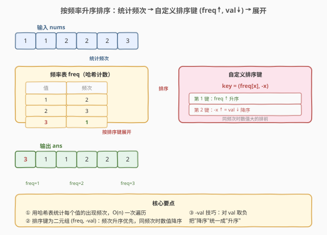

# LeetCode 按照频率将数组升序排序 题解

## 1. 题目概述

- **标题 / 题号**：按照频率将数组升序排序（#1636，easy）
- **链接**：https://leetcode.cn/problems/sort-array-by-increasing-frequency/
- **难度**：简单
- **标签**：数组、哈希表、排序

**题意**：给定一个整数数组 `nums`，请将数组按照每个值的**频率升序**排序。若多个值的频率相同，则按照**数值本身降序**排序。返回排序后的数组。

**示例 1**：

```text
输入：nums = [1,1,2,2,2,3]
输出：[3,1,1,2,2,2]
解释：'3' 频率为 1，'1' 频率为 2，'2' 频率为 3。
      频率互不相同，直接按频率升序排列。
```

**示例 2**：

```text
输入：nums = [2,3,1,3,2]
输出：[1,3,3,2,2]
解释：'2' 和 '3' 频率都为 2，按数值本身降序 → 3 排在 2 前面。
      '1' 频率为 1，排在最前。
```

**示例 3**：

```text
输入：nums = [-1,1,-6,4,5,-6,1,4,1]
输出：[5,-1,4,4,-6,-6,1,1,1]
```

**约束**：

- $1 \le \text{nums.length} \le 100$
- $-100 \le \text{nums[i]} \le 100$

> 💡 题目本质是**「哈希计数 + 自定义排序」**——先用哈希表统计每个值的出现频次，再以 `(freq, -val)` 为排序键做一次排序。难点不在计数，而在排序键的设计：频率升序是主键，同频次时数值降序是次键，两者方向相反，需要用 `-val` 技巧把"降序"统一成"升序"。

## 2. 解题思路

### 2.1 暴力思路：分组后按规则拼接

最直白的做法：先遍历一遍统计每个值的出现频次；再把值按频次分组（频次 1 的放一组、频次 2 的放一组……）；每组内按数值降序排列；最后按频次从小到大把各组依次拼起来输出。

```text
freq = Counter(nums)
groups = defaultdict(list)
for val, cnt in freq.items():
    groups[cnt].append(val)
result = []
for cnt in sorted(groups.keys()):        # 频次升序
    for val in sorted(groups[cnt], reverse=True):  # 同频次数值降序
        result.extend([val] * cnt)
```

这样写完全正确，但引入了分组、多层排序、拼接等额外逻辑，代码冗长。**问题在于把"排序"这件事手动拆成了"分组 + 组内排序 + 拼接"三步**——而排序本身就是比较两个元素的大小关系，只要定义好比较函数，一次 `sort` 即可完成全部工作。

### 2.2 核心观察：统一排序键 (freq, -val)



关键洞察：题目要求的排序规则可以提炼为一个**二元排序键**：

| 排序键 | 方向 | 含义 |
|--------|------|------|
| 第 1 键：`freq[x]` | 升序 | 频率小的排前 |
| 第 2 键：`-x` | 升序 | `-x` 升序等价于 `x` 降序，同频次时数值大的排前 |

> 💡 **`-val` 技巧**：大多数排序库默认按升序排列。当某个维度需要降序时，对其取负即可把"降序"统一成"升序"——`-x` 的升序就是 `x` 的降序。这样两个维度都用升序，一个 `key=lambda x: (freq[x], -x)` 搞定，无需自定义比较函数。这是 Python 多键排序的惯用写法。

> ⚠️ **为什么用 `-val` 而不是直接写降序比较？** 在 Python 中 `sorted` 的 `key` 函数只能返回一个"排序键"，库按该键升序排列。要表达"第 1 键升序 + 第 2 键降序"，最简洁的方式是对第 2 键取负。C++ 没有匿名 key 函数的惯用法，通常直接写 lambda 比较器：先比 `freq`，相等时比 `a > b`（降序）。

### 2.3 算法流程图


流程要点：

1. **统计频次**：遍历 `nums`，用哈希表 `freq` 累计每个值的出现次数，$O(n)$ 一次扫描。
2. **构造排序键**：对每个元素 `x`，排序键为 `(freq[x], -x)`——频次升序优先，同频次时数值降序。
3. **排序**：以该键对 `nums` 原地排序（或返回新数组），$O(n \log n)$。
4. **返回**：排序后的数组即为答案。

> 💡 **稳定性无关**：由于排序键 `(freq[x], -x)` 对不同值的组合一定不同（即使 `freq` 相同，`-x` 也不同），两个不同值的键不会完全相等，排序结果唯一确定。因此本题对排序的稳定性没有要求，稳定排序与不稳定排序结果相同。

### 2.4 示例演算

以 `nums = [2,3,1,3,2]` 为例，观察「统计频次 → 构造排序键 → 排序展开」的完整过程：

![示例演算：nums=[2,3,1,3,2] 的频次统计与排序键展开](../images/1636_example_walkthrough.svg)

**步骤 ①②：统计频次**

| 值 | 出现位置 | freq |
|----|----------|------|
| 1 | 下标 2 | 1 |
| 2 | 下标 0, 4 | 2 |
| 3 | 下标 1, 3 | 2 |

**步骤 ③：构造排序键并排序**

| 值 | freq | -val | 排序键 (freq, -val) | 排序后位置 |
|----|------|------|---------------------|------------|
| 1 | 1 | -1 | (1, -1) | 第 1 位 |
| 3 | 2 | -3 | (2, -3) | 第 2 位 |
| 2 | 2 | -2 | (2, -2) | 第 3 位 |

三个排序键按升序排列：$(1, -1) < (2, -3) < (2, -2)$。

> 💡 **同频次 tie-break**：值 `3` 和 `2` 频次同为 2，比较第 2 键 `-val`：`-3 < -2`，故 `3` 排在 `2` 前面。这正是"同频次时数值降序"的体现——`-val` 升序 = `val` 降序。

**步骤 ④：按排序顺序展开（每个值重复 freq 次）**

```text
1 (freq=1) → 3,3 (freq=2, val=3) → 2,2 (freq=2, val=2)
结果：[1, 3, 3, 2, 2]
```

## 3. 参考代码

### C++

```cpp
class Solution {
  public:
    vector<int> frequencySort(vector<int> &nums) {
        unordered_map<int, int> freq;
        for (int x : nums) freq[x]++;

        sort(nums.begin(), nums.end(), [&](int a, int b) {
            if (freq[a] != freq[b])
                return freq[a] < freq[b];    // 频次升序
            return a > b;                    // 同频次：数值降序
        });
        return nums;
    }
};
```

### Python

```python
class Solution:
    def frequencySort(self, nums: List[int]) -> List[int]:
        freq = Counter(nums)
        return sorted(nums, key=lambda x: (freq[x], -x))
```

> 💡 **写法细节**：
> - **C++ lambda 比较器**：`sort` 的第三参数是严格弱序比较函数 `comp(a, b)`，返回 `true` 表示 `a` 应排在 `b` 前面。先比 `freq[a]` 与 `freq[b]`（升序），相等时比 `a > b`（降序）。注意不能写成 `freq[a] <= freq[b]`——严格弱序要求相等时返回 `false`，否则触发未定义行为。
> - **Python key 函数**：`key=lambda x: (freq[x], -x)` 返回二元组，`sorted` 按元组字典序升序排列。`-x` 把"数值降序"统一成"升序"，是 Python 多键排序的惯用法。`Counter` 直接返回 `{值: 频次}` 的字典，省去手动循环计数。
> - **原地 vs 新建**：C++ 直接 `sort` 原地修改 `nums` 后返回；Python `sorted` 返回新列表（不改原数组）。两种写法均符合题目要求。

## 4. 复杂度分析

| 维度 | 复杂度 | 说明 |
|------|--------|------|
| 时间复杂度 | $O(n \log n)$ | 哈希计数 $O(n)$ + 排序 $O(n \log n)$，排序为主导项 |
| 空间复杂度 | $O(n)$ | 哈希表 `freq` 存不同值的频次，最坏 $n$ 个不同值 |

> 💡 本题规模上限 100 个元素，任何 $O(n \log n)$ 实现都能轻松 AC。由于值域 $[-100, 100]$ 仅 201 个可能值，也可用**计数排序**把排序降到 $O(n + V)$（$V = 201$），但常数优势在小规模下不明显，排序键写法更简洁通用。

## 5. 扩展：值域计数排序（$O(n + V)$）

题目约束 `nums[i] ∈ [-100, 100]`，值域仅 201。可以用一个固定大小的数组代替哈希表，并按值域顺序遍历来构造结果，避免 `sort`：

```python
class Solution:
    def frequencySort(self, nums: List[int]) -> List[int]:
        OFFSET = 100
        cnt = [0] * 201
        for x in nums:
            cnt[x + OFFSET] += 1

        # 按频次升序、同频次按值降序，依次展开
        result = []
        # 用 (cnt[v], -v) 排序值域中的非零值
        vals = [v - OFFSET for v in range(201) if cnt[v + 0] > 0]
        vals.sort(key=lambda v: (cnt[v + OFFSET], -v))
        for v in vals:
            result.extend([v] * cnt[v + OFFSET])
        return result
```

> 💡 **何时用值域计数排序？** 当值域 $V$ 远小于 $n$ 时（如 $V = 201, n = 10^6$），$O(n + V)$ 比 $O(n \log n)$ 有显著优势。本题 $n \le 100$，两种方法性能无实质差异，排序键写法更简洁。值域排序的优势在**大规模 + 窄值域**场景才体现，如 1122. 数组的相对排序。

## 6. 面试要点

1. **排序键为什么是 `(freq, -val)` 而不是 `(freq, val)`？**

   > 题目要求同频次时按**数值降序**排列。Python `sorted` 默认按 key 升序，直接写 `val` 会变成升序（数值小的排前），与题意相反。对 `val` 取负 `-val`，其升序等价于 `val` 降序，把两个维度统一成升序，一个 `key` 函数搞定。C++ 中则直接在比较器里写 `a > b` 表达降序。

2. **C++ 比较器为什么不能写 `freq[a] <= freq[b]`？**

   > `sort` 要求严格弱序（strict weak ordering）：`comp(a, a)` 必须返回 `false`，且传递性成立。若写成 `<=`，当 `freq[a] == freq[b]` 时返回 `true`，违反"相等时返回 false"的要求，会触发未定义行为（段错误、乱序等）。正确写法是 `freq[a] < freq[b]`（严格小于），相等时进入第二个条件 `a > b`。

3. **为什么排序稳定性对结果没有影响？**

   > 排序键 `(freq[x], -x)` 对不同值的组合一定不同——即使两个值的 `freq` 相同，它们的 `-x` 也不同（因为 `x` 不同）。因此没有两个不同元素拥有完全相等的键，排序结果是唯一确定的，不依赖稳定性。这与 [406. 根据身高重建队列](https://leetcode.cn/problems/queue-reconstruction-by-height/) 等需要稳定排序的题目不同。

4. **`-val` 技巧有什么局限？**

   > 取负法仅适用于**数值类型**。若排序键是字符串、元组等不可取负的类型，需要改用：① Python 的多重 `sorted` 链式调用（先按次键排，再按主键排，利用稳定性）；② C++ 的 lambda 比较器直接指定方向；③ 对字符串用反转映射（如 `a→z, b→y`）。本题值是整数，取负法最简洁。

5. **与 451（按字符出现频率降序排序）的区别？**

   > **451**：按频率**降序**排列字符（频率高的在前），同频率时字符顺序不限。**1636**：按频率**升序**排列（频率低的在前），同频率时数值**降序**。两者是"频率排序"的镜像方向，核心套路相同（哈希计数 + 排序键），差异仅在排序键的方向与 tie-break 规则。

> 💡 **一句话总结**：1636 是**「哈希计数 + 自定义排序键」入门招牌题**——核心模板「`Counter` 统计频次 → `sorted(key=lambda x: (freq[x], -x))`」。两大要点：**排序键是二元组 (freq, -val) 两维度方向相反、`-val` 技巧把降序统一成升序**。

## 同类练习题

| # | 题目 | 与本题的关联 |
|---|------|-------------|
| 451 | [根据字符出现频率排序](https://leetcode.cn/problems/sort-characters-by-frequency/)（[题解](../0401-0500/451_根据字符出现频率排序.md)） | 哈希计数 + 按频率降序排序——与 1636 互为镜像（降序 vs 升序），巩固"频次排序键"套路 |
| 347 | [前 K 个高频元素](https://leetcode.cn/problems/top-k-frequent-elements/)（[题解](../0301-0400/347_前K个高频元素.md)） | 哈希计数 + Top-K 选取（堆 / 桶排序），对照 1636 的"全量排序"，体会"排序 vs Top-K"的不同选择 |
| 1365 | [有多少小于当前数字的数字](https://leetcode.cn/problems/how-many-numbers-are-smaller-than-the-current-number/)（[题解](../1301-1400/1365_有多少小于当前数字的数字.md)） | 值域计数排序 + 前缀和，对照 1636 第 5 节的值域排序扩展，巩固"窄值域用计数排序"思想 |
| 1122 | [数组的相对排序](https://leetcode.cn/problems/relative-sort-array/) | 自定义排序顺序 + 值域计数排序，与 1636 同为"自定义排序键 + 窄值域"题型 |
| 1636 | [按照频率将数组升序排序](https://leetcode.cn/problems/sort-array-by-increasing-frequency/) | 本文题解 |
