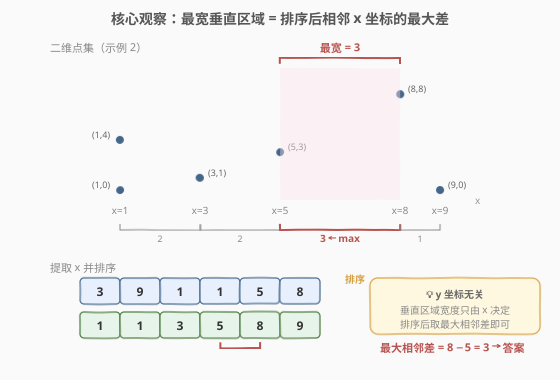
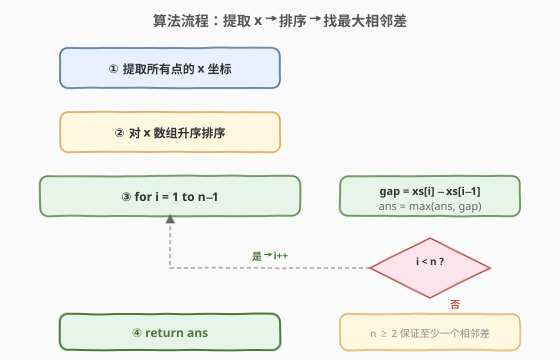

# LeetCode 两点之间不包含任何点的最宽垂直区域 题解

## 1. 题目概述

- **标题 / 题号**：两点之间不包含任何点的最宽垂直区域（#1637，easy）
- **链接**：https://leetcode.cn/problems/widest-vertical-area-between-two-points-containing-no-points/
- **难度**：简单
- **标签**：数组、排序

**题意**：给你 `n` 个二维平面上的点 `points`，其中 `points[i] = [xi, yi]`，请你返回两点之间内部不包含任何点的**最宽垂直区域**的宽度。

**垂直区域**的定义是固定宽度、而 y 轴上无限延伸的一块区域（高度为无穷大）。**最宽垂直区域**为宽度最大的一个垂直区域。请注意，垂直区域**边上**的点**不在**区域内。

**示例 1**：

```text
输入：points = [[8,7],[9,9],[7,4],[9,7]]
输出：1
解释：红色区域和蓝色区域都是最优区域，宽度均为 1。
```

**示例 2**：

```text
输入：points = [[3,1],[9,0],[1,0],[1,4],[5,3],[8,8]]
输出：3
```

**约束**：

- `n == points.length`
- `2 <= n <= 10^5`
- `points[i].length == 2`
- `0 <= xi, yi <= 10^9`

> 💡 「垂直区域」本质上就是**两条相邻竖线之间的水平条带**——竖线由点的 x 坐标确定，条带内部不含任何点。题目问的是这些条带中**最宽**的那一个。y 坐标只决定点的高度，对区域宽度毫无影响，可以完全忽略。

## 2. 解题思路

### 2.1 暴力思路：枚举所有点对

最直白的做法是枚举所有点对 $(i, j)$，以两者的 x 坐标作为区域边界，检查该区间内是否包含其他点的 x 坐标，若不包含则记录 $|x_i - x_j|$，取最大值。

但这样时间复杂度高达 $O(n^3)$（$O(n^2)$ 个点对 × $O(n)$ 检查区间），当 $n = 10^5$ 时完全不可行。根本问题在于——**没有利用"区域宽度由 x 坐标排序后的相邻关系决定"这一结构**。

### 2.2 核心观察：排序后取最大相邻差



关键洞察：一个不包含任何点的垂直区域，其边界必然落在**两个相邻的 x 坐标**上。如果某个区域的左边界是 $x_a$、右边界是 $x_b$，且 $x_a < x_b$，那么"内部不含任何点"意味着 $(x_a, x_b)$ 之间没有其他点的 x 坐标——也就是说 $x_a$ 和 $x_b$ 是所有 x 坐标排序后的**相邻元素**。

因此只需三步：

1. **提取**所有点的 x 坐标。
2. **排序**x 数组。
3. **扫描**相邻差 $x_i - x_{i-1}$，取最大值。

> 💡 **为什么 y 坐标无关？** 垂直区域"y 轴上无限延伸"，宽度只由 x 方向决定。无论点的 y 坐标是多少，只要它的 x 落在区域内部，区域就被"污染"了。因此把问题降维到一维的 x 坐标轴后，就变成经典的"排序后求最大相邻差"。

> ⚠️ **重复 x 坐标**：多个点可能共享同一个 x 坐标（如示例 2 中有两个 $x=1$ 的点）。排序后它们的相邻差为 0，对最大值没有贡献，无需特殊处理——0 永远不会是最大值（$n \geq 2$ 且排序后至少有一个正差，除非所有点 x 相同，此时答案为 0 也是正确的）。

### 2.3 算法流程图



流程要点：

1. **提取 x**：遍历 `points`，收集所有 `points[i][0]`。
2. **排序**：对 x 数组升序排序。
3. **扫描相邻差**：从 $i = 1$ 到 $n-1$，计算 $x_i - x_{i-1}$，维护全局最大值 `ans`。
4. 返回 `ans`。

### 2.4 示例演算

![示例演算：points = [[3,1],[9,0],[1,0],[1,4],[5,3],[8,8]]](../images/1637_example_walkthrough.svg)

以 `points = [[3,1],[9,0],[1,0],[1,4],[5,3],[8,8]]` 为例：

| 步骤 | 操作 | 结果 |
|------|------|------|
| ① 提取 x | 收集所有 `points[i][0]` | `[3, 9, 1, 1, 5, 8]` |
| ② 排序 | 升序排列 | `[1, 1, 3, 5, 8, 9]` |
| ③ 相邻差 | 逐对求差 | `[0, 2, 2, 3, 1]` |
| ④ 取最大 | `max(0, 2, 2, 3, 1)` | `3` |

> 💡 **观察要点**：`i=1` 处两个 $x=1$ 的点相邻差为 0，对结果无影响；`i=4` 处 $8-5=3$ 是最大值，即 $x=5$ 与 $x=8$ 之间的垂直区域最宽，宽度为 3。

## 3. 参考代码

### C++

```cpp
class Solution {
  public:
    int maxWidthOfVerticalArea(vector<vector<int>>& points) {
        int n = points.size();
        vector<int> xs(n);
        for (int i = 0; i < n; ++i) {
            xs[i] = points[i][0];
        }
        sort(xs.begin(), xs.end());
        int ans = 0;
        for (int i = 1; i < n; ++i) {
            ans = max(ans, xs[i] - xs[i - 1]);
        }
        return ans;
    }
};
```

### Python

```python
class Solution:
    def maxWidthOfVerticalArea(self, points: list[list[int]]) -> int:
        xs = sorted(p[0] for p in points)
        return max(b - a for a, b in zip(xs, xs[1:]))
```

> 💡 **写法细节**：
> - C++ 版先提取 x 到独立数组再排序，逻辑清晰；也可用 `std::transform` 或直接对 `points` 按 x 排序，但提取后排序更省空间（无需搬运 `[x, y]` 对）。
> - Python 版用生成器 + `zip(xs, xs[1:])` 一行完成相邻差遍历，`xs[1:]` 产生一个从第二个元素开始的视图，`zip` 自然对齐相邻对，简洁且 $O(n)$。
> - 初始 `ans = 0` 而非 `INT_MIN`：所有点 x 相同时答案本就是 0，用 0 作下界恰好正确。

## 4. 复杂度分析

| 维度 | 复杂度 | 说明 |
|------|--------|------|
| 时间复杂度 | $O(n \log n)$ | 排序主导 $O(n \log n)$，提取 x 与扫描相邻差各 $O(n)$ |
| 空间复杂度 | $O(n)$ | 存储提取的 x 数组；若原地排序 `points`（按 x 比较）可降到 $O(\log n)$（排序栈空间） |

> 💡 本题 $n \leq 10^5$，$O(n \log n)$ 排序轻松 AC。无需追求 $O(n)$ 的桶排序解法（如 [164. 最大间距](https://leetcode.cn/problems/maximum-gap/) 那样要求 $O(n)$ 时间），因为本题没有这个限制。

## 5. 扩展：与「最大间距」的对比

本题与 [164. 最大间距](https://leetcode.cn/problems/maximum-gap/) 几乎同构——都是"排序后求最大相邻差"。区别在于：

| 维度 | 1637（本题） | 164（最大间距） |
|------|--------------|-----------------|
| 输入 | 二维点集 | 一维整数数组 |
| 关注 | x 坐标 | 元素本身 |
| 时间要求 | $O(n \log n)$ 即可 | **要求 $O(n)$** |
| 经典解法 | 排序 + 扫描 | 桶排序（鸽笼原理） |

164 题要求 $O(n)$ 时间，因此不能用比较排序（下界 $O(n \log n)$），需用**基数排序**或**桶排序**配合鸽笼原理：先找到 min/max，分成 $n-1$ 个桶，由鸽笼原理最大间距必跨越空桶，只需记录每桶的 min/max 即可。

本题没有 $O(n)$ 的限制，排序解法是最直接、最清晰的选择。若面试官追问能否 $O(n)$，可主动提及桶排序思路作为延伸。

## 6. 面试要点

1. **为什么"最宽垂直区域"等价于"排序后最大相邻 x 差"？**

   - 一个不含任何点的垂直区域，其左右边界必须恰好落在两个 x 坐标上，且这两个 x 之间没有其他点的 x。这正是"排序后相邻"的定义。反过来说，任意两个相邻 x 之间的条带都不含点（点都在边界上、不在内部），所以每个相邻差都是一个合法区域宽度。两者一一对应，取最大即可。

2. **y 坐标真的完全没用吗？**

   - 是的。垂直区域 y 方向无限延伸，宽度只由 x 方向决定。只要某个点的 x 落在区域内部，无论 y 多高多低都会"污染"区域。因此问题可降维到一维 x 坐标轴，y 坐标自始至终不参与计算。

3. **多个点 x 坐标相同时怎么处理？**

   - 无需特殊处理。排序后相同 x 相邻、差为 0，对最大值没有贡献。极端情况所有点 x 相同时，所有相邻差都为 0，答案为 0——这也是正确的（不存在任何宽度为正的垂直区域）。

4. **能否做到 $O(n)$ 时间？**

   - 可以。用桶排序配合鸽笼原理：找到 x 的 min/max，分成 $n-1$ 个等宽桶，每个桶只记录 min/max。由鸽笼原理，$n$ 个元素放入 $n-1$ 个桶必有空桶，最大相邻差必出现在"某桶 max 与下一非空桶 min"之间。但这增加了实现复杂度，本题 $O(n \log n)$ 已足够，仅作为面试延伸提及。

5. **为什么初始 `ans = 0` 而不是负无穷？**

   - x 坐标非负，相邻差也非负，0 是天然下界。所有点 x 相同时答案为 0，用 0 初始化恰好覆盖该边界，无需引入 `INT_MIN`。

## 同类练习题

| # | 题目 | 与本题的关联 |
|---|------|-------------|
| 164 | [最大间距](https://leetcode.cn/problems/maximum-gap/) | 排序后最大相邻差的经典题，进阶要求 $O(n)$ 桶排序，与本题同构但难度更高 |
| 1502 | [判断能否形成等差数列](https://leetcode.cn/problems/can-make-arithmetic-progression-from-sequence/)（[题解](../1501-1600/1502_判断能否形成等差数列.md)） | 排序后检查相邻差是否恒定，对照本题"取最大相邻差" |
| 56 | [合并区间](https://leetcode.cn/problems/merge-intervals/)（[题解](../0001-0100/56_合并区间.md)） | 排序 + 扫描处理区间，同为"排序化简问题"的范式 |
| 912 | [排序数组](https://leetcode.cn/problems/sort-an-array/) | 手撕排序的母题，巩固排序实现基础 |
| 128 | [最长连续序列](https://leetcode.cn/problems/longest-consecutive-sequence/) | 也可排序后找最长连续段，对照本题找最大间隙 |
