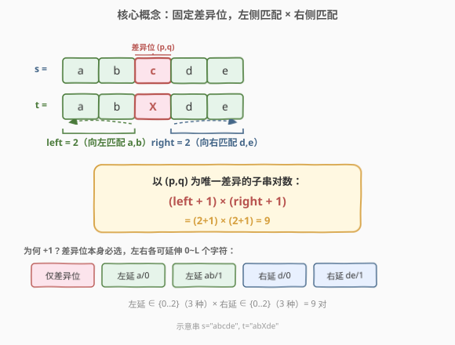
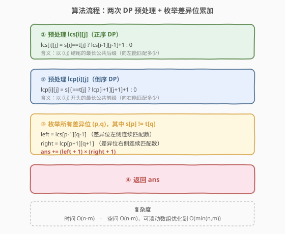
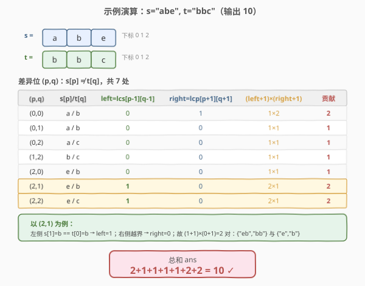

# 统计只差一个字符的子串数目

- **题目名称**：统计只差一个字符的子串数目
- **链接**：[1638. 统计只差一个字符的子串数目](https://leetcode.cn/problems/count-substrings-that-differ-by-one-character/)
- **难度**：中等
- **标签**：动态规划、字符串、枚举

## 1. 题目概述

给定两个字符串 `s` 和 `t`，统计 `s` 中的**非空子串**的数目，使得该子串**替换恰好一个字符**后是 `t` 的子串。换言之，找到 `s` 和 `t` 中**恰好只有一个字符不同**的等长子串对的数目。

> 💡 直觉：把问题转化为"找所有等长的子串对 `(s[i..i+L-1], t[j..j+L-1])`，二者逐位比较恰好有 1 处不同"。不同的子串对按**位置**区分（即使内容相同，起点/长度不同就分别计数）。

**示例 1**：

```text
输入：s = "aba", t = "baba"
输出：6
解释：以下 6 对子串只差 1 个字符（加粗为选出的子串）：
("aba", "baba")、("aba", "baba")、("aba", "baba")
("aba", "baba")、("aba", "baba")、("aba", "baba")
```

**示例 2**：

```text
输入：s = "ab", t = "bb"
输出：3
```

**示例 3**：

```text
输入：s = "a", t = "a"
输出：0
（两串相同，无任何差异位，无法"恰好差 1 个字符"）
```

**示例 4**：

```text
输入：s = "abe", t = "bbc"
输出：10
```

**约束条件**：

- `1 <= s.length, t.length <= 100`
- `s` 和 `t` 只包含小写英文字母

## 2. 解题思路

### 2.1 暴力思路：枚举所有子串对

枚举 `s` 的起点 `i`、`t` 的起点 `j`、子串长度 `L`，逐位比较 `s[i..i+L-1]` 与 `t[j..j+L-1]`，统计恰好有 1 处不同的对数。起点组合 $O(nm)$，长度 $O(\min(n,m))$，逐位比较 $O(\min(n,m))$，总复杂度 $O(nm\cdot \min(n,m)^2)$。对 $n,m\le 100$ 约为 $10^8$ 量级，勉强但不够优雅，且无法推广到更大规模。

> ⚠️ 暴力的浪费在于：相邻长度的比较没有复用——长度 $L$ 的比较结果其实只比长度 $L-1$ 多看了末尾一位。

### 2.2 核心观察：固定差异位，左侧匹配 × 右侧匹配



关键观察：**每一对"恰好差 1 字符"的子串对，都存在唯一的一个差异位置 $(p, q)$**（即 `s[p] != t[q]`，其余对应位都相等）。因此可以**按差异位分类计数**——对每个满足 `s[p] != t[q]` 的位置 $(p, q)$，求出"以它为唯一差异"的子串对数，再求和。

固定差异位 $(p, q)$ 后，子串对形如：

$$
s[i..p..p+r],\quad t[j..q..q+r]
$$

其中差异位左侧 `s[i..p-1] == t[j..q-1]`（连续匹配 `left` 个），右侧 `s[p+1..p+r] == t[q+1..q+r]`（连续匹配 `right` 个）。

- **向左**能延伸的连续匹配数记为 `left = lcs[p-1][q-1]`（以 $(p-1, q-1)$ 结尾的最长公共后缀）。
- **向右**能延伸的连续匹配数记为 `right = lcp[p+1][q+1]`（以 $(p+1, q+1)$ 开头的最长公共前缀）。

由于左侧可延伸 $a\in[0, \text{left}]$ 共 `left+1` 种、右侧可延伸 $b\in[0, \text{right}]$ 共 `right+1` 种，且每种 $(a, b)$ 组合给出一个**唯一的**子串对（起点 $i=p-a$、长度 $a+1+b$），故：

$$
\text{contrib}(p,q) = (\text{left}+1)\times(\text{right}+1)
$$

> 💡 为何 `+1`？差异位本身必选（长度至少为 1），左右延伸的"0 个字符"也是一种合法选择——对应只取差异位单字符的子串对。所以左侧选择数是 `left+1` 而非 `left`。

答案为：

$$
\text{ans} = \sum_{\substack{p,q \\ s[p]\ne t[q]}} \bigl(\text{lcs}[p-1][q-1]+1\bigr)\cdot\bigl(\text{lcp}[p+1][q+1]+1\bigr)
$$

### 2.3 算法流程图



```
countSubstrings(s, t):
  1. n = len(s), m = len(t)
  2. 预处理 lcs[i][j]（正序 DP，1-indexed，lcs[0][*]=0）：
       若 s[i-1]==t[j-1]: lcs[i][j] = lcs[i-1][j-1] + 1
       否则:               lcs[i][j] = 0
  3. 预处理 lcp[i][j]（倒序 DP，1-indexed，lcp[n+1][*]=0）：
       若 s[i-1]==t[j-1]: lcp[i][j] = lcp[i+1][j+1] + 1
       否则:               lcp[i][j] = 0
  4. ans = 0
  5. 对每个 (p, q) ∈ [1,n] × [1,m]：
       若 s[p-1] != t[q-1]:
         ans += (lcs[p-1][q-1] + 1) * (lcp[p+1][q+1] + 1)
  6. 返回 ans
```

### 2.4 示例演算



以示例 4 `s = "abe"`、`t = "bbc"` 为例，共 7 个差异位（`s[p] != t[q]`）：

| (p,q) | s[p]/t[q] | left=lcs[p-1][q-1] | right=lcp[p+1][q+1] | (left+1)×(right+1) | 贡献 |
|-------|-----------|--------------------|---------------------|--------------------|------|
| (0,0) | a / b     | 0                  | 1                   | 1×2                | 2    |
| (0,1) | a / b     | 0                  | 0                   | 1×1                | 1    |
| (0,2) | a / c     | 0                  | 0                   | 1×1                | 1    |
| (1,2) | b / c     | 0                  | 0                   | 1×1                | 1    |
| (2,0) | e / b     | 0                  | 0                   | 1×1                | 1    |
| (2,1) | e / b     | 1                  | 0                   | 2×1                | 2    |
| (2,2) | e / c     | 1                  | 0                   | 2×1                | 2    |

总和 $= 2+1+1+1+1+2+2 = 10$ ✓

以差异位 $(2,1)$ 为例：左侧 `s[1]='b' == t[0]='b'` 故 `left=1`，右侧越界故 `right=0`，贡献 $(1+1)\times(0+1)=2$，对应两对：`("eb","bb")` 与 `("e","b")`。

## 3. 参考代码

### C++

```cpp
class Solution {
public:
    int countSubstrings(string s, string t) {
        int n = s.size(), m = t.size();
        // lcs[i][j]: 以 s[i-1],t[j-1] 结尾的最长公共后缀（向左匹配数）
        // lcp[i][j]: 以 s[i-1],t[j-1] 开头的最长公共前缀（向右匹配数）
        // 1-indexed，第 0 行/列与第 n+1 / m+1 行/列为哨兵 0
        vector<vector<int>> lcs(n + 2, vector<int>(m + 2, 0));
        vector<vector<int>> lcp(n + 2, vector<int>(m + 2, 0));

        for (int i = 1; i <= n; ++i)
            for (int j = 1; j <= m; ++j)
                if (s[i - 1] == t[j - 1])
                    lcs[i][j] = lcs[i - 1][j - 1] + 1;

        for (int i = n; i >= 1; --i)
            for (int j = m; j >= 1; --j)
                if (s[i - 1] == t[j - 1])
                    lcp[i][j] = lcp[i + 1][j + 1] + 1;

        int ans = 0;
        for (int p = 1; p <= n; ++p)
            for (int q = 1; q <= m; ++q)
                if (s[p - 1] != t[q - 1])
                    ans += (lcs[p - 1][q - 1] + 1) * (lcp[p + 1][q + 1] + 1);
        return ans;
    }
};
```

### Python

```python
class Solution:
    def countSubstrings(self, s: str, t: str) -> int:
        n, m = len(s), len(t)
        # 1-indexed DP，外围哨兵为 0
        lcs = [[0] * (m + 2) for _ in range(n + 2)]
        lcp = [[0] * (m + 2) for _ in range(n + 2)]

        for i in range(1, n + 1):
            for j in range(1, m + 1):
                if s[i - 1] == t[j - 1]:
                    lcs[i][j] = lcs[i - 1][j - 1] + 1

        for i in range(n, 0, -1):
            for j in range(m, 0, -1):
                if s[i - 1] == t[j - 1]:
                    lcp[i][j] = lcp[i + 1][j + 1] + 1

        ans = 0
        for p in range(1, n + 1):
            for q in range(1, m + 1):
                if s[p - 1] != t[q - 1]:
                    ans += (lcs[p - 1][q - 1] + 1) * (lcp[p + 1][q + 1] + 1)
        return ans
```

> 💡 1-indexed 配合"第 0 行/列 = 0"与"第 n+1 / m+1 行/列 = 0"两组哨兵，让 `lcs[p-1][q-1]`（$p=1$ 或 $q=1$ 时触底）与 `lcp[p+1][q+1]`（$p=n$ 或 $q=m$ 时越界）都自动取 0，无需特判边界。

## 4. 复杂度分析

| 维度 | 复杂度 | 说明 |
|------|--------|------|
| 时间复杂度 | $O(nm)$ | 三次双重循环（lcs 正序、lcp 倒序、枚举差异位），各 $O(nm)$，总计 $O(nm)$ |
| 空间复杂度 | $O(nm)$ | 两张 $(n+2)\times(m+2)$ 的 DP 表；可滚动数组优化到 $O(\min(n,m))$ |

> 💡 对 $n,m\le 100$，$O(nm)=10^4$ 次操作绰绰有余。空间上若要优化，`lcs` 与 `lcp` 之一可改用滚动数组（注意 `lcp` 是倒序 DP，滚动方向与 `lcs` 不同，需分别处理）。

## 5. 扩展：中心扩展视角与滚动数组优化

本题还有一种**中心扩展**的等价写法：对每个差异位 $(p, q)$，从其左右两侧分别向两端扩展，统计连续匹配的字符数 `left`、`right`，再按 $(\text{left}+1)(\text{right}+1)$ 累加。这与 DP 表达完全等价，但把 $O(nm)$ 的预处理省成了"按需计算"——总复杂度仍为 $O(nm \cdot \text{平均扩展长度})$，最坏 $O(n^2 m)$，对 $n,m\le 100$ 同样可过，但 DP 版本边界更干净、复杂度更紧。

**滚动数组优化**：`lcs[i][j]` 只依赖 `lcs[i-1][j-1]`（左上对角线），`lcp` 同理依赖右下对角线。可用一条长度 $O(\min(n,m))$ 的对角线数组滚动，把空间降到 $O(\min(n,m))$。实现时需注意对角线的更新顺序，避免覆盖未读的状态。

## 6. 面试要点

**Q1：为什么按差异位分类计数不会重复或遗漏？**
> 每一对"恰好差 1 字符"的等长子串对，有且仅有一个差异位置 $(p, q)$（其余位都相等）。把这个差异位作为"分类键"，每对子串恰好归入一个键下，故不重不漏。计数公式 $(\text{left}+1)(\text{right}+1)$ 对每个 $(a, b)\in[0,\text{left}]\times[0,\text{right}]$ 给出唯一的子串对（起点 $i=p-a$、长度 $a+1+b$），也无重复。

**Q2：`left` 和 `right` 分别用什么 DP 表计算？方向为什么不同？**
> `left = lcs[p-1][q-1]` 是"以 $(p-1,q-1)$ 结尾的最长公共后缀"，往**左**看，依赖左上角 `lcs[i-1][j-1]`，故正序 DP。`right = lcp[p+1][q+1]` 是"以 $(p+1,q+1)$ 开头的最长公共前缀"，往**右**看，依赖右下角 `lcp[i+1][j+1]`，故倒序 DP。两者方向相反，对应"前缀"与"后缀"的对称性。

**Q3：1-indexed 的哨兵为什么需要两组（第 0 行/列 和 第 n+1/m+1 行/列）？**
> 差异位可能出现在边界：$p=1$ 时 `lcs[p-1][q-1]=lcs[0][q-1]` 触左哨兵；$p=n$ 时 `lcp[p+1][q+1]=lcp[n+1][q+1]` 触右哨兵。两组哨兵都置 0，让"差异位左侧/右侧没有字符可匹配"自然返回 0，省去所有边界 if 判断。

**Q4：暴力 $O(nm\cdot L^2)$ 与 DP $O(nm)$ 的本质差距在哪？**
> 暴力对每个 $(i,j,L)$ 重新逐位比较，没有复用。DP 把"连续匹配长度"这一信息用 $O(nm)$ 预处理后 $O(1)$ 查询，把枚举差异位（$O(nm)$ 个）与每次 $O(1)$ 计贡献解耦。本质是用空间换"匹配信息的复用"。

**Q5：如果题目改为"至多差 1 个字符"（允许完全相同），算法怎么改？**
> 需额外统计"完全相同"的子串对数，即所有 $s[i..]=t[j..]$ 的等长子串对。这等价于 $\sum_{i,j} \binom{\text{lcp}[i][j]+1}{...}$ 形式——更简洁地：对每个相等的连续段，长度为 $L$ 的公共前缀贡献 $L(L+1)/2$ 对完全相同的子串。把这部分加到原答案上即可。或者直接：原公式对差异位计数已含"恰好 1 个不同"，再加"0 个不同"（即相同子串对）的总数。

## 7. 同类练习题

- [718. 最长重复子数组](https://leetcode.cn/problems/maximum-length-of-repeated-subarray/)（[题解](../0701-0800/718_最长重复子数组.md)）：共用 `lcs/lcp` 对角线 DP 表，求两串最长公共子串；本题把"最长"换成"按差异位分类计数"
- [1143. 最长公共子序列](https://leetcode.cn/problems/longest-common-subsequence/)（[题解](../1101-1200/1143_最长公共子序列.md)）：二维 DP 母题，对比"子串（连续）"与"子序列（可不连续）"的 DP 依赖差异
- [72. 编辑距离](https://leetcode.cn/problems/edit-distance/)（[题解](../0001-0100/72_编辑距离.md)）：同样是"逐位差异 + 二维 DP"，但允许插入/删除/替换三种操作，对比本题"恰好 1 处替换"的简化场景
- [1616. 分割两个字符串得到回文串](https://leetcode.cn/problems/split-two-strings-to-make-palindrome/)（[题解](../1601-1700/1616_分割两个字符串得到回文串.md)）：双串逐位比较 + 贪心匹配到失配点，同属"双串字符比对"家族
