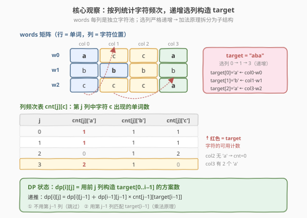
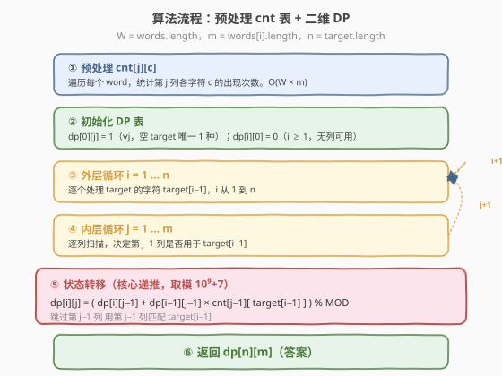

# LeetCode 通过给定词典构造目标字符串的方案数 题解

## 1. 题目概述

- **标题 / 题号**：通过给定词典构造目标字符串的方案数（#1639，hard）
- **链接**：https://leetcode.cn/problems/number-of-ways-to-form-a-target-string-given-a-dictionary/
- **难度**：困难
- **标签**：动态规划、字符串、计数

**题意**：给定一个字符串列表 `words`（所有字符串**长度相同**）和一个目标字符串 `target`。按以下规则从 `words` 中构造 `target`：

- 从左到右依次构造 `target` 的每一个字符。
- 为了得到 `target` 第 $i$ 个字符（下标从 0 开始），当 `target[i] == words[j][k]` 时，可以使用 `words` 中第 $j$ 个字符串的第 $k$ 个字符。
- **关键约束**：一旦使用了第 $k$ 列字符，所有单词中下标 $\le k$ 的字符都不能再被使用——即**所选列的下标必须严格递增**。
- 可以使用同一字符串的多个字符（不同列）。

返回构造 `target` 的方案数，对 $10^9 + 7$ 取余。

> 💡 直觉：把 `words` 看成一个 $W \times m$ 的字符矩阵（$W$ = 单词数，$m$ = 单词长度）。每列是一个"字符池"。构造 `target` 等价于**选一组严格递增的列** $c_0 < c_1 < \cdots < c_{n-1}$，从第 $c_i$ 列中任取一个等于 `target[i]` 的字符。方案数 = 所有合法选列序列的计数（每个列组合内部按"哪一行匹配"独立计数后相乘）。

**示例 1**：

```text
输入：words = ["acca","bbbb","caca"], target = "aba"
输出：6
解释：共 6 种方法，来自 3 组递增列序列，每组因 col3 有 2 个 'a' 而贡献 2：
  (col0, col1, col3) → 1 × 1 × 2 = 2
  (col0, col2, col3) → 1 × 1 × 2 = 2
  (col1, col2, col3) → 1 × 1 × 2 = 2
  （col0, col1, col2 因 cnt[col2]['a']=0 贡献 0）
```

**示例 2**：

```text
输入：words = ["abba","baab"], target = "bab"
输出：4
```

**示例 3**：

```text
输入：words = ["abcd"], target = "abcd"
输出：1
（仅 1 个单词，每列恰好匹配对应 target 字符，唯一方案）
```

**示例 4**：

```text
输入：words = ["abab","baba","abba","baab"], target = "abba"
输出：16
（每列 a/b 各 2 个，4 个 target 字符各选 1 列，4 列全用 → 2×2×2×2 = 16）
```

**约束**：

- $1 \le \text{words.length} \le 1000$
- $1 \le \text{words[i].length} \le 1000$
- `words` 中所有单词长度相同
- $1 \le \text{target.length} \le 1000$
- `words[i]` 和 `target` 都仅包含小写英文字母

## 2. 解题思路

### 2.1 暴力思路：枚举所有递增列序列

最直白的做法：枚举从 $m$ 列中选 $n$ 列的所有严格递增序列 $\binom{m}{n}$ 种，对每组 $(c_0, \ldots, c_{n-1})$ 计算 $\prod_{i=0}^{n-1} \text{cnt}[c_i][\text{target}[i]]$ 并求和。

> ⚠️ $\binom{m}{n}$ 在 $m = n = 1000$ 时是天文数字，完全不可行。暴力的浪费在于：没有利用"选列递增"的子结构——前 $i$ 个字符的选列方案数，可以被后续列"复用"。

### 2.2 核心观察：按列扫描 + 加法原理拆分



关键洞察有两步：

**第一步——列频次表**：对每一列 $j$，预处理 $\text{cnt}[j][c]$ = 第 $j$ 列中字符 $c$ 出现的单词数。这样"从第 $j$ 列取字符 $c$"的方案数就是 $\text{cnt}[j][c]$，把"具体哪个单词"压缩成了一个整数。

**第二步——加法原理 + DP**：设

$$
\text{dp}[i][j] = \text{用前 } j \text{ 列（列 } 0, \ldots, j-1 \text{）构造 } \text{target}[0..i-1] \text{ 的方案数}
$$

对第 $j-1$ 列有两种选择：

- **不用**第 $j-1$ 列：方案数 = $\text{dp}[i][j-1]$（前 $j-1$ 列已够用）。
- **用**第 $j-1$ 列匹配 $\text{target}[i-1]$：前 $i-1$ 个字符用前 $j-1$ 列构造（$\text{dp}[i-1][j-1]$ 种），第 $i$ 个字符从第 $j-1$ 列取（$\text{cnt}[j-1][\text{target}[i-1]]$ 种），由乘法原理得 $\text{dp}[i-1][j-1] \times \text{cnt}[j-1][\text{target}[i-1]]$。

二者不重不漏（第 $j-1$ 列要么用要么不用），故：

$$
\text{dp}[i][j] = \text{dp}[i][j-1] + \text{dp}[i-1][j-1] \times \text{cnt}[j-1][\text{target}[i-1]]
$$

**边界**：$\text{dp}[0][j] = 1$（空 `target` 唯一 1 种方案，无论几列）；$\text{dp}[i][0] = 0$（$i \ge 1$，无列可用则无法构造非空 `target`）。

**答案**：$\text{dp}[n][m]$。

> 💡 **为什么这样定义状态是对的？** "选列严格递增"等价于"每个 target 字符分配的列号只增不减"。把"前 $i$ 个字符用前 $j$ 列"作为子问题，第 $j-1$ 列的"用/不用"是**最后一个决策点**——这正是加法原理拆分计数 DP 的标准套路（与 [115. 不同的子序列](https://leetcode.cn/problems/distinct-subsequences/) 同构：s 的每个字符"用/不用"来匹配 t）。

### 2.3 算法流程图



```
numWays(words, target):
  W = len(words), m = len(words[0]), n = len(target)
  1. 预处理 cnt[j][c]（j ∈ [0,m), c ∈ 'a'..'z'）：
       遍历每个 word w，对每列 j：cnt[j][w[j]] += 1
  2. 初始化 dp[0..n][0..m]，dp[0][j] = 1 (∀j)，dp[i][0] = 0 (i ≥ 1)
  3. 外层 i = 1..n，内层 j = 1..m：
       dp[i][j] = (dp[i][j-1] + dp[i-1][j-1] × cnt[j-1][target[i-1]]) % MOD
  4. 返回 dp[n][m]
```

### 2.4 示例演算

![示例演算：words=["acca","bbbb","caca"], target="aba"（输出 6）](../images/1639_example_walkthrough.svg)

以示例 1 `words = ["acca","bbbb","caca"]`、`target = "aba"` 为例。$m = 4, n = 3, W = 3$。

**列频次表**（`target` 字符高亮）：

| $j$ | $\text{cnt}[j]['a']$ | $\text{cnt}[j]['b']$ | $\text{cnt}[j]['c']$ |
|-----|----------------------|----------------------|----------------------|
| 0   | **1**                | **1**                | 1                    |
| 1   | **1**                | **1**                | 1                    |
| 2   | **0**                | **1**                | 2                    |
| 3   | **2**                | **1**                | 0                    |

**DP 表**（$\text{dp}[i][j]$，行 = `target` 前 $i$ 字符，列 = 前 $j$ 列）：

| $i \backslash j$ | 0 | 1 | 2 | 3 | 4 |
|------------------|---|---|---|---|---|
| 0 (空)           | 1 | 1 | 1 | 1 | 1 |
| 1 (a)            | 0 | 1 | 2 | 2 | 4 |
| 2 (b)            | 0 | 0 | 1 | 3 | 5 |
| 3 (a)            | 0 | 0 | 0 | 0 | **6** |

以 $\text{dp}[3][4]$ 为例拆解：

$$
\text{dp}[3][4] = \underbrace{\text{dp}[3][3]}_{=0} + \underbrace{\text{dp}[2][3]}_{=3} \times \underbrace{\text{cnt}[3]['a']}_{=2} = 0 + 3 \times 2 = 6 \checkmark
$$

即：跳过 `col3` 无法凑出 3 个 'a'（`dp[3][3]=0`）；用 `col3` 匹配 `target[2]='a'` 时，前 2 个字符 `"ab"` 用前 3 列有 3 种方案，再乘 `col3` 中 2 个 'a' 的选择 = 6。

**对照暴力枚举验证**：4 个递增三元组 $(c_0, c_1, c_2)$：

| 列序列 | 贡献 | 说明 |
|--------|------|------|
| (0,1,2) | $1\times1\times0 = 0$ | `col2` 无 'a' |
| (0,1,3) | $1\times1\times2 = 2$ | `col3` 有 2 个 'a' |
| (0,2,3) | $1\times1\times2 = 2$ | 同上 |
| (1,2,3) | $1\times1\times2 = 2$ | 同上 |

总和 $= 0+2+2+2 = 6$ ✓

## 3. 参考代码

### C++

```cpp
class Solution {
public:
    int numWays(vector<string>& words, string target) {
        const int MOD = 1e9 + 7;
        int m = words[0].size();      // 列数
        int n = target.size();        // target 长度
        int W = words.size();         // 单词数

        // 预处理 cnt[j][c]：第 j 列中字符 c 的出现次数
        vector<vector<int>> cnt(m, vector<int>(26, 0));
        for (const string& w : words)
            for (int j = 0; j < m; ++j)
                ++cnt[j][w[j] - 'a'];

        // dp[i][j] = 用前 j 列构造 target[0..i-1] 的方案数
        // 1-indexed：dp[0][*] = 1（空 target），dp[i][0] = 0（i >= 1，已由初始化保证）
        vector<vector<long long>> dp(n + 1, vector<long long>(m + 1, 0));
        for (int j = 0; j <= m; ++j) dp[0][j] = 1;

        for (int i = 1; i <= n; ++i)
            for (int j = 1; j <= m; ++j)
                dp[i][j] = (dp[i][j - 1]
                          + dp[i - 1][j - 1] * cnt[j - 1][target[i - 1] - 'a']) % MOD;

        return dp[n][m];
    }
};
```

### Python

```python
class Solution:
    def numWays(self, words: List[str], target: str) -> int:
        MOD = 10**9 + 7
        m = len(words[0])             # 列数
        n = len(target)               # target 长度

        # 预处理 cnt[j][c]：第 j 列中字符 c 的出现次数
        cnt = [[0] * 26 for _ in range(m)]
        for w in words:
            for j in range(m):
                cnt[j][ord(w[j]) - 97] += 1

        # dp[i][j] = 用前 j 列构造 target[0..i-1] 的方案数
        dp = [[0] * (m + 1) for _ in range(n + 1)]
        for j in range(m + 1):
            dp[0][j] = 1              # 空 target 唯一 1 种

        for i in range(1, n + 1):
            for j in range(1, m + 1):
                dp[i][j] = (dp[i][j - 1]
                          + dp[i - 1][j - 1] * cnt[j - 1][ord(target[i - 1]) - 97]) % MOD

        return dp[n][m]
```

> 💡 **写法细节**：
> - **1-indexed DP 表**：`dp[i][j]` 对应"前 $i$ 个 target 字符 × 前 $j$ 列"，第 0 行/列作为边界。`cnt` 保持 0-indexed（`cnt[j-1]` 对应第 $j-1$ 列即 1-indexed 的第 $j$ 列），二者错位一行/列但对应关系清晰。
> - **`long long` 防溢出**（C++）：`dp[i-1][j-1] * cnt[...][...]` 最大 $10^9 \times 10^3 = 10^{12}$，超出 `int` 范围，故 `dp` 用 `long long`；取模后写回，保证下次参与乘法时 $\le 10^9$。
> - **取模位置**：每次转移后立即取模，避免累加导致溢出。Python 无溢出问题但仍取模以保持数值一致。

## 4. 复杂度分析

| 维度 | 复杂度 | 说明 |
|------|--------|------|
| 时间复杂度 | $O(W \cdot m + n \cdot m)$ | 预处理 `cnt` 遍历所有单词字符 $W \times m$；DP 双重循环 $n \times m$ |
| 空间复杂度 | $O(26m + nm)$ | `cnt` 表 $26m$；`dp` 表 $(n+1)(m+1)$；可滚动数组优化到 $O(m)$ |

> 💡 对 $W, m, n \le 1000$，总计 $\sim 2 \times 10^6$ 次操作，绰绰有余。瓶颈在 DP 的 $n \times m$ 双重循环，每个状态 $O(1)$ 转移（乘法 + 加法 + 取模）。

## 5. 扩展：一维滚动数组优化空间至 $O(m)$

`dp[i][j]` 只依赖同一行左侧 `dp[i][j-1]`（新值）和上一行左上 `dp[i-1][j-1]`（旧值），可把二维压缩为一维。关键是用 `pre` 变量保存"被覆盖前的旧 `dp[j-1]`"：

```cpp
class Solution {
public:
    int numWays(vector<string>& words, string target) {
        const int MOD = 1e9 + 7;
        int m = words[0].size(), n = target.size();

        vector<vector<int>> cnt(m, vector<int>(26, 0));
        for (const string& w : words)
            for (int j = 0; j < m; ++j)
                ++cnt[j][w[j] - 'a'];

        // f[j] 当前代表 dp[i-1][j]，初始为 dp[0][j] = 1
        vector<long long> f(m + 1, 1);
        for (int i = 1; i <= n; ++i) {
            long long pre = f[0];   // dp[i-1][0]
            f[0] = 0;               // dp[i][0] = 0 (i >= 1)
            for (int j = 1; j <= m; ++j) {
                long long temp = f[j];                       // 保存 dp[i-1][j]
                f[j] = (f[j - 1] + pre * cnt[j - 1][target[i - 1] - 'a']) % MOD;
                pre = temp;                                  // 下一轮 pre = dp[i-1][j]
            }
        }
        return f[m];
    }
};
```

> 💡 **`pre` 的作用**：内层 `j` 从左到右扫描时，`f[j-1]` 已被覆盖成本行新值 `dp[i][j-1]`（递推式第一项需要它），而 `dp[i-1][j-1]`（第二项需要）已被覆盖丢失。`pre` 在更新 `f[j]` 前保存了 `f[j]` 的旧值 `dp[i-1][j]`，供下一轮 `j+1` 作为 `dp[i-1][j]` 使用——即 `pre` 始终滞后一格，保持"上一行左列"的旧值。这与 [1143. 最长公共子序列](https://leetcode.cn/problems/longest-common-subsequence/) 滚动数组优化中保存左上角的技巧完全一致。

## 6. 面试要点

**Q1：为什么选列必须严格递增？DP 如何利用这一点？**
> 题目规定"用了第 $k$ 列后，所有 $\le k$ 的列都不可再用"，等价于选列下标严格递增 $c_0 < c_1 < \cdots < c_{n-1}$。DP 用"前 $j$ 列"作为阶段，第 $j-1$ 列的"用/不用"是当前决策——若用，则后续字符只能从第 $j$ 列之后选取，递增性自然保证。无需显式记录"上次选了哪列"，因为"前 $j$ 列"隐含了上界。

**Q2：`dp[i][j]` 的两个加项分别代表什么？为什么不重不漏？**
> 第一项 `dp[i][j-1]` = 不用第 $j-1$ 列，前 $i$ 个字符全靠前 $j-1$ 列构造；第二项 `dp[i-1][j-1] × cnt[j-1][target[i-1]]` = 用第 $j-1$ 列匹配第 $i$ 个字符，前 $i-1$ 个字符用前 $j-1$ 列构造。第 $j-1$ 列要么用要么不用，两情况互斥且覆盖全集，故不重不漏。

**Q3：为什么要预处理 `cnt` 表，不能直接枚举单词吗？**
> 若不预处理，每次转移需遍历 $W$ 个单词检查 `word[j][k] == target[i]`，DP 变为 $O(n \cdot m \cdot W)$ 即 $10^9$，超时。预处理 `cnt[j][c]` 把"第 $j$ 列有多少个字符 $c$"压缩成 $O(1)$ 可查的整数，DP 降为 $O(n \cdot m)$。本质是用 $O(Wm)$ 的空间换时间，把"逐单词比较"变成"按列统计频次"。

**Q4：滚动数组中 `pre` 变量为什么必须"先存再更新"？**
> 转移式 `f[j] = f[j-1] + pre × cnt[...]` 中，`f[j-1]` 是本行新值（已被覆盖），`pre` 需持有上一行 `f[j-1]` 的旧值。若先更新 `f[j]` 再存 `pre = f[j]`，存的是新值而非旧值，递推被破坏。正确顺序是：`temp = f[j]`（存旧值）→ 更新 `f[j]` → `pre = temp`（旧值传给下一轮）。

**Q5：如果 `target` 为空或长度大于列数 $m$，结果是什么？**
> `target` 为空（$n=0$）：`dp[0][m] = 1`，唯一方案（什么都不选）。若 $n > m$：`target` 比列数还长，无法选出 $n$ 个递增列，`dp[n][m] = 0`。DP 表自然处理这两种情况——前者由初始化 `dp[0][j]=1` 保证，后者因 `dp[i][0]=0` 逐行传播最终为 0。

## 同类练习题

| # | 题目 | 与本题的关联 |
|---|------|-------------|
| 115 | [不同的子序列](https://leetcode.cn/problems/distinct-subsequences/)（[题解](../0101-0200/115_不同的子序列.md)） | 本题的"原型题"——用 `s` 的子序列构造 `t` 的方案数，同样是"每个字符用/不用"的加法原理 DP，`dp[i][j] = dp[i-1][j] + dp[i-1][j-1]×match` |
| 940 | [不同的子序列 II](https://leetcode.cn/problems/distinct-subsequences-ii/)（[题解](../0901-1000/940_不同的子序列II.md)） | 计数型子序列 DP，"以某字符结尾"的状态定义 + 去重，对比本题"以某列结尾"的计数 |
| 72 | [编辑距离](https://leetcode.cn/problems/edit-distance/)（[题解](../0001-0100/72_编辑距离.md)） | 二维字符串 DP 母题，`dp[i][j]` 依赖左/上/左上三方向，对比本题依赖左 + 左上两方向 |
| 1143 | [最长公共子序列](https://leetcode.cn/problems/longest-common-subsequence/)（[题解](../1101-1200/1143_最长公共子序列.md)） | 二维字符串 DP，滚动数组优化时同样需保存"左上角旧值"，与本题第 5 节技巧一致 |
