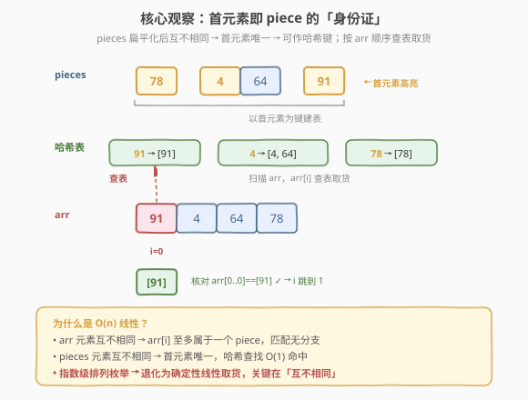
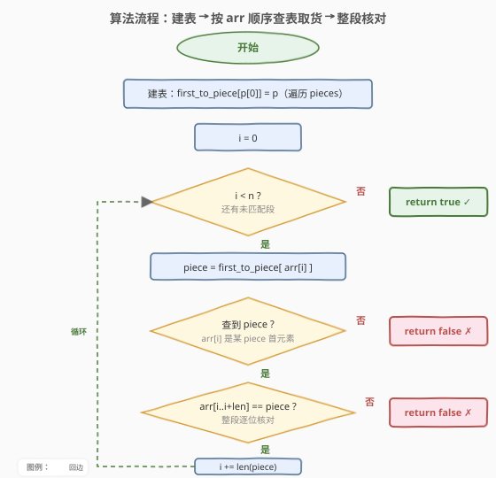
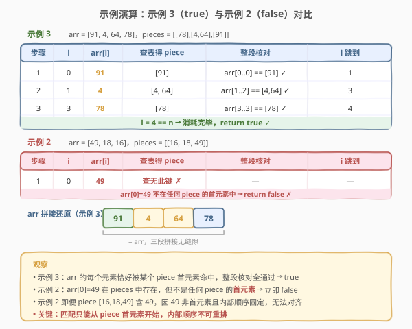

# LeetCode 能否连接形成数组 题解

## 1. 题目概述

- **标题 / 题号**：能否连接形成数组（#1640，easy）
- **链接**：https://leetcode.cn/problems/check-array-formation-through-concatenation/
- **难度**：简单
- **标签**：数组、哈希表

**题意**：给定一个整数数组 `arr`，数组中的每个整数**互不相同**。另有一个由整数数组构成的数组 `pieces`，其中的整数也**互不相同**（即把 `pieces` 扁平化成一维数组后所有整数互不相同）。要求以**任意顺序**连接 `pieces` 中的数组以形成 `arr`，但**不允许**对每个 `pieces[i]` 内部的整数重新排序。

若可以连接形成 `arr` 返回 `true`，否则返回 `false`。

**示例 1**：

```text
输入：arr = [15,88], pieces = [[88],[15]]
输出：true
解释：依次连接 [15] 和 [88] 得到 [15,88]
```

**示例 2**：

```text
输入：arr = [49,18,16], pieces = [[16,18,49]]
输出：false
解释：即便数字相符，也不能重新排列 pieces[0]
```

**示例 3**：

```text
输入：arr = [91,4,64,78], pieces = [[78],[4,64],[91]]
输出：true
解释：依次连接 [91]、[4,64] 和 [78] 得到 [91,4,64,78]
```

**约束**：

- `1 <= pieces.length <= arr.length <= 100`
- `sum(pieces[i].length) == arr.length`
- `1 <= pieces[i].length <= arr.length`
- `1 <= arr[i], pieces[i][j] <= 100`
- `arr` 中的整数**互不相同**
- `pieces` 中的整数**互不相同**（扁平化后所有整数互不相同）

> 💡 题目的关键约束是「所有整数互不相同」。这意味着每个 `piece` 的**首元素**在整个 `pieces` 集合中唯一，可作为该 `piece` 的「身份证」——这正是哈希查找的切入点。

## 2. 解题思路

### 2.1 暴力思路：枚举 pieces 的全排列

`pieces` 有 $k$ 个子数组，连接顺序有 $k!$ 种。暴力枚举所有排列，对每种排列把子数组依次拼接，判断结果是否等于 `arr`。最坏 $O(k! \cdot n)$，当 $k = 8$ 时 $8! = 40320$ 已经很高，且每次拼接还要 $O(n)$ 比较。

根本问题在于**没有利用「整数互不相同」这一约束**——既然 `arr` 的每个元素都唯一对应某个 `piece`，我们完全可以**按 `arr` 的顺序去 pieces 里「取货」**，而非盲目枚举所有拼接顺序。

### 2.2 核心观察：首元素建哈希 + 顺序匹配



关键直觉来自两条约束的合击：

1. **`arr` 元素互不相同** → `arr` 的下一个待匹配元素 `arr[i]` 至多属于一个 `piece`。
2. **`pieces` 元素互不相同** → 每个 `piece` 的**首元素**在整个 `pieces` 集合中唯一，可作哈希键。

因此算法只需两步：

1. **建表**：遍历 `pieces`，建立哈希映射 $\text{first} \to \text{piece}$，其中 `first` 是该 `piece` 的首元素。
2. **取货**：用指针 `i` 扫描 `arr`。对每个位置 `i`，查表找首元素等于 `arr[i]` 的 `piece`：
   - 查不到 → 返回 `false`（`arr[i]` 不属于任何 `piece`）。
   - 查到了 → 逐位比较 `arr[i..i+\text{len}]` 是否等于该 `piece`，不等则返回 `false`。
   - 相等 → `i += \text{len}`，跳过整个 `piece`，继续匹配下一段。

> 💡 **为什么不用回溯/记忆化？** 因为「整数互不相同」把问题从「多对多匹配」退化成了「一对一确定性匹配」：`arr` 的每个位置唯一决定要取哪个 `piece`，没有任何选择分支，无需搜索、无需回溯，一次线性扫描即可。

> ⚠️ **不能只比首元素**：查到 `piece` 后必须**逐位比较整个 `piece`**。例如 `arr = [49,18,16]`、`pieces = [[16,18,49]]`，首元素 `16` 在 `arr` 的位置 2，但 `piece` 是 `[16,18,49]`，与 `arr[2..] = [16]` 长度不符，且即使对齐 `arr` 从 16 开始也无法匹配 `[16,18,49]` 的内部顺序。必须整段核对。

### 2.3 算法流程图



外层用指针 `i` 扫描 `arr`，每轮查表定位 `piece` 后做整段比较，`i` 按整段长度跳跃式前进；任何一步失败立即返回 `false`，全部消耗完 `arr` 则返回 `true`。

### 2.4 示例演算



以示例 3 为例，`arr = [91,4,64,78]`，`pieces = [[78],[4,64],[91]]`：

| 步骤 | 指针 `i` | `arr[i]` | 查表得 `piece` | 整段核对 | `i` 跳到 |
|------|----------|----------|----------------|----------|----------|
| 1 | 0 | 91 | `[91]` | `arr[0..0] == [91]` ✓ | 1 |
| 2 | 1 | 4 | `[4,64]` | `arr[1..2] == [4,64]` ✓ | 3 |
| 3 | 3 | 78 | `[78]` | `arr[3..3] == [78]` ✓ | 4 |

`i = 4 == len(arr)`，消耗完毕，返回 `true`。

对比示例 2：`arr = [49,18,16]`，`pieces = [[16,18,49]]`。`i = 0` 时 `arr[0] = 49`，查表发现首元素为 `49` 的 `piece` **不存在**（唯一的 `piece` 首元素是 `16`），立即返回 `false`。

## 3. 参考代码

### C++

```cpp
class Solution {
public:
    bool canFormArray(vector<int>& arr, vector<vector<int>>& pieces) {
        unordered_map<int, vector<int>*> firstToPiece;
        for (auto& p : pieces) {
            firstToPiece[p[0]] = &p;
        }
        int i = 0, n = arr.size();
        while (i < n) {
            auto it = firstToPiece.find(arr[i]);
            if (it == firstToPiece.end()) return false;
            vector<int>& p = *it->second;
            for (int j = 0; j < (int)p.size(); ++j) {
                if (arr[i + j] != p[j]) return false;
            }
            i += p.size();
        }
        return true;
    }
};
```

### Python

```python
class Solution:
    def canFormArray(self, arr: list[int], pieces: list[list[int]]) -> bool:
        first_to_piece = {p[0]: p for p in pieces}
        i, n = 0, len(arr)
        while i < n:
            p = first_to_piece.get(arr[i])
            if p is None:
                return False
            if arr[i:i + len(p)] != p:
                return False
            i += len(p)
        return True
```

> 💡 Python 用切片比较 `arr[i:i+len(p)] != p` 一行完成整段核对；C++ 用指针 `vector<int>*` 避免拷贝整个 `piece`，仅存地址。两者都是 $O(\text{len})$ 比较但常数极小。

## 4. 复杂度分析

| 维度 | 复杂度 | 说明 |
|------|--------|------|
| 时间复杂度 | $O(n)$ | 建表 $O(\sum \text{len}) = O(n)$；扫描 `arr` 时每个元素恰好被整段核对一次，总比较次数 $\leq n$ |
| 空间复杂度 | $O(n)$ | 哈希表存 $k$ 个键值对（指向 `pieces` 子数组），共 $O(n)$ 元素引用 |

> 💡 关键在于 `arr` 的每个元素至多被访问一次：`i` 按 `piece` 长度跳跃前进，已匹配的段不会回退重扫。故总时间严格 $O(n)$，与 `pieces` 的数量 $k$ 无关。

## 5. 扩展：若元素可重复怎么办？

本题的 $O(n)$ 解法完全依赖「整数互不相同」。若放宽为允许重复，问题变为：能否将 `pieces` 的一个排列拼接成 `arr`（`piece` 内部顺序不变）。此时 `arr[i]` 可能匹配多个首元素相同的 `piece`，需要回溯搜索，最坏退化为 $O(k! \cdot n)$。

可用记忆化优化：状态为「已使用的 `piece` 集合」（位掩码，$k \leq 20$ 时可行），`dp[mask]` 表示在已用 `mask` 这些 `piece` 后能否继续匹配剩余 `arr`。但这是 NP-hard 子集拼接问题的变体，规模一大即不可行。本题的「互不相同」约束正是把指数级问题降为线性的关键。

## 6. 面试要点

1. **为什么首元素能作为哈希键？**

   - 题目保证 `pieces` 扁平化后所有整数互不相同，因此每个 `piece` 的首元素在整个 `pieces` 集合中唯一，不会有两个 `piece` 共享同一首元素。首元素即该 `piece` 的唯一标识。

2. **为什么不需要回溯或记忆化搜索？**

   - `arr` 元素也互不相同，`arr` 的每个待匹配位置 `i` 至多对应一个 `piece`（首元素等于 `arr[i]` 的那个）。匹配是确定性的、无分支的，一次线性扫描即可，无需搜索。

3. **只比首元素够吗？为什么要整段核对？**

   - 不够。`piece` 内部顺序固定但可能与 `arr` 对应区段不一致。例如 `arr = [1,2,3]`、`pieces = [[1,3,2]]`，首元素 `1` 匹配，但 `[1,3,2]` 与 `arr[0..2] = [1,2,3]` 在第 2 位不同，必须整段比较才能发现。

4. **`i` 为什么能跳跃前进而不是逐位 +1？**

   - 一旦某个 `piece` 整段匹配成功，`arr` 的下一段必然由下一个 `piece` 提供（`sum(pieces[i].length) == arr.length` 保证无空隙也无重叠）。所以 `i` 直接加上 `piece` 长度跳到下一段起点，已匹配段无需重扫。

5. **若 `pieces` 的总长度不等于 `arr` 长度怎么办？**

   - 题目约束 `sum(pieces[i].length) == arr.length`，保证元素总数一致。若去掉该约束，可在算法末尾加判断 `i == n`（本题循环退出条件已隐含此检查：`i` 必须恰好走到 `n` 才返回 `true`）。

## 同类练习题

| # | 题目 | 与本题的关联 |
|---|------|-------------|
| 1 | [两数之和](https://leetcode.cn/problems/two-sum/) | 哈希表基础母题，用「值→下标」映射把 $O(n^2)$ 暴力降为 $O(n)$，本题同样借哈希把排列枚举降为线性 |
| 350 | [两个数组的交集 II](https://leetcode.cn/problems/intersection-of-two-arrays-ii/) | 哈希计数 + 顺序匹配，对照「元素可重复」时哈希需退化用计数器 |
| 349 | [两个数组的交集](https://leetcode.cn/problems/intersection-of-two-arrays/) | 哈希集合判定存在性，对照「互不相同」约束下集合运算的简洁性 |
| 1528 | [重新排列字符串](https://leetcode.cn/problems/shuffle-string/) | 按映射还原数组顺序，同样是「按目标位置/顺序取货」的线性匹配思想 |
