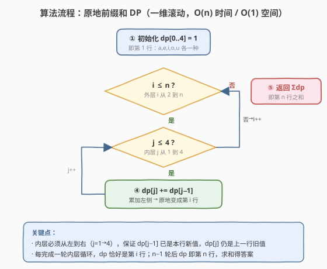
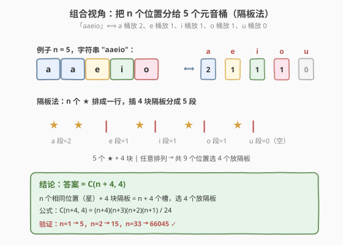

# 统计字典序元音字符串的数目

- **题目名称**：统计字典序元音字符串的数目
- **链接**：[1641. 统计字典序元音字符串的数目](https://leetcode.cn/problems/count-sorted-vowel-strings/)
- **难度**：中等
- **标签**：动态规划、组合数学、回溯

## 1. 题目概述

给定一个整数 `n`，返回长度为 `n`、仅由元音 `(a, e, i, o, u)` 组成且**按字典序排列**的字符串数量。

「字典序排列」要求：对所有有效的 `i`，`s[i]` 在字母表中的位置不晚于 `s[i+1]`，即字符串**非递减**。

**示例 1**：

```text
输入：n = 1
输出：5
解释：5 个字符串为 ["a","e","i","o","u"]
```

**示例 2**：

```text
输入：n = 2
输出：15
解释：15 个字符串为
["aa","ae","ai","ao","au","ee","ei","eo","eu","ii","io","iu","oo","ou","uu"]
注意 "ea" 不合法，因为 'e' 在 'a' 之后
```

**示例 3**：

```text
输入：n = 33
输出：66045
```

**约束条件**：

- `1 <= n <= 50`

> 💡 题目本质是**计数型 DP**：在「字符非递减」的约束下数长度为 `n` 的元音串个数。由于元音天然有序 `a < e < i < o < u`，「非递减」等价于「每个位置选一个元音，且后一个不小于前一个」——这正是**可重复组合** $C(n+4,4)$ 的组合意义，也是 DP 递推的根源。

---

## 2. 解题思路

### 2.1 暴力思路：DFS 回溯枚举

最直白的做法是按位置从左到右逐字符构造：第 1 位可任选 5 个元音，之后每位只能选「不小于前一位」的元音。用 DFS 枚举所有合法串并计数。

```text
dfs(pos, lastVowel):
    if pos == n:  return 1           # 构造完整，计 1 个
    total = 0
    for v in lastVowel..4:           # 只能选 >= lastVowel 的元音
        total += dfs(pos+1, v)
    return total
```

这样写完全正确，但时间正比于**合法串总数** $C(n+4,4)$。`n=50` 时约 $3.2\times10^5$ 次，虽能 AC，却把每个串都显式走了一遍——而我们只需要**个数**，不需要构造。计数问题应当用 DP / 组合公式，避免枚举。

### 2.2 核心观察：按「末字符」分阶段 DP

![核心观察：dp[i][j] 的递推](../images/csvowel_dp_concept.svg)

关键洞察：把「整串非递减」拆成**只看末字符**的子结构。设：

$$
dp[i][j] = \text{长度为 } i \text{、末字符恰为第 } j \text{ 个元音的合法串数} \quad (j = 0,1,2,3,4)
$$

其中 $j=0,1,2,3,4$ 分别对应 `a, e, i, o, u`。**转移**：若末字符是第 $j$ 个元音，则前 $i-1$ 位构成一个合法串、且其末字符 $k$ 必须 $\le j$（否则违背非递减）。于是：

$$
dp[i][j] = \sum_{k=0}^{j} dp[i-1][k], \qquad dp[1][j] = 1
$$

**答案** $= \sum_{j=0}^{4} dp[n][j]$，即第 $n$ 行所有列之和。

> 💡 **为什么这样定义状态是对的？** 「末字符为 $j$」把整串的有序性**局部化**到「最后两位」：只要前 $i-1$ 位合法且其末字符 $\le j$，拼接第 $j$ 个元音后整串仍非递减。这是「以末字符为阶段」的经典计数 DP 套路（参见 [62. 不同路径](https://leetcode.cn/problems/unique-paths/) 的网格计数）。

> ⚠️ **前缀和优化**：转移式是「上一行 $[0..j]$ 之和」，恰好是上一行的前缀和。记 $S_i[j] = \sum_{k=0}^{j} dp[i][k]$，则 $dp[i][j] = S_{i-1}[j]$，而 $S_i[j] = S_i[j-1] + dp[i][j]$。于是**原地左到右累加**即可把上一行滚成本行，无需显式求和：

$$
dp[i][j] = dp[i-1][j] + dp[i][j-1] \quad (\text{一维滚动，} j \text{ 从 } 1 \text{ 到 } 4)
$$

这正是 [118. 杨辉三角](https://leetcode.cn/problems/pascals-triangle/) 同款的「左上 + 正上」递推——本题的 dp 表其实就是杨辉三角的一片斜面。

### 2.3 算法流程图



流程要点：

1. **初始化** `dp[0..4] = 1`，即第 1 行 `a, e, i, o, u` 各一种。
2. **外层** `i` 从 2 到 `n`：每完成一轮内层循环，`dp` 恰好变成第 `i` 行。
3. **内层** `j` 从 1 到 4 **从左到右**：`dp[j] += dp[j-1]`。此时 `dp[j-1]` 已是本行新值、`dp[j]` 仍是上一行旧值，相加正好得到本行新值——这是滚动数组「读旧写新」的精髓。
4. **返回** `sum(dp)`，即第 `n` 行五列之和。

> ⚠️ **方向不可反**：内层必须 $j$ 从小到大。若从大到小，`dp[j-1]` 还是上一行旧值，累加得到的是 $\sum_{k=0}^{j-1} dp[i-1][k]$ 少了一项 $dp[i-1][j]$，递推被破坏。这是 01 背包「一维滚动方向决定读旧/读新」的同一类陷阱。

### 2.4 示例演算

以 `n = 2` 为例，从第 1 行 `[1,1,1,1,1]` 出发，做一轮内层前缀和：

| 步 | j | dp[j-1]（本行新值） | dp[j]（上行旧值） | 操作 `dp[j] += dp[j-1]` | dp 数组（执行后） |
|----|---|---------------------|-------------------|--------------------------|-------------------|
| 初 | — | — | — | — | [1, 1, 1, 1, 1] |
| ① | 1 | 1 | 1 | 1+1=2 | [1, 2, 1, 1, 1] |
| ② | 2 | 2 | 1 | 1+2=3 | [1, 2, 3, 1, 1] |
| ③ | 3 | 3 | 1 | 1+3=4 | [1, 2, 3, 4, 1] |
| ④ | 4 | 4 | 1 | 1+4=5 | [1, 2, 3, 4, 5] |

一轮结束 `dp = [1,2,3,4,5]` 即第 2 行。**答案** $= 1+2+3+4+5 = 15$ ✓，与示例 2 一致。

> 💡 **读旧写新的直观验证**：步②中 `dp[2]` 旧值是 1（上行第 2 列），`dp[1]` 新值是 2（本行第 1 列 = 上行第 0、1 列之和），相加 $1+2=3$ 恰是上行第 0、1、2 列之和 $1+1+1=3$——正是 $dp[2][2]$ 的定义。

若继续做一轮得到第 3 行 `[1,3,6,10,15]`，和为 35；再做一轮得第 4 行 `[1,4,10,20,35]`，和为 70……可见每行末列 `dp[i][4] = C(i+3, 4)`，而行和 $= C(i+4, 4)$（隔板法结论，见第 5 节）。

---

## 3. 参考代码

### C++

```cpp
class Solution {
  public:
    int countVowelStrings(int n) {
        int dp[5] = {1, 1, 1, 1, 1};       // 第 1 行：每个元音各 1 种
        for (int i = 2; i <= n; i++)
            for (int j = 1; j < 5; j++)
                dp[j] += dp[j - 1];        // 原地前缀和：上行同列 + 本行左列
        int ans = 0;
        for (int j = 0; j < 5; j++) ans += dp[j];
        return ans;
    }
};
```

### Python

```python
class Solution:
    def countVowelStrings(self, n: int) -> int:
        dp = [1, 1, 1, 1, 1]               # 第 1 行
        for _ in range(2, n + 1):
            for j in range(1, 5):
                dp[j] += dp[j - 1]         # 原地前缀和
        return sum(dp)
```

> 💡 **写法细节**：
> - **一维滚动 + 原地累加**：不显式开二维表，只用 5 个整数的数组。内层从左到右保证「`dp[j-1]` 已是新值、`dp[j]` 仍是旧值」，相加即转移。空间从 $O(5n)$ 降到 $O(1)$（5 个元素常数大小）。
> - **初始化为全 1**：第 1 行每个元音恰对应 1 个长度为 1 的串（`a/e/i/o/u` 本身），这是边界条件也是递推起点。
> - **返回 `sum(dp)`**：第 `n` 行五列之和才是答案；注意不能只取 `dp[4]`（末列是 $C(n+3,4)$，比答案 $C(n+4,4)$ 少一行和）。

---

## 4. 复杂度分析

| 维度 | 复杂度 | 说明 |
|------|--------|------|
| 时间复杂度 | $O(n)$ | 外层 $n-1$ 轮，每轮内层固定 4 次累加，共 $4(n-1)$ 次加法 |
| 空间复杂度（额外） | $O(1)$ | 仅 5 个整数的 `dp` 数组，与 `n` 无关 |

> 💡 本题 `n ≤ 50`，任何 $O(n)$ 甚至 $O(n^2)$ 实现都能 AC。复杂度分析的意义在于**确认没有退化成枚举**——DFS 暴力的 $O(C(n+4,4))$ 虽也能过，但把「计数」做成了「构造」，丢掉了 DP/组合带来的指数级加速。第 5 节给出 $O(1)$ 的组合公式，是本题的终极形态。

---

## 5. 扩展：隔板法直接得闭式 $C(n+4,4)$



把视角从「逐位填字符」切换到「**统计每个元音出现多少次**」：任意一个合法串唯一对应一组非负整数 $(c_a, c_e, c_i, c_o, c_u)$，满足 $c_a + c_e + c_i + c_o + c_u = n$——即把 $n$ 个相同位置分进 5 个有区别的桶。例如 `n=5` 的串 `"aaeio"` 对应 $(2,1,1,1,0)$。

这恰是经典的**可重复组合**（隔板法）：$n$ 个星排成一行，在其中插入 $4$ 块隔板分成 $5$ 段，第 $k$ 段的星数即第 $k$ 个元音的个数。星与隔板共 $n+4$ 个位置，选 $4$ 个放隔板：

$$
\text{答案} = \binom{n+4}{4} = \frac{(n+4)(n+3)(n+2)(n+1)}{24}
$$

验证：$n=1 \to \binom{5}{4}=5$；$n=2 \to \binom{6}{4}=15$；$n=33 \to \binom{37}{4}=66045$ ✓。

对应 $O(1)$ 代码（注意 $n \le 50$，乘积不溢出 `long long`）：

```cpp
class Solution {
  public:
    int countVowelStrings(int n) {
        return (n + 4) * (n + 3) * (n + 2) * (n + 1) / 24;
    }
};
```

> 💡 **DP 与组合公式的等价性**：DP 表第 $n$ 行和 $= C(n+4,4)$，这正是**曲棍球棒恒等式**（Hockey-stick）的体现——杨辉三角某一斜列的前缀和等于下一斜列的单个值。DP 递推「算」出的答案，组合公式「一眼」看出，二者殊途同归。

---

## 6. 面试要点

1. **为什么按「末字符」定义状态而不是按「首位」？**

   - 按末字符定义，转移只需约束「前一位 $\le$ 末位」，前缀的合法性已由 $dp[i-1][\cdot]$ 保证，**局部性干净**；按首位定义则需约束「后位 $\ge$ 首位」，但后缀有 $i-1$ 位、状态难以闭合。计数 DP 的通用经验是**把决策点放在末尾**（或开头），让「剩余部分」成为子问题，本题选末字符是自然选择。

2. **一维滚动时内层为什么必须从左到右？**

   - 转移式 $dp[j] = dp_{\text{旧}}[j] + dp_{\text{新}}[j-1]$。从左到右时，计算 `dp[j]` 时 `dp[j-1]` 已被覆盖成本行新值、`dp[j]` 还是上一行旧值，相加正确；从右到左则 `dp[j-1]` 仍是旧值，会漏掉本行贡献。这与 01 背包「容量倒序保旧值」方向相反但原理相同：**方向由「需要读旧还是读新」决定**。

3. **能只返回 `dp[4]` 而不求和吗？**

   - 不能。`dp[n][4]` 是末字符恰为 `u` 的串数 $= C(n+3,4)$，而答案是所有末字符之和 $= C(n+4,4)$。二者差一个「行和」。若想直接返回单值，可用第 5 节的闭式 $C(n+4,4)$，或在 dp 表右侧再加一列累加列使其恰好等于行和。

4. **DFS 回溯为什么不如 DP？**

   - DFS 的时间正比于合法串总数 $C(n+4,4)$，本质是「构造并数数」；DP 把构造过程压缩成状态转移，时间 $O(n)$，因为「个数」可由子结构合并得到、无需枚举每个串。**计数问题优先 DP/组合，枚举问题才回溯**——这是分水岭。

5. **隔板法为什么适用？关键前提是什么？**

   - 前提是「**字符非递减 ⇒ 同一元音连续成段**」：合法串必形如 `a...a e...e i...i o...o u...u`（某些段可为空），于是串 ↔ 各段长度 $(c_a,\dots,c_u)$ 一一对应，化为「$n$ 个相同球分进 5 个有标号桶」的标准隔板法。若约束改为「严格递增」（同元音不可重复），则化为普通组合 $C(5,n)$——前提条件一变，模型随之而变。

---

## 7. 同类练习题

- [62. 不同路径](https://leetcode.cn/problems/unique-paths/)（[题解](../0001-0100/62_不同路径.md)）：网格计数 DP，同样是「前缀和型递推」$f[i][j]=f[i-1][j]+f[i][j-1]$，闭式同为组合数 $C(m+n-2,m-1)$
- [96. 不同的二叉搜索树](https://leetcode.cn/problems/unique-binary-search-trees/)（[题解](../0101-0200/96_不同的二叉搜索树.md)）：计数 DP 配闭式公式（卡塔兰数），与本题「DP 推出组合数」思路一致
- [118. 杨辉三角](https://leetcode.cn/problems/pascals-triangle/)（[题解](../0001-0100/118_杨辉三角.md)）：本题 dp 表即杨辉三角一片斜面，递推 $a[j]+=a[j-1]$ 完全同款
- [77. 组合](https://leetcode.cn/problems/combinations/)（[题解](../0001-0100/77_组合.md)）：手撕 $C(n,k)$ 的回溯枚举，对照本题隔板法直接得出 $C(n+4,4)$ 的组合意义
- [276. 栅栏涂色](https://leetcode.cn/problems/paint-fence/)（[题解](../0201-0300/276_栅栏涂色.md)）：相邻位带约束的计数 DP，对照本题「相邻位非递减」的计数递推
