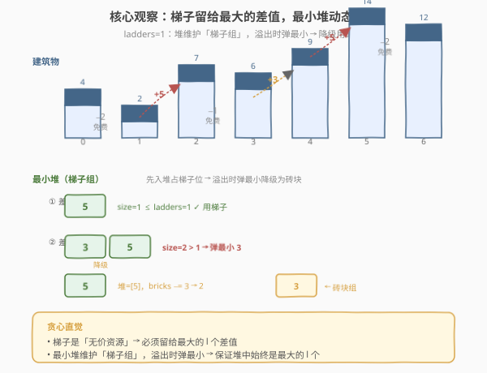
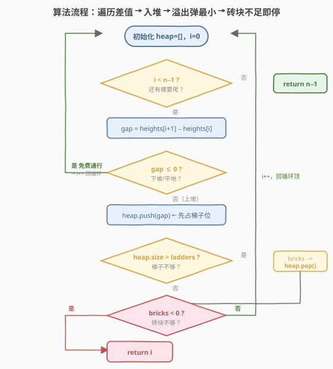
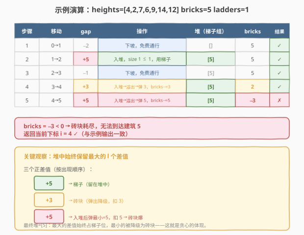

# LeetCode 可以到达的最远建筑 题解

## 1. 题目概述

- **标题 / 题号**：可以到达的最远建筑（#1642，medium）
- **链接**：https://leetcode.cn/problems/furthest-building-you-can-reach/
- **难度**：中等
- **标签**：贪心、堆（优先队列）、数组

**题意**：给定一个整数数组 `heights` 表示建筑物高度，以及砖块数 `bricks` 和梯子数 `ladders`。从建筑物 `0` 出发，依次向后移动。从建筑物 `i` 移到 `i+1` 时：

- 若 `heights[i] >= heights[i+1]`（下坡或平地），**无需消耗**任何资源。
- 若 `heights[i] < heights[i+1]`（上坡），必须二选一：使用 **一架梯子**，或消耗 `heights[i+1] - heights[i]` **个砖块**。

求以最佳方式使用砖块和梯子时，能到达的**最远建筑下标**。

**示例 1**：

```text
输入：heights = [4,2,7,6,9,14,12], bricks = 5, ladders = 1
输出：4
解释：4→2 下坡免费；2→7 用 5 砖块；7→6 下坡免费；6→9 用唯一梯子。
      到达建筑 4 后，9→14 还差 5，砖块已用完、梯子已用完，无法继续。
```

**示例 2**：

```text
输入：heights = [4,12,2,7,3,18,20,3,19], bricks = 10, ladders = 2
输出：7
```

**示例 3**：

```text
输入：heights = [14,3,19,3], bricks = 17, ladders = 0
输出：3
```

**约束**：

- $1 \leq \text{heights.length} \leq 10^5$
- $1 \leq \text{heights}[i] \leq 10^6$
- $0 \leq \text{bricks} \leq 10^9$
- $0 \leq \text{ladders} \leq \text{heights.length}$

> 💡 关键在于：**梯子是「无价」资源**（一架梯子能跨越任意大的高度差），而砖块是「可量化」资源（消耗量 = 高度差）。直觉告诉我们：**应把宝贵的梯子留给最大的高度差**，砖块去填那些小坑。这正是贪心的切入点。

## 2. 解题思路

### 2.1 暴力思路：枚举梯子分配方案

所有正高度差（上坡）构成一个集合，设其大小为 $m$。我们要从中选 $l$ 个分配给梯子、其余用砖块。枚举所有 $\binom{m}{l}$ 种组合，对每种组合计算砖块消耗是否 $\leq \text{bricks}$，取能走到的最远位置。

最坏 $m = n$，组合数 $\binom{n}{l}$ 指数级爆炸（如 $n = 10^5, l = n/2$ 时天文数字），完全不可行。

根本问题在于：**我们不需要预先决定哪些差值用梯子**——可以一边走一边维护「当前用梯子跨越的差值集合」，并在资源不够时动态调整。

### 2.2 核心观察：最小堆动态调整 —— 梯子优先，遇满降级



贪心策略的核心是两条：

1. **梯子优先**：遇到上坡差值 `gap` 时，先**假设用梯子**跨越，把 `gap` 压入最小堆。
2. **遇满降级**：当堆中元素个数超过梯子数 `ladders` 时，说明梯子不够用了。此时堆顶是最小的那个差值——**把它从「梯子组」降级为「砖块组」**，弹出堆顶并从 `bricks` 中扣除。

> 💡 **为什么弹最小的？** 堆维护的是「当前用梯子跨越的差值集合」。梯子应留给**最大的** $l$ 个差值。当堆大小超过 $l$ 时，最小的那个差值不该继续占梯子——它应该让位给砖块，把梯子腾出来给后续可能出现的更大的差值。最小堆正好能 $O(\log l)$ 取出这个「该降级」的最小值。

> ⚠️ **为什么是「先入堆再弹出」而非「先比较再决定」？** 因为后续还可能出现更大的差值。如果当前堆已满就立刻用砖块，可能把砖块浪费在一个本该用梯子的大差值上。正确做法是**先让差值入堆（占住梯子位），再在溢出时把当前最小的踢出**——这样被踢出的永远是截至目前最小的，梯子始终留给截至目前最大的 $l$ 个。

### 2.3 算法流程图



算法步骤：

1. 初始化最小堆 `heap`（存储当前用梯子跨越的正差值）。
2. 从 `i = 0` 开始遍历到 `n - 2`：
   - 计算 `gap = heights[i+1] - heights[i]`。
   - 若 `gap <= 0`（下坡/平地），直接 `continue`，不消耗资源。
   - 若 `gap > 0`（上坡）：
     - 把 `gap` 压入最小堆。
     - 若堆大小 `> ladders`：弹出堆顶 `minGap`，`bricks -= minGap`（该差值从梯子降级为砖块）。
     - 若 `bricks < 0`：砖块不够了，返回 `i`（无法到达 `i+1`）。
3. 若循环正常结束，说明一路走完，返回 `n - 1`。

### 2.4 示例演算



以**示例 1** 为例，`heights = [4,2,7,6,9,14,12]`，`bricks = 5`，`ladders = 1`：

| 步骤 | 移动 | gap | 操作 | 堆（梯子组） | bricks | 能否继续 |
|------|------|-----|------|-------------|--------|----------|
| 1 | 0→1 | −2 | 下坡免费 | `[]` | 5 | ✓ |
| 2 | 1→2 | +5 | 入堆，堆满不溢（size 1 ≤ 1） | `[5]` | 5 | ✓ |
| 3 | 2→3 | −1 | 下坡免费 | `[5]` | 5 | ✓ |
| 4 | 3→4 | +3 | 入堆，size 2 > 1 → 弹 min=3，扣砖块 | `[5]` | 5−3=2 | ✓ |
| 5 | 4→5 | +5 | 入堆，size 2 > 1 → 弹 min=5，扣砖块 | `[5]` | 2−5=−3 | ✗ |

`bricks = −3 < 0`，无法到达建筑 5，返回当前下标 `i = 4`。

> 💡 对照看：堆中始终保留最大的 1 个差值（最终是 5），用梯子跨越；较小的差值 3 被降级用砖块。这正是「梯子留最大」的贪心体现。

## 3. 参考代码

### C++

```cpp
class Solution {
public:
    int furthestBuilding(vector<int>& heights, int bricks, int ladders) {
        priority_queue<int, vector<int>, greater<int>> heap; // 最小堆
        int n = heights.size();
        for (int i = 0; i < n - 1; ++i) {
            int gap = heights[i + 1] - heights[i];
            if (gap <= 0) continue;
            heap.push(gap);
            if ((int)heap.size() > ladders) {
                bricks -= heap.top();
                heap.pop();
            }
            if (bricks < 0) return i;
        }
        return n - 1;
    }
};
```

### Python

```python
class Solution:
    def furthestBuilding(self, heights: list[int], bricks: int, ladders: int) -> int:
        import heapq
        heap = []  # 最小堆，存当前用梯子跨越的正差值
        n = len(heights)
        for i in range(n - 1):
            gap = heights[i + 1] - heights[i]
            if gap <= 0:
                continue
            heapq.heappush(heap, gap)
            if len(heap) > ladders:
                bricks -= heapq.heappop(heap)
            if bricks < 0:
                return i
        return n - 1
```

> 💡 **C++ 用 `greater<int>` 构造最小堆**：`priority_queue<int, vector<int>, greater<int>>` 让堆顶为最小值，便于溢出时弹出最小差值。Python 的 `heapq` 默认就是最小堆。两者逻辑完全一致。

## 4. 复杂度分析

| 维度 | 复杂度 | 说明 |
|------|--------|------|
| 时间复杂度 | $O(n \log l)$ | 遍历 $n-1$ 次移动，每个正差值至多一次入堆 + 至多一次出堆，堆操作 $O(\log l)$，堆大小上界为 `ladders` |
| 空间复杂度 | $O(l)$ | 最小堆至多存 `ladders + 1` 个元素 |

> 💡 当 `ladders = 0` 时堆始终为空（每入即弹），退化为 $O(n)$ 纯累加；当 `ladders` 较大时 $\log l$ 仍很小（$l \leq n \leq 10^5$，$\log l \leq 17$）。总体高效。

## 5. 扩展：对偶视角 —— 最大堆「砖块反悔换梯子」

最小堆解法是「**梯子优先，溢出降级为砖块**」。还存在一个对偶解法：**砖块优先，不够时反悔换梯子**。

- 遍历正差值，先**全部用砖块**跨越，同时把差值压入**最大堆**。
- 砖块不够（`bricks < 0`）时，从最大堆弹出**最大的已用砖块差值**，把那笔砖块**退还**，改用一架梯子。
- 梯子用完仍不够，停止。

两种解法是对称的：最小堆维护「梯子组」、溢出时把最小降级为砖块；最大堆维护「砖块组」、不够时把最大升级为梯子。核心贪心直觉相同——**梯子必须留给最大的差值**。最小堆写法更简洁（无需在砖块不足时回溯），是面试首选。

## 6. 面试要点

1. **为什么用最小堆而非最大堆？**

   - 最小堆维护「当前用梯子跨越的差值集合」，堆顶是该集合中最小的。当堆溢出（梯子不够）时，最小的差值最不该占梯子——把它弹出改用砖块，梯子位留给后续可能更大的差值。若用最大堆则无法高效取出「该降级的最小值」。

2. **为什么先入堆再判断溢出，而不是先判断？**

   - 先入堆意味着「新差值先占住梯子位」，再在溢出时弹出当前最小。这保证了被弹出的永远是截至目前最小的，梯子始终保留截至目前最大的 $l$ 个。若先判断再用砖块，可能把砖块浪费在原本该用梯子的大差值上。

3. **砖块不足时为什么直接返回 `i` 而非 `i-1`？**

   - 循环到 `i` 时计算的是「从 `i` 到 `i+1`」的差值。砖块不足意味着无法完成这次移动，即无法到达 `i+1`，所以能到达的最远是 `i`。返回 `i` 正确。

4. **`ladders = 0` 时算法如何退化？**

   - 每个正差值入堆后立即因 `size > 0` 被弹出并扣砖块，堆始终为空。算法退化为线性累加正差值，遇到 `bricks < 0` 即停，$O(n)$ 时间、$O(1)$ 空间。

5. **如果梯子数大于正差值总数会怎样？**

   - 堆大小始终 $\leq$ 正差值总数 $< \text{ladders}$，永远不会触发弹出，砖块一个不用。算法正确走完全程返回 `n-1`，符合直觉（梯子够用就不需要砖块）。

## 同类练习题

| # | 题目 | 与本题的关联 |
|---|------|-------------|
| 239 | [滑动窗口最大值](https://leetcode.cn/problems/sliding-window-maximum/) | 单调队列维护窗口最值，与本题最小堆维护「梯子组最值」同为「堆/队列动态维护候选集」范式 |
| 502 | [IPO](https://leetcode.cn/problems/ipo/) | 贪心 + 大顶堆，排序解锁 + 每轮取最大利润，与本题「贪心选最大/最小 + 堆维护」同源 |
| 703 | [数据流中的第 K 大元素](https://leetcode.cn/problems/kth-largest-element-in-a-stream/) | 最小堆维护前 K 大，与本题最小堆维护「梯子组最大的 l 个差值」结构完全一致 |
| 630 | [课程表 III](https://leetcode.cn/problems/course-schedule-iii/) | 贪心 + 最大堆反悔，与第 5 节「对偶视角」的最大堆反悔换梯子思路同构 |
| 253 | [会议室 II](https://leetcode.cn/problems/meeting-rooms-ii/) | 最小堆维护「当前进行中的会议结束时间」，与本题最小堆维护「当前用梯子的差值集」同为「堆模拟资源分配」 |
