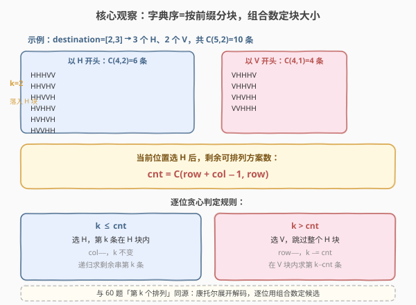
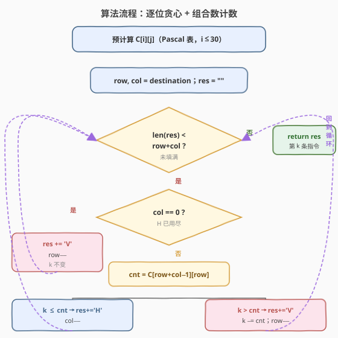

# LeetCode 第 K 条最小指令 题解

## 1. 题目概述

- **标题 / 题号**：第 K 条最小指令（#1643，hard）
- **链接**：https://leetcode.cn/problems/kth-smallest-instructions/
- **难度**：困难
- **标签**：数学、组合数学、贪心

**题意**：Bob 站在单元格 `(0, 0)`，想要前往目的地 `destination = [row, column]`。他只能向**右**或向**下**走。导航**指令**用字符串表示：

- `'H'`：水平向右移动一格
- `'V'`：竖直向下移动一格

从 `(0, 0)` 走到 `(row, col)` 恰好需要 `col` 个 `H` 与 `row` 个 `V`，指令串长度为 $row + col$。所有合法指令按**字典序**升序排列后（`'H' < 'V'`），Bob 想要第 $k$ 条（$k$ 从 1 开始）。

**示例 1**：

```text
输入：destination = [2,3], k = 1
输出："HHHVV"
解释：能前往 (2, 3) 的全部指令按字典序排列为：
["HHHVV","HHVHV","HHVVH","HVHHV","HVHVH","HVVHH","VHHHV","VHHVH","VHVHH","VVHHH"]
```

**示例 2**：

```text
输入：destination = [2,3], k = 2
输出："HHVHV"
```

**示例 3**：

```text
输入：destination = [2,3], k = 3
输出："HHVVH"
```

**约束**：

- `destination.length == 2`
- `1 <= row, column <= 15`
- `1 <= k <= C(row + column, row)`，其中 $C(a, b)$ 为组合数

> 💡 题目本质是**求多重集（`col` 个 `H` + `row` 个 `V`）的全排列中字典序第 $k$ 小者**。这与 [60. 第 k 个排列](https://leetcode.cn/problems/permutation-sequence/) 同源——都是「康托尔展开解码」：逐位确定字符，用组合数衡量「选某个字符后剩余的方案数」，从而把 $k$ 一步步映射到具体的排列上。

## 2. 解题思路

### 2.1 暴力思路：生成全部排列再排序

最直白的做法：枚举所有由 `col` 个 `H` 和 `row` 个 `V` 组成的字符串，排序后取第 $k$ 个。可用回溯或 `next_permutation` 生成。

```text
生成所有 C(row+col, row) 条指令 → 排序 → 取第 k 条
```

问题：$row, col \le 15$，最坏 $C(30, 15) = 155\,117\,520$，约 1.5 亿条、每条最长 30 字符，**内存与时间都爆炸**。必须利用「只要第 $k$ 条」这一条件，避免枚举全部。

### 2.2 核心观察：逐位贪心 + 组合数计数



关键洞察来自字典序的本质：**所有以 `'H'` 开头的指令严格排在所有以 `'V'` 开头的指令之前**（因为 `'H' < 'V'`）。于是全部 $C(row+col, row)$ 条指令可按首字符分成两块：

| 块 | 首字符 | 块内条数 | 说明 |
|----|--------|----------|------|
| H 块 | `'H'` | $C(row + col - 1,\ row)$ | 选 `H` 后，剩余 `col-1` 个 `H`、`row` 个 `V`，排列数为 $C(row+col-1,\ row)$ |
| V 块 | `'V'` | $C(row + col - 1,\ row-1)$ | 选 `V` 后，剩余 `col` 个 `H`、`row-1` 个 `V`；两者之和恰为 $C(row+col,\ row)$ |

> 💡 由组合恒等式 $C(n-1, r) + C(n-1, r-1) = C(n, r)$，两块之和等于总数，划分无遗漏。

于是每一步只需比较 $k$ 与「H 块大小」$cnt = C(row+col-1,\ row)$：

- **若 $k \le cnt$**：第 $k$ 条落在 H 块内，当前位置填 `'H'`，`col -= 1`，$k$ 不变，递归求剩余串的第 $k$ 条。
- **若 $k > cnt$**：第 $k$ 条落在 V 块内，跳过整个 H 块，当前位置填 `'V'`，`row -= 1`，`k -= cnt`，在 V 块内求第 $k - cnt$ 条。

边界：当 `col == 0`（H 已用尽），剩余位置只能填 `'V'`，直接补齐即可。

> ⚠️ **组合数会很大**：$C(30, 15) \approx 1.55 \times 10^8$，超过 32 位 `int` 上界（$2.1 \times 10^9$ 虽够，但中间值如 $C(29, 14)$ 等仍需小心）。用 `long long` 存储最稳妥；本题数据范围内 `long long` 完全够用。

### 2.3 算法流程图



流程要点：

1. **预计算组合数表**：用 Pascal 公式 $C[i][j] = C[i-1][j-1] + C[i-1][j]$ 预算 $C[0..30][0..30]$，$O(30^2)$ 一次完成，后续 $O(1)$ 查表。
2. **主循环**：每次填一个字符，直到结果串长度达到 $row + col$。
3. **`col == 0` 快速出口**：H 用尽时剩下的全是 `V`，无需再计数。
4. **比较 $k$ 与 $cnt$**：选 `H` 则 `col--`；选 `V` 则 `row--` 且 `k -= cnt`。

### 2.4 示例演算

![示例演算：destination=[2,3]，k=2 → "HHVHV"](../images/kth_inst_walkthrough.svg)

以 `destination = [2, 3]`、`k = 2` 为例（3 个 `H`、2 个 `V`，总数 $C(5,2)=10$）：

| 步 | row, col | $cnt=C(r+c-1,\ r)$ | 判定（$k$） | 输出 |
|----|----------|--------------------|-------------|------|
| ① | 2, 3 | $C(4,2)=6$ | $k=2 \le 6$ → 选 `H` | `H` |
| ② | 2, 2 | $C(3,2)=3$ | $k=2 \le 3$ → 选 `H` | `HH` |
| ③ | 2, 1 | $C(2,2)=1$ | $k=2 > 1$ → 选 `V`，`k=1` | `HHV` |
| ④ | 1, 1 | $C(1,1)=1$ | $k=1 \le 1$ → 选 `H` | `HHVH` |
| ⑤ | 1, 0 | — | `col=0` → 选 `V` | `HHVHV` |

> 💡 **步③是本题的精髓**：此时若选 `H`，只有 $C(2,2)=1$ 种后续（即 `HH`），但 $k=2$ 超过 1，说明第 2 条不在 H 块、而在 V 块。跳过这 1 条（`k -= 1`），在 V 块内求第 1 条，于是填 `V`。

## 3. 参考代码

### C++

```cpp
class Solution {
public:
    string kthSmallestPath(vector<int>& destination, int k) {
        int row = destination[0], col = destination[1];
        int n = row + col;

        // Pascal 表：C[i][j]，i <= 30
        long long C[31][31] = {0};
        for (int i = 0; i <= n; ++i) {
            C[i][0] = 1;
            for (int j = 1; j <= i; ++j)
                C[i][j] = C[i - 1][j - 1] + C[i - 1][j];
        }

        string res;
        res.reserve(n);
        while ((int)res.size() < n) {
            if (col == 0) {                 // H 用尽，只能补 V
                res += 'V';
                --row;
                continue;
            }
            // 选 H 后剩余方案数：剩余 row 个 V、col-1 个 H
            long long cnt = C[row + col - 1][row];
            if (k <= cnt) {                 // 第 k 条在 H 块内
                res += 'H';
                --col;
            } else {                        // 跳过整个 H 块，落到 V 块
                res += 'V';
                k -= cnt;
                --row;
            }
        }
        return res;
    }
};
```

### Python

```python
class Solution:
    def kthSmallestPath(self, destination: list[int], k: int) -> str:
        row, col = destination
        n = row + col

        # Pascal 表
        C = [[0] * (n + 1) for _ in range(n + 1)]
        for i in range(n + 1):
            C[i][0] = 1
            for j in range(1, i + 1):
                C[i][j] = C[i - 1][j - 1] + C[i - 1][j]

        res = []
        while len(res) < n:
            if col == 0:                    # H 用尽，只能补 V
                res.append('V')
                row -= 1
                continue
            cnt = C[row + col - 1][row]     # 选 H 后剩余方案数
            if k <= cnt:                    # 第 k 条在 H 块内
                res.append('H')
                col -= 1
            else:                           # 跳过 H 块，落到 V 块
                res.append('V')
                k -= cnt
                row -= 1
        return ''.join(res)
```

> 💡 **写法细节**：
> - **组合数表只算到 $n = row + col \le 30$**：题目约束 $row, col \le 15$，$n$ 至多 30，Pascal 表 $31 \times 31$ 即可，预处理 $O(30^2)$ 可忽略。
> - **`col == 0` 特判放循环内而非循环外**：这样无需提前算出「何时 H 用尽」，逻辑更扁平；且 `col` 在循环中递减，自然触发该分支。
> - **`k` 在选 `V` 时才递减**：选 `H` 时第 $k$ 条仍在 H 块内，相对排名不变；只有跳过整个 H 块（选 `V`）时才需 `k -= cnt`，这是康托尔解码的标准操作。

## 4. 复杂度分析

| 维度 | 复杂度 | 说明 |
|------|--------|------|
| 时间复杂度 | $O(n^2 + n) = O(n^2)$ | 预计算 Pascal 表 $O(n^2)$，主循环填 $n$ 个字符每次 $O(1)$ 查表；$n = row + col \le 30$ |
| 空间复杂度 | $O(n^2)$ | 组合数表 $C[0..n][0..n]$；结果串本身是输出不计入 |

> 💡 本题 $n \le 30$，任何实现都能 AC。复杂度分析的意义在于**确认没有枚举全部 $C(n, row)$ 条排列**——暴力法的 $O(C(30,15) \cdot n)$ 在本题规模下会 TLE/MLE，逐位贪心把指数级枚举降为多项式级构造，是关键优化。

## 5. 扩展：康托尔展开与第 k 个排列

本题是经典的**康托尔展开解码**（Cantor expansion decoding）应用于多重集排列。康托尔展开把一个排列映射到它在全排列中的字典序排名（一个整数），解码则是逆过程：由排名 $k$ 还原排列。

- **全排列版**（[60. 第 k 个排列](https://leetcode.cn/problems/permutation-sequence/)）：候选集是 $1..n$ 各一个，每位选走后从候选集中删除。块大小用**阶乘** $fact[\text{剩余长度}]$。
- **多重集版**（本题）：候选集中有重复元素（多个 `H`、多个 `V`），块大小用**组合数** $C(\text{剩余总数}, \text{剩余某类数})$，因为相同字符不可区分。

推广到一般多重集 $\{a_1^{c_1}, a_2^{c_2}, \dots, a_m^{c_m}\}$（$a_1 < a_2 < \dots < a_m$）：逐位贪心，每位从小到大尝试 $a_i$，若选 $a_i$ 则剩余方案数为 $\dfrac{(\sum_j c_j - 1)!}{\prod_{j \ne i} c_j! \cdot (c_i - 1)!}$，等价于多项式系数；用 $k$ 与该数比较决定是否选 $a_i$。本题 $m=2$，该公式退化为组合数 $C(r+c-1, r)$。

## 6. 面试要点

1. **为什么不直接枚举全部排列再排序？**

   - $row, col \le 15$ 时 $C(30, 15) \approx 1.55 \times 10^8$，枚举 1.5 亿条、每条最长 30 字符，内存与时间都不可行。题目只要第 $k$ 条，应利用排名信息「跳过整块」而非逐一生成，把指数级枚举降为 $O(n^2)$ 构造。

2. **「选 H 后剩余方案数」为什么是 $C(row+col-1,\ row)$？**

   - 选 `H` 后剩余位置共 $row + col - 1$ 个，其中需安排 $row$ 个 `V`（其余自动是 `H`），方案数为 $C(row+col-1,\ row) = C(row+col-1,\ col-1)$。这等于「剩余多重集的全排列数」，是组合数定义的直接应用。

3. **为什么选 `V` 时要 `k -= cnt`，而选 `H` 时 $k$ 不变？**

   - 选 `H` 时第 $k$ 条仍在 H 块内，且 H 块内按字典序的相对排名仍是 $k$（H 块是整体的前 $cnt$ 条）。选 `V` 时表示第 $k$ 条不在 H 块、已跳过前 $cnt$ 条，于是在 V 块内的相对排名变为 $k - cnt$。这是康托尔解码的标志操作。

4. **组合数为什么用 `long long`？表要多大？**

   - $C(30, 15) \approx 1.55 \times 10^8$ 虽在 `int` 范围内，但为防中间值溢出与可移植性，统一用 `long long`。表大小 $31 \times 31$ 即可覆盖 $n \le 30$，预处理 $O(n^2)$。

5. **与 60 题（第 k 个排列）的异同？**

   - **同**：都是康托尔展开解码，逐位用「选当前最小候选后的剩余方案数」与 $k$ 比较决定字符。
   - **异**：60 题候选集各元素唯一，块大小用阶乘 $fact[len]$，选走后需从候选集删除；本题候选集有重复（多个 `H`/`V`），块大小用组合数 $C(r+c-1, r)$，选走后只把对应计数减一，无需维护「剩余候选列表」。

## 同类练习题

| # | 题目 | 与本题的关联 |
|---|------|-------------|
| 60 | [第 k 个排列](https://leetcode.cn/problems/permutation-sequence/)（[题解](../0001-0100/60_第k个排列.md)） | 康托尔展开解码的母题，全排列版用阶乘定块大小，本题是其多重集推广 |
| 31 | [下一个排列](https://leetcode.cn/problems/next-permutation/) | 排列家族的另一面——给定排列求下一个，与「由排名求排列」互为正逆 |
| 62 | [不同路径](https://leetcode.cn/problems/unique-paths/) | 网格从 `(0,0)` 到 `(m,n)` 的路径数即 $C(m+n, m)$，是本题组合数计数的几何来源 |
| 1640 | [能否连接形成数组](https://leetcode.cn/problems/check-array-formation-through-concatenation/) | 组合/排列判定类，对照本题「构造第 k 个」的逆向思维 |
