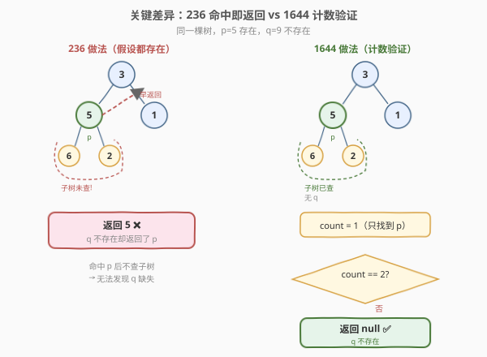
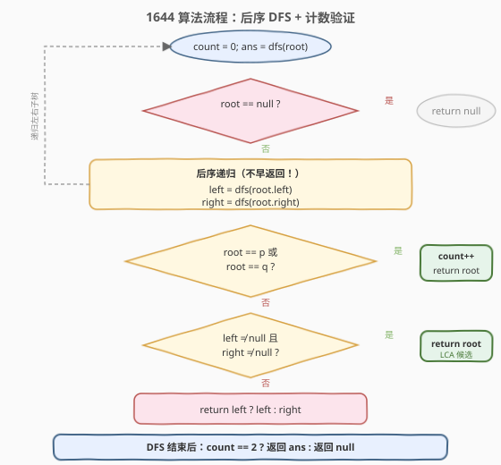
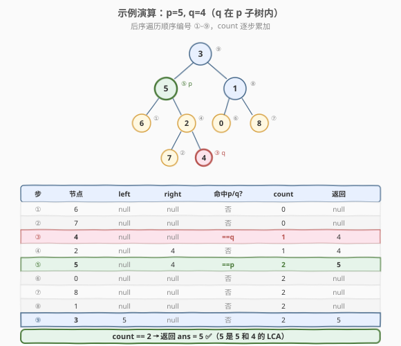

# 二叉树的最近公共祖先 II

- **题目名称**：二叉树的最近公共祖先 II
- **链接**：[1644. 二叉树的最近公共祖先 II](https://leetcode.cn/problems/lowest-common-ancestor-of-a-binary-tree-ii/)
- **难度**：中等
- **标签**：树、二叉树、深度优先搜索

## 1. 题目概述

给定一棵二叉树的根节点 `root`，以及两个节点 `p` 和 `q`，找到它们的**最近公共祖先**（LCA）。

**公共祖先**的定义与 [236. 二叉树的最近公共祖先](../0201-0300/236_二叉树的最近公共祖先.md) 完全一致：若节点 `p` 或 `q` 在 `root` 的子树中（含 `root` 自身），则 `root` 是公共祖先；**最近**公共祖先指深度最大的那个。

**本题的关键区别**：`p` 和 `q` **可能不存在**于树中。若其中任意一个不存在，返回 `null`。

**示例 1**：

```text
输入：root = [3,5,1,6,2,0,8,null,null,7,4], p = 5, q = 1
输出：3
解释：节点 5 和 1 的最近公共祖先是 3。
```

**示例 2**：

```text
输入：root = [3,5,1,6,2,0,8,null,null,7,4], p = 5, q = 4
输出：5
解释：节点 5 是 4 的祖先，所以 5 本身就是最近公共祖先。
```

**示例 3**：

```text
输入：root = [3,5,1,6,2,0,8,null,null,7,4], p = 5, q = 10
输出：null
解释：节点 10 不存在于树中，因此返回 null。
```

**约束条件**：

- 树中节点数目范围 `[1, 10^4]`
- `-10^9 <= Node.val <= 10^9`
- 所有 `Node.val` **互不相同**
- `p != q`
- `p` 和 `q` **可能不存在**于树中

> ⚠️ **与 236 题的唯一区别**：236 题保证 `p`、`q` 都存在于树中；本题**不做此保证**。这一看似微小的差异直接影响了递归终止条件的设计——236 题可以在命中 `p`/`q` 时立即返回（不查子树），本题则**必须遍历完整棵树**以确认两个节点都存在。

---

## 2. 解题思路

### 2.1 暴力思路：先验证存在再求 LCA

最直白的做法分两步走：

1. **验证存在性**：分别做两次 DFS，检查 `p` 和 `q` 是否都在树中。
2. **求 LCA**：若两者都存在，直接套用 236 题的算法求 LCA；否则返回 `null`。

```text
found_p = exists(root, p)    // 第一次 DFS
found_q = exists(root, q)    // 第二次 DFS
if not (found_p and found_q): return null
return lca_236(root, p, q)   // 第三次 DFS
```

这种做法完全正确，但最坏需要**三次**完整遍历（两次验证 + 一次求 LCA）。能否在一次遍历中同时完成"计数"与"求 LCA"？

### 2.2 核心观察：一次后序 DFS + 计数验证



关键洞察：236 题的递归在 `root == p` 或 `root == q` 时**立即返回**，不再递归子树——这隐含假设了"另一个节点一定存在"。一旦打破这个假设，早返回就会导致**漏数**：若 `q` 恰好在 `p` 的子树中，在 `p` 处早返回就永远不会发现 `q`，从而错误地把不存在的 `q` 当作"已找到"。

修正方案：**不在命中 `p`/`q` 时早返回**，而是先递归完左右子树，再在当前节点做判断。同时维护一个计数器 `count`，记录整棵树中找到了几个目标节点。递归结束后，只有 `count == 2` 时才返回 LCA 候选，否则返回 `null`。

递归函数 `dfs(root)` 的返回值含义与 236 题一致：

> `root` 子树中找到的 `p`、`q` 或 LCA 候选；都不在则返回 `null`。

但决策顺序变为**严格后序**（先左、先右、最后自身）：

1. `left = dfs(root.left)`：递归左子树。
2. `right = dfs(root.right)`：递归右子树。
3. 若 `root == p` 或 `root == q`：`count++`，返回 `root`（自身就是候选）。
4. 若 `left` 和 `right` 都非空：`root` 是 LCA，返回 `root`。
5. 否则：返回 `left` 或 `right`（非空者）。

> 💡 **为什么必须先递归子树再判断自身？** 考虑 `p=5, q=4` 且 `4` 在 `5` 的子树中的情况：若在 `root==5` 时早返回（236 的做法），就不会递归 `5` 的子树，永远发现不了 `4`。先递归子树则能找到 `4` 并 `count++`，确保计数完整。这正是"不做存在性保证"带来的代价——不能用早返回剪枝。

> ⚠️ **与 236 的递归终止条件对比**：
> - **236**：`if (root == null || root == p || root == q) return root;`（命中即返回，不查子树）
> - **1644**：`if (root == null) return null;`（仅空节点终止，命中 `p`/`q` 时仍需先查子树再计数）

### 2.3 算法流程图



整体结构仍是后序遍历，但比 236 多了一条"命中自身 → 计数"的分支，以及递归结束后的 `count == 2` 验收检查。注意"命中 `p`/`q`"的判断在递归左右子树**之后**，这是与 236 最关键的结构差异。

### 2.4 示例演算



以 `p=5, q=4`（`q` 在 `p` 的子树中）为例，后序遍历顺序为 ⑥→⑦→④→②→⑤→⑥→⑦→⑧→⑨：

| 步 | 节点 | left | right | 命中? | count | 返回 |
|----|------|------|-------|-------|-------|------|
| ① | 6 | null | null | 否 | 0 | null |
| ② | 7 | null | null | 否 | 0 | null |
| ③ | **4** | null | null | **==q** | **1** | 4 |
| ④ | 2 | null | 4 | 否 | 1 | 4 |
| ⑤ | **5** | null | 4 | **==p** | **2** | **5** |
| ⑥ | 0 | null | null | 否 | 2 | null |
| ⑦ | 8 | null | null | 否 | 2 | null |
| ⑧ | 1 | null | null | 否 | 2 | null |
| ⑨ | 3 | 5 | null | 否 | 2 | 5 |

最终 `count == 2`，返回候选 `ans = 5`。`5` 确实是 `5` 和 `4` 的 LCA ✅。

> 💡 **观察要点**：步③在 `4` 处计数为 `1`，步⑤在 `5` 处计数为 `2`。因为先递归了 `5` 的子树（步①-④），才在子树中发现了 `4`。若像 236 那样在 `5` 处早返回，步①-④不会执行，`count` 只会是 `1`，最终返回 `null`——这在本题中反而是**正确**的（如果 `q` 真的不存在），但 236 的早返回在 `q` 存在时会**错误地漏数**。所以 1644 必须放弃早返回、坚持完整后序遍历。

---

## 3. 参考代码

### C++

```cpp
/**
 * Definition for a binary tree node.
 * struct TreeNode {
 *     int val;
 *     TreeNode *left;
 *     TreeNode *right;
 *     TreeNode(int x) : val(x), left(nullptr), right(nullptr) {}
 * };
 */
class Solution {
    int count = 0;

    TreeNode* dfs(TreeNode* root, TreeNode* p, TreeNode* q) {
        if (root == nullptr) {
            return nullptr;
        }
        // 后序：先递归左右子树（不早返回！）
        TreeNode* left = dfs(root->left, p, q);
        TreeNode* right = dfs(root->right, p, q);
        // 再判断自身
        if (root == p || root == q) {
            count++;
            return root;
        }
        if (left != nullptr && right != nullptr) {
            return root; // p、q 分居两侧 → root 是 LCA
        }
        return left != nullptr ? left : right;
    }

  public:
    TreeNode* lowestCommonAncestor(TreeNode* root, TreeNode* p, TreeNode* q) {
        TreeNode* ans = dfs(root, p, q);
        return count == 2 ? ans : nullptr;
    }
};
```

### Python

```python
class Solution:
    def lowestCommonAncestor(self, root: 'TreeNode', p: 'TreeNode', q: 'TreeNode') -> 'TreeNode':
        self.count = 0

        def dfs(root: 'TreeNode') -> 'TreeNode':
            if root is None:
                return None
            # 后序：先递归左右子树（不早返回！）
            left = dfs(root.left)
            right = dfs(root.right)
            # 再判断自身
            if root is p or root is q:
                self.count += 1
                return root
            if left and right:
                return root  # p、q 分居两侧 → root 是 LCA
            return left if left else right

        ans = dfs(root)
        return ans if self.count == 2 else None
```

> ⚠️ **代码与 236 的两处关键区别**：
> 1. **递归终止条件**：只判 `root == null`，不再判 `root == p || root == q`。命中 `p`/`q` 的处理移到递归子树之后，确保子树被完整遍历。
> 2. **计数验收**：递归结束后检查 `count == 2`，否则返回 `null`。这是 236 没有的步骤——236 题保证两者都存在，无需验收。

---

## 4. 复杂度分析

| 维度 | 复杂度 | 说明 |
|------|--------|------|
| 时间复杂度 | $O(n)$ | 每个节点恰好访问一次；相比 236 无法在命中 `p`/`q` 时剪枝，但渐近复杂度不变 |
| 空间复杂度 | $O(h)$ | 递归调用栈深度 = 树高 $h$；最坏（链状树）$O(n)$，平衡树 $O(\log n)$ |

> 💡 **与 236 的复杂度对比**：两者都是 $O(n)$ 时间、$O(h)$ 空间。虽然 1644 不能像 236 那样在命中目标时早返回（少递归一部分子树），但最坏情况下 236 也需要遍历全树（如 `p`、`q` 都在最深层的不同子树中），所以渐近复杂度相同。实际运行中 1644 的常数因子略大，因为每个命中节点的子树也必须完整遍历。

---

## 5. 扩展：LCA 系列对比

LeetCode 有四道 LCA 变体题，它们围绕"输入条件的变化"展开：

| 题号 | 题目 | 输入条件变化 | 核心差异 |
|------|------|-------------|----------|
| [235](https://leetcode.cn/problems/lowest-common-ancestor-of-a-binary-search-tree/) | BST 的最近公共祖先 | 树是 BST | 利用有序性 $O(h)$ 迭代 |
| [236](https://leetcode.cn/problems/lowest-common-ancestor-of-a-binary-tree/) | 二叉树的最近公共祖先 | 普通二叉树，**保证** `p`/`q` 都存在 | 后序 DFS，命中即早返回 |
| **1644** | 二叉树的最近公共祖先 II | `p`/`q` **可能不存在** | 后序 DFS + 计数验证 |
| [1650](https://leetcode.cn/problems/lowest-common-ancestor-of-a-binary-tree-iii/) | 二叉树的最近公共祖先 III | 节点带**父指针**，无 root | 双指针走"相交链表" |

本题（1644）的核心创新在于：**当输入条件从"保证存在"放宽到"可能不存在"时，递归终止条件必须同步调整**——从"命中即返回"改为"先查子树再计数"。这是一个典型的"输入假设决定算法结构"的例子。

---

## 6. 面试要点

1. **本题和 236 题的区别是什么？为什么不能直接套用 236 的代码？**

   - 236 题保证 `p`、`q` 都存在于树中，因此递归在 `root == p || root == q` 时立即返回，不再查子树。本题不做此保证，若直接套用 236，当 `q` 不存在时会错误地返回 `p`（把"找到 `p`"误当作"找到两者"）。必须放弃早返回、完整遍历并计数。

2. **为什么计数器 `count` 要放在递归函数外部（类成员/闭包变量）？**

   - `count` 需要累加整棵树的命中次数，是全局状态而非单子树的局部信息。若作为返回值传递，则递归函数需返回 `(节点, 计数)` 元组，代码更复杂。用类成员（C++）或闭包变量（Python）是最简洁的做法，且不改变递归函数的返回值语义。

3. **如果 `p` 是 `q` 的祖先（如示例 2，p=5, q=4），算法如何处理？**

   - 后序遍历先到 `q=4`（在 `p=5` 的子树深处），`count` 变为 1，返回 `4`。随后到 `p=5`：`left`/`right` 中有 `4`（非空），且 `root == p` → `count` 变为 2，返回 `5`。最终 `count == 2`，返回 `5`，即 LCA。关键在于先递归子树才能发现 `q`，这正是放弃早返回的意义。

4. **能否优化为"找到 LCA 且 count == 2 后立即停止递归"？**

   - 理论上可以，但实现复杂：需要在递归中传递"是否已找到 LCA"的标志，且后序遍历的递归栈无法轻易中断。实际收益有限——最坏情况仍需遍历全树，且代码可读性大幅下降。面试中 $O(n)$ 单次遍历已经是最优解，不必过度优化。

5. **暴力法（先验证存在再求 LCA）和一次遍历法，哪个更好？**

   - 渐近复杂度相同（都是 $O(n)$ 时间、$O(h)$ 空间）。暴力法最坏 3 次遍历，但代码更简单、不易写错；一次遍历法只需 1 次遍历，常数更优，但递归逻辑稍复杂。面试中建议先说暴力法（展示分析过程），再优化到一次遍历法（展示优化能力）。

---

## 7. 同类练习题

- [236. 二叉树的最近公共祖先](https://leetcode.cn/problems/lowest-common-ancestor-of-a-binary-tree/)（[题解](../0201-0300/236_二叉树的最近公共祖先.md)）：保证 `p`/`q` 存在的母题，命中即早返回，对照本题的计数验证
- [235. 二叉搜索树的最近公共祖先](https://leetcode.cn/problems/lowest-common-ancestor-of-a-binary-search-tree/)：BST 版本，利用有序性 $O(h)$ 迭代求解
- [1650. 二叉树的最近公共祖先 III](https://leetcode.cn/problems/lowest-common-ancestor-of-a-binary-tree-iii/)：节点带父指针，转化为"相交链表"双指针问题
- [1123. 最深叶节点的最近公共祖先](https://leetcode.cn/problems/lowest-common-ancestor-of-deepest-leaves/)：LCA 的另一变体，目标节点由"最深叶节点"动态确定，后序 DFS 返回 `(深度, 节点)` 元组
- [2096. 从二叉树一个节点到另一个节点每一步的方向](https://leetcode.cn/problems/step-by-step-directions-from-a-binary-tree-node-to-another/)：先求 LCA 再拼路径，综合 LCA + 路径回溯
