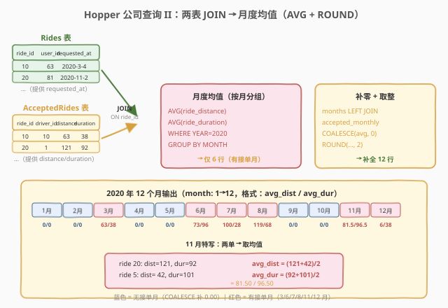
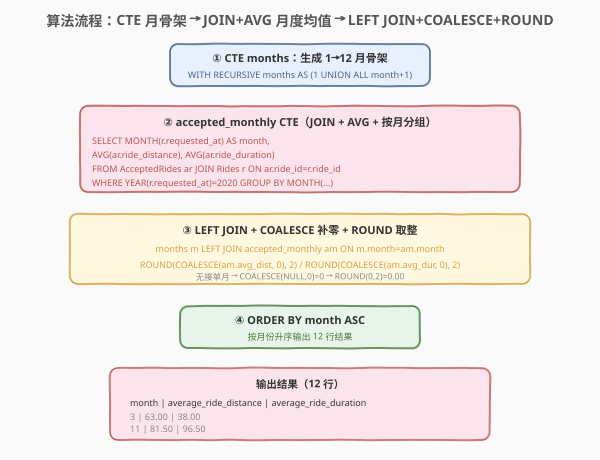
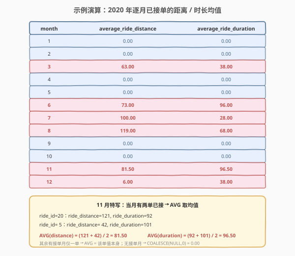

# LeetCode Hopper公司查询II 题解

> ⚠️ **题目来源说明**：本题在 leetcode.cn 与 leetcode.com 均为 **Plus 会员专享题**，官方题面接口返回 `content = null`，无法直接抓取。下述题意、表结构与示例数据依据 **1635. Hopper Company Queries I**（同系列、共享 `Drivers`/`Rides`/`AcceptedRides` 三表与同一组样例）与该题的官方要求重建，并已在文中标注假设。若与官方题面有出入，以官方为准。

## 1. 题目概述

- **标题 / 题号**：Hopper公司查询II（#1645，hard）
- **链接**：https://leetcode.com/problems/hopper-company-queries-ii/
- **难度**：困难
- **标签**：数据库、SQL、`WITH RECURSIVE`、`LEFT JOIN`、`AVG()`、`ROUND()`、`COALESCE`、`GROUP BY`、`YEAR()`/`MONTH()`

**题意**：给定 `Rides`（乘车请求）和 `AcceptedRides`（已接单）两张表，编写 SQL 查询，统计 **2020 年每个月**已接单乘车的：

1. **`average_ride_distance`**：该月所有**已接单**乘车的 `ride_distance` **平均值**，`ROUND` 到 2 位小数。
2. **`average_ride_duration`**：该月所有**已接单**乘车的 `ride_duration` **平均值**，`ROUND` 到 2 位小数。

若某月**无任何已接单**记录，则两项均值均输出 `0.00`。结果需覆盖 2020 年全部 **12 个月**，按 `month` **升序**排列。

> 💡 本题是 [1635. Hopper Company Queries I](../1601-1700/1635_Hopper公司查询I.md) 的续集：1635 算的是「**计数**」（活跃司机数 / 接单数），1645 算的是「**均值**」（接单距离 / 时长）。两题共享同一组样例数据，核心模板同为「`WITH RECURSIVE` 生成 12 月骨架 → `LEFT JOIN` + `COALESCE` 补零」，区别仅在于把 `COUNT` 换成 `AVG` 并追加 `ROUND` 取整。

**表结构**（与 1635 相同）：

```text
Table: Rides
+--------------+---------+
| Column Name  | Type    |
+--------------+---------+
| ride_id      | int     |  ← 主键
| user_id      | int     |
| requested_at | date    |
+--------------+---------+
每行一条乘车请求（含未被接受的）。

Table: AcceptedRides
+---------------+---------+
| Column Name   | Type    |
+---------------+---------+
| ride_id       | int     |  ← 主键（引用 Rides.ride_id）
| driver_id     | int     |
| ride_distance | int     |
| ride_duration | int     |
+---------------+---------+
每行一条已接单记录，保证 ride_id 在 Rides 表中存在。
```

> ⚠️ `AcceptedRides` 表**没有日期列**，必须 `JOIN Rides` 表取 `requested_at` 来判定月份归属——这是本题与 1635 共同的关键观察。

**示例 1**（沿用 1635 的样例数据）：

```text
Rides 表（2020 年部分）:
+---------+---------+--------------+
| ride_id | user_id | requested_at |
+---------+---------+--------------+
| 10      | 63      | 2020-3-4     |
| 19      | 39      | 2020-4-6     |   ← 未被接受，不计入
| 3       | 41      | 2020-6-3     |   ← 未被接受，不计入
| 13      | 52      | 2020-6-22    |
| 7       | 69      | 2020-7-16    |
| 17      | 70      | 2020-8-25    |
| 20      | 81      | 2020-11-2    |
| 5       | 57      | 2020-11-9    |
| 2       | 42      | 2020-12-9    |
+---------+---------+--------------+

AcceptedRides 表（2020 年部分）:
+---------+-----------+---------------+---------------+
| ride_id | driver_id | ride_distance | ride_duration |
+---------+-----------+---------------+---------------+
| 10      | 10        | 63            | 38            |
| 13      | 10        | 73            | 96            |
| 7       | 8         | 100           | 28            |
| 17      | 7         | 119           | 68            |
| 20      | 1         | 121           | 92            |
| 5       | 7         | 42            | 101           |
| 2       | 4         | 6             | 38            |
+---------+-----------+---------------+---------------+

输出:
+-------+----------------------+----------------------+
| month | average_ride_distance | average_ride_duration |
+-------+----------------------+----------------------+
| 1     | 0.00                 | 0.00                 |
| 2     | 0.00                 | 0.00                 |
| 3     | 63.00                | 38.00                |
| 4     | 0.00                 | 0.00                 |
| 5     | 0.00                 | 0.00                 |
| 6     | 73.00                | 96.00                |
| 7     | 100.00               | 28.00                |
| 8     | 119.00               | 68.00                |
| 9     | 0.00                 | 0.00                 |
| 10    | 0.00                 | 0.00                 |
| 11    | 81.50                | 96.50                |
| 12    | 6.00                 | 38.00                |
+-------+----------------------+----------------------+
```

**解释**：

| month | 当月已接单的 (distance, duration) | avg_dist | avg_dur | 说明 |
|-------|----------------------------------|----------|---------|------|
| 1, 2 | — | 0.00 | 0.00 | 无接单 → COALESCE 补 0 |
| 3 | (63, 38) | 63.00 | 38.00 | 单条取均值=自身 |
| 4, 5 | — | 0.00 | 0.00 | ride 19/3 未被接受，不计入 |
| 6 | (73, 96) | 73.00 | 96.00 | ride 13 |
| 7 | (100, 28) | 100.00 | 28.00 | ride 7 |
| 8 | (119, 68) | 119.00 | 68.00 | ride 17 |
| 9, 10 | — | 0.00 | 0.00 | 无接单 |
| 11 | (121, 92), (42, 101) | 81.50 | 96.50 | **两单取均值**：(121+42)/2、(92+101)/2 |
| 12 | (6, 38) | 6.00 | 38.00 | ride 2 |

> 💡 **11 月是关键样例**：该月有两条已接单（ride 20 与 ride 5），均值不再是某条记录自身，而是 `(121+42)/2 = 81.50`、`(92+101)/2 = 96.50`。这一行验证了 `AVG` 真的在「多单取平均」而非简单取值。

**约束**：

- `ride_id` 是 `Rides` 表和 `AcceptedRides` 表的主键。
- `AcceptedRides` 中的每条记录保证在 `Rides` 表中存在。
- 结果必须覆盖 2020 年全部 12 个月，按 `month` 升序排列。
- 均值 `ROUND` 到 2 位小数；无接单月输出 `0.00`（非 `NULL`）。
- 月份归属以 `Rides.requested_at` 为准（`AcceptedRides` 无日期列）。

> 💡 本题是 SQL **"JOIN 取日期 + 聚合求均值 + 序列补零 + 取整"综合题**——三大要点：① `AcceptedRides` 无日期列，须 `JOIN Rides` 取 `requested_at`；② `AVG` 对空分组返回 `NULL`，需 `COALESCE` 补 0 再 `ROUND`；③ 用 `WITH RECURSIVE` 生成 1–12 月骨架，保证无接单月也输出。

## 2. 解题思路

### 2.1 暴力思路：逐月查询拼接

最直觉的过程式思路：对 2020 年的每个月，分别执行一条子查询——`JOIN` 两表后筛选该月、对 `ride_distance`/`ride_duration` 取 `AVG`，再用 `UNION ALL` 拼成 12 行。伪代码：

```text
for month m in 1..12:
    rows = SELECT ar.ride_distance, ar.ride_duration
           FROM AcceptedRides ar JOIN Rides r ON ar.ride_id = r.ride_id
           WHERE YEAR(r.requested_at) = 2020 AND MONTH(r.requested_at) = m
    if rows is empty:
        output(m, 0.00, 0.00)
    else:
        output(m, ROUND(AVG(rows.distance), 2), ROUND(AVG(rows.duration), 2))
```

但 **SQL 没有显式 for 循环**——需换用集合式表达。核心挑战有三：

1. **生成 12 行月份骨架**：即使某月无接单，也必须输出该月且均值为 `0.00`。需一个"1–12 数字序列"作为 `LEFT JOIN` 的左表。
2. **`AVG` 对空集返回 `NULL`**：`AVG` 在分组无数据时返回 `NULL`（不是 0）。`LEFT JOIN` 后无接单月的 `AVG` 结果为 `NULL`，需 `COALESCE(..., 0)` 补零，**再** `ROUND` 取整。
3. **`AcceptedRides` 缺日期列**：必须 `JOIN Rides` 取 `requested_at` 来判定月份，无法直接在 `AcceptedRides` 上按月分组。

### 2.2 核心观察：CTE 序列 + JOIN+AVG + COALESCE+ROUND



**问题拆解为三个子问题**：

1. **生成 1–12 月序列**（CTE `months`）：

   ```sql
   WITH RECURSIVE months(month) AS (
       SELECT 1
       UNION ALL
       SELECT month + 1 FROM months WHERE month < 12
   )
   ```

   用 `WITH RECURSIVE` 生成 1→12 的 12 行骨架。**这 12 行是 `LEFT JOIN` 的左表，保证即使某月无接单也输出该月。** 与 1635 完全相同的序列生成手法。

   > ⚠️ **为什么需要序列生成？** 若直接 `GROUP BY MONTH(requested_at)`，没有接单的月份不会出现在结果中（如 1、2、4、5、9、10 月），导致输出不足 12 行。用预生成的 12 行序列做 `LEFT JOIN` 的左表，是"确保输出行数固定"的标准模式。

2. **算月度均值**（CTE `accepted_monthly`）：

   `AcceptedRides` 没有 `requested_at`，须 `JOIN Rides` 取请求日期。筛选 2020 年记录，按月分组，对 `ride_distance`/`ride_duration` 取 `AVG`：

   ```sql
   SELECT MONTH(r.requested_at) AS month,
          AVG(ar.ride_distance) AS avg_dist,
          AVG(ar.ride_duration) AS avg_dur
   FROM AcceptedRides ar
   JOIN Rides r ON ar.ride_id = r.ride_id
   WHERE YEAR(r.requested_at) = 2020
   GROUP BY MONTH(r.requested_at)
   ```

   此 CTE 只返回有接单的月份（3、6、7、8、11、12 月共 6 行），其余 6 个月不出现。`AVG` 在每个非空分组上正确计算均值（11 月的两单会被平均成 81.50 / 96.50）。

   > 💡 **`AVG` 的行为**：`AVG` 自动忽略 `NULL` 值，并对分组内所有非 `NULL` 行取算术平均。11 月分组有两行（121 与 42），`AVG = (121+42)/2 = 81.5`。单行分组（如 3 月只有 63 一行）`AVG = 63` 本身。

3. **合并 + COALESCE 补零 + ROUND 取整**：

   将 `months` `LEFT JOIN` `accepted_monthly` CTE，用 `COALESCE` 把 `NULL` 填为 0，**再**用 `ROUND(..., 2)` 取 2 位小数：

   ```sql
   SELECT m.month,
          ROUND(COALESCE(am.avg_dist, 0), 2) AS average_ride_distance,
          ROUND(COALESCE(am.avg_dur, 0), 2) AS average_ride_duration
   FROM months m
   LEFT JOIN accepted_monthly am ON m.month = am.month
   ORDER BY m.month
   ```

   > ⚠️ **`COALESCE` 与 `ROUND` 的顺序**：必须先 `COALESCE` 再 `ROUND`。若先 `ROUND(am.avg_dist, 2)`，无接单月的 `am.avg_dist` 为 `NULL`，`ROUND(NULL, 2)` 仍为 `NULL`，无法补零。正确写法 `ROUND(COALESCE(am.avg_dist, 0), 2)`：先把 `NULL` 转 0，再 `ROUND(0, 2) = 0.00`。当然 `COALESCE(ROUND(am.avg_dist, 2), 0)` 也等价（`ROUND(NULL)=NULL`，再被 `COALESCE` 兜底），但前者语义更清晰。

### 2.3 算法流程图



**逻辑执行步骤**：

| 步骤 | CTE / 子句 | 作用 | 输出行数 |
|------|-----------|------|----------|
| ① | `WITH RECURSIVE months` | 生成 1→12 月骨架 | 12 行 |
| ② | `accepted_monthly` CTE | JOIN Rides + AVG + 按月分组 | 6 行（仅有接单月） |
| ③ | 主查询 | `months LEFT JOIN` ② + `COALESCE` 补零 + `ROUND` 取整 | 12 行 |
| ④ | `ORDER BY month` | 按月升序排列 | 12 行 |

> 💡 **执行顺序**：`WITH RECURSIVE` 先递归生成 `months` CTE → `accepted_monthly` CTE 计算 6 行月度均值 → 主查询把两者 `LEFT JOIN` 起来 → `COALESCE` 补零 + `ROUND` 取整 → `ORDER BY` 排序。CTE 之间引用前序 CTE，形成流水线。与 1635 相比，省去了 `active_drivers` 那一路（本题不需要司机数），只保留均值这一路。

### 2.4 示例演算

以示例 1 的数据为例，观察逐月均值计算过程：



**步骤 ②：accepted_monthly 按月分组求均值**

| ride_id | requested_at | month | distance | duration | 说明 |
|---------|-------------|-------|----------|----------|------|
| 10 | 2020-3-4 | 3 | 63 | 38 | 已接单 |
| 19 | 2020-4-6 | 4 | — | — | ✗ 未被接受，不在 AcceptedRides |
| 3 | 2020-6-3 | 6 | — | — | ✗ 未被接受 |
| 13 | 2020-6-22 | 6 | 73 | 96 | 已接单 |
| 7 | 2020-7-16 | 7 | 100 | 28 | 已接单 |
| 17 | 2020-8-25 | 8 | 119 | 68 | 已接单 |
| 20 | 2020-11-2 | 11 | 121 | 92 | 已接单 |
| 5 | 2020-11-9 | 11 | 42 | 101 | 已接单 |
| 2 | 2020-12-9 | 12 | 6 | 38 | 已接单 |

分组求 `AVG` 后 `accepted_monthly` CTE 返回 6 行：

| month | avg_dist | avg_dur | 计算过程 |
|-------|----------|---------|----------|
| 3 | 63.0 | 38.0 | 单行 → AVG = 自身 |
| 6 | 73.0 | 96.0 | 单行 |
| 7 | 100.0 | 28.0 | 单行 |
| 8 | 119.0 | 68.0 | 单行 |
| 11 | 81.5 | 96.5 | **(121+42)/2、(92+101)/2** |
| 12 | 6.0 | 38.0 | 单行 |

**步骤 ③：LEFT JOIN + COALESCE + ROUND 合并**

| month | avg_dist (原始) | COALESCE 后 | ROUND(…,2) | avg_dur 同理 |
|-------|-----------------|-------------|------------|--------------|
| 1 | NULL → | 0 | 0.00 | 0.00 |
| 2 | NULL → | 0 | 0.00 | 0.00 |
| 3 | 63.0 | 63.0 | 63.00 | 38.00 |
| 4 | NULL → | 0 | 0.00 | 0.00 |
| 5 | NULL → | 0 | 0.00 | 0.00 |
| 6 | 73.0 | 73.0 | 73.00 | 96.00 |
| 7 | 100.0 | 100.0 | 100.00 | 28.00 |
| 8 | 119.0 | 119.0 | 119.00 | 68.00 |
| 9 | NULL → | 0 | 0.00 | 0.00 |
| 10 | NULL → | 0 | 0.00 | 0.00 |
| 11 | 81.5 | 81.5 | 81.50 | 96.50 |
| 12 | 6.0 | 6.0 | 6.00 | 38.00 |

> 💡 **与 1635 的对比**：1635 的 `accepted_rides` 是**计数**（`COUNT`，整数），无接单月补 `0`；1645 的 `average_*` 是**均值**（`AVG`，小数），无接单月补 `0.00` 并需 `ROUND` 取整。两者骨架完全一致，仅聚合函数与收尾处理不同——这正体现了「同模板、不同聚合」的 SQL 套路化思维。

## 3. 参考代码

### SQL（解法 A：WITH RECURSIVE + LEFT JOIN + COALESCE + ROUND，推荐）

```sql
WITH RECURSIVE months(month) AS (
    SELECT 1
    UNION ALL
    SELECT month + 1 FROM months WHERE month < 12
),
accepted_monthly AS (
    SELECT MONTH(r.requested_at) AS month,
           AVG(ar.ride_distance) AS avg_dist,
           AVG(ar.ride_duration) AS avg_dur
    FROM AcceptedRides ar
    JOIN Rides r ON ar.ride_id = r.ride_id
    WHERE YEAR(r.requested_at) = 2020
    GROUP BY MONTH(r.requested_at)
)
SELECT m.month,
       ROUND(COALESCE(am.avg_dist, 0), 2) AS average_ride_distance,
       ROUND(COALESCE(am.avg_dur, 0), 2) AS average_ride_duration
FROM months m
LEFT JOIN accepted_monthly am ON m.month = am.month
ORDER BY m.month;
```

> 💡 **写法要点**：
> - **`WITH RECURSIVE months`**：递归 CTE 生成 1→12 的 12 行序列，是保证输出行数的骨架（与 1635 同）。
> - **`accepted_monthly`**：`AcceptedRides JOIN Rides` 取 `requested_at`，`WHERE YEAR = 2020` 筛选年份，`GROUP BY MONTH` 按月分组，`AVG` 求均值。只返回有接单的 6 个月。
> - **主查询**：`months LEFT JOIN accepted_monthly`，`ROUND(COALESCE(am.avg_dist, 0), 2)`——先 `COALESCE` 把无接单月的 `NULL` 补 0，再 `ROUND` 取 2 位小数。
> - ✓ **最推荐**：逻辑清晰、标准 SQL 通用、CTE 分层可读性强，与 1635 模板一脉相承。

### SQL（解法 B：子查询 + UNION ALL 手写序列，无递归）

```sql
SELECT m.month,
       ROUND(COALESCE(
           (SELECT AVG(ar.ride_distance)
            FROM AcceptedRides ar
            JOIN Rides r ON ar.ride_id = r.ride_id
            WHERE YEAR(r.requested_at) = 2020 AND MONTH(r.requested_at) = m.month),
           0), 2) AS average_ride_distance,
       ROUND(COALESCE(
           (SELECT AVG(ar.ride_duration)
            FROM AcceptedRides ar
            JOIN Rides r ON ar.ride_id = r.ride_id
            WHERE YEAR(r.requested_at) = 2020 AND MONTH(r.requested_at) = m.month),
           0), 2) AS average_ride_duration
FROM (SELECT 1 AS month UNION ALL SELECT 2 UNION ALL SELECT 3 UNION ALL
      SELECT 4 UNION ALL SELECT 5 UNION ALL SELECT 6 UNION ALL
      SELECT 7 UNION ALL SELECT 8 UNION ALL SELECT 9 UNION ALL
      SELECT 10 UNION ALL SELECT 11 UNION ALL SELECT 12) m
ORDER BY m.month;
```

> 💡 **解法 B 的思路**：用 12 个 `UNION ALL` 手写月份序列（替代 `WITH RECURSIVE`），两个均值各用**相关子查询**直接在 `SELECT` 列表中计算 `AVG`，`COALESCE(..., 0)` 兜底空集，再 `ROUND(..., 2)`。
>
> - 相关子查询 `WHERE YEAR = 2020 AND MONTH = m.month` 直接按月筛 + `AVG`，无接单月子查询返回 `NULL` → `COALESCE` 补 0。
> - **与解法 A 的关系**：逻辑等价。解法 A 用 CTE 分层、`LEFT JOIN` 合并，可读性强；解法 B 用子查询直接嵌入，无需递归但代码更冗长、两次重复 JOIN。推荐解法 A。

### Python（pandas）

```python
import pandas as pd

def hopper_company_queries_ii(
    rides: pd.DataFrame, accepted_rides: pd.DataFrame
) -> pd.DataFrame:
    months = pd.DataFrame({'month': range(1, 13)})

    rides['requested_at'] = pd.to_datetime(rides['requested_at'])
    accepted = accepted_rides.merge(rides[['ride_id', 'requested_at']], on='ride_id')
    accepted = accepted[accepted['requested_at'].dt.year == 2020]
    accepted['month'] = accepted['requested_at'].dt.month

    monthly = (
        accepted.groupby('month')
        .agg(average_ride_distance=('ride_distance', 'mean'),
             average_ride_duration=('ride_duration', 'mean'))
        .reset_index()
    )

    result = months.merge(monthly, on='month', how='left')
    result['average_ride_distance'] = (
        result['average_ride_distance'].fillna(0).round(2)
    )
    result['average_ride_duration'] = (
        result['average_ride_duration'].fillna(0).round(2)
    )
    return result[['month', 'average_ride_distance', 'average_ride_duration']].sort_values('month')
```

> 💡 **pandas 对照**：
> - `pd.DataFrame({'month': range(1, 13)})` 对应 `WITH RECURSIVE months`——生成 1→12 骨架。
> - `accepted_rides.merge(rides[['ride_id', 'requested_at']], on='ride_id')` 对应 `AcceptedRides JOIN Rides ON ride_id`——取 `requested_at`。
> - `.dt.year == 2020` 对应 `WHERE YEAR = 2020`；`.dt.month` 对应 `MONTH()`；`.groupby('month').agg(mean)` 对应 `GROUP BY MONTH + AVG`。
> - `.merge(monthly, how='left') + fillna(0) + round(2)` 对应 `LEFT JOIN + COALESCE + ROUND`——无接单月补 0 并取整。

## 4. 复杂度分析

| 维度 | 解法 A（CTE + LEFT JOIN） | 解法 B（子查询） | pandas |
|------|--------------------------|-----------------|--------|
| **时间** | $O(r + a)$ | $O(12 \times (r + a))$ | $O(r + a)$ |
| **空间** | $O(12 + a)$ | $O(12)$ | $O(r + a)$ |
| **序列生成** | `WITH RECURSIVE` | `UNION ALL × 12` | `range(1, 13)` |
| **聚合** | `AVG` + `GROUP BY` | 相关子查询 `AVG` | `.agg('mean')` |
| **可读性** | ✓ CTE 分层清晰 | ✗ 子查询重复 JOIN | ✓ 函数式直观 |
| **推荐度** | ✓ **首选** | ✓ 备选（无递归环境） | ✓ 验证用 |

> - $r$ = `Rides` 表行数，$a$ = `AcceptedRides` 表行数。
> - **时间**：解法 A 的 `accepted_monthly` 做 JOIN + GROUP BY，$O(r + a)$；主查询 `LEFT JOIN` 12 行骨架，$O(12 + a)$。解法 B 每行执行两个相关子查询各做一次 JOIN，$O(12 \times (r + a))$，略慢。pandas 向量化 $O(r + a)$。
> - **空间**：CTE 物化 12 行 months + $a$ 行 accepted，$O(12 + a)$。pandas 需 $O(r + a)$ 存 DataFrame。
> - **索引优化**：`Rides(ride_id)` 与 `AcceptedRides(ride_id)` 主键索引使 JOIN 高效；`Rides(requested_at)` 上的索引可加速 `WHERE YEAR = 2020` 筛选（详见 5.3）。

## 5. 扩展：均值聚合的 NULL 陷阱与取整顺序

### 5.1 `AVG` 对空集返回 `NULL` 而非 0

`AVG` 是最常踩坑的聚合函数之一：

```sql
-- 空分组：AVG 返回 NULL（不是 0）
SELECT AVG(ride_distance) FROM AcceptedRides WHERE 1 = 0;
-- 结果：NULL

-- COUNT 返回 0，SUM 返回 NULL，AVG 返回 NULL
SELECT COUNT(*) c, SUM(ride_distance) s, AVG(ride_distance) a
FROM AcceptedRides WHERE 1 = 0;
-- 结果：c=0, s=NULL, a=NULL
```

| 聚合函数 | 空集返回值 | 说明 |
|----------|-----------|------|
| `COUNT(*)` | `0` | 唯一保证返回 0 的聚合 |
| `COUNT(col)` | `0` | 计非 NULL 行数 |
| `SUM(col)` | `NULL` | 空集无值可加 |
| `AVG(col)` | `NULL` | 空集无值可平均 |
| `MAX`/`MIN(col)` | `NULL` | 空集无极值 |

> ⚠️ **关键陷阱**：本题无接单月的 `AVG` 结果是 `NULL`，若不 `COALESCE` 补零，输出会是 `NULL` 而非 `0.00`，不满足题意。这是 `COUNT`（自动返回 0）与 `AVG`（返回 NULL）的本质区别——1635 用 `COUNT` 无需补零，1645 用 `AVG` 必须补零。

### 5.2 `ROUND` 与 `COALESCE` 的顺序

```sql
-- ✓ 正确：先补零再取整
ROUND(COALESCE(am.avg_dist, 0), 2)
-- NULL → 0 → ROUND(0, 2) = 0.00

-- ✓ 等价：先取整再补零（ROUND(NULL) 仍为 NULL，COALESCE 兜底）
COALESCE(ROUND(am.avg_dist, 2), 0)

-- ✗ 错误：漏掉 COALESCE，无接单月输出 NULL
ROUND(am.avg_dist, 2)
-- NULL → ROUND(NULL, 2) = NULL
```

> 💡 **推荐写法** `ROUND(COALESCE(x, 0), 2)`：语义「先兜底为 0，再取整」清晰直观。`ROUND` 对 `NULL` 输入返回 `NULL`（不报错），所以两种顺序都可行，但务必保证 `COALESCE` 在外或在内有一处兜底。

### 5.3 `YEAR()` / `MONTH()` 函数的索引陷阱

```sql
-- ⚠️ 索引不友好：函数作用于列上，索引失效
WHERE YEAR(r.requested_at) = 2020 AND MONTH(r.requested_at) = m.month

-- ✓ 索引友好：范围比较，可走 requested_at 上的索引
WHERE r.requested_at >= '2020-01-01' AND r.requested_at < '2021-01-01'
  AND r.requested_at >= CONCAT('2020-', LPAD(m.month, 2, '0'), '-01')
  AND r.requested_at <  DATE_ADD(CONCAT('2020-', LPAD(m.month, 2, '0'), '-01'), INTERVAL 1 MONTH)
```

> ⚠️ `YEAR(col)` / `MONTH(col)` 在列上套函数，数据库无法直接利用 `requested_at` 上的索引（需全表扫描后逐行计算函数值）。生产环境应改用**范围比较**让优化器走索引范围扫描。LeetCode 数据量小不影响，但面试时提到此优化可展示索引意识（与 1635 同一陷阱）。

### 5.4 与 1635 的模板对照

| 维度 | 1635 Hopper I | 1645 Hopper II |
|------|---------------|----------------|
| **统计对象** | 活跃司机数 + 接单数 | 接单距离均值 + 时长均值 |
| **聚合函数** | `COUNT` | `AVG` |
| **空集行为** | `COUNT` 自动返回 0 | `AVG` 返回 `NULL`，需 `COALESCE` |
| **取整** | 无（整数） | `ROUND(..., 2)` |
| **数据来源** | `Drivers` + `Rides` + `AcceptedRides` | `Rides` + `AcceptedRides`（不需 Drivers） |
| **12 月骨架** | `WITH RECURSIVE months` | `WITH RECURSIVE months`（同） |
| **补零收尾** | `COALESCE(ar.accepted_rides, 0)` | `ROUND(COALESCE(am.avg_dist, 0), 2)` |

> 💡 **模板复用**：两题共享「`WITH RECURSIVE months` → 聚合 CTE → `LEFT JOIN` + `COALESCE`」三段式骨架。掌握这一模板，可顺推整个 Hopper 系列（I 计数、II 均值、III 进一步聚合）。

## 6. 面试要点

1. **`AVG` 对空分组返回什么？为什么本题必须 `COALESCE`？**

   > `AVG` 对空分组返回 `NULL`（不是 0）。本题要求无接单月输出 `0.00`，`LEFT JOIN` 后无接单月的 `avg_dist`/`avg_dur` 为 `NULL`，必须 `COALESCE(NULL, 0)` 补零。这与 `COUNT`（空集自动返回 0）不同——1635 用 `COUNT` 无需补零，1645 用 `AVG` 必须补零，是两题最关键的区别。

2. **`ROUND` 和 `COALESCE` 的顺序有讲究吗？**

   > 必须保证 `NULL` 被兜底。`ROUND(COALESCE(x, 0), 2)`（先补零再取整）和 `COALESCE(ROUND(x, 2), 0)`（先取整再补零）都正确，因为 `ROUND(NULL)` 仍为 `NULL`，后一种靠外层 `COALESCE` 兜底。但单独 `ROUND(x, 2)` 不行——`NULL` 会原样传出。推荐 `ROUND(COALESCE(x, 0), 2)`，语义最清晰。

3. **为什么需要 `WITH RECURSIVE` 生成 1–12 月序列？**

   > 直接 `GROUP BY MONTH(requested_at)` 只返回有接单的月份（6 行）。本题要求输出全部 12 个月，必须预生成 1–12 序列作为 `LEFT JOIN` 的左表，保证输出行数固定。`WITH RECURSIVE` 是标准序列生成手法，也可用 `UNION ALL` 手写或 `JSON_TABLE` 替代（与 1635 完全相同）。

4. **`AcceptedRides` 没有 `requested_at` 列，如何判定月份？**

   > `AcceptedRides` 只有 `ride_id`/`driver_id`/`ride_distance`/`ride_duration`，无日期。必须 `JOIN Rides` 表取 `requested_at`，再 `MONTH(r.requested_at)` 判定月份。这是 Hopper 系列的共同关键观察——日期信息在 `Rides` 表，距离/时长信息在 `AcceptedRides` 表，两表通过 `ride_id` 关联。

5. **11 月的均值 81.50 是怎么算出来的？**

   > 11 月有两条已接单：ride 20（distance=121, duration=92）和 ride 5（distance=42, duration=101）。`AVG(ride_distance) = (121 + 42) / 2 = 81.5`，`AVG(ride_duration) = (92 + 101) / 2 = 96.5`，`ROUND` 后为 `81.50` / `96.50`。这一行验证了 `AVG` 真的在多单取平均，而非简单取某条记录的值。

> 💡 **一句话总结**：1645 是 1635 的「计数→均值」升级版——同模板（`WITH RECURSIVE months` → 聚合 CTE → `LEFT JOIN + COALESCE`），把 `COUNT` 换成 `AVG` 并追加 `ROUND` 取整。核心陷阱：**`AVG` 空集返回 `NULL` 必须 `COALESCE` 补零，`ROUND` 与 `COALESCE` 的顺序要保证 `NULL` 被兜底**。

## 同类练习题

| # | 题目 | 与本题的关联 |
|---|------|-------------|
| 1635 | [Hopper Company Queries I](https://leetcode.com/problems/hopper-company-queries-i/)（[题解](../1601-1700/1635_Hopper公司查询I.md)） | 同系列前作，`COUNT` 计数版——共享三表与 12 月骨架模板，对照 `COUNT`（空集返回 0）与 `AVG`（空集返回 NULL）的本质区别 |
| 1174 | [即时食物配送 II](https://leetcode.cn/problems/immediate-food-delivery-ii/) | 多表 JOIN + `AVG` + 比率计算——同样是"JOIN 后聚合求均值"骨架，巩固 `AVG` 与 `GROUP BY` 配合 |
| 511 | [游戏玩法分析 I](https://leetcode.cn/problems/game-play-analysis-i/) | `MIN` + `GROUP BY` 首次登录——最简聚合题，对照 `AVG`/`MIN`/`MAX` 等聚合函数的空集行为 |
| 1321 | [餐厅营业额变化](https://leetcode.com/problems/restaurant-growth/) | `WITH RECURSIVE` + 累积窗口 + `AVG`——同样是"生成序列 + 聚合统计"模式，用窗口函数实现 7 天滚动均值，对照 1645 的按月静态均值 |
| 180 | [连续出现的数字](https://leetcode.cn/problems/consecutive-numbers/)（[题解](../0101-0200/180_连续出现的数字.md)） | `LEFT JOIN` 自连接 + 条件筛选——`LEFT JOIN` 补缺行的思路对照，巩固"序列骨架 + LEFT JOIN 保行数"模式 |
