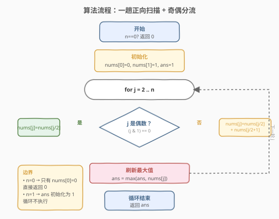
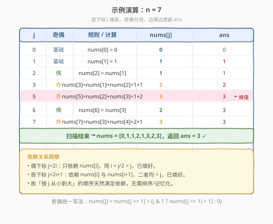

# 获取生成数组中的最大值

- **题目名称**：获取生成数组中的最大值
- **链接**：[1646. 获取生成数组中的最大值](https://leetcode.cn/problems/get-maximum-in-generated-array/)
- **难度**：简单
- **标签**：数组、模拟、动态规划

## 1. 题目概述

给定一个整数 `n`，按下述规则生成长度为 `n + 1` 的数组 `nums`，并返回其中的**最大整数**：

- `nums[0] = 0`
- `nums[1] = 1`
- 当 `2 <= 2 * i <= n` 时，`nums[2 * i] = nums[i]`
- 当 `2 <= 2 * i + 1 <= n` 时，`nums[2 * i + 1] = nums[i] + nums[i + 1]`

> 💡 换个角度：把生成规则按**目标下标** `j` 重写——偶数下标 `j = 2i` 复制 `nums[j/2]`；奇数下标 `j = 2i+1` 取 `nums[j/2] + nums[j/2+1]`。两种情形依赖的都是**比 `j` 更小的下标**，所以从 `j=2` 起一趟正向扫描即可填满整表。

**示例 1**：

```text
输入：n = 7
输出：3
解释：nums = [0,1,1,2,1,3,2,3]，最大值为 3。
```

**示例 2**：

```text
输入：n = 2
输出：1
解释：nums = [0,1,1]，最大值为 1。
```

**示例 3**：

```text
输入：n = 3
输出：2
解释：nums = [0,1,2]，最大值为 2。
```

**约束条件**：

- `0 <= n <= 100`

## 2. 解题思路

### 2.1 暴力思路：按题面枚举 i 两路写入

照题面字面意思，外层枚举 `i`，在内层分别处理 `2*i` 与 `2*i+1` 两个目标位置。写法正确但**分支冗长**：要分别判断 `2*i`、`2*i+1` 是否越界，且循环上界需取 `n/2`。本质上是把「一个目标下标对应一条规则」这件干净的事，拆成了「一个源头下标对应两条规则」，循环结构不够直接。

### 2.2 核心观察：按下标 j 正向扫描 + 奇偶分流

![核心概念：按下标奇偶分两种规则生成 nums[j]](../images/getmaxgen_concept.svg)

关键洞察是把视角从「**源头** `i`」切换到「**目标** `j`」：每个待填位置 `j` 恰好对应一条规则，由 `j` 的奇偶决定。

- **偶下标** `j = 2i`：`nums[j] = nums[j/2]`（直接复制一半处的值）；
- **奇下标** `j = 2i+1`：`nums[j] = nums[j/2] + nums[j/2+1]`（相邻两值之和）。

两种情形依赖的下标 `j/2`、`j/2+1` 都**严格小于** `j`（`j >= 2` 时 `j/2+1 <= j`），因此**按 `j` 从小到大**的顺序天然满足依赖——无需递归、无需记忆化、无需排序，一趟 `for` 循环填表即可。

> ⚠️ **为何 `j/2+1` 一定已填好？** 对 `j >= 2`，`j/2+1 <= j` 恒成立（`j=2` 时取等，但 `j=2` 是偶数走复制分支用不到 `j/2+1`；用到它的最小奇数 `j=3` 满足 `3/2+1 = 2 < 3`）。所以扫描到 `j` 时所需的前置值都已就位。

> 💡 **边填边维护最大值**：既然要的是 `max(nums)`，不必等表填完再扫第二趟——每写入一个 `nums[j]` 就顺手 `ans = max(ans, nums[j])`，把两趟合一趟。

### 2.3 算法流程图



```text
1. 若 n == 0：返回 0（只有 nums[0]=0）
2. nums[0] = 0, nums[1] = 1, ans = 1
3. for j = 2 .. n:
     a. 若 j 为偶数：nums[j] = nums[j / 2]
     b. 若 j 为奇数：nums[j] = nums[j / 2] + nums[j / 2 + 1]
     c. ans = max(ans, nums[j])
4. 返回 ans
```

### 2.4 示例演算



以 `n = 7` 为例，按下标 `j` 从 `0` 到 `7` 填表，标注每步的奇偶分支与 `ans` 变化：

| j | 奇偶 | 计算 | nums[j] | ans |
|---|------|------|---------|-----|
| 0 | 基础 | `nums[0]=0` | 0 | 0 |
| 1 | 基础 | `nums[1]=1` | 1 | 1 |
| 2 | 偶 | `nums[2]=nums[1]` | 1 | 1 |
| 3 | 奇 | `nums[3]=nums[1]+nums[2]=1+1` | 2 | 2 |
| 4 | 偶 | `nums[4]=nums[2]` | 1 | 2 |
| 5 | 奇 | `nums[5]=nums[2]+nums[3]=1+2` | 3 | 3 ← 峰值 |
| 6 | 偶 | `nums[6]=nums[3]` | 2 | 3 |
| 7 | 奇 | `nums[7]=nums[3]+nums[4]=2+1` | 3 | 3 |

扫描结束 `nums = [0,1,1,2,1,3,2,3]`，返回 `ans = 3` ✓。注意 `j=5` 处 `ans` 首次达到 3，之后虽 `j=7` 也填出 3，但 `max` 不变。

## 3. 参考代码

### C++

```cpp
class Solution {
public:
    int getMaximumGenerated(int n) {
        if (n == 0) return 0;
        vector<int> nums(n + 1);
        nums[0] = 0;
        nums[1] = 1;
        int ans = 1;
        for (int j = 2; j <= n; ++j) {
            if (j & 1) nums[j] = nums[j >> 1] + nums[(j >> 1) + 1];
            else       nums[j] = nums[j >> 1];
            ans = max(ans, nums[j]);
        }
        return ans;
    }
};
```

### Python

```python
class Solution:
    def getMaximumGenerated(self, n: int) -> int:
        if n == 0:
            return 0
        nums = [0] * (n + 1)
        nums[1] = 1
        ans = 1
        for j in range(2, n + 1):
            if j & 1:
                nums[j] = nums[j >> 1] + nums[(j >> 1) + 1]
            else:
                nums[j] = nums[j >> 1]
            ans = max(ans, nums[j])
        return ans
```

> 💡 **写法细节**：
> - **位运算分流**：`j & 1` 判奇偶，`j >> 1` 即 `j/2`（非负整数下等价），与题面 `2*i` / `2*i+1` 一一对应。
> - **边界 `n == 0`**：此时数组只有 `nums[0]=0`，循环不执行，直接返回 0；`n == 1` 时 `ans` 初始化为 1、循环同样不执行，返回 1。
> - **奇偶统一写法**（见演算图末行）：`nums[j] = nums[j>>1] + (nums[(j>>1)+1] if j&1 else 0)`，把两分支合并成一个表达式，偶数时多加的项为 0——可读性见仁见智，分流写法更显规则结构。

## 4. 复杂度分析

| 维度 | 复杂度 | 说明 |
|------|--------|------|
| 时间复杂度 | $O(n)$ | 单趟扫描 `j` 从 2 到 `n`，每步 $O(1)$ 奇偶分支与赋值 |
| 空间复杂度 | $O(n)$ | 需要长度 $n+1$ 的 `nums` 数组存储生成结果 |

> 💡 本题 $n \le 100$，$O(n)$ 绰绰有余。空间上若只求最大值理论上可压缩，但生成规则依赖**任意更小下标**（非滚动窗口），无法像一维 DP 那样滚动到 $O(1)$——保留整表是自然且必要的选择。

## 5. 扩展：奇偶统一的一行式写法

利用「偶数下标时 `nums[j/2+1]` 这项应贡献 0」的事实，可把两分支合并为单一表达式。设 $h = \lfloor j/2 \rfloor$：

$$
\text{nums}[j] = \text{nums}[h] + (j \bmod 2)\cdot \text{nums}[h+1]
$$

偶数时 $j \bmod 2 = 0$，第二项消失，退化为复制；奇数时 $j \bmod 2 = 1$，第二项生效，恰为求和。对应代码：

```cpp
class Solution {
public:
    int getMaximumGenerated(int n) {
        if (n == 0) return 0;
        vector<int> nums(n + 1, 0);
        nums[1] = 1;
        int ans = 1;
        for (int j = 2; j <= n; ++j) {
            int h = j >> 1;
            nums[j] = nums[h] + (j & 1) * nums[h + 1];
            ans = max(ans, nums[j]);
        }
        return ans;
    }
};
```

> 💡 **何时用统一式、何时用分流？** 统一式更紧凑、去掉了 `if-else`，适合追求精简；分流写法把两条规则显式写出，与题面表述一一对应，便于讲解和排查。面试中先写分流版讲清思路，再提一句「可合并为乘 0/1 的统一式」作为优化点，是不错的展示节奏。

## 6. 面试要点

**Q1：为什么按目标下标 `j` 扫描，而不是按题面的源头 `i`？**
> 题面按 `i` 枚举会每个 `i` 写两个位置（`2i`、`2i+1`），需分别判越界、循环上界取 `n/2`，分支冗长。按目标 `j` 扫描时，每个 `j` 恰好对应一条规则，循环就是「填满下标 0..n」，结构最直接——这是「换视角简化循环」的典型小技巧。

**Q2：如何保证扫描到 `j` 时 `nums[j/2]`、`nums[j/2+1]` 已就位？**
> 因为 $j/2 < j$ 且 $j/2+1 \le j$（对 $j \ge 2$ 恒成立）。按 `j` 递增扫描，所有更小下标都已先填好，依赖天然满足。这就是「拓扑序填充」：递推式只引用更小下标时，自然顺序即是合法填充序。

**Q3：`n=0` 和 `n=1` 的边界如何处理？**
> `n=0` 时数组仅 `[0]`，返回 0；代码中提前 `return 0`。`n=1` 时数组 `[0,1]`，循环 `for j=2..1` 不执行，`ans` 初始化为 1 即正确返回。两个边界都无需特殊循环逻辑，仅靠初始化与循环范围自然覆盖。

**Q4：能否不存整表、边算边丢来省空间？**
> 不能。生成规则依赖**任意更小下标**（如 `nums[7]` 依赖 `nums[3]`、`nums[4]`，并非仅依赖前一项），无法用滑动窗口保留常数个值。这是与「滚动一维 DP」（如 [70. 爬楼梯](../0001-0100/70_爬楼梯.md) 只依赖前两项）的本质区别——依赖结构决定了能否压缩空间。

**Q5：为什么边填边更新 `ans` 是安全的？**
> `ans` 维护的是「已填部分的最大值」，每写入一个 `nums[j]` 取 `max` 即可。由于最终答案是全表最大值，而每个元素都在被写入的瞬间纳入 `ans`，扫描结束时 `ans` 必为全局最大。把「填表」与「求最大」合并成一趟，省去第二趟 $O(n)$ 扫描。

## 7. 同类练习题

- [70. 爬楼梯](https://leetcode.cn/problems/climbing-stairs/)（[题解](../0001-0100/70_爬楼梯.md)）：一维递推只依赖前两项，可滚动到 $O(1)$ 空间——对照本题「依赖任意更小下标、必须留整表」的空间差异
- [509. 斐波那契数](https://leetcode.cn/problems/fibonacci-number/)（[题解](../0501-0600/509_斐波那契数.md)）：最经典的一维递推，同样按 `i` 从小到大填充，体会「拓扑序填充」的通用范式
- [118. 杨辉三角](https://leetcode.cn/problems/pascals-triangle/)（[题解](../0001-0100/118_杨辉三角.md)）：按下标递推填表，每项依赖更小下标的组合，与本题「按 j 正向扫描填表」同构
- [728. 自除数](https://leetcode.cn/problems/self-dividing-numbers/)：模拟生成 + 逐项判定收集结果，对照本题「边生成边维护最值」的模拟套路
- [1313. 解码编码的列表](https://leetcode.cn/problems/decompress-run-length-encoded-list/)：按规则展开生成数组，同样是「读懂生成规则、一趟模拟填表」的入门题
