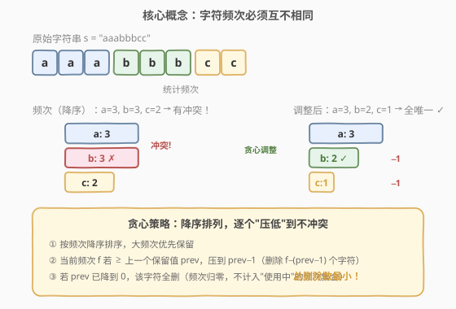
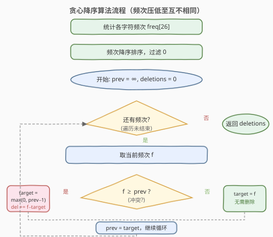
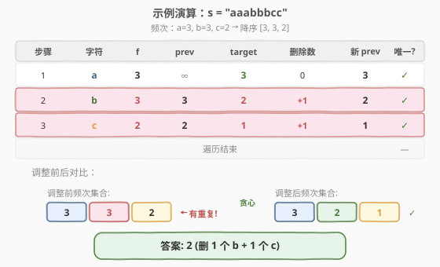

# 字符频次唯一的最小删除次数

- **题目名称**：字符频次唯一的最小删除次数
- **链接**：[1647. 字符频次唯一的最小删除次数](https://leetcode.cn/problems/minimum-deletions-to-make-character-frequencies-unique/)
- **难度**：中等
- **标签**：贪心、哈希表、排序

## 1. 题目概述

给定一个字符串 `s`，如果 `s` 中**没有两个不同字符的出现次数相同**，则称 `s` 是「好字符串」。每次操作可以删除 `s` 中的一个字符，问最少需要删除多少个字符才能使 `s` 变为好字符串。

> ⚠️ **注意**：频次为 0 的字符不参与比较——只有「出现过」的字符的频次才需要互不相同。

**示例 1**：

```text
输入：s = "aab"
输出：0
解释：a 出现 2 次，b 出现 1 次，频次 {2, 1} 已互不相同，无需删除。
```

**示例 2**：

```text
输入：s = "aaabbbcc"
输出：2
解释：a=3, b=3, c=2，频次 {3, 3, 2} 中 3 重复。
      删 1 个 b → b=2，但 c=2 也冲突，再删 1 个 c → c=1。
      最终频次 {3, 2, 1} 互不相同，共删除 2 个字符。
```

**示例 3**：

```text
输入：s = "ceabaacb"
输出：2
解释：a=3, b=2, c=2, e=1，频次 {3, 2, 2, 1} 中 2 重复。
      删 1 个 c → c=1，但 e=1 也冲突，再删 1 个 e → e=0（消失）。
      最终频次 {3, 2, 1} 互不相同，共删除 2 个字符。
```

**约束条件**：

- `1 <= s.length <= 10^5`
- `s` 仅含小写英文字母

---

## 2. 解题思路

### 2.1 暴力思路

枚举所有可能的删除方案（每个字符可以删 0 到 `freq[c]` 次），对每种方案检查频次是否互不相同，取删除数最小的方案。组合数呈指数级，必然不可行。

退一步：对每个频次冲突，逐一尝试减少哪个字符的频次。但这本质仍是搜索，没有利用问题的贪心结构。

### 2.2 核心观察：降序贪心压低



关键直觉是：**频次越大的字符越应该保留原值，频次小的字符更容易被压低到不冲突的值**。

将所有字符的频次按**降序排列**后，从大到小依次处理：

- 第一个（最大）频次 $f_1$ 直接保留，作为基准 `prev = f_1`。
- 对后续每个频次 $f$，若 $f \ge \text{prev}$，说明冲突，必须压低到 $\text{prev} - 1$（删除 $f - (\text{prev}-1)$ 个字符）；若 $f < \text{prev}$，则无需调整，`target = f`。
- 压低后的 `target` 不能为负——若 $\text{prev} = 0$，则该字符全部删除（频次归零，从频次集合中消失）。
- 更新 `prev = target`，继续处理下一个。

> 💡 **为什么降序贪心是最优的？** 降序排列保证每次处理的频次是当前最大的。大频次优先保留原值意味着「能不动就不动」，而压低操作总是把冲突值减到恰好不冲突的最大可能值（`prev - 1`），每次删除数最少。若把大频次压低而保留小频次，删除数只会更多——交换论证可严格证明。

### 2.3 算法流程图



算法步骤总结：

1. 统计每个字符的出现频次（长度 26 的数组或哈希表）。
2. 将频次**降序排序**，过滤掉 0。
3. 初始化 `prev = ∞`（或首个频次 + 1）、`deletions = 0`。
4. 遍历每个频次 $f$：
   - `target = min(f, prev - 1)`
   - 若 `target < 0`，则 `target = 0`
   - `deletions += f - target`
   - `prev = target`
5. 返回 `deletions`。

### 2.4 示例演算



以 `s = "aaabbbcc"` 为例，频次为 `a=3, b=3, c=2`，降序排列后 `[3, 3, 2]`：

| 步骤 | 字符 | $f$ | prev | target | 删除数 | 新 prev | 唯一? |
|------|------|-----|------|--------|--------|---------|-------|
| 1 | a | 3 | $\infty$ | 3 | 0 | 3 | ✓ |
| 2 | b | 3 | 3 | 2 | 1 | 2 | ✓ |
| 3 | c | 2 | 2 | 1 | 1 | 1 | ✓ |

最终频次集合 `{3, 2, 1}` 互不相同，总删除数 = 2。

> 💡 **频次归零的情况**：若频次为 `[5, 5, 5, 5, 5]`（5 个字符各出现 5 次），降序处理后 target 依次为 `5, 4, 3, 2, 1`，无需归零。但若频次为 `[3, 3, 3, 3, 3]`，target 依次为 `3, 2, 1, 0, 0`——第 4、5 个字符全部删除（频次归零，不参与频次集合），总删除 = `0+1+2+3+3 = 9`。

---

## 3. 参考代码

### C++

```cpp
class Solution {
public:
    int minDeletions(string s) {
        int freq[26] = {0};
        for (char c : s) {
            freq[c - 'a']++;
        }
        sort(freq, freq + 26, greater<int>());

        int deletions = 0;
        int prev = INT_MAX;
        for (int f : freq) {
            if (f == 0) break;
            int target = min(f, prev - 1);
            if (target < 0) target = 0;
            deletions += f - target;
            prev = target;
        }
        return deletions;
    }
};
```

### Python

```python
class Solution:
    def minDeletions(self, s: str) -> int:
        freq = sorted(Counter(s).values(), reverse=True)

        deletions = 0
        prev = float('inf')
        for f in freq:
            target = min(f, prev - 1)
            if target < 0:
                target = 0
            deletions += f - target
            prev = target
        return deletions
```

> ⚠️ **易错点**：
> 1. **`prev` 初始值**：必须设为 $\infty$（或大于最大频次的值），使第一个频次无需调整。若初始化为 0 或 1 会错误地压低第一个频次。
> 2. **`target < 0` 截断**：当 `prev` 已经降到 0 时，`prev - 1 = -1`，必须截断为 0，否则 `f - target` 会多算删除数。
> 3. **频次 0 不算冲突**：多个字符频次为 0 不违反「好字符串」定义，因为 0 表示该字符不存在。

---

## 4. 复杂度分析

| 维度 | 复杂度 | 说明 |
|------|--------|------|
| 时间复杂度 | $O(n + |\Sigma| \log |\Sigma|)$ | 统计频次 $O(n)$；排序 $O(|\Sigma| \log |\Sigma|)$；遍历 $O(|\Sigma|)$，其中 $|\Sigma| = 26$ |
| 空间复杂度 | $O(|\Sigma|)$ | 频次数组，$|\Sigma| = 26$ 为字符集大小 |

> 💡 由于字符集仅为 26 个小写字母，排序部分 $O(26 \log 26)$ 近似常数，整体时间复杂度由遍历字符串的 $O(n)$ 主导。

---

## 5. 扩展：哈希集合写法

除了降序排序 + `prev` 指针，还有一种等价的**哈希集合**写法：用 `seen` 集合记录已使用的频次，对每个频次不断递减直到不冲突或归零。

```cpp
class Solution {
public:
    int minDeletions(string s) {
        int freq[26] = {0};
        for (char c : s) freq[c - 'a']++;

        unordered_set<int> seen;
        int deletions = 0;
        for (int f : freq) {
            while (f > 0 && seen.count(f)) {
                f--;
                deletions++;
            }
            seen.insert(f);
        }
        return deletions;
    }
};
```

> 💡 **两种写法对比**：
> - **降序 + `prev`**：无需哈希集合，逻辑更紧凑；降序保证 `prev` 单调递减，每个频次最多压低到 0，总压低次数有上界。
> - **哈希集合**：不需要排序，但最坏情况下每个频次都要 `while` 循环递减多次。由于字符集仅 26 个，两种写法实际效率相当。
>
> 若字符集很大（如 Unicode），降序排序写法更优，因为 $O(|\Sigma| \log |\Sigma|)$ 远优于 $O(|\Sigma| \cdot \max\_freq)$。

---

## 6. 面试要点

1. **为什么降序排列是贪心的关键？**

   - 降序保证大频次优先保留原值。若改为升序，小频次先占位，大频次被迫大幅压低，删除数增多。降序时每个频次只需压到 `prev - 1`（恰好不冲突的最大值），删除数最小化。

2. **`prev` 为什么单调递减？**

   - 每个 `target = min(f, prev - 1) ≤ prev - 1 < prev`（当 `f ≥ prev` 时）或 `target = f < prev`（当 `f < prev` 时）。无论哪种情况，`prev` 严格递减，保证后续频次的可用空间不断收缩。

3. **频次归零怎么处理？**

   - 当 `prev` 降到 0 时，`prev - 1 = -1`，`target = max(0, -1) = 0`。该字符全部删除，`seen` 中插入 0（多个 0 不冲突，因为 0 表示字符不存在）。

4. **如果不排序直接用哈希集合会怎样？**

   - 也能得到正确答案（见第 5 节），但最坏时间复杂度从 $O(n)$ 退化到 $O(n + |\Sigma| \cdot \max\_freq)$。对于 26 个字母的字符集，差异不大。

5. **题目中「好字符串」的定义有什么坑？**

   - 频次为 0 不算冲突。如果两个字符都没出现（频次都为 0），字符串仍是好的。代码中过滤 0 频次或将其视为合法即可。

---

## 7. 同类练习题

- [451. 根据字符出现频率排序](https://leetcode.cn/problems/sort-characters-by-frequency/)：同样的频次统计，但目标是按频次降序重排字符串
- [347. 前 K 个高频元素](https://leetcode.cn/problems/top-k-frequent-elements/)：频次统计 + Top-K 筛选，桶排序或堆均可
- [387. 字符串中的第一个唯一字符](https://leetcode.cn/problems/first-unique-character-in-a-string/)：频次统计 + 首次出现查找，频次数组的经典应用
- [1481. 不同整数的最少数目](https://leetcode.cn/problems/least-number-of-unique-integers-after-k-removals/)：频次统计 + 贪心删除频次最小的整数，与本题的贪心删除思想相通
