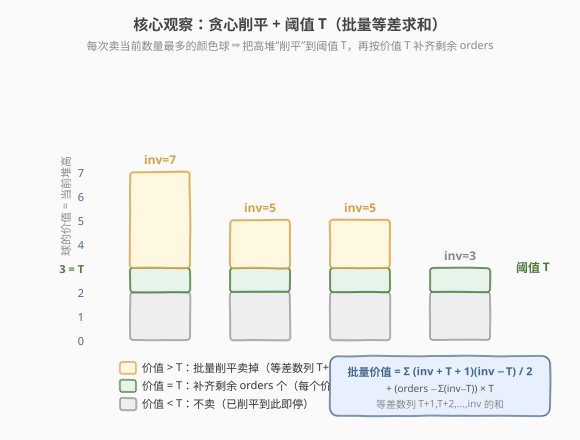
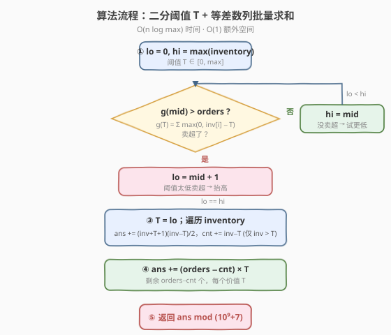
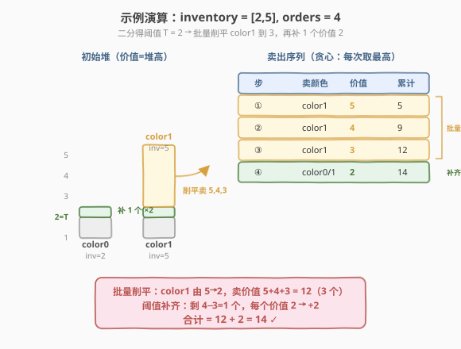

# 销售价值减少的颜色球

- **题目名称**：销售价值减少的颜色球
- **链接**：[1648. 销售价值减少的颜色球](https://leetcode.cn/problems/sell-diminishing-valued-colored-balls/)
- **难度**：中等
- **标签**：贪心、数组、数学、二分查找、堆（优先队列）

## 1. 题目概述

你有一系列颜色的球，用整数数组 `inventory` 表示，其中 `inventory[i]` 是第 `i` 种颜色球的数量。同色球外观相同。

客户每次购买时，任选一种颜色 `i`，你卖出该颜色一个球，**获得的收益等于卖出前该颜色球当前的数量**（即 `inventory[i]`），随后 `inventory[i]` 减 1。

给定整数 `orders` 表示要卖出的球总数，返回能获得的**最大总收益**，并对 $10^9+7$ 取模。

**示例 1**：

```text
输入：inventory = [2,5], orders = 4
输出：14
解释：
  卖 color1（5 个）得 5，inventory = [2,4]
  卖 color1（4 个）得 4，inventory = [2,3]
  卖 color1（3 个）得 3，inventory = [2,2]
  卖 color0 或 color1（2 个）得 2
  合计 5 + 4 + 3 + 2 = 14
```

**示例 2**：

```text
输入：inventory = [3,5], orders = 6
输出：19
解释：依次卖出 5,4,3,3,2,2，合计 19
```

**示例 3**：

```text
输入：inventory = [2,8,4,10,6], orders = 20
输出：110
```

**约束条件**：

- `1 <= inventory.length <= 10^5`
- `1 <= inventory[i] <= 10^9`
- `1 <= orders <= min(sum(inventory[i]), 10^9)`

> 💡 关键在于「卖出收益 = 当前堆高」，所以**越早卖高堆越划算**——这天然导向贪心：每次卖当前数量最多的颜色。难点是 `orders` 高达 $10^9$，必须把逐个卖出「批量压缩」成等差数列求和。

---

## 2. 解题思路

### 2.1 暴力思路：最大堆模拟

最直白的做法是大根堆模拟「每次取最大」：

```text
while orders > 0:
    v = heap.pop_max()
    ans += v
    heap.push(v - 1)
    orders -= 1
```

完全正确，但时间正比于 `orders`，最坏 $10^9$ 次 `pop/push`，必然超时。问题出在**把同一颜色连续下降的一串卖出拆成了一步一格**——而这一串其实是等差数列，可以一次性算掉。

### 2.2 核心观察：贪心削平 + 阈值 T



**贪心性**：由于「收益 = 当前堆高」，把高堆削一格的收益永远 $\ge$ 把低堆削一格。因此最优策略必然是**把所有高堆一路削平到同一水平**，绝无理由放着高堆去动低堆。这意味着卖出的价值序列是**从高到低连续取的**。

**阈值化**：设存在一个阈值 $T$，使得：

- 所有「价值 $> T$」的球**全部卖出**（把每个颜色从 `inventory[i]` 削到 $T+1$）；
- 再按价值 $T$ **补齐**剩余的 `orders − 已卖数` 个球。

为什么这样划分可行？定义单调递减函数

$$
g(T) = \sum_{i} \max(0,\ \text{inventory}[i] - T)
$$

即「把所有堆削到不超过 $T$（卖出价值 $T+1$ 到 `inventory[i]` 的全部球）所需卖出的球数」。$g$ 随 $T$ 增大而递减。我们要找**最小的 $T$ 使 $g(T) \le \text{orders}$**：

- 对这个 $T$，$g(T) \le \text{orders}$（削到 $T$ 没卖超），但 $g(T-1) > \text{orders}$（再削低一格就超了）。
- 于是先卖掉 $g(T)$ 个高价值球，再补 $\text{orders} - g(T)$ 个价值 $T$ 的球。

> ⚠️ **补齐的合法性**：$g(T-1) = g(T) + \#\{i : \text{inventory}[i] \ge T\}$。由 $g(T-1) > \text{orders}$ 得 $\#\{i : \text{inventory}[i] \ge T\} > \text{orders} - g(T)$，即价值 $T$ 处**有足够多颜色可补**，不会无球可卖。

**批量求和**：把颜色 $i$ 从 `inventory[i]` 削到 $T+1$，卖出价值 `inventory[i], inventory[i]-1, …, T+1`，是一个等差数列，和为

$$
\frac{(\text{inventory}[i] + T + 1)\,(\text{inventory}[i] - T)}{2}
$$

总收益为

$$
\text{ans} = \sum_{\text{inventory}[i] > T} \frac{(\text{inventory}[i] + T + 1)(\text{inventory}[i] - T)}{2} \;+\; (\text{orders} - g(T)) \times T
$$

### 2.3 算法流程图



流程要点：

1. **二分阈值**：`lo = 0, hi = max(inventory)`。对 `mid` 计算 $g(\text{mid})$，若 $g > \text{orders}$ 说明卖超、需抬高阈值（`lo = mid + 1`），否则尝试更低（`hi = mid`）。
2. **批量求值**：阈值 $T$ 确定后，遍历 `inventory`，对每个 `inv > T` 累加等差数列和，同时累计已卖数 `cnt`。
3. **阈值补齐**：`ans += (orders - cnt) * T`。
4. **取模返回**。

> 💡 **二分的方向感**：$g(T)$ 关于 $T$ 单调递减，因此「$g > \text{orders}$ ⇒ $T$ 偏小 ⇒ 抬高」，与「找满足条件的最小 $T$」一致。务必想清楚单调方向再写 `lo/hi` 移动，这是二分答案类题最易错的点。

### 2.4 示例演算

以 `inventory = [2,5], orders = 4` 为例：



**第一步：二分求 $T$**。计算 $g(T) = \max(0,2-T) + \max(0,5-T)$：

| $T$ | 5 | 4 | 3 | 2 | 1 |
|-----|---|---|---|---|---|
| $g(T)$ | 0 | 1 | 2 | 3 | 5 |

最小满足 $g(T) \le 4$ 的 $T$ 是 $2$（$g(2)=3 \le 4$，而 $g(1)=5 > 4$）。

**第二步：批量削平**。只有 `color1 (inv=5) > T=2`：

$$
\text{批量价值} = \frac{(5+2+1)(5-2)}{2} = \frac{8 \times 3}{2} = 12, \qquad \text{cnt} = 5 - 2 = 3
$$

对应卖出价值 $5, 4, 3$ 三个球（`color1` 由 5 削到 2）。

**第三步：阈值补齐**。剩余 `orders - cnt = 4 - 3 = 1` 个，每个价值 $T = 2$：

$$
\text{ans} = 12 + 1 \times 2 = 14 \;\checkmark
$$

> 💡 对照暴力模拟：本例恰好就是「卖 5、卖 4、卖 3、卖 2」四步——批量削平把前三步压成一个等差求和，第四步落在阈值补齐。验证 `inventory = [3,5], orders = 6`：$T=1$，批量 $\frac{(5+2)(5-1)}{2}+\frac{(3+2)(3-1)}{2}=14+5=19$，补齐 $0$ 个，合计 $19$ ✓。

---

## 3. 参考代码

### C++

```cpp
class Solution {
    const long long MOD = 1e9 + 7;
  public:
    int maxProfit(vector<int>& inventory, int orders) {
        int mx = *max_element(inventory.begin(), inventory.end());

        // 二分阈值 T：最小满足 g(T) = Σ max(0, inv[i]-T) <= orders 的 T
        long long lo = 0, hi = mx;
        while (lo < hi) {
            long long mid = lo + (hi - lo) / 2;
            long long g = 0;
            for (int v : inventory)
                g += max(0LL, (long long)v - mid);
            if (g > orders) lo = mid + 1;   // 卖超 → 抬高阈值
            else hi = mid;                  // 没卖超 → 尝试更低
        }
        long long T = lo;

        long long ans = 0, cnt = 0;
        for (int v : inventory) {
            if (v <= T) continue;
            long long a = (long long)v + T + 1, b = (long long)v - T;
            if (a % 2 == 0) a /= 2; else b /= 2;   // a*b 必为偶数，先除 2 再取模防溢出
            ans = (ans + (a % MOD) * (b % MOD)) % MOD;
            cnt += (long long)v - T;
        }
        long long rem = orders - cnt;
        ans = (ans + (rem % MOD) * (T % MOD)) % MOD;
        return (int)ans;
    }
};
```

### Python

```python
class Solution:
    def maxProfit(self, inventory: List[int], orders: int) -> int:
        MOD = 10**9 + 7
        lo, hi = 0, max(inventory)
        while lo < hi:
            mid = (lo + hi) // 2
            g = sum(v - mid for v in inventory if v > mid)
            if g > orders:
                lo = mid + 1        # 卖超 → 抬高阈值
            else:
                hi = mid            # 没卖超 → 尝试更低
        T = lo

        ans = 0
        cnt = 0
        for v in inventory:
            if v > T:
                ans += (v + T + 1) * (v - T) // 2   # 等差数列 T+1..v 求和
                cnt += v - T
        ans += (orders - cnt) * T                    # 阈值补齐
        return ans % MOD
```

> ⚠️ **C++ 溢出要点**：单项 $(\text{inv}+T+1)(\text{inv}-T)$ 最大约 $10^{18}$，仍在 `long long` 内；但 $n=10^5$ 项累加会溢出，必须**逐项取模**。除以 $2$ 不能在模意义下直接做（需乘法逆元），好在 $(\text{inv}+T+1)$ 与 $(\text{inv}-T)$ 必有一偶（二者奇偶性相反），**先把偶因子除 2 再各自取模相乘**即可规避。Python 原生大整数，无需此顾虑。

---

## 4. 复杂度分析

| 维度 | 复杂度 | 说明 |
|------|--------|------|
| 时间复杂度 | $O(n \log M)$ | 二分 $O(\log M)$ 轮（$M = \max(\text{inventory}) \le 10^9$，约 30 轮），每轮 $O(n)$ 计算 $g$；求值阶段再 $O(n)$ |
| 空间复杂度 | $O(1)$ | 仅常数额外变量，原地处理 `inventory` |

> 💡 $n = 10^5$、$\log M \approx 30$，总操作约 $3 \times 10^6$，轻松 AC。若把 `inventory` 排序后用前缀和计算 $g(T)$，可把单轮验证降到 $O(\log n)$，总复杂度 $O(n \log n + \log M \log n)$，但对本题约束并非必要。

---

## 5. 扩展：排序逐层削平（$O(n \log n)$）

除二分阈值外，还有一种**逐层削平**的写法：把 `inventory` 降序排序后，从最高堆开始，逐段把「当前最高的一组颜色」削到「次高」的高度，每段用等差数列一次性结算；当某段会卖超 `orders` 时停下，按段内等差 + 部分补齐结算。

```cpp
class Solution {
    const long long MOD = 1e9 + 7;
  public:
    int maxProfit(vector<int>& inventory, int orders) {
        sort(inventory.rbegin(), inventory.rend());
        inventory.push_back(0);          // 哨兵，保证最后一段必然触发
        long long ans = 0, sold = 0;
        for (int i = 0; i + 1 < (int)inventory.size() && sold < orders; i++) {
            long long h = inventory[i], nh = inventory[i + 1];
            long long cnt = i + 1;                            // 当前高度 >= h 的颜色数
            long long full = (h - nh) * cnt;                  // 把这组削到 nh 的总球数
            if (sold + full <= orders) {
                // 整段削平：每颜色贡献 h + (h-1) + ... + (nh+1)
                long long a = h + nh + 1, b = h - nh;         // a*b 必偶
                if (a % 2 == 0) a /= 2; else b /= 2;
                ans = (ans + (a % MOD) * (b % MOD) % MOD * (cnt % MOD)) % MOD;
                sold += full;
            } else {
                // 部分削平：先均匀削 k 整层，再每个颜色补 r 个
                long long need = orders - sold;
                long long k = need / cnt, r = need % cnt;
                // 削 k 层：每颜色贡献 h + (h-1) + ... + (h-k+1)
                long long a1 = h + (h - k + 1), b1 = k;
                if (a1 % 2 == 0) a1 /= 2; else b1 /= 2;
                ans = (ans + (a1 % MOD) * (b1 % MOD) % MOD * (cnt % MOD)) % MOD;
                // r 个颜色各补一层，价值 (h-k)
                ans = (ans + (r % MOD) * ((h - k) % MOD)) % MOD;
                sold = orders;
            }
        }
        return (int)ans;
    }
};
```

> 💡 **两种解法的关系**：二分阈值是「**先定值再统计**」，排序削平是「**边走边定值**」。前者实现更短、不易错；后者无需二分、一次遍历完成，但分支与边界更多。面试中二分阈值版更易讲清，推荐首选。

---

## 6. 面试要点

1. **为什么贪心「每次卖最高」是最优的？**

   - 收益 = 卖出前该颜色的当前数量，即「堆高」。把堆高为 $a$ 的颜色削一格收益 $a$，永远 $\ge$ 把堆高 $b < a$ 的颜色削一格收益 $b$。用交换论证：任何「放着高堆去动低堆」的方案，把这两次操作对调后总收益不降反增，故最优解必先削高堆。

2. **为什么不直接最大堆模拟？瓶颈在哪？**

   - 最大堆模拟正确但每步只卖一个球，时间 $O(\text{orders} \log n)$，而 $\text{orders} \le 10^9$ 必然超时。瓶颈在于**把同一颜色连续下降的一串卖出拆成了一格一格**——这串本质是等差数列，应当用求和公式批量结算。

3. **阈值 $T$ 的二分单调性如何确定？方向怎么写？**

   - $g(T) = \sum \max(0, \text{inv}[i] - T)$ 随 $T$ 增大而**单调递减**。要找「最小的 $T$ 使 $g(T) \le \text{orders}$」：若 $g(\text{mid}) > \text{orders}$ 说明 $T$ 偏小，`lo = mid + 1`；否则 `hi = mid`。**单调方向决定 lo/hi 移动方向**，写反会得到「最大满足 $g > \text{orders}$ 的 $T$」导致卖超。

4. **补齐阶段为什么一定有足够多的球可卖？**

   - 由 $g(T-1) > \text{orders}$ 且 $g(T-1) = g(T) + \#\{i : \text{inv}[i] \ge T\}$，得 $\#\{i : \text{inv}[i] \ge T\} > \text{orders} - g(T) = \text{需补齐数}$，即价值 $T$ 处的颜色数严格大于需补齐数，绝不会无球可卖。这是阈值划分可行的数学保证。

5. **C++ 取模时除以 2 为什么不能直接用模逆元？怎么处理？**

   - 可以用模逆元（乘 $2$ 在模 $10^9+7$ 下的逆元 $= (10^9+8)/2$ 的一半…实际为 $(MOD+1)/2 = 5 \times 10^8$），但更简单的是利用「$(\text{inv}+T+1)$ 与 $(\text{inv}-T)$ 奇偶性相反 ⇒ 必有一偶」，**先把偶因子除 2 再各自取模相乘**，既无溢出也无需逆元。Python 直接用 `//` 即可。

---

## 7. 同类练习题

- [875. 爱吃香蕉的珂珂](https://leetcode.cn/problems/koko-eating-bananas/)（[题解](../0801-0900/875_爱吃香蕉的珂珂.md)）：二分答案 + $O(n)$ 验证，同款「单调谓词二分 + 贪心验证」模板
- [410. 分割数组的最大值](https://leetcode.cn/problems/split-array-largest-sum/)（[题解](../0401-0500/410_分割数组的最大值.md)）：二分答案 + 贪心划分验证，二分阈值类题的母题
- [1011. 在 D 天内送达包裹的能力](https://leetcode.cn/problems/capacity-to-ship-packages-within-d-days/)（[题解](../1001-1100/1011_在D天内送达包裹的能力.md)）：二分答案 + 贪心验证，与本题同属「二分一个数值阈值再验证」范式
- [2530. K 次操作后的最大分数](https://leetcode.cn/problems/maximal-score-after-applying-k-operations/)：每次取最大值的堆贪心，与本题「每次卖最高」同源；堆模拟可直接过，对照本题的批量等差优化思路
