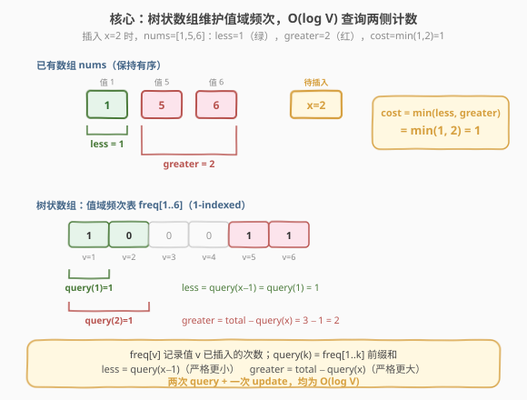
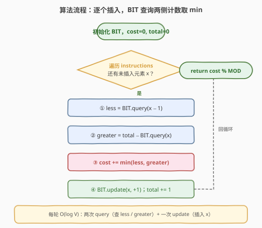

# LeetCode 通过指令创建有序数组 题解

## 1. 题目概述

- **标题 / 题号**：通过指令创建有序数组（#1649，hard）
- **链接**：https://leetcode.cn/problems/create-sorted-array-through-instructions/
- **难度**：困难
- **标签**：数组、树状数组、线段树

**题意**：给定一个整数数组 `instructions`，从左到右依次将其元素插入一个初始为空的有序数组 `nums`。每次插入的**代价**是以下两者的**较小值**：

- `nums` 中**严格小于** `instructions[i]` 的数字数目；
- `nums` 中**严格大于** `instructions[i]` 的数字数目。

返回将所有元素依次插入后的**总代价**，对 $10^9 + 7$ 取余。

**示例 1**：

```text
输入：instructions = [1,5,6,2]
输出：1
解释：
  插入 1，代价 min(0, 0) = 0，nums = [1]
  插入 5，代价 min(1, 0) = 0，nums = [1,5]
  插入 6，代价 min(2, 0) = 0，nums = [1,5,6]
  插入 2，代价 min(1, 2) = 1，nums = [1,2,5,6]
  总代价 = 0+0+0+1 = 1
```

**示例 2**：

```text
输入：instructions = [1,2,3,6,5,4]
输出：3
```

**示例 3**：

```text
输入：instructions = [1,3,3,3,2,4,2,1,2]
输出：4
```

**约束**：

- `1 <= instructions.length <= 10^5`
- `1 <= instructions[i] <= 10^5`

> 💡 本题的本质是**在线维护值域频次，对每个新元素查询「比它小的个数」与「比它大的个数」取 min**。值域 $[1, 10^5]$ 且元素逐个插入——这是**树状数组（BIT）**的招牌场景：用 $O(\log V)$ 完成一次频次查询与一次频次更新，总体 $O(n \log V)$。与 [315. 计算右侧小于当前元素的个数](../0301-0400/315_计算右侧小于当前元素的个数.md) 的 BIT 解法同源，只是查询方向从「右侧更小」变为「两侧计数取 min」。

## 2. 解题思路

### 2.1 暴力思路：逐个插入并线性扫描

最直白的做法：维护一个有序数组 `nums`，每次插入 `x` 时用二分找到插入位置，然后扫描统计左侧（严格小于）与右侧（严格大于）的元素个数。

```text
for x in instructions:
    pos = bisect(nums, x)
    less = pos                        # 左侧元素都 < x（bisect_left）或 <= x（bisect_right）
    greater = len(nums) - bisect_right(nums, x)
    cost += min(less, greater)
    nums.insert(pos, x)
```

> ⚠️ **致命缺陷**：$n \le 10^5$ 时，`list.insert` / `vector.insert` 在中间插入需搬移后续元素，单次 $O(n)$，总体 $O(n^2)$，必然超时。即便只统计个数不做实际插入，每次线性扫描也是 $O(n)$。必须找到能 $O(\log n)$ 同时完成「查询两侧计数」与「更新频次」的数据结构。

### 2.2 核心观察：树状数组维护值域频次



关键洞察在于**值域本身天然有序**：`instructions[i] ∈ [1, 10^5]`，把每个值当作下标，用一个频次数组 `freq[v]` 记录「值 `v` 已插入了多少次」。于是：

- **严格小于 `x` 的个数** = `freq[1] + freq[2] + ... + freq[x-1]` = 前缀和 `prefix(x-1)`；
- **严格大于 `x` 的个数** = `total - prefix(x)`，其中 `prefix(x) = freq[1] + ... + freq[x]`（即 $\le x$ 的个数），`total` 为当前已插入总数。

> 💡 **为什么 `greater = total - prefix(x)` 而非 `total - prefix(x-1)`？** `prefix(x)` 包含了所有 $\le x$ 的元素，即「小于 `x`」加上「等于 `x`」。用 `total` 减去它，恰好排除掉 $\le x$ 的部分，剩下的是严格大于 `x` 的元素。等于 `x` 的元素既不算「更小」也不算「更大」，必须排除在外。

频次表的「单点更新 + 前缀查询」正是**树状数组（Fenwick Tree / BIT）**的标准操作，二者均为 $O(\log V)$（$V$ 为值域上界）。本题 $V = 10^5$，$\log V \approx 17$，$n \log V \approx 1.7 \times 10^6$，远在时限内。

> ⚠️ **值域即下标，无需离散化**：本题 `instructions[i] ∈ [1, 10^5]` 全为正整数，可直接作为 BIT 的 1-indexed 下标。若值域含负数或过大（如 $10^9$），则需先离散化（排序去重 + `lower_bound` 映射），见 [315 题](../0301-0400/315_计算右侧小于当前元素的个数.md) 的 BIT 扩展解法。

### 2.3 算法流程图



流程要点：

1. **初始化**：BIT 大小取 `max(instructions)`（值域上界），`cost = 0`，`total = 0`。
2. **逐个遍历** `instructions` 中的 `x`：
   - `less = bit.query(x - 1)`：查 `freq[1..x-1]` 前缀和（严格更小）；
   - `greater = total - bit.query(x)`：`total` 减去 `freq[1..x]` 前缀和（严格更大）；
   - `cost += min(less, greater)`；
   - `bit.update(x, 1)`：把 `x` 的频次加一；
   - `total += 1`。
3. **返回** `cost % MOD`。

### 2.4 示例演算

![示例演算：instructions=[1,5,6,2] → 总代价=1](../images/sorted_arr_bit_walkthrough.svg)

以 `instructions = [1, 5, 6, 2]` 为例，值域上界取 6：

| 步 | x | nums（插入前） | less = query(x−1) | greater = total − query(x) | cost = min | BIT 频次表（插入后） |
|----|---|----------------|-------------------|---------------------------|------------|---------------------|
| ① | 1 | [] | query(0) = 0 | 0 − query(1) = 0 | 0 | freq[1]=1 |
| ② | 5 | [1] | query(4) = 1 | 1 − query(5) = 0 | 0 | freq[1]=1, freq[5]=1 |
| ③ | 6 | [1,5] | query(5) = 2 | 2 − query(6) = 0 | 0 | freq[1]=1, freq[5]=1, freq[6]=1 |
| ④ | 2 | [1,5,6] | query(1) = 1 | 3 − query(2) = 2 | **1** | freq[1]=1, freq[2]=1, freq[5]=1, freq[6]=1 |

总代价 = 0 + 0 + 0 + 1 = **1**，与示例一致。

> 💡 **步④是精髓**：插入 `2` 时，`less = query(1) = 1`（只有 `1` 比它小），`greater = 3 − query(2) = 2`（`5`、`6` 比它大）。取 `min(1, 2) = 1`：把 `2` 插到 `1` 之后只需移动 1 个更大元素，比插到 `5` 之前移动 2 个更省。这正是「代价取 min」的物理含义——**选搬动更少的一侧插入**。

## 3. 参考代码

### C++

```cpp
class BIT {
    vector<int> tree;
    int n;
  public:
    BIT(int n) : tree(n + 1), n(n) {}
    void update(int i, int delta) {
        for (; i <= n; i += i & (-i)) tree[i] += delta;
    }
    int query(int i) {
        int sum = 0;
        for (; i > 0; i -= i & (-i)) sum += tree[i];
        return sum;
    }
};

class Solution {
  public:
    int createSortedArray(vector<int>& instructions) {
        const int MOD = 1e9 + 7;
        int maxVal = *max_element(instructions.begin(), instructions.end());
        BIT bit(maxVal);
        long long cost = 0;
        int total = 0;
        for (int x : instructions) {
            int less = bit.query(x - 1);
            int greater = total - bit.query(x);
            cost += min(less, greater);
            bit.update(x, 1);
            ++total;
        }
        return cost % MOD;
    }
};
```

### Python

```python
class BIT:
    def __init__(self, n: int):
        self.n = n
        self.tree = [0] * (n + 1)

    def update(self, i: int, delta: int = 1) -> None:
        while i <= self.n:
            self.tree[i] += delta
            i += i & (-i)

    def query(self, i: int) -> int:
        s = 0
        while i > 0:
            s += self.tree[i]
            i -= i & (-i)
        return s


class Solution:
    def createSortedArray(self, instructions: List[int]) -> int:
        MOD = 10**9 + 7
        max_val = max(instructions)
        bit = BIT(max_val)
        cost = 0
        total = 0
        for x in instructions:
            less = bit.query(x - 1)
            greater = total - bit.query(x)
            cost += min(less, greater)
            bit.update(x)
            total += 1
        return cost % MOD
```

> 💡 **写法细节**：
> - **`cost` 用 `long long` / Python 大整数**：最坏情况每步代价 $\approx n/2$，总代价可达 $O(n^2) \approx 10^{10}$，超过 32 位 `int`（$2.1 \times 10^9$）。用 `long long` 存累加，最后统一 `% MOD`，避免每步取模拖慢速度。
> - **BIT 大小取 `max(instructions)` 而非固定 $10^5$**：值域上界动态确定，省一点空间。注意 BIT 内部 `tree` 数组大小为 `n + 1`（1-indexed，下标 0 不用）。
> - **`query(x - 1)` 当 `x = 1` 时**：`query(0)` 直接返回 0（循环条件 `i > 0` 不满足），无需特判。

## 4. 复杂度分析

| 维度 | 复杂度 | 说明 |
|------|--------|------|
| **时间复杂度** | $O(n \log V)$ | 遍历 $n$ 个元素，每轮两次 `query` + 一次 `update`，各 $O(\log V)$；$V = \max(\text{instructions}) \le 10^5$ |
| **空间复杂度** | $O(V)$ | BIT 的 `tree` 数组大小 $V + 1$；$V \le 10^5$ |

> 💡 本题 $n, V \le 10^5$，$n \log V \approx 1.7 \times 10^6$，远在时限内。若值域更大（如 $10^9$），需离散化把 $V$ 压到 $O(n)$，复杂度变为 $O(n \log n)$。

## 5. 扩展：线段树与平衡树

除树状数组外，以下数据结构也能 $O(\log V)$ 完成单点更新 + 区间求和：

- **线段树**：功能比 BIT 更强（支持区间更新、区间最值等），但常数更大、代码更长。本题只需单点更新 + 前缀求和，BIT 是最轻量的选择。
- **平衡树（如 `std::set` / Treap / SBT）**：C++ 的 `std::set` 不支持按值查询排名（`order_of_key`），需用 PBDS 的 `tree` 或手写平衡树。Python 无内置平衡树。综合来看 BIT 仍是首选。
- **权值线段树**：与 BIT 等价的频次维护方案，思路一致，代码量稍大。

> 💡 **BIT 的优势**：常数极小（`lowbit` 位运算 + 数组访问）、代码仅十几行、空间 $O(V)$ 无额外开销。在「单点更新 + 前缀查询」场景下，BIT 几乎总是最优选。

## 6. 面试要点

1. **为什么用树状数组？暴力法哪里不行？**

   - 暴力法每次插入需在有序数组中搬移元素（`insert` 是 $O(n)$），$n$ 次插入总体 $O(n^2)$，$n = 10^5$ 时必然超时。树状数组把「值」当 BIT 下标，用频次前缀和 $O(\log V)$ 同时完成「查询两侧计数」与「更新频次」，总体 $O(n \log V)$。

2. **`less` 和 `greater` 的公式怎么来的？**

   - `less = query(x - 1)`：`freq[1..x-1]` 前缀和 = 严格小于 `x` 的个数。
   - `greater = total - query(x)`：`query(x) = freq[1..x]` 是 $\le x$ 的个数，`total` 减去它 = 严格大于 `x` 的个数。等于 `x` 的元素被 `query(x)` 包含从而排除在 `greater` 之外，保证「严格」语义。

3. **为什么 `cost` 要用 `long long`？什么时候取模？**

   - 最坏情况（如严格递减序列）每步代价约 $n/2$，总代价 $\approx n^2/2 \approx 5 \times 10^9$，超过 `int`。用 `long long` 累加，最后统一 `% MOD`，避免每步取模的常数开销。Python 原生大整数无此问题。

4. **本题需要离散化吗？什么时候需要？**

   - 本题 `instructions[i] ∈ [1, 10^5]`，可直接作 BIT 下标，**无需离散化**。若值域含负数或上界达 $10^9$，需先排序去重再 `lower_bound` 映射到 $[1, m]$（$m$ 为不同值个数），把空间从 $O(V)$ 压到 $O(n)$。

5. **与 315 题（计算右侧小于当前元素的个数）的异同？**

   - **同**：都是树状数组维护值域频次，查询「比某值小的个数」。
   - **异**：315 题从右往左插入，查询的是「右侧更小」；本题从左往右插入，查询「两侧计数取 min」。315 需离散化（值域含负数），本题直接用原值。两者 BIT 的 `update`/`query` 模板完全一致。

## 同类练习题

| # | 题目 | 与本题的关联 |
|---|------|-------------|
| 315 | [计算右侧小于当前元素的个数](https://leetcode.cn/problems/count-of-smaller-numbers-after-self/)（[题解](../0301-0400/315_计算右侧小于当前元素的个数.md)） | BIT 维护值域频次的母题，从右往左插入查「右侧更小」，对照本题「两侧取 min」的查询方式 |
| 剑指 Offer 51 | [数组中的逆序对](https://leetcode.cn/problems/shu-zu-zhong-de-ni-xu-dui-lcof/)（[题解](../0101-0200/LCOF51_数组中的逆序对.md)） | BIT 求逆序对总数，掌握 `query`/`update` 模板后本题只需多查一次 `greater` |
| 493 | [翻转对](https://leetcode.cn/problems/reverse-pairs/) | BIT / 归并统计 `nums[i] > 2*nums[j]` 的对数，值域较大需离散化，是本题「频次统计」的进阶 |
| 327 | [区间和的个数](https://leetcode.cn/problems/count-of-range-sum/) | 前缀和 + BIT 统计区间和落在 `[lower, upper]` 内的子数组数，离散化 + 频次查询的综合应用 |
| 912 | [排序数组](https://leetcode.cn/problems/sort-an-array/)（[题解](../0901-1000/912_排序数组.md)） | 归并排序母题，理解分治统计后可对照 BIT 的「在线」统计方式 |
