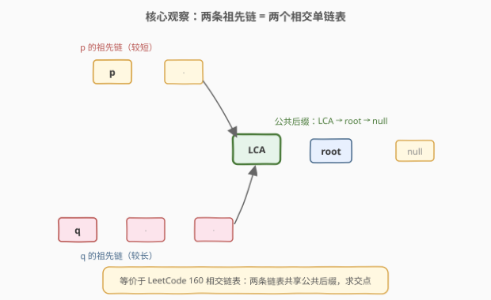
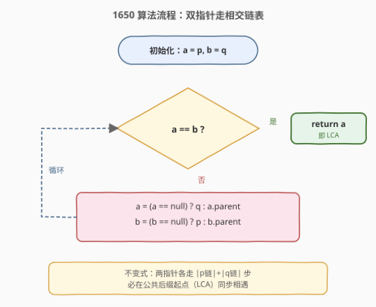
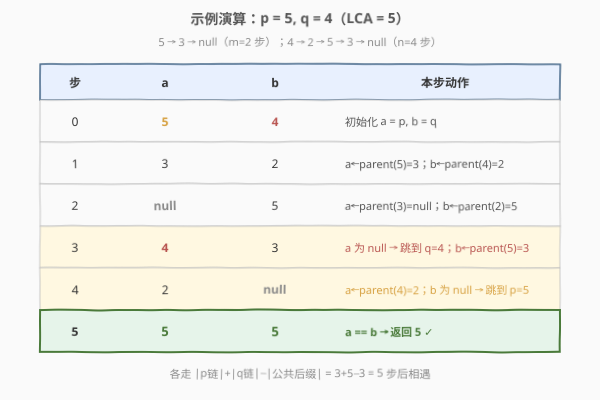

# LeetCode 二叉树的最近公共祖先 III 题解

## 1. 题目概述

- **标题 / 题号**：二叉树的最近公共祖先 III（#1650，medium）
- **链接**：https://leetcode.cn/problems/lowest-common-ancestor-of-a-binary-tree-iii/
- **难度**：中等
- **标签**：树、二叉树、双指针、哈希表

**题意**：给定二叉树中的两个节点 `p` 和 `q`，找到它们的**最近公共祖先**（LCA）。

**本题的关键区别**：每个节点都有一个 `parent` 指针指向其父节点；**不给出树的根节点** `root`。`p` 和 `q` **都保证存在**于树中。

节点定义：

```cpp
class Node {
public:
    int val;
    Node* left;
    Node* right;
    Node* parent;
};
```

**公共祖先 / 最近公共祖先**的定义与 [236. 二叉树的最近公共祖先](../0201-0300/236_二叉树最近公共祖先.md) 一致：若节点 `x` 是 `p` 的祖先（`p` 在 `x` 的子树中，含 `p == x`）且是 `q` 的祖先，则 `x` 是公共祖先；**最近**指深度最大的那个。

**示例 1**：

```text
输入：root = [3,5,1,6,2,0,8,null,null,7,4], p = 5, q = 1
输出：3
解释：节点 5 和 1 的最近祖先是 3。
```

**示例 2**：

```text
输入：root = [3,5,1,6,2,0,8,null,null,7,4], p = 5, q = 4
输出：5
解释：节点 5 是 4 的祖先，5 本身即最近公共祖先。
```

**约束**：

- 树中节点数目范围 `[2, 10^4]`
- `-10^9 <= Node.val <= 10^9`
- 所有 `Node.val` **互不相同**
- `p != q`，且 `p`、`q` **都存在**于树中

> ⚠️ **与 236 / 1644 的区别**：236 和 1644 给出 `root`、节点无 `parent` 指针，靠**自顶向下**的递归求 LCA；本题**不给 `root`**但每个节点能**向上回溯**到根。输入形式的变化让最优解法从"后序 DFS"变成"双指针走相交链表"，空间从 $O(h)$ 降到 $O(1)$。

## 2. 解题思路

### 2.1 暴力思路：哈希集合记录祖先链

最直白的做法：沿 `parent` 指针把 `p` 到根的**整条祖先链**存进哈希集合，再沿 `parent` 从 `q` 向上走，第一个出现在集合里的节点就是 LCA。

```text
seen = set()
cur = p
while cur != null:          // p 走到根
    seen.add(cur)
    cur = cur.parent
cur = q
while cur != null:          // q 向上找
    if cur in seen: return cur   // 第一个命中即 LCA
    cur = cur.parent
```

正确性：`p` 和 `q` 的祖先链在 LCA 处首次汇合，LCA 之上（含根）的部分两者共有；从 `q` 向上走，最先撞入 `seen` 的节点必定是 LCA。时间 $O(m+n)$（$m$、$n$ 为两条链长度），空间 $O(m)$。

> 💡 这个做法已经是一趟 $O(n)$ 时间，唯一不足是**需要 $O(h)$ 额外空间**存集合。能否做到 $O(1)$ 空间？

### 2.2 核心观察：转化为"相交链表"双指针



关键洞察：沿 `parent` 向上，`p` 和 `q` 各自构成一条**以 root 的 parent（`null`）为终点**的单链表。这两条链表共享从 **LCA 到 `null`** 的**公共后缀**——这正是 [160. 相交链表](https://leetcode.cn/problems/intersection-of-two-linked-lists/) 的模型：两条单链表共享一个公共尾段，求交点。

于是 160 题的经典双指针技巧直接搬过来：

- 指针 `a` 从 `p` 出发，指针 `b` 从 `q` 出发，各沿 `parent` 向上走；
- `a` 走到 `null`（链表末尾）时，**跳到 `q`** 重新开始走；`b` 走到 `null` 时，**跳到 `p`** 重新开始；
- 两者**必定在 LCA 相遇**。

> 💡 **为什么一定相遇？** 设 $|\text{p 链}|$、$|\text{q 链}|$ 为从 $p$、$q$ 沿 `parent` 走到 `null` 的**节点数**（含 `null`），$|\text{公共后缀}|$ 为 LCA 到 `null` 的节点数。把 `a` 的完整路径看成「p 链接 q 链」，`b` 的看成「q 链接 p 链」，两条完整路径长度都是 $|\text{p 链}|+|\text{q 链}|$。而 LCA 在两条完整路径中距起点的步数都等于 $|\text{p 链}|+|\text{q 链}|-|\text{公共后缀}|$，故 `a`、`b` **同步**到达 LCA，不会一前一后错过。

### 2.3 算法流程图



整个算法只有一个 `while` 循环：每轮比较 `a == b`，相等则返回；否则各前进一步，到 `null` 就跳到对方的起点。无递归、无栈、无额外容器。

### 2.4 示例演算



以示例 2 的 `p=5, q=4` 演示（`5.parent=3`，`4 → 2 → 5 → 3 → null`，LCA=5）。两条链长度不等，双指针需要"各跳一次"才能同步：

| 步 | a | b | 本步动作 |
|----|------|------|----------|
| 0 | 5 | 4 | 初始化 `a=p, b=q` |
| 1 | 3 | 2 | `a←parent(5)=3`；`b←parent(4)=2` |
| 2 | null | 5 | `a←parent(3)=null`；`b←parent(2)=5` |
| 3 | 4 | 3 | `a` 为 null → 跳到 `q=4`；`b←parent(5)=3` |
| 4 | 2 | null | `a←parent(4)=2`；`b` 为 null → 跳到 `p=5` |
| 5 | **5** | **5** | `a==b` → 返回 **5** ✓ |

`a` 在第 2 步到达 `null` 并跳到 `q`，`b` 在第 4 步到达 `null` 并跳到 `p`；两者恰在第 5 步于 LCA=5 相遇，与 $|\text{p 链}|+|\text{q 链}|-|\text{公共后缀}|=3+5-3=5$ 步吻合。

## 3. 参考代码

### C++

```cpp
/*
// Definition for a Node.
class Node {
public:
    int val;
    Node* left;
    Node* right;
    Node* parent;
};
*/
class Solution {
public:
    Node* lowestCommonAncestor(Node* p, Node* q) {
        Node* a = p;
        Node* b = q;
        while (a != b) {
            a = (a == nullptr) ? q : a->parent;
            b = (b == nullptr) ? p : b->parent;
        }
        return a;
    }
};
```

### Python

```python
"""
# Definition for a Node.
class Node:
    def __init__(self, val):
        self.val = val
        self.left = None
        self.right = None
        self.parent = None
"""

class Solution:
    def lowestCommonAncestor(self, p: 'Node', q: 'Node') -> 'Node':
        a, b = p, q
        while a is not b:
            a = q if a is None else a.parent
            b = p if b is None else b.parent
        return a
```

> ⚠️ **写法细节**：判断相遇必须用**同一性**比较——C++ 比指针相等（`a != b`）、Python 用 `is not`。LCA 判定依据是**节点同一**而非值相等，切勿改成 `a->val == b->val`，否则在值可能重复的变体里会出错（本题虽保证值互异，仍应按节点身份比较）。

## 4. 复杂度分析

| 维度 | 复杂度 | 说明 |
|------|--------|------|
| 时间复杂度 | $O(n)$ | 两指针各至多走 $\|\text{p 链}\|+\|\text{q 链}\|$ 步；而两条链长度之和 $\le 2n$（每条链长度不超过节点总数），故 $O(n)$ |
| 空间复杂度 | $O(1)$ | 仅用两个指针，无递归栈、无哈希集合 |

> 💡 **与 236 / 1644 的复杂度对比**：三者时间都是 $O(n)$；空间上 236/1644 需 $O(h)$ 递归栈，本题利用 `parent` 指针做到 $O(1)$。这正是"输入带 `parent` 指针"带来的红利——无需从根重新下探，直接沿父链上行。

## 5. 扩展：LCA 系列与"相交链表"的统一

LeetCode 的 LCA 四件套围绕"输入条件的变化"展开，最优解法随之改变：

| 题号 | 题目 | 输入条件 | 最优解法 | 空间 |
|------|------|----------|----------|------|
| [235](https://leetcode.cn/problems/lowest-common-ancestor-of-a-binary-search-tree/) | BST 的 LCA | BST + root | 利用有序性迭代 | $O(1)$ |
| [236](https://leetcode.cn/problems/lowest-common-ancestor-of-a-binary-tree/) | 二叉树的 LCA | root，保证存在 | 后序 DFS | $O(h)$ |
| [1644](../1601-1700/1644_二叉树的最近公共祖先II.md) | LCA II | root，**可能不存在** | 后序 DFS + 计数 | $O(h)$ |
| **1650** | LCA III | **parent 指针**，无 root | 双指针走相交链表 | $O(1)$ |

本题与 [160. 相交链表](https://leetcode.cn/problems/intersection-of-two-linked-lists/) 是**同一道题的不同包装**：把"沿 `next` 走两条单链表"换成"沿 `parent` 走两条祖先链"，算法一字不改。识别出这个模型映射，是本题的核心。

## 6. 面试要点

1. **本题和 236 题的区别是什么？为什么不用后序 DFS？**

   - 236 给 `root`、节点无 `parent`，只能从根自顶向下用后序 DFS。本题**不给 `root`**但每个节点带 `parent`，无法从根下探，却可以向上回溯。把两条向上的祖先链看成两个单链表，问题归约为"相交链表"，用双指针 $O(1)$ 空间解决，比 DFS 的 $O(h)$ 栈空间更优。

2. **双指针为什么一定在 LCA 相遇，而不会错过？**

   - 把 `a` 的完整路径看成「p 链接 q 链」、`b` 的看成「q 链接 p 链」，两条完整路径长度都是 $|\text{p 链}|+|\text{q 链}|$。LCA 在两条完整路径中距起点的步数都等于 $|\text{p 链}|+|\text{q 链}|-|\text{公共后缀}|$，故两者**同步**到达 LCA，不会一前一后错过。

3. **如果两个节点不在同一棵树里（不相交），算法会怎样？**

   - 两者都会在走完 $|\text{p 链}|+|\text{q 链}|$ 步后同时变为 `null`，循环条件 `a == b`（都为 `null`）成立，返回 `null`。即算法对"不相交"也能正确返回空。本题保证同树且都存在，不会触发，但这是该技巧鲁棒性的体现。

4. **暴力法（哈希集合）和双指针法怎么选？**

   - 渐近时间都是 $O(n)$。哈希集合代码更直白、易写对，但需 $O(h)$ 额外空间；双指针 $O(1)$ 空间且常数更小。面试建议先讲哈希集合法（展示归约思路），再优化到双指针并点出与 160 题的同构，体现模型识别能力。

5. **能否用"先求两链长度、长的先走差值步"的做法？**

   - 可以——先各走一遍测出 $m$、$n$，让长的先走 $|m-n|$ 步对齐，再同步上行直到相遇。这同样是 $O(n)$ 时间 $O(1)$ 空间，思路更"显式"。但需要两趟遍历且代码更长；双指针"走到尾就跳头"的写法只需一趟且更简洁，是更推荐的工程写法。

## 同类练习题

| # | 题目 | 与本题的关联 |
|---|------|-------------|
| 236 | [二叉树的最近公共祖先](https://leetcode.cn/problems/lowest-common-ancestor-of-a-binary-tree/)（[题解](../0201-0300/236_二叉树最近公共祖先.md)） | 无 parent 指针的母题，后序 DFS，对照本题的双指针 |
| 1644 | [二叉树的最近公共祖先 II](https://leetcode.cn/problems/lowest-common-ancestor-of-a-binary-tree-ii/)（[题解](../1601-1700/1644_二叉树的最近公共祖先II.md)） | p/q 可能不存在的变体，后序 DFS + 计数验证 |
| 235 | [二叉搜索树的最近公共祖先](https://leetcode.cn/problems/lowest-common-ancestor-of-a-binary-search-tree/) | BST 版本，利用有序性 $O(h)$ 迭代 |
| 160 | [相交链表](https://leetcode.cn/problems/intersection-of-two-linked-lists/) | 与本题同构的链表题，双指针"走到尾就跳头"模板的原型 |
| 1123 | [最深叶节点的最近公共祖先](https://leetcode.cn/problems/lowest-common-ancestor-of-deepest-leaves/) | LCA 的另一变体，目标节点由"最深叶节点"动态确定，后序 DFS 返回 `(深度, 节点)` |
