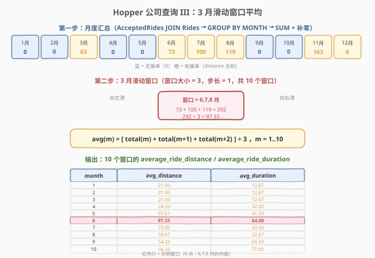
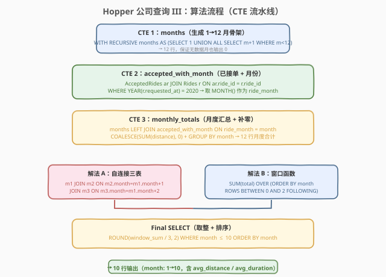
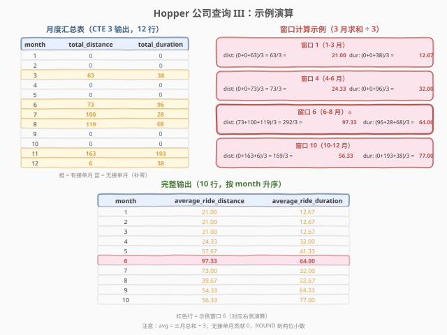

# LeetCode Hopper公司查询III 题解

## 1. 题目概述

- **标题 / 题号**：Hopper公司查询III（#1651，hard）
- **链接**：https://leetcode.cn/problems/hopper-company-queries-iii/
- **难度**：困难
- **标签**：数据库、SQL、`WITH RECURSIVE`、`LEFT JOIN`、`COALESCE`、`GROUP BY`、窗口函数 `SUM OVER`、自连接、`YEAR()`/`MONTH()`、`ROUND()`

**题意**：给定 `Drivers`（司机）、`Rides`（乘车请求）和 `AcceptedRides`（已接单）三张表，编写 SQL 查询，计算 **2020 年每个 3 个月滑动窗口**的 `average_ride_distance` 和 `average_ride_duration`，窗口从 **1–3 月**滑动到 **10–12 月**，共 **10 个窗口**。

1. **`average_ride_distance`**：窗口内三个月的 `ride_distance` 总和除以 3。
2. **`average_ride_duration`**：窗口内三个月的 `ride_duration` 总和除以 3。

结果按 `month`（窗口起始月，1 月 = 1，…，10 月 = 10）**升序**排列，`average_ride_distance` 和 `average_ride_duration` 四舍五入到**两位小数**。

**表结构**：

```text
Table: Drivers
+-------------+---------+
| Column Name | Type    |
+-------------+---------+
| driver_id   | int     |  ← 主键
| join_date   | date    |
+-------------+---------+
每位司机的 ID 与加入日期。（本题未使用，仅 schema 给定）

Table: Rides
+--------------+---------+
| Column Name  | Type    |
+--------------+---------+
| ride_id      | int     |  ← 主键
| user_id      | int     |
| requested_at | date    |
+--------------+---------+
每行一条乘车请求（含未被接受的）。

Table: AcceptedRides
+---------------+---------+
| Column Name   | Type    |
+---------------+---------+
| ride_id       | int     |  ← 主键（引用 Rides.ride_id）
| driver_id     | int     |
| ride_distance | int     |
| ride_duration | int     |
+---------------+---------+
每行一条已接单记录。
```

> ⚠️ **本题只用到 `Rides` 和 `AcceptedRides` 两张表**：`Rides` 提供 `requested_at`（请求日期，用于按月归属），`AcceptedRides` 提供 `ride_distance` / `ride_duration`（里程与时长）。`Drivers` 表在 schema 中给出但查询中不需要。

**示例 1**：

```text
Drivers 表:
+-----------+------------+
| driver_id | join_date  |
+-----------+------------+
| 10        | 2019-12-10 |
| 8         | 2020-1-13  |
| 5         | 2020-2-16  |
| 7         | 2020-3-8   |
| 4         | 2020-5-17  |
| 1         | 2020-10-24 |
| 6         | 2021-1-5   |
+-----------+------------+

Rides 表（2020 年部分）:
+---------+---------+--------------+
| ride_id | user_id | requested_at |
+---------+---------+--------------+
| 10      | 63      | 2020-3-4     |
| 19      | 39      | 2020-4-6     |
| 3       | 41      | 2020-6-3     |
| 13      | 52      | 2020-6-22    |
| 7       | 69      | 2020-7-16    |
| 17      | 70      | 2020-8-25    |
| 20      | 81      | 2020-11-2    |
| 5       | 57      | 2020-11-9    |
| 2       | 42      | 2020-12-9    |
+---------+---------+--------------+

AcceptedRides 表（2020 年部分）:
+---------+-----------+---------------+---------------+
| ride_id | driver_id | ride_distance | ride_duration |
+---------+-----------+---------------+---------------+
| 10      | 10        | 63            | 38            |
| 13      | 10        | 73            | 96            |
| 7       | 8         | 100           | 28            |
| 17      | 7         | 119           | 68            |
| 20      | 1         | 121           | 92            |
| 5       | 7         | 42            | 101           |
| 2       | 4         | 6             | 38            |
+---------+-----------+---------------+---------------+

输出:
+-------+-----------------------+-----------------------+
| month | average_ride_distance | average_ride_duration |
+-------+-----------------------+-----------------------+
| 1     | 21.00                 | 12.67                 |
| 2     | 21.00                 | 12.67                 |
| 3     | 21.00                 | 12.67                 |
| 4     | 24.33                 | 32.00                 |
| 5     | 57.67                 | 41.33                 |
| 6     | 97.33                 | 64.00                 |
| 7     | 73.00                 | 32.00                 |
| 8     | 39.67                 | 22.67                 |
| 9     | 54.33                 | 64.33                 |
| 10    | 56.33                 | 77.00                 |
+-------+-----------------------+-----------------------+
```

**解释**（以窗口 6 为例，覆盖 6/7/8 月）：

| 窗口 | 覆盖月份 | ride_distance 汇总 | ÷ 3 | ride_duration 汇总 | ÷ 3 |
|------|----------|-------------------|-----|-------------------|-----|
| 1 | 1, 2, 3 月 | 0+0+63 = 63 | 21.00 | 0+0+38 = 38 | 12.67 |
| 4 | 4, 5, 6 月 | 0+0+73 = 73 | 24.33 | 0+0+96 = 96 | 32.00 |
| 6 | 6, 7, 8 月 | 73+100+119 = 292 | 97.33 | 96+28+68 = 192 | 64.00 |
| 10 | 10, 11, 12 月 | 0+163+6 = 169 | 56.33 | 0+193+38 = 231 | 77.00 |

> 💡 **关键理解**：分母**始终为 3**（三个月），而非窗口内接单数。无接单的月份贡献 0 到分子，但分母不变。这不同于"按接单数取平均"——本题是对**时间窗口**取平均，不是对**单次骑行**取平均。

**约束**：

- `driver_id` 是 `Drivers` 表主键。
- `ride_id` 是 `Rides` 表和 `AcceptedRides` 表的主键。
- `AcceptedRides` 中的每条记录保证在 `Rides` 表中存在。
- 窗口从 1–3 月滑动到 10–12 月，共 10 个窗口，按起始月升序排列。
- 分母固定为 3，`ROUND` 到两位小数。

> 💡 本题是 SQL **"月度汇总 + 滑动窗口聚合"招牌题**——Hopper 公司查询系列的第三题（I → II → III）。承接 1635（Hopper I，月度计数）和 1645（Hopper II，月度均值）的三表 JOIN + 月度统计骨架，新增**定长滑动窗口**聚合层。核心难点：① 月度汇总需 LEFT JOIN 补零；② 滑动窗口可用**自连接三表**或**窗口函数 `SUM OVER`** 两种实现。

## 2. 解题思路

### 2.1 暴力思路：逐窗口查询拼接

最直觉的过程式思路：对 10 个窗口中的每一个，分别查询三个月的 `ride_distance` / `ride_duration` 总和，相加后除以 3。伪代码：

```text
for start_month m in 1..10:
    dist_sum = 0
    dur_sum  = 0
    for offset in 0..2:
        month = m + offset
        dist_sum += SUM(ride_distance) FROM AcceptedRides ar
                    JOIN Rides r ON ar.ride_id = r.ride_id
                    WHERE YEAR(r.requested_at)=2020 AND MONTH(r.requested_at)=month
        dur_sum  += SUM(ride_duration) FROM ... (同上)
    output(m, ROUND(dist_sum/3, 2), ROUND(dur_sum/3, 2))
```

但 SQL 没有显式 for 循环，且逐月查询会重复扫描表。核心挑战有三：

1. **生成 12 月骨架 + 月度汇总**：需要先把 2020 年 12 个月的 `ride_distance` / `ride_duration` 各自汇总成一行，无接单月补零。
2. **定长滑动窗口**：对 12 行月度数据，每次取连续 3 行求和再除以 3，产出 10 行。
3. **补零**：无接单月必须贡献 0（而非 NULL），否则 `SUM` 会忽略 NULL 导致结果偏小。

### 2.2 核心观察：两阶段分解 — 月度汇总 + 滑动窗口



**问题拆解为两个子问题**：

#### 子问题 ①：月度汇总（12 行）

先生成 1–12 月序列，再 LEFT JOIN 已接单数据，按月 `GROUP BY` + `SUM` + `COALESCE` 补零：

```sql
WITH RECURSIVE months(month) AS (
    SELECT 1
    UNION ALL
    SELECT month + 1 FROM months WHERE month < 12
),
accepted_with_month AS (
    SELECT ar.ride_distance, ar.ride_duration,
           MONTH(r.requested_at) AS ride_month
    FROM AcceptedRides ar
    JOIN Rides r ON ar.ride_id = r.ride_id
    WHERE YEAR(r.requested_at) = 2020
),
monthly_totals AS (
    SELECT m.month,
           COALESCE(SUM(a.ride_distance), 0) AS total_distance,
           COALESCE(SUM(a.ride_duration), 0) AS total_duration
    FROM months m
    LEFT JOIN accepted_with_month a ON a.ride_month = m.month
    GROUP BY m.month
)
```

> ⚠️ **为什么要 LEFT JOIN + COALESCE？** `accepted_with_month` 只返回有接单的月份（3、6、7、8、11、12 月共 6 行）。若用 INNER JOIN，其余 6 个月不会出现在结果中，后续滑动窗口会缺少行。LEFT JOIN 保留全部 12 行，`COALESCE(SUM(...), 0)` 把无接单月的 NULL 填为 0。

月度汇总结果（示例 1 数据）：

| month | total_distance | total_duration |
|-------|---------------|----------------|
| 1 | 0 | 0 |
| 2 | 0 | 0 |
| 3 | 63 | 38 |
| 4 | 0 | 0 |
| 5 | 0 | 0 |
| 6 | 73 | 96 |
| 7 | 100 | 28 |
| 8 | 119 | 68 |
| 9 | 0 | 0 |
| 10 | 0 | 0 |
| 11 | 163 | 193 |
| 12 | 6 | 38 |

#### 子问题 ②：3 月滑动窗口（10 行）

对 `monthly_totals` 的 12 行数据，每次取连续 3 行求和再除以 3。有两种实现：

**解法 A：自连接三表**（显式、易理解）

将 `monthly_totals` 自连接三份，用 `month + 1` / `month + 2` 对齐相邻月：

```sql
SELECT m1.month,
       ROUND((m1.total_distance + m2.total_distance + m3.total_distance) / 3, 2)
           AS average_ride_distance,
       ROUND((m1.total_duration + m2.total_duration + m3.total_duration) / 3, 2)
           AS average_ride_duration
FROM monthly_totals m1
JOIN monthly_totals m2 ON m2.month = m1.month + 1
JOIN monthly_totals m3 ON m3.month = m1.month + 2
WHERE m1.month <= 10
ORDER BY m1.month;
```

> 💡 **自连接的本质**：`m1` 是窗口起始月（1–10），`m2` 是次月（`m1.month + 1`），`m3` 是第三月（`m1.month + 1`）。三表 INNER JOIN 后，`m1.month ≤ 10` 保证窗口不越界（最大覆盖 10/11/12 月）。`JOIN ON month = m1.month + 1` 是"取下一个月"的标准自连接模式。

**解法 B：窗口函数**（简洁、现代 SQL）

用 `SUM() OVER (ORDER BY month ROWS BETWEEN CURRENT ROW AND 2 FOLLOWING)` 直接对当前行及后两行求和：

```sql
SELECT month,
       ROUND(SUM(total_distance) OVER w / 3, 2) AS average_ride_distance,
       ROUND(SUM(total_duration) OVER w / 3, 2) AS average_ride_duration
FROM monthly_totals
WINDOW w AS (ORDER BY month ROWS BETWEEN CURRENT ROW AND 2 FOLLOWING)
```

> ⚠️ **窗口函数 + WHERE 的陷阱**：窗口函数在 `WHERE` **之后**执行。若直接加 `WHERE month <= 10`，窗口函数只看到 10 行数据，month=10 的 `2 FOLLOWING` 会指向不存在的行（被 WHERE 过滤掉了），导致 month=10 的窗口只求了 1 个月的和而非 3 个月。**正确做法**：先用子查询/CTE 应用窗口函数（看到全部 12 行），再在外层 `WHERE month <= 10` 过滤。详见参考代码解法 B。

### 2.3 算法流程图



**逻辑执行步骤**：

| 步骤 | CTE / 子句 | 作用 | 输出行数 |
|------|-----------|------|----------|
| ① | `WITH RECURSIVE months` | 生成 1→12 月骨架 | 12 行 |
| ② | `accepted_with_month` | AcceptedRides JOIN Rides，取 MONTH() | 有接单月行数 |
| ③ | `monthly_totals` | LEFT JOIN + COALESCE + GROUP BY | 12 行（含补零） |
| ④ | 自连接 / 窗口函数 | 3 月滑动窗口求和 | 12 行（窗口函数）或 10 行（自连接） |
| ⑤ | `ROUND(…/3, 2)` + `WHERE month ≤ 10` | 除以 3、取整、过滤 | 10 行 |
| ⑥ | `ORDER BY month` | 按起始月升序 | 10 行 |

> 💡 **两阶段流水线**：第一阶段（①②③）把原始表汇总成 12 行月度数据，第二阶段（④⑤⑥）在月度数据上做滑动窗口。这种"先汇总再窗口"的分层思路是 SQL 时间序列题的通用范式。

### 2.4 示例演算

以示例 1 的数据为例，观察月度汇总与滑动窗口计算过程：



**阶段 ①②③：月度汇总**

将 `AcceptedRides` JOIN `Rides` 后按月分组，LEFT JOIN `months` 补零：

| month | 匹配的 ride_id | total_distance | total_duration |
|-------|---------------|---------------|----------------|
| 1 | — | 0 | 0 |
| 2 | — | 0 | 0 |
| 3 | 10 | 63 | 38 |
| 4 | — | 0 | 0 |
| 5 | — | 0 | 0 |
| 6 | 13 | 73 | 96 |
| 7 | 7 | 100 | 28 |
| 8 | 17 | 119 | 68 |
| 9 | — | 0 | 0 |
| 10 | — | 0 | 0 |
| 11 | 20, 5 | 121+42 = 163 | 92+101 = 193 |
| 12 | 2 | 6 | 38 |

> ride 19（4 月请求）未被接受，不出现在 `AcceptedRides` 中，故 4 月 total = 0。ride 3（6 月请求）同理。

**阶段 ④⑤：滑动窗口求和 + 除以 3**

以解法 A（自连接）为例，`m1` JOIN `m2` JOIN `m3` 产出 10 行：

| m1.month | m1.dist | m2.dist | m3.dist | 窗口和 | ÷ 3 | average_ride_distance |
|----------|---------|---------|---------|--------|-----|----------------------|
| 1 | 0 | 0 | 63 | 63 | 21.00 | 21.00 |
| 2 | 0 | 63 | 0 | 63 | 21.00 | 21.00 |
| 3 | 63 | 0 | 0 | 63 | 21.00 | 21.00 |
| 4 | 0 | 0 | 73 | 73 | 24.33 | 24.33 |
| 5 | 0 | 73 | 100 | 173 | 57.67 | 57.67 |
| 6 | 73 | 100 | 119 | 292 | 97.33 | 97.33 |
| 7 | 100 | 119 | 0 | 219 | 73.00 | 73.00 |
| 8 | 119 | 0 | 0 | 119 | 39.67 | 39.67 |
| 9 | 0 | 0 | 163 | 163 | 54.33 | 54.33 |
| 10 | 0 | 163 | 6 | 169 | 56.33 | 56.33 |

> 💡 **观察窗口 1/2/3**：三个月窗口的起始月不同，但覆盖的月份集合有重叠（都包含 3 月的 63），只是位置不同——`(0,0,63)`、`(0,63,0)`、`(63,0,0)` 的和都是 63，除以 3 都是 21.00。滑动窗口的特点是"窗口滑动但大小不变"。

## 3. 参考代码

### SQL（解法 A：CTE + 自连接三表，推荐）

```sql
WITH RECURSIVE months(month) AS (
    SELECT 1
    UNION ALL
    SELECT month + 1 FROM months WHERE month < 12
),
accepted_with_month AS (
    SELECT ar.ride_distance, ar.ride_duration,
           MONTH(r.requested_at) AS ride_month
    FROM AcceptedRides ar
    JOIN Rides r ON ar.ride_id = r.ride_id
    WHERE YEAR(r.requested_at) = 2020
),
monthly_totals AS (
    SELECT m.month,
           COALESCE(SUM(a.ride_distance), 0) AS total_distance,
           COALESCE(SUM(a.ride_duration), 0) AS total_duration
    FROM months m
    LEFT JOIN accepted_with_month a ON a.ride_month = m.month
    GROUP BY m.month
)
SELECT m1.month,
       ROUND((m1.total_distance + m2.total_distance + m3.total_distance) / 3, 2)
           AS average_ride_distance,
       ROUND((m1.total_duration + m2.total_duration + m3.total_duration) / 3, 2)
           AS average_ride_duration
FROM monthly_totals m1
JOIN monthly_totals m2 ON m2.month = m1.month + 1
JOIN monthly_totals m3 ON m3.month = m1.month + 2
WHERE m1.month <= 10
ORDER BY m1.month;
```

> 💡 **写法要点**：
> - **`WITH RECURSIVE months`**：递归 CTE 生成 1→12 的 12 行序列，是月度汇总补零的骨架。与 1635（Hopper I）完全相同的模板。
> - **`accepted_with_month`**：`AcceptedRides JOIN Rides` 取 `requested_at`，`WHERE YEAR = 2020` 筛选年份，`MONTH()` 提取月份。只保留 2020 年已接单记录。
> - **`monthly_totals`**：`months LEFT JOIN accepted_with_month` 保证 12 行，`COALESCE(SUM(...), 0)` 把无接单月的 NULL 填零。`GROUP BY m.month` 按月汇总。
> - **自连接**：`m1` JOIN `m2 ON m2.month = m1.month + 1` JOIN `m3 ON m3.month = m1.month + 2`，三份 `monthly_totals` 按"当前月 + 下个月 + 下下个月"对齐。`WHERE m1.month <= 10` 保证窗口不越界。
> - **`ROUND(…/3, 2)`**：三个月总和除以 3，四舍五入到两位小数。
> - ✓ **最推荐**：逻辑清晰、CTE 分层可读性强、自连接直观展示"滑动窗口 = 取连续 3 行"。

### SQL（解法 B：窗口函数 `SUM OVER`，简洁）

```sql
WITH RECURSIVE months(month) AS (
    SELECT 1
    UNION ALL
    SELECT month + 1 FROM months WHERE month < 12
),
accepted_with_month AS (
    SELECT ar.ride_distance, ar.ride_duration,
           MONTH(r.requested_at) AS ride_month
    FROM AcceptedRides ar
    JOIN Rides r ON ar.ride_id = r.ride_id
    WHERE YEAR(r.requested_at) = 2020
),
monthly_totals AS (
    SELECT m.month,
           COALESCE(SUM(a.ride_distance), 0) AS total_distance,
           COALESCE(SUM(a.ride_duration), 0) AS total_duration
    FROM months m
    LEFT JOIN accepted_with_month a ON a.ride_month = m.month
    GROUP BY m.month
),
windowed AS (
    SELECT month,
           ROUND(SUM(total_distance) OVER (ORDER BY month ROWS BETWEEN CURRENT ROW AND 2 FOLLOWING) / 3, 2)
               AS average_ride_distance,
           ROUND(SUM(total_duration) OVER (ORDER BY month ROWS BETWEEN CURRENT ROW AND 2 FOLLOWING) / 3, 2)
               AS average_ride_duration
    FROM monthly_totals
)
SELECT month, average_ride_distance, average_ride_duration
FROM windowed
WHERE month <= 10
ORDER BY month;
```

> 💡 **解法 B 的要点与陷阱**：
> - **`SUM(total_distance) OVER (ORDER BY month ROWS BETWEEN CURRENT ROW AND 2 FOLLOWING)`**：窗口函数对当前行及后两行求和，天然实现"3 月滑动窗口"。`ROWS BETWEEN CURRENT ROW AND 2 FOLLOWING` 定义了 3 行的窗口帧。
> - ⚠️ **窗口函数在 WHERE 之后执行**：若直接在 `monthly_totals` 查询中加 `WHERE month <= 10`，窗口函数只看到 10 行，month=10 的 `2 FOLLOWING` 不存在，导致结果错误。**必须**用子查询/CTE `windowed` 先在 12 行上应用窗口函数，再在外层 `WHERE month <= 10` 过滤。
> - **`WINDOW` 子句**：也可用 `WINDOW w AS (...)` 简化重复定义，但 LeetCode 环境兼容性建议直接内联。
> - **与解法 A 的关系**：逻辑等价。解法 A 用自连接显式展开 3 行，解法 B 用窗口函数一行搞定。解法 B 更简洁但需注意 WHERE 顺序陷阱。

### Python（pandas）

```python
import pandas as pd

def hopper_company_queries_iii(
    drivers: pd.DataFrame, rides: pd.DataFrame, accepted_rides: pd.DataFrame
) -> pd.DataFrame:
    months = pd.DataFrame({'month': range(1, 13)})

    rides['requested_at'] = pd.to_datetime(rides['requested_at'])
    accepted = accepted_rides.merge(rides[['ride_id', 'requested_at']], on='ride_id')
    accepted = accepted[accepted['requested_at'].dt.year == 2020]
    accepted['month'] = accepted['requested_at'].dt.month

    monthly = accepted.groupby('month').agg(
        total_distance=('ride_distance', 'sum'),
        total_duration=('ride_duration', 'sum')
    ).reset_index()

    monthly = months.merge(monthly, on='month', how='left').fillna(0)
    monthly['total_distance'] = monthly['total_distance'].astype(int)
    monthly['total_duration'] = monthly['total_duration'].astype(int)

    monthly['window_dist'] = (
        monthly['total_distance']
        + monthly['total_distance'].shift(-1)
        + monthly['total_distance'].shift(-2)
    )
    monthly['window_dur'] = (
        monthly['total_duration']
        + monthly['total_duration'].shift(-1)
        + monthly['total_duration'].shift(-2)
    )
    monthly['average_ride_distance'] = (monthly['window_dist'] / 3).round(2)
    monthly['average_ride_duration'] = (monthly['window_dur'] / 3).round(2)

    result = monthly[monthly['month'] <= 10][
        ['month', 'average_ride_distance', 'average_ride_duration']
    ].sort_values('month')
    return result.reset_index(drop=True)
```

> 💡 **pandas 对照**：
> - `pd.DataFrame({'month': range(1, 13)})` 对应 `WITH RECURSIVE months`——生成 1→12 骨架。
> - `accepted_rides.merge(rides, on='ride_id')` 对应 `AcceptedRides JOIN Rides`——取 `requested_at`。
> - `.dt.year == 2020` 对应 `WHERE YEAR = 2020`；`.dt.month` 对应 `MONTH()`。
> - `months.merge(monthly, how='left').fillna(0)` 对应 `LEFT JOIN + COALESCE`——无接单月补零。
> - `shift(-1)` / `shift(-2)` 对应自连接的 `m1.month + 1` / `m1.month + 2`——pandas 的负向 shift 取"未来行"，相当于 SQL 的 `FOLLOWING`。也可用 `rolling` 反向实现，但 `shift` 更直观。
> - `.round(2)` 对应 `ROUND(…, 2)`。

## 4. 复杂度分析

| 维度 | 解法 A（自连接） | 解法 B（窗口函数） | pandas |
|------|-----------------|-------------------|--------|
| **时间** | $O(r + a + 12^2)$ | $O(r + a + 12 \log 12)$ | $O(r + a)$ |
| **空间** | $O(12)$ | $O(12)$ | $O(r + a)$ |
| **滑动窗口实现** | 自连接 3 份 CTE | `SUM OVER ROWS 2 FOLLOWING` | `shift(-1) + shift(-2)` |
| **可读性** | ✓ 自连接直观 | ✓ 窗口函数简洁 | ✓ shift 直观 |
| **推荐度** | ✓ **首选**（无陷阱） | ✓ 备选（注意 WHERE 顺序） | ✓ 验证用 |

> - $r$ = `Rides` 表行数，$a$ = `AcceptedRides` 表行数。
> - **时间**：两解法第一、二、三阶段（生成 months、JOIN 取月、月度汇总）均为 $O(r + a)$。差异在第四阶段：解法 A 自连接 3 份 12 行表，$O(12^2) = O(144)$；解法 B 窗口函数排序 + 扫描，$O(12 \log 12)$。数据量极小（12 行），实际差异可忽略。
> - **空间**：CTE 物化 12 行 months + 12 行 monthly_totals，$O(12)$。pandas 需 $O(r + a)$ 存 DataFrame。
> - **索引优化**：`Rides(ride_id)` 和 `AcceptedRides(ride_id)` 上的主键索引使 JOIN 高效；`Rides(requested_at)` 上的索引可加速 `WHERE YEAR = 2020` 筛选（建议改用范围比较 `>= '2020-01-01' AND < '2021-01-01'` 以走索引，见 5.2 节）。

## 5. 扩展：滑动窗口的 SQL 实现方法对比

### 5.1 定长滑动窗口的三种实现

本题需要在 12 行月度数据上做"每次取连续 3 行求和"的定长滑动窗口。三种实现方式：

| 方法 | 语法 | 适用场景 | 优劣 |
|------|------|----------|------|
| **自连接** | `t1 JOIN t2 ON t2.month = t1.month + 1 JOIN t3 ON ...` | 任意 SQL 版本 | ✓ 直观、✗ 窗口大时连接数多 |
| **窗口函数** | `SUM(x) OVER (ORDER BY month ROWS BETWEEN 0 AND 2 FOLLOWING)` | MySQL 8.0+ / PostgreSQL | ✓ 简洁、✗ WHERE 顺序陷阱 |
| **相关子查询** | `(SELECT SUM(x) FROM monthly_totals WHERE month BETWEEN m AND m+2)` | 任意版本 | ✓ 通用、✗ 每行重复扫描 |

```sql
-- 方法 1：自连接（解法 A）
SELECT m1.month, ROUND((m1.d + m2.d + m3.d) / 3, 2) AS avg_d
FROM monthly_totals m1
JOIN monthly_totals m2 ON m2.month = m1.month + 1
JOIN monthly_totals m3 ON m3.month = m1.month + 2
WHERE m1.month <= 10;

-- 方法 2：窗口函数（解法 B）
SELECT month, ROUND(SUM(d) OVER (ORDER BY month ROWS BETWEEN CURRENT ROW AND 2 FOLLOWING) / 3, 2) AS avg_d
FROM monthly_totals;
-- 注意：需在外层 WHERE month <= 10 过滤

-- 方法 3：相关子查询
SELECT m.month,
       ROUND((SELECT SUM(d) FROM monthly_totals WHERE month BETWEEN m.month AND m.month + 2) / 3, 2) AS avg_d
FROM monthly_totals m
WHERE m.month <= 10;
```

> 💡 **选择建议**：MySQL 8.0+ 优先窗口函数（简洁）；教学/面试优先自连接（直观展示"取连续 N 行"的逻辑）；窗口大小可变时用相关子查询（`BETWEEN m AND m+k` 灵活调整 k）。本题窗口固定为 3，三种方法均可。

### 5.2 `YEAR()` / `MONTH()` 函数的索引陷阱

```sql
-- ⚠️ 索引不友好：函数作用于列上，索引失效
WHERE YEAR(r.requested_at) = 2020

-- ✓ 索引友好：范围比较，可走索引
WHERE r.requested_at >= '2020-01-01' AND r.requested_at < '2021-01-01'
```

> ⚠️ `YEAR(col)` / `MONTH(col)` 在列上套函数，数据库无法直接利用 `requested_at` 上的索引（需全表扫描后逐行计算函数值）。生产环境应改用**范围比较**（`>= 起始日 AND < 结束日`），让优化器走索引范围扫描。LeetCode 数据量小不影响，但面试时提到此优化可展示索引意识。本题与 1635（Hopper I）有完全相同的陷阱。

### 5.3 Hopper 系列 I → II → III 对比

| 维度 | 1635 Hopper I | 1645 Hopper II | 1651 Hopper III |
|------|--------------|----------------|-----------------|
| **输出行数** | 12 行（每月一行） | 12 行（每月一行） | 10 行（每窗口一行） |
| **指标类型** | 累积计数 + 分组计数 | 月度均值（AVG） | 滑动窗口平均（SUM÷3） |
| **用到的表** | Drivers + Rides + AcceptedRides | Rides + AcceptedRides | Rides + AcceptedRides |
| **月度汇总** | COUNT（计数） | AVG（均值） | SUM（求和） |
| **窗口聚合** | 无（每月独立） | 无（每月独立） | 3 月滑动窗口 |
| **核心模板** | LEFT JOIN + COALESCE 补零 | LEFT JOIN + COALESCE + AVG | LEFT JOIN + COALESCE + 滑动窗口 |

> 💡 **演进关系**：1635（I）→ 1645（II）→ 1651（III）是"月度计数 → 月度均值 → 窗口均值"的递进。三题共享前三层 CTE（months → accepted → monthly_totals），只是最后的聚合方式不同：I 用 COUNT，II 用 AVG，III 用 SUM + 滑动窗口。1651 在 II 的"月度均值"基础上升级为"3 月窗口均值"，把单月维度扩展到多月窗口维度。

### 5.4 `ROUND()` 的四舍五入行为

```sql
-- MySQL ROUND() 对 .5 的处理：银行家舍入 vs 传统舍入
ROUND(2.5, 0)   -- MySQL 8.0: 3（传统四舍五入）
ROUND(0.125, 2) -- MySQL 8.0: 0.13（传统四舍五入）
```

> 💡 MySQL 的 `ROUND()` 使用"远离零的方向"四舍五入（`ROUND(2.5) = 3`，`ROUND(-2.5) = -3`），而非银行家舍入（Banker's Rounding，`ROUND(2.5) = 2`）。本题示例中 `38/3 = 12.666…` 四舍五入为 `12.67`，`73/3 = 24.333…` 四舍五入为 `24.33`，均符合传统四舍五入。pandas 的 `.round()` 默认使用银行家舍入，在边界值（恰好 .5）上可能与 SQL 有微小差异，但本题数据不触发此边界。

## 6. 面试要点

1. **滑动窗口的分母为什么始终是 3 而不是窗口内接单数？**

   > 题目明确要求"summing up the total `ride_distance` values from the three months and dividing it by 3"。分母是**月数**（3），不是接单数。无接单月贡献 0 到分子，但分母不变。这是对**时间窗口**取平均（每月的"典型里程"），不是对**单次骑行**取平均。若分母用接单数，则无接单月会导致除零错误。

2. **解法 B 中为什么不能直接在 `monthly_totals` 上加 `WHERE month <= 10`？**

   > SQL 的逻辑执行顺序是 `FROM → WHERE → GROUP BY → HAVING → 窗口函数 → SELECT → ORDER BY`。窗口函数在 WHERE **之后**执行。若先 `WHERE month <= 10` 过滤掉 11、12 月，窗口函数只看到 10 行数据，month=10 的 `ROWS BETWEEN CURRENT ROW AND 2 FOLLOWING` 只能取到 month=10 自己（后两行不存在），导致结果错误。正确做法：用 CTE/子查询先在 12 行上应用窗口函数，再在外层 WHERE 过滤。

3. **自连接 `m2.month = m1.month + 1` 是什么意思？为什么不用 `>` 或 `BETWEEN`？**

   > `m2.month = m1.month + 1` 精确匹配"下一个月"。自连接三份表后，`m1`（当前月）+ `m2`（次月）+ `m3`（第三月）恰好覆盖 3 个月。若用 `m2.month > m1.month`，会产生多对多匹配（m1=1 匹配 m2=2..12 共 11 行），需要额外限制 `m2.month <= m1.month + 2`。等值条件 `= m1.month + 1` 最简洁且保证一对一匹配。

4. **为什么需要 `COALESCE(SUM(...), 0)` 而不是直接 `SUM(...)`？**

   > `LEFT JOIN` 后，无接单月没有匹配行，`SUM(ride_distance)` 返回 NULL。若不处理，`NULL + 73 + 100` 在 SQL 中结果为 NULL（NULL 传播），导致整个窗口和为 NULL。`COALESCE(SUM(...), 0)` 把 NULL 填为 0，确保无接单月贡献 0 到窗口和。注意 `COALESCE` 包裹在 `SUM` 外面（`COALESCE(SUM(x), 0)`），不是 `SUM(COALESCE(x, 0))`——前者处理"无行时 SUM 返回 NULL"，后者处理"某行 x 为 NULL"。

5. **本题与 1635（Hopper I）、1645（Hopper II）有什么关系？**

   > 三题共享相同的三表 schema 和"月度汇总 + 补零"骨架（`WITH RECURSIVE months` → `LEFT JOIN` → `COALESCE` → `GROUP BY`）。差异在聚合层：1635（I）输出 12 行月度计数（COUNT）；1645（II）输出 12 行月度均值（AVG）；1651（III）输出 10 行 3 月窗口均值（SUM + 滑动窗口）。1651 在 II 的月度均值基础上新增滑动窗口聚合层，是"单月统计 → 多月窗口"的升级。

> 💡 **一句话总结**：1651 是 SQL **"月度汇总 + 定长滑动窗口"招牌题**——核心模板「`WITH RECURSIVE months` → `LEFT JOIN + COALESCE` 月度汇总 → 自连接三表 / `SUM OVER` 窗口函数 → `ROUND(÷3, 2)`」。三大要点：**月度补零保完整性、滑动窗口两解法（自连接 vs 窗口函数）、WHERE 与窗口函数的执行顺序陷阱**。

## 同类练习题

| # | 题目 | 与本题的关联 |
|---|------|-------------|
| 1635 | [Hopper Company Queries I](https://leetcode.cn/problems/hopper-company-queries-i/)（[题解](../1601-1700/1635_Hopper公司查询I.md)） | 同表同骨架的前驱题——月度活跃司机数（累积计数）+ 接单数（分组计数），对照 1651 的滑动窗口平均，巩固"月度汇总 + LEFT JOIN 补零"模板 |
| 1645 | [Hopper Company Queries II](https://leetcode.com/problems/hopper-company-queries-ii/)（[题解](../1601-1700/1645_Hopper公司查询II.md)） | Hopper 系列第二题——月度均值（AVG），与 1651 的窗口均值对照：II 是"每月独立取平均"，III 是"3 月窗口取平均"，巩固 COUNT → AVG → SUM+窗口的演进 |
| 1321 | [餐厅营业额变化](https://leetcode.com/problems/restaurant-growth/) | `WITH RECURSIVE` + 窗口函数实现 7 天滚动和——同样是"生成序列 + 滑动窗口聚合"模式，窗口大小为 7 而非 3，对照自连接 vs 窗口函数两种实现 |
| 180 | [连续出现的数字](https://leetcode.cn/problems/consecutive-numbers/)（[题解](../0101-0200/180_连续出现的数字.md)） | `LEFT JOIN` 自连接取连续 3 行——与 1651 解法 A 的自连接三表同套路，`id = t1.id + 1` 对应 `month = m1.month + 1` |
| 1204 | [Web 开发者最后能进入的人数](https://leetcode.cn/problems/last-person-to-fit-in-the-bus/) | `SUM OVER` 累积和 + 条件筛选——窗口函数的另一种应用（累积和 vs 滑动窗口和），对照 `ROWS UNBOUNDED PRECEDING` 与 `ROWS 2 FOLLOWING` 的区别 |
